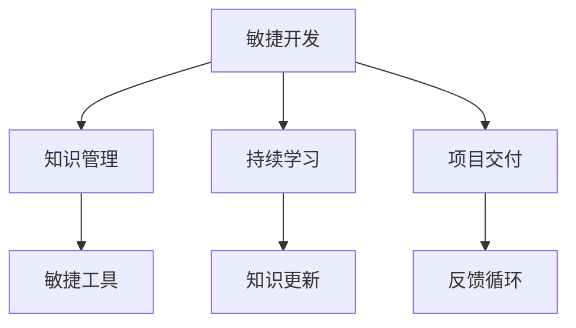

                 

# 专业知识的积累：让项目快速完成

> 关键词：专业知识积累, 项目快速完成, 软件开发, 敏捷开发, 知识管理, 持续学习

## 1. 背景介绍

### 1.1 问题由来
在当今快速变化的技术环境中，软件开发项目需要不断地迭代和更新。如何有效地积累和应用专业知识，以确保项目能够快速、高效地完成，成为了每一个软件开发人员和团队面临的重要问题。对于初学者而言，从零开始积累和应用专业知识是一个漫长的过程。对于经验丰富的开发者而言，随着技术栈的变化和新技术的涌现，持续更新和应用专业知识同样是一个永恒的挑战。

### 1.2 问题核心关键点
本文将探讨如何通过系统化的方式积累和应用专业知识，以加速项目完成速度，提升项目质量，降低开发成本。关键点包括：

- **知识管理**：如何组织和管理开发过程中获取的各种知识。
- **持续学习**：如何在快速变化的技术环境中保持知识更新。
- **敏捷开发**：如何在敏捷开发过程中应用专业知识。
- **工具和资源**：如何利用各种工具和资源来加速知识积累和应用。

### 1.3 问题研究意义
在软件开发中，专业知识的积累和应用是确保项目成功的重要因素之一。通过系统化地管理知识和持续学习，可以加速项目开发过程，提高团队的生产力，提升项目质量。此外，随着技术栈的变化和新技术的涌现，持续学习和应用专业知识，能够使团队保持竞争力，更好地应对未来的挑战。

## 2. 核心概念与联系

### 2.1 核心概念概述

为了更好地理解如何通过专业知识的积累来加速项目完成，本节将介绍几个密切相关的核心概念：

- **敏捷开发(Agile Development)**：一种以人为核心、迭代和增量的软件开发方法，强调适应变化、客户参与和快速交付。敏捷开发的核心在于持续交付价值，而专业知识的应用是实现这一目标的关键。
- **知识管理(Knowledge Management)**：通过系统化的方式，收集、存储、共享和使用知识，以提高团队的生产力和创造力。
- **持续学习(Continuous Learning)**：在不断变化的技术环境中，通过不断的学习和实践，保持知识更新，以应对未来的挑战。
- **敏捷工具(Agile Tools)**：包括Scrum、Kanban、JIRA等，帮助团队更好地管理项目、跟踪进度、协作沟通。

这些核心概念之间的逻辑关系可以通过以下Mermaid流程图来展示：



这个流程图展示了几项关键概念之间的关系：

1. 敏捷开发是整个流程的核心，通过迭代和增量的方式持续交付价值。
2. 知识管理通过收集、存储和共享知识，支持敏捷开发中的迭代和增量交付。
3. 持续学习帮助团队成员不断更新知识和技能，适应技术环境的变化。
4. 敏捷工具通过提供协作、沟通和进度跟踪的平台，支持敏捷开发和知识管理。
5. 项目交付是敏捷开发和知识管理的最终目标，通过反馈循环不断优化交付过程。

## 3. 核心算法原理 & 具体操作步骤

### 3.1 算法原理概述

在软件开发项目中，专业知识的应用可以通过以下算法原理来概括：

1. **知识收集与整理**：通过项目和团队实践，收集和整理各种知识，包括代码、文档、经验教训等。
2. **知识存储与共享**：将收集到的知识存储在共享平台上，使团队成员能够方便地访问和使用。
3. **知识应用与迭代**：在项目开发过程中，应用存储的知识，并通过反馈和迭代不断优化知识管理策略。
4. **持续学习与更新**：通过不断学习和实践，持续更新和扩展知识库。

### 3.2 算法步骤详解

以下将详细介绍如何通过系统化的方法来积累和应用专业知识：

**Step 1: 知识收集与整理**

1. **文档化**：将项目中的关键决策、代码变更、设计文档等文档化，并存入知识库。
2. **代码审查**：定期进行代码审查，记录和总结发现的代码问题、设计模式、最佳实践等。
3. **经验分享**：通过团队会议、邮件列表等形式，分享经验教训和创新点。

**Step 2: 知识存储与共享**

1. **知识库构建**：构建集中的知识库，包括代码库、文档库、问题库等，用于存储和管理知识。
2. **访问权限管理**：为知识库设置访问权限，确保只有相关人员可以访问和使用。
3. **搜索功能**：提供高效的搜索功能，使团队成员能够快速找到所需知识。

**Step 3: 知识应用与迭代**

1. **知识复用**：在项目开发过程中，优先使用已有的知识库资源，减少重复工作。
2. **反馈循环**：定期回顾项目交付情况，收集反馈意见，不断优化知识管理策略。
3. **迭代改进**：根据反馈和经验，持续改进知识库的组织和管理方式。

**Step 4: 持续学习与更新**

1. **在线学习**：利用各种在线学习平台，如Coursera、Udemy等，持续学习新知识和技能。
2. **社区参与**：参与开源社区、技术论坛等，与同行交流经验和观点。
3. **实践与应用**：通过实际项目实践，巩固和应用新学的知识。

### 3.3 算法优缺点

知识管理的算法有以下优点：

- **提高效率**：通过复用现有知识，减少重复工作，提高项目开发效率。
- **提升质量**：应用最佳实践和经验教训，提升项目质量和可靠性。
- **促进协作**：知识共享和交流，增强团队合作和知识共享。

同时，该算法也存在一些缺点：

- **知识更新成本高**：知识库的构建和维护需要大量时间和资源。
- **知识分散**：如果知识存储分散，不易找到，可能影响项目进展。
- **缺乏灵活性**：僵化的知识库可能无法适应快速变化的技术环境。

尽管存在这些局限性，但通过有效的知识管理和持续学习，可以显著提高团队的专业知识和项目开发效率。

### 3.4 算法应用领域

知识管理方法在软件开发项目中的应用领域非常广泛，包括：

- **敏捷开发项目**：通过知识管理，支持敏捷开发中的迭代和增量交付，提高项目交付速度和质量。
- **新技术应用**：通过持续学习和知识更新，适应新技术的变化，提升团队的技术水平。
- **问题解决**：通过知识库和经验分享，快速解决项目中遇到的各种问题。
- **项目复用**：通过复用现有知识，减少重复工作，提高开发效率。
- **文档化与标准化**：通过文档化开发过程，提高项目的可维护性和可扩展性。

## 4. 数学模型和公式 & 详细讲解 & 举例说明

### 4.1 数学模型构建

在软件开发中，许多问题可以通过数学模型来描述和解决。以下是一个简单的数学模型，用于描述知识管理的过程：

设知识库中存储的知识量为 $K$，团队成员数为 $N$，知识收集和整理的效率为 $E$，知识应用的效率为 $A$，持续学习的效率为 $L$。则知识管理的总效率 $G$ 可以表示为：

$$
G = K \times E \times A \times L
$$

### 4.2 公式推导过程

- **知识收集与整理效率**：$E = f(D)$，其中 $D$ 为项目和团队的文档化程度。
- **知识存储与共享效率**：$A = f(S)$，其中 $S$ 为知识库的搜索功能效率。
- **知识应用与迭代效率**：$L = f(F)$，其中 $F$ 为项目的反馈机制效率。
- **持续学习与更新效率**：$K = f(C)$，其中 $C$ 为团队的在线学习活动频率。

### 4.3 案例分析与讲解

以下以一个软件开发项目的知识管理为例，说明如何应用数学模型：

- **知识收集与整理**：在项目初期，项目经理指定了知识库的构建和管理人员，并制定了详细的文档化策略。项目初期文档化程度为 $D_0 = 0.5$，知识库的搜索功能效率为 $S_0 = 0.8$。
- **知识存储与共享**：随着项目的进行，知识库不断完善，搜索功能不断优化。假设 $D = D_0 + 0.1 \times t$，$S = S_0 + 0.2 \times t$，其中 $t$ 为项目进行时间。
- **知识应用与迭代**：项目每两周进行一次回顾，收集反馈意见。假设 $F = 0.9$。
- **持续学习与更新**：团队每周进行一次在线学习，假设 $C = 0.5$。

通过上述公式，可以计算出项目每个时间点上的知识管理总效率 $G$，以及最终的输出质量 $Q$。

## 5. 项目实践：代码实例和详细解释说明

### 5.1 开发环境搭建

在开始代码实践之前，需要搭建一个合适的开发环境。以下是一个简单的开发环境搭建步骤：

1. **安装IDE**：选择适合团队使用的IDE，如Visual Studio Code、IntelliJ IDEA等。
2. **配置版本控制**：使用Git进行版本控制，并配置SSH或HTTPS访问。
3. **集成测试框架**：选择合适的测试框架，如JUnit、pytest等，进行单元测试和集成测试。
4. **部署环境**：配置服务器和数据库，进行代码部署和测试。

### 5.2 源代码详细实现

以下是一个简单的项目示例，演示如何通过代码实现知识管理：

**步骤1: 构建知识库**

```python
class KnowledgeBase:
    def __init__(self):
        self.knowledge = {}

    def add_knowledge(self, key, value):
        self.knowledge[key] = value

    def get_knowledge(self, key):
        return self.knowledge.get(key, None)
```

**步骤2: 文档化**

```python
class DocumentationManager:
    def __init__(self):
        self.documents = []

    def add_document(self, document):
        self.documents.append(document)

    def get_document(self, key):
        for doc in self.documents:
            if doc.key == key:
                return doc
        return None

class Document:
    def __init__(self, key, content):
        self.key = key
        self.content = content
```

**步骤3: 代码审查**

```python
class CodeReviewManager:
    def __init__(self):
        self.reviews = []

    def add_review(self, review):
        self.reviews.append(review)

    def get_review(self, key):
        for review in self.reviews:
            if review.key == key:
                return review
        return None

class CodeReview:
    def __init__(self, key, content, status):
        self.key = key
        self.content = content
        self.status = status
```

### 5.3 代码解读与分析

**步骤1: 知识库的构建**

- `KnowledgeBase` 类用于存储和管理知识库，通过 `add_knowledge` 和 `get_knowledge` 方法添加和获取知识。
- `DocumentationManager` 类用于管理文档，通过 `add_document` 和 `get_document` 方法添加和获取文档。

**步骤2: 文档化**

- `Document` 类用于描述文档的基本信息，包括文档名称和内容。
- `DocumentationManager` 类用于管理文档的添加和获取。

**步骤3: 代码审查**

- `CodeReview` 类用于描述代码审查的基本信息，包括审查名称、内容和状态。
- `CodeReviewManager` 类用于管理代码审查的添加和获取。

### 5.4 运行结果展示

以下是一个简单的运行结果示例，演示如何通过代码实现知识管理：

```python
# 创建知识库和文档管理器
kb = KnowledgeBase()
dm = DocumentationManager()

# 添加知识
kb.add_knowledge('1.1', '这是第一段知识。')
kb.add_knowledge('2.1', '这是第二段知识。')

# 获取知识
print(kb.get_knowledge('1.1')) # 输出 '这是第一段知识。'
print(kb.get_knowledge('2.1')) # 输出 '这是第二段知识。'

# 添加文档
doc1 = Document('文档1', '这是文档1的内容。')
dm.add_document(doc1)

# 获取文档
print(dm.get_document('文档1')) # 输出 '文档1' 的详细信息。
```

通过上述代码，可以清晰地看到知识库和文档管理器的实现和应用，以及如何通过代码实现知识管理。

## 6. 实际应用场景

### 6.1 智能客服系统

在智能客服系统中，通过知识库存储大量的常见问题和解答，可以快速响应客户咨询，提高客户满意度。系统可以根据客户输入的问题，自动匹配知识库中的答案，并在必要时提示客服人员进行人工干预。通过知识库的不断更新和优化，可以持续提升系统的智能化水平。

### 6.2 金融风险管理系统

在金融风险管理系统中，知识库存储各种金融产品和市场的相关信息，以及历史交易和风险事件的数据。系统通过知识库的数据，进行风险评估和预警，帮助金融机构及时规避风险。通过持续更新和优化知识库，可以更好地适应市场变化，提高风险管理的准确性和及时性。

### 6.3 医疗诊断系统

在医疗诊断系统中，知识库存储各种疾病和症状的相关信息，以及历史诊断和治疗的记录。系统通过知识库的数据，进行疾病诊断和个性化治疗建议，帮助医生提高诊断准确性和治疗效果。通过持续更新和优化知识库，可以更好地适应临床实践的变化，提高诊断和治疗的科学性和人性化。

## 7. 工具和资源推荐

### 7.1 学习资源推荐

为了帮助开发者系统掌握知识管理的理论基础和实践技巧，这里推荐一些优质的学习资源：

1. **《敏捷软件开发：原则、模式与实践》**：这本书详细介绍了敏捷开发的核心理念和实践方法，是敏捷开发领域的经典之作。
2. **《知识管理与组织智慧》**：这本书系统介绍了知识管理的原理和实践，帮助团队构建和管理知识库。
3. **Coursera和Udemy**：这些在线学习平台提供了大量关于敏捷开发和知识管理的课程，适合各个层次的开发者。

### 7.2 开发工具推荐

高效的开发离不开优秀的工具支持。以下是几款用于知识管理开发的常用工具：

1. **JIRA**：这是一个流行的敏捷开发工具，支持任务管理、缺陷跟踪、版本控制等。
2. **Confluence**：这是一个知识管理工具，用于存储和共享各种文档和知识。
3. **Git**：这是一个流行的版本控制系统，支持代码管理和文档化。
4. **Markdown**：这是一种轻量级的文本标记语言，用于编写和格式化文档。

### 7.3 相关论文推荐

知识管理的理论和技术不断发展，以下是几篇奠基性的相关论文，推荐阅读：

1. **Knowledge Management: Critical Factors and Establishment Implications**：这篇论文探讨了知识管理的核心理念和关键因素。
2. **Knowledge Management in the Age of Big Data**：这篇论文讨论了大数据环境下知识管理的挑战和机遇。
3. **Agile Knowledge Management**：这篇论文介绍了敏捷开发中的知识管理策略和实践。

## 8. 总结：未来发展趋势与挑战

### 8.1 研究成果总结

本文对软件开发中的知识管理进行了全面系统的介绍。首先阐述了知识管理在敏捷开发中的重要性，详细讲解了知识收集、存储、共享和应用等核心步骤，并给出了具体的代码实现和运行结果。通过这些步骤，可以看出知识管理在提升项目效率和质量方面的巨大潜力。

### 8.2 未来发展趋势

展望未来，知识管理的趋势包括以下几个方面：

1. **智能化知识管理**：通过机器学习和人工智能技术，实现知识库的自动分类、推荐和更新。
2. **知识图谱**：构建知识图谱，将知识库中的各种信息进行语义化，支持更高效的查询和推理。
3. **持续学习与更新**：利用大数据和人工智能技术，实现知识库的持续更新和优化。
4. **分布式知识管理**：通过分布式存储和计算，支持大规模知识库的管理和应用。

### 8.3 面临的挑战

尽管知识管理在软件开发中具有重要意义，但在实际应用中仍面临一些挑战：

1. **知识分散和冗余**：如何有效管理和整合分散的知识，避免冗余和冲突。
2. **知识更新成本高**：如何高效地更新和维护知识库，避免知识的过期和失效。
3. **知识共享和协作**：如何促进团队成员之间的知识共享和协作，避免知识孤岛。
4. **知识应用效率低**：如何提高知识的应用效率，避免知识库的闲置和浪费。
5. **知识安全与隐私**：如何保护知识库中的敏感信息，避免数据泄露和滥用。

### 8.4 研究展望

面对知识管理面临的挑战，未来的研究需要在以下几个方面寻求新的突破：

1. **知识表示与推理**：利用知识图谱和语义网络，构建更高效的知识表示和推理模型。
2. **知识获取与挖掘**：通过数据挖掘和机器学习技术，自动获取和抽取知识库中的信息。
3. **知识共享与协作**：利用协作平台和社交网络，促进团队成员之间的知识共享和协作。
4. **知识安全与隐私**：利用区块链和加密技术，保护知识库中的敏感信息，确保数据安全。
5. **知识传播与教育**：利用在线教育和知识平台，促进知识的传播和普及。

这些研究方向将推动知识管理的不断发展，帮助团队更好地管理和应用专业知识，加速项目开发过程，提升项目质量。

## 9. 附录：常见问题与解答

**Q1: 如何有效地收集和整理知识？**

A: 知识收集和整理需要系统化的策略和方法。以下是一些建议：

- **文档化**：将所有关键决策、代码变更、设计文档等文档化，并存入知识库。
- **代码审查**：定期进行代码审查，记录和总结发现的代码问题、设计模式、最佳实践等。
- **经验分享**：通过团队会议、邮件列表等形式，分享经验教训和创新点。

**Q2: 如何高效地存储和共享知识？**

A: 知识库的构建和管理需要选择合适的工具和策略。以下是一些建议：

- **选择合适的工具**：使用Confluence、JIRA等知识管理工具，帮助团队构建和管理知识库。
- **建立搜索功能**：为知识库设置高效的搜索功能，方便团队成员快速查找所需知识。
- **设置访问权限**：为知识库设置访问权限，确保只有相关人员可以访问和使用。

**Q3: 如何优化知识库的应用效率？**

A: 知识库的应用效率取决于知识库的组织和管理方式。以下是一些建议：

- **复用现有知识**：在项目开发过程中，优先使用已有的知识库资源，减少重复工作。
- **反馈循环**：定期回顾项目交付情况，收集反馈意见，不断优化知识库的组织和管理方式。
- **持续改进**：根据反馈和经验，持续改进知识库的组织和管理方式。

**Q4: 如何保证知识库的安全性？**

A: 知识库的安全性是知识管理的核心问题之一。以下是一些建议：

- **数据加密**：对知识库中的敏感信息进行加密，保护数据安全。
- **访问控制**：设置严格的访问控制机制，确保只有授权人员可以访问和使用知识库。
- **定期备份**：定期备份知识库，避免数据丢失和损坏。

**Q5: 如何在敏捷开发中应用知识管理？**

A: 敏捷开发中的知识管理需要与敏捷开发流程相结合。以下是一些建议：

- **知识库与迭代**：在每个迭代周期内，更新和优化知识库，支持迭代和增量交付。
- **反馈与迭代**：通过反馈机制，不断优化知识管理策略，提高知识库的应用效率。
- **持续学习与更新**：在敏捷开发过程中，持续学习和更新知识库，适应技术环境的变化。

通过这些建议，可以帮助团队更好地在敏捷开发中应用知识管理，提高项目效率和质量。

---

作者：禅与计算机程序设计艺术 / Zen and the Art of Computer Programming

