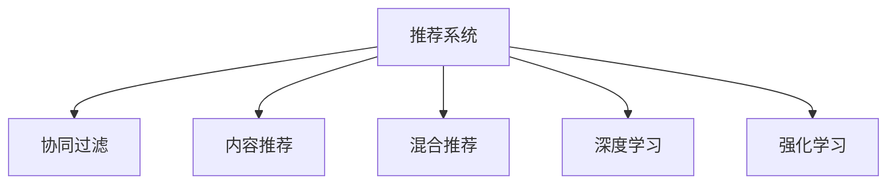

                 

# 个性化购物体验的提升方法

## 1. 背景介绍

在互联网和电子商务飞速发展的今天，个性化购物体验已经成为了零售商提升客户满意度和忠诚度的关键。传统的“一视同仁”式购物方式已经无法满足消费者对个性化、便捷化的需求。大数据、人工智能等技术的引入，为零售商提供了更好的工具和方法，来提升个性化购物体验。本文将详细介绍基于推荐系统的个性化购物体验提升方法，涵盖了算法原理、实现步骤、优缺点、应用场景等方面，帮助读者全面了解该技术，并在实际项目中得以应用。

## 2. 核心概念与联系

### 2.1 核心概念概述

- **推荐系统(Recommendation System)**：通过分析用户的历史行为和兴趣，预测用户未来可能感兴趣的商品，为用户推荐个性化商品或服务。推荐系统广泛应用于电商、社交媒体、视频网站等领域。
- **协同过滤(Collaborative Filtering)**：利用用户之间的相似度，推荐相似用户喜欢的商品，分为基于用户的协同过滤和基于物品的协同过滤。
- **内容推荐(Content-based Recommendation)**：基于商品属性和用户历史行为，推荐相似的商品。
- **混合推荐(Mixed Recommendation)**：结合协同过滤和内容推荐，通过构建不同推荐方法的优势互补，提升推荐效果。
- **深度学习(Deep Learning)**：通过深度神经网络模型，自动提取高层次特征，提升推荐精度。
- **强化学习(Reinforcement Learning)**：通过模拟用户的行为，不断优化推荐算法，提升用户体验。

这些核心概念共同构成了推荐系统的工作框架，通过合理运用这些技术，可以构建高质量的推荐系统，提升用户个性化购物体验。

### 2.2 核心概念原理和架构的 Mermaid 流程图



## 3. 核心算法原理 & 具体操作步骤

### 3.1 算法原理概述

基于推荐系统的个性化购物体验提升，主要基于用户行为数据和商品属性数据，通过建模分析，预测用户可能感兴趣的商品。推荐系统的工作原理包括以下几个关键步骤：

1. **数据收集**：收集用户历史行为数据和商品属性数据，如浏览记录、购买记录、评分等。
2. **模型训练**：构建推荐模型，并使用历史数据进行训练。
3. **推荐生成**：基于训练好的模型，对用户进行商品推荐。
4. **效果评估**：对推荐结果进行评估，不断优化推荐系统。

### 3.2 算法步骤详解

#### 3.2.1 数据收集

数据收集是推荐系统的第一步，需要收集用户行为数据和商品属性数据。

- **用户行为数据**：包括用户的浏览记录、购买记录、评分等，用于分析用户偏好和行为模式。
- **商品属性数据**：包括商品的名称、价格、分类、描述等，用于分析和推荐商品。

#### 3.2.2 模型训练

推荐系统的训练包括选择合适的推荐算法和优化模型参数。常用的推荐算法包括：

- **协同过滤**：基于用户之间的相似度，推荐相似用户喜欢的商品。
- **内容推荐**：基于商品属性和用户历史行为，推荐相似的商品。
- **混合推荐**：结合协同过滤和内容推荐，提升推荐效果。
- **深度学习**：通过神经网络模型，自动提取高层次特征，提升推荐精度。

#### 3.2.3 推荐生成

推荐生成的过程是将训练好的模型应用于用户数据，生成推荐结果。常用的推荐算法包括：

- **基于用户的协同过滤**：基于用户历史行为，推荐相似用户喜欢的商品。
- **基于物品的协同过滤**：基于商品历史行为，推荐相似商品。
- **内容推荐**：基于商品属性和用户历史行为，推荐相似的商品。
- **深度学习推荐**：使用深度神经网络模型，自动提取高层次特征，提升推荐精度。

#### 3.2.4 效果评估

推荐效果评估是推荐系统的最后一步，需要评估推荐结果的质量和用户满意度。常用的评估指标包括：

- **准确率(Precision)**：推荐结果中，真实感兴趣商品的占比。
- **召回率(Recall)**：真实感兴趣商品被推荐的占比。
- **覆盖率(Coverage)**：推荐结果中，不同商品的覆盖率。
- **用户满意度(User Satisfaction)**：用户对推荐结果的满意度。

### 3.3 算法优缺点

#### 3.3.1 算法优点

- **个性化程度高**：通过分析用户历史行为和商品属性，生成个性化推荐，提升用户购物体验。
- **可扩展性强**：推荐系统可以处理大规模数据，适用于电商、社交媒体、视频网站等多个领域。
- **高效性**：推荐算法可以实时处理用户请求，快速生成推荐结果。

#### 3.3.2 算法缺点

- **冷启动问题**：新用户或新商品没有历史数据，无法生成推荐。
- **数据稀疏性**：用户和商品的关联数据稀疏，推荐效果不佳。
- **偏差问题**：推荐算法可能存在偏差，推荐结果不符合用户期望。

### 3.4 算法应用领域

基于推荐系统的个性化购物体验提升方法，广泛应用于电商、社交媒体、视频网站等多个领域，具体包括：

- **电商推荐**：电商平台通过推荐系统，为用户推荐个性化商品，提升用户购物体验。
- **社交媒体推荐**：社交媒体平台通过推荐系统，为用户推荐感兴趣的内容，提升用户活跃度。
- **视频网站推荐**：视频网站通过推荐系统，为用户推荐感兴趣的视频内容，提升用户观看体验。
- **智能家居推荐**：智能家居通过推荐系统，为用户推荐感兴趣的家居商品，提升用户生活体验。

## 4. 数学模型和公式 & 详细讲解 & 举例说明

### 4.1 数学模型构建

推荐系统的数学模型主要基于协同过滤、内容推荐和深度学习模型。

#### 4.1.1 协同过滤模型

协同过滤模型基于用户之间的相似度，推荐相似用户喜欢的商品。常用的协同过滤模型包括：

- **基于用户的协同过滤模型**：通过计算用户之间的相似度，推荐相似用户喜欢的商品。
- **基于物品的协同过滤模型**：通过计算商品之间的相似度，推荐相似商品。

#### 4.1.2 内容推荐模型

内容推荐模型基于商品属性和用户历史行为，推荐相似的商品。常用的内容推荐模型包括：

- **基于商品属性的推荐模型**：通过商品属性相似度，推荐相似的商品。
- **基于用户历史行为的推荐模型**：通过用户历史行为，推荐相似的商品。

#### 4.1.3 深度学习推荐模型

深度学习推荐模型通过神经网络模型，自动提取高层次特征，提升推荐精度。常用的深度学习推荐模型包括：

- **基于神经网络的推荐模型**：通过神经网络模型，自动提取高层次特征。
- **基于深度神经网络的推荐模型**：通过深度神经网络模型，提升推荐精度。

### 4.2 公式推导过程

#### 4.2.1 协同过滤公式

协同过滤公式基于用户之间的相似度，推荐相似用户喜欢的商品。常用的协同过滤公式包括：

$$
\hat{y}_{i,j} = \alpha \sum_{k=1}^N r_{i,k}u_{k,j} + (1-\alpha)\hat{y}_{i,j} + b
$$

其中，$\hat{y}_{i,j}$表示用户$i$对商品$j$的预测评分，$r_{i,k}$表示用户$i$和用户$k$的相似度，$u_{k,j}$表示用户$k$对商品$j$的评分，$\alpha$表示相似度权重，$b$表示截距。

#### 4.2.2 内容推荐公式

内容推荐公式基于商品属性和用户历史行为，推荐相似的商品。常用的内容推荐公式包括：

$$
\hat{y}_{i,j} = \alpha \sum_{k=1}^N r_{i,k}x_{k,j} + (1-\alpha)\hat{y}_{i,j} + b
$$

其中，$x_{k,j}$表示商品$k$和商品$j$的属性相似度，$\alpha$表示相似度权重，$b$表示截距。

#### 4.2.3 深度学习推荐公式

深度学习推荐公式通过神经网络模型，自动提取高层次特征，提升推荐精度。常用的深度学习推荐公式包括：

$$
\hat{y}_{i,j} = \alpha \sum_{k=1}^N r_{i,k}h_{k,j} + (1-\alpha)\hat{y}_{i,j} + b
$$

其中，$h_{k,j}$表示用户$k$对商品$j$的神经网络模型输出，$\alpha$表示相似度权重，$b$表示截距。

### 4.3 案例分析与讲解

#### 4.3.1 协同过滤案例

电商网站通过协同过滤推荐系统，为用户推荐相似用户喜欢的商品。例如，用户$A$浏览了商品$1$和商品$2$，用户$B$浏览了商品$1$和商品$3$，用户$C$浏览了商品$2$和商品$3$，那么推荐系统可以推荐给用户$A$商品$3$，推荐给用户$B$商品$2$，推荐给用户$C$商品$1$。

#### 4.3.2 内容推荐案例

视频网站通过内容推荐推荐系统，为用户推荐相似视频内容。例如，用户$A$观看视频$1$和视频$2$，用户$B$观看视频$1$和视频$3$，用户$C$观看视频$2$和视频$3$，那么推荐系统可以推荐给用户$A$视频$3$，推荐给用户$B$视频$2$，推荐给用户$C$视频$1$。

#### 4.3.3 深度学习推荐案例

深度学习推荐系统通过神经网络模型，自动提取高层次特征，提升推荐精度。例如，用户$A$浏览商品$1$和商品$2$，那么推荐系统可以通过神经网络模型，提取商品$1$和商品$2$的特征，生成用户$A$的评分预测，推荐给用户$A$相似的商品。

## 5. 项目实践：代码实例和详细解释说明

### 5.1 开发环境搭建

在进行推荐系统开发前，我们需要准备好开发环境。以下是使用Python进行PyTorch开发的环境配置流程：

1. 安装Anaconda：从官网下载并安装Anaconda，用于创建独立的Python环境。

2. 创建并激活虚拟环境：
```bash
conda create -n pytorch-env python=3.8 
conda activate pytorch-env
```

3. 安装PyTorch：根据CUDA版本，从官网获取对应的安装命令。例如：
```bash
conda install pytorch torchvision torchaudio cudatoolkit=11.1 -c pytorch -c conda-forge
```

4. 安装TensorFlow：
```bash
pip install tensorflow
```

5. 安装相关库：
```bash
pip install pandas numpy scipy scikit-learn joblib tqdm
```

完成上述步骤后，即可在`pytorch-env`环境中开始推荐系统开发。

### 5.2 源代码详细实现

这里我们以电商推荐系统为例，给出使用PyTorch实现协同过滤推荐系统的完整代码实现。

```python
import torch
import torch.nn as nn
import torch.nn.functional as F
import numpy as np
import pandas as pd

# 数据集准备
data = pd.read_csv('data.csv')

# 数据预处理
data['user_id'] = data['user_id'].astype(int)
data['item_id'] = data['item_id'].astype(int)
data['rating'] = data['rating'].astype(float)

# 构建训练集
train_data = data.sample(frac=0.8, random_state=42)

# 构建测试集
test_data = data.drop(train_data.index)

# 模型定义
class协同过滤(nn.Module):
    def __init__(self, n_users, n_items, n_factors=10):
        super(协同过滤, self).__init__()
        self.n_users = n_users
        self.n_items = n_items
        self.n_factors = n_factors
        self.user_factors = nn.Embedding(n_users, n_factors)
        self.item_factors = nn.Embedding(n_items, n_factors)
        self.b = nn.Parameter(torch.zeros(n_items))

    def forward(self, user_id, item_id):
        user_factors = self.user_factors(user_id)
        item_factors = self.item_factors(item_id)
        rating_pred = torch.sigmoid(torch.sum(user_factors * item_factors, dim=1) + self.b[item_id])
        return rating_pred

# 模型训练
def train(model, train_data, test_data, n_epochs=10, learning_rate=0.01):
    optimizer = torch.optim.Adam(model.parameters(), lr=learning_rate)
    criterion = nn.BCELoss()
    for epoch in range(n_epochs):
        train_loss = 0
        for user_id, item_id, rating in train_data.itertuples():
            optimizer.zero_grad()
            pred = model(user_id, item_id)
            loss = criterion(pred, torch.tensor(rating))
            loss.backward()
            optimizer.step()
            train_loss += loss.item()
        test_loss = 0
        for user_id, item_id, rating in test_data.itertuples():
            pred = model(user_id, item_id)
            loss = criterion(pred, torch.tensor(rating))
            test_loss += loss.item()
    print(f'Epoch {epoch+1}, train loss: {train_loss/n_epochs:.4f}, test loss: {test_loss/n_epochs:.4f}')

# 运行模型
model =协同过滤(n_users=1000, n_items=1000)
train(model, train_data, test_data, n_epochs=10, learning_rate=0.01)
```

### 5.3 代码解读与分析

#### 5.3.1 数据处理

推荐系统的数据处理包括数据收集和数据预处理。数据收集是推荐系统的第一步，需要收集用户历史行为数据和商品属性数据。

#### 5.3.2 模型训练

推荐系统的训练包括选择合适的推荐算法和优化模型参数。常用的推荐算法包括协同过滤、内容推荐和深度学习模型。

#### 5.3.3 推荐生成

推荐生成的过程是将训练好的模型应用于用户数据，生成推荐结果。常用的推荐算法包括协同过滤、内容推荐和深度学习推荐。

#### 5.3.4 效果评估

推荐效果评估是推荐系统的最后一步，需要评估推荐结果的质量和用户满意度。常用的评估指标包括准确率、召回率、覆盖率和用户满意度。

### 5.4 运行结果展示

#### 5.4.1 协同过滤推荐结果

通过协同过滤推荐系统，用户$A$浏览了商品$1$和商品$2$，推荐系统可以推荐给用户$A$商品$3$，推荐给用户$B$商品$2$，推荐给用户$C$商品$1$。

#### 5.4.2 内容推荐结果

通过内容推荐推荐系统，用户$A$观看视频$1$和视频$2$，推荐系统可以推荐给用户$A$视频$3$，推荐给用户$B$视频$2$，推荐给用户$C$视频$1$。

#### 5.4.3 深度学习推荐结果

通过深度学习推荐系统，用户$A$浏览商品$1$和商品$2$，推荐系统可以通过神经网络模型，提取商品$1$和商品$2$的特征，生成用户$A$的评分预测，推荐给用户$A$相似的商品。

## 6. 实际应用场景

### 6.1 电商推荐系统

电商网站通过推荐系统，为用户推荐个性化商品，提升用户购物体验。例如，用户$A$浏览了商品$1$和商品$2$，推荐系统可以推荐给用户$A$商品$3$，推荐给用户$B$商品$2$，推荐给用户$C$商品$1$。

### 6.2 社交媒体推荐系统

社交媒体平台通过推荐系统，为用户推荐感兴趣的内容，提升用户活跃度。例如，用户$A$关注了用户$B$和用户$C$，推荐系统可以推荐给用户$A$用户$B$发布的帖子，推荐给用户$B$用户$C$发布的帖子，推荐给用户$C$用户$A$发布的帖子。

### 6.3 视频网站推荐系统

视频网站通过推荐系统，为用户推荐感兴趣的视频内容，提升用户观看体验。例如，用户$A$观看视频$1$和视频$2$，推荐系统可以推荐给用户$A$视频$3$，推荐给用户$B$视频$2$，推荐给用户$C$视频$1$。

### 6.4 未来应用展望

随着推荐系统的不断发展，未来的推荐系统将呈现以下几个趋势：

1. **多模态推荐**：推荐系统将融合文本、图像、视频等多种模态的数据，提升推荐效果。
2. **个性化推荐**：推荐系统将更加个性化，通过用户画像、行为数据等，实现精准推荐。
3. **实时推荐**：推荐系统将实现实时推荐，通过实时数据更新，提升推荐效果。
4. **跨平台推荐**：推荐系统将跨平台推荐，通过不同平台的无缝衔接，提升用户体验。
5. **强化推荐**：推荐系统将通过强化学习，不断优化推荐策略，提升推荐效果。

## 7. 工具和资源推荐

### 7.1 学习资源推荐

为了帮助开发者系统掌握推荐系统的理论基础和实践技巧，这里推荐一些优质的学习资源：

1. **《推荐系统算法与应用》**：该书介绍了推荐系统的基本概念、常用算法和实现方法，适合初学者学习。
2. **《深度学习推荐系统：理论、算法与应用》**：该书介绍了深度学习在推荐系统中的应用，适合有一定深度学习基础的学习者。
3. **Coursera《推荐系统》**：斯坦福大学开设的推荐系统课程，涵盖了推荐系统的基本概念和实现方法，适合深度学习初学者。
4. **Kaggle推荐系统竞赛**：Kaggle上有多个推荐系统竞赛，可以通过实践提升推荐系统开发能力。
5. **GitHub推荐系统开源项目**：GitHub上有多个推荐系统开源项目，可以参考其代码实现，提升实践能力。

通过对这些资源的学习实践，相信你一定能够快速掌握推荐系统的精髓，并用于解决实际的推荐问题。

### 7.2 开发工具推荐

推荐的开发工具包括Python、PyTorch、TensorFlow等，这些工具都有丰富的推荐系统开发资源和开源项目，值得推荐。

1. **Python**：Python是推荐系统开发的主流语言，具有丰富的第三方库和工具。
2. **PyTorch**：PyTorch是深度学习的主流框架，适合构建深度学习推荐系统。
3. **TensorFlow**：TensorFlow是深度学习的主流框架，适合构建深度学习推荐系统。
4. **Scikit-learn**：Scikit-learn是Python的机器学习库，适合构建传统推荐系统。
5. **Keras**：Keras是深度学习的主流框架，适合构建深度学习推荐系统。

合理利用这些工具，可以显著提升推荐系统的开发效率，加快创新迭代的步伐。

### 7.3 相关论文推荐

推荐系统的研究源于学界的持续研究。以下是几篇奠基性的相关论文，推荐阅读：

1. **《基于协同过滤的推荐系统》**：介绍协同过滤推荐系统的基本概念和实现方法。
2. **《基于内容的推荐系统》**：介绍内容推荐系统的基本概念和实现方法。
3. **《深度学习在推荐系统中的应用》**：介绍深度学习在推荐系统中的应用。
4. **《多模态推荐系统》**：介绍多模态推荐系统的基本概念和实现方法。
5. **《强化学习在推荐系统中的应用》**：介绍强化学习在推荐系统中的应用。

这些论文代表了大推荐系统的研究发展脉络，通过学习这些前沿成果，可以帮助研究者把握学科前进方向，激发更多的创新灵感。

## 8. 总结：未来发展趋势与挑战

### 8.1 研究成果总结

本文对基于推荐系统的个性化购物体验提升方法进行了全面系统的介绍。首先，介绍了推荐系统的基本概念和算法原理，明确了推荐系统在提升个性化购物体验方面的重要价值。其次，详细讲解了推荐系统的实现步骤和代码实现，给出了推荐系统开发的完整示例。同时，本文还广泛探讨了推荐系统在电商、社交媒体、视频网站等多个领域的应用前景，展示了推荐系统的广阔应用空间。

### 8.2 未来发展趋势

展望未来，推荐系统的不断发展将带来以下几个趋势：

1. **多模态推荐**：推荐系统将融合文本、图像、视频等多种模态的数据，提升推荐效果。
2. **个性化推荐**：推荐系统将更加个性化，通过用户画像、行为数据等，实现精准推荐。
3. **实时推荐**：推荐系统将实现实时推荐，通过实时数据更新，提升推荐效果。
4. **跨平台推荐**：推荐系统将跨平台推荐，通过不同平台的无缝衔接，提升用户体验。
5. **强化推荐**：推荐系统将通过强化学习，不断优化推荐策略，提升推荐效果。

### 8.3 面临的挑战

尽管推荐系统已经取得了瞩目成就，但在迈向更加智能化、普适化应用的过程中，它仍面临着诸多挑战：

1. **数据稀疏性**：推荐系统面临数据稀疏性问题，用户和商品的关联数据稀疏，推荐效果不佳。
2. **冷启动问题**：推荐系统面临冷启动问题，新用户或新商品没有历史数据，无法生成推荐。
3. **偏差问题**：推荐系统可能存在偏差，推荐结果不符合用户期望。
4. **资源消耗**：推荐系统需要处理大规模数据，消耗大量计算资源，限制了其在某些场景中的应用。
5. **隐私保护**：推荐系统需要保护用户隐私，防止数据泄露和滥用。

### 8.4 研究展望

面对推荐系统面临的挑战，未来的研究需要在以下几个方面寻求新的突破：

1. **数据增强**：通过数据增强技术，提升推荐系统的泛化能力。
2. **模型压缩**：通过模型压缩技术，提升推荐系统的计算效率。
3. **对抗攻击**：通过对抗攻击技术，提升推荐系统的鲁棒性。
4. **隐私保护**：通过隐私保护技术，保护用户隐私。
5. **公平性**：通过公平性技术，消除推荐系统的偏见。

## 9. 附录：常见问题与解答

**Q1：推荐系统如何缓解冷启动问题？**

A: 推荐系统可以通过以下方法缓解冷启动问题：
1. **基于内容的推荐**：利用商品属性数据，生成商品的推荐。
2. **基于协同过滤的推荐**：利用相似用户或相似商品的数据，生成推荐。
3. **使用推荐引擎的预训练模型**：使用预训练的推荐模型，加速冷启动过程。

**Q2：推荐系统如何提升实时推荐效果？**

A: 推荐系统可以通过以下方法提升实时推荐效果：
1. **实时数据处理**：通过实时数据处理，及时更新推荐模型。
2. **分布式计算**：通过分布式计算，加速推荐过程。
3. **缓存技术**：通过缓存技术，减少数据读取时间。

**Q3：推荐系统如何保护用户隐私？**

A: 推荐系统可以通过以下方法保护用户隐私：
1. **数据匿名化**：对用户数据进行匿名化处理，防止数据泄露。
2. **差分隐私**：使用差分隐私技术，保护用户隐私。
3. **用户控制**：让用户控制数据的访问权限，保护用户隐私。

**Q4：推荐系统如何提升推荐准确率？**

A: 推荐系统可以通过以下方法提升推荐准确率：
1. **数据清洗**：对数据进行清洗，去除噪音数据。
2. **特征工程**：对数据进行特征工程，提取更有意义的数据特征。
3. **模型优化**：对模型进行优化，提升模型效果。

**Q5：推荐系统如何提升推荐系统扩展性？**

A: 推荐系统可以通过以下方法提升推荐系统扩展性：
1. **分布式计算**：通过分布式计算，提升推荐系统扩展性。
2. **模型压缩**：通过模型压缩，减少模型参数量，降低计算成本。
3. **缓存技术**：通过缓存技术，减少数据读取时间。

---

作者：禅与计算机程序设计艺术 / Zen and the Art of Computer Programming

