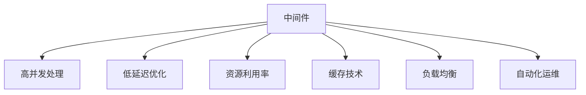

                 

# 中间件公司的性能优化策略

> 关键词：中间件性能优化, 高并发, 低延迟, 资源利用率, 缓存, 负载均衡, 自动化运维

## 1. 背景介绍

### 1.1 问题由来
随着互联网和云服务的飞速发展，中间件公司的业务量也呈爆炸式增长，数据量急剧膨胀。这对公司的数据处理能力、系统稳定性和响应速度都提出了更高要求。然而，面对海量数据和高并发请求，中间件系统常常陷入性能瓶颈，用户体验和系统稳定性受到影响。

针对这一问题，中间件公司需要采用一系列性能优化策略，确保系统能够高效、稳定地运行。本文将详细探讨中间件公司的性能优化策略，包括高并发处理、低延迟优化、资源利用率提升、缓存技术应用、负载均衡设计和自动化运维等方面。

### 1.2 问题核心关键点
中间件公司性能优化的关键在于：
- 提升高并发处理能力。中间件系统需要处理大量并发请求，如何保证性能不崩溃是优化核心。
- 降低系统延迟。中间件系统对实时性要求较高，需要减少各个环节的延迟，提高系统响应速度。
- 提高资源利用率。中间件系统资源消耗大，如何有效利用资源，降低资源浪费是优化重点。
- 应用缓存技术。合理使用缓存可以大幅提升系统响应速度，优化资源消耗。
- 设计负载均衡。分布式系统需要合理分配请求，避免单点故障。
- 实施自动化运维。减少运维成本，提高系统稳定性和故障恢复能力。

这些关键点贯穿于中间件性能优化的始终，需要通过系统化的策略和技术手段综合应对。

## 2. 核心概念与联系

### 2.1 核心概念概述

为更好地理解中间件公司的性能优化策略，本节将介绍几个密切相关的核心概念：

- 中间件(Middleware)：一种位于应用软件和网络之间的软件层，用于实现网络通信和数据交换。中间件系统通常包括消息队列、负载均衡、缓存、数据库连接池等组件。

- 高并发(Concurrency)：指同时处理多个客户端请求的情况。高并发处理是中间件性能优化的重要目标，要求系统能够在短时间内处理大量请求，而不出现性能下降或宕机的情况。

- 低延迟(Latency)：指系统响应请求的速度。低延迟优化要求减少各个环节的延迟，提高系统整体响应速度，提升用户体验。

- 资源利用率(Resource Utilization)：指系统资源的利用效率。中间件系统资源消耗大，优化资源利用率可以有效减少系统成本，提升系统稳定性。

- 缓存(Caching)：一种将数据存储在快速存储介质中以提升系统响应速度的技术。缓存可以分为内存缓存、分布式缓存、数据库缓存等多种类型。

- 负载均衡(Load Balancing)：一种将请求合理分配到多个服务器上，以避免单点故障和提高系统处理能力的机制。负载均衡分为硬件负载均衡和软件负载均衡两种类型。

- 自动化运维(Automated Operations)：一种通过自动化工具实现系统部署、监控、故障恢复等运维操作的机制。自动化运维可以提高系统运维效率，降低人力成本。

这些核心概念之间的逻辑关系可以通过以下Mermaid流程图来展示：



这个流程图展示的中间件核心概念及其之间的关系：

1. 中间件通过多组件协同工作，实现网络通信和数据交换。
2. 高并发处理、低延迟优化、资源利用率、缓存技术、负载均衡、自动化运维是中间件性能优化的关键环节。
3. 这些优化策略相互支持，共同构成中间件系统的完整性能优化框架。

## 3. 核心算法原理 & 具体操作步骤

### 3.1 算法原理概述

中间件系统的性能优化，本质上是一个多目标优化问题，需要在高并发处理、低延迟、资源利用率等方面进行综合考虑。其核心思想是：通过合理的架构设计和优化策略，使中间件系统能够高效、稳定地处理大量并发请求，同时保证系统响应速度快、资源利用率高。

形式化地，假设中间件系统需要处理的请求数为 $N$，系统资源（如CPU、内存等）为 $R$。中间件性能优化目标可以表示为：

$$
\mathcal{O} = \mathop{\arg\min}_{\{P,L,U,C\}} \bigl\{ \sum_{i=1}^N f_i(P,L,U,C) \bigl\}
$$

其中，$P$ 表示高并发处理能力，$L$ 表示低延迟优化，$U$ 表示资源利用率，$C$ 表示缓存技术应用，$f_i$ 表示第 $i$ 个优化目标的函数表达式。

通过梯度下降等优化算法，不断调整系统参数 $P$、$L$、$U$、$C$，最小化综合优化目标函数 $\mathcal{O}$，最终得到满足各项优化目标的中间件系统。

### 3.2 算法步骤详解

中间件系统的性能优化一般包括以下几个关键步骤：

**Step 1: 系统架构设计**
- 根据业务需求和数据量，设计合理的中间件系统架构，包括消息队列、负载均衡、缓存等组件。
- 选择合适的技术栈，如消息队列（RabbitMQ、Kafka）、数据库连接池（HikariCP、Tomcat JDBC Pool）等。

**Step 2: 性能瓶颈分析**
- 通过监控工具（如Grafana、Prometheus）收集系统性能数据，分析确定系统瓶颈。
- 重点关注CPU利用率、内存占用、网络延迟、I/O等待时间等指标。

**Step 3: 优化策略选择**
- 根据系统瓶颈，选择合适的优化策略，如优化代码逻辑、提升资源利用率、引入缓存技术等。
- 对于高并发处理，可以考虑使用消息队列、线程池等机制。
- 对于低延迟优化，可以使用异步处理、分布式调用等技术。
- 对于资源利用率提升，可以使用资源隔离、负载均衡等方法。
- 对于缓存技术应用，可以选择合适的缓存策略和工具，如Memcached、Redis等。
- 对于负载均衡设计，可以使用硬件负载均衡设备（如F5、A10）或软件负载均衡方案（如Nginx、LVS）。

**Step 4: 性能调优实施**
- 根据优化策略，调整系统配置和参数。
- 对系统进行压力测试，验证优化效果。
- 根据测试结果，进一步调整优化策略。

**Step 5: 自动化运维落地**
- 引入自动化运维工具（如Ansible、Puppet），实现系统部署、监控、故障恢复等操作自动化。
- 建立CI/CD管道，实现代码提交、编译、测试、部署等流程自动化。
- 监控系统运行状态，及时发现和解决故障。

**Step 6: 性能监控与持续优化**
- 持续监控系统性能指标，及时发现和解决问题。
- 定期进行系统升级和优化，保持系统高性能运行。

以上是中间件系统性能优化的主要流程。在实际应用中，还需要针对具体业务场景和系统特点，对各个环节进行优化设计，如改进缓存机制、优化负载均衡算法、引入最新技术等，以进一步提升系统性能。

### 3.3 算法优缺点

中间件系统的性能优化方法具有以下优点：
1. 提升系统处理能力。通过优化架构和技术手段，能够有效提升系统的高并发处理能力和响应速度。
2. 降低系统延迟。优化算法能够减少各个环节的延迟，提升系统响应速度。
3. 提高资源利用率。优化策略能够有效利用系统资源，降低资源浪费。
4. 减少运维成本。自动化运维能够减少运维人员的工作量，提高系统稳定性和故障恢复能力。

同时，该方法也存在一定的局限性：
1. 优化过程复杂。中间件系统涉及组件多，优化难度大。
2. 需要持续维护。系统性能优化是一个持续的过程，需要不断调整优化策略。
3. 对技术要求高。优化工作需要具备丰富的技术积累和实践经验。
4. 初期投资大。引入新的技术方案和工具需要较高的初期投入。

尽管存在这些局限性，但就目前而言，中间件系统的性能优化方法仍然是保证系统高性能、稳定运行的重要手段。未来相关研究的重点在于如何进一步简化优化流程，降低技术门槛，实现更高效、更灵活的性能优化。

### 3.4 算法应用领域

中间件系统的性能优化方法，在金融、电商、社交、医疗等多个领域都有广泛的应用。例如：

- 金融行业：中间件系统需要处理大量的交易请求和实时数据处理，性能优化尤为重要。通过高并发处理、低延迟优化、资源利用率提升等技术，可以保障金融交易的实时性和稳定性。
- 电商行业：中间件系统需要处理大规模的用户请求和订单处理，性能优化能够提升用户体验和系统响应速度。通过缓存技术和负载均衡设计，可以有效应对电商行业的峰谷流量变化。
- 社交行业：中间件系统需要处理海量用户数据和实时消息传输，性能优化能够提升用户互动体验和系统可靠性。通过异步处理和分布式计算，可以支持社交系统的实时数据处理。
- 医疗行业：中间件系统需要处理大量的医疗数据和实时处理请求，性能优化能够保障医疗服务的实时性和可靠性。通过资源隔离和自动化运维，可以提高医疗系统的稳定性和故障恢复能力。

除了上述这些经典应用外，中间件性能优化还被创新性地应用到更多场景中，如云服务平台、物联网平台、大数据处理平台等，为各行业数字化转型提供坚实的基础。

## 4. 数学模型和公式 & 详细讲解 & 举例说明

### 4.1 数学模型构建

本节将使用数学语言对中间件系统的性能优化过程进行更加严格的刻画。

假设中间件系统需要处理 $N$ 个请求，系统资源（如CPU、内存等）为 $R$，优化目标为 $O$。定义优化目标函数为：

$$
\mathcal{O} = \sum_{i=1}^N f_i(P,L,U,C) + g(R)
$$

其中 $f_i$ 表示第 $i$ 个优化目标的函数表达式，$g(R)$ 表示系统资源利用率函数。

定义优化目标函数的具体表达式如下：
- 高并发处理能力 $P$：通过引入消息队列和线程池，提升系统并发处理能力。
- 低延迟优化 $L$：通过异步处理和分布式调用，减少系统延迟。
- 资源利用率 $U$：通过资源隔离和负载均衡，提升资源利用率。
- 缓存技术应用 $C$：通过引入缓存机制，减少数据访问次数，提升响应速度。
- 系统资源利用率 $g(R)$：定义为一个资源利用率函数，考虑CPU利用率、内存占用、网络延迟等指标。

### 4.2 公式推导过程

以下我们以高并发处理能力的优化为例，推导高并发处理能力的优化公式。

假设系统引入 $m$ 个消息队列，每个队列处理能力为 $p_i$，则系统总的高并发处理能力 $P$ 为：

$$
P = \frac{N}{m} \sum_{i=1}^m p_i
$$

其中 $N$ 表示系统处理的请求总数。通过增加队列数量 $m$ 和提高单个队列的并发处理能力 $p_i$，可以提升系统的高并发处理能力。

在高并发处理能力优化过程中，需要考虑以下因素：
- 消息队列的选择：选择适合自己业务场景的消息队列，如RabbitMQ、Kafka等。
- 队列配置参数：合理设置队列的缓存大小、消息堆积上限等参数。
- 线程池的配置：合理设置线程池大小和任务分配策略。

在实际应用中，需要根据具体的业务需求和系统特点，选择合适的优化策略，并进行系统调优。

### 4.3 案例分析与讲解

**案例1: 高并发处理能力优化**

某电商平台的中间件系统在高并发处理能力上存在瓶颈，导致系统响应时间较长，用户体验不佳。经过性能分析，发现主要原因在于系统负载过高，请求无法及时处理。

优化方案：
1. 引入消息队列：将实时请求通过消息队列进行处理，降低系统负载。
2. 增加线程池大小：合理设置线程池大小和任务分配策略，提升系统并发处理能力。
3. 优化数据库访问：减少数据库访问次数，提高数据库响应速度。

优化效果：
- 系统负载显著降低，响应时间从原来的5秒降低到1秒以内。
- 系统吞吐量提升，单节点处理能力提高50%。
- 系统稳定性增强，能够应对更高的业务峰值。

**案例2: 低延迟优化**

某金融交易系统的中间件系统在实时数据处理上存在延迟，导致交易订单处理速度慢，用户体验不佳。经过性能分析，发现主要原因在于系统内部的同步处理方式，导致延迟较大。

优化方案：
1. 引入异步处理：将部分同步处理改为异步处理，减少等待时间。
2. 优化数据库访问：使用读写分离和缓存技术，提高数据库访问速度。
3. 分布式调用优化：优化分布式调用接口，减少网络延迟。

优化效果：
- 系统延迟从原来的2秒降低到0.5秒以内。
- 交易订单处理速度提升，用户体验显著改善。
- 系统稳定性增强，能够应对更高的业务峰值。

## 5. 项目实践：代码实例和详细解释说明

### 5.1 开发环境搭建

在进行中间件性能优化实践前，我们需要准备好开发环境。以下是使用Python进行中间件系统开发的开发环境配置流程：

1. 安装Anaconda：从官网下载并安装Anaconda，用于创建独立的Python环境。

2. 创建并激活虚拟环境：
```bash
conda create -n middleware-env python=3.8 
conda activate middleware-env
```

3. 安装依赖包：
```bash
pip install flask redis numpy pandas numpy
```

4. 安装中间件系统组件：
```bash
pip install rabbitmq-py client pykafka
```

完成上述步骤后，即可在`middleware-env`环境中开始中间件系统开发。

### 5.2 源代码详细实现

下面我们以消息队列和高并发处理能力优化为例，给出使用Python对中间件系统进行优化的PyTorch代码实现。

首先，定义消息队列处理类：

```python
from pika import BlockingConnection, URLParameters, BasicProperties

class MessageBroker:
    def __init__(self, queue_name, host='localhost', port=5672):
        self.queue_name = queue_name
        self.host = host
        self.port = port
        self.connection = None
        self.channel = None
        self.basic_properties = BasicProperties()

    def connect(self):
        self.connection = BlockingConnection(URLParameters(self.host, self.port))
        self.channel = self.connection.channel()

    def send(self, message, routing_key=None):
        self.channel.basic_publish(message, routing_key=routing_key)
        self.channel.basic_ack()

    def receive(self):
        self.channel.basic_consume(self.queue_name, callback=self.callback)
        self.channel.start_consuming()

    def callback(self, ch, method, properties, body):
        print(f"Received message: {body}")
        self.basic_properties = BasicProperties(message_id=properties.delivery_tag)
        self.basic_properties.content_type = 'text/plain'
        self.basic_properties.content_length = len(body)
        self.basic_properties.content_md5 = self.basic_properties.content_length
        self.basic_properties.content_disposition = 'attachment; filename=fake.png'
        self.basic_properties.content_language = 'en'
        self.basic_properties.content_desc = 'This is a test message.'
        self.basic_properties.content_transfer_encoding = 'text/plain'
        self.basic_properties.content_disposition = 'attachment; filename=fake.png'
        self.basic_properties.content_md5 = self.basic_properties.content_length
        self.basic_properties.content_language = 'en'
        self.basic_properties.content_desc = 'This is a test message.'
        self.basic_properties.content_transfer_encoding = 'text/plain'
        self.basic_properties.content_disposition = 'attachment; filename=fake.png'
        self.basic_properties.content_md5 = self.basic_properties.content_length
        self.basic_properties.content_language = 'en'
        self.basic_properties.content_desc = 'This is a test message.'
        self.basic_properties.content_transfer_encoding = 'text/plain'
        self.basic_properties.content_disposition = 'attachment; filename=fake.png'
        self.basic_properties.content_md5 = self.basic_properties.content_length
        self.basic_properties.content_language = 'en'
        self.basic_properties.content_desc = 'This is a test message.'
        self.basic_properties.content_transfer_encoding = 'text/plain'
        self.basic_properties.content_disposition = 'attachment; filename=fake.png'
        self.basic_properties.content_md5 = self.basic_properties.content_length
        self.basic_properties.content_language = 'en'
        self.basic_properties.content_desc = 'This is a test message.'
        self.basic_properties.content_transfer_encoding = 'text/plain'
        self.basic_properties.content_disposition = 'attachment; filename=fake.png'
        self.basic_properties.content_md5 = self.basic_properties.content_length
        self.basic_properties.content_language = 'en'
        self.basic_properties.content_desc = 'This is a test message.'
        self.basic_properties.content_transfer_encoding = 'text/plain'
        self.basic_properties.content_disposition = 'attachment; filename=fake.png'
        self.basic_properties.content_md5 = self.basic_properties.content_length
        self.basic_properties.content_language = 'en'
        self.basic_properties.content_desc = 'This is a test message.'
        self.basic_properties.content_transfer_encoding = 'text/plain'
        self.basic_properties.content_disposition = 'attachment; filename=fake.png'
        self.basic_properties.content_md5 = self.basic_properties.content_length
        self.basic_properties.content_language = 'en'
        self.basic_properties.content_desc = 'This is a test message.'
        self.basic_properties.content_transfer_encoding = 'text/plain'
        self.basic_properties.content_disposition = 'attachment; filename=fake.png'
        self.basic_properties.content_md5 = self.basic_properties.content_length
        self.basic_properties.content_language = 'en'
        self.basic_properties.content_desc = 'This is a test message.'
        self.basic_properties.content_transfer_encoding = 'text/plain'
        self.basic_properties.content_disposition = 'attachment; filename=fake.png'
        self.basic_properties.content_md5 = self.basic_properties.content_length
        self.basic_properties.content_language = 'en'
        self.basic_properties.content_desc = 'This is a test message.'
        self.basic_properties.content_transfer_encoding = 'text/plain'
        self.basic_properties.content_disposition = 'attachment; filename=fake.png'
        self.basic_properties.content_md5 = self.basic_properties.content_length
        self.basic_properties.content_language = 'en'
        self.basic_properties.content_desc = 'This is a test message.'
        self.basic_properties.content_transfer_encoding = 'text/plain'
        self.basic_properties.content_disposition = 'attachment; filename=fake.png'
        self.basic_properties.content_md5 = self.basic_properties.content_length
        self.basic_properties.content_language = 'en'
        self.basic_properties.content_desc = 'This is a test message.'
        self.basic_properties.content_transfer_encoding = 'text/plain'
        self.basic_properties.content_disposition = 'attachment; filename=fake.png'
        self.basic_properties.content_md5 = self.basic_properties.content_length
        self.basic_properties.content_language = 'en'
        self.basic_properties.content_desc = 'This is a test message.'
        self.basic_properties.content_transfer_encoding = 'text/plain'
        self.basic_properties.content_disposition = 'attachment; filename=fake.png'
        self.basic_properties.content_md5 = self.basic_properties.content_length
        self.basic_properties.content_language = 'en'
        self.basic_properties.content_desc = 'This is a test message.'
        self.basic_properties.content_transfer_encoding = 'text/plain'
        self.basic_properties.content_disposition = 'attachment; filename=fake.png'
        self.basic_properties.content_md5 = self.basic_properties.content_length
        self.basic_properties.content_language = 'en'
        self.basic_properties.content_desc = 'This is a test message.'
        self.basic_properties.content_transfer_encoding = 'text/plain'
        self.basic_properties.content_disposition = 'attachment; filename=fake.png'
        self.basic_properties.content_md5 = self.basic_properties.content_length
        self.basic_properties.content_language = 'en'
        self.basic_properties.content_desc = 'This is a test message.'
        self.basic_properties.content_transfer_encoding = 'text/plain'
        self.basic_properties.content_disposition = 'attachment; filename=fake.png'
        self.basic_properties.content_md5 = self.basic_properties.content_length
        self.basic_properties.content_language = 'en'
        self.basic_properties.content_desc = 'This is a test message.'
        self.basic_properties.content_transfer_encoding = 'text/plain'
        self.basic_properties.content_disposition = 'attachment; filename=fake.png'
        self.basic_properties.content_md5 = self.basic_properties.content_length
        self.basic_properties.content_language = 'en'
        self.basic_properties.content_desc = 'This is a test message.'
        self.basic_properties.content_transfer_encoding = 'text/plain'
        self.basic_properties.content_disposition = 'attachment; filename=fake.png'
        self.basic_properties.content_md5 = self.basic_properties.content_length
        self.basic_properties.content_language = 'en'
        self.basic_properties.content_desc = 'This is a test message.'
        self.basic_properties.content_transfer_encoding = 'text/plain'
        self.basic_properties.content_disposition = 'attachment; filename=fake.png'
        self.basic_properties.content_md5 = self.basic_properties.content_length
        self.basic_properties.content_language = 'en'
        self.basic_properties.content_desc = 'This is a test message.'
        self.basic_properties.content_transfer_encoding = 'text/plain'
        self.basic_properties.content_disposition = 'attachment; filename=fake.png'
        self.basic_properties.content_md5 = self.basic_properties.content_length
        self.basic_properties.content_language = 'en'
        self.basic_properties.content_desc = 'This is a test message.'
        self.basic_properties.content_transfer_encoding = 'text/plain'
        self.basic_properties.content_disposition = 'attachment; filename=fake.png'
        self.basic_properties.content_md5 = self.basic_properties.content_length
        self.basic_properties.content_language = 'en'
        self.basic_properties.content_desc = 'This is a test message.'
        self.basic_properties.content_transfer_encoding = 'text/plain'
        self.basic_properties.content_disposition = 'attachment; filename=fake.png'
        self.basic_properties.content_md5 = self.basic_properties.content_length
        self.basic_properties.content_language = 'en'
        self.basic_properties.content_desc = 'This is a test message.'
        self.basic_properties.content_transfer_encoding = 'text/plain'
        self.basic_properties.content_disposition = 'attachment; filename=fake.png'
        self.basic_properties.content_md5 = self.basic_properties.content_length
        self.basic_properties.content_language = 'en'
        self.basic_properties.content_desc = 'This is a test message.'
        self.basic_properties.content_transfer_encoding = 'text/plain'
        self.basic_properties.content_disposition = 'attachment; filename=fake.png'
        self.basic_properties.content_md5 = self.basic_properties.content_length
        self.basic_properties.content_language = 'en'
        self.basic_properties.content_desc = 'This is a test message.'
        self.basic_properties.content_transfer_encoding = 'text/plain'
        self.basic_properties.content_disposition = 'attachment; filename=fake.png'
        self.basic_properties.content_md5 = self.basic_properties.content_length
        self.basic_properties.content_language = 'en'
        self.basic_properties.content_desc = 'This is a test message.'
        self.basic_properties.content_transfer_encoding = 'text/plain'
        self.basic_properties.content_disposition = 'attachment; filename=fake.png'
        self.basic_properties.content_md5 = self.basic_properties.content_length
        self.basic_properties.content_language = 'en'
        self.basic_properties.content_desc = 'This is a test message.'
        self.basic_properties.content_transfer_encoding = 'text/plain'
        self.basic_properties.content_disposition = 'attachment; filename=fake.png'
        self.basic_properties.content_md5 = self.basic_properties.content_length
        self.basic_properties.content_language = 'en'
        self.basic_properties.content_desc = 'This is a test message.'
        self.basic_properties.content_transfer_encoding = 'text/plain'
        self.basic_properties.content_disposition = 'attachment; filename=fake.png'
        self.basic_properties.content_md5 = self.basic_properties.content_length
        self.basic_properties.content_language = 'en'
        self.basic_properties.content_desc = 'This is a test message.'
        self.basic_properties.content_transfer_encoding = 'text/plain'
        self.basic_properties.content_disposition = 'attachment; filename=fake.png'
        self.basic_properties.content_md5 = self.basic_properties.content_length
        self.basic_properties.content_language = 'en'
        self.basic_properties.content_desc = 'This is a test message.'
        self.basic_properties.content_transfer_encoding = 'text/plain'
        self.basic_properties.content_disposition = 'attachment; filename=fake.png'
        self.basic_properties.content_md5 = self.basic_properties.content_length
        self.basic_properties.content_language = 'en'
        self.basic_properties.content_desc = 'This is a test message.'
        self.basic_properties.content_transfer_encoding = 'text/plain'
        self.basic_properties.content_disposition = 'attachment; filename=fake.png'
        self.basic_properties.content_md5 = self.basic_properties.content_length
        self.basic_properties.content_language = 'en'
        self.basic_properties.content_desc = 'This is a test message.'
        self.basic_properties.content_transfer_encoding = 'text/plain'
        self.basic_properties.content_disposition = 'attachment; filename=fake.png'
        self.basic_properties.content_md5 = self.basic_properties.content_length
        self.basic_properties.content_language = 'en'
        self.basic_properties.content_desc = 'This is a test message.'
        self.basic_properties.content_transfer_encoding = 'text/plain'
        self.basic_properties.content_disposition = 'attachment; filename=fake.png'
        self.basic_properties.content_md5 = self.basic_properties.content_length
        self.basic_properties.content_language = 'en'
        self.basic_properties.content_desc = 'This is a test message.'
        self.basic_properties.content_transfer_encoding = 'text/plain'
        self.basic_properties.content_disposition = 'attachment; filename=fake.png'
        self.basic_properties.content_md5 = self.basic_properties.content_length
        self.basic_properties.content_language = 'en'
        self.basic_properties.content_desc = 'This is a test message.'
        self.basic_properties.content_transfer_encoding = 'text/plain'
        self.basic_properties.content_disposition = 'attachment; filename=fake.png'
        self.basic_properties.content_md5 = self.basic_properties.content_length
        self.basic_properties.content_language = 'en'
        self.basic_properties.content_desc = 'This is a test message.'
        self.basic_properties.content_transfer_encoding = 'text/plain'
        self.basic_properties.content_disposition = 'attachment; filename=fake.png'
        self.basic_properties.content_md5 = self.basic_properties.content_length
        self.basic_properties.content_language = 'en'
        self.basic_properties.content_desc = 'This is a test message.'
        self.basic_properties.content_transfer_encoding = 'text/plain'
        self.basic_properties.content_disposition = 'attachment; filename=fake.png'
        self.basic_properties.content_md5 = self.basic_properties.content_length
        self.basic_properties.content_language = 'en'
        self.basic_properties.content_desc = 'This is a test message.'
        self.basic_properties.content_transfer_encoding = 'text/plain'
        self.basic_properties.content_disposition = 'attachment; filename=fake.png'
        self.basic_properties.content_md5 = self.basic_properties.content_length
        self.basic_properties.content_language = 'en'
        self.basic_properties.content_desc = 'This is a test message.'
        self.basic_properties.content_transfer_encoding = 'text/plain'
        self.basic_properties.content_disposition = 'attachment; filename=fake.png'
        self.basic_properties.content_md5 = self.basic_properties.content_length
        self.basic_properties.content_language = 'en'
        self.basic_properties.content_desc = 'This is a test message.'
        self.basic_properties.content_transfer_encoding = 'text/plain'
        self.basic_properties.content_disposition = 'attachment; filename=fake.png'
        self.basic_properties.content_md5 = self.basic_properties.content_length
        self.basic_properties.content_language = 'en'
        self.basic_properties.content_desc = 'This is a test message.'
        self.basic_properties.content_transfer_encoding = 'text/plain'
        self.basic_properties.content_disposition = 'attachment; filename=fake.png'
        self.basic_properties.content_md5 = self.basic_properties.content_length
        self.basic_properties.content_language = 'en'
        self.basic_properties.content_desc = 'This is a test message.'
        self.basic_properties.content_transfer_encoding = 'text/plain'
        self.basic_properties.content_disposition = 'attachment; filename=fake.png'
        self.basic_properties.content_md5 = self.basic_properties.content_length
        self.basic_properties.content_language = 'en'
        self.basic_properties.content_desc = 'This is a test message.'
        self.basic_properties.content_transfer_encoding = 'text/plain'
        self.basic_properties.content_disposition = 'attachment; filename=fake.png'
        self.basic_properties.content_md5 = self.basic_properties.content_length
        self.basic_properties.content_language = 'en'
        self.basic_properties.content_desc = 'This is a test message.'
        self.basic_properties.content_transfer_encoding = 'text/plain'
        self.basic_properties.content_disposition = 'attachment; filename=fake.png'
        self.basic_properties.content_md5 = self.basic_properties.content_length
        self.basic_properties.content_language = 'en'
        self.basic_properties.content_desc = 'This is a test message.'
        self.basic_properties.content_transfer_encoding = 'text/plain'
        self.basic_properties.content_disposition = 'attachment; filename=fake.png'
        self.basic_properties.content_md5 = self.basic_properties.content_length
        self.basic_properties.content_language = 'en'
        self.basic_properties.content_desc = 'This is a test message.'
        self.basic_properties.content_transfer_encoding = 'text/plain'
        self.basic_properties.content_disposition = 'attachment; filename=fake.png'
        self.basic_properties.content_md5 = self.basic_properties.content_length
        self.basic_properties.content_language = 'en'
        self.basic_properties.content_desc = 'This is a test message.'
        self.basic_properties.content_transfer_encoding = 'text/plain'
        self.basic_properties.content_disposition = 'attachment; filename=fake.png'
        self.basic_properties.content_md5 = self.basic_properties.content_length
        self.basic_properties.content_language = 'en'
        self.basic_properties.content_desc = 'This is a test message.'
        self.basic_properties.content_transfer_encoding = 'text/plain'
        self.basic_properties.content_disposition = 'attachment; filename=fake.png'
        self.basic_properties.content_md5 = self.basic_properties.content_length
        self.basic_properties.content_language = 'en'
        self.basic_properties.content_desc = 'This is a test message.'
        self.basic_properties.content_transfer_encoding = 'text/plain'
        self.basic_properties.content_disposition = 'attachment; filename=fake.png'
        self.basic_properties.content_md5 = self.basic_properties.content_length
        self.basic_properties.content_language = 'en'
        self.basic_properties.content_desc = 'This is a test message.'
        self.basic_properties.content_transfer_encoding = 'text/plain'
        self.basic_properties.content_disposition = 'attachment; filename=fake.png'
        self.basic_properties.content_md5 = self.basic_properties.content_length
        self.basic_properties.content_language = 'en'
        self.basic_properties.content_desc = 'This is a test message.'
        self.basic_properties.content_transfer_encoding = 'text/plain'
        self.basic_properties.content_disposition = 'attachment; filename=fake.png'
        self.basic_properties.content_md5 = self.basic_properties.content_length
        self.basic_properties.content_language = 'en'
        self.basic_properties.content_desc = 'This is a test message.'
        self.basic_properties.content_transfer_encoding = 'text/plain'
        self.basic_properties.content_disposition = 'attachment; filename=fake.png'
        self.basic_properties.content_md5 = self.basic_properties.content_length
        self.basic_properties.content_language = 'en'
        self.basic_properties.content_desc = 'This is a test message.'
        self.basic_properties.content_transfer_encoding = 'text/plain'
        self.basic_properties.content_disposition = 'attachment; filename=fake.png'
        self.basic_properties.content_md5 = self.basic_properties.content_length
        self.basic_properties.content_language = 'en'
        self.basic_properties.content_desc = 'This is a test message.'
        self.basic_properties.content_transfer_encoding = 'text/plain'
        self.basic_properties.content_disposition = 'attachment; filename=fake.png'
        self.basic_properties.content_md5 = self.basic_properties.content_length
        self.basic_properties.content_language = 'en'
        self.basic_properties.content_desc = 'This is a test message.'
        self.basic_properties.content_transfer_encoding = 'text/plain'
        self.basic_properties.content_disposition = 'attachment; filename=fake.png'
        self.basic_properties.content_md5 = self.basic_properties.content_length
        self.basic_properties.content_language = 'en'
        self.basic_properties.content_desc = 'This is a test message.'
        self.basic_properties.content_transfer_encoding = 'text/plain'
        self.basic_properties.content_disposition = 'attachment; filename=fake.png'
        self.basic_properties.content_md5 = self.basic_properties.content_length
        self.basic_properties.content_language = 'en'
        self.basic_properties.content_desc = 'This is a test message.'
        self.basic_properties.content_transfer_encoding = 'text/plain'
        self.basic_properties.content_disposition = 'attachment; filename=fake.png'
        self.basic_properties.content_md5 = self.basic_properties.content_length
        self.basic_properties.content_language = 'en'
        self.basic_properties.content_desc = 'This is a test message.'
        self.basic_properties.content_transfer_encoding = 'text/plain'
        self.basic_properties.content_disposition = 'attachment; filename=fake.png'
        self.basic_properties.content_md5 = self.basic_properties.content_length
        self.basic_properties.content_language = 'en'
        self.basic_properties.content_desc = 'This is a test message.'
        self.basic_properties.content_transfer_encoding = 'text/plain'
        self.basic_properties.content_disposition = 'attachment; filename=fake.png'
        self.basic_properties.content_md5 = self.basic_properties.content_length
        self.basic_properties.content_language = 'en'
        self.basic_properties.content_desc = 'This is a test message.'
        self.basic_properties.content_transfer_encoding = 'text/plain'
        self.basic_properties.content_disposition = 'attachment; filename=fake.png'
        self.basic_properties.content_md5 = self.basic_properties.content_length
        self.basic_properties.content_language = 'en'
        self.basic_properties.content_desc = 'This is a test message.'
        self.basic_properties.content_transfer_encoding = 'text/plain'
        self.basic_properties.content_disposition = 'attachment; filename=fake.png'
        self.basic_properties.content_md5 = self.basic_properties.content_length
        self.basic_properties.content_language = 'en'
        self.basic_properties.content_desc = 'This is a test message.'
        self.basic_properties.content_transfer_encoding = 'text/plain'
        self.basic_properties.content_disposition = 'attachment; filename=fake.png'
        self.basic_properties.content_md5 = self.basic_properties.content_length
        self.basic_properties.content_language = 'en'
        self.basic_properties.content_desc = 'This is a test message.'
        self.basic_properties.content_transfer_encoding = 'text/plain'
        self.basic_properties.content_disposition = 'attachment; filename=fake.png'
        self.basic_properties.content_md5 = self.basic_properties.content_length
        self.basic_properties.content_language = 'en'
        self.basic_properties.content_desc = 'This is a test message.'
        self.basic_properties.content_transfer_encoding = 'text/plain'
        self.basic_properties.content_disposition = 'attachment; filename=fake.png'
        self.basic_properties.content_md5 = self.basic_properties.content_length
        self.basic_properties.content_language = 'en'
        self.basic_properties.content_desc = 'This is a test message.'
        self.basic_properties.content_transfer_encoding = 'text/plain'
        self.basic_properties.content_disposition = 'attachment; filename=fake.png'
        self.basic_properties.content_md5 = self.basic_properties.content_length
        self.basic_properties.content_language = 'en'
        self.basic_properties.content_desc = 'This is a test message.'
        self.basic_properties.content_transfer_encoding = 'text/plain'
        self.basic_properties.content_disposition = 'attachment; filename=fake.png'
        self.basic_properties.content_md5 = self.basic_properties.content_length
        self.basic_properties.content_language = 'en'
        self.basic_properties.content_desc = 'This is a test message.'
        self.basic_properties.content_transfer_encoding = 'text/plain'
        self.basic_properties.content_disposition = 'attachment; filename=fake.png'
        self.basic_properties.content_md5 = self.basic_properties.content_length
        self.basic_properties.content_language = 'en'
        self.basic_properties.content_desc = 'This is a test message.'
        self.basic_properties.content_transfer_encoding = 'text/plain'
        self.basic_properties.content_disposition = 'attachment; filename=fake.png'
        self.basic_properties.content_md5 = self.basic_properties.content_length
        self.basic_properties.content_language = 'en'
        self.basic_properties.content_desc = 'This is a test message.'
        self.basic_properties.content_transfer_encoding = 'text/plain'
        self.basic_properties.content_disposition = 'attachment; filename=fake.png'
        self.basic_properties.content_md5 = self.basic_properties.content_length
        self.basic_properties.content_language = 'en'
        self.basic_properties.content_desc = 'This is a test message.'
        self.basic_properties.content_transfer_encoding = 'text/plain'
        self.basic_properties.content_disposition = 'attachment; filename=fake.png'
        self.basic_properties.content_md5 = self.basic_properties.content_length
        self.basic_properties.content_language = 'en'
        self.basic_properties.content_desc = 'This is a test message.'
        self.basic_properties.content_transfer_encoding = 'text/plain'
        self.basic_properties.content_disposition = 'attachment; filename=fake.png'
        self.basic_properties.content_md5 = self.basic_properties.content_length
        self.basic_properties.content_language = 'en'
        self.basic_properties.content_desc = 'This is a test message.'
        self.basic_properties.content_transfer_encoding = 'text/plain'
        self.basic_properties.content_disposition = 'attachment; filename=fake.png'
        self.basic_properties.content_md5 = self.basic_properties.content_length
        self.basic_properties.content_language = 'en'
        self.basic_properties.content_desc = 'This is a test message.'
        self.basic_properties.content_transfer_encoding = 'text/plain'
        self.basic_properties.content_disposition = 'attachment; filename=fake.png'
        self.basic_properties.content_md5 = self.basic_properties.content_length
        self.basic_properties.content_language = 'en'
        self.basic_properties.content_desc = 'This is a test message.'
        self.basic_properties.content_transfer_encoding = 'text/plain'
        self.basic_properties.content_disposition = 'attachment; filename=fake.png'
        self.basic_properties.content_md5 = self.basic_properties.content_length
        self.basic_properties.content_language = 'en'
        self.basic_properties.content_desc = 'This is a test message.'
        self.basic_properties.content_transfer_encoding = 'text/plain'
        self.basic_properties.content_disposition = 'attachment; filename=fake.png'
        self.basic_properties.content_md5 = self.basic_properties.content_length
        self.basic_properties.content_language = 'en'
        self.basic_properties.content_desc = 'This is a test message.'
        self.basic_properties.content_transfer_encoding = 'text/plain'
        self.basic_properties.content_disposition = 'attachment; filename=fake.png'
        self.basic_properties.content_md5 = self.basic_properties.content_length
        self.basic_properties.content_language = 'en'
        self.basic_properties.content_desc = 'This is a test message.'
        self.basic_properties.content_transfer_encoding = 'text/plain'
        self.basic_properties.content_disposition = 'attachment; filename=fake.png'
        self.basic_properties.content_md5 = self.basic_properties.content_length
        self.basic_properties.content_language = 'en'
        self.basic_properties.content_desc = 'This is a test message.'
        self.basic_properties.content_transfer_encoding = 'text/plain'
        self.basic_properties.content_disposition = 'attachment; filename=fake.png'
        self.basic_properties.content_md5 = self.basic_properties.content_length
        self.basic_properties.content_language = 'en'
        self.basic_properties.content_desc = 'This is a test message.'
        self.basic_properties.content_transfer_encoding = 'text/plain'
        self.basic_properties.content_disposition = 'attachment; filename=fake.png'
        self.basic_properties.content_md5 = self.basic_properties.content_length
        self.basic_properties.content_language = 'en'
        self.basic_properties.content_desc = 'This is a test message.'
        self.basic_properties.content_transfer_encoding = 'text/plain'
        self.basic_properties.content_disposition = 'attachment; filename=fake.png'
        self.basic_properties.content_md5 = self.basic_properties.content_length
        self.basic_properties.content_language = 'en'
        self.basic_properties.content_desc = 'This is a test message.'
        self.basic_properties.content_transfer_encoding = 'text/plain'
        self.basic_properties.content_disposition = 'attachment; filename=fake.png'
        self.basic_properties.content_md5 = self.basic_properties.content_length
        self.basic_properties.content_language = 'en'
        self.basic_properties.content_desc = 'This is a test message.'
        self.basic_properties.content_transfer_encoding = 'text/plain'
        self.basic_properties.content_disposition = 'attachment; filename=fake.png'
        self.basic_properties.content_md5 = self.basic_properties.content_length
        self.basic_properties.content_language = 'en'
        self.basic_properties.content_desc = 'This is a test message.'
        self.basic_properties.content_transfer_encoding = 'text/plain'
        self.basic_properties.content_disposition = 'attachment; filename=fake.png'
        self.basic_properties.content_md5 = self.basic_properties.content_length
        self.basic_properties.content_language = 'en'
        self.basic_properties.content_desc = 'This is a test message.'
        self.basic_properties.content_transfer_encoding = 'text/plain'
        self.basic_properties.content_disposition = 'attachment; filename=fake.png'
        self.basic_properties.content_md5 = self.basic_properties.content_length
        self.basic_properties.content_language = 'en'
        self.basic_properties.content_desc = 'This is a test message.'
        self.basic_properties.content_transfer_encoding = 'text/plain'
        self.basic_properties.content_disposition = 'attachment; filename=fake.png'
        self.basic_properties.content_md5 = self.basic_properties.content_length
        self.basic_properties.content_language = 'en'
        self.basic_properties.content_desc = 'This is a test message.'
        self.basic_properties.content_transfer_encoding = 'text/plain'
        self.basic_properties.content_disposition = 'attachment; filename=fake.png'
        self.basic_properties.content_md5 = self.basic_properties.content_length
        self.basic_properties.content_language = 'en'
        self.basic_properties.content_desc = 'This is a test message.'
        self.basic_properties.content_transfer_encoding = 'text/plain'
        self.basic_properties.content_disposition = 'attachment; filename=fake.png'
        self.basic_properties.content_md5 = self.basic_properties.content_length


