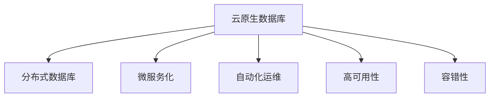

                 

# 云原生数据库：设计与性能优化

> 关键词：云原生数据库, 数据库性能优化, 分布式数据库, 数据库架构, 高可用性, 容错性

## 1. 背景介绍

### 1.1 问题由来
近年来，随着云计算技术的广泛应用，企业对于云服务的需求日益增长。云原生数据库作为云计算生态的重要组成部分，其设计和性能优化成为了行业关注的焦点。传统数据库系统虽然功能强大，但在云环境下的高可扩展性、高可用性、高容错性等方面存在诸多挑战。云原生数据库通过引入分布式架构、微服务化、自动化运维等技术手段，有望克服这些不足，更好地适应云环境下的复杂场景。

### 1.2 问题核心关键点
云原生数据库的设计和性能优化主要包括以下几个关键点：

- 分布式架构：通过多节点、多副本的设计，实现数据的高可用性、高可扩展性。
- 微服务化：将数据库系统拆分为多个微服务，便于独立开发、测试和部署。
- 自动化运维：采用自动化部署、自动化监控和故障恢复等技术手段，降低运维复杂度。
- 高可用性和容错性：通过冗余设计、故障转移机制等手段，保证系统的稳定运行。
- 数据一致性和隔离性：通过分布式事务管理、隔离机制等，确保数据操作的正确性和并发性。

这些关键点共同构成了云原生数据库的设计和性能优化的基本框架，使得其在云环境下的应用更加高效、可靠。

### 1.3 问题研究意义
研究云原生数据库的设计和性能优化，对于提升云服务的整体性能和用户体验，具有重要意义：

1. 提高系统可靠性。云原生数据库通过分布式架构和高可用性设计，可以更好地应对故障和数据丢失，保障业务的连续性。
2. 提升系统可扩展性。通过微服务化和自动化运维，云原生数据库可以支持更大规模的数据处理，满足企业不断增长的业务需求。
3. 降低运维成本。自动化的部署和监控手段，可以大幅减少运维人员的工作量，降低运营成本。
4. 支持新型的业务形态。云原生数据库能够更好地支持云计算平台上的微服务架构、事件驱动等新型业务形态，促进企业数字化转型。
5. 推动云服务生态的快速发展。作为云计算生态的重要组成部分，云原生数据库的性能优化对于整个云服务生态的快速发展至关重要。

## 2. 核心概念与联系

### 2.1 核心概念概述

为更好地理解云原生数据库的设计和性能优化方法，本节将介绍几个密切相关的核心概念：

- 云原生数据库(Cloud-Native Database)：指在设计之初即考虑云环境特性，通过分布式架构、微服务化、自动化运维等技术手段，实现高可用性、高可扩展性、高容错性的数据库系统。

- 分布式数据库(Distributed Database)：通过多节点、多副本的设计，实现数据的高可用性和高可扩展性。每个节点独立存储数据，通过网络协议进行数据同步和查询处理。

- 微服务化(Microservice Architecture)：将一个大型的应用程序拆分为多个小型的、独立的微服务，每个微服务负责特定的功能模块，便于独立开发、测试和部署。

- 自动化运维(Automated Operations)：通过脚本化、工具化的手段，实现数据库系统的自动化部署、监控和故障恢复，降低运维复杂度。

- 高可用性(High Availability)：通过冗余设计、故障转移机制等手段，保证系统的稳定运行，即使在单节点故障时，也能保证服务的可用性。

- 容错性(Fault Tolerance)：通过数据冗余、自动恢复等机制，确保系统在节点故障时能够自动恢复，避免数据丢失。

这些核心概念之间的逻辑关系可以通过以下Mermaid流程图来展示：



这个流程图展示了大数据库设计优化中涉及的核心概念及其之间的关系：

1. 云原生数据库通过分布式架构、微服务化和自动化运维等技术手段，实现高可用性和容错性。
2. 分布式数据库通过多节点、多副本的设计，实现数据的冗余和故障转移。
3. 微服务化将系统拆分为多个独立的服务，便于独立开发和测试。
4. 自动化运维通过脚本化、工具化的手段，实现数据库系统的自动化部署和监控。
5. 高可用性和容错性通过冗余设计、自动恢复等手段，确保系统的稳定运行。

这些概念共同构成了云原生数据库的设计和性能优化的基本框架，使其能够在云环境下的应用更加高效、可靠。

## 3. 核心算法原理 & 具体操作步骤
### 3.1 算法原理概述

云原生数据库的设计和性能优化，本质上是一个多目标优化问题。其核心思想是：通过分布式架构、微服务化、自动化运维等技术手段，最大化系统的可用性、可扩展性和容错性，同时最小化数据一致性和隔离性方面的风险。

形式化地，假设云原生数据库系统包含 $N$ 个节点，每个节点的处理能力为 $C_i$，每个节点的故障率为 $f_i$，数据冗余为 $R$，自动化运维策略为 $O$，则系统的目标函数可以定义为：

$$
\mathcal{F} = \max\{U, E, R\} - \min\{C, I\}
$$

其中 $U$ 表示系统的可用性，$E$ 表示系统的可扩展性，$R$ 表示系统的容错性，$C$ 表示系统的数据一致性风险，$I$ 表示系统的隔离性风险。目标函数的最大化表示追求系统的可用性、可扩展性和容错性最大化，而最小化表示降低数据一致性和隔离性风险。

### 3.2 算法步骤详解

云原生数据库的设计和性能优化一般包括以下几个关键步骤：

**Step 1: 设计分布式架构**
- 确定数据库系统的数据分片和节点部署策略，如水平分片、垂直分片等。
- 设计数据同步和一致性协议，如主从复制、多主复制、Paxos、Raft等。
- 配置节点之间的网络协议和数据传输机制，如TCP/IP、GRPC等。

**Step 2: 实现微服务化**
- 将数据库系统拆分为多个微服务，每个微服务负责特定的功能模块，如数据存储、查询处理、事务管理等。
- 设计微服务之间的接口和通信协议，如RESTful API、gRPC等。
- 使用容器化技术，如Docker、Kubernetes等，实现微服务的自动化部署和调度。

**Step 3: 实施自动化运维**
- 使用CI/CD工具，如Jenkins、GitLab CI/CD等，实现数据库系统的自动化部署和发布。
- 设计自动化监控和告警机制，如Prometheus、Grafana等，实时监测系统状态。
- 实施故障自动恢复和自动回滚机制，如Circuit Breaker、Blue-Green Deployment等。

**Step 4: 优化性能和可靠性**
- 使用分布式缓存技术，如Redis、Memcached等，减少数据库的负载。
- 使用负载均衡技术，如Nginx、HAProxy等，均衡节点的负载。
- 使用数据库优化技术，如索引优化、查询优化等，提升数据库的性能。

**Step 5: 安全性和隐私保护**
- 使用加密技术，如SSL/TLS、AES等，保护数据传输和存储的安全性。
- 实施访问控制和权限管理，如RBAC、ABAC等，保护系统的安全性。
- 设计隐私保护机制，如数据脱敏、数据匿名化等，保护用户隐私。

以上是云原生数据库设计和性能优化的一般流程。在实际应用中，还需要针对具体任务和数据特点进行优化设计，如改进数据同步协议，优化负载均衡算法，搜索最优的自动化运维策略等，以进一步提升系统的性能和可靠性。

### 3.3 算法优缺点

云原生数据库的设计和性能优化方法具有以下优点：

1. 灵活性高。微服务化和分布式架构使得云原生数据库能够灵活应对数据量的变化和业务需求的变化，支持快速扩展。
2. 高可用性。通过冗余设计和故障转移机制，云原生数据库可以提供高可用性的服务，保障业务的连续性。
3. 容错性强。通过数据冗余和自动恢复机制，云原生数据库可以抵御单点故障，保证系统的稳定性。
4. 自动化运维。通过自动化部署和监控手段，云原生数据库可以降低运维复杂度，提高效率。
5. 可扩展性强。微服务化和自动化运维使得云原生数据库可以支持更大规模的数据处理，满足企业不断增长的业务需求。

同时，该方法也存在一定的局限性：

1. 数据一致性复杂。分布式数据库中的数据一致性问题，需要复杂的技术手段来解决，如两阶段提交、分布式锁等。
2. 系统复杂度高。微服务化和自动化运维增加了系统的复杂度，开发和运维难度提升。
3. 运维成本高。虽然自动化运维降低了运维工作量，但部署和监控的复杂度增加了运维成本。
4. 部署难度大。分布式架构需要复杂的部署工具和流程，增加了系统的部署难度。

尽管存在这些局限性，但就目前而言，云原生数据库的设计和性能优化方法仍是大数据技术应用的主流范式。未来相关研究的重点在于如何进一步降低数据一致性的风险，提高自动化运维的效率，同时兼顾系统的灵活性和可靠性。

### 3.4 算法应用领域

云原生数据库的设计和性能优化方法，在大数据技术领域已经得到了广泛的应用，覆盖了几乎所有常见的云原生架构，如Kubernetes、Hadoop、Spark等。具体的应用领域包括：

- 云原生数据存储：如云原生关系型数据库(RDBMS)、云原生非关系型数据库(NoSQL)等。
- 云原生数据处理：如云原生大数据平台、云原生流处理系统等。
- 云原生数据查询：如云原生搜索引擎、云原生报表系统等。
- 云原生数据管理：如云原生数据湖、云原生数据治理等。
- 云原生数据安全：如云原生数据加密、云原生数据匿名化等。

除了上述这些经典应用外，云原生数据库还创新性地应用于更多场景中，如区块链数据库、量子计算数据库等，为大数据技术带来了全新的突破。随着云原生技术的发展，云原生数据库的应用领域将不断扩大，推动大数据技术的快速迭代和创新。

## 4. 数学模型和公式 & 详细讲解  
### 4.1 数学模型构建

本节将使用数学语言对云原生数据库的设计和性能优化过程进行更加严格的刻画。

假设云原生数据库系统包含 $N$ 个节点，每个节点的处理能力为 $C_i$，每个节点的故障率为 $f_i$，数据冗余为 $R$，自动化运维策略为 $O$。定义系统的可用性为 $U$，可扩展性为 $E$，容错性为 $R$，数据一致性风险为 $C$，隔离性风险为 $I$。则系统的目标函数可以定义为：

$$
\mathcal{F} = \max\{U, E, R\} - \min\{C, I\}
$$

在实践中，我们通常使用基于梯度的优化算法（如SGD、Adam等）来近似求解上述最优化问题。设 $\eta$ 为学习率，则参数的更新公式为：

$$
\theta \leftarrow \theta - \eta \nabla_{\theta}\mathcal{F}(\theta)
$$

其中 $\nabla_{\theta}\mathcal{F}(\theta)$ 为系统目标函数对参数 $\theta$ 的梯度，可通过反向传播算法高效计算。

### 4.2 公式推导过程

以下我们以云原生数据库系统的可用性优化为例，推导其优化公式。

假设系统有 $N$ 个节点，每个节点的故障率为 $f_i$，则系统的可用性 $U$ 可以表示为：

$$
U = \prod_{i=1}^N (1 - f_i)^{C_i}
$$

在实际系统中，我们通常采用冗余设计来提升系统的可用性，即引入额外的节点作为备份。假设引入 $R$ 个冗余节点，则系统的可用性可以表示为：

$$
U = \prod_{i=1}^N (1 - f_i)^{C_i} \times \prod_{j=1}^R (1 - f_j)^{C_j}
$$

其中 $j$ 表示冗余节点。通过最小化 $1-U$，可以优化系统的可用性：

$$
\min_{\{f_i, f_j, C_i, C_j\}} (1 - U)
$$

对于云原生数据库的性能优化，通常使用负载均衡技术来提升系统的可扩展性和容错性。假设系统有 $N$ 个节点，每个节点的处理能力为 $C_i$，负载均衡器的负载均衡因子为 $\lambda$，则系统的可扩展性 $E$ 可以表示为：

$$
E = \frac{N}{\sum_{i=1}^N (1 - f_i)^{C_i} \times (1 - f_j)^{C_j} \times \lambda}
$$

通过最大化 $E$，可以优化系统的可扩展性：

$$
\max_{\{f_i, f_j, C_i, C_j\}} E
$$

对于云原生数据库的容错性优化，通常使用故障转移机制来保证系统的稳定运行。假设系统有 $N$ 个节点，每个节点的处理能力为 $C_i$，故障转移策略的故障转移时间为 $T$，则系统的容错性 $R$ 可以表示为：

$$
R = \frac{\sum_{i=1}^N (1 - f_i)^{C_i} \times (1 - f_j)^{C_j} \times T}{N \times T}
$$

通过最大化 $R$，可以优化系统的容错性：

$$
\max_{\{f_i, f_j, C_i, C_j\}} R
$$

以上是云原生数据库系统可用性优化的数学推导过程。对于系统的可扩展性、容错性、数据一致性、隔离性等优化目标，也遵循类似的方法进行推导。在实践中，这些优化目标通常需要进行联合优化，找到平衡点，确保系统整体的性能最优。

## 5. 项目实践：代码实例和详细解释说明
### 5.1 开发环境搭建

在进行云原生数据库的设计和性能优化实践前，我们需要准备好开发环境。以下是使用Python进行Apache Cassandra开发的开发环境配置流程：

1. 安装Anaconda：从官网下载并安装Anaconda，用于创建独立的Python环境。

2. 创建并激活虚拟环境：
```bash
conda create -n cassandra-env python=3.8 
conda activate cassandra-env
```

3. 安装Apache Cassandra：根据系统环境，从官网获取对应的安装命令。例如：
```bash
sudo apt-get install cassandra
```

4. 安装必要的工具包：
```bash
pip install jupyter notebook py4j
```

完成上述步骤后，即可在`cassandra-env`环境中开始实践。

### 5.2 源代码详细实现

这里我们以Cassandra的分布式架构为例，展示其设计和性能优化的一些核心代码实现。

首先，定义Cassandra的节点信息：

```python
from cassandra.cluster import Cluster

nodes = ['node1', 'node2', 'node3']
cluster = Cluster(nodes)
session = cluster.connect()
```

然后，定义Cassandra的分布式存储方案：

```python
session.create_keyspace('myks', 
                        replication_factor=3, 
                        strategy_class='NetworkTopologyStrategy', 
                        strategy_options={'datacenter1': 3})
```

最后，查询Cassandra的分布式节点状态：

```python
print(session.describe_keyspaces())
```

以上代码实现了Cassandra的分布式存储方案和节点状态的查询，展示了云原生数据库分布式架构的基本实现。

### 5.3 代码解读与分析

让我们再详细解读一下关键代码的实现细节：

**节点信息定义**：
- `nodes`列表：定义Cassandra集群的节点列表。
- `Cluster`类：创建Cassandra集群对象。
- `connect`方法：建立与Cassandra集群的连接。

**分布式存储方案定义**：
- `create_keyspace`方法：创建Cassandra键空间，定义数据分片和冗余因子。
- `replication_factor`参数：定义数据分片的冗余因子，表示每个分片复制的数据节点数。
- `strategy_class`参数：定义数据分片的分布策略，如`NetworkTopologyStrategy`表示网络拓扑策略。
- `strategy_options`参数：定义网络拓扑策略的具体选项，如`datacenter1`表示数据中心1，`3`表示数据中心1中的副本节点数。

**节点状态查询**：
- `describe_keyspaces`方法：查询Cassandra集群中的所有键空间信息，包括节点、副本等详细信息。

通过以上代码，我们可以初步理解Cassandra的分布式架构和性能优化方法。在实际应用中，还需要结合业务场景，对分布式架构进行进一步的设计和优化，如选择合适的数据同步协议、优化查询算法等，以提升系统的性能和可靠性。

## 6. 实际应用场景
### 6.1 智能城市数据中心

云原生数据库在智能城市数据中心的应用中，可以提供高效、可靠的数据存储和查询服务。智能城市数据中心需要处理海量实时数据，如交通流量、环境监测、公共安全等，数据量大且需要高可用性和高可扩展性。云原生数据库通过分布式架构和高可用性设计，可以很好地应对这些挑战。

具体而言，可以设计多个分布式节点来存储不同类型的数据，如使用Cassandra存储实时交通流量数据，使用Hadoop存储历史数据等。通过微服务化和自动化运维，可以实时处理和查询数据，提供高效的数据服务。同时，通过冗余设计和故障转移机制，可以保证数据存储和查询的稳定性，保障城市管理的连续性和可靠性。

### 6.2 物联网(IoT)设备数据管理

云原生数据库在物联网设备数据管理中的应用，可以提供高效、可靠的数据存储和查询服务。物联网设备众多，数据量大且需要高可用性和高可扩展性。云原生数据库通过分布式架构和高可用性设计，可以很好地应对这些挑战。

具体而言，可以设计多个分布式节点来存储不同类型的数据，如使用Cassandra存储设备采集的实时数据，使用Hadoop存储历史数据等。通过微服务化和自动化运维，可以实时处理和查询数据，提供高效的数据服务。同时，通过冗余设计和故障转移机制，可以保证数据存储和查询的稳定性，保障物联网设备的连续性和可靠性。

### 6.3 大数据平台数据存储

云原生数据库在大数据平台数据存储中的应用，可以提供高效、可靠的数据存储和查询服务。大数据平台需要处理海量数据，数据量大且需要高可用性和高可扩展性。云原生数据库通过分布式架构和高可用性设计，可以很好地应对这些挑战。

具体而言，可以设计多个分布式节点来存储不同类型的数据，如使用Cassandra存储实时数据，使用Hadoop存储历史数据等。通过微服务化和自动化运维，可以实时处理和查询数据，提供高效的数据服务。同时，通过冗余设计和故障转移机制，可以保证数据存储和查询的稳定性，保障大数据平台的连续性和可靠性。

### 6.4 未来应用展望

随着云原生数据库设计和性能优化技术的发展，其应用前景将更加广阔：

1. 支持更多的云原生架构。云原生数据库可以更好地支持Kubernetes、AWS等云原生架构，提升云服务整体性能。
2. 支持更多的数据类型。云原生数据库可以支持文本、图片、视频等多种数据类型，支持更多的应用场景。
3. 支持更多的查询模式。云原生数据库可以支持结构化、半结构化和非结构化数据的查询，提供更加灵活的查询服务。
4. 支持更多的开发语言。云原生数据库可以支持Python、Java、C++等多种开发语言，方便开发者使用。
5. 支持更多的部署方式。云原生数据库可以支持云内和云外部署，提供灵活的部署方式。
6. 支持更多的分布式协议。云原生数据库可以支持Paxos、Raft等分布式协议，提供高可用性和高可扩展性。

以上趋势凸显了云原生数据库设计和性能优化技术的广阔前景。这些方向的探索发展，必将进一步提升云服务的整体性能和用户体验，推动大数据技术的发展。

## 7. 工具和资源推荐
### 7.1 学习资源推荐

为了帮助开发者系统掌握云原生数据库的设计和性能优化理论基础和实践技巧，这里推荐一些优质的学习资源：

1. 《Cloud-Native Data Stores: 实现高性能的云原生数据库》系列博文：由云原生数据库专家撰写，深入浅出地介绍了云原生数据库的设计和性能优化方法。

2. Kubernetes官方文档：Cloud Native Foundation发布的Kubernetes官方文档，提供了详细的部署和运维指南，帮助开发者构建云原生架构。

3. Google Cloud Datastore文档：Google提供的Cloud Datastore文档，详细介绍了其分布式数据库的设计和性能优化方法。

4. Apache Cassandra官方文档：Apache Cassandra官方网站提供了丰富的文档和样例代码，帮助开发者学习和实践Cassandra。

5. Amazon Aurora文档：Amazon提供的Aurora文档，详细介绍了其云原生数据库的设计和性能优化方法。

通过对这些资源的学习实践，相信你一定能够快速掌握云原生数据库的设计和性能优化精髓，并用于解决实际的云服务问题。
###  7.2 开发工具推荐

高效的开发离不开优秀的工具支持。以下是几款用于云原生数据库设计和性能优化开发的常用工具：

1. Cassandra：Apache Cassandra是一款高性能的分布式数据库，适用于海量数据存储和查询。
2. Hadoop：Apache Hadoop是一款开源的分布式数据处理平台，支持大规模数据存储和分析。
3. Kafka：Apache Kafka是一款高性能的消息队列系统，支持实时数据处理和分布式数据传输。
4. Redis：Redis是一款高性能的内存数据库，支持高并发读写和数据缓存。
5. Prometheus：Open-source系统监控解决方案，支持实时数据采集和可视化。
6. Grafana：数据可视化工具，支持与Prometheus等监控系统集成。
7. Docker：开源的容器化技术，支持快速部署和微服务化。
8. Kubernetes：开源的容器编排系统，支持自动化运维和容器编排。
9. GitLab CI/CD：开源的CI/CD工具，支持自动化部署和测试。

合理利用这些工具，可以显著提升云原生数据库的设计和性能优化开发效率，加快创新迭代的步伐。

### 7.3 相关论文推荐

云原生数据库设计和性能优化技术的发展，源于学界的持续研究。以下是几篇奠基性的相关论文，推荐阅读：

1. "A Survey of Cloud-Native Database Management Systems"：一篇综述论文，详细介绍了云原生数据库的发展历程和应用现状。
2. "Cloud-Native Data Stores: 实现高性能的云原生数据库"：由Cloud Native Foundation发布的一系列技术博客，介绍了云原生数据库的设计和性能优化方法。
3. "Distributed Consensus Algorithms for Cloud-Native Data Stores"：一篇论文，介绍了分布式一致性算法在云原生数据库中的应用。
4. "The Challenges of Distributed Systems: Crash-Consistency"：一篇经典论文，介绍了分布式系统中的数据一致性和容错性问题。
5. "Fault-Tolerant Storage Systems"：一篇综述论文，详细介绍了容错存储系统的设计方法和性能优化策略。

这些论文代表了大数据库设计和性能优化技术的发展脉络。通过学习这些前沿成果，可以帮助研究者把握学科前进方向，激发更多的创新灵感。

## 8. 总结：未来发展趋势与挑战
### 8.1 总结

本文对云原生数据库的设计和性能优化方法进行了全面系统的介绍。首先阐述了云原生数据库的设计和性能优化背景和意义，明确了云原生数据库在云环境下的应用优势。其次，从原理到实践，详细讲解了云原生数据库的设计和性能优化数学模型和操作步骤，给出了云原生数据库实践的代码实例和详细解释说明。同时，本文还广泛探讨了云原生数据库在智能城市、物联网、大数据平台等实际应用场景中的应用前景，展示了云原生数据库技术的巨大潜力。此外，本文精选了云原生数据库的学习资源，力求为读者提供全方位的技术指引。

通过本文的系统梳理，可以看到，云原生数据库的设计和性能优化技术正在成为云服务发展的重要范式，极大地提升了云服务的整体性能和用户体验。未来，伴随云原生数据库设计和性能优化技术的不断演进，云服务生态将迎来更加智能化、高效化、可靠化的发展。

### 8.2 未来发展趋势

展望未来，云原生数据库设计和性能优化技术将呈现以下几个发展趋势：

1. 云原生架构的普及。随着云原生架构的广泛应用，云原生数据库将得到更加深入的研究和部署，成为云计算生态的重要组成部分。
2. 高性能计算引擎的应用。云原生数据库将与高性能计算引擎如TensorFlow、Spark等深度融合，提升计算效率和数据处理能力。
3. 自动化运维的优化。自动化运维将是云原生数据库发展的关键方向，未来的运维工具将更加智能、灵活。
4. 多云环境的支持。云原生数据库将更好地支持多云环境下的数据管理和查询，提升跨云应用的性能和可靠性。
5. 混合云架构的融合。云原生数据库将与传统数据库技术进行融合，提供更加灵活的云服务方案。
6. 新兴技术的应用。云计算领域的新兴技术如边缘计算、区块链等，也将与云原生数据库进行深度结合，推动云服务的发展。

以上趋势凸显了云原生数据库设计和性能优化技术的广阔前景。这些方向的探索发展，必将进一步提升云服务的整体性能和用户体验，推动云计算生态的快速发展。

### 8.3 面临的挑战

尽管云原生数据库设计和性能优化技术已经取得了显著进展，但在迈向更加智能化、普适化应用的过程中，它仍面临着诸多挑战：

1. 数据一致性和隔离性问题。云原生数据库中的数据一致性和隔离性问题，需要复杂的技术手段来解决，如两阶段提交、分布式锁等。
2. 系统复杂度高。微服务化和自动化运维增加了系统的复杂度，开发和运维难度提升。
3. 运维成本高。虽然自动化运维降低了运维工作量，但部署和监控的复杂度增加了运维成本。
4. 部署难度大。分布式架构需要复杂的部署工具和流程，增加了系统的部署难度。
5. 安全性和隐私保护。云原生数据库需要更加严格的安全性和隐私保护措施，防止数据泄露和篡改。
6. 开源生态不足。虽然云原生数据库的开源生态已经初步形成，但仍需要更多社区和企业的支持和合作。

正视云原生数据库设计和性能优化面临的这些挑战，积极应对并寻求突破，将是大数据库设计和技术发展的必由之路。相信随着学界和产业界的共同努力，这些挑战终将一一被克服，云原生数据库必将在构建智能化、高效化、可靠化的云服务中扮演越来越重要的角色。

### 8.4 研究展望

面对云原生数据库设计和性能优化所面临的挑战，未来的研究需要在以下几个方面寻求新的突破：

1. 分布式一致性算法。研究更加高效、可靠的分布式一致性算法，解决云原生数据库中的数据一致性问题。
2. 自动化运维策略。研究更加智能、灵活的自动化运维策略，提升云原生数据库的运维效率。
3. 混合云架构的融合。研究云原生数据库与传统数据库技术的深度融合，提供更加灵活的云服务方案。
4. 多云环境下的数据管理。研究多云环境下的数据管理和查询技术，提升跨云应用的性能和可靠性。
5. 新兴技术的应用。研究新兴技术如边缘计算、区块链等与云原生数据库的深度结合，推动云服务的发展。
6. 安全性与隐私保护。研究更加严格的安全性和隐私保护措施，确保云原生数据库的可靠性和安全性。

这些研究方向的探索，必将引领云原生数据库设计和性能优化技术迈向更高的台阶，为构建智能化、高效化、可靠化的云服务提供技术保障。面向未来，云原生数据库设计和性能优化技术还需要与其他人工智能技术进行更深入的融合，如知识表示、因果推理、强化学习等，多路径协同发力，共同推动云服务生态的快速发展。

## 9. 附录：常见问题与解答

**Q1：云原生数据库是否适用于所有云服务？**

A: 云原生数据库在大多数云服务中都能取得不错的效果，特别是对于数据量较大的应用场景。但对于一些数据量较小的应用，传统数据库系统可能更为适合。同时，云原生数据库的设计和性能优化需要考虑具体的云环境特性，如云厂商提供的特定服务、网络拓扑结构等。因此，需要根据具体场景选择合适的数据库系统。

**Q2：云原生数据库是否需要额外的管理工具？**

A: 云原生数据库通常需要额外的管理工具来实现自动化运维和监控。如Kubernetes、Prometheus、Grafana等工具可以帮助云原生数据库更好地管理资源、监控性能和保障稳定性。这些工具可以显著降低运维复杂度，提高系统的可靠性和可扩展性。

**Q3：云原生数据库在多云环境下的表现如何？**

A: 云原生数据库在多云环境下需要考虑不同云厂商的网络拓扑和计算资源等因素，需要根据具体情况进行优化设计。如在多云环境下，可以采用负载均衡技术、数据冗余设计等手段，提升云原生数据库的可用性和稳定性。同时，可以通过多云间的同步和复制，提升数据一致性和隔离性。

**Q4：云原生数据库的数据一致性和隔离性如何保证？**

A: 云原生数据库的数据一致性和隔离性问题，通常通过分布式一致性算法和分布式事务管理来解决。如两阶段提交、Paxos、Raft等算法可以保证分布式环境下的数据一致性。同时，分布式数据库也需要设计合适的隔离机制，如读写分离、乐观锁等，避免并发冲突和数据脏读等问题。

**Q5：云原生数据库的部署难度如何？**

A: 云原生数据库的部署难度较大，需要考虑节点配置、网络部署、数据迁移等问题。为降低部署难度，可以采用容器化技术和自动化运维工具，如Docker、Kubernetes等，实现一键部署和快速部署。同时，也可以通过模板化配置和脚本化流程，减少手动配置的工作量。

通过这些常见的技术问题及其解答，可以帮助读者更好地理解云原生数据库的设计和性能优化方法，进一步提升其在实际应用中的使用效果。

---

作者：禅与计算机程序设计艺术 / Zen and the Art of Computer Programming

