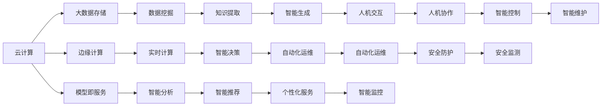

                 

# 云计算与AI的融合：贾扬清的独特视角，Lepton AI的云与AI战略

## 1. 背景介绍

随着云计算和大数据技术的快速发展，AI技术在各个行业的应用变得愈发广泛。云计算与AI的深度融合，正成为推动数字经济转型升级的关键力量。而作为AI领域的专家，贾扬清教授的独特视角和Lepton AI的战略规划，为我们带来了深刻的启示。

### 1.1 贾扬清的贡献

贾扬清教授，作为深度学习领域的重要人物，长期致力于AI技术的研究和教育工作。他在深度学习、计算机视觉、自然语言处理等多个领域取得了卓越的成就，撰写了多部经典技术书籍，影响深远。

作为Lepton AI的创始人，贾扬清教授强调“云计算+AI”的深度融合，致力于打造基于云计算的AI应用平台，为企业提供一站式的AI解决方案。Lepton AI在视觉、语音、自然语言处理等领域推出了一系列具有行业特色的AI产品，帮助企业快速落地AI应用，提升生产力和效率。

### 1.2 云与AI战略的兴起

云计算与AI的融合，正在成为推动数字经济发展的核心引擎。AI技术通过云计算的分布式计算能力、弹性扩展机制和高效存储服务，大幅降低了企业应用AI技术的门槛，加速了AI技术的普及和应用。

与此同时，AI技术也在不断增强云计算的智能化水平。通过AI模型对大数据的分析与处理，云计算平台能够实现更高层次的自动调度和资源优化，提升云服务质量。云与AI的相互促进，将推动更多企业数字化转型，加速产业升级。

## 2. 核心概念与联系

### 2.1 核心概念概述

云计算与AI的融合，主要涉及以下几个核心概念：

- **云计算(Cloud Computing)**：通过互联网提供按需的、可扩展的计算资源和存储服务，包括计算资源、存储资源、网络资源等。
- **人工智能(Artificial Intelligence, AI)**：利用计算机技术和算法，使计算机系统能够模拟、延伸和扩展人类的智能。
- **大数据(Big Data)**：指数量巨大、复杂多样、实时动态的数据集，通过大数据技术可进行深度分析和挖掘，从中获取有价值的信息。
- **边缘计算(Edge Computing)**：在靠近数据源处进行数据的存储、处理和分析，减少数据传输和延迟，提升响应速度。
- **模型即服务(Model as a Service, MaaS)**：将AI模型封装成服务，通过API接口进行调用，简化应用开发和部署。

这些概念之间相互关联，共同构成了云计算与AI融合的生态系统。通过云计算与AI的深度融合，可以实现数据的高效存储与处理、AI模型的灵活部署与应用、边缘计算的高效执行等，为各行业提供强大的智能支持。

### 2.2 核心概念联系

通过以下Mermaid流程图，可以更直观地展示云计算与AI的联系与交互：



这个流程图展示了云计算与AI在数据存储与处理、实时计算与分析、智能决策与推荐、人机交互与控制等多个环节的互动与协同。

## 3. 核心算法原理 & 具体操作步骤

### 3.1 算法原理概述

云计算与AI的融合，主要通过云计算平台提供底层计算和存储资源，结合AI模型对数据进行深度分析和挖掘，实现智能决策与推荐。

云计算平台通过虚拟化技术，将物理计算和存储资源封装成虚拟机和存储卷，供用户按需使用。用户可以将数据上传到云端，通过分布式计算集群进行数据处理与分析，存储在云端的分布式文件系统中。

AI模型通常分为训练和推理两个阶段。在训练阶段，模型使用云计算平台的分布式计算能力，通过GPU、TPU等高性能计算资源进行训练，实现高效的模型参数优化。在推理阶段，模型通过云计算平台的API接口进行调用，对实时数据进行智能分析和处理。

### 3.2 算法步骤详解

云计算与AI的融合，主要涉及以下几个关键步骤：

**Step 1: 数据收集与存储**

- 收集各业务系统的数据，包括结构化数据和非结构化数据。
- 将数据上传到云计算平台，存储在云数据库中，如MySQL、Redis等。
- 使用分布式文件系统，如HDFS、S3等，存储大规模数据集。

**Step 2: 数据预处理与清洗**

- 对数据进行去重、去噪、去重等预处理操作。
- 使用ETL工具，如Apache Nifi、Talend等，进行数据清洗和转换。
- 对数据进行特征提取和标准化，为后续的模型训练做准备。

**Step 3: 模型训练与优化**

- 使用云计算平台的分布式计算资源，进行模型的训练与优化。
- 选择合适的优化算法，如随机梯度下降、Adam等，进行参数更新。
- 使用正则化技术，如L1、L2正则化、Dropout等，防止过拟合。
- 使用自动混合精度、模型并行等技术，提高训练效率。

**Step 4: 模型推理与部署**

- 将训练好的模型，通过API接口进行调用，实现实时推理与预测。
- 使用云计算平台的分布式计算能力，进行模型推理和预测，提升处理效率。
- 使用边缘计算技术，在靠近数据源处进行本地推理，减少延迟和带宽消耗。

**Step 5: 模型评估与优化**

- 使用评估指标，如准确率、召回率、F1-score等，评估模型的性能。
- 通过云计算平台的弹性扩展机制，调整资源配置，优化模型性能。
- 使用A/B测试等方法，对比不同模型的效果，选择最优模型。

### 3.3 算法优缺点

云计算与AI的融合，具有以下优点：

- **灵活性高**：云计算平台提供弹性计算资源，能够快速应对业务波动和模型计算需求。
- **高效性**：分布式计算和存储能力，大幅提升了数据处理和模型训练的效率。
- **可扩展性强**：云计算平台具有强大的弹性扩展能力，能够快速扩容，满足大规模计算需求。
- **安全性高**：云计算平台提供完善的安全防护机制，保障数据和模型安全。

同时，也存在一些缺点：

- **数据隐私风险**：将数据上传到云平台，存在数据泄露和隐私风险。
- **网络延迟较高**：边缘计算还未普及，数据传输和存储在云端，网络延迟较高。
- **成本较高**：云计算平台的使用成本较高，尤其是存储和计算资源的使用。

### 3.4 算法应用领域

云计算与AI的融合，在各个行业都有广泛的应用：

- **金融行业**：利用AI模型进行风险评估、信用评分、投资组合优化等，提升金融服务的智能化水平。
- **医疗行业**：通过AI模型进行病历分析、影像诊断、药物研发等，提升医疗服务的智能化水平。
- **零售行业**：使用AI模型进行商品推荐、客户画像分析、供应链优化等，提升零售效率和服务质量。
- **制造行业**：利用AI模型进行预测性维护、智能制造、质量控制等，提升制造效率和产品质量。
- **智能交通**：通过AI模型进行交通流量预测、自动驾驶、智能调度等，提升交通管理水平。

## 4. 数学模型和公式 & 详细讲解 & 举例说明

### 4.1 数学模型构建

云计算与AI的融合，通常涉及以下数学模型：

- **分布式计算模型**：基于MapReduce等分布式计算框架，将计算任务分配到多个节点并行处理。
- **深度学习模型**：基于神经网络等深度学习模型，进行数据分类、预测、生成等任务。
- **优化算法**：如随机梯度下降、Adam等，用于参数优化和模型训练。

以深度学习模型为例，其数学模型通常包括输入层、隐藏层和输出层，每个层包含多个神经元。输入层接收原始数据，隐藏层进行特征提取与表示，输出层输出预测结果。模型的参数更新通过反向传播算法进行，优化算法用于参数优化。

### 4.2 公式推导过程

以卷积神经网络(CNN)为例，其数学模型推导如下：

设输入为 $x$，输出为 $y$，卷积核为 $w$，偏置为 $b$，激活函数为 $f$，卷积操作的公式为：

$$
y = f\left(\sum_{i=1}^n \sum_{j=1}^m (x * w)_{i,j} + b\right)
$$

其中，$n$ 和 $m$ 分别为卷积核的高和宽，$*$ 表示卷积运算。

### 4.3 案例分析与讲解

以图像分类任务为例，CNN模型通常包含多个卷积层和池化层，每个层负责提取不同的特征。通过多层的特征提取与表示，CNN模型能够识别出图像中不同的对象和特征。

具体而言，CNN模型的训练过程通常包括以下步骤：

1. **数据预处理**：将原始图像数据进行归一化、去噪等预处理操作。
2. **模型搭建**：使用Keras或TensorFlow等框架搭建CNN模型。
3. **模型训练**：使用训练集数据进行模型训练，选择合适的优化算法进行参数更新。
4. **模型评估**：使用验证集数据评估模型性能，选择合适的模型。
5. **模型推理**：使用测试集数据进行模型推理，评估模型效果。

## 5. 项目实践：代码实例和详细解释说明

### 5.1 开发环境搭建

云计算与AI的融合项目通常需要使用多种工具和平台。以下是一些常用的开发环境搭建流程：

1. **云平台选择**：选择合适的云平台，如AWS、Azure、Google Cloud等，根据需求选择不同的计算资源和存储资源。
2. **虚拟机搭建**：使用虚拟机技术，搭建计算节点和存储节点。
3. **分布式文件系统**：使用HDFS、S3等分布式文件系统，存储大规模数据集。
4. **数据预处理工具**：使用Apache Nifi、Talend等工具，进行数据清洗和转换。
5. **深度学习框架**：使用TensorFlow、PyTorch等深度学习框架，搭建和训练深度学习模型。

### 5.2 源代码详细实现

以下是使用TensorFlow搭建CNN模型的示例代码：

```python
import tensorflow as tf
from tensorflow.keras import layers

# 定义卷积神经网络模型
model = tf.keras.Sequential()
model.add(layers.Conv2D(32, (3, 3), activation='relu', input_shape=(32, 32, 3)))
model.add(layers.MaxPooling2D((2, 2)))
model.add(layers.Conv2D(64, (3, 3), activation='relu'))
model.add(layers.MaxPooling2D((2, 2)))
model.add(layers.Flatten())
model.add(layers.Dense(64, activation='relu'))
model.add(layers.Dense(10, activation='softmax'))

# 编译模型
model.compile(optimizer='adam', loss='sparse_categorical_crossentropy', metrics=['accuracy'])

# 训练模型
model.fit(train_images, train_labels, epochs=10, validation_data=(test_images, test_labels))
```

### 5.3 代码解读与分析

以上代码展示了如何使用TensorFlow搭建CNN模型，并进行训练和评估。具体解释如下：

- **模型定义**：使用Sequential模型定义卷积神经网络，包含卷积层、池化层和全连接层。
- **编译模型**：选择合适的优化器和损失函数，编译模型。
- **训练模型**：使用训练集数据进行模型训练，设置训练轮数和验证集数据。
- **评估模型**：使用测试集数据评估模型性能，输出训练精度和验证精度。

## 6. 实际应用场景

### 6.1 智能推荐系统

智能推荐系统是云计算与AI融合的重要应用场景。通过AI模型对用户行为数据进行分析和挖掘，生成个性化推荐结果。具体而言，智能推荐系统通常包括以下几个步骤：

1. **用户行为数据收集**：收集用户的历史行为数据，如浏览记录、购买记录等。
2. **数据预处理与特征提取**：对用户行为数据进行预处理和特征提取，如向量化、归一化等。
3. **模型训练**：使用深度学习模型，如协同过滤、神经网络等，训练推荐模型。
4. **模型推理**：使用训练好的模型，对新用户的行为数据进行推理和预测，生成推荐结果。
5. **结果反馈与优化**：根据用户的反馈数据，不断优化推荐模型，提升推荐效果。

### 6.2 智能客服系统

智能客服系统是另一个重要的应用场景。通过AI模型对用户查询进行分析和理解，生成智能回复。具体而言，智能客服系统通常包括以下几个步骤：

1. **用户查询数据收集**：收集用户的查询数据，包括文本、语音等。
2. **数据预处理与特征提取**：对查询数据进行预处理和特征提取，如分词、语音识别等。
3. **模型训练**：使用深度学习模型，如序列到序列模型、Transformer等，训练智能客服模型。
4. **模型推理**：使用训练好的模型，对用户的查询进行推理和回复。
5. **结果反馈与优化**：根据用户的反馈数据，不断优化智能客服模型，提升回复效果。

## 7. 工具和资源推荐

### 7.1 学习资源推荐

以下是一些推荐的云计算与AI融合学习的资源：

1. **Google Cloud AI & Machine Learning Professional Specialization**：由Google提供的深度学习与人工智能课程，涵盖从入门到高级的各个知识点。
2. **AWS Certified Machine Learning – Specialty**：由AWS提供的机器学习认证课程，涵盖云计算与AI融合的相关技术。
3. **Microsoft Certified: Azure AI Engineer Associate**：由Microsoft提供的Azure AI工程师认证课程，涵盖Azure平台的AI应用。
4. **Lepton AI官方文档**：Lepton AI官方提供的文档，包括技术手册、开发指南、案例分析等。
5. **《云计算与人工智能融合技术》书籍**：详细介绍云计算与AI融合的技术体系和应用场景。

### 7.2 开发工具推荐

以下是一些推荐的云计算与AI融合开发工具：

1. **TensorFlow**：由Google主导开发的深度学习框架，支持分布式计算和模型部署。
2. **PyTorch**：由Facebook开发的深度学习框架，灵活性高，支持动态计算图。
3. **Keras**：高层次的深度学习框架，易于上手，支持TensorFlow和PyTorch等后端。
4. **Amazon SageMaker**：AWS提供的云机器学习平台，支持模型训练和推理。
5. **Azure Machine Learning**：微软提供的云机器学习平台，支持模型训练、推理和部署。

### 7.3 相关论文推荐

以下是一些推荐的云计算与AI融合相关的论文：

1. **Scalable Deep Learning with Cloud and GPU Clusters**：详细介绍了使用云计算平台进行深度学习训练的流程和技术。
2. **Cloud-Based Deep Learning: A Survey of Architectures, Systems, and Techniques**：综述了云计算平台上的深度学习应用和技术。
3. **Edge Computing: Architectural Prototypes, Applications, and Open Research Issues**：介绍了边缘计算在云计算中的应用和挑战。
4. **Model as a Service for Enterprise Transformation**：介绍了MaaS在企业中的部署和应用。

## 8. 总结：未来发展趋势与挑战

### 8.1 研究成果总结

云计算与AI的融合，正在成为推动数字经济转型的重要引擎。通过云计算平台提供的计算资源和存储服务，AI模型能够快速训练和部署，实现高效的数据分析和智能决策。

### 8.2 未来发展趋势

未来云计算与AI的融合，将呈现以下几个发展趋势：

1. **边缘计算的普及**：边缘计算能够减少数据传输和延迟，提升处理速度和响应能力，成为云计算的重要补充。
2. **模型即服务的普及**：MaaS技术将进一步普及，简化应用开发和部署，提升用户体验。
3. **联邦学习的普及**：通过联邦学习，能够在保护数据隐私的前提下，实现模型训练和优化。
4. **自动化机器学习的发展**：通过自动化机器学习(AutoML)技术，能够自动完成数据预处理、模型选择和调参等任务。
5. **跨领域知识的融合**：将不同领域的数据和知识进行融合，提升模型的泛化能力和应用效果。

### 8.3 面临的挑战

尽管云计算与AI的融合取得了显著进展，但仍面临诸多挑战：

1. **数据隐私和安全**：数据上传和存储在云端，存在数据泄露和隐私风险。
2. **网络延迟和带宽**：边缘计算尚未普及，数据传输和存储在云端，网络延迟较高。
3. **计算成本**：云计算平台的使用成本较高，尤其是在存储和计算资源的使用上。
4. **模型解释性和可控性**：AI模型的黑盒特性，导致其决策过程难以解释和控制。

### 8.4 研究展望

未来的研究需要从以下几个方面进行突破：

1. **数据隐私保护**：开发更安全的加密技术和隐私保护技术，保障数据隐私和安全。
2. **模型解释性和可控性**：增强模型的可解释性和可控性，提升用户信任和接受度。
3. **自动化机器学习**：通过自动化机器学习技术，降低开发门槛，提升模型效果。
4. **联邦学习**：探索更多联邦学习技术，提升模型的泛化能力和隐私保护能力。
5. **跨领域知识融合**：探索更多跨领域知识融合方法，提升模型的泛化能力和应用效果。

## 9. 附录：常见问题与解答

**Q1: 云计算与AI的融合有哪些实际应用场景？**

A: 云计算与AI的融合在多个领域有广泛应用，包括智能推荐、智能客服、金融风控、医疗诊断、智能制造、智能交通等。

**Q2: 云计算与AI融合中常见的优化技术有哪些？**

A: 云计算与AI融合中常见的优化技术包括自动混合精度、分布式计算、模型并行、联邦学习等。

**Q3: 云计算与AI融合的挑战有哪些？**

A: 云计算与AI融合的挑战包括数据隐私安全、网络延迟较高、计算成本高、模型解释性和可控性不足等。

**Q4: 云计算与AI融合的未来发展趋势有哪些？**

A: 云计算与AI融合的未来发展趋势包括边缘计算的普及、模型即服务的普及、联邦学习的普及、自动化机器学习的发展、跨领域知识的融合等。

**Q5: 如何提升云计算与AI融合的模型效果？**

A: 提升云计算与AI融合的模型效果，可以从以下几个方面入手：数据预处理与清洗、选择合适的模型和优化算法、使用分布式计算资源、进行模型训练与优化、使用边缘计算等。

---

作者：禅与计算机程序设计艺术 / Zen and the Art of Computer Programming

