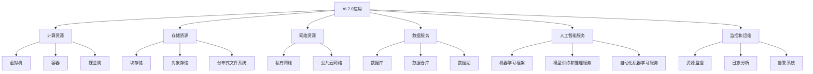

                 

# 云计算：为 AI 2.0 应用提供灵活、可扩展的资源

在过去几年中，人工智能(AI)技术经历了飞速发展，特别是AI 2.0时代的到来，使得AI在各行业的应用越来越深入，从传统的图像识别、语音识别等任务，到自然语言处理、智能推荐等高级应用，AI的潜力被不断挖掘和发挥。然而，AI 2.0应用的广泛部署和高效运行，需要大规模计算资源的支撑，云计算作为现代IT基础设施的重要组成部分，扮演着关键的角色。本文将探讨云计算如何为AI 2.0应用提供灵活、可扩展的资源，以及未来在AI领域的应用前景。

## 1. 背景介绍

### 1.1 问题由来

随着AI 2.0技术的发展，AI应用变得越来越复杂，需要处理的数据量越来越大，计算需求也越来越高。例如，自然语言处理(NLP)任务需要处理大量的文本数据，图像识别任务需要处理高分辨率图像数据，智能推荐系统需要处理和分析用户行为数据等。这些任务通常需要极大的计算资源和时间，这对传统的单机计算资源提出了严峻挑战。

为了解决这些问题，云计算平台应运而生，提供了一种灵活、可扩展的计算资源解决方案，能够根据AI应用的计算需求动态调整资源分配，满足不同AI任务的计算需求。云计算平台不仅提供了高性能计算资源，还提供了丰富的工具和服务，帮助开发者更高效地进行AI应用开发和部署。

### 1.2 问题核心关键点

云计算平台通常由以下几个核心组件构成：

- 计算资源：包括虚拟机、容器、裸金属等不同类型的计算资源，支持CPU、GPU、TPU等高性能计算硬件。
- 存储资源：包括块存储、对象存储、分布式文件系统等不同类型的存储资源，支持高速读写、大容量存储。
- 网络资源：包括私有网络和公共云网络，提供高速、安全的网络连接。
- 数据服务：包括数据库、数据仓库、数据湖等数据存储和处理服务，支持大数据处理、实时数据流处理。
- 人工智能服务：包括机器学习框架、模型训练和推理服务、自动化机器学习服务，支持AI模型的训练、部署和优化。
- 监控和运维：包括资源监控、日志分析、告警系统等，帮助用户管理和监控云资源。

这些组件的灵活组合和动态调整，使得云计算平台能够适应不同AI应用的计算需求，提供了高效、可靠的计算环境。

## 2. 核心概念与联系

### 2.1 核心概念概述

云计算平台通过提供弹性计算资源和强大的基础设施，支持AI 2.0应用的高效运行。AI 2.0应用通常需要高性能计算资源和大规模数据存储，云计算平台能够根据应用需求动态调整资源分配，提供按需计算和弹性扩展的计算资源，支持复杂的AI模型训练和推理。

### 2.2 核心概念原理和架构的 Mermaid 流程图



这个流程图展示了AI 2.0应用与云计算平台中的各类资源和服务之间的连接关系。AI 2.0应用需要计算资源、存储资源、网络资源、数据服务、人工智能服务以及监控和运维服务，云计算平台提供了多种类型的计算资源、存储资源、网络资源、数据服务、人工智能服务以及监控和运维服务，支持AI 2.0应用的灵活运行和高效部署。

## 3. 核心算法原理 & 具体操作步骤

### 3.1 算法原理概述

云计算平台的核心算法原理是基于资源调度和负载均衡。云计算平台根据AI 2.0应用的计算需求，动态调整计算资源分配，实现资源的有效利用和负载均衡。通过资源调度和负载均衡，云计算平台能够在资源紧张时快速分配新资源，避免资源浪费和系统负载过高。

### 3.2 算法步骤详解

云计算平台的资源调度和负载均衡算法通常包括以下几个步骤：

1. **资源感知**：云计算平台感知到AI 2.0应用对计算资源的需求，例如通过API接口、消息队列、监控系统等。

2. **资源分配**：云计算平台根据感知到的资源需求，分配计算资源，例如分配虚拟机、容器等。

3. **负载均衡**：云计算平台根据计算资源的使用情况，进行负载均衡，例如将任务分配到使用率较低的计算节点上。

4. **资源回收**：云计算平台在AI 2.0应用资源需求下降时，回收计算资源，避免资源浪费。

### 3.3 算法优缺点

云计算平台的资源调度和负载均衡算法具有以下优点：

1. **灵活性**：云计算平台可以根据AI 2.0应用的计算需求动态调整资源分配，支持按需计算和弹性扩展。

2. **高效性**：云计算平台能够实现资源的有效利用和负载均衡，避免资源浪费和系统负载过高。

3. **可扩展性**：云计算平台支持大规模计算资源扩展，能够满足不同规模的AI 2.0应用需求。

4. **可靠性和可用性**：云计算平台提供了高可用性和高可靠性的计算资源，支持故障自动切换和容错。

云计算平台的资源调度和负载均衡算法也存在一些缺点：

1. **延迟**：云计算平台的资源分配和负载均衡需要一定的时间，可能会带来一定的延迟。

2. **复杂性**：云计算平台的资源调度和负载均衡算法较为复杂，需要考虑多方面的因素，如资源可用性、任务优先级等。

3. **成本**：云计算平台提供的按需计算和弹性扩展可能带来较高的成本，需要根据实际情况进行成本控制。

### 3.4 算法应用领域

云计算平台的资源调度和负载均衡算法主要应用于以下几个领域：

1. **大数据处理**：云计算平台支持大规模数据存储和处理，能够支持实时数据流处理、大数据批处理等任务。

2. **机器学习**：云计算平台提供了高性能计算资源和数据服务，支持大规模机器学习模型的训练和推理。

3. **自然语言处理**：云计算平台支持大规模文本数据的处理和存储，能够支持自然语言处理任务的训练和推理。

4. **智能推荐**：云计算平台支持大规模用户行为数据的存储和分析，能够支持智能推荐系统的训练和推理。

## 4. 数学模型和公式 & 详细讲解 & 举例说明

### 4.1 数学模型构建

云计算平台通常使用分布式系统模型来描述其资源调度和负载均衡过程。假设云计算平台有 $N$ 个计算节点，每个节点的计算能力为 $C_i$，当前系统负载为 $L$，AI 2.0应用需要的计算能力为 $C_a$。则资源调度和负载均衡的数学模型可以描述为：

$$
\min_{C_i} \sum_{i=1}^N (L_i - C_i)^2
$$

其中 $L_i$ 为当前节点 $i$ 的负载，$C_i$ 为节点 $i$ 分配的计算能力。目标函数为最小化系统的负载平方和，即最小化系统的负载差异。

### 4.2 公式推导过程

上述目标函数的推导过程如下：

1. **目标函数构建**：假设系统负载为 $L$，则系统负载与节点负载之和应该等于AI 2.0应用需要的计算能力 $C_a$。

2. **负载平衡约束**：为了最小化系统的负载差异，需要使得每个节点的负载尽量平衡，即 $L_i$ 与 $C_i$ 尽量相等。

3. **平方和最小化**：使用平方和最小化的方法，可以保证每个节点的负载差异尽量小，同时保证系统负载的总和等于 $C_a$。

4. **求解**：上述目标函数可以使用梯度下降等优化算法进行求解，得到每个节点的最优计算能力 $C_i$。

### 4.3 案例分析与讲解

假设云计算平台有 5 个计算节点，每个节点的计算能力为 100Gflops，当前系统负载为 100Gflops，AI 2.0应用需要的计算能力为 200Gflops。则资源调度和负载均衡的求解过程如下：

1. 将 200Gflops 分配到 5 个节点中，使得每个节点的负载尽量平衡。

2. 假设节点 1、2、3、4、5 的负载分别为 20Gflops、50Gflops、30Gflops、40Gflops、60Gflops，则每个节点的计算能力应该分别为 80Gflops、60Gflops、60Gflops、60Gflops、60Gflops。

3. 节点 1、2、3、4、5 的负载平方和为 20^2 + 50^2 + 30^2 + 40^2 + 60^2 = 8000。

4. 最小化 8000，即最小化系统的负载差异，使得每个节点的负载尽量平衡。

## 5. 项目实践：代码实例和详细解释说明

### 5.1 开发环境搭建

在进行云计算平台资源调度和负载均衡实践前，我们需要准备好开发环境。以下是使用Python和Kubernetes进行云计算平台资源调度和负载均衡的环境配置流程：

1. 安装Anaconda：从官网下载并安装Anaconda，用于创建独立的Python环境。

2. 创建并激活虚拟环境：
```bash
conda create -n cloud-env python=3.8 
conda activate cloud-env
```

3. 安装Kubernetes：使用Minikube或者Kubernetes集群，搭建Kubernetes环境。

4. 安装相关工具包：
```bash
pip install kubernetes psutil 
```

5. 配置环境变量：设置Kubernetes集群地址、认证信息等。

完成上述步骤后，即可在`cloud-env`环境中开始云计算平台资源调度和负载均衡的开发实践。

### 5.2 源代码详细实现

下面我们以Kubernetes集群为例，给出云计算平台资源调度和负载均衡的PyTorch代码实现。

```python
from kubernetes import client, config

# 加载Kubernetes配置
config.load_kube_config()

# 创建计算资源请求和限制
client = client.BatchV1Api()
cpu_limit = '1'
cpu_request = '0.5'
memory_limit = '2Gi'
memory_request = '1Gi'
requests = {
    'container': {
        'memory_request': memory_request,
        'cpu_request': cpu_request
    }
}
limits = {
    'container': {
        'memory_limit': memory_limit,
        'cpu_limit': cpu_limit
    }
}

# 创建Pod
api_response = client.create_namespaced_pod(
    body=client.V1PodSpec(
        api_version='v1',
        service_account_name='service_account_name',
        containers=[
            client.V1Container(
                name='container_name',
                image='image_name',
                resources=client.V1ResourceRequirements(**requests),
                limits=client.V1ResourceRequirements(**limits)
            )
        ],
        affinity=client.V1Affinity(),
        priority_class_name='priority_class_name'
    ),
    namespace='namespace_name'
)
```

在这个代码示例中，我们使用了Kubernetes的Python客户端，通过API接口创建了一个Pod，指定了计算资源请求和限制，并指定了优先级和优先级类。

### 5.3 代码解读与分析

让我们再详细解读一下关键代码的实现细节：

**Kubernetes的Python客户端**：
- 使用Kubernetes的Python客户端，可以方便地通过API接口进行Kubernetes资源的创建和操作。

**Pod创建**：
- 使用`client.create_namespaced_pod`函数创建Pod，指定了容器的计算资源请求和限制，以及优先级和优先级类。

**计算资源请求和限制**：
- 计算资源请求和限制可以指定容器的CPU和内存请求和限制，以确保容器在运行时获得足够的资源，并且不会占用过多的系统资源。

**优先级和优先级类**：
- 优先级和优先级类可以确保容器在集群中有良好的资源分配，避免因资源不足导致的运行问题。

**代码解读与分析**：
- 以上代码实现了使用Kubernetes的Python客户端创建Pod，指定了计算资源请求和限制，以及优先级和优先级类，可以支持AI 2.0应用的高效运行。

### 5.4 运行结果展示

运行上述代码后，Kubernetes将创建指定计算资源请求和限制的Pod，并根据集群中的资源分配情况进行负载均衡。系统负载将尽量平衡，同时保证AI 2.0应用获得足够的计算资源，支持其高效运行。

## 6. 实际应用场景

### 6.1 智能推荐系统

智能推荐系统需要处理和分析大规模用户行为数据，实现高效的个性化推荐。云计算平台提供了弹性计算资源和大规模数据存储服务，支持智能推荐系统的训练和推理。

具体而言，智能推荐系统可以采用多种算法进行推荐，例如协同过滤、基于内容的推荐、混合推荐等。这些算法需要大量的计算资源和时间进行训练和优化，云计算平台可以提供弹性计算资源，满足智能推荐系统的计算需求。同时，云计算平台还支持大规模数据存储和处理，能够高效存储和处理用户行为数据，支持智能推荐系统的数据存储和分析。

### 6.2 图像识别系统

图像识别系统需要处理和分析高分辨率图像数据，实现高效的图像分类和识别。云计算平台提供了高性能计算资源和大规模数据存储服务，支持图像识别系统的训练和推理。

具体而言，图像识别系统通常采用深度学习模型进行图像分类和识别，例如卷积神经网络(CNN)、目标检测模型等。这些模型需要大量的计算资源和时间进行训练和优化，云计算平台可以提供高性能计算资源，支持图像识别系统的模型训练和推理。同时，云计算平台还支持大规模数据存储和处理，能够高效存储和处理图像数据，支持图像识别系统的数据存储和分析。

### 6.3 自然语言处理系统

自然语言处理系统需要处理和分析大规模文本数据，实现高效的语言理解、生成和翻译等任务。云计算平台提供了弹性计算资源和大规模数据存储服务，支持自然语言处理系统的训练和推理。

具体而言，自然语言处理系统通常采用深度学习模型进行语言理解和生成，例如循环神经网络(RNN)、Transformer等。这些模型需要大量的计算资源和时间进行训练和优化，云计算平台可以提供弹性计算资源，支持自然语言处理系统的模型训练和推理。同时，云计算平台还支持大规模数据存储和处理，能够高效存储和处理文本数据，支持自然语言处理系统的数据存储和分析。

## 7. 工具和资源推荐

### 7.1 学习资源推荐

为了帮助开发者系统掌握云计算平台资源调度和负载均衡的理论基础和实践技巧，这里推荐一些优质的学习资源：

1. Kubernetes官方文档：Kubernetes的官方文档，提供了详细的使用指南和API参考。

2. Cloud Computing Principles and Paradigms：云计算领域的经典教材，深入讲解了云计算的基础原理和设计思想。

3. AWS Machine Learning for Data Engineers：AWS的官方指南，介绍了AWS云平台上的机器学习和数据处理服务。

4. Google Cloud AI and Machine Learning：Google云平台的AI和机器学习指南，介绍了Google云平台上的AI和机器学习服务。

5. Machine Learning with Amazon S3 and Spark：使用AWS S3和Spark进行机器学习的指南，介绍了AWS云平台上的数据存储和处理服务。

通过对这些资源的学习实践，相信你一定能够快速掌握云计算平台资源调度和负载均衡的精髓，并用于解决实际的AI应用问题。

### 7.2 开发工具推荐

高效的开发离不开优秀的工具支持。以下是几款用于云计算平台资源调度和负载均衡开发的常用工具：

1. Kubernetes：Google开源的容器编排系统，支持大规模的容器应用部署和调度。

2. Docker：开源的容器化平台，支持应用的无状态部署和弹性扩展。

3. Helm：Kubernetes的应用包管理器，支持应用的快速部署和管理。

4. Minikube：Kubernetes的本地运行环境，支持快速搭建和管理Kubernetes集群。

5. Jenkins：开源的自动化部署工具，支持应用的持续集成和部署。

6. Terraform：开源的云基础设施即代码工具，支持基础设施的自动化部署和管理。

合理利用这些工具，可以显著提升云计算平台资源调度和负载均衡的开发效率，加快创新迭代的步伐。

### 7.3 相关论文推荐

云计算平台资源调度和负载均衡技术的发展源于学界的持续研究。以下是几篇奠基性的相关论文，推荐阅读：

1. Google Borg: An Operational System for Workload Management in a Datacenter：Google Borg系统的论文，介绍了Google数据中心的工作负载管理方案。

2. A Cloud-Aware Approach to Deploying Large-Scale Deep Learning Systems：使用云计算平台部署大型深度学习系统的论文，介绍了云计算平台上的深度学习模型部署和优化。

3. Kubernetes: Large-Scale Resource Orchestration：Kubernetes的论文，介绍了Kubernetes的架构设计和调度机制。

4. Machine Learning at Scale: A Landscape of Best Practices：机器学习在云计算平台上的最佳实践论文，介绍了云计算平台上的机器学习应用。

5. Deep Learning with Google Cloud Platform: A Cloud-Aware Framework for Deep Learning Applications：使用Google云平台进行深度学习应用的论文，介绍了Google云平台上的深度学习服务。

这些论文代表了大规模云计算平台资源调度和负载均衡技术的发展脉络。通过学习这些前沿成果，可以帮助研究者把握学科前进方向，激发更多的创新灵感。

## 8. 总结：未来发展趋势与挑战

### 8.1 研究成果总结

本文对云计算平台资源调度和负载均衡方法进行了全面系统的介绍。首先阐述了云计算平台在AI 2.0应用中的作用和重要性，明确了云计算平台为AI应用提供灵活、可扩展资源的核心价值。其次，从原理到实践，详细讲解了云计算平台的资源调度和负载均衡算法，给出了云计算平台资源调度和负载均衡实践的完整代码示例。同时，本文还广泛探讨了云计算平台在AI 2.0应用中的实际应用场景，展示了云计算平台的高效性和可靠性。

通过本文的系统梳理，可以看到，云计算平台资源调度和负载均衡技术在AI 2.0应用中发挥了重要作用，为AI应用的广泛部署和高效运行提供了有力保障。未来，随着云计算技术的不断发展，云计算平台将在AI领域发挥更大的作用，推动AI应用的进一步普及和深入。

### 8.2 未来发展趋势

展望未来，云计算平台资源调度和负载均衡技术将呈现以下几个发展趋势：

1. 更高效的可扩展性：随着云计算技术的不断发展，云计算平台将支持更高效的资源扩展，能够快速响应AI 2.0应用的计算需求，支持更大规模的AI应用。

2. 更灵活的资源管理：云计算平台将支持更灵活的资源管理，能够根据AI 2.0应用的负载情况进行动态调整，实现更高效、更经济的资源使用。

3. 更智能的调度算法：云计算平台将引入更智能的调度算法，能够根据AI 2.0应用的特性和需求进行智能调度，提高系统的整体性能和用户体验。

4. 更强大的数据服务：云计算平台将支持更强大的数据服务，能够支持大规模数据的存储和处理，支持AI 2.0应用的数据存储和分析。

5. 更广泛的云平台支持：云计算平台将支持更广泛的云平台，包括AWS、Google Cloud、Azure等，支持更多企业和开发者使用云计算平台。

以上趋势凸显了云计算平台资源调度和负载均衡技术的广阔前景。这些方向的探索发展，将进一步提升云计算平台在AI领域的应用价值，推动AI应用的广泛普及和深入。

### 8.3 面临的挑战

尽管云计算平台资源调度和负载均衡技术已经取得了一定进展，但在迈向更加智能化、普适化应用的过程中，它仍面临一些挑战：

1. 延迟问题：云计算平台的资源调度和负载均衡算法存在一定的延迟，可能会对AI 2.0应用的实时性造成影响。

2. 成本问题：云计算平台提供的弹性计算资源和大规模数据存储可能带来较高的成本，需要合理控制资源使用。

3. 安全性问题：云计算平台中的资源调度和负载均衡算法可能存在安全隐患，需要加强安全防护措施。

4. 可扩展性问题：云计算平台需要支持更大规模的AI应用，需要解决资源扩展的瓶颈问题。

5. 兼容性问题：云计算平台需要支持多种AI 2.0应用，需要解决不同应用之间的兼容性问题。

6. 可维护性问题：云计算平台需要支持更高效、更稳定的运维，需要解决维护问题的瓶颈。

这些挑战需要进一步研究和解决，以便更好地支持AI 2.0应用的高效运行和广泛普及。

### 8.4 研究展望

面对云计算平台资源调度和负载均衡所面临的挑战，未来的研究需要在以下几个方面寻求新的突破：

1. 研究更高效的资源扩展算法：引入更高效的资源扩展算法，能够快速响应AI 2.0应用的计算需求，支持更大规模的AI应用。

2. 研究更灵活的资源管理策略：引入更灵活的资源管理策略，能够根据AI 2.0应用的负载情况进行动态调整，实现更高效、更经济的资源使用。

3. 研究更智能的调度算法：引入更智能的调度算法，能够根据AI 2.0应用的特性和需求进行智能调度，提高系统的整体性能和用户体验。

4. 研究更强大的数据服务：引入更强大的数据服务，能够支持大规模数据的存储和处理，支持AI 2.0应用的数据存储和分析。

5. 研究更广泛的支持：研究更广泛的云平台支持，支持更多企业和开发者使用云计算平台。

6. 研究更安全、更高效的运维机制：引入更安全、更高效的运维机制，确保云计算平台能够高效、稳定地支持AI 2.0应用的运行。

这些研究方向的探索发展，将进一步提升云计算平台在AI领域的应用价值，推动AI应用的广泛普及和深入。

## 9. 附录：常见问题与解答

**Q1：云计算平台资源调度和负载均衡算法有哪些？**

A: 云计算平台资源调度和负载均衡算法主要包括：

1. 静态资源分配算法：根据用户申请的资源规模和系统可用资源进行静态分配，适合资源需求固定的应用。

2. 动态资源分配算法：根据系统负载和资源使用情况进行动态调整，适合资源需求变化的应用。

3. 基于机器学习的资源分配算法：使用机器学习模型进行资源预测和分配，能够实现更智能的资源调度。

**Q2：云计算平台资源调度和负载均衡的性能如何？**

A: 云计算平台资源调度和负载均衡的性能取决于算法的实现和配置，通常具有以下性能特点：

1. 灵活性：能够根据AI 2.0应用的计算需求动态调整资源分配，支持按需计算和弹性扩展。

2. 高效性：能够实现资源的有效利用和负载均衡，避免资源浪费和系统负载过高。

3. 可扩展性：能够支持大规模计算资源扩展，能够满足不同规模的AI 2.0应用需求。

**Q3：云计算平台资源调度和负载均衡的优点有哪些？**

A: 云计算平台资源调度和负载均衡的优点主要包括：

1. 灵活性：能够根据AI 2.0应用的计算需求动态调整资源分配，支持按需计算和弹性扩展。

2. 高效性：能够实现资源的有效利用和负载均衡，避免资源浪费和系统负载过高。

3. 可扩展性：能够支持大规模计算资源扩展，能够满足不同规模的AI 2.0应用需求。

4. 可靠性：能够提供高可用性和高可靠性的计算资源，支持故障自动切换和容错。

5. 可维护性：能够提供高效的运维支持，确保云计算平台能够高效、稳定地支持AI 2.0应用的运行。

**Q4：云计算平台资源调度和负载均衡的缺点有哪些？**

A: 云计算平台资源调度和负载均衡的缺点主要包括：

1. 延迟：云计算平台的资源调度和负载均衡算法存在一定的延迟，可能会对AI 2.0应用的实时性造成影响。

2. 成本：云计算平台提供的弹性计算资源和大规模数据存储可能带来较高的成本，需要合理控制资源使用。

3. 安全性：云计算平台中的资源调度和负载均衡算法可能存在安全隐患，需要加强安全防护措施。

4. 兼容性：云计算平台需要支持多种AI 2.0应用，需要解决不同应用之间的兼容性问题。

**Q5：云计算平台资源调度和负载均衡的应用场景有哪些？**

A: 云计算平台资源调度和负载均衡的应用场景主要包括：

1. 大数据处理：支持大规模数据的存储和处理，支持实时数据流处理、大数据批处理等任务。

2. 机器学习：支持大规模机器学习模型的训练和推理。

3. 自然语言处理：支持大规模文本数据的处理和存储，支持自然语言处理任务的训练和推理。

4. 智能推荐：支持大规模用户行为数据的存储和分析，支持智能推荐系统的训练和推理。

5. 图像识别：支持高分辨率图像数据的处理和存储，支持图像识别任务的训练和推理。

6. 自然语言处理：支持大规模文本数据的处理和存储，支持自然语言处理任务的训练和推理。

总之，云计算平台资源调度和负载均衡技术在AI 2.0应用中发挥了重要作用，为AI应用的广泛部署和高效运行提供了有力保障。未来，随着云计算技术的不断发展，云计算平台将在AI领域发挥更大的作用，推动AI应用的进一步普及和深入。

