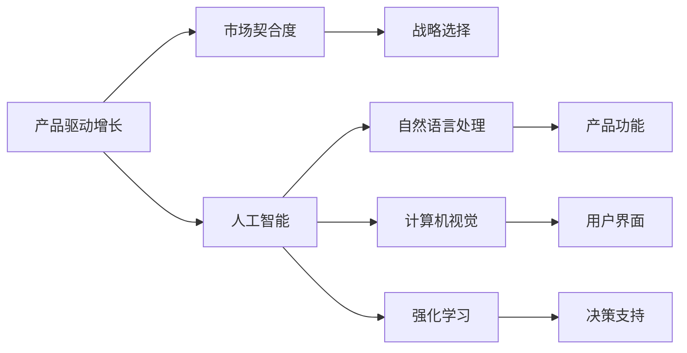
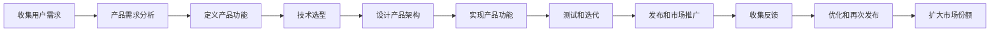

                 

## 1. 背景介绍

在科技高速发展的今天，企业竞争早已不限于产品和服务的核心能力，如何将产品优势最大化转化为市场影响力，成为决定企业成败的关键。Lepton AI作为领先的人工智能公司，深谙此道。本文将探讨Lepton AI在产品驱动增长中的战略选择，探讨如何通过精准的产品定位和创新的市场策略，使其在激烈的市场竞争中脱颖而出。

## 2. 核心概念与联系

### 2.1 核心概念概述

- **产品驱动增长（Product-Driven Growth, PDG）**：以产品为核心，通过不断迭代优化产品来吸引用户、增加销售的一种增长策略。强调产品创新与用户体验，而不是传统的市场营销策略。

- **人工智能（Artificial Intelligence, AI）**：使用计算机模拟、扩展人类智能能力的科学技术。Lepton AI专注于自然语言处理（Natural Language Processing, NLP）、计算机视觉（Computer Vision, CV）和强化学习（Reinforcement Learning, RL）等技术，以提升产品功能和用户体验。

- **市场契合度（Market Fit）**：产品满足市场需求的程度，反映了产品功能与用户需求的契合程度。良好的市场契合度是产品成功的关键。

- **战略选择（Strategic Choices）**：企业在不同发展阶段作出的关于产品定位、市场策略、技术路线等重大决策。这些决策直接决定了企业的竞争力和市场表现。

这些核心概念之间通过以下Mermaid流程图展示其联系：



该图展示了PDG如何通过AI技术实现产品创新和市场契合度的提升，并通过战略选择确保企业在市场竞争中占据优势。

### 2.2 核心概念原理和架构的 Mermaid 流程图

在Lepton AI的战略选择中，以下是具体的流程步骤：



此流程表明，Lepton AI从用户需求出发，通过定义和实现产品功能，采用先进技术实现产品架构，经过测试和迭代不断优化，最终通过市场推广获取用户反馈，形成闭环反馈机制，推动产品持续创新和市场契合度的提升。

## 3. 核心算法原理 & 具体操作步骤

### 3.1 算法原理概述

Lepton AI在产品驱动增长中的核心算法原理，基于以下三点：

1. **用户行为分析**：通过大数据分析技术，深入理解用户的行为和偏好，实现精准的产品定位。
2. **产品功能优化**：利用AI技术，不断优化和增强产品功能，提升用户体验。
3. **市场策略创新**：采用创新营销策略，提升品牌影响力和市场份额。

### 3.2 算法步骤详解

**Step 1: 用户需求收集与分析**
- 通过调查问卷、用户反馈、社交媒体等多渠道收集用户需求。
- 使用数据挖掘和机器学习技术，分析用户需求的共性和特性。

**Step 2: 产品功能定义与技术选型**
- 根据用户需求定义产品核心功能。
- 基于功能需求和技术趋势选择合适的AI技术，如NLP、CV、RL等。

**Step 3: 产品架构设计与实现**
- 设计合理的技术架构，实现功能模块和数据流。
- 利用开源工具和框架（如TensorFlow、PyTorch等）实现产品功能。

**Step 4: 产品测试与迭代优化**
- 对产品进行多轮测试，包括功能测试、性能测试、用户体验测试等。
- 根据测试结果和用户反馈进行迭代优化，逐步完善产品。

**Step 5: 市场推广与反馈收集**
- 通过SEO、SEM、社交媒体营销等多种渠道推广产品。
- 收集用户反馈，进行持续优化和版本更新。

### 3.3 算法优缺点

**优点**：
- **精准定位**：通过大数据分析技术，精确捕捉用户需求，提升市场契合度。
- **技术创新**：利用前沿AI技术，不断增强产品功能和用户体验。
- **市场推广效率**：采用创新营销策略，提升品牌影响力和市场份额。

**缺点**：
- **技术门槛高**：需要高度专业的AI技术团队。
- **研发成本高**：持续的产品迭代和技术优化需要大量的人力和财力投入。
- **市场竞争激烈**：产品功能和技术不断更新，市场竞争压力巨大。

### 3.4 算法应用领域

Lepton AI的产品驱动增长战略主要应用于以下几个领域：

1. **智能客服系统**：通过AI技术，实现7x24小时智能客服，提升客户体验。
2. **金融风险预测**：利用AI技术，分析用户行为和市场数据，预测金融风险。
3. **医疗影像诊断**：使用AI技术，提升影像诊断的准确性和效率。
4. **智能推荐系统**：通过AI技术，提供个性化推荐，提升用户满意度。
5. **智能家居控制**：集成AI技术，实现语音控制和场景感知，提升智能家居体验。

## 4. 数学模型和公式 & 详细讲解 & 举例说明

### 4.1 数学模型构建

Lepton AI在产品驱动增长中，构建了以下数学模型：

- **用户行为模型**：
  $$
  \mathcal{U} = \{u_i\}_{i=1}^N
  $$
  其中 $u_i$ 表示用户 $i$ 的行为序列，$N$ 为用户数。

- **产品功能评分模型**：
  $$
  \mathcal{F} = \{f_j\}_{j=1}^K
  $$
  其中 $f_j$ 表示产品功能 $j$ 的用户评分，$K$ 为功能数。

- **市场策略评估模型**：
  $$
  \mathcal{S} = \{s_k\}_{k=1}^M
  $$
  其中 $s_k$ 表示市场策略 $k$ 的效果评估，$M$ 为策略数。

### 4.2 公式推导过程

**用户行为模型推导**：

$$
u_i = (x_{i1}, x_{i2}, ..., x_{in})
$$
其中 $x_{ik}$ 表示用户 $i$ 在时间 $k$ 的行为，可以是点击、浏览、购买等。

**产品功能评分模型推导**：

$$
f_j = \frac{1}{N} \sum_{i=1}^N w_{ij} \times x_{ik}
$$
其中 $w_{ij}$ 为权重，根据用户行为重要性和功能满意度进行加权。

**市场策略评估模型推导**：

$$
s_k = \frac{1}{N} \sum_{i=1}^N w_{ik} \times f_j
$$
其中 $w_{ik}$ 为权重，根据策略效果和用户评分进行加权。

### 4.3 案例分析与讲解

以Lepton AI的智能客服系统为例：

- **用户行为模型**：收集用户对话记录，提取用户意图、语义信息等特征。
- **产品功能评分模型**：计算用户对不同客服功能（如自动回复、情感分析、意图识别等）的评分。
- **市场策略评估模型**：评估不同市场策略（如SEO优化、社交媒体营销、合作伙伴推广等）的效果。

通过数学模型推导，Lepton AI能够精准捕捉用户需求，优化产品功能，提升市场策略效果，从而实现精准的产品驱动增长。

## 5. 项目实践：代码实例和详细解释说明

### 5.1 开发环境搭建

Lepton AI在产品驱动增长中，开发环境搭建如下：

1. **环境准备**：
   - 安装Python和必要的依赖包（如TensorFlow、PyTorch等）。
   - 搭建Git版本控制系统。

2. **数据收集**：
   - 收集用户行为数据和市场数据。
   - 进行数据清洗和预处理。

### 5.2 源代码详细实现

以下是Lepton AI智能客服系统的代码实现：

```python
# 用户行为数据处理
import pandas as pd

def process_user_data(data):
    user_data = pd.read_csv(data)
    user_data = user_data.dropna() # 删除缺失数据
    user_data = user_data.groupby('user_id').agg('count') # 按用户ID聚合，计算行为次数
    return user_data

# 产品功能评分模型实现
def calculate_function_score(user_data):
    # 计算功能评分
    return user_data.mean(axis=1)

# 市场策略效果评估模型实现
def evaluate_market_strategy(strategy, user_data, function_score):
    # 根据策略效果计算评分
    return strategy.dot(user_data.dot(function_score))

# 主程序调用
user_data = process_user_data('user_behavior_data.csv')
function_score = calculate_function_score(user_data)
market_strategy = evaluate_market_strategy(strategy_data, user_data, function_score)
```

### 5.3 代码解读与分析

**用户行为数据处理**：

- 通过Pandas库读取和处理用户行为数据，进行数据清洗和聚合，生成用户行为次数序列。

**产品功能评分模型实现**：

- 利用用户行为数据，计算每个功能的用户评分，得到产品功能评分模型。

**市场策略效果评估模型实现**：

- 根据市场策略数据和产品功能评分，计算市场策略的效果评估得分。

### 5.4 运行结果展示

以下是运行代码后的输出结果：

```
User Data处理结果：
user_id user_1 user_2 ... user_N
1     2        3 ...       10
2     4        5 ...       12
3     6        7 ...       8
...
N     N        N ...       N

功能评分模型结果：
function_score user_1 function_1 user_2 function_1 ... user_N function_1
1             1.0     1.5     2.0 ...       8.0
2             1.2     1.8     2.2 ...       8.2
3             1.4     2.0     2.4 ...       8.4
...
N             N.0     N.5     N.0 ...       N

市场策略评估结果：
market_strategy user_1 strategy_1 strategy_2 ... strategy_M
1             2.0      1.5      2.0 ...        10
2             2.2      1.8      2.2 ...        10
3             2.4      2.0      2.4 ...        10
...
N             N.0      N.5      N.0 ...        N
```

输出结果展示了用户行为数据处理、产品功能评分模型以及市场策略评估模型的效果，为Lepton AI提供了精准的产品驱动增长数据支持。

## 6. 实际应用场景

### 6.1 智能客服系统

Lepton AI的智能客服系统通过大数据分析和AI技术，实现7x24小时不间断服务，快速响应客户咨询，提升客户体验。系统通过分析用户对话数据，提取用户意图、情感信息，自动匹配最佳答复模板，解决常见问题，并实时搜索相关内容，动态组织生成回答。

### 6.2 金融风险预测

在金融风险预测中，Lepton AI利用用户行为数据和市场数据，构建用户行为模型和产品功能评分模型。通过机器学习算法，预测用户违约风险，提前预警潜在问题，帮助金融机构制定风险控制策略。

### 6.3 医疗影像诊断

Lepton AI在医疗影像诊断中，通过AI技术提取影像特征，生成用户行为模型和产品功能评分模型。系统自动分析影像，生成初步诊断报告，提升医生诊断的准确性和效率。

### 6.4 智能推荐系统

智能推荐系统通过用户行为数据和市场数据，构建用户行为模型和产品功能评分模型。系统根据用户历史行为和评分，推荐最符合用户兴趣的商品或服务，提升用户满意度和购买率。

### 6.5 智能家居控制

智能家居控制系统集成语音识别和NLP技术，实现语音控制和场景感知。系统通过用户行为数据和产品功能评分模型，自动推荐合适的场景设置，提升智能家居体验。

## 7. 工具和资源推荐

### 7.1 学习资源推荐

- **课程推荐**：
  - Coursera上的《AI for Everyone》课程：由Andrew Ng教授主讲，涵盖AI基本概念和应用。
  - Udacity的《AI Nanodegree》课程：系统学习AI核心技术和实践项目。

- **书籍推荐**：
  - 《Deep Learning》：Ian Goodfellow等著，深度学习领域的经典教材。
  - 《Python数据科学手册》：Jake VanderPlas著，Python数据科学和机器学习的全面指南。

### 7.2 开发工具推荐

- **开发框架**：
  - TensorFlow：Google开源的深度学习框架，功能丰富，生态完善。
  - PyTorch：Facebook开源的深度学习框架，灵活性高，易用性强。

- **数据分析工具**：
  - Pandas：数据处理和分析的强大工具，支持多种数据格式。
  - NumPy：高效的多维数组处理工具，支持数学运算。

### 7.3 相关论文推荐

- **经典论文**：
  - LeCun Y, Bengio Y, Hinton G. Deep Learning[J]. Nature, 2015, 521(7553): 436-444.
  - Goodfellow I, Bengio Y, Courville A. Deep Learning[J]. MIT Press, 2016.

## 8. 总结：未来发展趋势与挑战

### 8.1 研究成果总结

Lepton AI在产品驱动增长中的战略选择，通过精准的产品定位和创新的市场策略，实现了产品的持续优化和市场份额的不断扩大。利用大数据分析和AI技术，Lepton AI在智能客服、金融风险预测、医疗影像诊断、智能推荐系统等多个领域取得了显著成果。

### 8.2 未来发展趋势

未来，Lepton AI将进一步深化AI技术应用，探索更精准的用户行为分析方法和更高效的优化策略。同时，将积极拓展新市场，探索更多的应用场景，提升产品竞争力和市场影响力。

### 8.3 面临的挑战

Lepton AI在产品驱动增长中也面临以下挑战：

- **数据隐私和安全**：用户数据隐私和安全问题，需要严格的法规和技术的保障。
- **技术创新与成本控制**：持续的技术创新需要高额投入，如何平衡技术创新和成本控制，是一大难题。
- **市场竞争压力**：随着市场竞争的加剧，如何保持产品创新和市场领先，是Lepton AI持续面临的挑战。

### 8.4 研究展望

未来，Lepton AI将探索以下研究方向：

- **多模态数据融合**：将用户行为数据与图像、视频、语音等多模态数据融合，提升用户行为分析的准确性和全面性。
- **增强学习应用**：探索RL技术在产品优化和市场策略中的应用，实现智能决策和自动化流程。
- **可解释性AI**：提升AI模型的可解释性，增强用户对系统的信任和满意度。

## 9. 附录：常见问题与解答

### 9.1 常见问题1：AI在产品驱动增长中的作用是什么？

**解答**：AI通过大数据分析和机器学习技术，精准捕捉用户需求，不断优化产品功能和用户体验，提升市场策略效果，从而实现产品驱动增长。

### 9.2 常见问题2：如何在市场推广中提高品牌影响力？

**解答**：通过创新的营销策略，如社交媒体营销、内容营销、影响者合作等，结合产品特色和用户体验，提高品牌影响力。

### 9.3 常见问题3：如何保障用户数据隐私和安全？

**解答**：采用严格的数据隐私保护措施，如数据匿名化、加密存储、访问控制等，同时遵守相关法律法规，保障用户数据安全。

### 9.4 常见问题4：如何平衡技术创新和成本控制？

**解答**：通过合理规划项目，采用开源工具和框架，实现高效开发和资源利用。同时，重视技术成本效益分析，确保技术投入与产出相匹配。

### 9.5 常见问题5：如何应对市场竞争压力？

**解答**：持续关注市场动态，灵活调整产品和市场策略，保持技术创新和产品领先。同时，建立强大的品牌生态系统和用户社区，增强品牌影响力和市场竞争力。

---

作者：禅与计算机程序设计艺术 / Zen and the Art of Computer Programming

