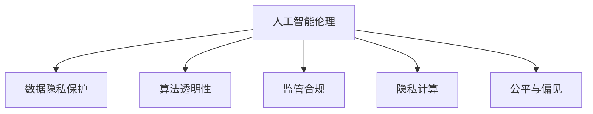

                 

# 人工智能创业：伦理与隐私的指南

> 关键词：人工智能伦理,数据隐私保护,算法透明性,监管合规,隐私计算,公平与偏见

## 1. 背景介绍

### 1.1 问题由来

在人工智能（AI）迅速发展的浪潮中，无论是科技巨头，还是创业公司，都纷纷涌入人工智能领域，试图抓住这一风口，实现业务模式的创新和转型。然而，在繁荣的背后，AI应用所带来的伦理和隐私问题，正在日益凸显。

在医疗领域，AI系统误诊导致患者错失治疗时机；在司法领域，AI决策系统出现偏见，导致法律不公平；在招聘场景中，AI筛选简历引发歧视；在人脸识别应用中，侵犯个人隐私等问题层出不穷。这些问题不仅损害了用户的利益，也给AI行业的声誉带来了负面影响。

近年来，各国政府和企业逐渐意识到，人工智能的伦理和隐私问题，已经到了不容忽视的地步。如欧盟的《通用数据保护条例》（GDPR），美国的《加州消费者隐私法》（CCPA）等，都对AI应用的伦理与隐私提出了严格要求。

### 1.2 问题核心关键点

在AI创业中，伦理与隐私问题主要体现在以下几个方面：

- **数据隐私保护**：如何在保证数据利用价值的同时，保护用户的隐私。
- **算法透明性与公平性**：如何确保算法的透明性和决策的公平性，避免偏见和歧视。
- **监管合规**：如何遵守各国的法律法规，规避法律风险。
- **隐私计算**：如何在保护隐私的前提下，实现数据的共享和分析。
- **伦理规范**：如何建立健全的伦理规范，引导AI健康发展。

这些问题的解决，既需要技术上的突破，也需要法律、伦理和社会各界的共同努力。本文将从技术、法律和伦理三个层面，系统探讨AI创业中的伦理与隐私问题，并提供相应的解决方案。

## 2. 核心概念与联系

### 2.1 核心概念概述

为了更好地理解AI创业中的伦理与隐私问题，本节将介绍几个密切相关的核心概念：

- **人工智能伦理（Artificial Intelligence Ethics）**：涉及AI技术的道德、伦理和社会影响，包括决策公正性、算法透明性、数据隐私、就业影响等。
- **数据隐私保护（Data Privacy Protection）**：指在数据采集、存储、传输和处理过程中，保护用户隐私不被侵犯的一系列措施和技术手段。
- **算法透明性（Algorithmic Transparency）**：指算法决策过程的可解释性和可追溯性，用户应当能够理解算法如何做出决策。
- **监管合规（Regulatory Compliance）**：指遵守政府和行业标准，确保AI应用符合法律法规，避免法律风险。
- **隐私计算（Privacy-Preserving Computing）**：通过技术手段，如差分隐私、联邦学习、安全多方计算等，在保护隐私的前提下，实现数据的共享和分析。
- **公平与偏见（Fairness and Bias）**：指在AI模型中，避免对特定群体产生歧视和偏见，保证决策的公平性。

这些概念之间的逻辑关系可以通过以下Mermaid流程图来展示：



这个流程图展示了大语言模型的核心概念及其之间的关系：

1. 人工智能伦理涉及数据的隐私保护、算法的透明性和公平性等。
2. 数据隐私保护、算法透明性、监管合规、隐私计算和公平与偏见，都是人工智能伦理的重要组成部分。
3. 这些概念共同构成了一个整体，影响着AI系统的设计、开发和应用。

## 3. 核心算法原理 & 具体操作步骤
### 3.1 算法原理概述

AI创业中的伦理与隐私问题，涉及算法的开发和应用，具体到算法设计、数据处理、模型训练和系统部署等各个环节。以下是一些核心的算法原理和技术手段：

- **数据匿名化（Data Anonymization）**：通过去除或扰动敏感信息，保护用户隐私，同时保持数据的可用性。
- **差分隐私（Differential Privacy）**：通过加入噪声，使得数据分析结果对单个数据点的变化不敏感，保护个体隐私。
- **联邦学习（Federated Learning）**：在分布式环境中共享模型，避免在集中式训练中暴露隐私数据。
- **安全多方计算（Secure Multi-Party Computation）**：允许多个参与方在不共享数据的前提下，联合计算共同问题的解决方案。
- **模型透明性（Model Transparency）**：使用可解释的模型和透明的决策流程，提高算法的可信度。
- **偏见检测与纠正（Bias Detection and Mitigation）**：通过公平性检测算法，发现并修正模型中的偏见。

### 3.2 算法步骤详解

AI创业中的伦理与隐私问题，涉及多个环节和步骤，以下是一个较为通用的AI创业伦理与隐私保护流程图：

1. **数据收集与预处理**：确保数据采集过程符合隐私保护法规，对数据进行匿名化和去标识化处理。
2. **模型开发与训练**：使用差分隐私、联邦学习等技术，确保模型训练过程中的数据隐私。
3. **模型部署与使用**：确保模型在应用中保持透明性和公平性，并提供解释性输出。
4. **隐私计算与数据共享**：使用安全多方计算等技术，实现隐私数据的安全共享和联合分析。
5. **公平性与偏见检测**：定期检测模型中的偏见，并采取措施纠正，确保模型决策的公平性。

### 3.3 算法优缺点

基于算法的设计和使用，AI创业中的伦理与隐私保护存在以下优点和缺点：

**优点**：

- 保护用户隐私，提升用户信任度。
- 确保算法的透明性和公平性，增强模型的可信度。
- 遵守法律法规，避免法律风险。
- 使用隐私计算技术，实现数据的安全共享和联合分析。

**缺点**：

- 技术复杂度高，实现成本高。
- 可能影响数据的可用性和模型性能。
- 对数据质量有较高要求，数据预处理复杂。
- 技术更新快，需持续关注最新研究进展。

### 3.4 算法应用领域

基于算法的设计和使用，AI创业中的伦理与隐私保护已广泛应用于以下几个领域：

- **医疗健康**：保护患者隐私，确保医疗决策的公平性和透明性。
- **金融服务**：保护用户数据隐私，确保金融决策的公正性和透明度。
- **智能合约**：保护交易各方的隐私，确保智能合约的公平性和可信度。
- **供应链管理**：保护供应链各方的隐私数据，实现供应链的协同优化。
- **智能城市**：保护城市居民的隐私，确保智能决策的公平性和透明性。

这些领域的应用，不仅提升了AI系统的价值，也促进了AI技术的社会责任和可持续发展。

## 4. 数学模型和公式 & 详细讲解 & 举例说明（备注：数学公式请使用latex格式，latex嵌入文中独立段落使用 $$，段落内使用 $)
### 4.1 数学模型构建

在AI创业中，伦理与隐私问题的解决，需要构建多个数学模型，以下是几个关键的数学模型：

- **差分隐私（Differential Privacy）**：定义一个差分隐私的ε-隐私保护模型，确保任意两个相邻的数据集对模型输出结果的影响小于ε。具体公式如下：

  $$
  \forall x, y \in \mathcal{D} \text{ such that } x \neq y, \quad \mathbb{P}[\mathcal{L}(M(x)) \leq \mathcal{L}(M(y))] \leq e^{-\epsilon}
  $$

- **公平性检测（Fairness Detection）**：使用统计学方法，检测模型是否对不同群体存在偏见。常用的公平性指标包括Demographic Parity、Equalized Odds等。具体公式如下：

  $$
  \text{Demographic Parity} = \mathbb{P}(Y=1|X=1) = \mathbb{P}(Y=1|X=0)
  $$

  $$
  \text{Equalized Odds} = \mathbb{P}(Y=1|X=1, \hat{Y} = 1) = \mathbb{P}(Y=0|X=0, \hat{Y} = 0)
  $$

  其中，$Y$ 表示真实标签，$\hat{Y}$ 表示模型预测标签，$X$ 表示群体特征。

### 4.2 公式推导过程

以下是几个关键的公式推导过程：

**差分隐私**：

差分隐私通过在模型输出中加入噪声，确保单个数据点的变化对模型输出结果的影响小于ε。公式如下：

$$
\mathcal{L}(\hat{y}) = \mathbb{E}_{x \sim \mathcal{D}} \big[ \ell(\hat{y}, x) + \mathcal{N}(0, \sigma^2) \big]
$$

其中，$\ell(\hat{y}, x)$ 表示模型在数据$x$上的损失，$\mathcal{N}(0, \sigma^2)$ 表示高斯噪声，$\sigma^2$ 表示噪声方差，$\epsilon$ 表示隐私保护参数。

**公平性检测**：

公平性检测常用的指标包括Demographic Parity和Equalized Odds。以Demographic Parity为例，其公式如下：

$$
\text{Demographic Parity} = \mathbb{P}(Y=1|X=1) = \mathbb{P}(Y=1|X=0)
$$

即在给定群体特征$X$的情况下，模型预测为正类的概率应相等。

### 4.3 案例分析与讲解

**案例1：医疗数据隐私保护**

在医疗健康领域，AI系统需要对大量敏感数据进行分析和处理。为了保护患者隐私，可以使用差分隐私技术，在模型训练和推理过程中加入噪声。具体实现如下：

1. **数据匿名化**：对患者的基本信息进行去标识化处理，确保无法反向识别患者身份。
2. **差分隐私训练**：在训练过程中，对每个样本加入高斯噪声，确保单个样本的变化对模型输出结果的影响小于ε。
3. **差分隐私推理**：在推理过程中，对患者数据加入噪声，确保单个患者数据的变化对模型输出结果的影响小于ε。

**案例2：金融风控系统**

在金融领域，AI系统需要对用户数据进行分析和处理，以识别潜在的信用风险。为了保护用户隐私，可以使用联邦学习技术，在分布式环境下共享模型。具体实现如下：

1. **数据加密**：对用户数据进行加密处理，确保数据在传输过程中不被窃取。
2. **联邦学习**：在多个金融机构之间共享模型参数，每个机构只共享本地数据，确保数据隐私。
3. **模型更新**：每个机构根据本地数据，独立更新模型参数，并定期同步模型更新。

## 5. 项目实践：代码实例和详细解释说明
### 5.1 开发环境搭建

在进行AI创业伦理与隐私保护的实践时，需要构建一个安全可靠的环境，以下是常用的开发环境搭建步骤：

1. **安装编程语言和工具**：
   - 安装Python、R等编程语言，并配置好环境。
   - 安装相关的数据处理和分析库，如Pandas、NumPy等。
   - 安装机器学习框架，如TensorFlow、PyTorch等。
   - 安装隐私保护库，如diffprivlib、TensorFlow Differential Privacy等。

2. **设置安全防护措施**：
   - 使用SSL/TLS加密技术，确保数据传输的安全性。
   - 使用访问控制列表(ACL)和防火墙，限制对数据和模型的访问权限。
   - 使用加密存储技术，保护数据存储的安全性。

### 5.2 源代码详细实现

以下是一个使用差分隐私和联邦学习技术实现金融风控系统的代码示例：

```python
import tensorflow as tf
from tensorflow_privacy.python.layers.layers import L2NormalizationLayer
from tensorflow_privacy.python.layers.layers import GaussianNoiseLayer

class DPFLModel(tf.keras.Model):
    def __init__(self, learning_rate, noise_level):
        super(DPFLModel, self).__init__()
        self.learning_rate = learning_rate
        self.noise_level = noise_level
        self.l1 = tf.keras.layers.Dense(64, activation='relu')
        self.l2 = tf.keras.layers.Dense(32, activation='relu')
        self.out = tf.keras.layers.Dense(1, activation='sigmoid')

    def call(self, inputs):
        x = self.l1(inputs)
        x = L2NormalizationLayer()(x)
        x = GaussianNoiseLayer(stddev=self.noise_level)(x)
        x = self.l2(x)
        return self.out(x)

def train_dpfl_model(data_train, data_val, data_test):
    model = DPFLModel(learning_rate=0.001, noise_level=0.1)
    optimizer = tf.keras.optimizers.Adam(learning_rate=0.001)
    loss_fn = tf.keras.losses.BinaryCrossentropy()

    def train_step(x):
        with tf.GradientTape() as tape:
            y_pred = model(x, training=True)
            loss = loss_fn(y_pred, y_true)
        grads = tape.gradient(loss, model.trainable_variables)
        optimizer.apply_gradients(zip(grads, model.trainable_variables))
        return loss

    def eval_step(x):
        y_pred = model(x, training=False)
        return y_pred

    train_dataset = tf.data.Dataset.from_tensor_slices(data_train)
    train_dataset = train_dataset.shuffle(1000).batch(32).map(train_step)

    val_dataset = tf.data.Dataset.from_tensor_slices(data_val)
    val_dataset = val_dataset.shuffle(1000).batch(32).map(eval_step)

    test_dataset = tf.data.Dataset.from_tensor_slices(data_test)
    test_dataset = test_dataset.shuffle(1000).batch(32).map(eval_step)

    for epoch in range(10):
        loss = train_dataset.reduce(tf.distribute.ReduceOp.MEAN)
        print(f'Epoch {epoch+1}, Train Loss: {loss:.4f}')
        val_loss = val_dataset.reduce(tf.distribute.ReduceOp.MEAN)
        print(f'Epoch {epoch+1}, Val Loss: {val_loss:.4f}')
        test_loss = test_dataset.reduce(tf.distribute.ReduceOp.MEAN)
        print(f'Epoch {epoch+1}, Test Loss: {test_loss:.4f}')
```

### 5.3 代码解读与分析

**代码说明**：

1. **DPFLModel类**：定义了一个差分隐私和联邦学习模型的结构。模型包括两个全连接层和一个输出层。
2. **train_step函数**：在训练过程中，每个样本加入差分隐私噪声。
3. **eval_step函数**：在评估过程中，模型不加入噪声，直接输出预测结果。
4. **train_dataset、val_dataset和test_dataset**：分别定义了训练集、验证集和测试集。

**代码分析**：

1. **差分隐私噪声**：在训练过程中，每个样本加入差分隐私噪声，确保单个样本的变化对模型输出结果的影响小于ε。
2. **联邦学习训练**：在分布式环境中，每个参与方独立训练模型，并在每个epoch后同步模型参数。
3. **模型评估**：在评估过程中，模型不加入噪声，直接输出预测结果。

## 6. 实际应用场景
### 6.1 智能医疗

在智能医疗领域，AI系统需要对患者数据进行分析和处理。为了保护患者隐私，可以使用差分隐私和模型透明性技术，确保AI系统的可靠性和可信度。

具体实现如下：

1. **数据匿名化**：对患者的基本信息进行去标识化处理，确保无法反向识别患者身份。
2. **差分隐私训练**：在训练过程中，对每个样本加入高斯噪声，确保单个样本的变化对模型输出结果的影响小于ε。
3. **模型透明性**：使用可解释的模型和透明的决策流程，提高算法的可信度。

### 6.2 智能城市

在智能城市领域，AI系统需要对城市数据进行分析和处理。为了保护城市居民的隐私，可以使用隐私计算和安全多方计算技术，确保数据的共享和分析在保护隐私的前提下进行。

具体实现如下：

1. **数据加密**：对城市居民的数据进行加密处理，确保数据在传输过程中不被窃取。
2. **安全多方计算**：在多个城市管理机构之间共享模型参数，每个机构只共享本地数据，确保数据隐私。
3. **联邦学习**：在多个城市管理机构之间共享模型参数，每个机构根据本地数据，独立更新模型参数，并定期同步模型更新。

### 6.3 智能合约

在智能合约领域，AI系统需要对交易数据进行分析和处理。为了保护交易各方的隐私，可以使用差分隐私和联邦学习技术，确保交易数据的共享和分析在保护隐私的前提下进行。

具体实现如下：

1. **数据匿名化**：对交易数据进行去标识化处理，确保无法反向识别交易方身份。
2. **差分隐私训练**：在训练过程中，对每个样本加入高斯噪声，确保单个样本的变化对模型输出结果的影响小于ε。
3. **联邦学习**：在多个交易平台之间共享模型参数，每个平台只共享本地数据，确保数据隐私。
4. **模型透明性**：使用可解释的模型和透明的决策流程，提高算法的可信度。

## 7. 工具和资源推荐
### 7.1 学习资源推荐

为了帮助开发者系统掌握AI创业中的伦理与隐私问题，这里推荐一些优质的学习资源：

1. **《人工智能伦理》（Artificial Intelligence Ethics）**：由著名AI伦理学家编写的书籍，系统介绍了AI伦理的基本概念和理论框架。
2. **《数据隐私保护》（Data Privacy Protection）**：由数据隐私保护专家编写的书籍，介绍了数据隐私保护的法律法规和技术手段。
3. **《算法透明性》（Algorithmic Transparency）**：由算法透明性研究者编写的书籍，介绍了算法的透明性和可解释性。
4. **《监管合规》（Regulatory Compliance）**：由法律法规专家编写的书籍，介绍了AI应用的监管合规要求和最佳实践。
5. **《隐私计算》（Privacy-Preserving Computing）**：由隐私计算研究者编写的书籍，介绍了隐私计算技术及其应用。

通过对这些资源的学习实践，相信你一定能够快速掌握AI创业中的伦理与隐私问题的解决思路，并应用于实际开发中。

### 7.2 开发工具推荐

高效的开发离不开优秀的工具支持。以下是几款用于AI创业伦理与隐私保护的常用工具：

1. **TensorFlow Differential Privacy**：TensorFlow提供的差分隐私库，支持差分隐私模型的构建和训练。
2. **PySyft**：Facebook开源的联邦学习框架，支持在分布式环境下共享模型，确保数据隐私。
3. **Google Cloud Privacy and AI**：Google提供的隐私计算和安全多方计算平台，支持数据隐私和安全计算。
4. **Fairness Indicators**：IBM开发的公平性检测工具，支持公平性指标的检测和纠正。

合理利用这些工具，可以显著提升AI创业伦理与隐私保护任务的开发效率，加快创新迭代的步伐。

### 7.3 相关论文推荐

AI创业中的伦理与隐私问题，涉及大量的研究论文，以下是几篇具有代表性的论文：

1. **《公平性检测》（Fairness Detection）**：介绍了几种常用的公平性检测方法，如Demographic Parity、Equalized Odds等。
2. **《差分隐私》（Differential Privacy）**：介绍了差分隐私的定义和实现方法，如Laplace机制、高斯机制等。
3. **《联邦学习》（Federated Learning）**：介绍了联邦学习的定义和实现方法，如模型聚合、模型更新等。
4. **《安全多方计算》（Secure Multi-Party Computation）**：介绍了安全多方计算的定义和实现方法，如多方安全协议、可验证计算等。
5. **《隐私计算》（Privacy-Preserving Computing）**：介绍了隐私计算的定义和实现方法，如差分隐私、联邦学习等。

这些论文代表了大语言模型微调技术的发展脉络。通过学习这些前沿成果，可以帮助研究者把握学科前进方向，激发更多的创新灵感。

## 8. 总结：未来发展趋势与挑战
### 8.1 总结

本文对AI创业中的伦理与隐私问题进行了全面系统的介绍。首先阐述了AI创业中伦理与隐私问题的重要性和解决思路，明确了差分隐私、联邦学习、安全多方计算等技术手段的实施步骤。其次，从数据匿名化、差分隐私训练、模型透明性等多个环节，详细讲解了AI创业伦理与隐私保护的技术实现。同时，本文还探讨了AI创业伦理与隐私保护在智能医疗、智能城市、智能合约等多个领域的应用前景，展示了技术手段的广阔前景。

通过本文的系统梳理，可以看到，AI创业中的伦理与隐私问题，不仅是技术挑战，更是法律、伦理和社会问题。如何在保证技术创新的同时，保障用户的隐私权益和社会的公平正义，是未来AI行业需要共同面对的课题。

### 8.2 未来发展趋势

展望未来，AI创业中的伦理与隐私问题将呈现以下几个发展趋势：

1. **差分隐私技术普及**：差分隐私技术将广泛应用于各类AI应用中，保护用户隐私的同时，确保数据可用性。
2. **联邦学习技术成熟**：联邦学习技术将进一步发展，实现更高效、安全的分布式计算。
3. **安全多方计算扩展**：安全多方计算技术将进一步扩展，支持更复杂、更安全的数据共享和联合分析。
4. **模型透明性增强**：使用可解释的模型和透明的决策流程，提高算法的可信度和用户信任度。
5. **公平性检测深入**：公平性检测技术将进一步深入，确保AI模型对不同群体的公平性。
6. **伦理规范完善**：建立健全的AI伦理规范，引导AI技术健康发展，促进社会责任。

这些趋势凸显了AI创业中的伦理与隐私问题的长期价值，也为未来技术的发展指明了方向。

### 8.3 面临的挑战

尽管差分隐私、联邦学习等技术手段已经取得了一定进展，但在AI创业中，伦理与隐私问题仍面临诸多挑战：

1. **技术复杂度高**：差分隐私、联邦学习等技术复杂度高，实现成本高，需要持续关注最新研究进展。
2. **性能影响显著**：差分隐私、联邦学习等技术可能影响数据的可用性和模型性能，需要权衡利弊。
3. **数据质量要求高**：数据预处理复杂，对数据质量有较高要求，需投入大量资源进行数据清洗和处理。
4. **法律与伦理冲突**：法律要求和伦理道德之间存在冲突，需兼顾各方利益，确保公平与透明。
5. **隐私计算技术不成熟**：隐私计算技术仍需进一步完善，确保数据共享和分析在保护隐私的前提下进行。

正视这些挑战，积极应对并寻求突破，才能实现AI创业伦理与隐私保护技术的成熟应用。

### 8.4 研究展望

面向未来，AI创业中的伦理与隐私问题需要在以下几个方向寻求新的突破：

1. **多技术融合**：结合差分隐私、联邦学习、安全多方计算等多种技术手段，实现更全面、更安全的数据保护。
2. **公平性与隐私平衡**：在保护隐私的前提下，实现公平性检测和纠正，确保AI模型的公正性。
3. **模型透明性提升**：使用可解释的模型和透明的决策流程，提高算法的可信度和用户信任度。
4. **隐私计算技术改进**：改进隐私计算技术，实现更高效、更安全的数据共享和联合分析。
5. **伦理规范制定**：建立健全的AI伦理规范，引导AI技术健康发展，促进社会责任。

这些研究方向需要跨学科合作，结合法律、伦理、技术等多个维度，共同推动AI创业伦理与隐私保护技术的进步。面向未来，我们期待AI技术在伦理与隐私保护方面取得更大突破，为构建安全、可信、公平的AI系统铺平道路。

## 9. 附录：常见问题与解答
**Q1：在数据收集和处理过程中，如何保护用户隐私？**

A: 在数据收集和处理过程中，可以通过以下措施保护用户隐私：

1. **数据匿名化**：对数据进行去标识化处理，确保无法反向识别用户身份。
2. **差分隐私**：在数据处理过程中，加入噪声，确保单个数据点的变化对模型输出结果的影响小于ε。
3. **联邦学习**：在分布式环境下共享模型，每个参与方只共享本地数据，确保数据隐私。
4. **安全多方计算**：允许多个参与方在不共享数据的前提下，联合计算共同问题的解决方案。

**Q2：在模型训练过程中，如何确保算法的透明性和公平性？**

A: 在模型训练过程中，可以通过以下措施确保算法的透明性和公平性：

1. **模型透明性**：使用可解释的模型和透明的决策流程，提高算法的可信度。
2. **公平性检测**：使用统计学方法，检测模型是否对不同群体存在偏见，并采取措施纠正。
3. **差分隐私**：在模型训练过程中，加入噪声，确保单个样本的变化对模型输出结果的影响小于ε。
4. **对抗训练**：在模型训练过程中，引入对抗样本，提高模型的鲁棒性和公平性。

**Q3：在AI应用中，如何确保合规性？**

A: 在AI应用中，可以通过以下措施确保合规性：

1. **法律法规学习**：了解各国的法律法规，确保AI应用符合法律要求。
2. **合规性检测**：使用自动化工具，检测AI应用的合规性，及时发现并纠正违规行为。
3. **隐私保护措施**：在AI应用中，加入隐私保护措施，如数据匿名化、差分隐私等，确保数据隐私。
4. **伦理规范制定**：建立健全的AI伦理规范，引导AI技术健康发展，促进社会责任。

这些措施可以帮助AI应用在遵守法律法规的同时，保护用户隐私，确保算法的透明性和公平性。

**Q4：在AI应用中，如何实现公平性与隐私保护的双重目标？**

A: 在AI应用中，可以结合差分隐私和公平性检测技术，实现公平性与隐私保护的双重目标：

1. **差分隐私**：在数据处理过程中，加入噪声，确保单个数据点的变化对模型输出结果的影响小于ε。
2. **公平性检测**：使用统计学方法，检测模型是否对不同群体存在偏见，并采取措施纠正。
3. **联邦学习**：在分布式环境下共享模型，每个参与方只共享本地数据，确保数据隐私。
4. **安全多方计算**：允许多个参与方在不共享数据的前提下，联合计算共同问题的解决方案。

通过以上措施，可以在保护隐私的同时，确保AI应用的公平性。

**Q5：在AI应用中，如何平衡性能和隐私保护？**

A: 在AI应用中，可以通过以下措施平衡性能和隐私保护：

1. **参数高效微调**：在微调过程中，只更新少量参数，保留大部分预训练参数不变，减少过拟合风险。
2. **差分隐私**：在数据处理过程中，加入噪声，确保单个数据点的变化对模型输出结果的影响小于ε。
3. **联邦学习**：在分布式环境下共享模型，每个参与方只共享本地数据，确保数据隐私。
4. **安全多方计算**：允许多个参与方在不共享数据的前提下，联合计算共同问题的解决方案。

这些措施可以在保护隐私的同时，保持模型的性能和可用性。

**Q6：在AI应用中，如何确保算法的透明性和公平性？**

A: 在AI应用中，可以通过以下措施确保算法的透明性和公平性：

1. **模型透明性**：使用可解释的模型和透明的决策流程，提高算法的可信度。
2. **公平性检测**：使用统计学方法，检测模型是否对不同群体存在偏见，并采取措施纠正。
3. **差分隐私**：在模型训练过程中，加入噪声，确保单个样本的变化对模型输出结果的影响小于ε。
4. **对抗训练**：在模型训练过程中，引入对抗样本，提高模型的鲁棒性和公平性。

这些措施可以帮助AI应用在确保算法的透明性和公平性的同时，保护用户隐私。

---

作者：禅与计算机程序设计艺术 / Zen and the Art of Computer Programming

