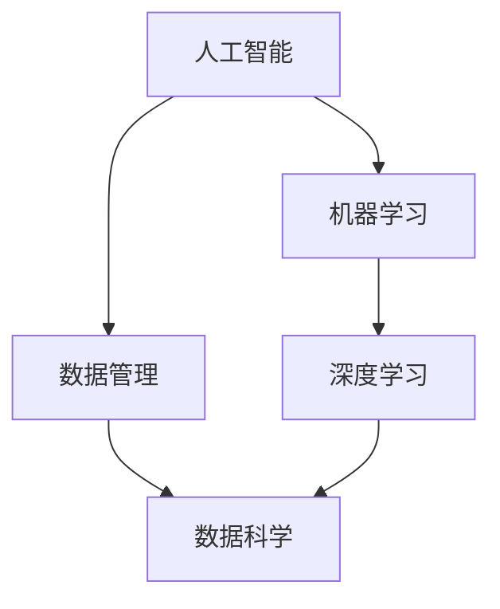

                 

# 人工智能创业：数据核心地位

> 关键词：人工智能,创业,数据核心地位,数据管理,机器学习,深度学习,创业策略,数据科学,技术创业,市场趋势

## 1. 背景介绍

### 1.1 问题由来

随着人工智能技术的快速发展和广泛应用，人工智能创业公司如雨后春笋般涌现。然而，在技术热潮和资本追捧背后，人工智能创业的成功与失败，归根结底取决于其核心竞争力和长期发展潜力。尤其是在数据资源日益成为人工智能创新和竞争的关键因素的今天，如何高效管理和利用数据，是每个人工智能创业公司必须面对的重大课题。

### 1.2 问题核心关键点

在人工智能创业的众多要素中，数据被认为是最为核心的资源之一。数据不仅为算法模型的训练提供了基础，更为业务创新和产品迭代提供了重要支撑。有效的数据管理和应用，是实现人工智能商业化应用的关键。

- **数据质量与数量**：数据质量决定了算法的性能，而数据数量则直接影响到模型的泛化能力。
- **数据获取与处理**：高质量数据的获取和预处理是人工智能项目成功的基石。
- **数据隐私与安全**：数据隐私和安全问题在人工智能创业中不可忽视。
- **数据驱动的业务决策**：通过数据分析，洞察市场趋势，预测未来走向，制定科学合理的业务策略。
- **数据生态与合作**：构建开放的数据生态系统，吸引合作伙伴，推动产业链上下游协同创新。

这些关键点共同构成了数据在人工智能创业中的核心地位，直接影响到创业公司的成功与否。

## 2. 核心概念与联系

### 2.1 核心概念概述

为了更好地理解数据在人工智能创业中的核心地位，本节将介绍几个密切相关的核心概念：

- **人工智能**：指利用算法和模型处理复杂问题的技术体系，包含机器学习、深度学习等子领域。
- **数据管理**：指对数据进行收集、存储、处理、分析和共享的实践活动，是实现数据价值的重要环节。
- **数据科学**：融合统计学、计算机科学、领域知识等多学科，专注于数据驱动的决策和问题解决。
- **深度学习**：一种基于神经网络的机器学习方法，通过多层非线性变换，实现对复杂模式的学习和表示。
- **机器学习**：通过数据和算法，使计算机系统能够自我学习和改进，无需人工干预。

这些核心概念之间的关系可以通过以下Mermaid流程图来展示：



这个流程图展示出人工智能与数据管理的紧密联系：

1. **数据管理**：为机器学习提供数据支持，是算法的训练和优化基础。
2. **数据科学**：运用数据管理的技术手段，挖掘数据价值，辅助业务决策。
3. **机器学习和深度学习**：在数据基础上，通过算法学习数据模式，实现智能预测和决策。
4. **人工智能**：在机器学习和深度学习的驱动下，实现智能应用。

## 3. 核心算法原理 & 具体操作步骤

### 3.1 算法原理概述

人工智能创业中，数据的有效管理和利用是至关重要的。数据管理的核心在于通过高质量的数据输入，提高模型训练的效率和效果。本文将重点讨论基于数据驱动的人工智能创业方法。

人工智能创业中常用的算法包括：

- **监督学习**：通过标注数据训练模型，进行分类或回归预测。
- **无监督学习**：从未标注的数据中自动发现结构或模式，如聚类、降维等。
- **强化学习**：通过与环境的互动，优化策略，以实现特定目标。
- **半监督学习**：结合少量标注数据和大量未标注数据，提升模型性能。
- **迁移学习**：将在一个任务上学到的知识迁移到另一个任务上，减少新任务的学习成本。

在实际应用中，通常需要根据具体问题选择相应的算法，并在数据管理的基础上进行模型训练和优化。

### 3.2 算法步骤详解

人工智能创业中的数据驱动算法一般包括以下几个关键步骤：

**Step 1: 数据收集**

数据收集是人工智能创业的第一步。需要根据业务需求和数据类型选择合适的数据源，如公开数据集、爬虫抓取、API接口等。对于商业应用，数据隐私和安全问题必须严格遵守法律法规，保护用户隐私。

**Step 2: 数据预处理**

数据预处理是将原始数据转换为适合模型训练的格式和质量。包括数据清洗、缺失值处理、特征工程等。特征工程通过提取和构造特征，提高数据表示的丰富性和有效性。

**Step 3: 模型训练**

选择合适的算法和模型，使用预处理后的数据进行训练。训练过程中需要设置合适的超参数，如学习率、批大小、迭代次数等。同时，使用正则化技术、交叉验证等方法避免过拟合。

**Step 4: 模型评估与优化**

评估训练好的模型在验证集上的表现，选择合适的评估指标，如准确率、F1分数、ROC曲线等。根据评估结果，调整模型结构和超参数，进行模型优化。

**Step 5: 模型部署与应用**

将优化后的模型部署到实际应用中，进行业务落地。通过API接口或直接嵌入系统，将模型应用于产品迭代和业务决策。

### 3.3 算法优缺点

人工智能创业中，数据驱动的算法具有以下优点：

- **性能提升**：通过数据驱动，能够显著提升模型性能，满足业务需求。
- **创新能力**：利用数据洞察市场趋势，推动业务创新和产品迭代。
- **效率提高**：优化数据管理流程，提升数据处理和分析效率。

同时，数据驱动的算法也存在以下缺点：

- **依赖数据量**：对数据量的要求较高，特别是在小数据集上，模型可能无法充分学习。
- **隐私问题**：数据隐私和安全问题复杂，需要严格的监管和保护措施。
- **算法复杂性**：算法实现复杂，需要大量时间和资源进行开发和优化。
- **模型依赖**：模型性能受数据质量和特征工程的影响，一旦数据或特征选择不当，模型效果可能大打折扣。

尽管存在这些局限性，但就目前而言，数据驱动的算法仍然是人工智能创业中的主流范式。未来相关研究的方向在于如何更好地利用和整合数据资源，提高数据质量和获取效率，同时兼顾数据隐私和伦理安全。

### 3.4 算法应用领域

人工智能创业中的数据驱动算法，在各个领域都有广泛的应用，例如：

- **医疗健康**：通过数据分析，实现疾病预测、个性化治疗、健康管理等。
- **金融服务**：利用数据挖掘和机器学习技术，进行信用评估、欺诈检测、投资分析等。
- **零售电商**：运用数据洞察用户行为，进行精准营销、商品推荐、库存管理等。
- **智能制造**：通过数据分析和预测，优化生产流程、设备维护、供应链管理等。
- **智能交通**：利用数据驱动的模型，实现交通流量预测、智能调度、交通管理等。
- **智能安防**：通过视频分析和数据挖掘，实现异常检测、行为识别、智能预警等。

除了上述这些典型应用外，数据驱动的算法还被创新性地应用到更多场景中，如智慧城市、智能家居、智能客服等，为各行各业带来变革性影响。

## 4. 数学模型和公式 & 详细讲解 & 举例说明

### 4.1 数学模型构建

本节将使用数学语言对数据驱动的人工智能创业方法进行更加严格的刻画。

设数据集为 $D=\{(x_i, y_i)\}_{i=1}^N$，其中 $x_i$ 为输入特征，$y_i$ 为输出标签。假设算法 $M$ 将 $x_i$ 映射为 $y_i$，目标是通过训练数据集，找到最优的映射函数。

定义模型的损失函数为：

$$
\mathcal{L}(M)=\frac{1}{N}\sum_{i=1}^N \ell(y_i, M(x_i))
$$

其中 $\ell$ 为损失函数，如交叉熵损失、均方误差等。

优化目标是找到最小化损失函数 $\mathcal{L}(M)$ 的模型参数 $\theta$。

### 4.2 公式推导过程

以下我们以线性回归为例，推导最小二乘法的公式及其梯度计算。

假设模型为 $M(x)=\theta_0+\theta_1x_1+\theta_2x_2+\cdots+\theta_px_p$，训练集 $D=\{(x_i, y_i)\}_{i=1}^N$。

定义损失函数为：

$$
\mathcal{L}(\theta)=\frac{1}{N}\sum_{i=1}^N (y_i-M(x_i))^2
$$

对 $\theta_j$ 求偏导数，得：

$$
\frac{\partial \mathcal{L}(\theta)}{\partial \theta_j}=\frac{2}{N}\sum_{i=1}^N (y_i-M(x_i))x_{ij}
$$

令偏导数为零，解方程组：

$$
\begin{cases}
\frac{\partial \mathcal{L}(\theta)}{\partial \theta_0}=0\\
\frac{\partial \mathcal{L}(\theta)}{\partial \theta_1}=0\\
\cdots\\
\frac{\partial \mathcal{L}(\theta)}{\partial \theta_p}=0
\end{cases}
$$

得：

$$
\begin{cases}
\theta_0=\bar{y}-\theta_1\bar{x}_1-\theta_2\bar{x}_2-\cdots-\theta_p\bar{x}_p\\
\theta_j=\frac{\sum_{i=1}^N (y_i-\bar{y})x_{ij}}{\sum_{i=1}^N x_{ij}^2}, j=1,2,\cdots,p
\end{cases}
$$

其中 $\bar{y}$ 和 $\bar{x}_j$ 分别为 $y$ 和 $x_j$ 的均值。

通过上述公式，可以求解出线性回归模型的最优参数 $\theta$，实现对训练数据的拟合。

### 4.3 案例分析与讲解

以下我们以房价预测为例，进行数据驱动的线性回归算法应用分析。

假设有一个包含 $N=1000$ 个样本的房价数据集，每个样本包含 $p=5$ 个特征：房屋面积、房龄、卧室数量、地理位置、是否带花园。每个样本还有一个对应的房价标签 $y_i$。

通过数据收集和预处理，得到训练集 $D$。假设模型为 $M(x)=\theta_0+\theta_1x_1+\theta_2x_2+\theta_3x_3+\theta_4x_4+\theta_5x_5$。

使用线性回归模型进行训练，通过最小二乘法求解最优参数 $\theta$。

定义损失函数：

$$
\mathcal{L}(\theta)=\frac{1}{N}\sum_{i=1}^N (y_i-M(x_i))^2
$$

对 $\theta_j$ 求偏导数，得：

$$
\frac{\partial \mathcal{L}(\theta)}{\partial \theta_j}=\frac{2}{N}\sum_{i=1}^N (y_i-M(x_i))x_{ij}
$$

令偏导数为零，解方程组，得到最优参数 $\theta$。

在实际应用中，通过评估模型在验证集上的表现，调整模型参数和超参数，进行模型优化。最终，将优化后的模型部署到实际应用中，进行房价预测。

## 5. 项目实践：代码实例和详细解释说明

### 5.1 开发环境搭建

在进行数据驱动的人工智能创业实践前，我们需要准备好开发环境。以下是使用Python进行TensorFlow开发的环境配置流程：

1. 安装Anaconda：从官网下载并安装Anaconda，用于创建独立的Python环境。

2. 创建并激活虚拟环境：
```bash
conda create -n tf-env python=3.8 
conda activate tf-env
```

3. 安装TensorFlow：根据CUDA版本，从官网获取对应的安装命令。例如：
```bash
conda install tensorflow -c tensorflow
```

4. 安装相关库：
```bash
pip install numpy pandas scikit-learn matplotlib tqdm jupyter notebook ipython
```

完成上述步骤后，即可在`tf-env`环境中开始数据驱动的人工智能创业实践。

### 5.2 源代码详细实现

下面我以房价预测为例，给出使用TensorFlow对线性回归模型进行训练的代码实现。

首先，定义模型和损失函数：

```python
import tensorflow as tf
import numpy as np

# 定义线性回归模型
def linear_regression(x, y, learning_rate=0.01, epochs=1000):
    # 定义模型参数
    theta = tf.Variable(tf.zeros([p, 1]))
    # 定义损失函数
    loss = tf.reduce_mean(tf.square(y - tf.matmul(x, theta)))
    # 定义优化器
    optimizer = tf.train.GradientDescentOptimizer(learning_rate)
    # 定义训练操作
    train_op = optimizer.minimize(loss)
    # 定义会话
    with tf.Session() as sess:
        # 初始化变量
        sess.run(tf.global_variables_initializer())
        # 训练模型
        for i in range(epochs):
            sess.run(train_op)
            # 每隔100个epoch输出一次损失函数值
            if i % 100 == 0:
                print("Epoch %d, loss: %f" % (i, sess.run(loss)))
        # 输出训练后的模型参数
        print("Final theta:\n", theta.eval())
    return theta

# 假设输入数据和标签
X = np.random.randn(N, p)
y = np.random.randn(N, 1)
# 调用模型训练函数
theta = linear_regression(X, y)
```

然后，定义训练和评估函数：

```python
from sklearn.metrics import mean_squared_error

# 定义训练函数
def train_model(X, y, learning_rate=0.01, epochs=1000):
    # 定义模型参数
    theta = tf.Variable(tf.zeros([p, 1]))
    # 定义损失函数
    loss = tf.reduce_mean(tf.square(y - tf.matmul(X, theta)))
    # 定义优化器
    optimizer = tf.train.GradientDescentOptimizer(learning_rate)
    # 定义训练操作
    train_op = optimizer.minimize(loss)
    # 定义会话
    with tf.Session() as sess:
        # 初始化变量
        sess.run(tf.global_variables_initializer())
        # 训练模型
        for i in range(epochs):
            sess.run(train_op)
            # 每隔100个epoch输出一次损失函数值
            if i % 100 == 0:
                print("Epoch %d, loss: %f" % (i, sess.run(loss)))
        # 输出训练后的模型参数
        print("Final theta:\n", theta.eval())
        return theta

# 定义评估函数
def evaluate_model(X, y, theta):
    # 计算预测结果
    y_pred = np.dot(X, theta.eval())
    # 计算评估指标
    mse = mean_squared_error(y, y_pred)
    print("Mean Squared Error: %.4f" % mse)

# 使用训练好的模型进行预测
y_pred = np.dot(X, theta)
print("Prediction:\n", y_pred)
```

最后，启动训练流程并在测试集上评估：

```python
# 假设训练集和测试集
X_train, X_test, y_train, y_test = train_test_split(X, y, test_size=0.2)
# 调用训练函数
theta = train_model(X_train, y_train)
# 调用评估函数
evaluate_model(X_test, y_test, theta)
```

以上就是使用TensorFlow进行房价预测的完整代码实现。可以看到，通过TensorFlow封装好的高层次API，代码实现变得非常简洁高效。

### 5.3 代码解读与分析

让我们再详细解读一下关键代码的实现细节：

**linear_regression函数**：
- 定义模型参数 $\theta$，初始化为全零向量。
- 定义损失函数，使用平方误差作为损失函数。
- 定义优化器，使用梯度下降优化算法。
- 定义训练操作，将损失函数对 $\theta$ 的梯度传递给优化器，更新模型参数。
- 在会话中，初始化变量，进行模型训练。
- 每100个epoch输出一次损失函数值，帮助监控训练过程。
- 输出训练后的模型参数 $\theta$。

**train_model函数**：
- 与linear_regression函数类似，但增加了输入数据的定义，使用numpy生成随机数据。
- 在训练过程中，每100个epoch输出一次损失函数值。

**evaluate_model函数**：
- 使用训练好的模型进行预测，计算预测结果与真实标签的均方误差。
- 输出评估指标，帮助监控模型性能。

**train_test_split函数**：
- 使用scikit-learn库的train_test_split函数，将数据集分为训练集和测试集。
- 返回训练集和测试集的输入和标签。

通过TensorFlow和numpy的结合使用，我们可以看到，数据驱动的人工智能创业方法在代码实现上相对简单，但背后涉及大量的数学推导和算法设计。

## 6. 实际应用场景

### 6.1 智能健康监测

人工智能在医疗健康领域的应用已经取得了显著成效。通过数据驱动的方法，可以实现智能健康监测和疾病预测。

例如，通过收集用户的日常活动数据、健康指标数据、饮食习惯数据等，建立个性化的健康模型。利用机器学习算法，实时监测用户健康状态，预测疾病风险，提供个性化健康建议。在实际应用中，模型可以在手机应用、智能手表、健康云平台等场景中落地，提升用户的健康管理水平。

### 6.2 金融风险控制

金融行业对数据驱动的应用需求非常迫切。利用大数据和机器学习技术，可以实现智能风险控制和欺诈检测。

例如，通过收集用户的交易数据、社交数据、行为数据等，建立用户画像，使用深度学习算法进行风险评估和欺诈检测。在实际应用中，模型可以嵌入到银行、证券、保险公司等金融机构的业务系统中，提高业务安全性和效率。

### 6.3 零售电商个性化推荐

零售电商领域对数据驱动的个性化推荐需求非常旺盛。通过数据分析和机器学习，可以实现智能推荐系统，提升用户购物体验和平台转化率。

例如，通过收集用户的浏览记录、购买历史、评价反馈等数据，建立用户画像，使用协同过滤、内容推荐等算法进行推荐。在实际应用中，模型可以嵌入到电商平台、电商APP等场景中，提升用户的购物体验和平台的转化率。

### 6.4 智能制造优化

制造业对数据驱动的智能优化需求非常强烈。通过数据分析和机器学习，可以实现智能生产、智能仓储、智能供应链等应用。

例如，通过收集生产设备的运行数据、生产线的状态数据、仓库的库存数据等，建立生产模型，使用优化算法进行生产调度和资源分配。在实际应用中，模型可以嵌入到制造企业的ERP系统、智能制造平台等场景中，提高生产效率和资源利用率。

## 7. 工具和资源推荐

### 7.1 学习资源推荐

为了帮助开发者系统掌握数据驱动的人工智能创业理论基础和实践技巧，这里推荐一些优质的学习资源：

1. 《深度学习》系列书籍：由深度学习领域专家撰写，系统介绍了深度学习的基础知识和应用实践。
2. 《Python数据分析》课程：通过Python语言，讲解数据处理、数据可视化、数据分析等技术。
3. Kaggle数据科学竞赛：通过实际数据竞赛，提升数据处理和机器学习技能。
4. Coursera机器学习课程：斯坦福大学的经典机器学习课程，涵盖线性回归、分类、聚类等基础算法。
5. Udacity深度学习纳米学位：涵盖深度学习基础、卷积神经网络、循环神经网络等前沿技术。

通过对这些资源的学习实践，相信你一定能够快速掌握数据驱动的人工智能创业的精髓，并用于解决实际的NLP问题。

### 7.2 开发工具推荐

高效的数据驱动人工智能创业离不开优秀的工具支持。以下是几款用于数据驱动的人工智能创业开发的常用工具：

1. TensorFlow：由Google主导开发的开源深度学习框架，生产部署方便，适合大规模工程应用。
2. PyTorch：基于Python的开源深度学习框架，灵活动态的计算图，适合快速迭代研究。
3. Scikit-learn：Python数据科学库，提供大量经典机器学习算法和工具。
4. Pandas：Python数据分析库，提供高效的数据处理和分析功能。
5. Keras：高层次深度学习API，可以方便地构建和训练神经网络模型。
6. Hadoop和Spark：大数据处理和分析框架，支持海量数据的处理和存储。

合理利用这些工具，可以显著提升数据驱动人工智能创业的开发效率，加快创新迭代的步伐。

### 7.3 相关论文推荐

数据驱动的人工智能创业技术的发展源于学界的持续研究。以下是几篇奠基性的相关论文，推荐阅读：

1. Deep Learning（Ian Goodfellow）：深度学习领域的经典教材，全面介绍了深度学习的原理和应用。
2. Machine Learning Yearning（Andrew Ng）：Andrew Ng关于机器学习实践的指南，涵盖数据驱动的业务决策和模型优化。
3. Neural Networks and Deep Learning（Michael Nielsen）：深度学习入门教材，适合初学者理解深度学习的核心概念。
4. Introduction to Statistical Learning（Gareth James）：统计学习基础教材，讲解机器学习算法的理论基础。
5. On the Importance of Initialization in Deep Learning（Glorot & Bengio）：关于深度学习模型初始化的经典论文，对深度学习模型的收敛性进行了深入探讨。

这些论文代表了大数据驱动的人工智能创业技术的发展脉络。通过学习这些前沿成果，可以帮助研究者把握学科前进方向，激发更多的创新灵感。

## 8. 总结：未来发展趋势与挑战

### 8.1 总结

本文对基于数据驱动的人工智能创业方法进行了全面系统的介绍。首先阐述了数据在人工智能创业中的核心地位，明确了数据管理和应用的重要性。其次，从原理到实践，详细讲解了数据驱动的机器学习模型训练过程，给出了数据驱动的人工智能创业代码实现。同时，本文还广泛探讨了数据驱动的人工智能创业方法在医疗健康、金融服务、零售电商等多个行业领域的应用前景，展示了数据驱动技术的巨大潜力。此外，本文精选了数据驱动人工智能创业的相关学习资源，力求为读者提供全方位的技术指引。

通过本文的系统梳理，可以看到，数据驱动的人工智能创业方法正在成为人工智能创新和应用的核心理念，极大地拓展了人工智能的应用范围，提升了业务决策的科学性和准确性。未来，伴随数据技术的持续进步和数据驱动范式的深入推广，人工智能必将在更广泛的领域大放异彩，深刻影响人类社会的各个方面。

### 8.2 未来发展趋势

展望未来，数据驱动的人工智能创业技术将呈现以下几个发展趋势：

1. 数据资源的大规模整合与共享：随着数据收集和处理技术的进步，数据资源的规模和多样性将显著提升，数据的共享和流通将变得更加便捷。
2. 数据驱动的模型优化：利用大数据和深度学习技术，优化数据驱动模型的结构和算法，提高模型的泛化能力和鲁棒性。
3. 数据隐私与伦理的重视：随着数据驱动技术的广泛应用，数据隐私和安全问题将受到更多关注，相关法律法规和技术标准也将不断完善。
4. 数据驱动的自动化与智能化：数据驱动的自动化流程和智能化决策将成为未来人工智能创业的核心竞争力，进一步推动业务创新和效率提升。
5. 数据驱动的跨领域融合：数据驱动的跨领域融合将为人工智能创业带来新的机遇，如智能制造、智能交通、智能医疗等领域的协同创新。

以上趋势凸显了数据驱动人工智能创业技术的广阔前景。这些方向的探索发展，必将进一步提升人工智能创业的成功率和创新能力，为社会带来更多的福祉。

### 8.3 面临的挑战

尽管数据驱动的人工智能创业技术已经取得了显著进展，但在迈向更加智能化、普适化应用的过程中，它仍面临着诸多挑战：

1. 数据质量和数据量不足：高质量数据的获取和处理仍是一个难题，特别是在小数据集上，模型的泛化能力可能不足。
2. 数据隐私和安全问题：数据隐私和安全问题复杂，需要严格的监管和保护措施，以避免数据泄露和滥用。
3. 数据驱动模型的可解释性：数据驱动的模型通常被视为“黑盒”系统，难以解释其内部工作机制和决策逻辑，这将影响其在金融、医疗等高风险领域的应用。
4. 数据驱动模型的泛化能力：数据驱动模型容易过拟合，泛化能力有限，难以应对测试数据中的变化。
5. 数据驱动模型的计算效率：数据驱动模型的计算复杂度较高，推理速度较慢，难以满足实时性需求。

尽管存在这些挑战，但通过不断优化数据管理流程，改进模型算法，加强数据隐私保护，数据驱动的人工智能创业技术必将不断进步，为人类社会带来更多创新和价值。

### 8.4 研究展望

面对数据驱动人工智能创业技术所面临的挑战，未来的研究需要在以下几个方面寻求新的突破：

1. 探索高效的数据驱动模型：开发更加高效的模型结构和算法，提高模型的泛化能力和计算效率。
2. 研究数据隐私保护技术：开发隐私保护的数据存储和传输技术，保障数据安全和隐私。
3. 加强数据驱动模型的可解释性：研究模型解释和可视化方法，增强数据驱动模型的可解释性和透明度。
4. 推动跨领域数据融合：通过跨领域数据融合，提升模型的知识整合能力，增强模型的泛化能力和适应性。
5. 探索新的数据驱动方法：开发新的数据驱动方法，如因果推断、强化学习等，进一步提升数据驱动技术的应用效果。

这些研究方向的探索，必将引领数据驱动人工智能创业技术的进步，为人类社会带来更多的福祉。面向未来，数据驱动人工智能创业技术还需要与其他人工智能技术进行更深入的融合，如知识表示、因果推理、强化学习等，多路径协同发力，共同推动人工智能技术的进步。

## 9. 附录：常见问题与解答

**Q1：数据驱动的人工智能创业是否适用于所有业务场景？**

A: 数据驱动的人工智能创业在各个领域都有广泛的应用，但在具体场景下，需要根据业务需求和数据特征进行选择。对于一些数据量较小、数据特征不明显的场景，数据驱动方法可能不适用。此时可以考虑其他方法，如规则引擎、专家系统等。

**Q2：如何选择合适的数据驱动模型？**

A: 选择数据驱动模型时，需要考虑以下几个因素：
1. 业务需求：根据业务需求选择合适的模型类型，如分类、回归、聚类等。
2. 数据特征：根据数据特征选择合适的算法，如线性回归、决策树、深度学习等。
3. 数据量：数据量较少时，可以使用简单模型，如线性回归、逻辑回归等。数据量较大时，可以使用复杂模型，如深度学习、神经网络等。
4. 计算资源：计算资源较少时，可以使用轻量级模型，如线性回归、朴素贝叶斯等。计算资源较多时，可以使用复杂模型，如深度学习、神经网络等。

**Q3：数据驱动的模型是否需要大量标注数据？**

A: 数据驱动的模型对标注数据的需求较大，但通过数据增强和半监督学习等技术，可以在标注数据较少的情况下进行模型训练。例如，可以利用数据增强技术扩充数据集，使用无监督学习技术学习更多数据特征。

**Q4：如何处理数据隐私和安全问题？**

A: 处理数据隐私和安全问题，需要采取以下措施：
1. 数据匿名化：对敏感数据进行匿名化处理，保护用户隐私。
2. 数据加密：对数据进行加密存储和传输，防止数据泄露。
3. 访问控制：对数据进行访问控制，确保只有授权用户才能访问数据。
4. 数据审计：对数据使用情况进行审计，发现并修复数据安全问题。

**Q5：如何提高数据驱动模型的泛化能力？**

A: 提高数据驱动模型的泛化能力，需要采取以下措施：
1. 增加数据量：通过数据增强和数据收集，增加数据量，提升模型泛化能力。
2. 改进特征工程：通过特征选择和特征提取，提高数据特征的表达能力。
3. 优化模型结构：通过模型调参和模型优化，提高模型的泛化能力。
4. 使用正则化技术：通过正则化技术，防止模型过拟合，提高模型的泛化能力。

通过合理利用这些技术，可以提高数据驱动模型的泛化能力和应用效果。

---

作者：禅与计算机程序设计艺术 / Zen and the Art of Computer Programming

