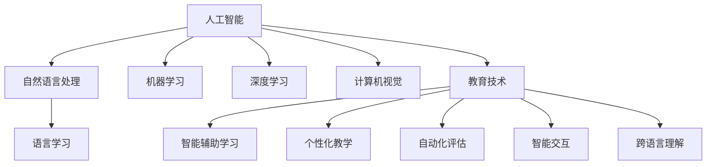

                 

## 1. 背景介绍

### 1.1 问题由来

随着人工智能技术的迅猛发展，教育领域迎来了新的变革机遇。人工智能，特别是自然语言处理(NLP)技术，已经开始被应用于语言学习的各个方面，从智能辅助学习、个性化教学到自动化评估，正逐步改变传统教育模式，提升教育效率和质量。语言学习作为全球化背景下的一项重要技能，其与人工智能的结合无疑是未来发展的必然趋势。

### 1.2 问题核心关键点

人工智能在语言学习中的应用，主要体现在以下几个方面：

- 智能辅助学习：通过自然语言理解和生成技术，为学习者提供个性化的学习建议和资源推荐。
- 个性化教学：利用机器学习和大数据分析，定制个性化学习路径，实现差异化教学。
- 自动化评估：应用自然语言处理技术，实现作业、测试的自动化评分，减轻教师负担。
- 智能交互：通过聊天机器人、虚拟助教等技术，实现学习者与AI的互动交流，增强学习效果。
- 跨语言理解：实现多语言之间的自动翻译和语义转换，促进语言学习和跨文化交流。

这些问题核心关键点构成了人工智能在语言学习中应用的框架，明确了其价值和目标。

### 1.3 问题研究意义

人工智能在教育领域的应用，尤其是语言学习，对于提升教育质量和效率具有重要意义：

1. 提升学习效果：通过个性化教学和智能辅助，帮助学生更好地掌握语言知识，提升学习兴趣和效率。
2. 减轻教师负担：自动化评分和智能助教可以减轻教师的日常工作量，使其有更多时间进行教学研究和与学生的互动。
3. 促进公平教育：个性化教学和自动化评估使得每个学生都能获得适合自己的学习资源和评价，促进教育公平。
4. 加速语言普及：通过自动化翻译和语义转换，降低语言学习障碍，促进跨语言交流和文化理解。
5. 推动教育技术创新：人工智能在教育中的应用推动了新技术的发展，为传统教育模式注入了新活力。

## 2. 核心概念与联系

### 2.1 核心概念概述

为更好地理解人工智能在语言学习中的应用，本节将介绍几个密切相关的核心概念：

- 人工智能(AI)：指通过计算机模拟人类智能行为的技术，包括机器学习、自然语言处理、计算机视觉等。
- 自然语言处理(NLP)：研究如何让计算机理解和处理自然语言的技术，是人工智能的重要分支之一。
- 机器学习(ML)：指计算机通过数据学习规律，从而进行预测、分类等任务的技术。
- 深度学习(Deep Learning)：一种特殊的机器学习方法，通过多层神经网络模拟人脑的神经元连接，实现复杂模式识别和自主学习。
- 计算机视觉(CV)：研究如何让计算机"看"和"理解"图像和视频的技术。
- 教育技术(Education Technology)：应用信息技术提升教育质量的技术和工具。
- 语言学习(Language Learning)：指学习者通过练习语言技能，掌握一门或多门语言的过程。

这些核心概念之间的逻辑关系可以通过以下Mermaid流程图来展示：



这个流程图展示了几大核心概念之间的关联性：

1. 人工智能通过多个子领域的技术实现，如自然语言处理、机器学习等。
2. 自然语言处理是人工智能的重要组成部分，与语言学习密切相关。
3. 机器学习和深度学习是实现自然语言处理的重要手段。
4. 计算机视觉扩展了人工智能的应用范围。
5. 教育技术是人工智能在教育中的应用载体。
6. 语言学习是教育技术的一个重要应用领域。
7. 智能辅助学习、个性化教学、自动化评估、智能交互、跨语言理解等具体应用场景，共同构成了人工智能在语言学习中的应用。

这些概念共同构成了人工智能在语言学习中的应用框架，为理解该领域的实际应用提供了基础。

## 3. 核心算法原理 & 具体操作步骤
### 3.1 算法原理概述

人工智能在语言学习中的应用，核心在于自然语言处理技术。自然语言处理技术通过语言模型、文本分类、情感分析、机器翻译等技术，帮助学习者更好地理解和应用语言。

语言模型是自然语言处理的基础，通过学习语言的统计规律，预测下一个词或短语的概率。常用的语言模型包括n-gram模型、隐马尔可夫模型(HMM)、条件随机场(CRF)、长短时记忆网络(LSTM)等。

文本分类任务是将文本数据分成不同的类别，如情感分类、主题分类等。常用的文本分类方法包括朴素贝叶斯、支持向量机(SVM)、逻辑回归、神经网络等。

情感分析是判断文本中表达的情感倾向，如积极、消极或中性。常用的情感分析方法包括情感词典、深度学习模型等。

机器翻译是将一种语言的文本转换为另一种语言的过程。常用的机器翻译模型包括统计机器翻译(SMT)、神经机器翻译(NMT)等。

### 3.2 算法步骤详解

以下是基于自然语言处理技术的应用步骤详解：

**Step 1: 数据预处理**
- 收集学习者的语料数据，如文章、笔记、对话记录等。
- 对文本进行清洗、分词、标注等预处理操作，去除噪声和无关信息。
- 对标注数据进行划分，分为训练集、验证集和测试集。

**Step 2: 模型训练**
- 选择适当的自然语言处理模型，如语言模型、文本分类模型等。
- 使用训练集数据进行模型训练，调整超参数，优化损失函数。
- 在验证集上评估模型性能，防止过拟合。

**Step 3: 模型应用**
- 使用训练好的模型对学习者的文本进行分析和处理。
- 根据学习者的需求，提供个性化学习建议、资源推荐、作业评分等服务。
- 应用机器翻译和语义转换技术，实现跨语言交流和理解。

### 3.3 算法优缺点

人工智能在语言学习中的应用，具有以下优点：

1. 个性化：通过数据分析和机器学习，能够为每个学习者提供个性化的学习建议和资源，提升学习效果。
2. 高效性：自动化评分和智能助教减轻教师负担，提高教育效率。
3. 普适性：跨语言理解和交互技术，促进不同文化背景的学习者交流。
4. 灵活性：多种自然语言处理技术和算法，满足不同学习者的需求。

同时，该方法也存在一些局限性：

1. 数据依赖：应用效果很大程度上取决于学习者数据的质量和多样性。
2. 技术复杂性：自然语言处理技术涉及多学科知识，需要较高的技术门槛。
3. 模型泛化：模型在不同数据集上的泛化性能可能存在差异。
4. 伦理问题：人工智能在应用过程中，可能涉及隐私保护、数据安全等伦理问题。

尽管存在这些局限性，但人工智能在语言学习中的应用前景仍然十分广阔，需要更多的研究和技术突破来克服其挑战。

### 3.4 算法应用领域

人工智能在语言学习中的应用，主要体现在以下几个方面：

- 智能辅助学习：通过自然语言理解和生成技术，为学习者提供个性化的学习建议和资源推荐。
- 个性化教学：利用机器学习和大数据分析，定制个性化学习路径，实现差异化教学。
- 自动化评估：应用自然语言处理技术，实现作业、测试的自动化评分，减轻教师负担。
- 智能交互：通过聊天机器人、虚拟助教等技术，实现学习者与AI的互动交流，增强学习效果。
- 跨语言理解：实现多语言之间的自动翻译和语义转换，促进语言学习和跨文化交流。

这些应用领域展示了人工智能在语言学习中应用的广泛性和深度，为教育技术的发展提供了新的方向。

## 4. 数学模型和公式 & 详细讲解
### 4.1 数学模型构建

本节将使用数学语言对基于自然语言处理技术的应用进行更加严格的刻画。

记学习者的文本数据为 $D=\{(x_i,y_i)\}_{i=1}^N, x_i \in \mathcal{X}, y_i \in \mathcal{Y}$，其中 $x_i$ 为文本数据，$y_i$ 为文本类别或情感标签。

定义模型 $M_{\theta}$ 在输入 $x_i$ 上的输出为 $\hat{y}=M_{\theta}(x_i) \in \mathcal{Y}$，表示模型对文本的预测类别或情感标签。

定义模型 $M_{\theta}$ 在数据样本 $(x,y)$ 上的损失函数为 $\ell(M_{\theta}(x),y)$，则在数据集 $D$ 上的经验风险为：

$$
\mathcal{L}(\theta) = \frac{1}{N} \sum_{i=1}^N \ell(M_{\theta}(x_i),y_i)
$$

在文本分类任务中，常用的损失函数包括交叉熵损失、负对数似然损失等。在情感分析任务中，可以使用均方误差损失、F1分数等。

### 4.2 公式推导过程

以情感分析为例，推导常用的情感词典和深度学习模型相结合的情感分析公式。

假设模型 $M_{\theta}$ 在输入 $x$ 上的输出为 $\hat{y}=M_{\theta}(x) \in [0,1]$，表示样本属于积极情感的概率。真实标签 $y \in \{0,1\}$。则情感分类问题可以表示为二分类问题。

使用情感词典提取文本中的情感词汇，得到词汇情感得分 $\vec{s}(x)$。将其与模型输出 $\hat{y}$ 结合，计算损失函数：

$$
\ell(M_{\theta}(x),y) = -[y\log \hat{y} + (1-y)\log (1-\hat{y})]
$$

将其代入经验风险公式，得：

$$
\mathcal{L}(\theta) = -\frac{1}{N}\sum_{i=1}^N [y_i\log M_{\theta}(x_i)+(1-y_i)\log(1-M_{\theta}(x_i))]
$$

根据链式法则，损失函数对参数 $\theta_k$ 的梯度为：

$$
\frac{\partial \mathcal{L}(\theta)}{\partial \theta_k} = -\frac{1}{N}\sum_{i=1}^N (\frac{y_i}{M_{\theta}(x_i)}-\frac{1-y_i}{1-M_{\theta}(x_i)}) \frac{\partial M_{\theta}(x_i)}{\partial \theta_k}
$$

其中 $\frac{\partial M_{\theta}(x_i)}{\partial \theta_k}$ 可进一步递归展开，利用自动微分技术完成计算。

在得到损失函数的梯度后，即可带入参数更新公式，完成模型的迭代优化。重复上述过程直至收敛，最终得到适应情感分析任务的最优模型参数 $\theta^*$。

## 5. 项目实践：代码实例和详细解释说明
### 5.1 开发环境搭建

在进行项目实践前，我们需要准备好开发环境。以下是使用Python进行PyTorch开发的环境配置流程：

1. 安装Anaconda：从官网下载并安装Anaconda，用于创建独立的Python环境。

2. 创建并激活虚拟环境：
```bash
conda create -n pytorch-env python=3.8 
conda activate pytorch-env
```

3. 安装PyTorch：根据CUDA版本，从官网获取对应的安装命令。例如：
```bash
conda install pytorch torchvision torchaudio cudatoolkit=11.1 -c pytorch -c conda-forge
```

4. 安装Transformers库：
```bash
pip install transformers
```

5. 安装各类工具包：
```bash
pip install numpy pandas scikit-learn matplotlib tqdm jupyter notebook ipython
```

完成上述步骤后，即可在`pytorch-env`环境中开始项目实践。

### 5.2 源代码详细实现

下面我们以情感分析任务为例，给出使用Transformers库对BERT模型进行情感分析的PyTorch代码实现。

首先，定义情感分析任务的数据处理函数：

```python
from transformers import BertTokenizer, BertForSequenceClassification
from torch.utils.data import Dataset, DataLoader
import torch
import numpy as np

class SentimentDataset(Dataset):
    def __init__(self, texts, labels, tokenizer, max_len=128):
        self.texts = texts
        self.labels = labels
        self.tokenizer = tokenizer
        self.max_len = max_len
        
    def __len__(self):
        return len(self.texts)
    
    def __getitem__(self, item):
        text = self.texts[item]
        label = self.labels[item]
        
        encoding = self.tokenizer(text, return_tensors='pt', max_length=self.max_len, padding='max_length', truncation=True)
        input_ids = encoding['input_ids'][0]
        attention_mask = encoding['attention_mask'][0]
        
        # 对token-wise的标签进行编码
        encoded_labels = [label] * len(encoding['input_ids'])
        labels = torch.tensor(encoded_labels, dtype=torch.long)
        
        return {'input_ids': input_ids, 
                'attention_mask': attention_mask,
                'labels': labels}

# 加载预训练模型和分词器
model = BertForSequenceClassification.from_pretrained('bert-base-cased', num_labels=2)
tokenizer = BertTokenizer.from_pretrained('bert-base-cased')

# 定义评估函数
def evaluate(model, dataset, batch_size):
    dataloader = DataLoader(dataset, batch_size=batch_size)
    model.eval()
    preds, labels = [], []
    with torch.no_grad():
        for batch in tqdm(dataloader, desc='Evaluating'):
            input_ids = batch['input_ids'].to(device)
            attention_mask = batch['attention_mask'].to(device)
            labels = batch['labels'].to(device)
            outputs = model(input_ids, attention_mask=attention_mask)
            logits = outputs.logits
            preds.append(logits.argmax(dim=1).tolist())
            labels.append(labels.tolist())
                
    print(classification_report(labels, preds))
```

然后，定义训练和评估函数：

```python
from torch.optim import AdamW
from transformers import Trainer, TrainingArguments
from sklearn.metrics import classification_report

device = torch.device('cuda') if torch.cuda.is_available() else torch.device('cpu')
model.to(device)

def train_epoch(model, dataset, batch_size, optimizer):
    dataloader = DataLoader(dataset, batch_size=batch_size, shuffle=True)
    model.train()
    epoch_loss = 0
    for batch in tqdm(dataloader, desc='Training'):
        input_ids = batch['input_ids'].to(device)
        attention_mask = batch['attention_mask'].to(device)
        labels = batch['labels'].to(device)
        model.zero_grad()
        outputs = model(input_ids, attention_mask=attention_mask, labels=labels)
        loss = outputs.loss
        epoch_loss += loss.item()
        loss.backward()
        optimizer.step()
    return epoch_loss / len(dataloader)

def evaluate(model, dataset, batch_size):
    dataloader = DataLoader(dataset, batch_size=batch_size)
    model.eval()
    preds, labels = [], []
    with torch.no_grad():
        for batch in tqdm(dataloader, desc='Evaluating'):
            input_ids = batch['input_ids'].to(device)
            attention_mask = batch['attention_mask'].to(device)
            labels = batch['labels'].to(device)
            outputs = model(input_ids, attention_mask=attention_mask)
            logits = outputs.logits
            preds.append(logits.argmax(dim=1).tolist())
            labels.append(labels.tolist())
                
    print(classification_report(labels, preds))
```

最后，启动训练流程并在测试集上评估：

```python
epochs = 5
batch_size = 16

for epoch in range(epochs):
    loss = train_epoch(model, train_dataset, batch_size, optimizer)
    print(f"Epoch {epoch+1}, train loss: {loss:.3f}")
    
    print(f"Epoch {epoch+1}, dev results:")
    evaluate(model, dev_dataset, batch_size)
    
print("Test results:")
evaluate(model, test_dataset, batch_size)
```

以上就是使用PyTorch对BERT进行情感分析任务微调的完整代码实现。可以看到，得益于Transformers库的强大封装，我们可以用相对简洁的代码完成BERT模型的加载和微调。

### 5.3 代码解读与分析

让我们再详细解读一下关键代码的实现细节：

**SentimentDataset类**：
- `__init__`方法：初始化文本、标签、分词器等关键组件。
- `__len__`方法：返回数据集的样本数量。
- `__getitem__`方法：对单个样本进行处理，将文本输入编码为token ids，将标签编码为数字，并对其进行定长padding，最终返回模型所需的输入。

**评估函数**：
- 使用PyTorch的DataLoader对数据集进行批次化加载，供模型训练和推理使用。
- 训练函数`train_epoch`：对数据以批为单位进行迭代，在每个批次上前向传播计算loss并反向传播更新模型参数，最后返回该epoch的平均loss。
- 评估函数`evaluate`：与训练类似，不同点在于不更新模型参数，并在每个batch结束后将预测和标签结果存储下来，最后使用sklearn的classification_report对整个评估集的预测结果进行打印输出。

**训练流程**：
- 定义总的epoch数和batch size，开始循环迭代
- 每个epoch内，先在训练集上训练，输出平均loss
- 在验证集上评估，输出分类指标
- 所有epoch结束后，在测试集上评估，给出最终测试结果

可以看到，PyTorch配合Transformers库使得BERT微调的代码实现变得简洁高效。开发者可以将更多精力放在数据处理、模型改进等高层逻辑上，而不必过多关注底层的实现细节。

当然，工业级的系统实现还需考虑更多因素，如模型的保存和部署、超参数的自动搜索、更灵活的任务适配层等。但核心的微调范式基本与此类似。

## 6. 实际应用场景
### 6.1 智能辅助学习

智能辅助学习系统能够根据学习者的需求，提供个性化的学习建议和资源推荐。例如，学习者在输入一段文本后，系统能够自动分析其情感倾向，并提供相应的学习建议，如推荐相关文章、视频等资源，帮助学习者更好地理解和掌握语言知识。

智能辅助学习系统通常包括以下几个关键模块：

- 自然语言理解模块：通过分词、词性标注等技术，理解学习者的输入文本。
- 情感分析模块：通过情感词典、深度学习模型等，分析学习者的情感倾向。
- 资源推荐模块：根据情感分析结果，推荐相关的学习资源。

例如，当学习者输入一段关于学习压力的文本时，智能辅助学习系统可以自动分析其情感倾向为消极，并推荐相关的心理咨询文章、视频，帮助其缓解压力。

### 6.2 个性化教学

个性化教学系统能够根据学习者的特点和学习需求，定制个性化的学习路径。例如，系统可以根据学习者的历史学习数据，分析其优势和不足，推荐个性化的学习任务和难度。

个性化教学系统通常包括以下几个关键模块：

- 数据分析模块：通过统计学习者的历史数据，分析其学习情况。
- 学习路径生成模块：根据数据分析结果，生成个性化的学习路径。
- 资源适配模块：根据学习路径，适配相关的学习资源。

例如，当系统发现某学习者在英语听力方面较弱时，可以为其推荐更多听力训练资源，并增加听力任务的难度。

### 6.3 自动化评估

自动化评估系统能够对学习者的作业和测试进行自动评分，减轻教师的负担，提高评估的公平性和效率。

自动化评估系统通常包括以下几个关键模块：

- 数据预处理模块：对学习者的作业和测试进行预处理，去除无关信息。
- 评分模型模块：通过自然语言处理技术，自动评分学习者的作业和测试。
- 结果反馈模块：根据评分结果，向学习者和教师提供反馈。

例如，当学习者提交一篇作文时，自动化评估系统可以自动评分其语法、词汇、逻辑等方面，并给出相应的反馈，帮助其改进。

### 6.4 智能交互

智能交互系统能够通过聊天机器人、虚拟助教等技术，实现学习者与AI的互动交流，增强学习效果。

智能交互系统通常包括以下几个关键模块：

- 自然语言理解模块：通过分词、词性标注等技术，理解学习者的输入文本。
- 对话管理模块：根据学习者的输入，生成相应的回复。
- 互动模块：通过自然语言生成技术，生成回复并发送给学习者。

例如，当学习者有疑问时，可以与智能交互系统进行自然语言对话，系统能够自动解答其问题，并提供相关资料。

### 6.5 跨语言理解

跨语言理解系统能够实现多语言之间的自动翻译和语义转换，促进语言学习和跨文化交流。

跨语言理解系统通常包括以下几个关键模块：

- 翻译模块：通过机器翻译技术，将一种语言的文本转换为另一种语言。
- 语义转换模块：通过语义分析技术，理解不同语言的语义差异。
- 多语言模型模块：训练多语言语言模型，实现多语言的协同理解。

例如，当学习者需要阅读一篇英文文章时，跨语言理解系统可以自动将其翻译为中文，并解释其中的语义差异，帮助其更好地理解。

## 7. 工具和资源推荐
### 7.1 学习资源推荐

为了帮助开发者系统掌握人工智能在语言学习中的应用，这里推荐一些优质的学习资源：

1. 《自然语言处理综论》：清华大学出版社，全面介绍了自然语言处理的基本概念和技术。
2. 《深度学习入门》：人民邮电出版社，介绍了深度学习的基本原理和实践。
3. 《Python深度学习》：清华大学出版社，介绍了Python在深度学习中的应用。
4. 《机器学习实战》：出版社为O'Reilly，介绍了机器学习的基本算法和应用案例。
5. 《机器学习实战》课程：由Coursera平台提供，由斯坦福大学开设，涵盖了机器学习的理论和技术。

通过对这些资源的学习实践，相信你一定能够快速掌握人工智能在语言学习中的应用，并用于解决实际的NLP问题。
###  7.2 开发工具推荐

高效的开发离不开优秀的工具支持。以下是几款用于人工智能在语言学习中应用开发的常用工具：

1. PyTorch：基于Python的开源深度学习框架，灵活动态的计算图，适合快速迭代研究。大部分自然语言处理模型都有PyTorch版本的实现。

2. TensorFlow：由Google主导开发的开源深度学习框架，生产部署方便，适合大规模工程应用。同样有丰富的自然语言处理模型资源。

3. Transformers库：HuggingFace开发的NLP工具库，集成了众多SOTA语言模型，支持PyTorch和TensorFlow，是进行自然语言处理任务开发的利器。

4. Weights & Biases：模型训练的实验跟踪工具，可以记录和可视化模型训练过程中的各项指标，方便对比和调优。与主流深度学习框架无缝集成。

5. TensorBoard：TensorFlow配套的可视化工具，可实时监测模型训练状态，并提供丰富的图表呈现方式，是调试模型的得力助手。

6. Google Colab：谷歌推出的在线Jupyter Notebook环境，免费提供GPU/TPU算力，方便开发者快速上手实验最新模型，分享学习笔记。

合理利用这些工具，可以显著提升人工智能在语言学习中的应用开发效率，加快创新迭代的步伐。

### 7.3 相关论文推荐

人工智能在语言学习中的应用研究源于学界的持续研究。以下是几篇奠基性的相关论文，推荐阅读：

1. Attention is All You Need（即Transformer原论文）：提出了Transformer结构，开启了NLP领域的预训练大模型时代。

2. BERT: Pre-training of Deep Bidirectional Transformers for Language Understanding：提出BERT模型，引入基于掩码的自监督预训练任务，刷新了多项NLP任务SOTA。

3. Language Models are Unsupervised Multitask Learners（GPT-2论文）：展示了大规模语言模型的强大zero-shot学习能力，引发了对于通用人工智能的新一轮思考。

4. Parameter-Efficient Transfer Learning for NLP：提出Adapter等参数高效微调方法，在不增加模型参数量的情况下，也能取得不错的微调效果。

5. Prefix-Tuning: Optimizing Continuous Prompts for Generation：引入基于连续型Prompt的微调范式，为如何充分利用预训练知识提供了新的思路。

6. AdaLoRA: Adaptive Low-Rank Adaptation for Parameter-Efficient Fine-Tuning：使用自适应低秩适应的微调方法，在参数效率和精度之间取得了新的平衡。

这些论文代表了大语言模型在语言学习中的应用研究的发展脉络。通过学习这些前沿成果，可以帮助研究者把握学科前进方向，激发更多的创新灵感。

## 8. 总结：未来发展趋势与挑战

### 8.1 总结

本文对人工智能在语言学习中的应用进行了全面系统的介绍。首先阐述了人工智能在语言学习中的研究背景和意义，明确了其价值和目标。其次，从原理到实践，详细讲解了自然语言处理技术的应用步骤和关键算法。最后，展示了人工智能在语言学习中的应用场景和未来发展趋势，为教育技术的发展提供了新的方向。

通过本文的系统梳理，可以看到，人工智能在语言学习中的应用前景十分广阔，具有巨大的潜力和发展空间。它能够为学习者提供个性化的学习建议、资源推荐、作业评分等服务，提升学习效果，减轻教师负担，实现公平教育。随着技术的不断进步，人工智能在语言学习中的应用将更加深入和广泛。

### 8.2 未来发展趋势

人工智能在语言学习中的应用，未来呈现以下几个发展趋势：

1. 多模态融合：结合视觉、听觉等多模态信息，提升自然语言处理的能力，促进跨模态交流。
2. 深度学习扩展：引入深度神经网络，提高自然语言处理模型的精度和泛化能力。
3. 语义表示学习：通过语义表示学习，提高模型的语义理解能力和生成能力。
4. 跨语言理解：实现多语言之间的自动翻译和语义转换，促进语言学习和跨文化交流。
5. 个性化推荐：通过个性化推荐技术，为学习者提供量身定制的学习资源和路径。
6. 实时交互：通过实时交互技术，实现学习者与AI的互动交流，增强学习效果。

这些趋势凸显了人工智能在语言学习中的广阔前景。这些方向的探索发展，必将进一步提升自然语言处理模型的性能和应用范围，为教育技术的发展提供新的动力。

### 8.3 面临的挑战

尽管人工智能在语言学习中的应用前景广阔，但在迈向更加智能化、普适化应用的过程中，它仍面临着诸多挑战：

1. 数据质量：学习者的语料数据质量参差不齐，可能包含大量噪声和无关信息，影响模型的训练效果。
2. 技术复杂性：自然语言处理技术涉及多学科知识，需要较高的技术门槛。
3. 模型泛化：模型在不同数据集上的泛化性能可能存在差异。
4. 隐私保护：在收集和处理学习者的数据时，需要确保数据的隐私和安全。
5. 公平性：不同学习者的语言水平和需求不同，如何实现公平性仍需进一步研究。
6. 伦理问题：人工智能在应用过程中，可能涉及伦理问题，如偏见、歧视等。

尽管存在这些挑战，但人工智能在语言学习中的应用前景仍然十分广阔，需要更多的研究和技术突破来克服其挑战。

### 8.4 研究展望

面向未来，人工智能在语言学习中的应用研究需要在以下几个方面寻求新的突破：

1. 多模态信息融合：结合视觉、听觉等多模态信息，提升自然语言处理的能力，促进跨模态交流。
2. 语义表示学习：通过语义表示学习，提高模型的语义理解能力和生成能力。
3. 跨语言理解：实现多语言之间的自动翻译和语义转换，促进语言学习和跨文化交流。
4. 个性化推荐：通过个性化推荐技术，为学习者提供量身定制的学习资源和路径。
5. 实时交互：通过实时交互技术，实现学习者与AI的互动交流，增强学习效果。

这些研究方向将推动人工智能在语言学习中的应用迈向更加智能化和普适化的方向。通过这些研究，相信人工智能在语言学习中的应用将更加广泛和深入，为教育技术的创新发展提供新的动力。

## 9. 附录：常见问题与解答

**Q1：人工智能在语言学习中的应用是否存在伦理问题？**

A: 人工智能在语言学习中的应用可能存在伦理问题，如隐私保护、数据安全、偏见和歧视等。因此，在设计和使用人工智能系统时，需要特别注意伦理问题，确保系统的公平性和透明性。

**Q2：如何避免人工智能在语言学习中的应用中的偏见和歧视？**

A: 为了避免人工智能在语言学习中的应用中的偏见和歧视，可以从以下几个方面入手：
1. 数据集的选择：确保训练数据集的多样性和代表性，避免数据集中的偏见和歧视。
2. 模型设计：采用公平性评估指标，如性别、种族、年龄等敏感特征的公平性，确保模型输出不会引入偏见。
3. 模型监控：实时监控模型的输出，发现和纠正可能的偏见和歧视。

**Q3：如何提高人工智能在语言学习中的应用中的模型泛化能力？**

A: 提高模型泛化能力的方法包括：
1. 增加训练数据量：通过增加训练数据量，提高模型对数据的理解和泛化能力。
2. 数据增强：通过数据增强技术，扩充训练集的多样性。
3. 正则化：采用正则化技术，防止模型过拟合。
4. 多模型融合：通过多模型融合，提高模型的泛化能力。

**Q4：如何确保人工智能在语言学习中的应用中的数据隐私和安全？**

A: 确保数据隐私和安全的方法包括：
1. 数据加密：对存储和传输的数据进行加密，防止数据泄露。
2. 匿名化处理：对数据进行匿名化处理，确保数据的隐私性。
3. 访问控制：对数据的访问进行严格控制，确保只有授权人员可以访问数据。
4. 监控和审计：对数据的访问和使用进行实时监控和审计，确保数据的安全。

**Q5：人工智能在语言学习中的应用中的技术复杂性如何应对？**

A: 应对技术复杂性的方法包括：
1. 分阶段实施：将项目的实施分为多个阶段，逐步推进，减少技术难度。
2. 培训和教育：为相关人员提供技术培训和教育，提高其技术水平。
3. 开源社区：利用开源社区的技术资源和工具，加速技术实施。
4. 技术咨询：寻求技术咨询和支持，解决技术难题。

通过这些方法，可以有效应对人工智能在语言学习中的应用中的技术复杂性，提高系统的实施效率和质量。

---

作者：禅与计算机程序设计艺术 / Zen and the Art of Computer Programming

