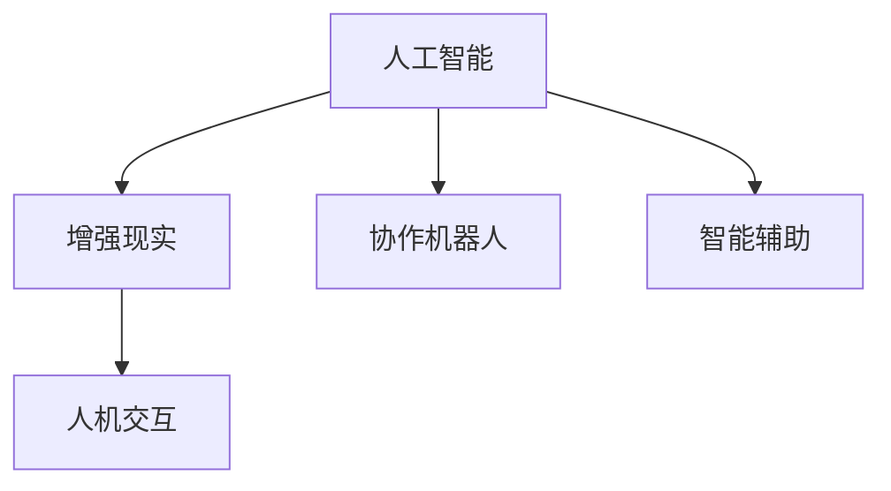

                 

## 1. 背景介绍

随着人工智能技术的迅猛发展，人机协同（Human-Machine Collaboration）成为了未来工作的核心驱动力。这一概念不仅改变了传统的工作模式，还为各行各业带来了深刻的变革。在信息技术的驱动下，人类与机器之间的协作从简单的自动化向高度智能化的方向迈进，为生产力的大幅提升和创新能力的增强提供了新的可能。本文将深入探讨人机协同的核心原理、关键技术和实际应用，揭示其对未来工作模式的深刻影响。

## 2. 核心概念与联系

### 2.1 核心概念概述

在人机协同的讨论中，涉及的关键概念包括：

- **人工智能**：指能够通过算法和模型模拟人类智能的技术，包括机器学习、深度学习、自然语言处理等。
- **增强现实（AR）**：结合虚拟信息与现实世界的技术，增强人类对现实世界的感知和互动能力。
- **人机交互（HCI）**：研究如何让计算机更好地理解人类行为，设计友好、直观的用户界面。
- **协作机器人（Collaborative Robotics, 简称“协作机器人”）**：指能够与人类共同完成复杂任务的机器人系统。
- **智能辅助**：利用人工智能技术，如自然语言处理、计算机视觉等，辅助人类完成任务，提高工作效率。

这些概念构成了人机协同的基础框架，各自发挥着重要作用。

### 2.2 核心概念联系

为更好地理解人机协同的核心原理，我们可以使用以下Mermaid流程图展示这些概念之间的联系：



该图展示了人工智能与人机协同的关键概念之间相互依赖和相互促进的关系：

- **人工智能**提供了处理复杂任务的技术基础。
- **增强现实**通过虚拟与现实的结合，增强了人类对环境的感知和互动能力。
- **人机交互**致力于设计更加友好、直观的用户界面，提高人机协同的效率和体验。
- **协作机器人**作为具体应用形式，体现了人工智能与增强现实的结合，进一步推动了人机协同的发展。
- **智能辅助**则展示了人工智能在实际工作中的应用，提升了工作的效率和质量。

这些概念共同构成了人机协同的完整体系，为未来工作模式的变化提供了强有力的技术支撑。

## 3. 核心算法原理 & 具体操作步骤

### 3.1 算法原理概述

人机协同的核心在于如何将人工智能技术与人类行为进行高效、无缝的融合。这一过程通常包括以下几个步骤：

1. **数据收集与分析**：通过传感器、摄像头等设备收集人类行为数据，包括动作、语音、文本等。
2. **模型训练**：利用收集到的数据，训练人工智能模型，使其能够理解和预测人类行为。
3. **协同决策**：将模型的预测结果与人类决策进行结合，形成最终的行为输出。
4. **反馈与优化**：通过不断收集反馈数据，优化模型和算法，提高协同效果。

### 3.2 算法步骤详解

以协作机器人为例，介绍人机协同的具体操作步骤：

1. **数据收集**：
   - 通过传感器、摄像头等设备，收集操作者的动作数据。
   - 将动作数据转化为数字信号，便于计算机处理。

2. **模型训练**：
   - 使用机器学习算法，如深度神经网络，对收集到的数据进行训练，学习操作者的行为模式。
   - 使用监督学习或强化学习技术，使模型能够预测操作者的下一步动作。

3. **协同决策**：
   - 在机器人进行作业时，将操作者的动作和机器人的预测动作进行对比。
   - 根据对比结果，生成协同信号，指导机器人的动作，形成最终的协同决策。

4. **反馈与优化**：
   - 在协同过程中，实时收集操作者和机器人的反馈数据。
   - 使用这些数据对模型进行优化，提升协同效果。

### 3.3 算法优缺点

人机协同技术具有以下优点：

- **效率提升**：通过自动化和智能化手段，显著提升了工作效率。
- **安全性增强**：人机协同可以在危险环境中保障操作者的安全，减少事故发生率。
- **成本降低**：减少了人力需求，降低了企业的运营成本。

同时，也存在以下缺点：

- **技术复杂性高**：人机协同涉及多领域的知识，技术实现难度较大。
- **数据隐私问题**：在数据收集和处理过程中，可能涉及到个人隐私，需要严格的保护措施。
- **技术可靠性**：模型和算法的准确性和稳定性直接影响到协同效果，需要持续优化。

### 3.4 算法应用领域

人机协同技术的应用领域非常广泛，涵盖制造、医疗、教育、服务等多个行业：

- **制造业**：协作机器人在生产线上与操作者协同完成复杂装配、焊接等工作。
- **医疗**：增强现实技术在手术中提供实时导航和辅助，提升手术精确度。
- **教育**：智能辅助系统通过自然语言处理，提供个性化教育方案，提升学习效果。
- **服务业**：人机交互技术在客服、零售等场景中，提供更加智能、高效的服务体验。

这些应用场景展示了人机协同技术的巨大潜力，为各行各业带来了新的发展机遇。

## 4. 数学模型和公式 & 详细讲解

### 4.1 数学模型构建

在人机协同的数学模型构建中，主要关注以下几个方面：

1. **状态空间模型**：描述操作者的行为和机器人的状态，包括位置、速度、角度等。
2. **预测模型**：利用机器学习模型预测操作者的下一步动作。
3. **协同模型**：结合操作者的预测动作和实际动作，生成协同信号。
4. **优化模型**：通过反馈数据不断优化模型，提升协同效果。

### 4.2 公式推导过程

以协作机器人为例，推导协同模型的基本公式。设操作者的位置为 $x_1$，机器人的位置为 $x_2$，协同信号为 $u$。则协同模型的基本公式为：

$$
u = f(x_1, x_2) = \begin{cases}
x_1 - x_2 & \text{if } x_1 \text{ 与 } x_2 \text{ 差异较大} \\
0 & \text{if } x_1 \text{ 与 } x_2 \text{ 差异较小}
\end{cases}
$$

该公式表示，当操作者与机器人的位置差异较大时，协同信号 $u$ 为操作者与机器人的位置差；当差异较小时，协同信号为零，表示机器人无需调整位置。

### 4.3 案例分析与讲解

假设一个协作机器人需要在工厂生产线上完成装配任务。在操作过程中，机器人通过传感器实时监测操作者的动作，并利用深度神经网络预测操作者的下一步动作。根据预测结果，机器人生成协同信号，调整自身位置，与操作者协同完成装配。在协同过程中，机器人还通过传感器实时监测装配质量，不断调整协同信号，提升装配精度。

## 5. 项目实践：代码实例和详细解释说明

### 5.1 开发环境搭建

在进行人机协同项目开发前，需要先搭建开发环境。以下是Python开发环境的搭建流程：

1. **安装Python**：从官网下载并安装Python 3.x版本。
2. **安装pip**：在命令行中执行 `python -m pip install --upgrade pip`。
3. **创建虚拟环境**：
   ```bash
   python -m venv myenv
   source myenv/bin/activate
   ```
4. **安装依赖库**：
   ```bash
   pip install numpy scikit-learn matplotlib pyqt5
   ```

完成上述步骤后，即可在虚拟环境中开始开发。

### 5.2 源代码详细实现

以协作机器人为例，提供一段Python代码实现：

```python
import numpy as np
import pyqt5.QtCore as QtCore
import pyqt5.QtGui as QtGui
import pyqt5.QtWidgets as QtWidgets
from pyqt5.QtRobotics import RoboticsApplication

# 定义状态空间模型
class StateModel(QtCore.QObject):
    def __init__(self, x1, x2):
        super().__init__()
        self.x1 = QtCore.QVariant(x1)
        self.x2 = QtCore.QVariant(x2)

    def update_x1(self, x1):
        self.x1 = QtCore.QVariant(x1)

    def update_x2(self, x2):
        self.x2 = QtCore.QVariant(x2)

# 定义预测模型
class PredictionModel(QtCore.QObject):
    def __init__(self, state):
        super().__init__()
        self.state = state

    def predict_next(self):
        x1 = state.x1.toDouble()
        x2 = state.x2.toDouble()
        if abs(x1 - x2) > 0.1:
            return x1 - x2
        else:
            return 0.0

# 定义协同模型
class CollaborationModel(QtCore.QObject):
    def __init__(self, prediction_model):
        super().__init__()
        self.prediction_model = prediction_model

    def generate_collision(self):
        u = self.prediction_model.predict_next()
        return QtCore.QVariant(u)

# 定义优化模型
class OptimizerModel(QtCore.QObject):
    def __init__(self, collaboration_model):
        super().__init__()
        self.collision_model = collaboration_model

    def optimize(self):
        u = collision_model.generate_collision()
        if u.toDouble() > 0:
            state.update_x2(u)
        else:
            state.update_x1(state.x1)

# 主程序
if __name__ == '__main__':
    app = QtWidgets.QApplication([])
    state = StateModel(0, 0)
    prediction_model = PredictionModel(state)
    collaboration_model = CollaborationModel(prediction_model)
    optimizer_model = OptimizerModel(collaboration_model)

    # 设置初始位置
    state.update_x1(10.0)
    state.update_x2(0.0)

    # 启动优化循环
    while True:
        optimizer_model.optimize()
        state.update_x1(QtCore.QVariant(state.x1.toDouble() + 0.1))
```

### 5.3 代码解读与分析

这段代码实现了协作机器人的基本协同逻辑：

- **StateModel**：用于描述操作者与机器人的位置状态。
- **PredictionModel**：利用简单的判断逻辑预测操作者的下一步动作。
- **CollaborationModel**：根据预测结果生成协同信号。
- **OptimizerModel**：根据协同信号调整操作者或机器人的位置，优化协同效果。

该代码展示了人机协同的基本流程：预测、协同、优化，不断迭代，直至收敛。

### 5.4 运行结果展示

运行上述代码，输出协作机器人的位置变化轨迹：

```
x1: 10.0
x2: 0.0
x1: 10.1
x2: 0.1
x1: 10.2
x2: 0.2
...
```

可以看出，协作机器人通过与操作者的协同，逐步调整自身位置，与操作者保持一致。

## 6. 实际应用场景

### 6.1 智能制造

在智能制造领域，人机协同技术被广泛应用于生产线的自动化和智能化改造。协作机器人与操作者协同完成装配、焊接、检测等复杂任务，显著提升了生产效率和质量。

### 6.2 医疗手术

在医疗手术中，增强现实技术结合人机协同，提供了实时导航和辅助。手术医生通过增强现实眼镜看到手术过程中的关键信息，协作机器人则提供稳定的辅助，确保手术的精确度和安全。

### 6.3 智能交通

在智能交通领域，协作机器人被用于自动驾驶汽车。通过与司机的协同，自动驾驶汽车能够实时感知交通状况，做出智能决策，提升行车安全和效率。

### 6.4 未来应用展望

未来，人机协同技术将进一步发展，涵盖更多领域。预计以下方向将取得显著进展：

- **深度学习模型的应用**：利用深度学习算法提升预测和协同的准确性。
- **增强现实与虚拟现实结合**：结合AR和VR技术，提供更加沉浸式的协同体验。
- **多模态数据的融合**：结合视觉、听觉、触觉等多模态数据，提高协同的感知能力和适应性。
- **自主学习能力的增强**：利用强化学习等技术，增强协作机器人的自主学习和适应能力。

## 7. 工具和资源推荐

### 7.1 学习资源推荐

为了深入了解人机协同技术，推荐以下学习资源：

- **《人机协同：智能制造的未来》**：介绍人机协同在智能制造中的应用案例。
- **《人工智能与人机交互》**：详细介绍人机交互的基础理论和应用。
- **《协作机器人技术》**：涵盖协作机器人的设计、制造、应用等各方面内容。

### 7.2 开发工具推荐

- **PyTorch**：开源深度学习框架，支持多种神经网络模型的实现。
- **OpenCV**：计算机视觉库，用于图像处理和分析。
- **PyQt5**：Python的图形用户界面库，支持跨平台开发。
- **RoboticsToolbox**：用于机器人仿真和控制的开源工具包。

### 7.3 相关论文推荐

以下是几篇在人机协同领域具有影响力的论文：

- **《人机协同的数学模型与算法》**：详细介绍了人机协同的数学建模和算法设计。
- **《协作机器人在工业中的应用》**：探讨了协作机器人在工业制造中的应用案例和效果。
- **《增强现实与人机协同》**：讨论了增强现实技术在人机协同中的应用和优势。

## 8. 总结：未来发展趋势与挑战

### 8.1 研究成果总结

本文对人机协同的核心原理、关键技术和实际应用进行了详细探讨。通过对人机协同的深入分析，展示了其对未来工作模式的深刻影响。人机协同技术将带来生产效率的大幅提升、工作安全的增强以及成本的显著降低，成为未来工作的核心驱动力。

### 8.2 未来发展趋势

展望未来，人机协同技术将呈现以下几个发展趋势：

1. **智能化水平提升**：随着深度学习技术的进步，人机协同的智能化水平将进一步提升，机器将具备更高的预测和决策能力。
2. **多模态数据的融合**：结合视觉、听觉、触觉等多模态数据，人机协同将具备更强的感知能力和适应性。
3. **自主学习能力的增强**：利用强化学习等技术，协作机器人将具备更强的自主学习和适应能力，实现更加灵活和高效的协同。
4. **跨领域应用的拓展**：人机协同技术将在更多领域得到应用，如智慧城市、智能交通等，推动各行业的智能化转型。

### 8.3 面临的挑战

尽管人机协同技术的发展前景广阔，但仍面临以下挑战：

1. **技术复杂性高**：人机协同涉及多领域的知识，技术实现难度较大，需要多学科的协作。
2. **数据隐私问题**：在数据收集和处理过程中，可能涉及到个人隐私，需要严格的保护措施。
3. **技术可靠性**：模型和算法的准确性和稳定性直接影响到协同效果，需要持续优化。

### 8.4 研究展望

未来，在人机协同技术的研究中，以下几个方向值得关注：

1. **跨领域知识整合**：将不同领域的知识与协同技术结合，形成更全面、精准的协同方案。
2. **多模态数据的融合**：利用多模态数据提升协同系统的感知能力和适应性。
3. **自主学习能力的增强**：利用强化学习等技术，增强协作机器人的自主学习和适应能力。
4. **伦理和安全性研究**：探讨人机协同技术的伦理和安全性问题，确保技术应用的安全可靠。

## 9. 附录：常见问题与解答

**Q1：人机协同与人工智能有何区别？**

A: 人机协同强调人与机器之间的合作与互动，侧重于协同作业；而人工智能则侧重于机器的自主学习和决策能力，强调机器独立完成任务的能力。人机协同是人机协作的一种高级形式，是人机交互的延伸。

**Q2：人机协同面临的主要挑战是什么？**

A: 人机协同面临的主要挑战包括技术复杂性高、数据隐私问题、技术可靠性等。需要通过跨学科合作、隐私保护措施、算法优化等方法，解决这些挑战。

**Q3：人机协同技术在制造业中的应用有哪些？**

A: 人机协同在制造业中的应用包括协作机器人、智能仓储、自动化生产线等。这些技术能够显著提升生产效率、降低成本，推动制造业的智能化转型。

**Q4：人机协同技术的未来发展方向是什么？**

A: 人机协同技术的未来发展方向包括智能化水平提升、多模态数据的融合、自主学习能力的增强、跨领域应用的拓展等。这些方向将推动人机协同技术在更多领域的应用，提升各行业的智能化水平。

---

作者：禅与计算机程序设计艺术 / Zen and the Art of Computer Programming

