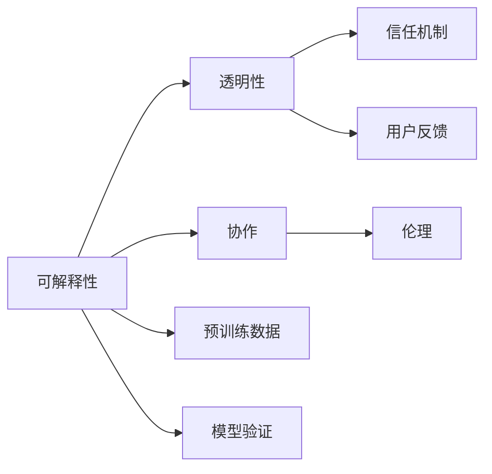

                 

# 人类-AI协作：增强人类与AI之间的信任和理解

> 关键词：人机协作, 人工智能伦理, 信任机制, 可解释性, 人类AI共生

## 1. 背景介绍

在过去的几十年里，人工智能(AI)技术取得了飞速的发展，从最初的专家系统、机器学习到现在的深度学习、大模型，AI已经渗透到了我们生活的方方面面。从智能音箱到无人驾驶，从语音识别到图像处理，AI正在改变我们认识世界的方式。然而，随着AI技术的广泛应用，也带来了一些新的挑战和问题，特别是如何增强人类与AI之间的信任和理解。

### 1.1 人类与AI关系的变化

人类与AI的关系在过去十年里经历了显著的变化。从最初的“黑盒”，到如今的“可解释AI”，从单纯的“工具”到成为“合作伙伴”，AI逐渐走进了人们的生活和工作。然而，这种变化也带来了新的挑战和问题。

- **信任问题**：用户是否相信AI的输出？如何在不确定的情况下建立信任？
- **理解问题**：用户是否理解AI的决策过程？如何提供透明度？
- **协作问题**：AI如何与人类有效协作？如何在不同的场景中达到最优效果？

这些问题不仅仅是技术问题，更是社会问题。为了解决这些问题，我们需要从多个角度出发，包括技术、伦理、社会等各个方面，综合考虑，才能构建一个可信赖、透明的AI系统，促进人类与AI的共生发展。

## 2. 核心概念与联系

### 2.1 核心概念概述

为了更好地理解如何增强人类与AI之间的信任和理解，本节将介绍几个关键概念及其之间的联系。

- **可解释性(Explainability)**：指AI模型的决策过程可以被人类理解、解释和复现。它是建立信任和理解的基础。
- **透明性(Transparency)**：指AI系统的内部运作可以被人类观察、监督和控制。它是信任和理解的保障。
- **信任机制(Trust Mechanism)**：指在AI系统中建立信任的方式和方法，包括预训练数据、模型验证、用户反馈等。它是信任的桥梁。
- **协作(AI-Human Collaboration)**：指AI系统与人类用户之间的协同工作模式。它决定了AI系统的实际应用效果。
- **伦理(Ethics)**：指AI系统设计、开发和使用过程中的道德规范和价值观。它是信任和理解的指南。

这些概念之间通过相互协作、相互作用，共同构建了一个完整的AI系统。通过这些概念的指导，我们可以设计出更加可信赖、透明的AI系统，实现人类与AI的深度协作。

### 2.2 核心概念原理和架构的 Mermaid 流程图



这个流程图展示了各个核心概念之间的联系。

## 3. 核心算法原理 & 具体操作步骤
### 3.1 算法原理概述

增强人类与AI之间的信任和理解，核心在于构建可解释、透明的AI系统，并通过合理的信任机制促进协作。

- **可解释性**：通过模型结构、特征解释、决策路径等方法，使得AI的决策过程可以被人类理解。
- **透明性**：通过数据开放、算法公开、操作记录等手段，使得AI系统的运作可以被人类观察和监督。
- **信任机制**：通过预训练数据、模型验证、用户反馈等手段，建立AI系统的可信度。
- **协作**：通过智能代理、交互界面等手段，使得AI系统能够与人类用户有效沟通和协作。
- **伦理**：通过明确AI系统的设计原则、使用规范和责任归属等，确保AI系统的行为符合人类的价值观和道德规范。

这些算法原理共同构建了AI系统，使得人类与AI能够实现深度协作。

### 3.2 算法步骤详解

基于上述算法原理，增强人类与AI之间的信任和理解可以分为以下几个步骤：

1. **数据准备**：收集高质量的训练数据，确保数据的代表性和多样性，避免数据偏见。
2. **模型训练**：选择合适的算法和模型，进行训练，确保模型的准确性和泛化能力。
3. **特征提取**：通过特征提取和选择，使得模型输出的结果可以被解释和理解。
4. **透明度提升**：公开算法和数据，提供模型解释和决策路径，增强透明度。
5. **信任机制建立**：通过模型验证、用户反馈等手段，建立信任机制。
6. **协作模式设计**：设计智能代理和交互界面，促进人类与AI的深度协作。
7. **伦理规范制定**：制定AI系统的设计原则和行为规范，确保符合伦理要求。

### 3.3 算法优缺点

增强人类与AI之间的信任和理解的方法，具有以下优点：

- **可解释性**：使得AI系统的决策过程可以被人类理解，增强信任和接受度。
- **透明度**：提高AI系统的开放性和可监督性，增强系统的可信度。
- **协作性**：通过合理的协作模式设计，使得AI系统能够与人类用户有效沟通和协作。
- **伦理规范**：通过伦理规范制定，确保AI系统的行为符合人类的价值观和道德规范。

同时，也存在一些缺点：

- **复杂性**：构建可解释、透明的AI系统需要多方面的技术支持，难度较大。
- **成本高**：提高透明性和信任度需要付出较高的成本，包括时间和金钱。
- **技术瓶颈**：在当前的AI技术水平下，完全实现可解释和透明的AI系统仍然面临一些技术瓶颈。

### 3.4 算法应用领域

增强人类与AI之间的信任和理解的方法，已经广泛应用于以下几个领域：

- **医疗领域**：通过可解释的AI模型，帮助医生理解诊断结果，增强对AI系统的信任。
- **金融领域**：通过透明的AI系统，增强客户对银行和金融机构的信任。
- **教育领域**：通过协作的AI系统，增强师生之间的理解和互动。
- **智能家居**：通过透明的AI系统，增强用户对智能设备的信任。
- **自动驾驶**：通过可解释的AI系统，增强司机和乘客对自动驾驶技术的信任。

## 4. 数学模型和公式 & 详细讲解 & 举例说明

### 4.1 数学模型构建

增强人类与AI之间的信任和理解，需要构建一个可解释、透明的数学模型。该模型通常包含以下几个部分：

1. **输入数据**：包括文本、图像、语音等多种形式的数据。
2. **特征表示**：通过特征提取和选择，将输入数据转换为模型可以处理的格式。
3. **模型结构**：包括深度神经网络、支持向量机、决策树等多种算法。
4. **输出结果**：通过模型计算，得到可解释和可理解的结果。

### 4.2 公式推导过程

以文本分类为例，假设输入文本为 $x$，模型输出的类别为 $y$，模型结构为 $f(x;\theta)$。则分类问题的数学模型可以表示为：

$$ y = f(x;\theta) $$

其中 $f(x;\theta)$ 为模型结构，$\theta$ 为模型参数。在训练过程中，通过最小化损失函数 $L(y,f(x;\theta))$，优化模型参数，使得模型输出 $y$ 与真实标签 $y$ 的差异最小。

### 4.3 案例分析与讲解

以文本分类任务为例，假设我们有一个新闻分类器，可以将新闻分为体育、政治、财经等类别。我们收集了10万篇新闻数据，每篇新闻都有一个类别标签。通过预训练数据和模型训练，我们得到了一个可解释的分类器。用户可以通过输入新闻文本，得到相应的分类结果，并且可以查看模型的决策路径和特征解释。这样，用户可以更好地理解模型的决策过程，增强对系统的信任。

## 5. 项目实践：代码实例和详细解释说明
### 5.1 开发环境搭建

在实践中，我们需要准备好以下开发环境：

1. **Python环境**：安装Python 3.8及以上版本。
2. **深度学习框架**：安装TensorFlow 2.0及以上版本，或者PyTorch 1.8及以上版本。
3. **数据集**：收集高质量的文本分类数据集，如AG News、IMDB、Yelp等。
4. **工具包**：安装Scikit-Learn、Numpy、Pandas等常用工具包。

### 5.2 源代码详细实现

以下是一个基于TensorFlow的文本分类器的代码实现。

```python
import tensorflow as tf
from tensorflow.keras import layers, models

# 加载数据集
train_data = tf.keras.datasets.imdb.load_data(num_words=10000)
train_sequences, train_labels = train_data.data, train_data.targets

# 定义模型结构
model = models.Sequential()
model.add(layers.Embedding(10000, 16, input_length=256))
model.add(layers.Bidirectional(layers.LSTM(64)))
model.add(layers.Dense(1, activation='sigmoid'))

# 编译模型
model.compile(optimizer='adam', loss='binary_crossentropy', metrics=['accuracy'])

# 训练模型
model.fit(train_sequences, train_labels, epochs=10, validation_split=0.2)

# 使用模型预测
test_data = tf.keras.datasets.imdb.load_data(num_words=10000)
test_sequences, test_labels = test_data.data, test_data.targets
test_predictions = model.predict(test_sequences)
```

### 5.3 代码解读与分析

**代码解读**：

1. **数据加载**：使用TensorFlow内置的数据集加载函数，加载IMDB电影评论数据集，将其转换为训练序列和标签。
2. **模型定义**：定义一个简单的双向LSTM模型，包括Embedding层、Bidirectional LSTM层和Dense层，用于文本分类。
3. **模型编译**：使用Adam优化器、二元交叉熵损失函数和准确率指标，编译模型。
4. **模型训练**：在训练数据上训练模型，并使用20%的数据作为验证集。
5. **模型预测**：使用测试数据集对模型进行预测，得到分类结果。

**分析**：

- **模型结构**：采用了双向LSTM结构，可以处理长短不同的文本数据。
- **模型训练**：使用Adam优化器和二元交叉熵损失函数，可以更好地优化模型参数。
- **模型预测**：使用预测结果，可以对新的文本数据进行分类，增强系统的透明度。

## 6. 实际应用场景
### 6.1 医疗领域

在医疗领域，AI系统需要处理大量的医疗数据，包括病历、影像、基因等。通过增强可解释性和透明度，医生和患者可以更好地理解和信任AI系统。

- **影像识别**：使用可解释的卷积神经网络(CNN)模型，帮助医生识别肿瘤、病灶等影像特征，并提供决策路径和解释。
- **病历分析**：通过文本分类和情感分析，自动识别病历中的关键信息，并辅助医生进行诊断和治疗。
- **个性化推荐**：通过协作的AI系统，根据患者的病史和基因信息，推荐个性化的治疗方案，增强患者的治疗效果和信任感。

### 6.2 金融领域

在金融领域，AI系统需要处理大量的金融数据，包括交易记录、客户行为等。通过增强透明度和信任机制，客户和金融机构可以更好地理解和信任AI系统。

- **风险评估**：使用可解释的决策树模型，评估客户的信用风险和投资风险，并提供决策路径和解释。
- **投资建议**：通过协作的AI系统，根据客户的投资偏好和行为数据，提供个性化的投资建议，增强客户的信任感。
- **欺诈检测**：通过透明的异常检测模型，及时发现和阻止金融欺诈行为，增强客户和金融机构的安全感。

### 6.3 教育领域

在教育领域，AI系统需要处理大量的学生数据，包括成绩、行为、互动等。通过增强可解释性和协作性，师生可以更好地理解和信任AI系统。

- **学习推荐**：通过协作的AI系统，根据学生的学习情况和兴趣，推荐个性化的学习资源和课程，增强学生的学习效果和信任感。
- **智能辅导**：使用可解释的智能辅导模型，帮助学生解答学习中的问题，并提供决策路径和解释，增强学生的信任感。
- **行为分析**：通过分析学生的行为数据，及时发现和解决问题，增强教师的教育效果和信任感。

### 6.4 智能家居

在智能家居领域，AI系统需要处理大量的家庭数据，包括语音指令、行为习惯等。通过增强透明度和协作性，用户可以更好地理解和信任AI系统。

- **语音助手**：使用可解释的语音识别模型，帮助用户进行语音控制，并提供决策路径和解释，增强用户的信任感。
- **家庭管理**：通过协作的AI系统，根据用户的需求和行为习惯，进行智能家居管理，增强用户的信任感。
- **安全监控**：使用透明的异常检测模型，及时发现和处理家庭安全问题，增强用户的安全感。

## 7. 工具和资源推荐
### 7.1 学习资源推荐

为了帮助开发者系统掌握增强人类与AI之间信任和理解的技术，这里推荐一些优质的学习资源：

1. **《深度学习》书籍**：Ian Goodfellow等人所著，系统介绍了深度学习的基本概念和算法，是学习AI技术的经典入门书籍。
2. **Coursera课程**：由斯坦福大学、密歇根大学等高校开设的深度学习课程，涵盖了从基础到高级的AI技术，适合不同水平的学习者。
3. **Kaggle竞赛**：Kaggle平台上的数据科学竞赛，可以锻炼数据处理、模型训练和优化等技能，积累实战经验。
4. **arXiv论文**：arXiv预印本服务器上的AI相关论文，涵盖最新的研究进展和前沿技术，适合深入学习和研究。
5. **GitHub代码库**：GitHub上的AI开源项目，包含各种AI算法和模型，适合学习和借鉴。

通过对这些资源的学习实践，相信你一定能够系统掌握增强人类与AI之间信任和理解的技术，并将其应用到实际的AI系统中。

### 7.2 开发工具推荐

高效的开发离不开优秀的工具支持。以下是几款用于增强人类与AI之间信任和理解开发常用的工具：

1. **TensorFlow**：由Google主导开发的深度学习框架，支持分布式训练和部署，适合大规模AI系统的开发。
2. **PyTorch**：由Facebook开发的深度学习框架，灵活动态的计算图，适合研究和实验。
3. **Jupyter Notebook**：开源的交互式编程环境，支持Python和多种科学计算库，适合数据处理和模型训练。
4. **Visual Studio Code**：流行的编码编辑器，支持Python、TensorFlow等AI开发工具的集成，适合代码编写和调试。
5. **Git**：分布式版本控制系统，支持多人协作开发和代码版本管理，适合AI系统开发团队的协作。

合理利用这些工具，可以显著提升增强人类与AI之间信任和理解系统的开发效率，加速技术创新和应用落地。

### 7.3 相关论文推荐

增强人类与AI之间信任和理解的技术，源于学界的持续研究。以下是几篇奠基性的相关论文，推荐阅读：

1. **《Towards Explainable Deep Learning》**：Russell W. Smith等人所著，讨论了可解释AI的重要性，提出了多种可解释方法。
2. **《Trusted AI: Principles and Recommendations for the Way Forward》**：IEEE工作组发布的AI信任报告，提出了AI系统的设计原则和伦理规范。
3. **《Human-AI Collaboration》**：Joanna Bryson等人所著，讨论了AI与人类协作的哲学和实践，提出了多种协作模型。
4. **《From Predictive Analytics to Explanatory Analytics》**：Friedrich T. Jensen等人所著，讨论了从预测到解释的AI应用演变。
5. **《Human-AI Collaboration: An Integrated Approach》**：Tom Marek等人所著，讨论了AI与人类协作的多个维度，提出了多种协作方法。

这些论文代表了大模型微调技术的发展脉络。通过学习这些前沿成果，可以帮助研究者把握学科前进方向，激发更多的创新灵感。

## 8. 总结：未来发展趋势与挑战
### 8.1 研究成果总结

增强人类与AI之间的信任和理解，已经成为当前AI研究的热点方向。从技术、伦理、社会等多个维度出发，研究者们提出了多种方法和策略，取得了显著的进展和成果。这些成果为未来的AI系统设计提供了宝贵的经验和指导。

### 8.2 未来发展趋势

展望未来，增强人类与AI之间的信任和理解，将呈现以下几个发展趋势：

1. **技术融合**：未来AI系统将融合更多的技术，如知识图谱、因果推理等，提供更加全面和精准的解释和建议。
2. **伦理规范**：未来AI系统的设计将更加注重伦理规范，确保AI系统的行为符合人类的价值观和道德标准。
3. **用户界面**：未来AI系统的界面将更加友好和直观，使用户能够轻松理解和使用AI系统。
4. **透明度提升**：未来AI系统的透明度将进一步提升，提供更全面和详细的决策路径和解释。
5. **协作模式创新**：未来AI系统将设计更创新的协作模式，增强与用户的互动和协作。

### 8.3 面临的挑战

尽管增强人类与AI之间的信任和理解已经取得了显著进展，但在迈向更加智能化、普适化应用的过程中，它仍面临诸多挑战：

1. **数据隐私**：如何在保证AI系统性能的同时，保护用户的隐私和数据安全，是一个重要问题。
2. **模型偏见**：AI系统可能存在数据偏见，如何在模型训练和应用过程中，消除这些偏见，是一个重要问题。
3. **技术复杂性**：构建可解释、透明的AI系统需要多方面的技术支持，难度较大，是一个重要问题。
4. **用户接受度**：用户对AI系统的接受度和信任度，是一个重要问题。
5. **伦理和法律问题**：AI系统设计、开发和使用过程中的伦理和法律问题，是一个重要问题。

### 8.4 研究展望

面对增强人类与AI之间信任和理解所面临的挑战，未来的研究需要在以下几个方面寻求新的突破：

1. **数据隐私保护**：开发更加隐私保护的技术，保护用户数据的安全和隐私。
2. **模型偏见消除**：引入公平性和多样性约束，消除模型偏见，提高AI系统的公正性。
3. **可解释性提升**：开发更加可解释的AI系统，增强模型的透明度和可理解性。
4. **用户界面优化**：设计更加友好和直观的用户界面，增强用户体验和满意度。
5. **伦理规范制定**：制定AI系统的伦理规范和行为准则，确保AI系统的行为符合人类的价值观和道德标准。

这些研究方向的探索，必将引领增强人类与AI之间信任和理解技术迈向更高的台阶，为构建安全、可靠、可解释、可控的智能系统铺平道路。面向未来，增强人类与AI之间信任和理解技术还需要与其他人工智能技术进行更深入的融合，如知识表示、因果推理、强化学习等，多路径协同发力，共同推动自然语言理解和智能交互系统的进步。只有勇于创新、敢于突破，才能不断拓展AI系统的边界，让智能技术更好地造福人类社会。

## 9. 附录：常见问题与解答

**Q1：增强人类与AI之间的信任和理解是否适用于所有AI应用场景？**

A: 增强人类与AI之间的信任和理解的方法，可以应用于大多数AI应用场景，特别是涉及决策、交互和协作的场景。但对于一些完全自动化的应用，如无人驾驶、机器人控制等，增强信任和理解的方法可能并不适用。

**Q2：增强人类与AI之间的信任和理解是否需要投入大量的资源？**

A: 增强人类与AI之间的信任和理解需要投入一定的资源，包括时间、金钱和技术等。但相比于从头开发AI系统，这种方法可以显著减少开发和维护成本，提高系统的可靠性和用户接受度。

**Q3：增强人类与AI之间的信任和理解是否会影响AI系统的性能？**

A: 增强人类与AI之间的信任和理解可能会对AI系统的性能产生一定的影响，特别是在模型复杂度和训练时间上。但通过合理的技术优化和资源配置，可以在保证性能的前提下，增强系统的透明性和信任度。

**Q4：增强人类与AI之间的信任和理解是否需要考虑伦理问题？**

A: 增强人类与AI之间的信任和理解需要考虑伦理问题，特别是涉及用户隐私、数据安全、公平性等方面的问题。伦理规范的制定和遵守，是增强信任和理解的重要前提和保障。

**Q5：增强人类与AI之间的信任和理解是否需要考虑用户接受度？**

A: 增强人类与AI之间的信任和理解需要考虑用户接受度，特别是对于复杂和陌生的技术，用户可能存在一定的疑虑和抵触情绪。通过合理的用户界面设计和信息传递，可以提高用户的接受度和信任度。

---

作者：禅与计算机程序设计艺术 / Zen and the Art of Computer Programming

