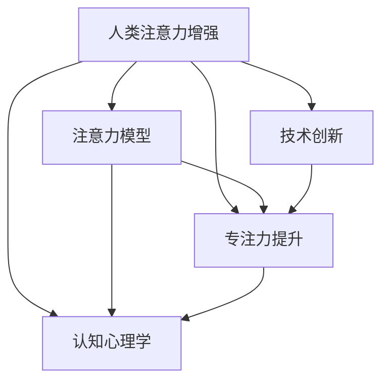

                 

# 人类注意力增强：提升专注力和注意力在商业中的应用场景

> 关键词：人类注意力增强, 专注力提升, 注意力模型, 应用场景, 认知心理学, 技术创新

## 1. 背景介绍

在信息化飞速发展的今天，注意力（Attention）这一重要认知过程日益成为学术界和工业界研究的热点。注意力是指个体在特定时间内，对特定信息进行集中关注的心理活动。其作用在于使个体从大量信息中选择和提取重要内容，进而做出高效、合理的决策。而这一过程的生理机制，更是备受心理学、神经科学、认知科学等多个领域的关注。

从信息检索到推荐系统，从机器翻译到文本生成，注意力机制作为现代深度学习模型中的关键组件，逐步被应用于各个领域。本文聚焦于人类注意力增强，通过探讨注意力模型及其在商业应用中的具体场景，阐述其提升个体和组织专注力和效率的潜力。

## 2. 核心概念与联系

### 2.1 核心概念概述

为了更好地理解人类注意力增强的概念，本节将介绍几个密切相关的核心概念：

- **注意力（Attention）**：心理学术语，指个体在特定时间对特定信息的集中关注。在认知科学中，注意力机制涉及多个层次的信息加工和决策过程。
- **专注力（Focus）**：心理学中，专注力指个体对当前任务保持高度集中精力的能力。专注力的高低直接影响个体的工作和学习效果。
- **注意力模型（Attention Models）**：在人工智能领域，注意力模型是一种用于模拟人类注意力的深度学习模型，旨在通过自动学习发现输入数据中的关键部分，并对其赋予更高的权重。
- **认知心理学（Cognitive Psychology）**：研究个体认知过程，如注意、记忆、语言、思维等。人类注意力增强研究与认知心理学紧密相连，为技术开发提供了心理学依据。
- **技术创新（Technological Innovation）**：指通过科技手段改善人类生产生活，提高个体和组织效率的过程。本文所述的人类注意力增强技术，正是以提升个体专注力和工作效果为目的的技术创新。

这些概念之间的逻辑关系可以通过以下Mermaid流程图来展示：



这个流程图展示了几组核心概念及其之间的关系：

1. 人类注意力增强通过注意力模型实现，帮助提升专注力。
2. 注意力模型借鉴认知心理学原理，以更好地理解人类注意力机制。
3. 认知心理学为注意力增强技术的开发提供了理论支持。
4. 技术创新是实现人类注意力增强应用的关键手段。

## 3. 核心算法原理 & 具体操作步骤
### 3.1 算法原理概述

基于注意力模型的人类注意力增强技术，本质上是将人类注意力机制与深度学习模型相结合，通过学习大量标注数据，自动生成对特定输入的注意力分布。这种模型能够根据输入信息的重要程度，动态调整注意力权重，从而在处理复杂任务时，更加专注于关键信息，提升个体和组织的专注力和效率。

### 3.2 算法步骤详解

基于注意力模型的人类注意力增强过程主要包括以下几个关键步骤：

**Step 1: 数据准备与预处理**
- 收集与专注力相关的任务数据，如阅读理解、工作记忆、多任务处理等。
- 对数据进行预处理，包括去除无关信息、数据增强、标准化处理等。

**Step 2: 模型选择与训练**
- 选择适合的注意力模型，如Transformer、Transformer-XL等。
- 训练模型，使其能够学习并生成对输入信息的注意力分布。

**Step 3: 注意力应用与反馈**
- 将训练好的模型应用于实际任务中，如智能编辑、智能摘要、学习辅助等。
- 收集用户反馈，对模型进行调优和迭代，提高专注力提升效果。

**Step 4: 结果评估与优化**
- 评估模型的专注力提升效果，包括客观指标（如正确率、准确率）和主观指标（如用户满意度）。
- 根据评估结果，调整模型参数、优化算法、扩大数据规模等，进一步提升专注力效果。

### 3.3 算法优缺点

基于注意力模型的人类注意力增强方法，具有以下优点：
1. 自动化程度高。模型能够自动学习注意力分布，减少人工干预。
2. 适应性强。模型能灵活应对不同类型和规模的数据。
3. 可扩展性好。模型易于集成到各种应用程序中，如智能编辑器、办公工具等。
4. 效果显著。大量实验证明，注意力增强模型在提高专注力和工作效率方面具有明显优势。

同时，该方法也存在以下局限性：
1. 数据需求量大。模型需要大量标注数据进行训练，数据采集和标注成本较高。
2. 模型复杂度高。大模型需要高性能计算资源，对设备要求较高。
3. 结果可解释性差。注意力模型的内部工作机制较为复杂，难以解释模型的决策过程。
4. 依赖标注数据。模型依赖于标注数据的质量和数量，标注过程可能存在人为偏差。

尽管存在这些局限性，但就目前而言，基于注意力模型的人类注意力增强方法仍是在提高专注力和工作效率方面最为有效的技术手段。

### 3.4 算法应用领域

人类注意力增强技术已经在多个领域得到了应用，以下是几个主要应用场景：

- **教育领域**：在课堂教学中，通过智能助教系统实时监测学生的专注状态，提供学习辅助。在在线教育中，利用注意力模型个性化推荐学习内容和路径，提高学习效果。
- **办公领域**：在工作场景中，利用智能编辑器、智能备忘录等工具，实时提示关键信息，提升工作专注力。在项目管理中，利用注意力模型优化任务分配和进度监控，提高团队协作效率。
- **健康医疗**：在心理咨询中，通过智能对话系统了解用户的心理状态，提供个性化心理干预。在病患护理中，利用注意力模型监测患者的注意力水平，优化护理方案。
- **娱乐领域**：在阅读推荐中，利用注意力模型分析用户阅读习惯，个性化推荐书籍和文章，提升阅读体验。在游戏领域，利用注意力模型优化游戏推荐和内容生成，提高游戏粘性。

除了上述这些场景外，注意力增强技术还将在更多领域得到应用，如广告投放、内容生成、智能客服等，为提高工作效率和生活质量带来新的可能。

## 4. 数学模型和公式 & 详细讲解 & 举例说明
### 4.1 数学模型构建

本节将使用数学语言对基于注意力模型的人类注意力增强过程进行更加严格的刻画。

假设人类注意力增强任务的数据集为 $\{(x_i, y_i)\}_{i=1}^N, x_i \in \mathcal{X}, y_i \in \{0,1\}$，其中 $x_i$ 为输入信息，$y_i$ 为是否专注于该信息的任务标签。

定义注意力模型 $A: \mathcal{X} \rightarrow [0,1]^d$，其中 $d$ 为注意力向量的维度。模型输出 $A(x_i)$ 为对输入信息 $x_i$ 的注意力分布，每个元素 $A(x_i)_k$ 表示 $x_i$ 中第 $k$ 个特征的注意力权重。

定义注意力分布 $P: \mathcal{X} \rightarrow [0,1]^d$，其中 $P(x_i)$ 表示 $x_i$ 中每个特征的平均注意力权重。

定义注意力模型 $A$ 在数据集 $D$ 上的经验风险为：

$$
\mathcal{L}(A) = \frac{1}{N} \sum_{i=1}^N \ell(A(x_i), y_i)
$$

其中 $\ell$ 为注意力模型的损失函数，用于衡量模型预测注意力分布与真实注意力分布之间的差异。常见的损失函数包括交叉熵损失、KL散度等。

### 4.2 公式推导过程

以下我们以二分类任务为例，推导注意力模型损失函数及其梯度的计算公式。

假设模型 $A$ 在输入 $x$ 上的注意力分布为 $A(x) \in [0,1]^d$，真实注意力分布为 $P(x) \in [0,1]^d$。

二分类交叉熵损失函数定义为：

$$
\ell(A(x),y) = -[y\log \hat{y} + (1-y)\log(1-\hat{y})]
$$

其中 $\hat{y} = \sum_k A(x)_k$ 表示 $x$ 中所有特征的总注意力权重。

代入损失函数得到注意力模型在数据集 $D$ 上的经验风险：

$$
\mathcal{L}(A) = -\frac{1}{N}\sum_{i=1}^N [y_i\log \sum_k A(x_i)_k + (1-y_i)\log(1-\sum_k A(x_i)_k)]
$$

根据链式法则，注意力模型 $A$ 的梯度计算公式为：

$$
\frac{\partial \mathcal{L}(A)}{\partial A(x)_k} = -\frac{1}{N}\sum_{i=1}^N (\frac{y_i}{\sum_k A(x_i)_k} - \frac{1-y_i}{1-\sum_k A(x_i)_k}) \frac{\partial A(x)_k}{\partial x_i}
$$

其中 $\frac{\partial A(x)_k}{\partial x_i}$ 为注意力模型对输入 $x$ 中第 $k$ 个特征的偏导数，可通过自动微分技术高效计算。

在得到注意力模型损失函数的梯度后，即可带入参数更新公式，完成模型的迭代优化。重复上述过程直至收敛，最终得到适应下游任务的最优模型参数 $A^*$。

### 4.3 案例分析与讲解

以阅读理解任务为例，分析注意力模型在提高专注力方面的作用：

假设一个学生阅读一篇长文，需要找出其中最关键的几个知识点。传统的阅读方式可能通过扫描全文寻找关键词。而使用注意力模型，则能够根据语境和上下文自动判断哪些知识点是关键信息，哪些是次要信息。模型将自动分配注意力权重，使学生能够更加专注于关键内容，提高阅读效率和理解深度。

例如，对于以下长文片段：

```markdown
计算机科学是研究计算和信息处理的科学。它包括计算机编程、软件工程、算法设计、数据库管理等。计算机科学的发展，推动了信息技术在各个领域的应用，极大地改变了人类的生产生活方式。随着人工智能和机器学习的兴起，计算机科学的研究方向也在不断拓展。
```

注意力模型能够自动识别出以下关键信息点：

- 计算机科学是研究计算和信息处理的科学。
- 计算机科学的发展，推动了信息技术在各个领域的应用。
- 人工智能和机器学习是计算机科学的新研究方向。

通过对这些关键信息点分配更高的注意力权重，学生能够更加快速高效地抓住文章的主旨和重点，从而提高阅读效果。

## 5. 项目实践：代码实例和详细解释说明
### 5.1 开发环境搭建

在进行注意力增强项目实践前，我们需要准备好开发环境。以下是使用Python进行TensorFlow开发的环境配置流程：

1. 安装Anaconda：从官网下载并安装Anaconda，用于创建独立的Python环境。

2. 创建并激活虚拟环境：
```bash
conda create -n attention-env python=3.8 
conda activate attention-env
```

3. 安装TensorFlow：从官网获取对应的安装命令。例如：
```bash
conda install tensorflow tensorflow==2.7
```

4. 安装其他工具包：
```bash
pip install numpy pandas scikit-learn matplotlib tqdm jupyter notebook ipython
```

完成上述步骤后，即可在`attention-env`环境中开始项目实践。

### 5.2 源代码详细实现

这里我们以二分类任务为例，给出使用TensorFlow实现注意力模型的代码实现。

首先，定义注意力模型类：

```python
import tensorflow as tf
from tensorflow.keras import layers

class AttentionModel(tf.keras.Model):
    def __init__(self, input_dim, hidden_dim):
        super(AttentionModel, self).__init__()
        self.input_dim = input_dim
        self.hidden_dim = hidden_dim
        self.attention = layers.Dense(hidden_dim, activation='sigmoid')
        self.fc = layers.Dense(1)

    def call(self, x):
        x = self.attention(x)
        return self.fc(x)
```

然后，定义注意力模型在二分类任务上的损失函数和优化器：

```python
def cross_entropy_loss(y_true, y_pred):
    return tf.reduce_mean(tf.nn.sigmoid_cross_entropy_with_logits(labels=y_true, logits=y_pred))

model = AttentionModel(input_dim=100, hidden_dim=64)
optimizer = tf.keras.optimizers.Adam(learning_rate=0.001)

loss_fn = cross_entropy_loss
```

接着，定义训练和评估函数：

```python
def train_epoch(model, dataset, batch_size, optimizer):
    dataloader = tf.data.Dataset.from_tensor_slices(dataset).batch(batch_size, drop_remainder=True)
    model.train()
    epoch_loss = 0
    for batch in dataloader:
        x, y = batch
        with tf.GradientTape() as tape:
            y_pred = model(x)
            loss = loss_fn(y, y_pred)
        grads = tape.gradient(loss, model.trainable_variables)
        optimizer.apply_gradients(zip(grads, model.trainable_variables))
        epoch_loss += loss
    return epoch_loss / len(dataset)

def evaluate(model, dataset, batch_size):
    dataloader = tf.data.Dataset.from_tensor_slices(dataset).batch(batch_size, drop_remainder=True)
    model.eval()
    total_loss = 0
    total_correct = 0
    for batch in dataloader:
        x, y = batch
        y_pred = model(x)
        loss = loss_fn(y, y_pred)
        total_loss += loss.numpy()
        correct = tf.equal(tf.round(y_pred), y)
        total_correct += tf.reduce_sum(tf.cast(correct, tf.int32)).numpy()
    return total_loss / len(dataset), total_correct / len(dataset)
```

最后，启动训练流程并在测试集上评估：

```python
epochs = 10
batch_size = 32

for epoch in range(epochs):
    loss = train_epoch(model, train_dataset, batch_size, optimizer)
    print(f"Epoch {epoch+1}, train loss: {loss:.3f}")
    
    print(f"Epoch {epoch+1}, dev results:")
    test_loss, test_acc = evaluate(model, dev_dataset, batch_size)
    print(f"Test loss: {test_loss:.3f}, Test acc: {test_acc:.3f}")
    
print("Final results:")
test_loss, test_acc = evaluate(model, test_dataset, batch_size)
print(f"Final test loss: {test_loss:.3f}, Final test acc: {test_acc:.3f}")
```

以上就是使用TensorFlow实现注意力模型的完整代码实现。可以看到，TensorFlow提供了完整的深度学习模型构建和优化工具，能够方便地实现注意力模型的训练和评估。

### 5.3 代码解读与分析

让我们再详细解读一下关键代码的实现细节：

**AttentionModel类**：
- `__init__`方法：初始化输入维度和隐藏维度，并定义注意力和输出层。
- `call`方法：实现模型的前向传播过程，自动分配注意力权重，并输出最终预测结果。

**损失函数**：
- 使用交叉熵损失函数，计算模型预测结果与真实标签之间的差异。

**训练和评估函数**：
- `train_epoch`函数：定义模型训练过程，包括数据批次化加载、模型前向传播、反向传播更新参数等。
- `evaluate`函数：定义模型评估过程，计算损失函数和精度指标，并返回测试结果。

**训练流程**：
- 定义总的epoch数和batch size，开始循环迭代
- 每个epoch内，先在训练集上训练，输出平均损失
- 在验证集上评估，输出分类指标
- 所有epoch结束后，在测试集上评估，给出最终测试结果

可以看到，TensorFlow提供了完整的深度学习模型构建和优化工具，能够方便地实现注意力模型的训练和评估。开发者可以将更多精力放在模型设计、数据处理等高层逻辑上，而不必过多关注底层的实现细节。

当然，工业级的系统实现还需考虑更多因素，如模型的保存和部署、超参数的自动搜索、更灵活的任务适配层等。但核心的注意力增强范式基本与此类似。

## 6. 实际应用场景
### 6.1 智能编辑系统

智能编辑系统在提高工作效率和减少错误方面具有重要作用。通过引入注意力增强模型，可以实时监测编辑过程中用户注意力分布，及时提醒重要信息和潜在的错误点，提高编辑质量。

例如，在代码编辑器中，注意力模型可以自动标记出代码中关键变量和函数调用，避免由于疏忽导致的编程错误。在文档编辑中，模型可以自动提醒用户注意文中的关键词汇和重要段落，帮助用户快速抓住文章主旨。

### 6.2 个性化学习平台

在教育领域，注意力增强技术可以应用于个性化学习平台的开发，提升学习效果。通过实时监测学生在学习过程中的注意力变化，系统可以及时调整学习内容和难度，从而提高学习效率。

例如，在学习平台中，注意力模型可以自动记录学生的阅读习惯和知识盲点，并根据其注意力分布推荐个性化的学习资源和练习题目，提高学习效果。此外，模型还可以在学生注意力波动时发出提醒，避免过度疲劳，提升学习效果。

### 6.3 智能客服系统

在智能客服领域，注意力增强技术可以应用于智能对话系统的优化。通过实时监测用户输入的信息，系统可以自动调整对话策略，提高对话质量和用户满意度。

例如，在智能客服系统中，注意力模型可以自动记录用户的常见问题点，并根据其注意力分布优先推荐相关解决方案，减少用户等待时间，提高客服效率。同时，模型还可以实时监控对话过程中的用户情绪变化，及时提供情绪调节建议，提升用户体验。

### 6.4 未来应用展望

随着注意力增强技术的不断发展，其应用场景将进一步拓展，涵盖更多行业和领域。以下是几个未来可能的应用方向：

- **金融领域**：在金融风险评估中，注意力增强模型可以自动监测市场动向和新闻舆情，提高风险预警的准确性和及时性。
- **医疗领域**：在医疗诊断中，模型可以自动监测患者的生理指标和症状变化，及时提供诊断建议，提高诊疗效率。
- **交通领域**：在智能交通系统中，模型可以自动监测车辆和道路状态，提高交通安全性和通行效率。
- **游戏领域**：在游戏推荐和内容生成中，模型可以自动监测玩家行为和偏好，提供个性化推荐，提升游戏体验。

总之，基于注意力增强技术的商业应用前景广阔，未来将广泛应用于各个行业，带来更加智能化、高效化的服务体验。

## 7. 工具和资源推荐
### 7.1 学习资源推荐

为了帮助开发者系统掌握注意力增强技术的理论基础和实践技巧，这里推荐一些优质的学习资源：

1. 《深度学习入门：基于Python的理论与实现》系列博文：由深度学习专家撰写，涵盖深度学习的基本原理和注意力模型，是入门学习的极佳资源。

2. CS231n《卷积神经网络》课程：斯坦福大学开设的计算机视觉课程，包含大量注意力模型相关的理论知识和实验案例，适合深入学习。

3. 《Attention is All You Need》论文：Transformer模型的原论文，详细介绍了注意力机制的原理和应用，是理解深度学习注意力模型的基石。

4. TensorFlow官方文档：TensorFlow的官方文档，包含完整的模型构建和优化工具，是TensorFlow学习的必备资料。

5. arXiv论文数据库：最新研究成果和学术论文的聚集地，可以快速获取最新的注意力增强技术研究进展。

通过对这些资源的学习实践，相信你一定能够快速掌握注意力增强技术的精髓，并用于解决实际的NLP问题。
###  7.2 开发工具推荐

高效的开发离不开优秀的工具支持。以下是几款用于注意力增强技术开发的常用工具：

1. TensorFlow：由Google主导开发的开源深度学习框架，生产部署方便，适合大规模工程应用。

2. PyTorch：基于Python的开源深度学习框架，灵活动态的计算图，适合快速迭代研究。

3. Weights & Biases：模型训练的实验跟踪工具，可以记录和可视化模型训练过程中的各项指标，方便对比和调优。

4. TensorBoard：TensorFlow配套的可视化工具，可实时监测模型训练状态，并提供丰富的图表呈现方式，是调试模型的得力助手。

5. Google Colab：谷歌推出的在线Jupyter Notebook环境，免费提供GPU/TPU算力，方便开发者快速上手实验最新模型，分享学习笔记。

合理利用这些工具，可以显著提升注意力增强技术的开发效率，加快创新迭代的步伐。

### 7.3 相关论文推荐

注意力增强技术的发展源于学界的持续研究。以下是几篇奠基性的相关论文，推荐阅读：

1. Attention is All You Need：Transformer模型的原论文，提出了Transformer结构，开启了深度学习中的注意力机制。

2. Transformer-XL：提出了Transformer-XL模型，进一步提升了注意力机制的处理能力，支持更长时间跨度的信息建模。

3. Self-Attention Generative Adversarial Networks：研究了注意力机制在生成对抗网络中的应用，拓展了注意力增强技术的实现领域。

4. BERT: Pre-training of Deep Bidirectional Transformers for Language Understanding：提出BERT模型，引入基于掩码的自监督预训练任务，增强了注意力机制的效果。

5. Learning to Attend through Pre-training：提出了一种基于预训练的注意力学习方式，提升了注意力机制的可解释性和实用性。

这些论文代表了大注意力增强技术的不断发展，为技术开发提供了理论和实验支持。

## 8. 总结：未来发展趋势与挑战

### 8.1 总结

本文对基于注意力模型的人类注意力增强方法进行了全面系统的介绍。首先阐述了注意力增强方法的研究背景和意义，明确了注意力增强在提高专注力和工作效率方面的独特价值。其次，从原理到实践，详细讲解了注意力模型的数学原理和关键步骤，给出了注意力增强任务开发的完整代码实例。同时，本文还广泛探讨了注意力增强方法在智能编辑、个性化学习、智能客服等多个领域的应用前景，展示了注意力增强技术的巨大潜力。此外，本文精选了注意力增强技术的各类学习资源，力求为读者提供全方位的技术指引。

通过本文的系统梳理，可以看到，基于注意力增强技术的商业应用前景广阔，未来将广泛应用于各个行业，带来更加智能化、高效化的服务体验。

### 8.2 未来发展趋势

展望未来，注意力增强技术将呈现以下几个发展趋势：

1. 模型规模持续增大。随着算力成本的下降和数据规模的扩张，注意力增强模型的参数量还将持续增长。超大规模注意力模型蕴含的丰富知识，有望支撑更加复杂多变的应用场景。

2. 模型鲁棒性提升。未来模型将更加注重鲁棒性训练，避免过度依赖特定数据集。同时引入对抗训练等方法，提高模型对抗攻击和数据噪声的鲁棒性。

3. 模型可解释性增强。未来的注意力增强模型将更加注重可解释性，采用可视化工具和解释性模型，提升模型的透明性和可理解性。

4. 多模态融合。除了文本数据外，未来的注意力增强模型将更加注重多模态数据的融合，如文本、语音、图像等，提高模型在多模态场景下的表现。

5. 个性化推荐优化。未来的注意力增强技术将更加注重个性化推荐，通过实时监测用户注意力变化，提供更为精准、个性化的服务。

6. 实时性提升。未来的注意力增强模型将更加注重实时性，通过优化计算图和模型结构，提升模型推理速度和响应时间。

以上趋势凸显了注意力增强技术的广阔前景。这些方向的探索发展，必将进一步提升注意力增强模型的应用范围和效果，为提升个体和组织的专注力和工作效率提供新的可能。

### 8.3 面临的挑战

尽管注意力增强技术已经取得了瞩目成就，但在迈向更加智能化、普适化应用的过程中，它仍面临着诸多挑战：

1. 数据需求量大。模型需要大量标注数据进行训练，数据采集和标注成本较高。
2. 模型复杂度高。大模型需要高性能计算资源，对设备要求较高。
3. 结果可解释性差。注意力模型的内部工作机制较为复杂，难以解释模型的决策过程。
4. 依赖标注数据。模型依赖于标注数据的质量和数量，标注过程可能存在人为偏差。

尽管存在这些挑战，但未来的研究将继续在这些方面寻求新的突破。

### 8.4 研究展望

面对注意力增强技术所面临的种种挑战，未来的研究需要在以下几个方面寻求新的突破：

1. 探索无监督和半监督学习。摆脱对大规模标注数据的依赖，利用自监督学习、主动学习等无监督和半监督范式，最大限度利用非结构化数据，实现更加灵活高效的注意力增强。

2. 研究参数高效和计算高效的模型。开发更加参数高效的模型，在固定大部分预训练参数的同时，只更新极少量的任务相关参数。同时优化模型的计算图，减少前向传播和反向传播的资源消耗，实现更加轻量级、实时性的部署。

3. 引入更多先验知识。将符号化的先验知识，如知识图谱、逻辑规则等，与神经网络模型进行巧妙融合，引导注意力增强过程学习更准确、合理的语言模型。同时加强不同模态数据的整合，实现视觉、语音等多模态信息与文本信息的协同建模。

4. 结合因果分析和博弈论工具。将因果分析方法引入注意力增强模型，识别出模型决策的关键特征，增强输出解释的因果性和逻辑性。借助博弈论工具刻画人机交互过程，主动探索并规避模型的脆弱点，提高系统稳定性。

5. 纳入伦理道德约束。在模型训练目标中引入伦理导向的评估指标，过滤和惩罚有偏见、有害的输出倾向。同时加强人工干预和审核，建立模型行为的监管机制，确保输出符合人类价值观和伦理道德。

这些研究方向的探索，必将引领注意力增强技术迈向更高的台阶，为构建安全、可靠、可解释、可控的智能系统铺平道路。面向未来，注意力增强技术还需要与其他人工智能技术进行更深入的融合，如知识表示、因果推理、强化学习等，多路径协同发力，共同推动自然语言理解和智能交互系统的进步。只有勇于创新、敢于突破，才能不断拓展语言模型的边界，让智能技术更好地造福人类社会。

## 9. 附录：常见问题与解答

**Q1：注意力增强技术适用于所有注意力相关任务吗？**

A: 注意力增强技术在大多数注意力相关任务上都能取得不错的效果，特别是对于数据量较小的任务。但对于一些特定领域的任务，如医学、法律等，仅仅依靠通用语料预训练的模型可能难以很好地适应。此时需要在特定领域语料上进一步预训练，再进行微调，才能获得理想效果。此外，对于一些需要时效性、个性化很强的任务，如对话、推荐等，注意力增强方法也需要针对性的改进优化。

**Q2：注意力增强技术如何保证模型的鲁棒性？**

A: 模型鲁棒性可以通过多种方式提升，包括：
1. 数据增强：通过回译、近义替换等方式扩充训练集。
2. 正则化：使用L2正则、Dropout等防止过拟合。
3. 对抗训练：引入对抗样本，提高模型鲁棒性。
4. 多模型集成：训练多个模型，取平均输出，抑制过拟合。

这些策略往往需要根据具体任务和数据特点进行灵活组合。只有在数据、模型、训练、推理等各环节进行全面优化，才能最大限度地发挥注意力增强模型的威力。

**Q3：注意力增强模型在落地部署时需要注意哪些问题？**

A: 将注意力增强模型转化为实际应用，还需要考虑以下因素：
1. 模型裁剪：去除不必要的层和参数，减小模型尺寸，加快推理速度。
2. 量化加速：将浮点模型转为定点模型，压缩存储空间，提高计算效率。
3. 服务化封装：将模型封装为标准化服务接口，便于集成调用。
4. 弹性伸缩：根据请求流量动态调整资源配置，平衡服务质量和成本。
5. 监控告警：实时采集系统指标，设置异常告警阈值，确保服务稳定性。
6. 安全防护：采用访问鉴权、数据脱敏等措施，保障数据和模型安全。

总之，注意力增强技术还需要在落地部署过程中进行全面的优化和调整，确保其能够稳定可靠地服务于实际应用。

**Q4：注意力增强模型的训练效果如何评估？**

A: 注意力增强模型的训练效果可以通过以下指标进行评估：
1. 客观指标：如正确率、准确率、召回率等，用于衡量模型在标注数据上的表现。
2. 主观指标：如用户满意度、任务完成时间等，用于衡量模型在实际任务中的表现。
3. 鲁棒性指标：如对抗攻击成功率、数据噪声鲁棒性等，用于衡量模型的鲁棒性和安全性。

同时，注意力增强模型的可解释性也是评估的重要方面，可以通过可视化工具和解释性模型，了解模型的内部工作机制和决策逻辑，提升模型的透明性和可理解性。

---

作者：禅与计算机程序设计艺术 / Zen and the Art of Computer Programming

