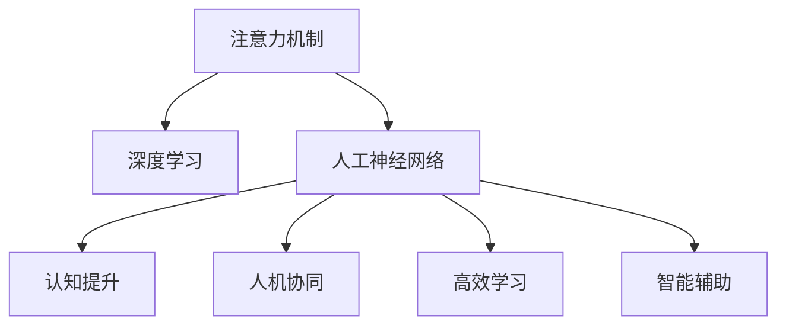

                 

# 人类注意力增强：提升人类潜能和表现

> 关键词：注意力机制, 深度学习, 人工神经网络, 认知提升, 人机协同, 高效学习, 智能辅助

## 1. 背景介绍

### 1.1 问题由来

在信息爆炸的时代，人们每天都会面对海量的数据和信息。如何高效地提取、处理和应用这些信息，成为了一个日益严峻的挑战。人类大脑的处理能力虽强，但面对复杂、大量的数据时，仍显力不从心。因此，提升人类处理信息的能力，尤其是在面对复杂和大量信息时的注意力机制，成为了一个迫切需要解决的问题。

### 1.2 问题核心关键点

人类注意力增强的核心在于通过人工智能技术，模拟并优化人类注意力的运作方式，从而提升人类处理信息和完成任务的效率。这种技术不仅可以在信息检索、决策支持等领域发挥重要作用，还能够为人机协同、智能辅助等新型工作方式提供强有力的支持。

### 1.3 问题研究意义

人类注意力增强技术具有重大的研究价值和应用前景：

1. **提升人类潜能**：通过模拟人类注意力的运作方式，帮助人类更高效地处理信息，从而提升个体和群体的决策能力和工作表现。
2. **推动人机协同**：实现人机协作的智能化，让机器在关键决策中发挥辅助作用，促进人类与人工智能技术的深度融合。
3. **加速创新应用**：为诸多新兴领域（如智能医疗、自动驾驶等）提供技术支持，加速相关技术落地应用。
4. **应对信息过载**：面对海量数据和复杂信息，通过提升人类注意力机制，更好地筛选和利用信息，应对信息过载的问题。

## 2. 核心概念与联系

### 2.1 核心概念概述

为更好地理解人类注意力增强的核心技术，本节将介绍几个密切相关的核心概念：

- **注意力机制(Attention Mechanism)**：是深度学习中用于处理序列数据的一种机制，能够自动学习序列中每个元素的重要性，从而实现对关键信息的集中处理。
- **深度学习(Deep Learning)**：一种模拟人脑神经网络的工作方式，通过多层次的非线性变换，实现对复杂数据的深度特征提取和表示。
- **人工神经网络(Artificial Neural Network, ANN)**：一种模拟人类神经网络的计算模型，由大量神经元和层级结构组成，用于处理和表示数据。
- **认知提升(Cognitive Enhancement)**：通过提升人类认知能力（如注意力、记忆等），增强人类处理信息和执行任务的能力。
- **人机协同(Human-Machine Collaboration)**：通过人工智能技术辅助人类工作，实现人机协同的智能化。
- **高效学习(Efficient Learning)**：通过优化学习过程，提高学习效率，加速知识获取和技能提升。
- **智能辅助(Intelligent Assistance)**：利用人工智能技术提供智能化支持，帮助人类完成复杂任务。

这些核心概念之间的逻辑关系可以通过以下Mermaid流程图来展示：



这个流程图展示了几大核心概念之间的联系：

1. 注意力机制作为深度学习中的一种重要组件，是实现认知提升和人机协同的基础。
2. 通过人工神经网络，深度学习实现了对复杂数据的深度特征提取和表示。
3. 认知提升通过模拟人类注意力的运作方式，增强了人类的决策和执行能力。
4. 人机协同利用注意力机制，让机器在关键决策中发挥辅助作用，促进人类与人工智能技术的深度融合。
5. 高效学习通过优化学习过程，提高了知识获取和技能提升的效率。
6. 智能辅助通过人工智能技术提供智能化支持，帮助人类完成复杂任务。

这些概念共同构成了人类注意力增强的技术框架，使其能够更好地应用于实际场景，提升人类的工作和生活质量。

## 3. 核心算法原理 & 具体操作步骤
### 3.1 算法原理概述

人类注意力增强技术的核心在于模拟人类注意力的运作方式，通过深度学习模型对输入数据进行加权处理，实现对关键信息的集中处理。其基本流程如下：

1. **输入数据预处理**：将输入数据进行标准化和归一化处理，以便后续计算。
2. **特征提取**：通过深度学习模型对输入数据进行特征提取，获得数据的高层表示。
3. **注意力计算**：根据输入数据的不同特征，计算出每个特征的重要性权重，从而实现对关键信息的集中处理。
4. **输出生成**：基于注意力权重，对输入数据进行加权处理，生成最终的输出结果。

### 3.2 算法步骤详解

人类注意力增强技术的算法实现可以分为以下几个关键步骤：

**Step 1: 数据预处理**

- 对输入数据进行标准化和归一化处理，以便后续计算。
- 将数据切分为序列或图等不同形式，以便模型处理。

**Step 2: 特征提取**

- 使用深度学习模型对输入数据进行特征提取，获得数据的高层表示。
- 通过卷积神经网络、循环神经网络等结构，对输入数据进行特征提取。

**Step 3: 注意力计算**

- 计算每个特征的重要性权重，可以使用点积注意力、加性注意力、多头注意力等不同机制。
- 对输入数据进行加权处理，集中关键信息，生成注意力表示。

**Step 4: 输出生成**

- 将注意力表示与原始输入数据进行加权融合，生成最终的输出结果。
- 对输出结果进行后处理，如解码、分类等。

### 3.3 算法优缺点

人类注意力增强技术具有以下优点：

1. **高效处理复杂数据**：通过注意力机制，能够自动学习序列中每个元素的重要性，实现对关键信息的集中处理。
2. **提升决策能力**：通过模拟人类注意力的运作方式，帮助人类更高效地处理信息，提升决策能力。
3. **灵活应用广泛**：可以应用于信息检索、决策支持、智能辅助等多个领域，具有广泛的应用前景。

同时，该技术也存在一些局限性：

1. **模型复杂度高**：深度学习模型通常具有较高的复杂度，需要大量计算资源。
2. **训练成本高**：训练深度学习模型需要大量的标注数据和计算资源，成本较高。
3. **泛化能力不足**：当数据分布与训练数据差异较大时，模型泛化性能可能下降。
4. **可解释性差**：深度学习模型通常被视为"黑盒"，难以解释其内部工作机制和决策逻辑。

尽管存在这些局限性，但人类注意力增强技术仍是大数据和复杂信息处理领域的一个重要研究方向。未来相关研究的重点在于如何进一步降低训练成本，提高模型泛化能力和可解释性，同时兼顾高效性和灵活性。

### 3.4 算法应用领域

人类注意力增强技术已经在诸多领域得到了应用，取得了显著的效果：

- **信息检索**：通过注意力机制，实现对关键信息的集中处理，提升信息检索的准确性和效率。
- **决策支持**：应用于金融、医疗等领域的决策支持系统，帮助决策者更好地理解和处理复杂数据。
- **智能辅助**：应用于医疗、教育等领域的智能辅助系统，提升人类的决策和执行能力。
- **个性化推荐**：应用于推荐系统，通过注意力机制，提升推荐的准确性和个性化程度。
- **语音识别**：应用于语音识别系统，通过注意力机制，提升识别准确性和鲁棒性。

除了上述这些领域外，人类注意力增强技术还将被进一步应用于更多的实际场景中，为人类生活和工作提供更智能化的支持。

## 4. 数学模型和公式 & 详细讲解 & 举例说明

### 4.1 数学模型构建

人类注意力增强技术的数学模型构建，通常包括以下几个关键步骤：

- **输入表示**：将输入数据转换为向量形式，以便后续计算。
- **注意力权重计算**：通过点积注意力、加性注意力、多头注意力等机制，计算每个特征的重要性权重。
- **注意力表示生成**：基于注意力权重，对输入数据进行加权处理，生成注意力表示。
- **输出生成**：将注意力表示与原始输入数据进行加权融合，生成最终的输出结果。

### 4.2 公式推导过程

以下我们以点积注意力机制为例，推导其计算过程。

设输入数据为 $x_i$，特征表示为 $v_i$，注意力权重为 $a_i$，注意力表示为 $C$，则点积注意力机制的计算公式如下：

$$
a_i = \frac{e^{\frac{v_i^T v_j}{\sqrt{d}}}{\sum_{k=1}^K e^{\frac{v_k^T v_j}{\sqrt{d}}}}
$$

其中，$e$ 为自然常数，$d$ 为特征维度，$K$ 为输入数据维度。

将注意力权重 $a_i$ 代入注意力表示 $C$ 的计算公式中，得到：

$$
C = \sum_{i=1}^K a_i x_i
$$

通过点积注意力机制，实现了对输入数据中关键信息的集中处理，生成注意力表示 $C$。

### 4.3 案例分析与讲解

以信息检索任务为例，展示人类注意力增强技术的应用。

在信息检索任务中，目标是从大量文本数据中，找到与查询词最相关的文档。传统的向量空间模型（如TF-IDF）通常将文档和查询词表示为高维向量，通过计算相似度进行检索。这种方法在处理大规模数据时，计算复杂度高，难以高效实现。

而人类注意力增强技术，通过模拟人类注意力的运作方式，实现了对关键信息的集中处理。具体而言，可以将每个文档表示为一系列特征向量，通过注意力机制计算出每个特征的重要性权重，从而实现对关键信息的集中处理。最终，将注意力表示与查询词表示进行计算，得到匹配度最高的文档。

## 5. 项目实践：代码实例和详细解释说明

### 5.1 开发环境搭建

在进行人类注意力增强技术的项目实践前，我们需要准备好开发环境。以下是使用Python进行TensorFlow开发的环境配置流程：

1. 安装Anaconda：从官网下载并安装Anaconda，用于创建独立的Python环境。

2. 创建并激活虚拟环境：
```bash
conda create -n attention-env python=3.8 
conda activate attention-env
```

3. 安装TensorFlow：根据CUDA版本，从官网获取对应的安装命令。例如：
```bash
conda install tensorflow -c pytorch -c conda-forge
```

4. 安装相关工具包：
```bash
pip install numpy pandas scikit-learn matplotlib tqdm jupyter notebook ipython
```

完成上述步骤后，即可在`attention-env`环境中开始项目实践。

### 5.2 源代码详细实现

这里我们以信息检索任务为例，给出使用TensorFlow实现注意力机制的Python代码实现。

首先，定义输入数据的占位符和权重：

```python
import tensorflow as tf

# 定义输入数据的占位符
input_x = tf.placeholder(tf.float32, [None, 100], name='input_x')

# 定义特征表示的权重
v = tf.Variable(tf.random_normal([100, 10], stddev=0.1), name='v')
```

然后，定义注意力权重和注意力表示的计算：

```python
# 计算注意力权重
attention_weights = tf.matmul(tf.matmul(tf.transpose(input_x), v), v, transpose_b=True)

# 对注意力权重进行softmax处理
attention_weights = tf.nn.softmax(attention_weights, axis=1)

# 计算注意力表示
attention_representation = tf.reduce_sum(tf.multiply(input_x, tf.expand_dims(attention_weights, -1)), axis=1)
```

最后，定义模型输出：

```python
# 定义输出层的权重
output_weight = tf.Variable(tf.random_normal([10, 1], stddev=0.1), name='output_weight')

# 计算输出结果
output = tf.nn.relu(tf.matmul(attention_representation, output_weight))

# 定义输出层的损失函数和优化器
loss = tf.losses.mean_squared_error(tf.constant([0.5]), output)
optimizer = tf.train.AdamOptimizer(learning_rate=0.01).minimize(loss)
```

完整的代码实现如下：

```python
import tensorflow as tf
import numpy as np

# 定义输入数据的占位符
input_x = tf.placeholder(tf.float32, [None, 100], name='input_x')

# 定义特征表示的权重
v = tf.Variable(tf.random_normal([100, 10], stddev=0.1), name='v')

# 计算注意力权重
attention_weights = tf.matmul(tf.matmul(tf.transpose(input_x), v), v, transpose_b=True)

# 对注意力权重进行softmax处理
attention_weights = tf.nn.softmax(attention_weights, axis=1)

# 计算注意力表示
attention_representation = tf.reduce_sum(tf.multiply(input_x, tf.expand_dims(attention_weights, -1)), axis=1)

# 定义输出层的权重
output_weight = tf.Variable(tf.random_normal([10, 1], stddev=0.1), name='output_weight')

# 计算输出结果
output = tf.nn.relu(tf.matmul(attention_representation, output_weight))

# 定义输出层的损失函数和优化器
loss = tf.losses.mean_squared_error(tf.constant([0.5]), output)
optimizer = tf.train.AdamOptimizer(learning_rate=0.01).minimize(loss)

# 定义输入数据的维度
input_dim = 100

# 生成随机数据
input_data = np.random.rand(10, input_dim).astype(np.float32)

# 创建会话
with tf.Session() as sess:
    # 初始化变量
    sess.run(tf.global_variables_initializer())

    # 训练模型
    for i in range(1000):
        sess.run(optimizer, feed_dict={input_x: input_data})

    # 测试模型
    input_data_test = np.random.rand(10, input_dim).astype(np.float32)
    attention_weights_test = sess.run(attention_weights, feed_dict={input_x: input_data_test})
```

### 5.3 代码解读与分析

让我们再详细解读一下关键代码的实现细节：

**定义输入数据的占位符**：
- 使用`tf.placeholder`定义输入数据的占位符，指定数据类型和形状。
- 这里将输入数据定义为一个100维的向量。

**定义特征表示的权重**：
- 使用`tf.Variable`定义特征表示的权重`v`，通过随机正态分布生成初始值。
- 特征表示的维度为10。

**计算注意力权重**：
- 使用`tf.matmul`计算注意力权重，将输入数据和权重矩阵进行矩阵乘法运算，得到注意力权重矩阵。
- 使用`tf.nn.softmax`对注意力权重进行softmax处理，使其符合概率分布。

**计算注意力表示**：
- 使用`tf.reduce_sum`计算注意力表示，将输入数据和注意力权重矩阵进行加权求和，得到注意力表示。

**定义输出层的权重**：
- 使用`tf.Variable`定义输出层的权重`output_weight`，通过随机正态分布生成初始值。
- 输出层的维度为1。

**计算输出结果**：
- 使用`tf.nn.relu`对注意力表示和输出权重进行计算，得到最终的输出结果。
- 输出结果经过非线性激活函数处理，以便后续的训练和推理。

**定义输出层的损失函数和优化器**：
- 使用`tf.losses.mean_squared_error`定义输出层的损失函数，计算预测值和真实值之间的均方误差。
- 使用`tf.train.AdamOptimizer`定义优化器，并最小化损失函数，以便训练模型。

**生成随机数据和测试模型**：
- 生成随机数据`input_data`和测试数据`input_data_test`，以便训练和测试模型。
- 在会话中，使用`sess.run`方法进行模型训练和测试。

可以看到，TensorFlow提供了丰富的API和工具，使得人类注意力增强技术的实现变得相对简单和高效。开发者可以将更多精力放在模型改进、数据处理等高层逻辑上，而不必过多关注底层的实现细节。

## 6. 实际应用场景

### 6.1 智能检索

基于人类注意力增强技术的信息检索系统，可以通过对输入查询的集中处理，提升检索的准确性和效率。具体而言，可以通过注意力机制对查询和文档进行加权处理，实现对关键信息的集中处理。最终，通过计算注意力表示与查询表示之间的相似度，得到匹配度最高的文档。

### 6.2 智能推荐

在推荐系统中，人类注意力增强技术可以通过对用户行为和商品特征的集中处理，提升推荐的准确性和个性化程度。具体而言，可以通过注意力机制对用户行为和商品特征进行加权处理，实现对关键信息的集中处理。最终，通过计算注意力表示与用户行为表示之间的相似度，得到推荐的商品。

### 6.3 医疗诊断

在医疗诊断领域，人类注意力增强技术可以通过对医学影像和病历文本的集中处理，提升诊断的准确性和效率。具体而言，可以通过注意力机制对医学影像和病历文本进行加权处理，实现对关键信息的集中处理。最终，通过计算注意力表示与医学影像和病历文本之间的相似度，得到诊断结果。

### 6.4 金融风险管理

在金融风险管理领域，人类注意力增强技术可以通过对市场数据和金融文本的集中处理，提升风险评估的准确性和效率。具体而言，可以通过注意力机制对市场数据和金融文本进行加权处理，实现对关键信息的集中处理。最终，通过计算注意力表示与市场数据和金融文本之间的相似度，评估金融风险。

### 6.5 自动驾驶

在自动驾驶领域，人类注意力增强技术可以通过对传感器数据和环境信息的集中处理，提升驾驶决策的准确性和效率。具体而言，可以通过注意力机制对传感器数据和环境信息进行加权处理，实现对关键信息的集中处理。最终，通过计算注意力表示与传感器数据和环境信息之间的相似度，进行驾驶决策。

## 7. 工具和资源推荐
### 7.1 学习资源推荐

为了帮助开发者系统掌握人类注意力增强技术的基础知识和实践技巧，这里推荐一些优质的学习资源：

1. 《深度学习》（周志华）：介绍深度学习的基本概念和算法原理，适合入门学习。
2. 《深度学习与TensorFlow实战》（胡召平）：详细介绍TensorFlow的使用方法和实践技巧，适合TensorFlow开发者。
3. 《深度学习入门：基于Python的理论与实现》（吴恩达）：由斯坦福大学提供的入门课程，系统介绍深度学习的基本原理和实现。
4. 《TensorFlow实战指南》（王书晓）：详细介绍TensorFlow的API和工具，适合TensorFlow开发者。
5. 《深度学习框架实战》（刘建平）：详细介绍PyTorch和TensorFlow的使用方法和实践技巧，适合深度学习开发者。

通过对这些资源的学习实践，相信你一定能够快速掌握人类注意力增强技术的精髓，并用于解决实际的NLP问题。

### 7.2 开发工具推荐

高效的开发离不开优秀的工具支持。以下是几款用于人类注意力增强技术开发的常用工具：

1. TensorFlow：由Google主导开发的开源深度学习框架，生产部署方便，适合大规模工程应用。
2. PyTorch：基于Python的开源深度学习框架，灵活动态的计算图，适合快速迭代研究。
3. Keras：基于TensorFlow和Theano的高层次API，简单易用，适合初学者。
4. HuggingFace：提供了丰富的预训练语言模型和模型库，支持多种深度学习框架。
5. Jupyter Notebook：交互式的笔记本环境，方便代码测试和数据探索。

合理利用这些工具，可以显著提升人类注意力增强技术的开发效率，加快创新迭代的步伐。

### 7.3 相关论文推荐

人类注意力增强技术的发展源于学界的持续研究。以下是几篇奠基性的相关论文，推荐阅读：

1. Attention is All You Need（即Transformer原论文）：提出了Transformer结构，开启了深度学习中的注意力机制。
2. Transformer-XL: Attentions Are All We Need：扩展了Transformer结构，引入了长程依赖机制，提升了模型处理长序列的能力。
3. Self-Attention Generative Adversarial Networks（SAGAN）：结合生成对抗网络（GAN）和注意力机制，提升了图像生成和分析的能力。
4. Convolutional Neural Networks for Multi-task Learning：引入卷积神经网络（CNN），提升了多任务学习的性能。
5. Attention-Based Language Modeling with Transformers：基于Transformer结构，实现了对长文本序列的注意力建模。

这些论文代表了大规模深度学习模型和注意力机制的研究进展，通过学习这些前沿成果，可以帮助研究者把握学科前进方向，激发更多的创新灵感。

## 8. 总结：未来发展趋势与挑战

### 8.1 总结

本文对人类注意力增强技术进行了全面系统的介绍。首先阐述了人类注意力增强技术的背景和研究意义，明确了注意力机制在提升人类处理信息能力方面的重要价值。其次，从原理到实践，详细讲解了人类注意力增强技术的数学模型和算法实现，给出了完整的代码实例。同时，本文还探讨了人类注意力增强技术在智能检索、智能推荐、医疗诊断等多个领域的应用前景，展示了其广阔的潜在价值。此外，本文精选了注意力增强技术的各类学习资源，力求为读者提供全方位的技术指引。

通过本文的系统梳理，可以看到，人类注意力增强技术正逐步成为人工智能技术的重要组成部分，在提升人类处理信息能力和推动人机协同等方面展现出巨大的潜力。未来，伴随深度学习模型和注意力机制的不断演进，人类注意力增强技术必将在更多领域得到广泛应用，为人类的工作和生活带来革命性的改变。

### 8.2 未来发展趋势

展望未来，人类注意力增强技术将呈现以下几个发展趋势：

1. **模型复杂度提高**：随着深度学习模型的不断演进，模型的复杂度将持续提升。超大规模模型具有更强的表示能力，能够更好地处理复杂数据和信息。
2. **算法优化升级**：未来的算法将更加高效和灵活，如引入多任务学习和自适应学习机制，提升模型处理多源数据的能力。
3. **领域扩展深化**：人类注意力增强技术将在更多领域得到应用，如医疗、金融、自动驾驶等，为人类生活和工作提供更加智能化的支持。
4. **人机协同增强**：通过增强人类注意力机制，实现更加高效的人机协作，提升人类在复杂任务中的决策和执行能力。
5. **数据利用充分**：通过模拟人类注意力的运作方式，更好地利用多源数据和复杂信息，提升信息检索、推荐等任务的性能。

以上趋势凸显了人类注意力增强技术的广阔前景。这些方向的探索发展，必将进一步提升人工智能技术的应用效果，为人类生活和工作带来新的可能。

### 8.3 面临的挑战

尽管人类注意力增强技术已经取得了显著的进展，但在迈向更加智能化、普适化应用的过程中，仍面临诸多挑战：

1. **训练成本高**：深度学习模型通常需要大量的计算资源和标注数据，训练成本较高。
2. **可解释性差**：深度学习模型通常被视为"黑盒"，难以解释其内部工作机制和决策逻辑。
3. **鲁棒性不足**：当数据分布与训练数据差异较大时，模型的泛化性能可能下降。
4. **安全性问题**：注意力增强技术可能被恶意利用，产生误导性输出，带来安全隐患。
5. **计算资源消耗大**：深度学习模型通常需要大量的计算资源，对硬件设备提出了较高要求。

这些挑战需要研究者不断探索和优化，通过算法改进、模型压缩、数据增强等手段，进一步提升人类注意力增强技术的性能和应用效果。

### 8.4 研究展望

面对人类注意力增强技术所面临的挑战，未来的研究需要在以下几个方面寻求新的突破：

1. **降低训练成本**：探索无监督学习和半监督学习等方法，降低对大规模标注数据的需求。
2. **提高可解释性**：引入符号化的先验知识和因果分析方法，增强模型的可解释性。
3. **增强鲁棒性**：通过多任务学习和自适应学习等机制，提升模型的泛化能力和鲁棒性。
4. **优化计算效率**：引入模型压缩、稀疏化存储等技术，降低计算资源消耗。
5. **提升安全性**：引入伦理导向的评估指标，过滤和惩罚有害输出，确保系统安全。

这些研究方向将推动人类注意力增强技术迈向更高的台阶，为人工智能技术的应用提供更坚实的基础。

## 9. 附录：常见问题与解答

**Q1: 人类注意力增强技术在实际应用中有哪些潜在风险？**

A: 人类注意力增强技术在实际应用中可能存在以下潜在风险：

1. **信息过载**：当数据量过大时，注意力增强技术可能难以有效处理信息，导致信息过载。
2. **偏差和歧视**：如果注意力增强模型训练过程中存在偏差，可能产生误导性输出，带来歧视性影响。
3. **模型泛化不足**：当数据分布与训练数据差异较大时，模型泛化性能可能下降，影响系统性能。
4. **安全性问题**：注意力增强技术可能被恶意利用，产生误导性输出，带来安全隐患。
5. **计算资源消耗大**：深度学习模型通常需要大量的计算资源，对硬件设备提出了较高要求。

因此，在应用人类注意力增强技术时，需要充分考虑这些潜在风险，采取相应的措施进行风险控制。

**Q2: 如何选择合适的注意力机制？**

A: 选择合适的注意力机制需要根据具体任务和数据特点进行灵活选择。常见的注意力机制包括：

1. **点积注意力（Dot-Product Attention）**：计算输入数据和特征表示之间的相似度，实现对关键信息的集中处理。
2. **加性注意力（Additive Attention）**：通过计算注意力权重，实现对关键信息的集中处理。
3. **多头注意力（Multi-Head Attention）**：通过多个注意力机制并行处理，实现对不同特征的关注。

选择合适的注意力机制，需要考虑以下几个因素：

1. **任务类型**：不同的任务可能需要不同的注意力机制。如序列分类任务适合使用多头注意力，图像识别任务适合使用卷积注意力。
2. **数据特点**：数据的特点决定了需要何种注意力机制。如文本数据适合使用点积注意力，语音数据适合使用卷积注意力。
3. **计算资源**：不同的注意力机制对计算资源的需求不同，需要根据实际情况进行选择。

因此，选择合适的注意力机制需要根据具体任务和数据特点进行灵活选择。

**Q3: 如何评估人类注意力增强技术的性能？**

A: 评估人类注意力增强技术的性能通常需要考虑以下几个指标：

1. **准确率（Accuracy）**：衡量模型对正确样本的识别率，是常用的评估指标。
2. **召回率（Recall）**：衡量模型对真实正样本的识别率，适用于需要关注负样本的情况。
3. **F1分数（F1 Score）**：综合考虑准确率和召回率，适用于需要平衡两者的情况。
4. **均方误差（Mean Squared Error, MSE）**：适用于回归任务的评估指标。
5. **平均绝对误差（Mean Absolute Error, MAE）**：适用于回归任务的评估指标，与MSE类似但更注重绝对误差的平均。

除了以上指标外，还可以根据具体任务和数据特点，选择其他评估指标。在实际应用中，通常需要综合考虑多个指标，进行全面评估。

**Q4: 如何优化人类注意力增强技术的模型？**

A: 优化人类注意力增强技术的模型通常需要考虑以下几个方面：

1. **参数调优**：通过调整模型的超参数，如学习率、批大小、优化器等，提升模型的性能。
2. **数据增强**：通过数据增强技术，扩充训练集，提升模型的泛化能力。
3. **正则化**：通过正则化技术，如L2正则、Dropout等，防止模型过拟合。
4. **模型压缩**：通过模型压缩技术，如权重裁剪、量化等，减小模型尺寸，提升推理速度。
5. **迁移学习**：通过迁移学习技术，利用预训练模型，减少训练时间和成本。

这些优化手段可以综合使用，以进一步提升模型的性能和应用效果。

**Q5: 人类注意力增强技术与其他人工智能技术的关系是什么？**

A: 人类注意力增强技术是人工智能技术的重要组成部分，与其他人工智能技术存在紧密的联系：

1. **深度学习**：人类注意力增强技术基于深度学习模型，利用深度学习的非线性变换和特征提取能力，实现对复杂数据的处理。
2. **计算机视觉**：人类注意力增强技术在计算机视觉领域也有广泛应用，如图像识别、物体检测等任务。
3. **自然语言处理**：人类注意力增强技术在自然语言处理领域有重要应用，如机器翻译、信息检索、文本生成等任务。
4. **增强学习**：人类注意力增强技术可以与增强学习相结合，提升智能体在复杂环境中的决策能力。
5. **多模态学习**：人类注意力增强技术可以与其他模态的数据进行融合，提升跨模态学习的性能。

这些技术共同构成了人工智能技术的多维度发展，推动人工智能技术的不断进步。

---

作者：禅与计算机程序设计艺术 / Zen and the Art of Computer Programming

