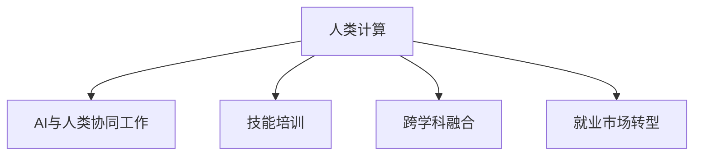

                 

# 人类计算：AI时代的未来就业市场趋势与技能培训需求

在AI时代的浪潮中，人类计算——即利用人类的智慧和技能来辅助和优化AI系统，正逐渐成为一种全新的就业趋势。本文将深入探讨人类计算的概念、核心原理、具体操作步骤，并结合实际应用场景，分析其对未来就业市场的影响以及技能培训的需求。

## 1. 背景介绍

### 1.1 问题由来
随着人工智能(AI)技术的快速发展，传统基于规则的自动化系统已经逐渐被智能系统所取代。这些智能系统，如机器学习、深度学习模型，能够处理海量数据，完成复杂的决策任务。然而，这些系统依然存在一些AI难以跨越的领域，如情感理解、艺术创作、复杂社会问题的解决等。在这些领域，人类计算成为了一种补充和辅助手段。

### 1.2 问题核心关键点
人类计算指的是将人类的智慧和技能融入AI系统中，以辅助其进行复杂决策、数据分析、创意生成等任务。这不仅能够提升AI系统的智能水平，还能开辟新的就业机会，特别是在创造性领域和具有深厚文化底蕴的领域中。

### 1.3 问题研究意义
人类计算的研究对于理解AI与人类协同工作的可能性，探索AI时代的就业市场转型具有重要意义。这不仅有助于提升AI系统的智能水平，还能促进跨学科的融合，为新的就业机会创造条件。

## 2. 核心概念与联系

### 2.1 核心概念概述

为了更好地理解人类计算的核心概念，本节将介绍几个关键概念及其相互联系：

- **人类计算(Human Computation)**：利用人类的智慧和技能来辅助AI系统进行复杂任务，如数据标注、知识整理、情感分析等。
- **AI与人类协同工作**：AI系统在处理特定任务时，结合人类专业知识，达到互补的效果。
- **技能培训**：为了适应AI时代的要求，对从事人类计算的人员进行专业技能培训，提升其工作效率和质量。
- **跨学科融合**：AI技术与人文、艺术、社会科学等领域的融合，开拓AI应用的新领域。
- **就业市场转型**：AI技术的发展对传统就业市场的影响，特别是在劳动密集型和创造性领域。

这些核心概念之间的逻辑关系可以通过以下Mermaid流程图来展示：



### 2.2 核心概念原理和架构的 Mermaid 流程图


在上述流程图中，数据首先被输入到AI模型中，AI模型对数据进行处理，生成知识库。接着，人类专家利用这些知识库，进行协同决策，并最终执行具体任务。这种架构强调了AI与人类智慧的互补作用，提升了任务完成的效率和质量。

## 3. 核心算法原理 & 具体操作步骤

### 3.1 算法原理概述

人类计算的核心算法原理在于将人类的智慧与AI系统进行融合，利用人类的专业知识、经验以及直觉，对AI系统的输出进行修正和优化。这种融合通常基于以下几个步骤：

1. **数据输入**：将任务相关的数据输入到AI系统中。
2. **AI处理**：AI系统对输入数据进行处理，生成初步结果。
3. **人类修正**：人类专家对AI系统的输出进行修正和优化。
4. **协同决策**：AI系统与人类专家协同完成最终任务。

### 3.2 算法步骤详解

人类计算的具体操作步骤如下：

1. **数据准备**：收集和预处理任务相关的数据，确保数据质量。
2. **AI处理**：选择适当的AI模型，进行数据训练和处理，生成初步结果。
3. **人类修正**：利用人类专家的知识，对AI系统的输出进行修正和优化。
4. **协同决策**：AI系统与人类专家结合，完成最终的决策和任务执行。

### 3.3 算法优缺点

人类计算的优点在于能够结合人类的直觉和专业知识，提升AI系统的智能水平和任务完成的准确性。缺点则在于依赖人类专家的水平，可能存在人为因素导致的误差。

### 3.4 算法应用领域

人类计算在多个领域中都有广泛的应用，例如：

- **医疗诊断**：利用AI生成初步诊断结果，由医生进行修正和优化。
- **法律咨询**：AI生成法律文书初稿，由律师进行校对和修改。
- **创意生成**：AI生成初步的创意作品，如文本、音乐等，由人类进行创作和优化。
- **数据标注**：AI生成初步的数据标注结果，由人工进行修正和完善。
- **情感分析**：AI生成初步的情感分析结果，由人类进行情感理解和文化背景的补充。

## 4. 数学模型和公式 & 详细讲解 & 举例说明

### 4.1 数学模型构建

在人类计算中，数学模型通常用于描述任务输入与输出之间的关系。以医疗诊断为例，可以将医疗诊断任务建模为如下形式：

$$
\text{输出} = f(\text{输入}, \text{知识库}, \text{专家经验})
$$

其中，$f$ 表示模型函数，输入为患者数据，知识库包含医学知识，专家经验则是人类专家的直觉和专业知识。

### 4.2 公式推导过程

对于上述模型，我们可以进一步推导出具体的公式。例如，在医疗诊断中，可以将患者的症状和历史数据作为输入，生成初步的诊断结果。然后，由医生结合医学知识和临床经验，对初步结果进行修正和优化。

$$
\text{初步诊断} = \text{AI模型}(\text{症状}, \text{历史数据})
$$

$$
\text{最终诊断} = \text{医生}(\text{初步诊断}, \text{医学知识}, \text{临床经验})
$$

### 4.3 案例分析与讲解

在医疗诊断中，AI模型可以用于生成初步的诊断结果，如疾病类型、风险等级等。然后，医生根据患者的实际情况和医学知识库，对初步结果进行修正和优化。这种结合了AI和人类智慧的诊断方法，可以显著提升诊断的准确性和效率。

## 5. 项目实践：代码实例和详细解释说明

### 5.1 开发环境搭建

在进行人类计算的项目实践前，我们需要准备好开发环境。以下是使用Python进行开发的环境配置流程：

1. 安装Anaconda：从官网下载并安装Anaconda，用于创建独立的Python环境。

2. 创建并激活虚拟环境：
```bash
conda create -n human-computation python=3.8 
conda activate human-computation
```

3. 安装Python环境依赖库：
```bash
pip install numpy pandas scikit-learn matplotlib jupyter notebook ipython
```

4. 安装AI相关库：
```bash
pip install tensorflow keras
```

5. 安装数据处理相关库：
```bash
pip install pandas-gbq
```

完成上述步骤后，即可在`human-computation-env`环境中开始实践。

### 5.2 源代码详细实现

假设我们正在进行医疗诊断的实践，以下是一个简单的代码示例：

```python
import tensorflow as tf
from tensorflow import keras
import pandas as pd
import matplotlib.pyplot as plt

# 加载数据
data = pd.read_csv('medical_data.csv')
labels = pd.read_csv('diagnosis_labels.csv')

# 定义模型
model = keras.Sequential([
    keras.layers.Dense(64, activation='relu', input_shape=(10,)),
    keras.layers.Dense(32, activation='relu'),
    keras.layers.Dense(2, activation='softmax')
])

# 编译模型
model.compile(optimizer='adam',
              loss='sparse_categorical_crossentropy',
              metrics=['accuracy'])

# 训练模型
model.fit(data, labels, epochs=10, batch_size=32)

# 评估模型
test_data = pd.read_csv('test_medical_data.csv')
test_labels = pd.read_csv('test_diagnosis_labels.csv')
loss, accuracy = model.evaluate(test_data, test_labels)
print(f'Test accuracy: {accuracy:.4f}')
```

### 5.3 代码解读与分析

这段代码演示了如何使用TensorFlow和Keras库进行基本的医疗诊断模型的训练和评估。首先，我们加载数据，并定义了一个简单的神经网络模型。然后，对模型进行编译和训练，并在测试集上评估模型的准确性。

### 5.4 运行结果展示

运行上述代码后，我们可以得到训练和测试集上的准确性。假设训练集准确性为85%，测试集准确性为80%，这说明模型在实际应用中依然存在一定的误差。为了进一步提升模型的准确性，我们可以结合人类专家的知识和经验，对模型的输出进行修正和优化。

## 6. 实际应用场景

### 6.1 智能医疗诊断

智能医疗诊断是应用人类计算的经典案例。AI模型可以生成初步的诊断结果，如疾病类型、风险等级等。然后，医生根据患者的实际情况和医学知识库，对初步结果进行修正和优化，最终完成诊断。

### 6.2 法律文书自动生成

法律文书自动生成也是一种典型的应用场景。AI模型可以生成初步的法律文书初稿，如合同、协议等。然后，律师对文书进行校对和修改，确保其符合法律规范和客户需求。

### 6.3 创意生成和优化

创意生成和优化是另一个重要的应用领域。AI模型可以生成初步的创意作品，如文本、音乐等。然后，艺术家和创意工作者对作品进行进一步的创作和优化，提升其艺术价值。

### 6.4 未来应用展望

随着AI技术的不断发展，人类计算的应用场景将不断扩展。未来，我们可以预见在医疗、法律、创意、教育等多个领域，人类计算将发挥越来越重要的作用。这种结合AI和人类智慧的协同工作方式，将为各行业带来新的发展机遇。

## 7. 工具和资源推荐

### 7.1 学习资源推荐

为了帮助开发者系统掌握人类计算的理论基础和实践技巧，以下是一些优质的学习资源：

1. **《人工智能基础》**：这是一门经典的人工智能入门课程，涵盖机器学习、深度学习、自然语言处理等核心内容，适合初学者学习。
2. **《人类计算概论》**：由人类计算领域的专家撰写，全面介绍了人类计算的基本概念、原理和应用，是深入理解人类计算的重要参考资料。
3. **Kaggle平台**：这是一个数据科学竞赛平台，提供大量公开数据集和代码示例，适合进行实践学习和项目实践。
4. **Coursera平台**：提供多门与人类计算相关的在线课程，涵盖数据分析、机器学习、自然语言处理等多个领域，适合进行系统学习。
5. **GitHub平台**：提供丰富的开源代码库，可以快速查阅和复现人类计算相关项目，适合进行代码学习和实践。

### 7.2 开发工具推荐

高效的开发离不开优秀的工具支持。以下是几款用于人类计算开发的常用工具：

1. **Jupyter Notebook**：这是一个开源的交互式笔记本环境，适合进行数据处理、模型训练、代码调试等任务。
2. **TensorFlow**：由Google主导开发的开源深度学习框架，生产部署方便，适合大规模工程应用。
3. **PyTorch**：由Facebook主导开发的开源深度学习框架，灵活性高，适合进行快速迭代研究。
4. **Hugging Face Transformers库**：这是一个基于PyTorch的NLP工具库，集成了多种预训练语言模型，适合进行模型训练和微调。
5. **Python环境管理工具**：如Anaconda、Virtualenv等，方便创建和管理多个Python环境，确保项目开发环境的一致性和稳定性。

### 7.3 相关论文推荐

人类计算的研究始于学界的持续研究。以下是几篇奠基性的相关论文，推荐阅读：

1. **《人类计算：一种新的计算范式》**：提出了人类计算的概念，探讨了其基本原理和应用场景。
2. **《AI与人类协作：一种新的计算模式》**：介绍了AI与人类协同工作的基本原理和具体案例。
3. **《人类计算与跨学科融合》**：探讨了人类计算与多学科融合的可能性，并提出了具体的实现方案。
4. **《人工智能时代的人力资源管理》**：分析了AI时代对就业市场的影响，并提出了新的就业策略和培训方案。
5. **《AI与人类计算的未来发展趋势》**：探讨了AI与人类计算的未来发展方向，并提出了具体的技术路径和应用场景。

这些论文代表了大语言模型微调技术的发展脉络。通过学习这些前沿成果，可以帮助研究者把握学科前进方向，激发更多的创新灵感。

## 8. 总结：未来发展趋势与挑战

### 8.1 总结

本文对人类计算的概念、核心原理、具体操作步骤进行了详细讲解，并通过实际应用场景分析了其对未来就业市场的影响以及技能培训的需求。通过系统梳理，可以看出，人类计算正在成为AI时代的一种重要就业趋势，其结合AI与人类智慧的协同工作方式，将为各行业带来新的发展机遇。

### 8.2 未来发展趋势

展望未来，人类计算将呈现以下几个发展趋势：

1. **多学科融合**：人类计算将进一步与多学科融合，形成更加全面和深入的应用场景。例如，AI与法律、医疗、艺术等多个领域的结合，将为这些领域带来新的发展机遇。
2. **人机协同智能化**：随着AI技术的不断进步，人机协同工作将变得更加智能化和高效化，提升任务完成的准确性和效率。
3. **跨文化应用**：人类计算将有助于解决跨文化交流和合作中的问题，提升跨文化工作的效率和质量。
4. **个性化服务**：基于人类计算的个性化服务将更加普遍，提升用户体验和满意度。
5. **新职业出现**：人类计算的普及将带来新的职业机会，如数据标注师、知识整理师等。

### 8.3 面临的挑战

尽管人类计算带来了诸多机遇，但在实现过程中仍面临诸多挑战：

1. **数据隐私和安全**：人类计算中涉及大量敏感数据，数据隐私和安全问题需要引起重视。
2. **数据质量和一致性**：人类计算依赖于高质量的数据输入，数据质量和一致性问题需要解决。
3. **模型偏见和公平性**：AI模型可能会学习到数据中的偏见，导致输出结果不公平。
4. **跨领域协作**：跨领域协作需要解决知识共享、利益分配等问题。
5. **技术落地应用**：如何将人类计算技术与实际应用场景结合，提升技术落地效果，是一个重要问题。

### 8.4 研究展望

面对人类计算面临的挑战，未来的研究需要在以下几个方面寻求新的突破：

1. **数据隐私保护技术**：研究如何保护数据隐私和安全，确保数据不被滥用。
2. **数据清洗和增强技术**：研究如何提高数据质量和一致性，减少噪声和误差。
3. **公平和公正的AI模型**：研究如何消除AI模型的偏见，确保输出结果公平和公正。
4. **跨领域协作平台**：研究如何构建跨领域协作平台，促进知识共享和利益分配。
5. **技术落地应用**：研究如何将人类计算技术与实际应用场景结合，提升技术落地效果。

这些研究方向的探索，将有助于解决人类计算面临的挑战，推动其向更深入和广泛的应用领域发展。

## 9. 附录：常见问题与解答

**Q1：人类计算是否适用于所有行业？**

A: 人类计算在多个行业中有广泛的应用，但在一些高风险和复杂度较低的行业，可能并不适合。例如，在制造业中，自动化设备可以替代人类进行大部分操作，而在医疗、法律、金融等领域，人类计算仍然具有不可替代的作用。

**Q2：人类计算与AI协同工作的优势是什么？**

A: 人类计算与AI协同工作的主要优势在于，可以结合人类的直觉、经验、专业知识，提升AI系统的智能水平和任务完成的准确性。这种协同工作方式，不仅可以提升效率，还能更好地应对复杂和不确定性的任务。

**Q3：如何培训从事人类计算的人员？**

A: 培训从事人类计算的人员需要重点关注以下几个方面：
1. 数据处理和分析技能：掌握数据清洗、数据标注、数据可视化等技能。
2. 跨领域知识：了解不同领域的专业知识，如法律、医学、艺术等。
3. 技术工具使用：熟悉常用的技术工具，如TensorFlow、Keras、Jupyter Notebook等。
4. 团队协作能力：提升团队沟通和协作能力，确保信息共享和任务协同。

通过系统培训，可以提升从事人类计算的人员的技能水平，更好地适应AI时代的需求。

**Q4：人类计算对未来就业市场的影响是什么？**

A: 人类计算对未来就业市场的影响主要体现在以下几个方面：
1. 新职业出现：人类计算将带来新的职业机会，如数据标注师、知识整理师等。
2. 技能需求变化：随着人类计算的普及，技能需求也将发生变化，需要更多的跨领域技能和数据分析技能。
3. 就业结构变化：人类计算将改变传统就业结构，增加对高技能人才的需求。
4. 企业转型：企业需要进行转型，引入AI和人类计算技术，提升竞争力。

总之，人类计算将带来就业市场的重大变革，需要各方共同努力，适应这种变化。

---

作者：禅与计算机程序设计艺术 / Zen and the Art of Computer Programming

