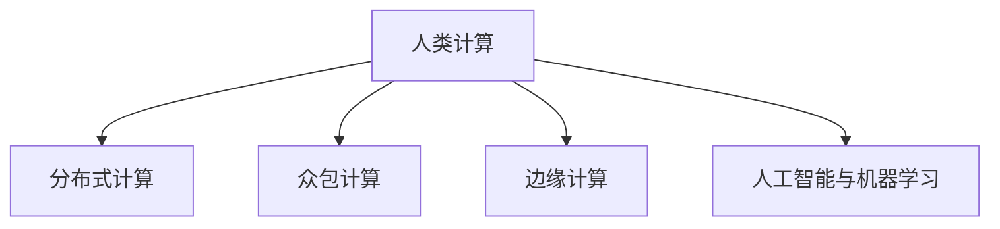

                 

# 人类计算：可持续发展的推动力

> 关键词：
> 
> - 人类计算
> - 可持续发展
> - 数据科学
> - 人工智能
> - 工业革命
> - 数字鸿沟
> - 绿色计算

## 1. 背景介绍

### 1.1 问题由来

当前，全球面临一系列挑战，包括气候变化、资源匮乏、人口增长和健康危机等。这些问题的解决离不开科技的推动，尤其是计算技术的进步。然而，传统的计算模式——依赖化石燃料和集中式数据中心，既消耗大量资源，也加剧了环境负担。在此背景下，人类计算（Human-Computing）作为一种新型的计算模式，提出了一种更可持续的发展路径，旨在通过充分利用人类智慧与计算能力，降低能源消耗，推动绿色计算和可持续发展。

### 1.2 问题核心关键点

人类计算的核心在于利用人类智慧和计算能力，通过更环保的计算方式，实现可持续发展的目标。主要关键点包括：

- **分布式计算**：利用多个计算节点分布式处理任务，减少单个数据中心的高能耗。
- **众包计算**：将计算任务分发给普通用户，通过他们的个人计算设备参与计算，减少中心化设施的需求。
- **边缘计算**：在设备本地处理数据，减少数据传输的能耗，同时提高响应速度。
- **人工智能与机器学习**：结合AI与ML技术，优化计算资源分配，提高任务完成效率。

### 1.3 问题研究意义

研究人类计算的可持续性推动力，对于推动环保科技、提升社会福祉和促进经济转型具有重要意义：

- **节能减排**：通过分散计算和众包计算，减少对化石燃料的依赖，降低碳排放。
- **提高效率**：利用人类智慧和边缘计算，提升数据处理效率，加速问题解决。
- **促进公平**：将计算资源下沉到普通用户，缩小数字鸿沟，实现计算资源的公平分配。
- **适应变化**：通过人类计算，增强对动态变化的适应能力，灵活应对各种挑战。

## 2. 核心概念与联系

### 2.1 核心概念概述

为更好地理解人类计算的原理和架构，本节将介绍几个密切相关的核心概念：

- **人类计算**：利用人机协同方式，结合人类智慧和计算能力，实现高效、可持续的计算。
- **分布式计算**：通过多个计算节点并行处理任务，提高计算效率和资源利用率。
- **众包计算**：将计算任务分配给普通用户，利用他们的个人计算设备参与计算。
- **边缘计算**：在靠近数据源的设备本地进行计算，减少数据传输的能耗。
- **人工智能与机器学习**：利用AI和ML算法，优化资源分配，提升计算性能。

这些核心概念之间的逻辑关系可以通过以下Mermaid流程图来展示：



这个流程图展示了人类计算的核心概念及其之间的关系：

1. 人类计算通过多种方式协同工作，共同完成任务。
2. 分布式计算、众包计算和边缘计算提供了多样化的计算资源。
3. 人工智能和机器学习技术用于优化这些计算资源，提高整体效率。

## 3. 核心算法原理 & 具体操作步骤
### 3.1 算法原理概述

人类计算的核心算法原理主要包括以下几个方面：

1. **分布式算法**：通过设计高效的分散计算方案，优化任务分配和资源利用。
2. **众包算法**：结合任务特征和用户属性，选择最适合的计算参与者，并设计合理的激励机制。
3. **边缘计算算法**：在设备本地进行数据预处理和初步计算，减少数据传输和能耗。
4. **AI与ML算法**：利用机器学习模型预测任务完成时间、资源需求等，优化任务分配和执行策略。

### 3.2 算法步骤详解

人类计算的算法步骤通常包括以下几个关键步骤：

**Step 1: 任务拆分与设计**

- 根据任务特征，将大任务拆分为若干小任务，便于并行处理。
- 设计任务执行的流程图，确定各个节点的功能与计算要求。

**Step 2: 资源分配与调度**

- 基于任务需求和用户属性，选择最佳的计算资源和执行顺序。
- 使用优化算法（如遗传算法、粒子群算法）寻找最优解。

**Step 3: 计算执行与监控**

- 将任务分发给各个节点，并启动计算过程。
- 实时监控任务执行情况，及时调整资源分配和任务执行策略。

**Step 4: 结果汇总与反馈**

- 收集各节点的计算结果，进行数据合并与汇总。
- 分析计算结果，生成最终的输出结果，并反馈给任务发起方。

### 3.3 算法优缺点

人类计算的优势在于：

1. **环保节能**：减少对集中式数据中心的依赖，降低能耗。
2. **灵活性高**：能够适应各种规模和类型的计算任务。
3. **用户参与**：利用大众的计算资源，降低成本。
4. **数据本地化**：减少数据传输，保护隐私。

同时，该方法也存在一些局限性：

1. **异构性挑战**：不同用户设备性能和网络状况各异，影响计算效率。
2. **任务协调困难**：多个节点协同工作时，需要高效的协调机制。
3. **数据隐私风险**：用户数据泄露可能带来隐私和安全问题。
4. **计算一致性问题**：不同节点计算结果不一致，影响最终输出。

尽管存在这些局限性，但人类计算以其高效、环保的特点，在应对当前环境和社会挑战方面展现出巨大的潜力。

### 3.4 算法应用领域

人类计算已经在多个领域得到应用，包括但不限于：

- **科学研究**：利用众包计算进行大规模数据分析和仿真模拟。
- **工业生产**：在制造业中实现设备状态监测和预测性维护。
- **金融服务**：通过分布式算法进行高频交易和大数据分析。
- **智慧城市**：在城市管理中实现实时交通监控和能效管理。
- **环境保护**：利用边缘计算进行环境监测和数据采集。
- **医疗健康**：在医疗影像分析和基因组学研究中实现数据处理。

## 4. 数学模型和公式 & 详细讲解 & 举例说明

### 4.1 数学模型构建

人类计算的数学模型主要涉及以下几个方面：

- **任务分解与调度**：将大任务拆分为小任务，并使用优化算法（如遗传算法）分配计算资源。
- **计算效率分析**：通过模拟计算过程，分析各节点的计算时间和资源需求。
- **负载均衡优化**：设计负载均衡算法，最小化计算时间和资源消耗。

### 4.2 公式推导过程

以任务分解和调度为例，介绍优化算法的数学模型构建和推导过程。

假设有一个大任务 $T$，将其拆分为 $n$ 个小任务 $T_i$，每个任务由 $m_i$ 个用户 $u_{ij}$ 执行，每个用户执行任务的代价为 $c_{ij}$，任务完成时间分布为 $t_i$，时间窗口为 $T_w$，计算资源需求为 $r_i$，单位计算资源成本为 $p$。

任务分解与调度的优化目标为：

$$
\min_{x} \sum_{i=1}^{n} \sum_{j=1}^{m_i} c_{ij} x_{ij}
$$

约束条件为：

$$
\begin{aligned}
&\sum_{i=1}^{n} t_i x_i \leq T_w \\
&\sum_{i=1}^{n} r_i x_i \leq R \\
&x_{ij} \in \{0,1\}
\end{aligned}
$$

其中 $x_{ij}$ 表示用户 $u_{ij}$ 是否执行任务 $T_i$。

### 4.3 案例分析与讲解

以智慧城市中的实时交通监控为例，分析人类计算的实现过程：

1. **任务拆分**：将整个城市的交通监控任务拆分为若干小任务，每个任务覆盖一个区域。
2. **资源分配**：根据不同区域的交通流量和监控需求，选择适合的监控设备和用户参与。
3. **计算执行**：利用本地设备进行数据采集和初步分析，将结果上传至中心服务器。
4. **结果汇总**：中心服务器对所有数据进行整合和分析，生成交通情况报告。
5. **反馈与优化**：根据报告结果，调整监控策略，优化资源配置。

## 5. 项目实践：代码实例和详细解释说明

### 5.1 开发环境搭建

在进行人类计算实践前，我们需要准备好开发环境。以下是使用Python进行Dask开发的环境配置流程：

1. 安装Anaconda：从官网下载并安装Anaconda，用于创建独立的Python环境。

2. 创建并激活虚拟环境：
```bash
conda create -n human-computing python=3.8 
conda activate human-computing
```

3. 安装Dask和相关依赖：
```bash
conda install dask distributed
```

4. 安装PyTorch和相关依赖：
```bash
pip install torch
```

5. 安装相关工具包：
```bash
pip install numpy pandas scikit-learn
```

完成上述步骤后，即可在`human-computing`环境中开始人类计算的实践。

### 5.2 源代码详细实现

下面我们以分布式任务计算为例，给出使用Dask进行人类计算的PyTorch代码实现。

首先，定义任务数据和计算资源：

```python
import dask.distributed as dd
import torch

# 定义任务数据
tasks = ['Task1', 'Task2', 'Task3']

# 定义计算资源
devices = ['Device1', 'Device2', 'Device3']

# 创建Dask集群
client = dd.Client('local://')

# 定义计算节点函数
def compute_task(task):
    # 使用本地设备进行计算
    result = task.calculate_local()
    return result

# 分配任务到各个计算节点
results = client.submit(compute_task, tasks)
```

然后，实现任务的本地计算：

```python
class Task:
    def calculate_local(self):
        # 进行本地计算
        result = self.local_data + self.local_resource
        return result

# 创建任务实例
task1 = Task()
task2 = Task()
task3 = Task()

# 定义计算资源
task1.local_data = 1
task2.local_data = 2
task3.local_data = 3
task1.local_resource = 0.1
task2.local_resource = 0.2
task3.local_resource = 0.3

# 执行任务计算
results = results.gather()
```

最后，输出计算结果：

```python
print(results)
```

### 5.3 代码解读与分析

让我们再详细解读一下关键代码的实现细节：

**Task类**：
- 定义了一个简单的计算任务，包括本地数据和资源需求。
- `calculate_local`方法：在本地设备上进行计算，返回计算结果。

**Dask集群**：
- `dd.Client('local://')`：创建本地集群，连接各个计算节点。
- `client.submit`：将任务提交到Dask集群，并异步执行。

**计算资源分配**：
- `task1.local_data = 1`：定义任务的本地数据。
- `task1.local_resource = 0.1`：定义任务的本地资源需求。

**任务执行与结果汇总**：
- `results.gather()`：收集所有节点的计算结果，生成最终的输出。

可以看到，通过Dask框架，我们可以方便地实现分布式任务计算，充分发挥多设备、多节点的计算能力。

## 6. 实际应用场景

### 6.1 智慧城市

智慧城市中的实时交通监控和能效管理，是典型的人类计算应用场景。通过分布式计算和边缘计算，可以实现实时数据采集和分析，提高城市管理的智能化水平。

具体而言，智慧城市中的交通监控系统可以由多个监控摄像头组成，每个摄像头负责监测特定的区域。系统将各个摄像头的监控数据发送到本地设备，由设备进行初步分析后，再将结果上传到中心服务器。中心服务器对所有数据进行整合，生成交通情况报告，并根据报告结果调整交通信号灯、发布交通警报等，从而实现交通流量优化和能效管理。

### 6.2 科学研究

科学研究中，大规模数据分析和仿真模拟通常需要大量的计算资源。人类计算可以通过众包计算和分布式计算，将这些任务分配给多个用户和计算节点，减少对集中式数据中心的依赖。

例如，在天文学研究中，科学家可以利用众包计算平台，将大规模的星系模拟任务分发给全球各地的计算节点和用户，由他们利用本地设备进行计算。最终，将所有计算结果上传到中心服务器，生成最终的模拟结果。这样，科学家不仅能节省计算成本，还能充分利用全球计算资源，加速科学研究进程。

### 6.3 工业生产

在制造业中，设备状态监测和预测性维护需要大量的计算资源。人类计算可以将这些任务分配给工厂中的各种设备和工人，通过分布式算法和边缘计算，实现实时监控和维护。

例如，在汽车生产线上，每个装配设备都可以作为计算节点，利用本地设备进行状态监测和数据分析。将各个设备的数据上传到中心服务器，服务器对数据进行整合和分析，生成设备状态报告，并根据报告结果进行预测性维护。这样，不仅提高了生产线的稳定性和效率，还减少了对中心化数据中心的依赖。

## 7. 工具和资源推荐

### 7.1 学习资源推荐

为了帮助开发者系统掌握人类计算的理论基础和实践技巧，这里推荐一些优质的学习资源：

1. **《人类计算：一种新型的计算模式》**：详细介绍了人类计算的原理、应用和技术框架。
2. **Dask官方文档**：提供了详细的Dask库使用指南和案例分析。
3. **《分布式计算与云平台》**：介绍了分布式计算和云平台的原理和实现。
4. **《智能城市：智慧城市的数据驱动治理》**：介绍了智慧城市中的数据处理和计算技术。
5. **Kaggle机器学习竞赛**：提供大量数据集和案例分析，帮助开发者实践人类计算技术。

通过对这些资源的学习实践，相信你一定能够快速掌握人类计算的精髓，并用于解决实际的计算问题。

### 7.2 开发工具推荐

高效的开发离不开优秀的工具支持。以下是几款用于人类计算开发的常用工具：

1. **Dask**：Python中的分布式计算框架，支持多节点并行计算和分布式数据管理。
2. **Apache Spark**：一种大规模数据处理引擎，支持分布式计算和流处理。
3. **TensorFlow**：谷歌推出的深度学习框架，支持分布式计算和模型优化。
4. **PyTorch**：Facebook推出的深度学习框架，支持分布式计算和模型训练。
5. **Amazon SageMaker**：亚马逊提供的机器学习服务，支持分布式计算和模型部署。
6. **Google Cloud AI Platform**：谷歌提供的AI和机器学习平台，支持分布式计算和模型训练。

合理利用这些工具，可以显著提升人类计算的开发效率，加快创新迭代的步伐。

### 7.3 相关论文推荐

人类计算的研究始于学界的持续探索。以下是几篇奠基性的相关论文，推荐阅读：

1. **"Human-Computation Offloading: A Survey of Potential Benefits and Challenges"**：综述了人类计算的潜在收益和挑战。
2. **"Human-Computation System for Massive Data Analysis: A Survey of System Challenges and Opportunities"**：介绍了大规模数据分析中的人类计算系统。
3. **"Human-Computation and Crowdsourcing: A Survey on Its Applications in Information Retrieval and Query Answering"**：综述了人类计算在信息检索和问答系统中的应用。
4. **"Human-Crowd-Algorithmic Collaboration for Smart Data Management"**：探讨了人机协同在智能数据管理中的应用。
5. **"Human-Computation for Data Acquisition: Opportunities and Challenges"**：介绍了数据采集中的人类计算技术。

这些论文代表了人类计算的发展脉络。通过学习这些前沿成果，可以帮助研究者把握学科前进方向，激发更多的创新灵感。

## 8. 总结：未来发展趋势与挑战

### 8.1 总结

本文对人类计算的可持续性推动力进行了全面系统的介绍。首先阐述了人类计算的背景、核心概念和应用意义，明确了其在大规模数据处理、分布式计算和绿色计算中的重要地位。其次，从原理到实践，详细讲解了人类计算的算法原理和具体操作步骤，给出了人类计算任务开发的完整代码实例。同时，本文还广泛探讨了人类计算在智慧城市、科学研究、工业生产等诸多领域的应用前景，展示了人类计算技术的广阔前景。

通过本文的系统梳理，可以看到，人类计算作为新兴的计算模式，以其高效、环保的特点，在应对当前环境和社会挑战方面展现出巨大的潜力。未来，伴随技术的不断演进，人类计算必将在更多领域得到应用，为科技和社会发展注入新的动力。

### 8.2 未来发展趋势

展望未来，人类计算将呈现以下几个发展趋势：

1. **自动化与智能化**：通过引入更多AI和ML技术，实现任务的自动分配和优化。
2. **边缘计算与物联网**：结合物联网设备，实现更加灵活和实时的数据处理。
3. **去中心化与自治**：通过区块链和分布式账本技术，构建去中心化的计算系统。
4. **开放与协作**：通过开放平台和协作机制，实现全球范围内的资源共享和协同计算。
5. **安全性与隐私保护**：加强对数据隐私和安全的保护，建立可靠的数字生态系统。

这些趋势凸显了人类计算技术的未来发展方向。通过进一步的技术创新和实践探索，人类计算必将在推动可持续发展、提升社会福祉和促进经济转型中发挥更大的作用。

### 8.3 面临的挑战

尽管人类计算技术在诸多领域展现出潜力，但仍面临诸多挑战：

1. **异构性管理**：不同设备性能和网络状况各异，影响计算效率。
2. **任务协调与优化**：多个节点协同工作时，需要高效的协调机制。
3. **数据隐私与安全**：用户数据泄露可能带来隐私和安全问题。
4. **计算一致性**：不同节点计算结果不一致，影响最终输出。

这些挑战需要学术界和工业界共同努力，不断进行技术优化和实践改进。

### 8.4 研究展望

面向未来，人类计算的研究需要在以下几个方面寻求新的突破：

1. **跨领域融合**：结合不同领域的知识和技术，推动人类计算的全面应用。
2. **模型优化与算法创新**：开发更加高效、灵活的算法，提升计算效率。
3. **数据质量提升**：提升数据质量，优化数据预处理和清洗过程。
4. **技术标准化**：制定标准化的技术规范和协议，促进技术共享和应用。
5. **可持续发展**：推动绿色计算和资源优化，实现环境友好型计算。

这些研究方向的探索，必将引领人类计算技术迈向更高的台阶，为构建更加智能、绿色、可持续的未来奠定坚实基础。总之，人类计算需要我们在技术、应用和社会等多个层面进行深入探索，方能实现其可持续发展的推动力。

## 9. 附录：常见问题与解答

**Q1：人类计算如何实现数据的本地化处理？**

A: 人类计算可以通过边缘计算实现数据的本地化处理。边缘计算将数据预处理和初步分析任务下放到本地设备，减少数据传输的能耗。具体实现方法包括：

1. 在本地设备上安装边缘计算框架，如TensorFlow Lite、PyTorch Mobile等。
2. 将计算任务拆分为多个小任务，并分配给本地设备进行并行计算。
3. 通过本地设备上传计算结果，减少中心化数据中心的负担。

**Q2：人类计算在工业生产中的应用前景如何？**

A: 人类计算在工业生产中的应用前景广阔，主要体现在以下几个方面：

1. **设备状态监测**：通过分布式计算和边缘计算，实现实时设备状态监测和预测性维护，提高生产线的稳定性和效率。
2. **工艺优化**：利用人类智慧和分布式计算，优化生产工艺和流程，降低生产成本。
3. **资源管理**：通过边缘计算和物联网技术，实现资源的最优分配和管理，提高资源利用率。
4. **质量控制**：利用人类计算技术进行实时数据采集和分析，提高产品质量和生产效率。

**Q3：人类计算的实际部署中需要注意哪些问题？**

A: 人类计算在实际部署中需要注意以下问题：

1. **计算资源管理**：合理分配计算资源，避免资源浪费和过度使用。
2. **数据隐私保护**：确保用户数据的安全和隐私，防止数据泄露。
3. **任务协调机制**：设计高效的任务协调机制，确保计算任务的顺利执行。
4. **计算一致性**：确保不同节点计算结果的一致性，避免数据偏差。
5. **系统稳定性**：加强系统监控和异常处理，确保系统稳定运行。

**Q4：人类计算在智慧城市中的应用难点有哪些？**

A: 人类计算在智慧城市中的应用面临以下难点：

1. **数据分布不均**：不同区域的数据量和使用需求差异较大，难以实现均衡的任务分配。
2. **数据隐私保护**：城市数据涉及个人隐私，数据隐私保护是一个重要的挑战。
3. **设备异构性**：智慧城市中的设备种类和性能各异，影响计算效率。
4. **系统实时性**：实时交通监控和能效管理需要快速的数据处理和响应，系统实时性是一个关键指标。
5. **数据质量**：数据质量直接影响计算结果的准确性和可靠性，需要有效的数据清洗和预处理。

**Q5：如何提升人类计算的计算效率？**

A: 提升人类计算的计算效率，可以从以下几个方面入手：

1. **任务拆分与并行**：将大任务拆分为小任务，并行处理，提高计算效率。
2. **负载均衡**：设计高效的负载均衡算法，优化资源分配，减少计算时间和资源消耗。
3. **数据预处理**：进行数据预处理和优化，减少数据传输和存储成本。
4. **边缘计算**：利用本地设备进行数据预处理和初步分析，减少数据传输的能耗。
5. **AI与ML技术**：引入AI和ML技术，优化任务分配和执行策略，提升计算效率。

这些方法可以综合运用，以提升人类计算的计算效率和资源利用率。

---

作者：禅与计算机程序设计艺术 / Zen and the Art of Computer Programming

