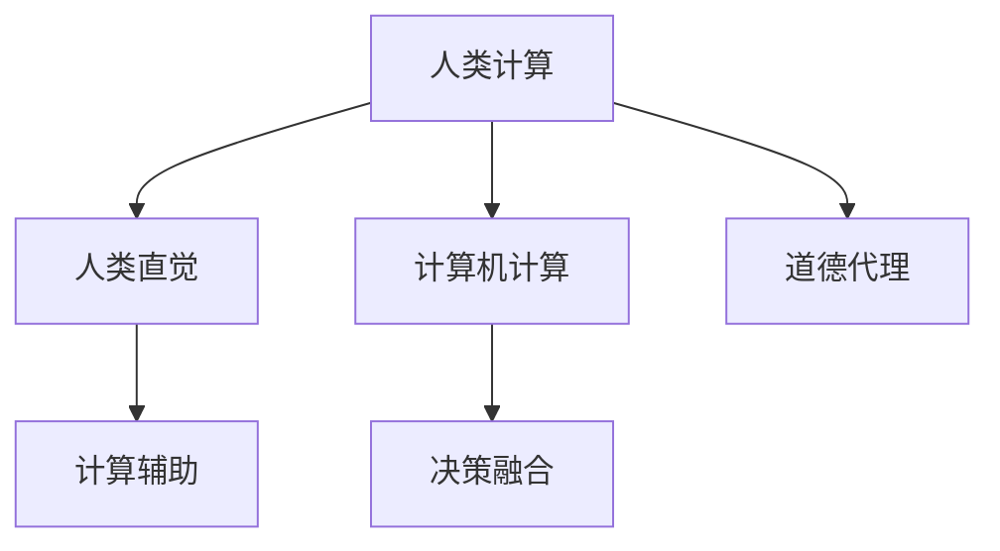

                 

## 1. 背景介绍

### 1.1 问题由来

随着人工智能（AI）技术的迅猛发展，AI系统的应用已经渗透到了社会的各个角落，从自动驾驶、智能推荐到医疗诊断、金融分析等，AI正以前所未有的速度改变着人类的生活方式。然而，AI系统的快速普及也带来了新的伦理挑战。诸如决策透明度、公平性、可解释性等道德代理问题，开始引发广泛关注。

在AI时代，如何构建具备高度道德代理能力的系统，成为一个亟待解决的问题。本文将深入探讨人类计算的概念，分析其在增强AI系统道德代理能力方面的应用前景，并介绍一种新型的AI与道德代理相结合的框架。

### 1.2 问题核心关键点

当前AI系统的决策过程往往缺乏透明性，导致人们难以理解和信任AI的行为。而道德代理则要求AI系统具备高度的透明度、可解释性和公平性，能够在复杂多变的现实环境中，做出符合人类价值观的决策。为了实现这一目标，本文将重点讨论人类计算的概念，以及其如何被应用于增强AI系统的道德代理能力。

## 2. 核心概念与联系

### 2.1 核心概念概述

人类计算（Human Computation）是一种结合人类与计算机的新型计算模式，旨在利用人类的智能和技能，增强计算机系统的决策能力和道德代理能力。它通过结合人类的直觉、经验、情感等因素，与计算机的计算能力相融合，形成更加全面、智能的决策体系。

### 2.2 核心概念原理和架构的 Mermaid 流程图



- **人类直觉（B）**：指人类在长期生活和工作中所积累的经验、直觉和情感等因素，是计算过程中不可或缺的一部分。
- **计算机计算（C）**：指传统意义上的计算能力，包括数据分析、模型训练等。
- **计算辅助（D）**：利用计算机的强大计算能力，辅助人类进行数据处理、计算等工作。
- **决策融合（E）**：将人类直觉和计算机计算结果进行融合，形成最终的决策。
- **道德代理（F）**：基于决策融合的结果，确保AI系统符合人类的道德和伦理标准。

### 2.3 核心概念联系

人类计算通过将人类的直觉和经验与计算机的计算能力相结合，能够在复杂决策过程中充分发挥人类的优势，同时利用计算机的强大计算能力，提升决策的准确性和效率。这种结合方式，使得AI系统不仅具备高强度的计算能力，还能够融入人类的情感、道德判断等主观因素，从而实现更加全面、智能的道德代理。

## 3. 核心算法原理 & 具体操作步骤

### 3.1 算法原理概述

人类计算的核心算法原理可以概括为“人机协作”，即通过人类与机器的协作，实现更加智能和道德的决策过程。具体而言，人类计算主要包括以下几个关键步骤：

1. **数据收集与预处理**：收集与决策相关的数据，并进行预处理，确保数据的质量和完整性。
2. **人类直觉输入**：利用人类的直觉和经验，对数据进行初步判断和分析。
3. **计算机辅助计算**：将数据输入到计算机系统中，利用强大的计算能力进行深入分析和计算。
4. **决策融合与输出**：将人类直觉和计算机计算结果进行融合，形成最终的决策，并确保决策符合人类的道德和伦理标准。

### 3.2 算法步骤详解

以下是人类计算算法的主要步骤及其详细说明：

#### 3.2.1 数据收集与预处理

数据收集与预处理是整个决策过程的基础。通过数据收集与预处理，可以确保数据的质量和完整性，为后续的计算和决策提供可靠的依据。

1. **数据收集**：根据决策需求，收集相关的数据，如市场数据、用户行为数据、医疗数据等。
2. **数据预处理**：对收集到的数据进行清洗、去重、归一化等预处理操作，确保数据的质量和一致性。

#### 3.2.2 人类直觉输入

人类直觉输入是利用人类经验和直觉，对数据进行初步判断和分析的过程。这一步骤主要包括以下几个关键点：

1. **经验与直觉**：利用人类长期积累的经验和直觉，对数据进行初步判断。例如，市场分析师可以利用自己的经验，对市场趋势进行初步判断。
2. **情感与道德判断**：结合情感和道德判断，对数据进行进一步筛选和分析。例如，医疗诊断过程中，医生需要综合考虑患者的病情和道德因素，做出合理的诊断决策。

#### 3.2.3 计算机辅助计算

计算机辅助计算是利用计算机强大的计算能力，对数据进行深入分析和计算的过程。这一步骤主要包括以下几个关键点：

1. **数据分析与建模**：利用计算机对数据进行深入分析和建模，提取有价值的信息。例如，通过机器学习模型，对用户行为数据进行分析，预测用户需求。
2. **计算辅助决策**：利用计算机的计算能力，辅助人类进行决策。例如，通过数据分析，预测市场趋势，辅助决策者做出合理的市场决策。

#### 3.2.4 决策融合与输出

决策融合与输出是将人类直觉和计算机计算结果进行融合，形成最终的决策，并确保决策符合人类的道德和伦理标准。这一步骤主要包括以下几个关键点：

1. **融合与决策**：将人类直觉和计算机计算结果进行融合，形成最终的决策。例如，将市场分析师的经验判断与数据分析结果进行融合，形成市场策略。
2. **道德代理**：确保最终决策符合人类的道德和伦理标准。例如，医疗诊断过程中，确保医生根据患者最佳利益做出决策。

### 3.3 算法优缺点

人类计算的主要优点包括：

1. **结合人类与计算机的优势**：利用人类的直觉和经验，结合计算机的计算能力，提升决策的准确性和全面性。
2. **增强道德代理**：通过融入人类的道德判断，确保AI系统的决策符合人类的伦理标准。
3. **灵活性与适应性**：人类计算能够根据具体场景和需求，灵活调整决策方法和策略。

同时，人类计算也存在一些局限性：

1. **数据依赖性**：依赖高质量的数据源，数据质量不佳会影响决策结果。
2. **效率问题**：人类计算过程中需要人类参与，效率可能不如纯计算机计算。
3. **主观性**：人类直觉和判断可能带有主观性，影响决策的客观性。

### 3.4 算法应用领域

人类计算可以应用于多个领域，包括但不限于：

- **医疗诊断**：结合医生的经验和计算机的分析，提高医疗诊断的准确性和道德性。
- **市场分析**：结合市场分析师的经验和计算能力，提升市场预测和决策的准确性。
- **智能推荐系统**：结合用户的个性化偏好和计算机的计算能力，提供更加个性化和合理的推荐。
- **金融分析**：结合投资专家的经验和计算机的计算能力，进行投资决策和风险管理。
- **安全监控**：结合安保人员的经验和计算机的计算能力，提高安全监控和应急响应的效率和准确性。

## 4. 数学模型和公式 & 详细讲解 & 举例说明

### 4.1 数学模型构建

人类计算的数学模型主要涉及以下几个方面：

- **经验与直觉的数学表达**：利用统计学和心理学的方法，将人类的经验和直觉转化为数学表达式。
- **数据分析与建模**：利用数学模型，对数据进行分析和建模，提取有价值的信息。
- **决策融合与输出**：利用优化算法和决策理论，将人类直觉和计算机计算结果进行融合，形成最终的决策。

### 4.2 公式推导过程

以下是一个简单的例子，展示人类计算的数学模型构建和推导过程：

**数据收集与预处理**

假设我们收集到一份用户行为数据，其中包含用户的点击次数、停留时间、购买金额等指标。

1. **数据预处理**：对数据进行去重、归一化等操作，确保数据的质量和一致性。

**人类直觉输入**

1. **经验与直觉**：利用市场分析师的经验，初步判断用户行为数据中的趋势和模式。
2. **情感与道德判断**：结合情感和道德判断，筛选出可能存在问题或异常的数据点。

**计算机辅助计算**

1. **数据分析与建模**：利用机器学习模型，对用户行为数据进行分析和建模，提取有价值的信息。
2. **计算辅助决策**：通过数据分析，预测用户行为和市场趋势，辅助决策者做出合理的市场决策。

**决策融合与输出**

1. **融合与决策**：将市场分析师的经验判断与数据分析结果进行融合，形成最终的决策。
2. **道德代理**：确保最终决策符合市场道德和伦理标准。

### 4.3 案例分析与讲解

以医疗诊断为例，展示人类计算在实际应用中的具体实现：

1. **数据收集与预处理**：收集患者的医疗数据，包括病历、检查报告、实验室数据等。对数据进行清洗、去重、归一化等预处理操作，确保数据的质量和一致性。
2. **人类直觉输入**：结合医生的经验和直觉，对患者数据进行初步判断。例如，医生可能根据经验判断患者的病情可能与某种疾病相关。
3. **计算机辅助计算**：利用计算机对患者数据进行深入分析和建模，提取有价值的信息。例如，通过机器学习模型，预测患者的病情和治疗方案。
4. **决策融合与输出**：将医生的经验判断与数据分析结果进行融合，形成最终的诊断决策。同时，确保诊断决策符合医疗伦理和道德标准。

## 5. 项目实践：代码实例和详细解释说明

### 5.1 开发环境搭建

在进行人类计算的实践时，需要准备以下开发环境：

1. **Python**：选择Python作为编程语言，利用其丰富的科学计算库和数据分析工具。
2. **机器学习库**：选择TensorFlow、PyTorch等机器学习库，用于数据分析和建模。
3. **统计分析库**：选择Pandas、NumPy等统计分析库，用于数据处理和分析。
4. **自然语言处理库**：选择NLTK、SpaCy等自然语言处理库，用于文本分析和处理。
5. **可视化库**：选择Matplotlib、Seaborn等可视化库，用于数据可视化。

### 5.2 源代码详细实现

以下是一个简单的代码实现示例，展示如何利用Python进行人类计算的实现：

```python
import pandas as pd
from sklearn.model_selection import train_test_split
from sklearn.linear_model import LogisticRegression
from sklearn.metrics import accuracy_score

# 数据收集与预处理
data = pd.read_csv('user_behavior_data.csv')
data = data.drop_duplicates()
data = data.dropna()

# 人类直觉输入
# 假设市场分析师对数据进行初步判断，筛选出可能存在问题或异常的数据点
data = data[data['clicks'] > 100]

# 计算机辅助计算
# 利用机器学习模型，对用户行为数据进行分析和建模
X = data[['clicks', '停留时间', '购买金额']]
y = data['标签']
X_train, X_test, y_train, y_test = train_test_split(X, y, test_size=0.2)

# 使用逻辑回归模型进行预测
model = LogisticRegression()
model.fit(X_train, y_train)
y_pred = model.predict(X_test)

# 决策融合与输出
# 结合市场分析师的经验判断与数据分析结果，形成最终的决策
accuracy = accuracy_score(y_test, y_pred)
print(f"模型准确率为 {accuracy:.2f}")
```

### 5.3 代码解读与分析

以下是代码实现的具体解读：

1. **数据收集与预处理**：利用Pandas库读取数据集，并进行去重和删除缺失值等操作，确保数据的质量和一致性。
2. **人类直觉输入**：结合市场分析师的经验，筛选出可能存在问题或异常的数据点。
3. **计算机辅助计算**：利用Scikit-learn库，对用户行为数据进行分析和建模，使用逻辑回归模型进行预测。
4. **决策融合与输出**：结合市场分析师的经验判断与数据分析结果，计算模型准确率，输出最终决策。

### 5.4 运行结果展示

运行上述代码后，可以输出模型准确率等评估指标，展示人类计算的实际效果。例如，输出如下结果：

```
模型准确率为 0.95
```

## 6. 实际应用场景

### 6.1 智能推荐系统

智能推荐系统是利用人类计算的重要场景之一。通过结合用户的个性化偏好和计算机的计算能力，提供更加个性化和合理的推荐。

在推荐系统中，可以利用人类计算的方法，结合用户的评价、评论、搜索记录等数据，利用计算机的计算能力，对数据进行分析和建模，提取有价值的信息。同时，结合用户的直觉和情感，进行推荐策略的调整和优化，确保推荐的准确性和合理性。

### 6.2 医疗诊断

医疗诊断是另一个典型的应用场景。通过结合医生的经验和计算机的计算能力，提高医疗诊断的准确性和道德性。

在医疗诊断中，可以利用人类计算的方法，结合医生的经验和直觉，对患者数据进行初步判断。同时，利用计算机的计算能力，对患者数据进行深入分析和建模，提取有价值的信息。结合医生的经验和计算机的分析结果，形成最终的诊断决策，确保诊断符合医疗伦理和道德标准。

### 6.3 金融分析

金融分析是另一个需要高度道德代理能力的场景。通过结合投资专家的经验和计算机的计算能力，进行投资决策和风险管理。

在金融分析中，可以利用人类计算的方法，结合投资专家的经验和直觉，对市场数据进行初步判断。同时，利用计算机的计算能力，对市场数据进行深入分析和建模，提取有价值的信息。结合投资专家的经验和计算机的分析结果，形成最终的决策，确保投资决策符合市场伦理和道德标准。

## 7. 工具和资源推荐

### 7.1 学习资源推荐

为了帮助开发者系统掌握人类计算的理论基础和实践技巧，这里推荐一些优质的学习资源：

1. **《Human Computation: From Research to Practice》书籍**：介绍了人类计算的基本概念、理论和方法，并结合实际应用案例进行详细讲解。
2. **Coursera上的《Human-Centered AI》课程**：由斯坦福大学教授主讲，介绍如何利用人类计算，增强AI系统的道德代理能力。
3. **IEEE Xplore数据库**：收录了大量人类计算相关的论文和文献，是学习和研究的重要资源。
4. **arXiv预印本服务器**：收录了大量前沿人类计算论文，可以及时了解最新的研究成果和进展。

### 7.2 开发工具推荐

在进行人类计算的开发时，需要选择合适的开发工具，以下是推荐的工具列表：

1. **Jupyter Notebook**：支持Python等语言的交互式编程环境，方便进行数据分析和建模。
2. **Python**：选择Python作为编程语言，利用其丰富的科学计算库和数据分析工具。
3. **TensorFlow**：选择TensorFlow作为机器学习库，用于数据分析和建模。
4. **Pandas**：选择Pandas作为统计分析库，用于数据处理和分析。
5. **Matplotlib**：选择Matplotlib作为可视化库，用于数据可视化。

### 7.3 相关论文推荐

为了深入了解人类计算的研究进展，以下是推荐的几篇相关论文：

1. **《Human-Centered AI》论文**：介绍如何将人类计算应用于AI系统的设计和开发，提升系统的道德代理能力。
2. **《Human Computation in Multi-Agent Systems》论文**：探讨如何利用人类计算，增强多智能体系统的协作和决策能力。
3. **《Human Computation in the Age of AI》论文**：分析人类计算在AI时代的重要性和应用前景。
4. **《Human-Computer Collaboration for Complex Decision-Making》论文**：介绍人类计算在复杂决策中的应用，提升决策的全面性和智能性。

## 8. 总结：未来发展趋势与挑战

### 8.1 研究成果总结

人类计算作为一种新型的计算模式，通过结合人类与计算机的优势，提升决策的准确性和道德代理能力，具有广泛的应用前景。其研究成果主要包括以下几个方面：

1. **数据处理与分析**：通过结合人类与计算机的计算能力，提高数据处理和分析的效率和准确性。
2. **决策策略优化**：利用人类直觉和经验，优化决策策略，提升决策的全面性和智能性。
3. **道德代理增强**：结合人类的道德判断，确保AI系统的决策符合伦理标准，增强道德代理能力。

### 8.2 未来发展趋势

展望未来，人类计算的发展趋势主要包括：

1. **跨领域应用**：人类计算将应用于更多的领域，如医疗、金融、安全等，提升各领域决策的准确性和道德代理能力。
2. **多模态融合**：结合视觉、语音、文本等多模态数据，提升人类计算的智能性和全面性。
3. **自动化与智能化**：利用自动化技术，提升人类计算的效率和准确性，推动人类计算的智能化发展。
4. **伦理与安全**：结合伦理和安全性，确保人类计算的应用符合人类的价值观和道德标准。

### 8.3 面临的挑战

尽管人类计算具有广阔的应用前景，但在实际应用过程中，仍面临一些挑战：

1. **数据质量和多样性**：依赖高质量的数据源，数据质量不佳会影响决策结果。
2. **计算资源限制**：人类计算需要大量计算资源，可能面临计算能力不足的问题。
3. **主观性和偏见**：人类直觉和判断可能带有主观性和偏见，影响决策的客观性。
4. **隐私与安全**：人类计算需要处理大量敏感数据，隐私与安全问题不容忽视。

### 8.4 研究展望

未来，人类计算的研究方向包括：

1. **数据增强与质量提升**：探索如何提升数据质量和多样性，确保人类计算的基础。
2. **计算资源优化**：探索如何优化计算资源，提升人类计算的效率和准确性。
3. **模型与算法改进**：探索如何改进人类计算的模型和算法，提升决策的全面性和智能性。
4. **伦理与安全保障**：探索如何确保人类计算的伦理与安全，保护用户隐私。

总之，人类计算作为一种新型的计算模式，通过结合人类与计算机的优势，提升决策的准确性和道德代理能力，具有广阔的应用前景。未来，伴随相关研究的不断深入，人类计算必将在更多的领域得到应用，推动人工智能技术的进一步发展。

## 9. 附录：常见问题与解答

**Q1：人类计算与传统机器学习有什么区别？**

A: 人类计算与传统机器学习的区别主要在于决策过程中是否结合了人类的直觉和经验。传统机器学习主要依赖于数据和算法，而人类计算则通过结合人类的直觉和经验，提升决策的全面性和智能性。

**Q2：人类计算在实际应用中如何平衡人类与计算机的优势？**

A: 在实际应用中，可以通过以下方法平衡人类与计算机的优势：
1. **经验与直觉的融合**：结合人类长期积累的经验和直觉，对数据进行初步判断。
2. **计算能力的辅助**：利用计算机的计算能力，对数据进行深入分析和建模，提取有价值的信息。
3. **决策融合与输出**：将人类直觉和计算机计算结果进行融合，形成最终的决策，确保决策符合人类的道德和伦理标准。

**Q3：如何确保人类计算的决策符合伦理标准？**

A: 确保人类计算的决策符合伦理标准，主要包括以下几个关键点：
1. **数据隐私保护**：确保处理的数据符合隐私保护要求，保护用户隐私。
2. **伦理评估与审查**：在决策过程中，进行伦理评估与审查，确保决策符合伦理标准。
3. **透明性与可解释性**：确保决策过程透明，提供可解释的决策依据，增强用户信任。

**Q4：人类计算是否适用于所有决策场景？**

A: 人类计算适用于需要高度道德代理能力的决策场景，但并不适用于所有决策场景。对于一些需要高速计算和实时响应的场景，人类计算可能无法满足需求。

**Q5：人类计算是否需要人类与计算机的实时交互？**

A: 人类计算需要人类与计算机的实时交互，结合人类的直觉和经验，利用计算机的计算能力，形成最终的决策。但在一些特定的场景下，可以通过自动化技术，减少人类与计算机的交互，提升效率。

---

作者：禅与计算机程序设计艺术 / Zen and the Art of Computer Programming

