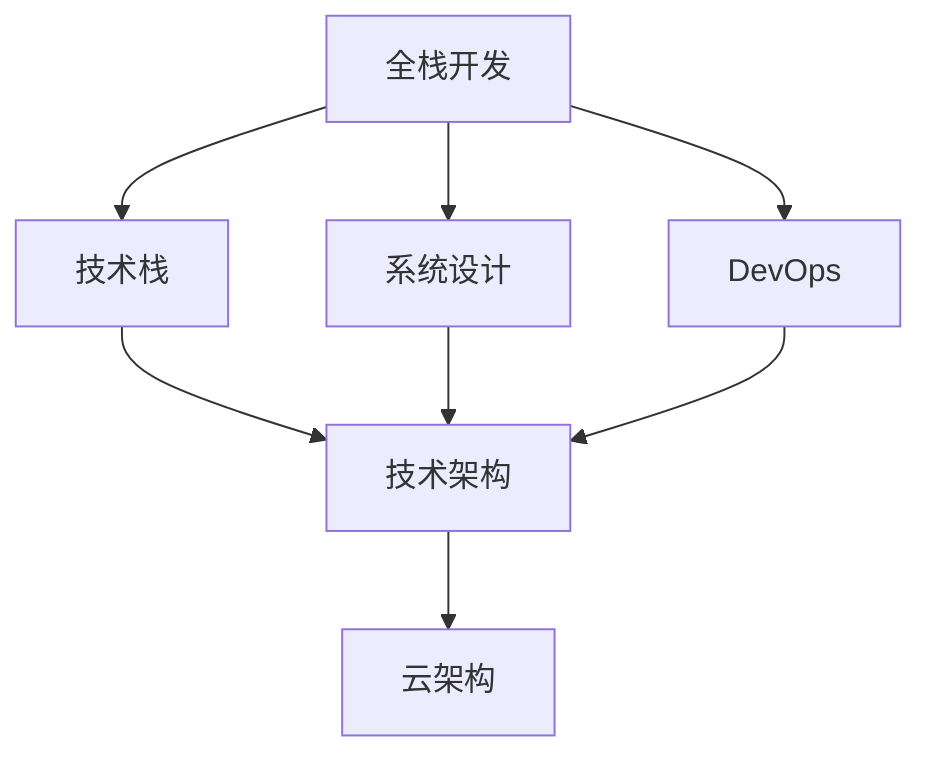

                 

# 从全栈开发到技术架构师的进阶

> 关键词：全栈开发,技术架构,技术栈,软件工程,DevOps,云架构

## 1. 背景介绍

### 1.1 问题由来

在软件开发领域，全栈开发和架构设计是两个非常重要的角色。全栈开发者需要掌握多种编程语言和技术栈，具备构建完整系统所需的技能，能够独立完成从设计到部署的全流程开发。而技术架构师则需要对整个技术栈有深入理解，能够设计高效、可扩展、可维护的系统架构，确保项目的稳定性和可靠性。然而，从全栈开发到架构师转型并不容易，很多人在此过程中面临诸多挑战。

### 1.2 问题核心关键点

从全栈开发到技术架构师转型，需要掌握以下核心能力：
1. 对技术栈有深入理解：熟悉常见技术栈，包括前后端、数据库、缓存、消息队列、云计算等。
2. 具备系统设计思维：能够从整体上考虑系统设计，权衡性能、可扩展性、可维护性等指标。
3. 熟练运用设计模式：掌握常用的设计模式，如单例、工厂、策略、观察者等，提升代码的可读性和可维护性。
4. 精通DevOps理念与实践：理解DevOps的文化与工具，掌握CI/CD、容器化、自动化测试等关键技术。
5. 具备云架构思维：掌握云平台的基本概念和架构，能够构建基于云的应用。

本节将从这些关键点出发，全面探讨从全栈开发到技术架构师的进阶之路。

## 2. 核心概念与联系

### 2.1 核心概念概述

为了更好地理解转型过程，首先需要明确几个核心概念：

- 全栈开发(Full-stack Development)：指开发人员具备前后端技术的能力，能够独立构建完整的系统。
- 技术栈(Tech Stack)：指用于开发某个应用或系统所涉及的各种技术和工具的集合，包括编程语言、框架、库等。
- 技术架构(Architecture)：指系统的整体设计，包括数据流、组件、接口等，确保系统的高效性和可扩展性。
- DevOps：一种软件开发与运维一体化的方法论，强调自动化、持续交付和持续集成。
- 云架构(Cloud Architecture)：指在云平台上设计和部署应用的方法论，包括服务架构、容器化、微服务等。

这些概念之间的联系可以通过以下Mermaid流程图来展示：



这个流程图展示了从全栈开发到技术架构师转型的基本流程：首先，全栈开发者需要掌握多种技术栈；然后，在实际项目中，将技术栈应用到系统设计中；接下来，引入DevOps理念，自动化流水线；最后，在设计系统的基础上，考虑如何基于云平台进行部署和运维。通过这个过程，全栈开发者逐步转型为技术架构师。

## 3. 核心算法原理 & 具体操作步骤
### 3.1 算法原理概述

从全栈开发到技术架构师的转型，本质上是一个系统化学习和实践的过程。它不仅需要掌握各种技术栈和工具，还需要深入理解系统设计、DevOps和云架构等概念。以下是这一过程的算法原理概述：

1. **系统化学习**：通过系统的学习课程和实践项目，掌握各类技术栈和工具的使用。
2. **实战练习**：在实际项目中，应用所学知识，进行系统设计和DevOps实践。
3. **经验积累**：通过项目经验的积累，逐步理解和应用设计模式、架构思维。
4. **持续改进**：根据项目反馈和新技术，不断改进和优化系统设计和DevOps实践。

### 3.2 算法步骤详解

以下是详细的算法步骤：

1. **选择学习路径**：
    - 确定想要掌握的技术栈和工具。例如，前端开发需要掌握HTML、CSS、JavaScript、React等，后端开发需要掌握Java、Python、Node.js、Spring Boot等。
    - 选择合适的学习资源，如在线课程、书籍、官方文档等。
    - 制定学习计划，逐步学习和掌握各个技术点。

2. **实战项目选择**：
    - 选择适合自己的实战项目，可以是开源项目、公司内部项目等。
    - 根据项目需求，确定系统设计方案，包括架构、组件、接口等。
    - 编写系统代码，并进行单元测试、集成测试等。

3. **引入DevOps**：
    - 了解DevOps的基本理念和方法，包括持续集成、持续交付、自动化测试等。
    - 引入CI/CD工具，如Jenkins、GitLab CI等，进行自动化流水线构建。
    - 使用容器化技术，如Docker、Kubernetes等，进行系统部署和运维。

4. **系统优化和改进**：
    - 根据项目反馈，优化系统设计和DevOps实践。
    - 引入新的设计模式和架构思维，提升系统的可扩展性和可维护性。
    - 持续关注新技术和新趋势，不断学习和应用。

### 3.3 算法优缺点

从全栈开发到技术架构师转型的算法具有以下优点：

1. **综合能力提升**：全面掌握多种技术栈和工具，提高解决问题的能力。
2. **系统设计能力增强**：通过实战项目和系统设计，理解系统架构和设计模式。
3. **自动化效率提高**：引入DevOps理念，提高开发和运维效率。
4. **云平台应用娴熟**：掌握云架构，在云平台上构建高效应用。

同时，也存在一些缺点：

1. **学习成本高**：需要掌握多种技术和工具，学习周期较长。
2. **项目经验要求高**：需要实际项目经验，单靠理论学习难以深入理解。
3. **技术栈更新快**：技术更新迅速，需要持续学习和跟进。

### 3.4 算法应用领域

从全栈开发到技术架构师转型的方法，适用于以下场景：

1. **软件公司**：软件开发和运维团队，需要设计高效、可扩展的系统架构。
2. **创业公司**：创业团队需要快速构建系统，同时注重系统可维护性。
3. **IT部门**：企业IT部门，需要设计和部署云应用，提升IT基础设施能力。
4. **开源社区**：开源项目贡献者和维护者，需要理解和应用设计模式和架构思维。

## 4. 数学模型和公式 & 详细讲解  
### 4.1 数学模型构建

本节将使用数学语言对从全栈开发到技术架构师转型的过程进行更加严格的刻画。

设全栈开发者为 $S$，技术架构师为 $A$。从 $S$ 到 $A$ 的转型过程可以表示为：

$$
S \rightarrow A = S \times S_{T} \times S_{D} \times S_{P}
$$

其中，$S_T$ 表示系统化学习，$S_D$ 表示实战练习，$S_P$ 表示持续改进。

### 4.2 公式推导过程

具体公式推导过程如下：

1. **系统化学习**：
    - 设全栈开发者掌握的技术栈为 $T$，则系统化学习过程可以表示为：
    $$
    S_T = \sum_{i=1}^n T_i
    $$
    其中 $T_i$ 为第 $i$ 项技术栈。

2. **实战练习**：
    - 设实战项目为 $P$，则实战练习过程可以表示为：
    $$
    S_D = \int_{P}^{S_{T}} dp
    $$
    其中 $dp$ 为在实战项目 $P$ 上积累的经验。

3. **引入DevOps**：
    - DevOps引入过程可以表示为：
    $$
    S_P = S_{D} \times S_{C} \times S_{A}
    $$
    其中 $S_C$ 表示持续集成，$S_A$ 表示自动化测试。

4. **系统优化和改进**：
    - 系统优化过程可以表示为：
    $$
    S_P = S_{P} \times \int_{S_D}^{S_{P}} dp
    $$
    其中 $dp$ 为在持续改进过程中积累的经验。

### 4.3 案例分析与讲解

假设一名全栈开发者 $S$ 想要转型为技术架构师 $A$，具体步骤如下：

1. **选择学习路径**：
    - 学习前端开发，掌握HTML、CSS、JavaScript、React等。
    - 学习后端开发，掌握Java、Python、Node.js、Spring Boot等。
    - 学习数据库，掌握MySQL、PostgreSQL等。
    - 学习缓存和消息队列，掌握Redis、RabbitMQ等。
    - 学习云平台，掌握AWS、Azure等。

2. **实战项目选择**：
    - 选择开源项目，如GitHub上的一个电子商务网站。
    - 设计系统架构，包括前端、后端、数据库、缓存、消息队列等。
    - 编写代码，并进行单元测试、集成测试等。
    - 上线部署，使用Docker容器化部署。

3. **引入DevOps**：
    - 引入CI/CD工具，如Jenkins，构建自动化流水线。
    - 引入自动化测试工具，如Selenium，进行前端自动化测试。
    - 引入容器化技术，如Docker，进行系统部署。

4. **系统优化和改进**：
    - 根据项目反馈，优化系统设计和DevOps实践。
    - 引入新的设计模式和架构思维，提升系统的可扩展性和可维护性。
    - 持续关注新技术和新趋势，不断学习和应用。

## 5. 项目实践：代码实例和详细解释说明
### 5.1 开发环境搭建

在进行全栈开发和架构设计实践前，我们需要准备好开发环境。以下是使用Python进行Web开发的环境配置流程：

1. 安装Anaconda：从官网下载并安装Anaconda，用于创建独立的Python环境。

2. 创建并激活虚拟环境：
```bash
conda create -n web-env python=3.8 
conda activate web-env
```

3. 安装必要的库：
```bash
pip install Flask
pip install SQLAlchemy
pip install Flask-SQLAlchemy
pip install Flask-WTF
pip install Flask-Login
pip install Flask-Mail
```

4. 安装DevOps工具：
```bash
pip install Jenkins
pip install GitLab-CI
pip install Docker
pip install Kubernetes
```

完成上述步骤后，即可在`web-env`环境中开始全栈开发和架构设计实践。

### 5.2 源代码详细实现

这里我们以Web应用开发为例，给出使用Flask进行全栈开发的PyTorch代码实现。

首先，定义Web应用的基本框架：

```python
from flask import Flask, render_template, request, redirect, url_for
from flask_sqlalchemy import SQLAlchemy
from flask_login import LoginManager
from flask_mail import Mail

app = Flask(__name__)
app.config['SECRET_KEY'] = 'my_secret_key'
app.config['SQLALCHEMY_DATABASE_URI'] = 'sqlite:///test.db'
app.config['MAIL_SERVER'] = 'smtp.gmail.com'
app.config['MAIL_PORT'] = 465
app.config['MAIL_USERNAME'] = 'your_email@example.com'
app.config['MAIL_PASSWORD'] = 'your_password'
app.config['MAIL_USE_TLS'] = False
app.config['MAIL_USE_SSL'] = True

db = SQLAlchemy(app)
login_manager = LoginManager(app)
mail = Mail(app)

# 定义模型
class User(db.Model):
    id = db.Column(db.Integer, primary_key=True)
    username = db.Column(db.String(64), unique=True)
    password_hash = db.Column(db.String(128))
    email = db.Column(db.String(120), unique=True)

@app.route('/')
def index():
    return render_template('index.html')
```

然后，定义用户注册、登录、邮件发送等功能：

```python
from werkzeug.security import generate_password_hash, check_password_hash
from flask_login import UserMixin, login_user, logout_user, login_required, current_user

@app.route('/register', methods=['GET', 'POST'])
def register():
    if current_user.is_authenticated:
        return redirect(url_for('index'))
    if request.method == 'POST':
        username = request.form['username']
        password = request.form['password']
        email = request.form['email']
        hash_password = generate_password_hash(password)
        new_user = User(username=username, password_hash=hash_password, email=email)
        db.session.add(new_user)
        db.session.commit()
        login_user(new_user)
        return redirect(url_for('index'))
    return render_template('register.html')

@app.route('/login', methods=['GET', 'POST'])
def login():
    if current_user.is_authenticated:
        return redirect(url_for('index'))
    if request.method == 'POST':
        username = request.form['username']
        password = request.form['password']
        user = User.query.filter_by(username=username).first()
        if user and check_password_hash(user.password_hash, password):
            login_user(user)
            return redirect(url_for('index'))
    return render_template('login.html')

@app.route('/send_email', methods=['POST'])
@login_required
def send_email():
    email = current_user.email
    subject = 'Hello, World!'
    msg = Message(subject=subject, recipients=[email], body='send email')
    mail.send(msg)
    return redirect(url_for('index'))
```

最后，启动Web应用，并在测试环境中进行测试：

```python
if __name__ == '__main__':
    app.run(debug=True)
```

### 5.3 代码解读与分析

让我们再详细解读一下关键代码的实现细节：

**Flask应用框架**：
- `Flask`是一个轻量级Web应用框架，适合快速搭建原型和Web应用。
- `SQLAlchemy`是Flask官方推荐的ORM，用于数据库操作。
- `Flask-Login`和`Flask-Mail`是常用的第三方扩展，用于用户认证和邮件发送。

**模型定义**：
- 定义用户模型，包括`id`、`username`、`password_hash`和`email`等属性。
- 使用`SQLAlchemy`进行数据库映射，将模型映射到数据库表中。

**用户注册和登录**：
- 定义注册和登录路由，处理用户注册、登录和邮件发送等功能。
- 使用`werkzeug.security`模块进行密码哈希处理，确保密码安全。

**Web应用启动**：
- 使用`app.run(debug=True)`启动Web应用，并在调试模式下运行。
- 使用`redirect(url_for('index'))`将用户重定向到首页。

在实际开发中，开发者可以根据需求进行功能扩展和优化，如引入缓存、消息队列、数据库分片等。

## 6. 实际应用场景
### 6.1 电商应用开发

电商应用开发需要全栈开发和架构设计能力的结合。前端需要开发用户界面、交互效果和商品展示等；后端需要处理订单、支付、库存等业务逻辑；数据库需要存储用户数据、订单数据、商品数据等。

通过全栈开发，开发者可以构建完整电商应用，提升用户体验和运营效率。引入DevOps和云架构，可以确保系统的稳定性和可扩展性。

### 6.2 金融系统构建

金融系统构建需要高安全性和高可靠性，需要全栈开发和架构设计能力的结合。前端需要处理用户界面、数据展示等；后端需要处理账户管理、交易处理等；数据库需要存储交易记录、账户信息等。

通过全栈开发，开发者可以构建高效金融系统，提升用户体验和运营效率。引入DevOps和云架构，可以确保系统的稳定性和可扩展性。

### 6.3 医疗应用开发

医疗应用开发需要高可靠性和高安全性，需要全栈开发和架构设计能力的结合。前端需要处理用户界面、数据展示等；后端需要处理患者信息、病历管理等；数据库需要存储患者数据、病历数据等。

通过全栈开发，开发者可以构建高效医疗系统，提升用户体验和运营效率。引入DevOps和云架构，可以确保系统的稳定性和可扩展性。

### 6.4 未来应用展望

随着云计算和DevOps技术的发展，全栈开发和架构设计能力的重要性将进一步提升。未来，开发者需要掌握更多的技术和工具，才能适应新的技术环境和市场需求。

在未来的应用中，开发者需要具备以下能力：

1. 深入理解云计算和DevOps技术，能够构建高效、可扩展的系统。
2. 掌握更多编程语言和框架，提升解决复杂问题的能力。
3. 持续学习和跟进新技术，保持技术竞争力。
4. 具备系统设计和架构思维，能够设计和优化系统架构。
5. 具备持续交付和持续集成能力，提升开发效率和质量。

未来，随着技术的不断进步，全栈开发和架构设计能力将成为软件开发者不可或缺的核心能力，为开发者提供更广阔的职业发展空间。

## 7. 工具和资源推荐
### 7.1 学习资源推荐

为了帮助开发者系统掌握全栈开发和架构设计的技术栈和工具，这里推荐一些优质的学习资源：

1. Coursera《全栈Web开发》课程：由Google开发者社区提供，涵盖前端、后端、数据库等全栈开发内容。
2. Udemy《Python全栈开发》课程：由Python开发者社区提供，涵盖Flask、SQLAlchemy、Django等技术栈。
3. GitHub《Web应用开发实战》项目：开源Web应用开发项目，涵盖从设计到部署的全流程开发。
4. DevOps Weekly《DevOps实践指南》：由DevOps社区提供，涵盖CI/CD、容器化、自动化测试等DevOps实践。
5. Kubernetes官方文档：Kubernetes容器编排系统的官方文档，涵盖容器化、微服务、分布式系统等云架构知识。

通过对这些资源的学习实践，相信你一定能够全面掌握全栈开发和架构设计的核心技术。

### 7.2 开发工具推荐

高效的开发离不开优秀的工具支持。以下是几款用于全栈开发和架构设计开发的常用工具：

1. Visual Studio Code：轻量级IDE，支持多种编程语言和工具链，易于学习和使用。
2. PyCharm：专业级IDE，支持Python开发，提供丰富的代码补全和调试功能。
3. Docker：容器化工具，支持应用打包、部署和运维。
4. Kubernetes：容器编排工具，支持分布式系统和高可用性。
5. Jenkins：自动化工具，支持CI/CD流水线构建。
6. GitLab CI：CI/CD工具，支持GitLab平台集成，提供丰富的流水线功能。

合理利用这些工具，可以显著提升全栈开发和架构设计的开发效率，加快创新迭代的步伐。

### 7.3 相关论文推荐

全栈开发和架构设计的理论研究由来已久，以下是几篇奠基性的相关论文，推荐阅读：

1. "The Practice of Software Architecture"（2003）：由Sandi Metz和Robert C. Martin撰写，讨论了软件架构的设计原则和实践。
2. "The Art of Building Applications"（2006）：由Andy Hunt和Dave Thomas撰写，介绍了全栈开发和DevOps的理念和方法。
3. "Design Patterns: Elements of Reusable Object-Oriented Software"（1994）：由Erich Gamma等撰写，介绍了常用的设计模式及其应用。
4. "Cloud Computing and Grids: Concepts, Technologies, and Tools"（2003）：由Marek Bienkowski撰写，讨论了云计算和分布式系统的概念和工具。
5. "Containers and Orchestration"（2018）：由Kubernetes团队撰写，介绍了容器化和云架构的技术和实践。

这些论文代表了大全栈开发和架构设计领域的研究进展，通过学习这些前沿成果，可以帮助研究者把握学科前进方向，激发更多的创新灵感。

## 8. 总结：未来发展趋势与挑战
### 8.1 研究成果总结

本文对全栈开发和架构设计进行了全面系统的介绍。首先阐述了从全栈开发到技术架构师转型的背景和意义，明确了掌握技术栈和架构设计思维的重要性。其次，从原理到实践，详细讲解了全栈开发和架构设计的算法和操作步骤，给出了全栈开发和架构设计项目的完整代码实现。同时，本文还广泛探讨了全栈开发和架构设计在电商、金融、医疗等多个行业领域的应用前景，展示了其广阔的应用空间。最后，本文精选了全栈开发和架构设计的各类学习资源，力求为读者提供全方位的技术指引。

通过本文的系统梳理，可以看到，从全栈开发到技术架构师转型是一条综合提升技术和能力的道路。它不仅需要掌握多种技术栈和工具，还需要理解系统设计、DevOps和云架构等概念。通过不断的学习和实践，全栈开发者能够逐步转型为技术架构师，引领企业技术发展。

### 8.2 未来发展趋势

展望未来，全栈开发和架构设计将呈现以下几个发展趋势：

1. 云计算和DevOps：云计算技术将全面渗透到各个行业，DevOps理念将进一步推广，提升系统开发和运维效率。
2. 微服务架构：微服务架构将取代传统单体架构，提升系统的可扩展性和可维护性。
3. 容器化和Kubernetes：容器化和Kubernetes将成为构建分布式系统的标准。
4. 持续集成和持续交付：持续集成和持续交付将成为软件开发的标配，提高开发和运维效率。
5. 低代码和无代码开发：低代码和无代码开发技术将进一步发展，降低开发门槛，提升开发效率。
6. 多模态数据处理：多模态数据处理技术将结合自然语言处理和计算机视觉，提升系统智能水平。

以上趋势凸显了全栈开发和架构设计的广阔前景。这些方向的探索发展，将进一步提升软件开发的效率和质量，为数字化转型注入新动能。

### 8.3 面临的挑战

尽管全栈开发和架构设计已经取得了显著进展，但在迈向更加智能化、普适化应用的过程中，它仍面临诸多挑战：

1. 学习成本高：全栈开发和架构设计需要掌握多种技术和工具，学习周期较长。
2. 项目经验要求高：需要实际项目经验，单靠理论学习难以深入理解。
3. 技术栈更新快：技术更新迅速，需要持续学习和跟进。
4. 系统复杂度高：随着系统规模的增加，设计和维护难度增大。
5. 安全性和可靠性：需要兼顾系统安全性和可靠性，确保系统稳定运行。

### 8.4 研究展望

面对全栈开发和架构设计面临的挑战，未来的研究需要在以下几个方面寻求新的突破：

1. 简化技术栈：通过技术栈的精简和标准化，降低学习成本和开发难度。
2. 引入自动化工具：引入自动化工具和框架，提升开发和运维效率。
3. 开发云原生应用：引入云原生架构和技术，提升系统的可扩展性和可维护性。
4. 研究微服务设计：研究微服务架构的设计和优化，提升系统的灵活性和可靠性。
5. 结合人工智能：结合人工智能技术，提升系统的智能化水平。
6. 强化安全与可靠性：引入安全策略和可靠性保障措施，确保系统的稳定性和安全性。

这些研究方向的探索，必将引领全栈开发和架构设计技术迈向更高的台阶，为构建高效、可靠、可扩展的系统提供更多可能。未来，随着技术的不断进步，全栈开发和架构设计能力将成为软件开发者不可或缺的核心能力，为开发者提供更广阔的职业发展空间。总之，全栈开发和架构设计需要不断创新和优化，才能适应新的技术环境和市场需求，为数字化转型注入新动能。

## 9. 附录：常见问题与解答
**Q1：如何从全栈开发转型为技术架构师？**

A: 从全栈开发转型为技术架构师需要掌握以下步骤：
1. 深入理解技术栈和工具，掌握前端、后端、数据库、缓存、消息队列、云计算等。
2. 参与实际项目，积累系统设计和DevOps经验。
3. 引入架构设计思维，理解系统设计原则和模式。
4. 持续学习和跟进新技术，保持技术竞争力。

**Q2：如何选择适合的架构设计方案？**

A: 选择合适的架构设计方案需要考虑以下因素：
1. 业务需求：根据业务需求和场景选择合适的架构模式。
2. 技术栈：选择适合自己技术栈的架构设计方案。
3. 可扩展性和可维护性：评估架构的扩展性和维护性。
4. 可靠性和性能：确保架构的可靠性和性能。

**Q3：如何提高系统的可扩展性和可维护性？**

A: 提高系统的可扩展性和可维护性需要采取以下措施：
1. 模块化设计：将系统分为多个模块，便于维护和扩展。
2. 松耦合架构：避免模块之间的紧密耦合，提升系统灵活性。
3. 自动化工具：引入自动化工具和框架，提升开发和运维效率。
4. 持续交付：采用持续交付和持续集成，提高开发和部署效率。

**Q4：如何构建高性能的Web应用？**

A: 构建高性能的Web应用需要采取以下措施：
1. 优化数据库设计：优化数据库查询和索引，提高查询效率。
2. 优化缓存策略：合理使用缓存，减少数据库访问压力。
3. 优化代码结构：优化代码结构，减少不必要的计算和操作。
4. 使用CDN：使用CDN加速静态资源加载，提升页面加载速度。

**Q5：如何保障Web应用的安全性？**

A: 保障Web应用的安全性需要采取以下措施：
1. 加密传输：使用HTTPS协议加密数据传输。
2. 输入验证：对用户输入进行验证和过滤，防止SQL注入等攻击。
3. 访问控制：使用权限控制和访问令牌，限制用户访问权限。
4. 日志记录：记录关键操作和日志，便于问题排查和审计。

---

作者：禅与计算机程序设计艺术 / Zen and the Art of Computer Programming

