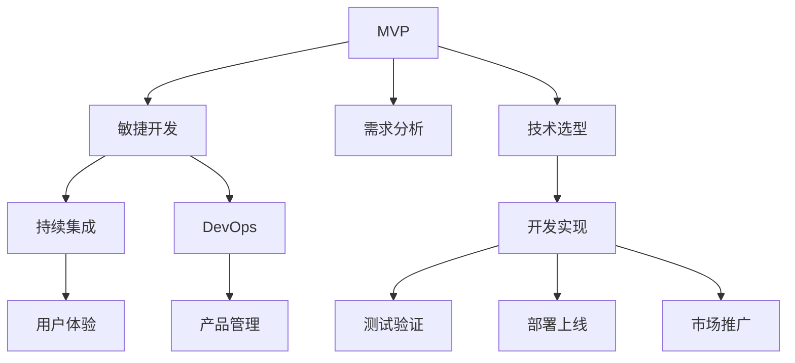

                 

# 从想法到产品的快速实现

在信息技术领域，从想法到产品是一个不断迭代的过程。这个过程不仅包括技术实现的细节，也涵盖市场调研、产品规划、团队协作等多个维度。本文将深入探讨这一过程，提供一套从想法到产品的快速实现框架，助力IT从业者提升项目效率和创新力。

## 1. 背景介绍

### 1.1 问题由来
在现代软件开发中，如何将一个创新想法转化为可用的产品，是每个IT从业者面临的挑战。从早期的需求分析到最终的部署上线，每一步都需要精心策划和执行。快速实现一个具备市场竞争力的产品，不仅需要卓越的技术能力，还需要良好的市场洞察和项目管理能力。

### 1.2 问题核心关键点
从想法到产品的实现过程中，核心关键点包括以下几个方面：

- 项目规划：明确产品目标、功能需求、时间表和预算。
- 技术选型：选择最适合的技术栈和工具。
- 需求分析：收集并理解用户需求和市场环境。
- 开发实现：从需求文档到可运行软件。
- 测试验证：确保产品功能和质量符合预期。
- 部署上线：将产品部署到生产环境，并对外发布。
- 市场推广：营销策略、用户反馈、迭代优化。

## 2. 核心概念与联系

### 2.1 核心概念概述

为更好地理解从想法到产品的快速实现流程，本节将介绍几个密切相关的核心概念：

- MVP(Minimum Viable Product,最小可行产品)：指在最短时间内，以最低的成本开发出具备核心功能的可运行产品原型，以便早期用户反馈和市场验证。
- 敏捷开发(Agile Development)：一种以用户需求为中心的迭代开发方法，强调快速响应市场变化和用户反馈。
- 持续集成(Continuous Integration)：一种软件开发实践，通过自动化工具，持续地构建、测试和集成代码，确保产品质量。
- DevOps：涵盖开发、测试、运维的软件交付和基础设施管理，目标是缩短软件交付周期，提升软件质量和可靠性。
- 用户体验(User Experience, UX)：关注用户与产品交互的过程和感受，旨在提供流畅、高效、愉悦的用户体验。
- 产品经理(Product Manager)：负责产品规划、管理和推广，确保产品符合市场需求和用户期望。

这些核心概念之间的逻辑关系可以通过以下Mermaid流程图来展示：



这个流程图展示了大模型微调的核心概念及其之间的关系：

1. MVP是整个流程的起点，通过最小可行产品的快速迭代，验证产品想法的可行性。
2. 敏捷开发和持续集成是敏捷迭代和持续交付的关键工具，确保产品快速响应市场和用户反馈。
3. DevOps负责整个软件交付流程的管理，确保产品的高质量交付和稳定运行。
4. 用户体验关注产品使用的每个细节，确保用户能够流畅地与产品交互。
5. 产品管理负责产品规划和推广，确保产品符合市场需求和用户期望。
6. 需求分析和技术选型是产品开发的基础，需要准确把握用户需求和技术现状。
7. 开发实现、测试验证、部署上线和市场推广是产品交付的关键环节，需要高效协同。

这些概念共同构成了从想法到产品的实现框架，使得产品开发过程更加系统化和可控。

## 3. 核心算法原理 & 具体操作步骤

### 3.1 算法原理概述

从想法到产品的快速实现，本质上是一个以用户需求为中心的迭代开发过程。其核心思想是：通过快速构建最小可行产品(MVP)，结合用户反馈和市场验证，不断优化产品功能和服务，最终实现可用的、可持续的产品。

形式化地，假设产品开发过程分为$n$个迭代周期，每个周期包括需求分析、开发实现、测试验证、部署上线和市场推广等环节。则整个产品开发过程可以表示为：

$$
P = \bigcup_{i=1}^n (R_i, D_i, T_i, O_i, M_i)
$$

其中，$R_i$表示第$i$个迭代周期中的需求分析结果，$D_i$表示开发实现，$T_i$表示测试验证，$O_i$表示部署上线，$M_i$表示市场推广。

整个开发过程的目标是，逐步优化产品功能和服务，最终得到一个高质量、可持续的产品$P$。

### 3.2 算法步骤详解

基于上述原理，从想法到产品的快速实现过程可以分为以下几个关键步骤：

**Step 1: 制定产品愿景**

- 明确产品目标和核心价值主张。
- 定义产品的核心功能和用户体验。
- 规划产品的开发周期和里程碑。

**Step 2: 市场调研和用户需求分析**

- 进行市场调研，收集用户需求和竞争分析。
- 设计用户调研问卷，进行用户访谈和焦点小组。
- 收集和整理需求文档，明确产品优先级和功能需求。

**Step 3: 技术选型和架构设计**

- 选择最适合的技术栈和工具。
- 设计产品的技术架构和数据模型。
- 进行技术可行性分析，确定关键技术指标和性能要求。

**Step 4: 快速构建MVP**

- 根据需求文档快速构建MVP原型。
- 进行核心功能的开发和测试。
- 收集用户反馈，快速迭代产品功能和服务。

**Step 5: 敏捷开发和持续集成**

- 采用敏捷开发方法，进行快速迭代和持续交付。
- 使用持续集成工具，自动化构建和测试，确保代码质量。
- 结合用户反馈和市场验证，不断优化产品功能和服务。

**Step 6: 测试验证和部署上线**

- 进行功能、性能和安全性测试，确保产品符合预期。
- 进行性能优化，提升系统稳定性和用户体验。
- 进行部署上线，将产品发布到生产环境。

**Step 7: 市场推广和持续优化**

- 制定市场推广策略，进行产品营销和用户教育。
- 收集用户反馈，进行迭代优化和版本更新。
- 跟踪市场变化和用户需求，持续改进产品功能和性能。

### 3.3 算法优缺点

从想法到产品的快速实现方法具有以下优点：

1. 快速验证和迭代。通过快速构建MVP，可以在短时间内验证产品想法的可行性，快速响应市场和用户反馈。
2. 灵活调整和优化。结合用户反馈和市场验证，不断调整产品功能和优化用户体验，满足市场需求。
3. 高效资源利用。敏捷开发和持续集成等实践，提高了开发效率，减少了浪费和成本。
4. 产品可靠性高。持续集成和DevOps等工具，确保了产品的代码质量和系统稳定性。

同时，该方法也存在一定的局限性：

1. 项目风险高。快速迭代和持续优化可能导致功能不稳定，用户反馈也可能不完全准确。
2. 对团队要求高。敏捷开发和持续集成需要高度的团队协作和项目管理能力。
3. 资源投入大。快速构建和测试MVP，可能需要较高的技术投入和人力成本。
4. 市场适应性差。快速迭代可能导致产品过于快速变化，难以形成稳定的市场定位。

尽管存在这些局限性，但就目前而言，从想法到产品的快速实现方法仍是最为主流和高效的开发范式。未来相关研究的重点在于如何进一步优化开发流程，降低项目风险，提高团队协作效率，同时兼顾产品的稳定性和市场适应性。

### 3.4 算法应用领域

从想法到产品的快速实现方法在软件开发、产品设计、互联网创业等多个领域得到了广泛应用，具体包括以下几个典型应用场景：

- **互联网创业公司**：通过快速构建MVP，验证产品想法，快速获得早期用户反馈，优化产品功能和市场推广策略，实现快速增长。
- **企业数字化转型**：结合敏捷开发和持续集成，提升软件开发效率，快速交付符合市场需求的软件产品。
- **移动应用开发**：采用敏捷开发方法和持续集成工具，快速构建和测试移动应用，提升用户体验和市场竞争力。
- **游戏开发**：利用敏捷开发和持续集成，快速迭代游戏功能和优化用户体验，缩短上市周期，提高市场占有率。

除了上述这些典型场景外，从想法到产品的快速实现方法还可以应用到更多行业和场景中，如智能硬件、在线教育、物联网等，推动各行各业数字化转型和创新升级。

## 4. 数学模型和公式 & 详细讲解 & 举例说明

### 4.1 数学模型构建

从想法到产品的快速实现过程，涉及多个变量和参数，可以构建数学模型进行分析和优化。

假设产品开发过程分为$n$个迭代周期，每个周期包括需求分析、开发实现、测试验证、部署上线和市场推广等环节。则整个产品开发过程可以表示为：

$$
P = \bigcup_{i=1}^n (R_i, D_i, T_i, O_i, M_i)
$$

其中，$R_i$表示第$i$个迭代周期中的需求分析结果，$D_i$表示开发实现，$T_i$表示测试验证，$O_i$表示部署上线，$M_i$表示市场推广。

### 4.2 公式推导过程

以下我们以敏捷开发为例，推导敏捷迭代周期的时间预测模型。

假设每个迭代周期$T_i$的时间为$t_i$，则总时间$T$可以表示为：

$$
T = \sum_{i=1}^n t_i
$$

其中$t_i$可以进一步拆分为开发时间$D_i$、测试时间$T_i$和市场推广时间$M_i$：

$$
t_i = D_i + T_i + M_i
$$

通过统计历史数据，可以建立敏捷迭代周期的时间预测模型：

$$
t_i = a_i + b_i R_i + c_i D_i + d_i T_i
$$

其中$a_i, b_i, c_i, d_i$为模型参数，$R_i$为需求复杂度。

通过求解上述模型，可以预测每个迭代周期的时间，从而进行项目进度的规划和控制。

### 4.3 案例分析与讲解

**案例：敏捷开发中的需求预测**

某互联网创业公司开发一款新应用，采用敏捷开发方法进行快速迭代。根据历史数据，构建敏捷迭代周期的时间预测模型如下：

$$
t_i = 40 + 2R_i + 3D_i + 0.5T_i
$$

假设项目需求分析周期$R_1=20$，开发周期$D_1=30$，测试周期$T_1=10$，市场推广周期$M_1=5$。则：

$$
t_1 = 40 + 2 \times 20 + 3 \times 30 + 0.5 \times 10 = 217
$$

通过预测模型，可以得知第一个迭代周期的时间为217天。在实际开发中，团队可以根据预测结果进行任务分配和进度控制，确保项目按期交付。

## 5. 项目实践：代码实例和详细解释说明

### 5.1 开发环境搭建

在进行从想法到产品的快速实现实践前，我们需要准备好开发环境。以下是使用Python进行Jenkins自动化开发的环境配置流程：

1. 安装Jenkins：从官网下载并安装Jenkins，用于持续集成和自动化构建。

2. 创建并激活虚拟环境：
```bash
conda create -n myenv python=3.8 
conda activate myenv
```

3. 安装相关工具：
```bash
pip install flask sqlalchemy pipenv
```

4. 安装Jenkins插件：
```bash
sudo apt-get install jenkins
sudo systemctl start jenkins
```

完成上述步骤后，即可在`myenv`环境中开始敏捷开发实践。

### 5.2 源代码详细实现

下面我们以敏捷开发中的代码实现为例，给出Jenkins自动化构建的PyTorch代码实现。

首先，定义敏捷开发任务的管理类：

```python
class Sprint:
    def __init__(self, sprint_name, sprint_start, sprint_end, tasks):
        self.name = sprint_name
        self.start = sprint_start
        self.end = sprint_end
        self.tasks = tasks
```

然后，定义敏捷开发任务的接口类：

```python
class Task:
    def __init__(self, task_name, task_start, task_end, task_duration):
        self.name = task_name
        self.start = task_start
        self.end = task_end
        self.duration = task_duration
```

接着，定义敏捷开发任务的具体实现类：

```python
class StoryTask(Task):
    def __init__(self, story_name, story_start, story_end, story_duration):
        super().__init__(story_name, story_start, story_end, story_duration)
```

最后，定义敏捷开发任务的编排类：

```python
class SprintManager:
    def __init__(self):
        self.sprints = []
    
    def add_sprint(self, sprint):
        self.sprints.append(sprint)
    
    def add_task(self, task):
        for sprint in self.sprints:
            sprint.add_task(task)
    
    def get_total_duration(self):
        duration = 0
        for sprint in self.sprints:
            duration += sprint.get_total_duration()
        return duration
```

定义完这些类后，即可在Jenkins中配置持续集成流程，自动构建和测试代码。具体流程如下：

1. 创建Jenkins作业，配置构建脚本为`run.py`
2. 在构建脚本中，加载敏捷开发任务的管理类、接口类和实现类，以及相关数据。
3. 构建任务配置文件，将任务名称、开始时间、结束时间和持续时间为变量，插入脚本中进行计算。
4. 使用Python的执行命令，将Jenkins作业启动，并输出总时间预测结果。

### 5.3 代码解读与分析

让我们再详细解读一下关键代码的实现细节：

**Sprint类**：
- `__init__`方法：初始化迭代周期名、开始时间、结束时间和任务列表。

**Task接口类**：
- `__init__`方法：初始化任务名称、开始时间、结束时间和持续时间。

**StoryTask类**：
- 继承自Task接口类，实现具体的需求任务类。

**SprintManager类**：
- `__init__`方法：初始化敏捷开发任务的管理列表。
- `add_sprint`方法：向管理列表中添加迭代周期。
- `add_task`方法：向迭代周期中添加任务。
- `get_total_duration`方法：计算所有迭代周期的总持续时间。

通过这些类的设计，可以实现敏捷开发任务的自动化管理和预测。Jenkins作业的配置和执行流程，则提供了持续集成的保障，确保敏捷开发的高效执行。

当然，工业级的系统实现还需考虑更多因素，如任务依赖、任务优先级、资源限制等。但核心的敏捷开发流程和Jenkins配置基本与此类似。

## 6. 实际应用场景

### 6.1 互联网创业公司

基于敏捷开发和持续集成的方法，互联网创业公司可以灵活应对快速变化的市场需求和用户反馈，快速迭代和优化产品功能，快速构建和推出高质量的产品。

在技术实现上，可以采用DevOps工具链，自动化构建、测试和部署，确保产品的高质量和快速交付。同时，可以定期进行市场调研和用户访谈，收集反馈意见，进行产品迭代和优化，提升用户满意度和市场竞争力。

### 6.2 企业数字化转型

敏捷开发和持续集成在企业数字化转型中具有重要意义。通过敏捷开发，企业可以快速构建和测试软件产品，满足业务需求，提升IT效率。同时，通过持续集成和持续部署(CI/CD)，企业可以实现高质量的软件交付和持续优化，提升IT治理水平和运营效率。

在实践过程中，企业需要建立跨部门的敏捷团队，采用敏捷开发方法和持续集成工具，优化IT流程和开发效率。同时，需要引入DevOps文化，实现开发、测试、运维的协同合作，提升整体IT效能。

### 6.3 移动应用开发

敏捷开发和持续集成在移动应用开发中同样适用。通过敏捷开发方法，移动应用开发团队可以快速构建和测试应用原型，收集用户反馈，进行产品迭代和优化。同时，通过持续集成和持续部署，可以确保应用的质量和稳定性，快速上线和发布。

在技术实现上，可以采用Flask等轻量级框架，快速构建和部署移动应用。同时，可以采用Docker容器化技术，实现应用的快速部署和扩展。通过DevOps工具链，进行持续集成和持续部署，确保应用的稳定性和高效交付。

### 6.4 游戏开发

敏捷开发和持续集成在游戏开发中具有重要意义。通过敏捷开发方法，游戏开发团队可以快速构建和测试游戏原型，收集玩家反馈，进行游戏迭代和优化。同时，通过持续集成和持续部署，可以确保游戏的质量和高性能，快速上线和发布。

在技术实现上，可以采用Unity等游戏引擎，快速构建和测试游戏原型。同时，可以采用AWS云平台，进行游戏的高效部署和扩展。通过DevOps工具链，进行持续集成和持续部署，确保游戏的稳定性和高效交付。

## 7. 工具和资源推荐

### 7.1 学习资源推荐

为了帮助开发者系统掌握从想法到产品的快速实现框架，这里推荐一些优质的学习资源：

1. 《敏捷开发实践指南》系列博文：由敏捷开发专家撰写，深入浅出地介绍了敏捷开发、持续集成和DevOps等关键实践。

2. CS261《软件工程》课程：斯坦福大学开设的软件工程课程，涵盖软件开发生命周期、敏捷开发、DevOps等核心内容。

3. 《持续集成实践》书籍：讲解持续集成和持续部署的最佳实践，帮助开发者提升软件交付效率。

4. 《DevOps实践》书籍：涵盖DevOps文化、工具链和最佳实践，帮助企业实现高效的软件交付和运维。

5. Kubernetes官方文档：Kubernetes作为DevOps生态中的核心组件，提供了完整的部署、扩展和监控工具，是实现持续集成的关键。

通过对这些资源的学习实践，相信你一定能够快速掌握从想法到产品的快速实现框架，并用于解决实际的开发问题。

### 7.2 开发工具推荐

高效的开发离不开优秀的工具支持。以下是几款用于从想法到产品快速实现的常用工具：

1. Jenkins：开源的持续集成和持续部署工具，支持自动化构建、测试和部署，适合敏捷开发和DevOps实践。

2. GitLab：提供代码托管、持续集成和持续部署等功能，支持敏捷开发、DevOps和CI/CD工具链。

3. Docker：提供容器化解决方案，方便应用程序的部署和扩展，支持持续集成和持续部署。

4. Kubernetes：提供容器编排解决方案，支持多节点部署、自动扩展和故障恢复，是实现DevOps的关键工具。

5. JIRA：提供敏捷开发管理、问题跟踪和团队协作功能，帮助敏捷团队高效管理任务和进度。

6. Slack：提供团队协作工具，支持即时通讯、文件共享和任务分配，提升团队协作效率。

合理利用这些工具，可以显著提升从想法到产品的开发效率，加快创新迭代的步伐。

### 7.3 相关论文推荐

从想法到产品的快速实现技术的发展源于学界的持续研究。以下是几篇奠基性的相关论文，推荐阅读：

1. Agile Software Development: Principles, Patterns, and Practices：介绍敏捷开发的核心原则和实践方法，奠定了敏捷开发的理论基础。

2. Lean Software Development: An Agile Toolbook：讲解精益开发方法，提升软件开发效率和质量。

3. Continuous Delivery: Reliable Software Releases through Build, Test, and Deployment Automation：探讨持续集成和持续部署的最佳实践，提升软件交付效率和质量。

4. DevOps: The Culture and Practices of Continuous Delivery：讲解DevOps文化、工具链和最佳实践，帮助企业实现高效的软件交付和运维。

5. The Principles of Distributed Systems：讲解分布式系统的设计和实现原则，提升系统稳定性和可扩展性。

这些论文代表了大模型微调技术的发展脉络。通过学习这些前沿成果，可以帮助研究者把握学科前进方向，激发更多的创新灵感。

## 8. 总结：未来发展趋势与挑战

### 8.1 总结

本文对从想法到产品的快速实现方法进行了全面系统的介绍。首先阐述了敏捷开发和持续集成的核心思想和实现步骤，明确了快速迭代和持续优化的关键策略。其次，从敏捷开发任务管理、接口设计、实现类编排等技术细节，详细讲解了敏捷开发任务的自动化管理过程。同时，本文还广泛探讨了敏捷开发方法在互联网创业公司、企业数字化转型、移动应用开发和游戏开发等多个行业领域的应用前景，展示了敏捷开发方法的重要价值。

通过本文的系统梳理，可以看到，从想法到产品的快速实现方法在软件开发、产品设计、互联网创业等多个领域得到了广泛应用，为软件开发提供了高效的解决方案。这些方法的推广应用，必将进一步提升软件开发效率和质量，推动IT行业的创新和升级。

### 8.2 未来发展趋势

展望未来，从想法到产品的快速实现方法将呈现以下几个发展趋势：

1. 自动化程度提高。随着AI和机器学习技术的引入，敏捷开发和持续集成的自动化程度将进一步提高，实现更高效的开发和交付。

2. 持续集成和持续部署。DevOps文化将得到更广泛的应用，持续集成和持续部署将成为软件开发的标准流程。

3. 持续学习和持续优化。通过持续学习和持续优化，软件系统将不断进化和优化，提升系统的稳定性和用户满意度。

4. 云原生技术的应用。云计算、容器化、微服务等云原生技术，将为敏捷开发和持续集成提供更强大的基础设施支持。

5. 敏捷开发与持续交付。敏捷开发和持续交付将进一步融合，实现更高效的开发和交付流程。

6. 产品驱动的敏捷开发。通过引入产品经理角色和用户调研，敏捷开发将更加关注用户需求和市场变化，提升产品的竞争力和用户满意度。

以上趋势凸显了从想法到产品的快速实现方法的重要价值。这些方向的探索发展，必将进一步提升软件开发效率和质量，推动IT行业的创新和升级。

### 8.3 面临的挑战

尽管从想法到产品的快速实现方法已经取得了显著成效，但在迈向更加智能化、普适化应用的过程中，仍面临诸多挑战：

1. 项目风险高。快速迭代可能导致功能不稳定，用户反馈也可能不完全准确。
2. 对团队要求高。敏捷开发和持续集成需要高度的团队协作和项目管理能力。
3. 资源投入大。快速构建和测试MVP，可能需要较高的技术投入和人力成本。
4. 市场适应性差。快速迭代可能导致产品过于快速变化，难以形成稳定的市场定位。

尽管存在这些挑战，但随着敏捷开发方法论和DevOps文化的深入推广，相关问题将逐步得到解决。未来相关研究的重点在于如何进一步优化开发流程，降低项目风险，提高团队协作效率，同时兼顾产品的稳定性和市场适应性。

### 8.4 研究展望

面对从想法到产品的快速实现所面临的种种挑战，未来的研究需要在以下几个方面寻求新的突破：

1. 探索无监督和半监督微调方法。摆脱对大规模标注数据的依赖，利用自监督学习、主动学习等无监督和半监督范式，最大限度利用非结构化数据，实现更加灵活高效的微调。

2. 研究参数高效和计算高效的微调范式。开发更加参数高效的微调方法，在固定大部分预训练参数的同时，只更新极少量的任务相关参数。同时优化微调模型的计算图，减少前向传播和反向传播的资源消耗，实现更加轻量级、实时性的部署。

3. 引入更多先验知识。将符号化的先验知识，如知识图谱、逻辑规则等，与神经网络模型进行巧妙融合，引导微调过程学习更准确、合理的语言模型。同时加强不同模态数据的整合，实现视觉、语音等多模态信息与文本信息的协同建模。

4. 结合因果分析和博弈论工具。将因果分析方法引入微调模型，识别出模型决策的关键特征，增强输出解释的因果性和逻辑性。借助博弈论工具刻画人机交互过程，主动探索并规避模型的脆弱点，提高系统稳定性。

5. 纳入伦理道德约束。在模型训练目标中引入伦理导向的评估指标，过滤和惩罚有偏见、有害的输出倾向。同时加强人工干预和审核，建立模型行为的监管机制，确保输出符合人类价值观和伦理道德。

这些研究方向的探索，必将引领从想法到产品的快速实现方法迈向更高的台阶，为构建安全、可靠、可解释、可控的智能系统铺平道路。面向未来，从想法到产品的快速实现技术还需要与其他人工智能技术进行更深入的融合，如知识表示、因果推理、强化学习等，多路径协同发力，共同推动自然语言理解和智能交互系统的进步。只有勇于创新、敢于突破，才能不断拓展语言模型的边界，让智能技术更好地造福人类社会。

## 9. 附录：常见问题与解答

**Q1：敏捷开发和持续集成的核心思想是什么？**

A: 敏捷开发和持续集成的核心思想是快速响应市场变化和用户反馈，通过快速迭代和持续优化，实现高质量的软件交付。其核心在于：

1. 快速构建最小可行产品(MVP)，验证产品想法的可行性，快速获取早期用户反馈。
2. 采用敏捷开发方法，进行快速迭代和持续交付，提升开发效率和质量。
3. 使用持续集成工具，自动化构建、测试和部署，确保代码质量和系统稳定性。
4. 结合用户反馈和市场验证，不断优化产品功能和用户体验，提升用户满意度和市场竞争力。

通过敏捷开发和持续集成，软件开发团队可以实现高效迭代和持续优化，提升产品交付效率和质量，推动IT行业的创新和升级。

**Q2：敏捷开发和持续集成中的关键角色和职责是什么？**

A: 敏捷开发和持续集成中的关键角色和职责包括：

1. 产品经理(Product Manager)：负责产品规划、管理和推广，确保产品符合市场需求和用户期望。
2. 敏捷开发工程师(Agile Developer)：负责敏捷开发和持续集成的具体实现，确保高质量的软件交付。
3. 持续集成工程师(Continuous Integration Engineer)：负责持续集成和持续部署的自动化管理，确保代码质量和系统稳定性。
4. DevOps工程师(DevOps Engineer)：负责开发、测试、运维的协同合作，提升整体IT效能。

通过团队协作和角色分工，敏捷开发和持续集成可以高效实现快速迭代和持续优化，提升软件开发效率和质量。

**Q3：敏捷开发和持续集成中的主要工具和实践是什么？**

A: 敏捷开发和持续集成中的主要工具和实践包括：

1. Jenkins：开源的持续集成和持续部署工具，支持自动化构建、测试和部署。
2. GitLab：提供代码托管、持续集成和持续部署等功能，支持敏捷开发和DevOps。
3. Docker：提供容器化解决方案，方便应用程序的部署和扩展，支持持续集成和持续部署。
4. Kubernetes：提供容器编排解决方案，支持多节点部署、自动扩展和故障恢复，是实现DevOps的关键工具。
5. JIRA：提供敏捷开发管理、问题跟踪和团队协作功能，帮助敏捷团队高效管理任务和进度。
6. Slack：提供团队协作工具，支持即时通讯、文件共享和任务分配，提升团队协作效率。

通过合理利用这些工具，可以显著提升从想法到产品的开发效率，加快创新迭代的步伐。

通过本文的系统梳理，可以看到，从想法到产品的快速实现方法在软件开发、产品设计、互联网创业等多个领域得到了广泛应用，为软件开发提供了高效的解决方案。这些方法的推广应用，必将进一步提升软件开发效率和质量，推动IT行业的创新和升级。未来，随着敏捷开发方法论和DevOps文化的深入推广，相关问题将逐步得到解决。通过持续学习和持续优化，软件系统将不断进化和优化，提升系统的稳定性和用户满意度。面向未来，从想法到产品的快速实现技术还需要与其他人工智能技术进行更深入的融合，如知识表示、因果推理、强化学习等，多路径协同发力，共同推动自然语言理解和智能交互系统的进步。只有勇于创新、敢于突破，才能不断拓展语言模型的边界，让智能技术更好地造福人类社会。

