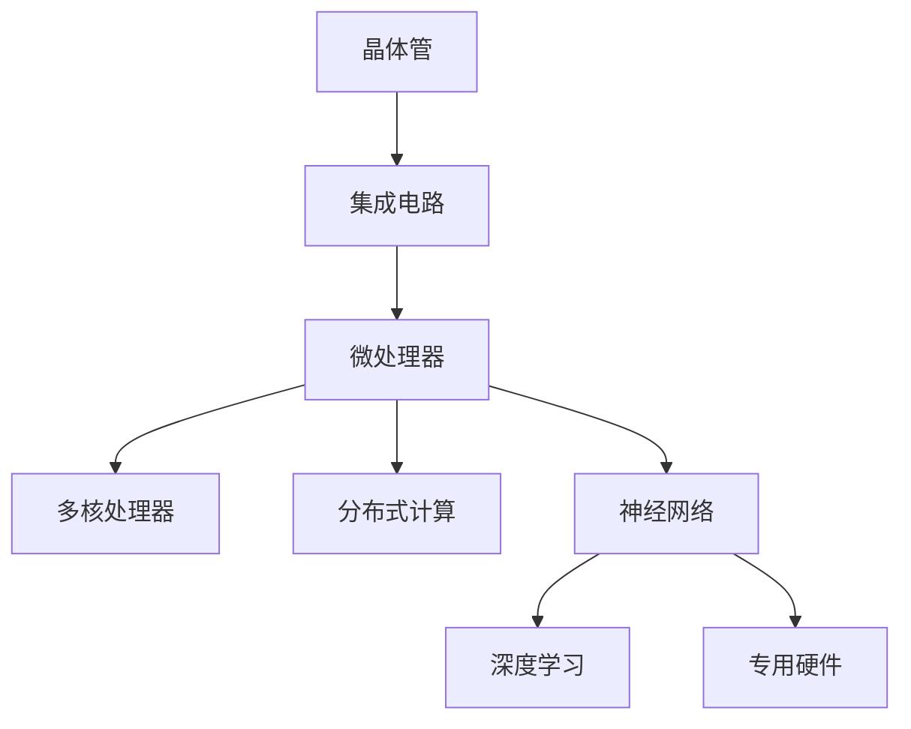
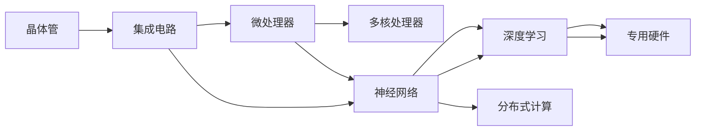

                 

# 从晶体管到神经网络：计算架构的进化

## 1. 背景介绍

在电子计算机发展的历程中，计算架构经历了从晶体管到神经网络的显著转变。这一转变不仅标志着计算方式和计算能力的巨大飞跃，也深刻影响了计算机系统的设计理念和应用模式。

### 1.1 计算架构的发展历史

#### 1.1.1 早期计算机与晶体管

早期的计算机，如ENIAC和UNIVAC，主要依赖于真空管作为电子元件。这些计算机体积庞大、耗电高，计算速度有限，主要用于军事和科学研究。晶体管的问世，使得计算机设计更加小型化、高效化，为后来的计算机发展奠定了基础。

#### 1.1.2 集成电路与微处理器

集成电路技术的发展使得多个电子元件被集成在单个芯片上，极大地提高了计算机的集成度和计算效率。微处理器的出现，更是将中央处理器(CPU)、存储器和输入输出单元等关键组件集成在一起，形成了现代计算机的基本架构。

#### 1.1.3 多核与分布式计算

随着计算需求的增加，多核处理器和分布式计算架构应运而生。多核处理器通过将多个计算核心集成在一个芯片上，提高了计算并行性，提升了处理能力。分布式计算则通过将计算任务分配到多台计算机上进行并行处理，进一步拓展了计算资源的边界。

### 1.2 神经网络与计算架构的革命

随着深度学习和人工智能的兴起，神经网络成为计算架构的下一个重要发展方向。神经网络通过模拟人脑的神经元网络结构，实现对复杂数据的高效处理和智能化决策。

#### 1.2.1 深度学习的兴起

深度学习的兴起，源于神经网络在图像识别、语音识别等领域的突破性应用。深度学习模型通过多层非线性变换，学习到数据的高级抽象特征，显著提高了模型在复杂任务上的表现。

#### 1.2.2 神经网络与传统计算架构的融合

神经网络与传统计算架构的融合，催生了新型计算架构的诞生。例如，GPU、FPGA和TPU等专用硬件设备，通过优化神经网络计算过程，显著提升了神经网络的训练和推理速度。

## 2. 核心概念与联系

### 2.1 核心概念概述

本节将介绍几个与计算架构进化密切相关的核心概念：

- **晶体管**：作为现代计算机的基本构建单元，晶体管实现了电子信号的开关，奠定了计算机硬件的基础。
- **集成电路**：将多个晶体管集成在一个芯片上，形成了集成电路，推动了计算机的小型化和智能化。
- **微处理器**：将中央处理器(CPU)、存储器和输入输出单元集成在一起，形成了现代计算机的基本架构。
- **多核处理器**：在单个芯片上集成多个计算核心，提高了计算机的计算并行性。
- **分布式计算**：将计算任务分配到多台计算机上进行并行处理，拓展了计算资源的边界。
- **神经网络**：模拟人脑的神经元网络结构，实现对复杂数据的高效处理和智能化决策。
- **深度学习**：基于神经网络的高级学习模型，通过多层非线性变换，学习数据的高级抽象特征。
- **专用硬件**：如GPU、FPGA和TPU，通过优化神经网络计算过程，显著提升了神经网络的训练和推理速度。

这些概念之间的逻辑关系可以通过以下Mermaid流程图来展示：



这个流程图展示了一系列计算架构的演进步骤：

1. 晶体管作为基本构建单元，推动了集成电路技术的发展。
2. 集成电路使得微处理器成为可能，形成了现代计算机的基本架构。
3. 微处理器进一步演进为多核处理器，提高了计算并行性。
4. 分布式计算拓展了计算资源的边界。
5. 神经网络通过模拟人脑的神经元网络结构，实现了对复杂数据的高级处理。
6. 深度学习基于神经网络的高级学习模型，提升了模型在复杂任务上的表现。
7. 专用硬件通过优化神经网络计算过程，进一步提升了神经网络的性能。

这些概念共同构成了现代计算架构的演进脉络，推动了计算能力的不断提升。

### 2.2 核心概念原理和架构的 Mermaid 流程图

为了更直观地展示这些概念之间的联系，我们通过Mermaid绘制了它们之间的架构图。



这个图展示了从晶体管到专用硬件的整个计算架构演进路径，以及神经网络和深度学习在这一路径中的关键作用。

## 3. 核心算法原理 & 具体操作步骤

### 3.1 算法原理概述

神经网络作为计算架构的重要组成部分，其核心算法原理在于通过多层非线性变换，学习数据的高级抽象特征。以下是神经网络的基本工作原理：

1. **前向传播**：将输入数据通过一系列线性变换和非线性激活函数，逐步计算得到输出。
2. **反向传播**：通过计算输出与真实标签之间的误差，反向传播误差到每一层，更新网络参数。
3. **梯度下降**：使用梯度下降算法最小化损失函数，优化网络参数，使输出尽可能接近真实标签。

深度学习的关键在于，通过堆叠多个非线性层，可以学习到数据的复杂抽象特征。每个非线性层可以看作是数据的非线性映射，通过多层组合，可以实现对复杂输入数据的有效建模。

### 3.2 算法步骤详解

神经网络的具体实现步骤如下：

1. **数据预处理**：将原始数据转换为神经网络所需的格式，如归一化、标准化、数据增强等。
2. **模型定义**：使用神经网络框架（如TensorFlow、PyTorch等）定义模型结构，包括输入层、隐藏层、输出层等。
3. **模型训练**：使用训练数据集，通过前向传播和反向传播，更新模型参数，最小化损失函数。
4. **模型评估**：使用验证数据集评估模型性能，调整超参数，优化模型结构。
5. **模型部署**：将训练好的模型部署到目标环境中，进行推理预测。

### 3.3 算法优缺点

神经网络在计算架构中具有以下优点：

1. **自适应性**：通过反向传播和梯度下降，神经网络可以自动调整模型参数，适应不同任务需求。
2. **非线性建模**：多层非线性变换使得神经网络可以学习到数据的复杂特征，提升模型精度。
3. **高效并行**：多核处理器和分布式计算架构使得神经网络的并行计算成为可能，大大提升了训练和推理速度。

同时，神经网络也存在一些缺点：

1. **计算资源需求高**：神经网络参数量庞大，训练和推理过程需要大量计算资源。
2. **过拟合风险高**：神经网络模型容易在训练数据上过拟合，导致泛化能力不足。
3. **可解释性差**：神经网络模型通常被视为“黑盒”，难以解释其内部工作机制和决策过程。

### 3.4 算法应用领域

神经网络已经在多个领域取得了显著应用：

1. **计算机视觉**：图像识别、目标检测、人脸识别等任务。
2. **自然语言处理**：文本分类、情感分析、机器翻译等任务。
3. **语音识别**：语音转文字、语音合成等任务。
4. **医疗诊断**：医学图像分析、疾病预测等任务。
5. **自动驾驶**：环境感知、决策规划等任务。
6. **游戏AI**：策略规划、路径优化等任务。

## 4. 数学模型和公式 & 详细讲解 & 举例说明

### 4.1 数学模型构建

神经网络的核心数学模型可以表示为：

$$
y = W_n \sigma(W_{n-1} \sigma(... \sigma(W_1 x + b_1) + b_2) + b_n)
$$

其中，$x$ 为输入，$y$ 为输出，$W_i$ 和 $b_i$ 为层$i$的权重和偏置，$\sigma$ 为激活函数。

### 4.2 公式推导过程

以单层神经网络为例，推导其前向传播和反向传播过程。

#### 4.2.1 前向传播

输入 $x$ 经过权重矩阵 $W$ 和偏置向量 $b$ 的线性变换，得到：

$$
z = Wx + b
$$

然后，通过激活函数 $\sigma$ 计算输出 $y$：

$$
y = \sigma(z)
$$

其中，$\sigma$ 可以是 sigmoid、ReLU 等激活函数。

#### 4.2.2 反向传播

假设输出 $y$ 与真实标签 $t$ 的误差为 $e$，通过链式法则计算误差对每个参数的梯度：

$$
\frac{\partial e}{\partial z} = \frac{\partial e}{\partial y} \frac{\partial y}{\partial z}
$$

其中，$\frac{\partial y}{\partial z}$ 可以通过链式法则递归计算得到。

通过反向传播，可以得到每个参数的梯度：

$$
\frac{\partial e}{\partial W} = \frac{\partial e}{\partial z} \frac{\partial z}{\partial W}
$$

$$
\frac{\partial e}{\partial b} = \frac{\partial e}{\partial z} \frac{\partial z}{\partial b}
$$

将梯度代入损失函数 $L$，通过梯度下降算法更新参数：

$$
W \leftarrow W - \eta \frac{\partial L}{\partial W}
$$

$$
b \leftarrow b - \eta \frac{\partial L}{\partial b}
$$

### 4.3 案例分析与讲解

以手写数字识别任务为例，展示神经网络的工作原理和计算过程。

1. **数据预处理**：将手写数字图像归一化、灰度化、裁剪等，转换为神经网络所需的格式。
2. **模型定义**：使用卷积神经网络（CNN），定义多层卷积层、池化层和全连接层，构建神经网络模型。
3. **模型训练**：使用训练数据集，通过前向传播和反向传播，更新模型参数，最小化损失函数。
4. **模型评估**：使用验证数据集评估模型性能，调整超参数，优化模型结构。
5. **模型部署**：将训练好的模型部署到目标环境中，进行推理预测。

## 5. 项目实践：代码实例和详细解释说明

### 5.1 开发环境搭建

在进行神经网络项目开发前，需要准备以下开发环境：

1. 安装Python：从官网下载并安装Python，创建虚拟环境进行开发。
2. 安装相关库：安装TensorFlow、PyTorch、Keras等深度学习框架。
3. 准备数据集：下载手写数字数据集 MNIST，进行预处理和归一化。
4. 配置 GPU/TPU：在支持硬件设备的环境中进行训练，可以显著提升训练速度。

### 5.2 源代码详细实现

以下是一个简单的手写数字识别任务的神经网络代码实现：

```python
import tensorflow as tf
from tensorflow.keras import layers, models

# 定义模型
model = models.Sequential([
    layers.Conv2D(32, (3, 3), activation='relu', input_shape=(28, 28, 1)),
    layers.MaxPooling2D((2, 2)),
    layers.Conv2D(64, (3, 3), activation='relu'),
    layers.MaxPooling2D((2, 2)),
    layers.Conv2D(64, (3, 3), activation='relu'),
    layers.Flatten(),
    layers.Dense(64, activation='relu'),
    layers.Dense(10, activation='softmax')
])

# 编译模型
model.compile(optimizer='adam',
              loss='sparse_categorical_crossentropy',
              metrics=['accuracy'])

# 加载数据集
(x_train, y_train), (x_test, y_test) = tf.keras.datasets.mnist.load_data()

# 数据预处理
x_train = x_train.reshape(-1, 28, 28, 1).astype('float32') / 255.0
x_test = x_test.reshape(-1, 28, 28, 1).astype('float32') / 255.0

# 训练模型
model.fit(x_train, y_train, epochs=10, validation_data=(x_test, y_test))
```

### 5.3 代码解读与分析

**模型定义**：

- `Sequential`：按照顺序堆叠多个层，形成神经网络模型。
- `Conv2D`：二维卷积层，用于提取图像特征。
- `MaxPooling2D`：最大池化层，用于降维。
- `Flatten`：将多维数据展平为一维向量。
- `Dense`：全连接层，用于分类。

**编译模型**：

- `optimizer`：选择优化算法，如 Adam。
- `loss`：定义损失函数，如交叉熵损失。
- `metrics`：定义评估指标，如准确率。

**数据加载与预处理**：

- `mnist.load_data()`：加载 MNIST 数据集。
- `reshape`：将二维图像数据转换为三维张量。
- `astype`：将数据转换为浮点数。
- `train`：训练集。
- `test`：测试集。

**训练模型**：

- `fit`：训练模型，指定训练集、测试集、迭代次数等参数。
- `epochs`：迭代次数。
- `validation_data`：验证集。

## 6. 实际应用场景

### 6.1 计算机视觉

#### 6.1.1 图像识别

神经网络在图像识别任务上取得了显著成功，如分类、检测、分割等。例如，ImageNet 图像分类比赛中，神经网络模型已经超越了人类专家的表现。

#### 6.1.2 人脸识别

人脸识别技术通过神经网络实现了高精度的面部特征提取和匹配，广泛应用于安全监控、身份验证等领域。

### 6.2 自然语言处理

#### 6.2.1 文本分类

神经网络模型可以学习文本的高级抽象特征，用于文本分类任务，如情感分析、主题分类等。

#### 6.2.2 机器翻译

神经网络模型通过学习源语言和目标语言之间的映射关系，实现了高质量的机器翻译。

### 6.3 语音识别

#### 6.3.1 语音转文字

神经网络模型通过学习语音和文本之间的映射关系，实现了高精度的语音转文字。

#### 6.3.2 语音合成

神经网络模型通过学习文本和语音之间的映射关系，实现了高自然的语音合成。

### 6.4 医疗诊断

#### 6.4.1 医学图像分析

神经网络模型通过学习医学图像的特征，实现了高精度的图像分析和疾病预测。

#### 6.4.2 电子病历分析

神经网络模型通过学习电子病历中的文本数据，实现了高精度的疾病诊断和治疗方案推荐。

### 6.5 自动驾驶

#### 6.5.1 环境感知

神经网络模型通过学习环境中的传感器数据，实现了高精度的环境感知和目标检测。

#### 6.5.2 路径规划

神经网络模型通过学习历史驾驶数据，实现了高效的路径规划和决策。

### 6.6 游戏AI

#### 6.6.1 策略规划

神经网络模型通过学习游戏规则和历史数据，实现了高效的策略规划和决策。

#### 6.6.2 路径优化

神经网络模型通过学习游戏场景中的物理和规则，实现了高效的路径优化和动作选择。

## 7. 工具和资源推荐

### 7.1 学习资源推荐

为了帮助开发者系统掌握神经网络的相关知识，这里推荐一些优质的学习资源：

1. 《深度学习》书籍：由 Ian Goodfellow、Yoshua Bengio 和 Aaron Courville 所著，全面介绍了深度学习的原理和应用。
2. CS231n《深度学习与计算机视觉》课程：斯坦福大学开设的计算机视觉课程，有视频讲座和配套作业，是进入计算机视觉领域的重要起点。
3. CS224n《深度学习与自然语言处理》课程：斯坦福大学开设的自然语言处理课程，有视频讲座和配套作业，是进入自然语言处理领域的重要起点。
4. Kaggle 平台：提供大量的数据集和比赛，可以帮助开发者进行深度学习项目实践。
5. PyTorch 官方文档：PyTorch 的官方文档，提供了丰富的教程和样例代码，是进入深度学习领域的重要工具。

通过对这些资源的学习实践，相信你一定能够快速掌握神经网络的理论基础和实践技巧。

### 7.2 开发工具推荐

高效的深度学习开发离不开优秀的工具支持。以下是几款常用的深度学习开发工具：

1. PyTorch：由 Facebook 开发，支持动态图和静态图，灵活性高，适合快速迭代研究。
2. TensorFlow：由 Google 开发，支持大规模工程应用，生产部署方便。
3. Keras：高层次的深度学习框架，提供了丰富的 API 接口，易于上手。
4. MXNet：由 Apache 开源，支持多种语言和分布式计算，性能优异。
5. JAX：由 Google 开发，支持自动微分和 JIT 编译，性能高。
6. TensorBoard：TensorFlow 的可视化工具，可以实时监测模型训练状态，提供丰富的图表。
7. Weights & Biases：模型训练的实验跟踪工具，可以记录和可视化模型训练过程中的各项指标。

合理利用这些工具，可以显著提升深度学习项目的开发效率，加快创新迭代的步伐。

### 7.3 相关论文推荐

神经网络的发展离不开学界的持续研究。以下是几篇奠基性的相关论文，推荐阅读：

1. "A Few Useful Things to Know About Neural Network Training"（神经网络训练的几件有用的事情）：由 Ian Goodfellow 等所著，系统介绍了深度学习模型的训练技巧和优化方法。
2. "ImageNet Classification with Deep Convolutional Neural Networks"（使用深度卷积神经网络进行 ImageNet 分类）：由 Alex Krizhevsky、Ilya Sutskever 和 Geoffrey Hinton 等所著，展示了深度卷积神经网络在 ImageNet 图像分类中的突破性表现。
3. "Attention is All You Need"（注意力是你的全部）：由 Ashish Vaswani 等所著，提出了 Transformer 结构，开启了 NLP 领域的预训练大模型时代。
4. "BERT: Pre-training of Deep Bidirectional Transformers for Language Understanding"（BERT: 使用双向深度Transformer进行语言理解预训练）：由 Jacob Devlin、Ming-Wei Chang 等所著，提出BERT模型，引入基于掩码的自监督预训练任务，刷新了多项NLP任务SOTA。
5. "Natural Language Processing with Transformers"（使用Transformer进行自然语言处理）：由 Thomas Wolf 等所著，全面介绍了使用Transformer进行NLP任务开发的方法和技巧。

这些论文代表了大神经网络发展的主要方向，通过学习这些前沿成果，可以帮助研究者把握学科前进方向，激发更多的创新灵感。

## 8. 总结：未来发展趋势与挑战

### 8.1 研究成果总结

神经网络作为现代计算架构的重要组成部分，已经在计算机视觉、自然语言处理、语音识别等多个领域取得了显著应用。通过多层非线性变换，神经网络可以学习到数据的高级抽象特征，提升了模型的性能和应用范围。

### 8.2 未来发展趋势

展望未来，神经网络的发展将呈现以下几个趋势：

1. **模型规模增大**：随着计算资源的不断增加，神经网络模型将朝着更大规模发展，以提升计算能力和性能。
2. **计算架构演进**：神经网络将与传统计算架构进一步融合，形成更加高效、灵活的计算架构。
3. **跨模态融合**：神经网络将与其他模态数据（如视觉、语音、文本）进行融合，实现多模态信息的协同建模。
4. **自监督学习**：通过自监督学习，神经网络可以在无标签数据上学习特征，进一步提升模型的泛化能力和性能。
5. **知识图谱**：神经网络将与知识图谱结合，学习到更加结构化的知识表示，提升模型在复杂任务上的表现。
6. **对抗训练**：通过对抗训练，神经网络将提升鲁棒性和安全性，避免在对抗样本下的攻击。

### 8.3 面临的挑战

尽管神经网络已经取得了显著的进展，但在迈向更加智能化、普适化应用的过程中，它仍面临着诸多挑战：

1. **计算资源需求高**：神经网络模型参数量庞大，训练和推理过程需要大量计算资源。
2. **过拟合风险高**：神经网络模型容易在训练数据上过拟合，导致泛化能力不足。
3. **可解释性差**：神经网络模型通常被视为“黑盒”，难以解释其内部工作机制和决策过程。
4. **安全性和可靠性**：神经网络模型可能存在偏见和漏洞，需要进一步加强安全性和可靠性保障。
5. **跨模态融合复杂**：神经网络模型与其他模态数据的融合，需要解决数据格式、特征表示等问题，技术难度高。

### 8.4 研究展望

面对神经网络面临的这些挑战，未来的研究需要在以下几个方面寻求新的突破：

1. **知识表示**：将符号化的知识表示与神经网络结合，提升模型在复杂任务上的表现。
2. **多模态融合**：解决跨模态数据融合的技术问题，实现多模态信息的协同建模。
3. **自监督学习**：探索无监督和半监督学习范式，利用非结构化数据进行模型训练。
4. **对抗训练**：引入对抗训练技术，提升神经网络模型的鲁棒性和安全性。
5. **模型压缩**：通过模型压缩、稀疏化等技术，减少神经网络模型的计算量和存储空间。
6. **可解释性**：开发可解释性强的模型架构和算法，提升模型的透明度和可信度。

这些研究方向将推动神经网络向更高阶的智能化发展，为构建更加智能、安全的计算系统奠定基础。总之，神经网络的发展前景广阔，但也需要不断克服各种挑战，才能实现更加普适化、智能化的应用。

## 9. 附录：常见问题与解答

### 9.1 Q1: 神经网络在实际应用中面临哪些挑战？

A1: 神经网络在实际应用中面临以下挑战：

1. **计算资源需求高**：神经网络模型参数量庞大，训练和推理过程需要大量计算资源。
2. **过拟合风险高**：神经网络模型容易在训练数据上过拟合，导致泛化能力不足。
3. **可解释性差**：神经网络模型通常被视为“黑盒”，难以解释其内部工作机制和决策过程。
4. **安全性和可靠性**：神经网络模型可能存在偏见和漏洞，需要进一步加强安全性和可靠性保障。
5. **跨模态融合复杂**：神经网络模型与其他模态数据的融合，需要解决数据格式、特征表示等问题，技术难度高。

### 9.2 Q2: 神经网络与传统计算架构有何不同？

A2: 神经网络与传统计算架构有以下不同：

1. **数据处理方式**：神经网络通过多层非线性变换，学习数据的高级抽象特征，而传统计算架构主要依赖线性变换和逻辑运算。
2. **并行处理能力**：神经网络具有高并行处理能力，可以通过多核处理器和分布式计算加速训练和推理，而传统计算架构的并行处理能力有限。
3. **适应能力**：神经网络可以通过反向传播和梯度下降自动调整模型参数，适应不同任务需求，而传统计算架构需要手动编写程序逻辑。

### 9.3 Q3: 什么是深度学习？

A3: 深度学习是指使用多层神经网络模型进行学习的一种机器学习方法。它通过多层非线性变换，学习数据的高级抽象特征，提升了模型在复杂任务上的表现。深度学习已经在图像识别、语音识别、自然语言处理等多个领域取得了显著应用。

### 9.4 Q4: 什么是自监督学习？

A4: 自监督学习是指在没有标注数据的情况下，通过数据的内在结构进行学习的一种学习方法。例如，在图像领域，通过数据增强、预训练等技术，学习到图像的高级特征表示，提升了模型在未标注数据上的性能。

### 9.5 Q5: 什么是对抗训练？

A5: 对抗训练是指通过在训练数据中添加对抗样本，提升模型鲁棒性的一种方法。对抗样本是指在原始样本上加上微小的扰动，使模型无法正确识别原始样本。通过对抗训练，可以增强模型在对抗样本下的鲁棒性和安全性。

---

作者：禅与计算机程序设计艺术 / Zen and the Art of Computer Programming

