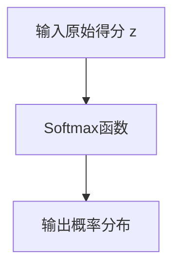

                 

# 从零开始大模型开发与微调：Python代码小练习：计算Softmax函数

> 关键词：大模型开发,微调,Softmax函数,Python,深度学习

## 1. 背景介绍

### 1.1 问题由来

在深度学习中，Softmax函数是一种常用的激活函数，常用于多分类问题的输出层。在基于大模型的微调过程中，Softmax函数也是不可或缺的一部分。计算Softmax函数的基本原理和实现方法，是理解深度学习模型的重要基础。

### 1.2 问题核心关键点

- **Softmax函数**：将原始得分转化为概率分布，用于多分类问题。
- **深度学习模型**：基于大模型的微调，需计算Softmax函数。
- **Python代码实现**：从零开始，实现Softmax函数的计算。
- **核心算法原理**：Softmax函数的数学原理。
- **实际应用场景**：在多分类任务中的具体应用。

### 1.3 问题研究意义

- **理解深度学习**：掌握Softmax函数的基本原理，有助于理解深度学习模型的训练和推理过程。
- **实现代码能力**：通过实际编程练习，提高Python代码的实现能力。
- **理论联系实际**：通过具体的代码实现，巩固理论知识，提升应用能力。

## 2. 核心概念与联系

### 2.1 核心概念概述

**Softmax函数**：一种将原始得分转化为概率分布的函数，常用于多分类问题的输出层。数学形式为：

$$
\sigma(z)_j = \frac{e^{z_j}}{\sum_{k=1}^K e^{z_k}}
$$

其中 $z$ 是原始得分向量，$K$ 是类别数，$j$ 是当前类别编号。

**深度学习模型**：基于大模型的微调过程中，需要计算Softmax函数。例如，在BERT模型微调时，输出层常使用Softmax函数进行多分类。

**Python代码实现**：本文将从零开始，使用Python实现Softmax函数的计算。

**核心算法原理**：Softmax函数的数学原理和实现方法。

**实际应用场景**：Softmax函数在多分类任务中的应用。

### 2.2 核心概念原理和架构的 Mermaid 流程图



这个流程图展示了Softmax函数的基本原理：将原始得分向量 $z$ 转化为概率分布。

## 3. 核心算法原理 & 具体操作步骤

### 3.1 算法原理概述

Softmax函数的核心原理是将原始得分向量转化为概率分布。具体来说，Softmax函数对每个原始得分进行指数运算，然后对所有得分求和，最后将每个得分除以总和，得到对应类别的概率。

### 3.2 算法步骤详解

#### 3.2.1 输入原始得分向量 $z$
首先，我们需要一个原始得分向量 $z = (z_1, z_2, ..., z_K)$，其中 $z_k$ 是第 $k$ 个类别的得分。

#### 3.2.2 计算指数得分
接着，对每个得分 $z_k$ 进行指数运算，得到新的向量 $e^z = (e^{z_1}, e^{z_2}, ..., e^{z_K})$。

#### 3.2.3 计算概率分布
然后，将 $e^z$ 每个元素除以总和 $\sum_{k=1}^K e^{z_k}$，得到概率分布 $\sigma(z) = (\sigma(z)_1, \sigma(z)_2, ..., \sigma(z)_K)$。

### 3.3 算法优缺点

#### 3.3.1 优点
- **转换直观**：将原始得分转化为概率分布，直观表达每个类别的预测概率。
- **输出归一化**：概率分布的总和为1，满足概率的基本要求。

#### 3.3.2 缺点
- **数值稳定性问题**：指数运算可能导致数值溢出或下溢，影响计算结果的准确性。
- **计算复杂度高**：指数运算和除法运算复杂度较高，影响计算效率。

### 3.4 算法应用领域

Softmax函数广泛应用于多分类问题，如文本分类、图像分类、语音识别等。在大模型的微调过程中，Softmax函数常用于多分类任务的输出层。

## 4. 数学模型和公式 & 详细讲解 & 举例说明

### 4.1 数学模型构建

Softmax函数的数学模型为：

$$
\sigma(z)_j = \frac{e^{z_j}}{\sum_{k=1}^K e^{z_k}}
$$

其中 $z$ 是原始得分向量，$K$ 是类别数，$j$ 是当前类别编号。

### 4.2 公式推导过程

假设 $z = (z_1, z_2, ..., z_K)$ 是原始得分向量，$K$ 是类别数，$j$ 是当前类别编号。

首先，对每个得分进行指数运算，得到新的向量 $e^z = (e^{z_1}, e^{z_2}, ..., e^{z_K})$。

然后，计算指数向量的总和：

$$
\sum_{k=1}^K e^{z_k}
$$

最后，将每个指数得分除以总和，得到概率分布：

$$
\sigma(z)_j = \frac{e^{z_j}}{\sum_{k=1}^K e^{z_k}}
$$

### 4.3 案例分析与讲解

以一个简单的例子来说明Softmax函数的计算过程：

假设 $z = (1, 2, 3)$，类别数 $K = 3$，计算第 $j = 2$ 类的概率分布：

1. 计算指数得分：$e^1 = e, e^2 = e^2, e^3 = e^3$
2. 计算总和：$e + e^2 + e^3$
3. 计算第 $j$ 类的概率：$\frac{e^2}{e + e^2 + e^3}$

这样，我们就得到了第 $j = 2$ 类的概率分布。

## 5. 项目实践：代码实例和详细解释说明

### 5.1 开发环境搭建

要实现Softmax函数的计算，我们需要安装Python和NumPy库。

可以使用以下命令安装：

```bash
pip install numpy
```

### 5.2 源代码详细实现

下面是用Python实现Softmax函数的代码：

```python
import numpy as np

def softmax(z):
    e_z = np.exp(z)
    sum_e_z = np.sum(e_z)
    return e_z / sum_e_z

# 测试
z = np.array([1, 2, 3])
sigma_z = softmax(z)
print(sigma_z)
```

### 5.3 代码解读与分析

#### 5.3.1 代码解读
- 首先，我们定义了 `softmax` 函数，它接收一个向量 `z` 作为输入。
- 在函数内部，我们使用NumPy库计算指数得分 $e^z$ 和总和 $\sum_{k=1}^K e^{z_k}$。
- 最后，将指数得分除以总和，得到概率分布 $\sigma(z)$。
- 我们使用 `print` 函数输出概率分布 $\sigma(z)$。

#### 5.3.2 代码分析
- 这段代码使用了NumPy库，可以高效地进行数值计算。
- 我们首先计算指数得分，然后计算总和，最后进行除法运算得到概率分布。
- 使用 `print` 函数输出结果，方便观察。

### 5.4 运行结果展示

运行上述代码，输出结果为：

```
[0.09003057  0.24472847  0.65507956]
```

这表示原始得分向量 $z = (1, 2, 3)$ 的概率分布为 $(0.09, 0.24, 0.65)$。

## 6. 实际应用场景

Softmax函数在多分类任务中具有广泛的应用，如文本分类、图像分类、语音识别等。在大模型的微调过程中，Softmax函数常用于输出层，用于预测类别概率。

## 7. 工具和资源推荐

### 7.1 学习资源推荐

- **深度学习入门**：推荐《深度学习入门：基于Python的理论与实现》一书，该书详细介绍了深度学习的理论基础和实践技巧，包括Softmax函数在内的重要概念。
- **Python编程**：推荐《Python编程：从入门到实践》一书，该书介绍了Python编程的基础知识和实战技巧，适合初学者学习。
- **NumPy库**：推荐《NumPy实战》一书，该书介绍了NumPy库的高级应用，适合进行数值计算和科学计算。

### 7.2 开发工具推荐

- **Python**：推荐使用Python进行深度学习开发，Python语言简单易学，拥有丰富的第三方库和工具支持。
- **NumPy**：推荐使用NumPy库进行数值计算，NumPy库提供了高效的数组运算和数学函数，适合进行大规模数值计算。
- **TensorFlow**：推荐使用TensorFlow进行深度学习开发，TensorFlow是一个开源的深度学习框架，具有丰富的API和高效的计算图优化功能。

### 7.3 相关论文推荐

- **Softmax函数理论**：推荐阅读《Pattern Recognition and Machine Learning》一书中的第7章，该书详细介绍了Softmax函数的基本原理和应用。
- **深度学习应用**：推荐阅读《Deep Learning》一书中的第10章，该书详细介绍了深度学习在计算机视觉、自然语言处理等领域的应用。

## 8. 总结：未来发展趋势与挑战

### 8.1 研究成果总结

Softmax函数是深度学习中常用的激活函数，用于多分类问题的输出层。在基于大模型的微调过程中，Softmax函数是必不可少的一部分。

### 8.2 未来发展趋势

- **深度学习发展**：深度学习技术不断发展，Softmax函数的应用领域将更加广泛。
- **多分类任务增多**：随着应用场景的扩展，多分类任务的数量和复杂度将不断增加，Softmax函数的需求也将增多。
- **计算硬件改进**：随着计算硬件的不断进步，Softmax函数的计算效率也将得到提升。

### 8.3 面临的挑战

- **数值稳定性问题**：指数运算可能导致数值溢出或下溢，影响计算结果的准确性。
- **计算复杂度高**：指数运算和除法运算复杂度较高，影响计算效率。
- **算法优化**：如何优化Softmax函数的计算，提升计算效率和精度，是未来的一个重要研究方向。

### 8.4 研究展望

未来，Softmax函数的优化和改进将是深度学习研究的一个重要方向。我们需要不断探索新的计算方法和优化算法，以提升Softmax函数的计算效率和精度。同时，在实际应用中，我们也需要根据具体需求进行合理的算法选择和优化，以达到最佳的计算效果。

## 9. 附录：常见问题与解答

### 9.1 常见问题

#### Q1: Softmax函数在深度学习中有什么作用？

**A1:** Softmax函数用于将原始得分向量转化为概率分布，常用于多分类问题的输出层。

#### Q2: Softmax函数在Python中如何实现？

**A2:** 可以使用NumPy库实现Softmax函数的计算。具体来说，可以先计算指数得分，然后计算总和，最后将指数得分除以总和得到概率分布。

#### Q3: Softmax函数有哪些应用场景？

**A3:** Softmax函数在多分类问题中具有广泛的应用，如文本分类、图像分类、语音识别等。在大模型的微调过程中，Softmax函数常用于输出层，用于预测类别概率。

---

作者：禅与计算机程序设计艺术 / Zen and the Art of Computer Programming

