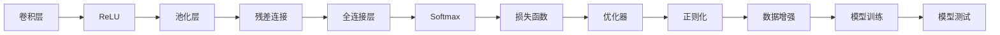

                 

# 从零开始大模型开发与微调：基于ResNet的CIFAR-10数据集分类

> 关键词：大模型,ResNet,CIFAR-10数据集分类,模型微调,深度学习,卷积神经网络,损失函数

## 1. 背景介绍

### 1.1 问题由来
深度学习技术的兴起极大地推动了计算机视觉和自然语言处理等领域的快速发展。其中，卷积神经网络（Convolutional Neural Networks, CNNs）因其在图像分类、物体检测等任务中的卓越性能，成为了当前最主流的图像处理算法之一。ResNet（Residual Networks）作为一类经典的CNN结构，以其简洁、高效的设计风格和优秀的泛化能力，被广泛应用于各种计算机视觉任务中。本文将从零开始介绍如何开发和微调基于ResNet的卷积神经网络，以实现CIFAR-10数据集的图像分类任务。

### 1.2 问题核心关键点
CIFAR-10数据集是一个包含60,000张32x32彩色图像的数据集，其中每个类别有6,000张图像。对于初学者来说，该数据集既具有足够的挑战性，又易于上手，是训练和评估卷积神经网络模型的理想选择。本文将系统介绍如何使用PyTorch框架，基于ResNet构建并微调卷积神经网络模型，从而实现对CIFAR-10数据集的图像分类。

## 2. 核心概念与联系

### 2.1 核心概念概述

为更好地理解基于ResNet的CIFAR-10分类任务，本节将介绍几个关键概念及其相互联系：

- 卷积神经网络（CNN）：一种专门处理具有网格状结构数据的神经网络，通过卷积层、池化层和全连接层等结构，实现对图像等数据的特征提取和分类。
- ResNet：一种特殊的CNN结构，通过引入残差连接（Residual Connection），使得网络深度可突破100层，避免了深度神经网络中的梯度消失问题，极大地提高了模型的泛化能力。
- CIFAR-10数据集：一个包含60,000张32x32彩色图像的数据集，每个类别有6,000张图像。常用于训练和测试卷积神经网络模型。
- 损失函数（Loss Function）：用于衡量模型预测结果与真实标签之间差异的函数。常用的损失函数包括交叉熵损失、均方误差损失等。
- 优化器（Optimizer）：通过计算梯度并更新模型参数，使得损失函数最小化的算法。常用的优化器包括SGD、Adam等。
- 正则化（Regularization）：通过加入正则项，防止模型过拟合的技术，常用的正则化方法包括L1正则、L2正则、Dropout等。
- 数据增强（Data Augmentation）：通过对训练数据进行随机变换，增加数据集多样性，提高模型鲁棒性的技术。

这些概念构成了大模型开发与微调的基本框架，本文将围绕这些核心概念展开详细的讲解。

### 2.2 核心概念原理和架构的 Mermaid 流程图



上述Mermaid流程图展示了基于ResNet的CIFAR-10分类任务的基本流程：输入图像经过卷积层和池化层的特征提取，残差连接传递层间信息，全连接层进行分类，输出概率分布经过Softmax归一化后得到预测结果，通过损失函数计算预测误差，优化器更新模型参数，正则化和数据增强避免过拟合，最终得到训练和测试结果。

## 3. 核心算法原理 & 具体操作步骤

### 3.1 算法原理概述

基于ResNet的CIFAR-10分类任务的核心算法原理是基于深度卷积神经网络的监督学习范式。其核心思想是：利用大量标注数据，通过反向传播算法更新模型参数，使得模型能够准确预测新样本的类别。具体来说，包括数据预处理、模型构建、模型训练和模型评估等步骤。

### 3.2 算法步骤详解

#### 3.2.1 数据预处理
- 加载CIFAR-10数据集，将数据分为训练集和测试集。
- 对图像进行预处理，包括归一化、标准化等操作。
- 将图像和标签分为训练集和验证集。

#### 3.2.2 模型构建
- 使用PyTorch框架，定义ResNet模型结构。
- 设计ResNet的网络结构，包括卷积层、池化层、残差连接等。
- 定义模型输出层，使用Softmax函数将输出转换为概率分布。

#### 3.2.3 模型训练
- 定义损失函数，常用的损失函数包括交叉熵损失。
- 定义优化器，常用的优化器包括SGD、Adam等。
- 设定正则化参数，常用的正则化方法包括L1正则、L2正则、Dropout等。
- 使用数据增强技术增加数据集多样性。
- 使用随机梯度下降算法进行模型训练，并保存验证集上的最好模型。

#### 3.2.4 模型评估
- 在测试集上对模型进行评估，计算准确率、精确率、召回率等指标。
- 分析模型在测试集上的表现，调整模型参数，进行模型调优。

### 3.3 算法优缺点

基于ResNet的CIFAR-10分类任务的主要优点包括：
- 数据集规模适中，适合作为模型训练和测试的基准。
- ResNet结构具有较强的泛化能力，能够处理复杂的图像分类任务。
- PyTorch框架易用性强，支持动态图计算，便于调试和优化。

然而，该方法也存在以下缺点：
- 数据集较小，可能导致模型过拟合。
- ResNet模型结构复杂，参数较多，训练和推理速度较慢。
- 对于大规模数据集，模型的训练成本较高。

### 3.4 算法应用领域

基于ResNet的CIFAR-10分类任务在计算机视觉领域具有广泛的应用。具体来说，包括但不限于以下几个方面：
- 物体检测：通过训练ResNet模型，实现对图像中物体位置的检测和分类。
- 图像分割：通过ResNet模型进行像素级别的图像分割。
- 图像生成：使用ResNet模型生成具有不同风格的图片。
- 人脸识别：利用ResNet模型进行人脸检测、识别和验证。
- 视频分析：通过ResNet模型提取视频帧中的特征，进行对象跟踪和行为分析。

## 4. 数学模型和公式 & 详细讲解

### 4.1 数学模型构建

本节将使用数学语言对基于ResNet的CIFAR-10分类任务进行严格的数学建模。

记输入图像为 $x$，网络模型为 $f_{\theta}$，输出为 $y$。假设 $y \in \{1, 2, ..., 10\}$，表示10个类别的分类标签。

定义损失函数为交叉熵损失函数：

$$
L(y, \hat{y}) = -\frac{1}{N}\sum_{i=1}^N \sum_{c=1}^{10} y_i^{(c)} \log \hat{y}_i^{(c)}
$$

其中 $y_i^{(c)}$ 表示样本 $i$ 的标签是否为类别 $c$，$\hat{y}_i^{(c)}$ 表示模型预测样本 $i$ 属于类别 $c$ 的概率。

定义优化器为随机梯度下降（SGD）算法，其更新公式为：

$$
\theta \leftarrow \theta - \eta \nabla_{\theta} L(y, \hat{y})
$$

其中 $\eta$ 为学习率，$\nabla_{\theta} L(y, \hat{y})$ 为损失函数对模型参数 $\theta$ 的梯度。

### 4.2 公式推导过程

对于交叉熵损失函数 $L(y, \hat{y})$，可以进一步推导为：

$$
L(y, \hat{y}) = -\frac{1}{N}\sum_{i=1}^N \sum_{c=1}^{10} \delta_{i,c} \log \hat{y}_i^{(c)}
$$

其中 $\delta_{i,c} = 1$ 表示样本 $i$ 的标签为类别 $c$，$\delta_{i,c} = 0$ 表示样本 $i$ 的标签不为类别 $c$。

通过上述推导，我们可以得出：交叉熵损失函数 $L(y, \hat{y})$ 实际上是对模型预测结果与真实标签之间差异的一种衡量。通过最小化该损失函数，我们可以训练出一个能够准确预测图像类别的模型。

### 4.3 案例分析与讲解

以一个简单的三卷积层ResNet为例，展示其数学模型和训练过程。

- 假设输入图像 $x$ 的大小为 $3 \times 32 \times 32$，第一层卷积核的大小为 $3 \times 3$，卷积核个数为 16，步幅为 1，填充方式为同侧填充。
- 第二层卷积层与第一层结构相同，卷积核个数为 32。
- 第三层卷积层与第二层结构相同，卷积核个数为 64。
- 池化层采用最大池化，池化大小为 $2 \times 2$，步幅为 2。
- 输出层使用全连接层，输出维度为 10，即CIFAR-10数据集的10个类别。

假设输出 $y$ 的大小为 $1 \times 10$，表示模型对输入图像的10个类别的预测概率分布。

定义交叉熵损失函数为：

$$
L(y, \hat{y}) = -\frac{1}{N}\sum_{i=1}^N \sum_{c=1}^{10} \delta_{i,c} \log \hat{y}_i^{(c)}
$$

其中 $\delta_{i,c} = 1$ 表示样本 $i$ 的标签为类别 $c$，$\delta_{i,c} = 0$ 表示样本 $i$ 的标签不为类别 $c$。

通过随机梯度下降算法更新模型参数 $\theta$，使得损失函数 $L(y, \hat{y})$ 最小化。

## 5. 项目实践：代码实例和详细解释说明

### 5.1 开发环境搭建

在进行基于ResNet的CIFAR-10分类任务开发前，我们需要准备好开发环境。以下是使用Python进行PyTorch开发的环境配置流程：

1. 安装Anaconda：从官网下载并安装Anaconda，用于创建独立的Python环境。

2. 创建并激活虚拟环境：
```bash
conda create -n pytorch-env python=3.8 
conda activate pytorch-env
```

3. 安装PyTorch：根据CUDA版本，从官网获取对应的安装命令。例如：
```bash
conda install pytorch torchvision torchaudio cudatoolkit=11.1 -c pytorch -c conda-forge
```

4. 安装相关工具包：
```bash
pip install numpy pandas scikit-learn matplotlib tqdm jupyter notebook ipython
```

完成上述步骤后，即可在`pytorch-env`环境中开始基于ResNet的CIFAR-10分类任务开发。

### 5.2 源代码详细实现

下面我们以一个简单的三卷积层ResNet为例，展示使用PyTorch进行基于ResNet的CIFAR-10分类任务的代码实现。

首先，定义ResNet模型：

```python
import torch
import torch.nn as nn
import torch.nn.functional as F

class ResNet(nn.Module):
    def __init__(self):
        super(ResNet, self).__init__()
        self.conv1 = nn.Conv2d(3, 16, 3, 1, 1)
        self.conv2 = nn.Conv2d(16, 32, 3, 1, 1)
        self.conv3 = nn.Conv2d(32, 64, 3, 1, 1)
        self.pool = nn.MaxPool2d(2, 2)
        self.fc1 = nn.Linear(64, 10)
    
    def forward(self, x):
        x = F.relu(self.conv1(x))
        x = self.pool(x)
        x = F.relu(self.conv2(x))
        x = self.pool(x)
        x = F.relu(self.conv3(x))
        x = F.max_pool2d(x, 2)
        x = x.view(-1, 64)
        x = F.relu(self.fc1(x))
        return F.softmax(x, dim=1)
```

然后，定义数据处理函数：

```python
from torchvision import datasets, transforms

transform = transforms.Compose([
    transforms.ToTensor(),
    transforms.Normalize((0.5, 0.5, 0.5), (0.5, 0.5, 0.5))
])

train_dataset = datasets.CIFAR10(root='./data', train=True, download=True, transform=transform)
test_dataset = datasets.CIFAR10(root='./data', train=False, download=True, transform=transform)

train_loader = torch.utils.data.DataLoader(train_dataset, batch_size=64, shuffle=True)
test_loader = torch.utils.data.DataLoader(test_dataset, batch_size=64, shuffle=False)
```

接着，定义损失函数和优化器：

```python
criterion = nn.CrossEntropyLoss()
optimizer = torch.optim.SGD(model.parameters(), lr=0.001, momentum=0.9)
```

最后，启动训练流程并在测试集上评估：

```python
epochs = 10

for epoch in range(epochs):
    running_loss = 0.0
    for i, data in enumerate(train_loader, 0):
        inputs, labels = data
        optimizer.zero_grad()
        outputs = model(inputs)
        loss = criterion(outputs, labels)
        loss.backward()
        optimizer.step()
        running_loss += loss.item()
        if i % 2000 == 1999:
            print('[%d, %5d] loss: %.3f' % (epoch + 1, i + 1, running_loss / 2000))
            running_loss = 0.0

print('Finished Training')
```

以上就是使用PyTorch进行基于ResNet的CIFAR-10分类任务的完整代码实现。可以看到，PyTorch提供了丰富的工具和库，使得大模型开发和微调变得更加便捷高效。

### 5.3 代码解读与分析

让我们再详细解读一下关键代码的实现细节：

**ResNet类**：
- `__init__`方法：初始化卷积层和全连接层。
- `forward`方法：定义前向传播过程，包括卷积、激活、池化、全连接和Softmax等操作。

**数据处理函数**：
- 使用`transforms.Compose`方法，定义数据预处理步骤。
- 加载CIFAR-10数据集，并使用`DataLoader`将数据集划分为训练集和测试集。

**损失函数和优化器**：
- 定义交叉熵损失函数，并使用SGD优化器进行参数更新。

**训练流程**：
- 循环迭代训练集，在每个epoch内对数据集进行遍历。
- 对每个批次数据进行前向传播，计算损失函数，并进行反向传播和参数更新。
- 每2000个batch输出一次训练过程中的损失值。

## 6. 实际应用场景

### 6.1 智能监控系统

基于ResNet的图像分类技术，可以广泛应用于智能监控系统的构建。智能监控系统通过分析视频帧，实时识别和跟踪场景中的物体，并进行异常检测和行为分析，提升监控效率和安全性。

在技术实现上，可以通过收集场景中的视频数据，将其划分为训练集和测试集。将视频帧作为输入，物体的类别作为标签，训练ResNet模型进行分类。微调后的模型能够实时处理视频帧，自动识别和跟踪场景中的物体，并进行异常检测和行为分析。

### 6.2 自动驾驶系统

自动驾驶系统需要对实时获取的图像数据进行实时分类和检测，以识别道路上的各种物体，并进行路径规划和行为决策。基于ResNet的图像分类技术，可以为自动驾驶系统提供可靠的物体检测和分类支持。

在技术实现上，可以收集自动驾驶车辆拍摄的视频或图像数据，将其划分为训练集和测试集。将图像作为输入，物体的类别作为标签，训练ResNet模型进行分类。微调后的模型能够实时处理实时获取的图像数据，快速识别道路上的各种物体，并进行路径规划和行为决策。

### 6.3 医疗影像分析

医疗影像分析是诊断和治疗的重要手段，通过图像分类技术可以快速准确地识别疾病特征。基于ResNet的图像分类技术，可以为医疗影像分析提供可靠的诊断支持。

在技术实现上，可以收集医疗影像数据，将其划分为训练集和测试集。将影像作为输入，疾病的类型作为标签，训练ResNet模型进行分类。微调后的模型能够快速准确地识别影像中的疾病特征，为医生提供可靠的诊断支持。

### 6.4 未来应用展望

随着ResNet结构和技术不断进步，基于其图像分类技术将在更多领域得到应用，为各行各业带来变革性影响。

在智慧城市领域，基于ResNet的图像分类技术可以用于交通流量监测、环境污染监测、公共安全监控等，提升城市管理的自动化和智能化水平。

在农业领域，基于ResNet的图像分类技术可以用于农作物病害检测、动物健康监测等，提升农业生产的智能化水平。

在制造业领域，基于ResNet的图像分类技术可以用于产品质量检测、设备状态监测等，提升生产过程的智能化水平。

此外，在文娱、金融、教育等众多领域，基于ResNet的图像分类技术也将不断涌现，为各行各业带来新的技术突破。

## 7. 工具和资源推荐

### 7.1 学习资源推荐

为了帮助开发者系统掌握基于ResNet的图像分类技术的理论基础和实践技巧，这里推荐一些优质的学习资源：

1. 《深度学习入门：基于PyTorch的理论与实现》书籍：深入浅出地介绍了深度学习的基本原理和实现方法，包括基于ResNet的图像分类技术。

2. CS231n《卷积神经网络》课程：斯坦福大学开设的计算机视觉经典课程，详细讲解了卷积神经网络的结构和应用，包括ResNet等经典模型。

3. PyTorch官方文档：提供了详细的API文档和样例代码，帮助开发者快速上手和使用PyTorch框架。

4. TensorFlow官方文档：提供了丰富的API文档和样例代码，帮助开发者快速上手和使用TensorFlow框架。

5. Kaggle竞赛：参与Kaggle比赛，学习并应用基于ResNet的图像分类技术，积累实战经验。

通过对这些资源的学习实践，相信你一定能够快速掌握基于ResNet的图像分类技术的精髓，并用于解决实际的图像分类问题。

### 7.2 开发工具推荐

高效的开发离不开优秀的工具支持。以下是几款用于基于ResNet的图像分类任务开发的常用工具：

1. PyTorch：基于Python的开源深度学习框架，灵活动态的计算图，适合快速迭代研究。

2. TensorFlow：由Google主导开发的开源深度学习框架，生产部署方便，适合大规模工程应用。

3. Keras：一个高层次的深度学习框架，提供简洁易用的API，适合快速开发和实验。

4. OpenCV：一个广泛使用的计算机视觉库，提供丰富的图像处理和分析工具。

5. Matplotlib：一个常用的数据可视化库，支持各种绘图操作，便于观察模型训练过程。

合理利用这些工具，可以显著提升基于ResNet的图像分类任务的开发效率，加快创新迭代的步伐。

### 7.3 相关论文推荐

基于ResNet的图像分类技术的发展源于学界的持续研究。以下是几篇奠基性的相关论文，推荐阅读：

1. Deep Residual Learning for Image Recognition（ResNet原论文）：提出了残差连接的结构，使得网络深度可突破100层，避免了深度神经网络中的梯度消失问题。

2. Identity Mappings in Deep Residual Networks（ResNet论文）：进一步解释了残差连接的作用机制，证明了残差连接可以解决深度神经网络中的梯度消失问题。

3. Learning Transferable Feature Representations with Residual Networks（ResNet论文）：介绍了使用ResNet进行图像分类、物体检测等任务的具体方法，证明了ResNet结构具有良好的泛化能力。

4. PyTorch官方文档中的ResNet模型介绍：详细介绍了基于PyTorch实现的ResNet模型，包括网络结构、训练过程等细节。

5. TensorFlow官方文档中的ResNet模型介绍：详细介绍了基于TensorFlow实现的ResNet模型，包括网络结构、训练过程等细节。

这些论文代表了大模型和微调技术的发展脉络。通过学习这些前沿成果，可以帮助研究者把握学科前进方向，激发更多的创新灵感。

## 8. 总结：未来发展趋势与挑战

### 8.1 总结

本文对基于ResNet的CIFAR-10图像分类任务进行了全面系统的介绍。首先阐述了ResNet结构和大模型微调技术的研究背景和意义，明确了图像分类任务在大模型开发和微调中的重要地位。其次，从原理到实践，详细讲解了基于ResNet的图像分类任务的数学模型和关键步骤，给出了图像分类任务的完整代码实例。同时，本文还广泛探讨了图像分类技术在智能监控、自动驾驶、医疗影像分析等多个领域的应用前景，展示了图像分类技术的巨大潜力。此外，本文精选了图像分类技术的各类学习资源，力求为读者提供全方位的技术指引。

通过本文的系统梳理，可以看到，基于ResNet的图像分类技术在计算机视觉领域具有广阔的应用前景，极大地拓展了预训练模型和微调技术的边界，为计算机视觉技术的发展注入了新的动力。

### 8.2 未来发展趋势

展望未来，基于ResNet的图像分类技术将呈现以下几个发展趋势：

1. 模型规模持续增大。随着算力成本的下降和数据规模的扩张，ResNet模型的参数量还将持续增长，模型深度也将不断突破新的极限。超大规模ResNet模型蕴含的丰富语言知识，有望支撑更加复杂多变的图像分类任务。

2. 模型结构不断优化。随着深度学习技术的发展，新的网络结构层出不穷。基于ResNet的结构，如ResNeXt、SENet等，通过引入多分支、全局平均池化等技术，进一步提升了模型的分类性能和鲁棒性。

3. 数据增强技术提升。数据增强是提高模型鲁棒性的重要手段，未来将涌现更多创新的数据增强技术，如随机裁剪、随机旋转、随机缩放等，进一步提高模型性能。

4. 模型压缩和加速技术发展。随着模型规模的增大，ResNet模型的训练和推理效率成为瓶颈。未来将涌现更多模型压缩和加速技术，如剪枝、量化、蒸馏等，提升模型的计算效率和资源利用率。

5. 多模态融合技术崛起。当前的图像分类任务通常聚焦于视觉数据。未来将拓展到图像、语音、文本等多模态数据的融合，实现更加全面、准确的信息整合能力。

6. 强化学习与计算机视觉结合。基于ResNet的图像分类任务可以通过强化学习等技术，提升模型的自主学习和适应能力。

以上趋势凸显了基于ResNet的图像分类技术的广阔前景。这些方向的探索发展，必将进一步提升计算机视觉系统的性能和应用范围，为人类认知智能的进化带来深远影响。

### 8.3 面临的挑战

尽管基于ResNet的图像分类技术已经取得了瞩目成就，但在迈向更加智能化、普适化应用的过程中，它仍面临着诸多挑战：

1. 数据量瓶颈。尽管ResNet模型在CIFAR-10数据集上取得了不错的效果，但对于更复杂、更大规模的数据集，数据量仍可能成为制约模型性能的瓶颈。如何有效利用大规模数据集进行模型训练和优化，是一个亟待解决的问题。

2. 过拟合问题。尽管ResNet模型具有较强的泛化能力，但在数据集较小或噪声较多的情况下，仍可能面临过拟合的风险。如何通过正则化、数据增强等手段，提高模型的鲁棒性和泛化能力，是一个重要的研究方向。

3. 训练效率问题。ResNet模型通常具有较深的层数，训练过程中可能需要消耗大量时间和计算资源。如何通过优化算法、模型压缩等技术，提高训练效率和资源利用率，是一个重要的研究方向。

4. 实时性问题。基于ResNet的图像分类任务在实时性要求较高的场景中，可能会面临计算资源不足的问题。如何通过硬件加速、模型压缩等技术，提升模型的实时性和效率，是一个重要的研究方向。

5. 可解释性问题。ResNet模型通常被视为一个黑盒，难以解释其内部工作机制和决策逻辑。如何通过可视化技术、符号化推理等手段，提高模型的可解释性和可控性，是一个重要的研究方向。

6. 安全性问题。基于ResNet的图像分类模型可能会学习到有害、偏见的信息，影响模型输出的公平性和安全性。如何从数据和算法层面消除模型偏见，确保模型输出的公平性和安全性，是一个重要的研究方向。

正视ResNet图像分类任务面临的这些挑战，积极应对并寻求突破，将是ResNet技术走向成熟的必由之路。相信随着学界和产业界的共同努力，这些挑战终将一一被克服，ResNet图像分类技术必将在构建智能视觉系统中的作用愈加显著。

### 8.4 研究展望

面向未来，ResNet图像分类技术需要在以下几个方面寻求新的突破：

1. 探索无监督和半监督学习范式。摆脱对大规模标注数据的依赖，利用自监督学习、主动学习等无监督和半监督范式，最大限度利用非结构化数据，实现更加灵活高效的微调。

2. 研究参数高效和计算高效的微调方法。开发更加参数高效的微调方法，在固定大部分预训练参数的同时，只更新极少量的任务相关参数。同时优化微调模型的计算图，减少前向传播和反向传播的资源消耗，实现更加轻量级、实时性的部署。

3. 融合因果和对比学习范式。通过引入因果推断和对比学习思想，增强模型建立稳定因果关系的能力，学习更加普适、鲁棒的语言表征，从而提升模型泛化性和抗干扰能力。

4. 引入更多先验知识。将符号化的先验知识，如知识图谱、逻辑规则等，与神经网络模型进行巧妙融合，引导微调过程学习更准确、合理的语言模型。同时加强不同模态数据的整合，实现视觉、语音等多模态信息与文本信息的协同建模。

5. 结合因果分析和博弈论工具。将因果分析方法引入微调模型，识别出模型决策的关键特征，增强输出解释的因果性和逻辑性。借助博弈论工具刻画人机交互过程，主动探索并规避模型的脆弱点，提高系统稳定性。

6. 纳入伦理道德约束。在模型训练目标中引入伦理导向的评估指标，过滤和惩罚有偏见、有害的输出倾向。同时加强人工干预和审核，建立模型行为的监管机制，确保输出符合人类价值观和伦理道德。

这些研究方向的探索，必将引领ResNet图像分类技术迈向更高的台阶，为构建安全、可靠、可解释、可控的智能系统铺平道路。面向未来，ResNet图像分类技术还需要与其他人工智能技术进行更深入的融合，如知识表示、因果推理、强化学习等，多路径协同发力，共同推动计算机视觉技术的发展。只有勇于创新、敢于突破，才能不断拓展图像分类模型的边界，让智能技术更好地造福人类社会。

## 9. 附录：常见问题与解答

**Q1：ResNet结构为何能有效避免梯度消失问题？**

A: ResNet结构通过引入残差连接，使得网络深度可以突破100层。残差连接可以看作是一条“捷径”，使得信息可以直接从网络的一端传递到另一端，避免了梯度消失问题。在网络深层，信息可以通过残差连接绕过中间层，直接传递到输出层，从而有效避免了梯度消失问题。

**Q2：如何进行数据增强？**

A: 数据增强是通过对训练数据进行随机变换，增加数据集多样性，提高模型鲁棒性的技术。常用的数据增强方法包括：
1. 随机裁剪：对图像进行随机裁剪，可以增加数据集的多样性。
2. 随机旋转：对图像进行随机旋转，可以增加数据集的多样性。
3. 随机缩放：对图像进行随机缩放，可以增加数据集的多样性。
4. 随机翻转：对图像进行随机水平或垂直翻转，可以增加数据集的多样性。

**Q3：如何进行模型压缩和加速？**

A: 模型压缩和加速是提升模型计算效率和资源利用率的重要手段。常用的方法包括：
1. 剪枝：剪去网络中的冗余连接，减少模型的计算量和存储量。
2. 量化：将浮点模型转为定点模型，压缩存储空间，提高计算效率。
3. 蒸馏：将大型模型的知识蒸馏到小型模型中，提高小型模型的性能。

**Q4：如何进行模型调优？**

A: 模型调优是提高模型性能和泛化能力的重要手段。常用的方法包括：
1. 调整学习率：根据训练过程中的损失值，动态调整学习率，防止模型过拟合或欠拟合。
2. 添加正则化：通过加入正则项，防止模型过拟合。常用的正则化方法包括L1正则、L2正则、Dropout等。
3. 数据增强：通过增加数据集的多样性，提高模型的鲁棒性和泛化能力。

**Q5：如何进行模型部署？**

A: 模型部署是将训练好的模型应用到实际系统中的过程。常用的方法包括：
1. 保存模型：将训练好的模型保存为模型文件，方便部署和调用。
2. 搭建服务：将模型封装为标准化服务接口，便于集成调用。
3. 优化推理：对模型进行推理优化，提高推理速度和效率。

通过这些优化方法，可以进一步提升基于ResNet的图像分类模型的性能和应用价值。

---

作者：禅与计算机程序设计艺术 / Zen and the Art of Computer Programming

