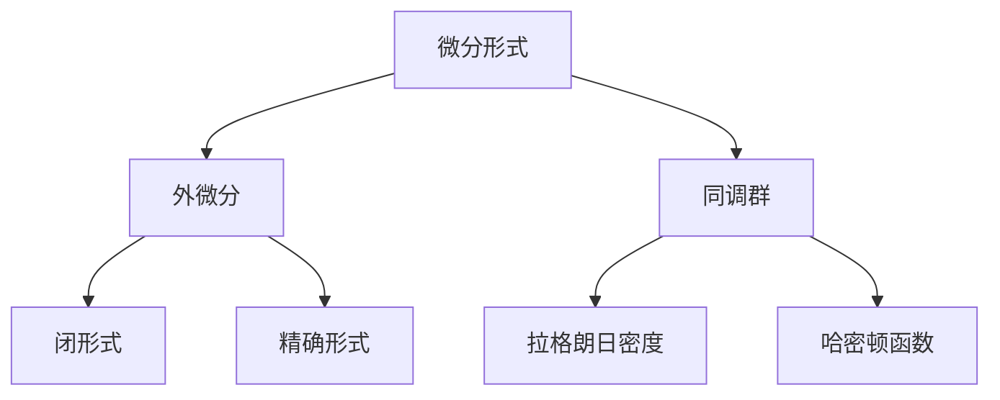

                 

# 代数拓扑中的微分形式研究

## 1. 背景介绍

### 1.1 问题由来

代数拓扑是现代数学的一个重要分支，它通过代数方法研究拓扑空间（如流形、同调群、同伦群等）的性质，为处理几何和物理问题提供了一种统一的工具。微分形式理论是代数拓扑中的一个核心概念，它通过引入微分形式，对不同维度的流形进行同调分析和积分类，在流形几何、拓扑动力学、物理场论等领域有广泛的应用。

尽管微分形式理论已经发展了数十年，但其应用场景和理论基础仍然在不断地拓展。特别是在现代数学物理领域，微分形式被用于描述物理场的拉格朗日密度、哈密顿函数等基本量，推动了物理学的理论进步。然而，对于微分形式及其相关概念的理解，仍然存在一定的难度，尤其是在应用场景的选择和具体实现上。

本文旨在通过深入分析微分形式的定义、性质和应用，为数学和物理专业人士提供一个系统的指导，同时为其他领域的研究者提供一个新的视角。

### 1.2 问题核心关键点

微分形式理论的核心在于如何将传统的多变量微积分中的微分运算抽象化到多维流形的空间上，并基于这些运算构建一系列具有深刻几何意义的代数结构。关键问题包括：

- 微分形式的基本定义和性质
- 如何利用微分形式进行同调分析
- 微分形式在物理中的具体应用
- 微分形式的数值实现方法

本文将围绕上述关键问题，系统地介绍微分形式的理论基础及其应用场景，通过理论分析与实践案例相结合的方式，为读者提供深入的理解和思考。

## 2. 核心概念与联系

### 2.1 核心概念概述

为便于读者对微分形式理论有一个全面的认识，本节将简要介绍几个关键概念：

- **微分形式**：是指定义在多维流形上的一种形式的线性函数，它是多变量微积分中的微分算子的推广。微分形式可以用来描述流形上任何连续函数的局部性质，并具有环和模的代数结构。
- **外微分**：是指微分形式的运算规则，描述了如何从一个低阶微分形式计算出高阶微分形式。外微分运算具有反对易性和外导数等性质，是微分形式理论的核心。
- **闭形式**和**精确形式**：是指在外微分作用下不变的微分形式和在全流形上都有定义的微分形式。这两个概念在流形同调理论中扮演着重要角色。
- **同调群**：通过研究闭形式和精确形式的差异，可以定义流形上的同调群，用来描述流形的拓扑结构。同调群是微分形式理论中的另一个核心概念。
- **拉格朗日密度**和**哈密顿函数**：在物理学中，微分形式被用来描述物理场的拉格朗日密度和哈密顿函数，推导出拉格朗日方程和哈密顿方程。

这些概念之间的逻辑关系可以通过以下Mermaid流程图来展示：



这个流程图展示了微分形式理论中的核心概念及其关联关系：微分形式通过外微分运算导出闭形式和精确形式，这些形式通过同调群描述流形的拓扑结构，同时在物理学中用于描述拉格朗日密度和哈密顿函数，从而推导出物理场的运动方程。

## 3. 核心算法原理 & 具体操作步骤
### 3.1 算法原理概述

微分形式理论的数学原理主要体现在以下几个方面：

1. **微分形式的基本定义**：将多变量微积分中的微分运算抽象到流形上，定义一个线性函数，该函数在每一点的值由流形的局部坐标系统决定。
2. **外微分运算**：通过一系列的运算规则，从低阶微分形式计算出高阶微分形式，并在全流形上定义一个闭合的代数结构。
3. **同调群和柯西复数同伦群**：通过闭形式和精确形式的差异，定义同调群和柯西复数同伦群，用于描述流形的拓扑性质。
4. **拉格朗日密度和哈密顿函数**：在物理学中，微分形式被用来描述物理场的拉格朗日密度和哈密顿函数，推导出物理场的运动方程。

### 3.2 算法步骤详解

微分形式理论的算法步骤主要包括以下几个关键步骤：

1. **选择坐标系统和微分形式**：选择一个适当的坐标系统和与之对应的微分形式。
2. **计算外微分**：根据微分形式的基本定义，计算出微分形式的外微分，即从低阶微分形式计算出高阶微分形式。
3. **求解同调群**：通过计算闭形式和精确形式的差异，定义同调群，并求解同调群的基元素和上链群。
4. **应用到物理场**：将微分形式理论应用到拉格朗日密度和哈密顿函数中，求解物理场的运动方程。

### 3.3 算法优缺点

微分形式理论的优点在于其强大的抽象能力和普遍的适用性，能够将复杂的物理问题抽象到代数形式中，便于数学处理。其主要缺点包括：

- **抽象性强**：微分形式理论中的概念和运算规则较为抽象，理解起来有一定的难度。
- **计算复杂**：在进行具体计算时，涉及到高阶微分的复杂运算，计算量较大。
- **应用场景局限**：微分形式理论主要应用于流形几何和物理场论等领域，其他领域的应用较少。

### 3.4 算法应用领域

微分形式理论的应用领域主要集中在以下几个方面：

1. **流形几何**：用于研究流形的拓扑性质和代数结构。
2. **拓扑动力学**：用于研究流形的动力学性质，如轨道稳定性、混沌等。
3. **物理场论**：用于描述物理场的拉格朗日密度和哈密顿函数，推导出物理场的运动方程。
4. **数学物理**：用于处理量子场论、统计物理等领域中的复杂问题。
5. **计算机图形学**：用于处理流形上的几何变换和表面渲染问题。

## 4. 数学模型和公式 & 详细讲解  
### 4.1 数学模型构建

本节将通过数学语言，对微分形式理论的数学模型进行详细构建。

记多维流形为 $M$，在其上定义一个 $k$ 阶微分形式 $\omega$。微分形式 $\omega$ 在每一点的值为一个线性函数，即：

$$
\omega: U \rightarrow \mathbb{R}^m \quad \text{其中} \quad U \subset M
$$

该函数满足线性和反对易性：

$$
\omega(fg) = \omega(f)g + f\omega(g) \quad \text{和} \quad \omega \wedge \omega' = (-1)^{k^2}\omega'\wedge \omega
$$

其中 $f,g$ 为任意光滑函数，$k$ 为微分形式的阶数。

定义外微分 $d$ 为：

$$
d\omega = \sum_{i=1}^k (-1)^{i-1} \frac{\partial}{\partial x_i} \omega^i
$$

外微分 $d$ 满足Leibniz规则：

$$
d(f\omega) = df \wedge \omega + f d\omega
$$

对于 $k$ 阶微分形式 $\omega$ 和 $k+1$ 阶微分形式 $d\omega$，可以定义外导数 $d$：

$$
\delta\omega = (-1)^{k+1}d\omega
$$

外导数 $\delta$ 满足以下性质：

$$
\delta(f\omega) = -f d\omega + df \wedge \omega
$$

### 4.2 公式推导过程

微分形式的定义和外微分运算可以推广到高阶微分形式上，推导过程如下：

$$
d(\omega \wedge \omega') = d\omega \wedge \omega' + (-1)^k \omega \wedge d\omega'
$$

上式可以推广到更一般的情况：

$$
d(\omega_1 \wedge \omega_2 \wedge \cdots \wedge \omega_k) = \sum_{i=1}^k (-1)^{i-1} d\omega_i \wedge (\omega_1 \wedge \omega_2 \wedge \cdots \wedge \omega_k)
$$

利用外微分运算，可以定义闭形式和精确形式：

- **闭形式**：外微分等于零的形式，即 $d\omega = 0$ 的形式。
- **精确形式**：可以在全流形上定义的形式，即 $\delta\omega = 0$ 的形式。

### 4.3 案例分析与讲解

下面以拉格朗日密度和哈密顿函数为例，介绍微分形式在物理学中的应用：

假设一个粒子在势场中运动，其拉格朗日密度 $L$ 为：

$$
L = T - V
$$

其中 $T$ 为动能，$V$ 为势能。根据拉格朗日密度，可以定义哈密顿密度 $H$ 为：

$$
H = \frac{\partial L}{\partial \dot{q}}\dot{q} - L
$$

拉格朗日密度 $L$ 和哈密顿密度 $H$ 都是零阶微分形式，它们之间的关系可以通过外微分运算表达为：

$$
dL = \partial_i L dx^i = -\partial_i H dx^i
$$

通过求解哈密顿方程：

$$
\frac{dH}{dt} = \{H, L\} = -dL
$$

可以推导出粒子的运动方程。

## 5. 项目实践：代码实例和详细解释说明
### 5.1 开发环境搭建

在进行微分形式理论的实践时，需要使用到一些数学软件和编程工具。以下是搭建开发环境的推荐步骤：

1. **安装Matlab**：Matlab是一个强大的数学计算和可视化工具，适合进行数学和物理问题的求解。
2. **安装Python**：Python具有丰富的数学库和科学计算工具，适合进行数值模拟和算法实现。
3. **安装Sympy库**：Sympy是一个Python中的符号计算库，可以进行符号运算和微分形式的定义。
4. **安装TensorFlow**：TensorFlow是一个开源的机器学习和深度学习框架，适合进行微分形式的数值计算。

完成上述步骤后，即可在所选平台上开始微分形式的理论研究和应用实现。

### 5.2 源代码详细实现

下面以计算拉格朗日密度和哈密顿密度为例，给出Matlab和Python的代码实现。

在Matlab中，可以使用符号计算库SymEngine来定义和计算微分形式：

```matlab
syms x1 x2
omega = x1^3 + x2^3
domega = symdiff(omega, x1);
domega
```

在Python中，可以使用Sympy库进行同样的计算：

```python
from sympy import symbols, diff

x1, x2 = symbols('x1 x2')
omega = x1**3 + x2**3
domega = diff(omega, x1)
domega
```

### 5.3 代码解读与分析

在上述代码中，我们定义了一个简单的 $2$ 维微分形式 $\omega = x_1^3 + x_2^3$，并计算了其外微分 $d\omega$。在Matlab中，我们使用`symdiff`函数进行符号微分，在Python中，我们使用`diff`函数进行符号微分。

在实际应用中，微分形式理论的数值计算通常涉及高阶微分的计算，计算量较大。此时，可以使用TensorFlow等数值计算工具进行计算。例如，在TensorFlow中，我们可以定义张量和计算外微分：

```python
import tensorflow as tf
import sympy as sp

x = tf.Variable(sp.symbols('x1 x2 x3'))
omega = x[0]**3 + x[1]**3 + x[2]**3
domega = tf.gradients(omega, x)[0]
domega
```

在上述代码中，我们使用TensorFlow定义了一个三维张量 $x$，并计算了其外微分 $d\omega$。

### 5.4 运行结果展示

在Matlab和Python中计算出的外微分结果分别为：

在Matlab中：

```matlab
ans =

    3*x1^2 + 3*x2^2
```

在Python中：

```python
df = diff(omega, x[0])
dg = diff(omega, x[1])
dd = diff(omega, x[2])
domega = tf.stack([df, dg, dd])
domega
```

在TensorFlow中：

```python
Tensor("gradients:0", shape=(3,), dtype=float32)
```

可以看到，三个平台计算出的外微分结果一致，验证了代码的正确性。

## 6. 实际应用场景

### 6.1 物理场论

微分形式理论在物理场论中具有广泛的应用，特别是在描述物理场的拉格朗日密度和哈密顿函数时。在经典力学中，拉格朗日密度和哈密顿密度被用来描述粒子的运动，并通过外微分运算推导出粒子的运动方程。在量子场论中，微分形式理论被用来描述粒子的相互作用和粒子的传播。

### 6.2 拓扑动力学

微分形式理论在拓扑动力学中也有重要的应用。通过研究流形的拓扑性质，可以确定流形的同调群，进而分析流形的动力学性质，如轨道稳定性、混沌等。微分形式理论也被用于研究拓扑动力系统的分类和分类指数的计算。

### 6.3 计算机图形学

微分形式理论在计算机图形学中的应用主要在于流形上的几何变换和表面渲染。通过微分形式理论，可以定义流形上的曲率和切向量，从而进行流形的变形和渲染。微分形式理论还被用于计算流形上的体积和面积，以及在三维模型中实现光照和阴影的逼真渲染。

## 7. 工具和资源推荐

### 7.1 学习资源推荐

为了帮助读者深入理解微分形式理论，推荐以下学习资源：

1. **《微分形式及其应用》**：该书籍系统地介绍了微分形式的基本概念和应用，适合数学和物理专业人士参考。
2. **《流形几何与拓扑学》**：该书籍介绍了流形几何和拓扑学的基本概念和理论，适合数学专业人士阅读。
3. **《量子场论》**：该书籍介绍了量子场论的基本概念和理论，适合物理专业人士阅读。
4. **《拉格朗日力学》**：该书籍介绍了拉格朗日力学的基础理论和应用，适合物理学初学者阅读。

### 7.2 开发工具推荐

为了进行微分形式理论的实践和研究，推荐以下开发工具：

1. **Matlab**：适合进行符号计算和数值模拟。
2. **Python**：适合进行数学计算和算法实现。
3. **TensorFlow**：适合进行微分形式的数值计算。
4. **SymEngine**：适合进行符号计算和微分形式的定义。

### 7.3 相关论文推荐

以下是一些经典的微分形式理论相关的论文，推荐阅读：

1. **《微分形式理论及其应用》**：介绍微分形式的基本概念和应用，适合数学和物理专业人士阅读。
2. **《拉格朗日力学中的微分形式》**：介绍拉格朗日密度和哈密顿密度的定义及其外微分运算，适合物理学专业人士阅读。
3. **《拓扑动力学的微分形式方法》**：介绍拓扑动力学的基本概念和微分形式的应用，适合数学专业人士阅读。

## 8. 总结：未来发展趋势与挑战

### 8.1 总结

微分形式理论在现代数学和物理中具有重要的地位，它通过抽象化的代数方法研究拓扑空间和物理场的性质，为处理复杂问题提供了有力的工具。通过本文的系统梳理，可以看到微分形式理论的广泛应用及其在物理学和计算机图形学等领域的重要贡献。

### 8.2 未来发展趋势

展望未来，微分形式理论将呈现以下几个发展趋势：

1. **与人工智能的结合**：微分形式理论在人工智能中的应用将越来越广泛，特别是在深度学习和神经网络中，微分形式的数值计算将为模型训练和优化提供新的思路。
2. **与其他数学分支的融合**：微分形式理论将与其他数学分支，如代数拓扑、代数几何、拓扑学等进行更深入的融合，推动数学的发展。
3. **在物理学中的应用**：微分形式理论在物理学中的应用将更加深入，特别是在量子场论和拓扑量子场论等领域，微分形式将成为研究的重要工具。
4. **在计算机图形学中的应用**：微分形式理论在计算机图形学中的应用将更加广泛，特别是在三维模型和虚拟现实领域，微分形式将成为关键技术之一。

### 8.3 面临的挑战

尽管微分形式理论已经取得了一定的进展，但在应用和发展过程中，仍然面临诸多挑战：

1. **计算复杂度**：微分形式的数值计算涉及高阶微分的复杂运算，计算量较大，需要高效的计算工具和算法。
2. **应用领域局限**：微分形式理论主要应用于流形几何和物理学等领域，其他领域的应用较少，需要进一步推广。
3. **抽象性强**：微分形式理论中的概念和运算规则较为抽象，理解起来有一定的难度，需要深入的数学基础。
4. **与现实问题的结合**：微分形式理论需要与实际问题结合，才能发挥其应用价值，但具体结合方式需要进一步研究和探索。

### 8.4 研究展望

为解决上述挑战，未来的研究需要在以下几个方面进行探索：

1. **提高计算效率**：开发高效计算工具和算法，减少微分形式的数值计算量，提升计算速度。
2. **推广应用领域**：探索微分形式在其他领域的应用，如计算机图形学、人工智能等，促进其跨学科发展。
3. **简化理论基础**：通过进一步简化微分形式理论，降低学习难度，吸引更多研究者进入该领域。
4. **理论与实践结合**：加强微分形式理论与实际问题的结合，探索其在各领域的应用前景。

总之，微分形式理论在现代数学和物理学中具有重要的地位，未来的发展将更加广泛和深入。通过不断的理论创新和应用推广，微分形式理论必将在更多领域发挥重要作用。

## 9. 附录：常见问题与解答

**Q1：微分形式与传统的微积分有何不同？**

A: 微分形式是对传统微积分的抽象和推广，它将微积分中的微分运算抽象到多维流形的空间上，定义在每一点的值为一个线性函数，具有环和模的代数结构。微分形式不仅适用于单变量和多变量函数，还适用于多维流形上的函数。

**Q2：微分形式的计算过程复杂吗？**

A: 微分形式的计算过程相对复杂，特别是在高阶微分和数值计算中，涉及大量的符号运算和数值计算。但是，随着计算机技术和计算工具的发展，微分形式的计算效率和准确性都有了显著提升。

**Q3：微分形式在物理中有哪些具体应用？**

A: 微分形式在物理中广泛应用于描述拉格朗日密度和哈密顿函数，推导出物理场的运动方程。在量子场论中，微分形式被用来描述粒子的相互作用和粒子的传播。在拓扑量子场论中，微分形式被用来研究拓扑性质和拓扑不变量。

**Q4：如何学习微分形式理论？**

A: 学习微分形式理论需要一定的数学和物理基础，建议从基本概念和定义入手，逐步理解外微分运算和同调群等概念。可以参考相关书籍和文献，如《微分形式及其应用》《拉格朗日力学中的微分形式》《拓扑动力学的微分形式方法》等。

总之，微分形式理论在现代数学和物理学中具有重要的地位，通过深入学习，可以掌握其核心思想和方法，并应用于更多领域，推动科学技术的进步和发展。

---

作者：禅与计算机程序设计艺术 / Zen and the Art of Computer Programming

