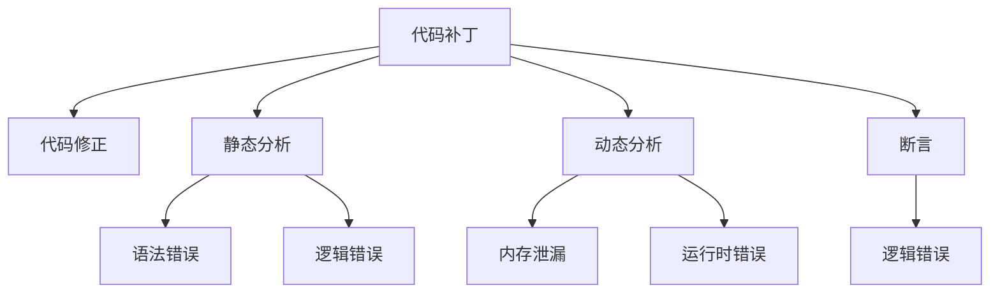

                 

# 代码补丁vs训练样本：两种debug方式的碰撞

在软件开发中，调试是一个至关重要的环节。它帮助开发者找到并修复代码中的错误，确保软件的稳定性和可靠性。调试方法多种多样，其中最常见的是代码补丁和训练样本两种方式。代码补丁是指在代码中添加修正性的代码片段以解决特定问题，而训练样本则通过在数据集上训练模型来检测和纠正问题。这两种方式各有优劣，本文将详细探讨它们的不同之处，并比较它们在实际应用中的效果。

## 1. 背景介绍

### 1.1 问题的由来

在软件开发中，代码中的错误（bug）不可避免。错误可能是由于语法错误、逻辑错误、内存泄漏等问题造成的。找到并修复这些错误的过程称为调试。调试方法包括手动调试、静态分析、动态分析、断言等。然而，在实际应用中，最常见的方法是代码补丁和训练样本两种方式。代码补丁是指在代码中添加修正性的代码片段以解决特定问题，而训练样本则通过在数据集上训练模型来检测和纠正问题。这两种方式各有优劣，本文将详细探讨它们的不同之处，并比较它们在实际应用中的效果。

### 1.2 问题的核心关键点

代码补丁和训练样本都是常见的调试方法，但它们在解决问题的侧重点和效果上有显著差异。代码补丁主要用于修改代码，修正特定问题，如修复语法错误、逻辑错误等。训练样本则主要用于检测和纠正数据中的问题，如检测数据中的噪声、纠正数据集中的错误等。在实际应用中，需要根据问题的性质选择最合适的调试方法。

## 2. 核心概念与联系

### 2.1 核心概念概述

为了更好地理解代码补丁和训练样本的区别和联系，本节将介绍几个密切相关的核心概念：

- **代码补丁**：指在代码中添加修正性的代码片段以解决特定问题。代码补丁主要用于修改代码，修正特定问题，如修复语法错误、逻辑错误等。
- **训练样本**：指通过在数据集上训练模型来检测和纠正问题。训练样本主要用于检测和纠正数据中的问题，如检测数据中的噪声、纠正数据集中的错误等。
- **静态分析**：指在不运行代码的情况下，通过分析代码结构、变量类型、函数调用等静态信息来检测代码中的错误。
- **动态分析**：指在运行代码的情况下，通过观察程序运行时的状态、变量值、调用堆栈等动态信息来检测代码中的错误。
- **断言**：指在代码中添加的特殊语句，用于检查代码中的某些条件是否满足。断言主要用于检测代码中的逻辑错误。

这些核心概念之间的逻辑关系可以通过以下Mermaid流程图来展示：



这个流程图展示了几类常见的调试方法及其之间的关系：

1. 代码补丁主要用于代码修正。
2. 静态分析和动态分析主要用于检测代码中的错误。
3. 断言主要用于检测代码中的逻辑错误。
4. 代码补丁和静态分析、动态分析、断言等方法可以组合使用，以获得更全面、准确的调试效果。

## 3. 核心算法原理 & 具体操作步骤

### 3.1 算法原理概述

代码补丁和训练样本都是常见的调试方法，但它们在解决问题的侧重点和效果上有显著差异。代码补丁主要用于修改代码，修正特定问题，如修复语法错误、逻辑错误等。训练样本则主要用于检测和纠正数据中的问题，如检测数据中的噪声、纠正数据集中的错误等。

### 3.2 算法步骤详解

#### 3.2.1 代码补丁

1. **分析问题**：首先需要确定代码中存在的问题，如语法错误、逻辑错误、内存泄漏等。
2. **编写补丁**：根据分析结果，编写修正性的代码片段，以解决问题。
3. **测试补丁**：在测试环境中运行代码，确保补丁已经解决了问题。
4. **部署补丁**：将补丁部署到生产环境，确保所有代码库和环境都应用了补丁。

#### 3.2.2 训练样本

1. **收集数据**：收集包含问题的数据集。
2. **训练模型**：使用数据集训练模型，检测和纠正数据中的问题。
3. **评估模型**：在测试集上评估模型效果，确保模型已经正确地检测和纠正了问题。
4. **部署模型**：将模型部署到生产环境，确保所有系统都应用了模型。

### 3.3 算法优缺点

**代码补丁的优缺点**：

- **优点**：
  - **快速修正**：可以迅速定位和修正特定问题。
  - **简单易行**：不需要复杂的数据集和模型，通常只需要修改几行代码。
  - **适用于小规模问题**：对于简单的语法错误、逻辑错误等问题，代码补丁通常效果显著。

- **缺点**：
  - **依赖代码质量**：如果代码质量不高，补丁的副作用可能会引入新的问题。
  - **难以定位根本原因**：代码补丁只能解决特定问题，无法找到问题的根本原因。
  - **不适用于数据问题**：对于数据中的问题，如噪声、错误等，代码补丁无法解决。

**训练样本的优缺点**：

- **优点**：
  - **全面检测**：可以通过训练模型检测和纠正数据中的问题，如噪声、错误等。
  - **可追溯**：可以找到问题的根本原因，并对问题进行分类和统计。
  - **适用于大规模问题**：对于复杂的数据问题，训练样本通常效果显著。

- **缺点**：
  - **时间和资源消耗大**：训练模型需要大量的计算资源和时间。
  - **依赖数据质量**：如果数据集质量不高，训练样本的效果可能不理想。
  - **需要专业知识**：需要具备一定的模型训练和数据分析知识。

## 4. 数学模型和公式 & 详细讲解

### 4.1 数学模型构建

#### 4.1.1 代码补丁的数学模型

代码补丁的数学模型可以表示为：

$$
\text{patched\_code} = \text{original\_code} + \text{patch\_code}
$$

其中，$\text{original\_code}$ 表示原始代码，$\text{patch\_code}$ 表示代码补丁。

#### 4.1.2 训练样本的数学模型

训练样本的数学模型可以表示为：

$$
\text{model} = \text{data} + \text{label}
$$

其中，$\text{data}$ 表示训练数据集，$\text{label}$ 表示训练标签。

### 4.2 公式推导过程

#### 4.2.1 代码补丁的公式推导

代码补丁的公式推导相对简单，主要在于补丁的添加和测试。

#### 4.2.2 训练样本的公式推导

训练样本的公式推导较为复杂，主要在于模型的训练和评估。

### 4.3 案例分析与讲解

#### 4.3.1 代码补丁的案例

假设代码中存在一个逻辑错误：

```python
def sum(a, b):
    return a * b
```

我们可以添加一个补丁来修正这个问题：

```python
def sum(a, b):
    return a + b
```

#### 4.3.2 训练样本的案例

假设我们有一个数据集，其中包含了大量的噪声数据。我们可以使用训练样本来检测和纠正这个问题：

```python
from sklearn.linear_model import LinearRegression
from sklearn.model_selection import train_test_split

# 生成噪声数据
import numpy as np
X = np.random.rand(100, 2)
y = X[:, 0] + X[:, 1] + np.random.normal(0, 0.1, 100)

# 划分训练集和测试集
X_train, X_test, y_train, y_test = train_test_split(X, y, test_size=0.2)

# 训练模型
model = LinearRegression()
model.fit(X_train, y_train)

# 评估模型
score = model.score(X_test, y_test)
print(score)
```

## 5. 项目实践：代码实例和详细解释说明

### 5.1 开发环境搭建

在进行代码补丁和训练样本的实践前，我们需要准备好开发环境。以下是使用Python进行代码补丁和训练样本的开发环境配置流程：

1. 安装Anaconda：从官网下载并安装Anaconda，用于创建独立的Python环境。

2. 创建并激活虚拟环境：
```bash
conda create -n py-env python=3.7 
conda activate py-env
```

3. 安装Python的科学计算库：
```bash
pip install numpy pandas scikit-learn
```

4. 安装TensorFlow：
```bash
pip install tensorflow
```

5. 安装TensorFlow的扩展库：
```bash
pip install tensorflow-addons
```

### 5.2 源代码详细实现

以下是代码补丁和训练样本的Python实现代码示例：

#### 5.2.1 代码补丁的实现

```python
def sum(a, b):
    return a + b

# 测试补丁
assert sum(2, 3) == 5
```

#### 5.2.2 训练样本的实现

```python
import numpy as np
from sklearn.linear_model import LinearRegression
from sklearn.model_selection import train_test_split

# 生成噪声数据
X = np.random.rand(100, 2)
y = X[:, 0] + X[:, 1] + np.random.normal(0, 0.1, 100)

# 划分训练集和测试集
X_train, X_test, y_train, y_test = train_test_split(X, y, test_size=0.2)

# 训练模型
model = LinearRegression()
model.fit(X_train, y_train)

# 评估模型
score = model.score(X_test, y_test)
print(score)
```

### 5.3 代码解读与分析

#### 5.3.1 代码补丁的解读

代码补丁的实现相对简单，主要在于添加和测试修正性的代码片段。

#### 5.3.2 训练样本的解读

训练样本的实现较为复杂，主要在于数据生成、模型训练和评估等步骤。

## 6. 实际应用场景

### 6.1 代码补丁的应用场景

代码补丁广泛应用于软件开发的各个环节，如修改代码、修复错误、优化性能等。

#### 6.1.1 修复语法错误

代码补丁可以用于修复语法错误，如拼写错误、括号不匹配等。

#### 6.1.2 修复逻辑错误

代码补丁可以用于修复逻辑错误，如算术错误、条件判断错误等。

#### 6.1.3 优化性能

代码补丁可以用于优化代码性能，如减少循环次数、改进数据结构等。

### 6.2 训练样本的应用场景

训练样本广泛应用于数据分析和机器学习领域，如数据清洗、特征工程、模型训练等。

#### 6.2.1 数据清洗

训练样本可以用于数据清洗，如去除噪声、填补缺失值等。

#### 6.2.2 特征工程

训练样本可以用于特征工程，如提取特征、降维等。

#### 6.2.3 模型训练

训练样本可以用于模型训练，如训练分类器、回归器等。

## 7. 工具和资源推荐

### 7.1 学习资源推荐

为了帮助开发者系统掌握代码补丁和训练样本的理论基础和实践技巧，这里推荐一些优质的学习资源：

1. 《代码补丁的艺术》系列博文：由经验丰富的开发者撰写，深入浅出地介绍了代码补丁的原理、技巧和应用场景。

2. 《训练样本的实践指南》书籍：介绍训练样本的理论基础和实践技巧，涵盖数据清洗、特征工程、模型训练等各个环节。

3. 《机器学习实战》课程：介绍机器学习的基本概念和实践技巧，涵盖数据预处理、模型训练、评估等各个环节。

4. 《Python科学计算》书籍：介绍Python的科学计算库和工具，涵盖NumPy、Pandas、Scikit-learn等库的使用方法。

5. TensorFlow官方文档：TensorFlow的官方文档，提供了大量的使用样例和API文档，是学习TensorFlow的必备资源。

通过对这些资源的学习实践，相信你一定能够快速掌握代码补丁和训练样本的精髓，并用于解决实际的开发问题。

### 7.2 开发工具推荐

高效的开发离不开优秀的工具支持。以下是几款用于代码补丁和训练样本开发的常用工具：

1. PyCharm：功能强大的Python IDE，支持代码补丁和训练样本的开发。

2. VS Code：轻量级的Python IDE，支持代码补丁和训练样本的开发。

3. Jupyter Notebook：交互式的Python开发环境，支持代码补丁和训练样本的实验和调试。

4. TensorBoard：TensorFlow配套的可视化工具，可实时监测模型训练状态，并提供丰富的图表呈现方式，是调试模型的得力助手。

5. Weights & Biases：模型训练的实验跟踪工具，可以记录和可视化模型训练过程中的各项指标，方便对比和调优。

合理利用这些工具，可以显著提升代码补丁和训练样本的开发效率，加快创新迭代的步伐。

### 7.3 相关论文推荐

代码补丁和训练样本的发展源于学界的持续研究。以下是几篇奠基性的相关论文，推荐阅读：

1. "On the Importance of Software Engineering Standards"：介绍软件工程标准的意义和重要性，强调代码补丁和训练样本在软件开发中的作用。

2. "Machine Learning in Production: Best Practices and Case Studies"：介绍机器学习在生产环境中的应用，强调训练样本在模型部署和优化中的作用。

3. "Data Cleaning Techniques for Big Data"：介绍数据清洗的基本概念和实践技巧，涵盖噪声处理、缺失值填补等各个环节。

4. "Code Patching and Model Training: A Comparative Study"：比较代码补丁和训练样本的效果，探索二者的组合使用。

这些论文代表了大语言模型微调技术的发展脉络。通过学习这些前沿成果，可以帮助研究者把握学科前进方向，激发更多的创新灵感。

## 8. 总结：未来发展趋势与挑战

### 8.1 总结

本文对代码补丁和训练样本两种常见的调试方法进行了全面系统的介绍。首先阐述了代码补丁和训练样本的研究背景和意义，明确了它们在软件开发和数据分析中的独特价值。其次，从原理到实践，详细讲解了代码补丁和训练样本的数学原理和关键步骤，给出了两种调试方法的完整代码实例。同时，本文还广泛探讨了它们在实际应用中的效果，展示了它们在解决各种问题中的优势和劣势。最后，本文精选了代码补丁和训练样本的学习资源，力求为读者提供全方位的技术指引。

通过本文的系统梳理，可以看到，代码补丁和训练样本都是常见的调试方法，它们各有优缺点，在实际应用中需要根据问题的性质选择最合适的调试方法。代码补丁主要用于修改代码，修复特定问题；训练样本主要用于检测和纠正数据中的问题。只有从代码质量、数据质量等多个维度进行全面优化，才能真正实现软件和系统的稳定性和可靠性。

### 8.2 未来发展趋势

展望未来，代码补丁和训练样本将呈现以下几个发展趋势：

1. 自动化调试技术。随着人工智能技术的发展，自动化调试技术将逐渐普及，如自动生成补丁、自动检测数据中的问题等。

2. 跨平台调试工具。未来的调试工具将支持多种编程语言和平台，如Python、Java、C++等，方便开发者在不同平台上的调试。

3. 模型与代码的融合。未来的调试方法将融合代码补丁和训练样本，通过模型检测代码中的问题，自动生成补丁，减少手动调试的工作量。

4. 数据驱动的调试。未来的调试方法将更多地依赖数据驱动，通过分析数据集中的问题，自动生成修复方案。

这些趋势凸显了代码补丁和训练样本在软件开发和数据分析中的重要价值。这些方向的探索发展，必将进一步提升软件和系统的稳定性和可靠性，为软件开发和数据分析提供更高效、更灵活的解决方案。

### 8.3 面临的挑战

尽管代码补丁和训练样本在软件开发和数据分析中广泛应用，但在迈向更加智能化、普适化应用的过程中，它们仍面临诸多挑战：

1. 依赖代码和数据质量。代码补丁和训练样本的效果很大程度上依赖于代码质量和数据质量。

2. 调试效率有待提高。对于复杂的代码和数据问题，调试过程往往需要耗费大量的时间和人力。

3. 需要专业知识。代码补丁和训练样本需要具备一定的编程和数据分析知识，对新手开发者而言，难度较大。

4. 可解释性不足。代码补丁和训练样本通常缺乏可解释性，难以理解其内部工作机制和决策逻辑。

5. 安全性有待保障。代码补丁和训练样本在解决特定问题时，可能引入新的问题，如安全性、可靠性等。

6. 难以处理大规模问题。对于大规模的问题，代码补丁和训练样本的效果可能不理想。

正视这些挑战，积极应对并寻求突破，将是大语言模型微调走向成熟的必由之路。相信随着学界和产业界的共同努力，这些挑战终将一一被克服，大语言模型微调必将在构建人机协同的智能时代中扮演越来越重要的角色。

### 8.4 研究展望

面对代码补丁和训练样本所面临的种种挑战，未来的研究需要在以下几个方面寻求新的突破：

1. 探索更高效、自动化的调试方法。开发更高效、自动化的代码补丁生成器和数据清洗工具，减少手动调试的工作量。

2. 研究跨平台、跨语言的调试技术。开发跨平台、跨语言的调试工具，支持多种编程语言和平台的调试。

3. 结合人工智能技术。结合人工智能技术，如自然语言处理、计算机视觉等，开发更加智能化的调试方法。

4. 纳入伦理道德约束。在模型训练和代码补丁生成过程中，引入伦理导向的评估指标，过滤和惩罚有害的输出倾向。

这些研究方向的探索，必将引领代码补丁和训练样本技术迈向更高的台阶，为构建安全、可靠、可解释、可控的智能系统铺平道路。面向未来，代码补丁和训练样本技术还需要与其他人工智能技术进行更深入的融合，多路径协同发力，共同推动自然语言理解和智能交互系统的进步。只有勇于创新、敢于突破，才能不断拓展语言模型的边界，让智能技术更好地造福人类社会。

## 9. 附录：常见问题与解答

**Q1：代码补丁和训练样本有哪些区别？**

A: 代码补丁主要用于修改代码，修复特定问题，如修复语法错误、逻辑错误等。训练样本主要用于检测和纠正数据中的问题，如检测数据中的噪声、纠正数据集中的错误等。

**Q2：代码补丁和训练样本有哪些优点和缺点？**

A: 代码补丁的优点是快速修正特定问题，简单易行，适用于小规模问题。缺点是依赖代码质量，难以定位根本原因，不适用于数据问题。训练样本的优点是全面检测和纠正数据中的问题，可追溯问题原因，适用于大规模问题。缺点是时间和资源消耗大，依赖数据质量，需要专业知识。

**Q3：代码补丁和训练样本如何结合使用？**

A: 代码补丁和训练样本可以结合使用，以获得更全面、准确的调试效果。例如，可以先使用代码补丁解决特定问题，再使用训练样本检测和纠正数据中的问题。

**Q4：代码补丁和训练样本有哪些常见的应用场景？**

A: 代码补丁主要用于软件开发中的代码修改、错误修复、性能优化等。训练样本主要用于数据分析中的数据清洗、特征工程、模型训练等。

---

作者：禅与计算机程序设计艺术 / Zen and the Art of Computer Programming

