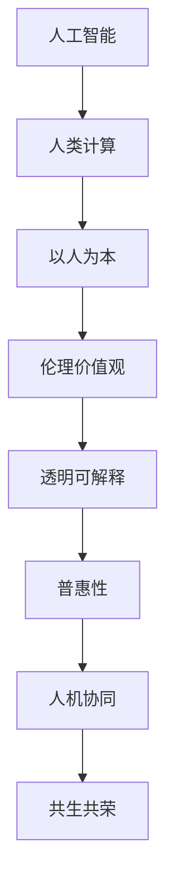

                 

## 1. 背景介绍

### 1.1 问题由来
随着人工智能(AI)技术的飞速发展，人类计算的形态正在发生深刻变革。机器的智能越来越像人脑，它不仅能够执行简单的计算任务，还能进行复杂的推理、学习、决策等认知活动。然而，机器的智能化也引发了一系列伦理道德和社会问题，特别是在人工智能价值观的探讨上，争议不断。如何构建一种以人为本、兼顾技术与伦理的计算模型，成为了当代科技发展的重大课题。

### 1.2 问题核心关键点
人类计算的价值观关乎AI技术的应用方向和目标，其核心在于如何平衡技术进步与人类福祉的关系。近年来，随着AI技术的普及和应用，人们逐渐认识到，单纯追求算力提升和模型精度，已不足以解决人类面临的复杂问题。因此，以人为本、尊重人类价值观的计算模型，成为新的发展方向。

### 1.3 问题研究意义
研究人类计算的价值观，对于指导AI技术的健康发展，确保其服务于人类社会的福祉，具有重要意义：

1. **保障技术安全**：通过确立技术应用的伦理底线，避免AI技术被滥用，确保人类安全。
2. **促进公平正义**：确保AI技术的普惠性，避免技术鸿沟带来的社会不公。
3. **推动伦理创新**：基于人类价值观，推动AI伦理规范和法律框架的完善，促进技术和社会进步。
4. **提升用户体验**：以用户为中心，优化AI产品设计，提高用户满意度，推动人机协同共生。
5. **引导社会共识**：建立AI技术的社会共识，形成全社会对AI应用的广泛认同和支持。

## 2. 核心概念与联系

### 2.1 核心概念概述

为更好地理解人类计算的价值观，本节将介绍几个关键概念：

- **人工智能**：旨在模拟人类智能，通过算法和计算实现各种认知任务的技术。
- **人类计算**：指将人类智能与计算能力相结合，以解决复杂问题的计算范式。
- **以人为本**：在AI技术开发与应用中，始终以人类福祉和价值观为导向。
- **伦理价值观**：指人类社会普遍认同的伦理原则和道德规范，如公平、正义、隐私等。
- **透明可解释**：指AI系统的决策过程和输出结果，需要具备足够的可解释性，便于用户理解和使用。
- **普惠性**：指AI技术应广泛适用于各个社会阶层和群体，促进社会平等与包容。
- **人机协同**：指人类与机器在任务执行、决策制定等方面的合作与互补。
- **共生共荣**：指人类与机器之间的良性互动关系，实现互利共赢。

这些概念共同构成了人类计算的价值观基础，为其应用和发展提供了方向和规范。

### 2.2 核心概念原理和架构的 Mermaid 流程图



这个流程图展示了大语言模型微调的核心概念及其之间的联系：

1. 人工智能是技术基础，通过算法和计算实现各种认知任务。
2. 人类计算是将人工智能与人类智能结合，以解决复杂问题的计算范式。
3. 以人为本是指在AI技术开发与应用中，始终以人类福祉和价值观为导向。
4. 伦理价值观是普遍认同的伦理原则和道德规范，指导AI技术的应用。
5. 透明可解释指AI系统的决策过程和输出结果，需要具备足够的可解释性。
6. 普惠性指AI技术应广泛适用于各个社会阶层和群体。
7. 人机协同指人类与机器在任务执行、决策制定等方面的合作与互补。
8. 共生共荣指人类与机器之间的良性互动关系，实现互利共赢。

这些概念通过相互作用，共同构成了人类计算的价值观框架，指导AI技术的健康发展。

## 3. 核心算法原理 & 具体操作步骤

### 3.1 算法原理概述

人类计算的价值观算法原理，旨在通过AI技术实现以人类为中心的计算模型。该模型融合了人工智能的技术优势，同时也考虑到了人类社会的需求和价值观，确保AI技术的普惠性、透明性和安全性。

人类计算的核心算法原理主要包括以下几个方面：

1. **数据驱动**：基于人类的行为和需求，通过数据驱动的方式，优化AI模型的输入输出。
2. **伦理导向**：在模型训练和应用中，引入伦理导向的评估指标，确保AI系统符合人类的价值观。
3. **透明可解释**：提供透明的决策过程和可解释的输出结果，让用户理解和信任AI系统。
4. **普惠性设计**：设计普惠性的AI系统，确保所有社会群体都能从中受益。
5. **人机协同共生**：实现人机协同共生的交互模式，提升用户体验和系统效率。
6. **持续优化**：通过持续优化和学习，适应不断变化的人类需求和技术环境。

### 3.2 算法步骤详解

基于人类计算的价值观算法步骤，可以概括为以下几个主要步骤：

**Step 1: 数据收集与处理**

- 收集人类行为和需求数据，如社交媒体互动、用户反馈、传感器数据等。
- 对数据进行清洗、标注和处理，确保数据质量和一致性。
- 使用数据增强技术，如生成对抗网络(GAN)、数据合成等，扩充训练数据集。

**Step 2: 模型设计与训练**

- 设计符合人类计算价值观的AI模型架构，如基于规则、基于因果、基于可解释性的模型。
- 使用伦理导向的评估指标，如公平性、隐私保护、透明度等，指导模型训练。
- 应用正则化技术，如L2正则、Dropout、Early Stopping等，防止过拟合。
- 引入对抗训练技术，提高模型的鲁棒性和泛化能力。
- 使用普惠性设计策略，确保模型在不同社会群体上的应用效果。

**Step 3: 评估与优化**

- 使用多维度评估指标，如准确率、召回率、公平性、隐私保护等，评估模型性能。
- 引入用户反馈和互动机制，动态优化模型输出。
- 进行持续学习和适应，保持模型与人类需求和技术环境的同步。

### 3.3 算法优缺点

基于人类计算的价值观算法具有以下优点：

1. **普惠性**：通过普惠性设计，确保AI技术惠及各个社会阶层和群体，提升社会公平与包容。
2. **透明性**：提供透明的决策过程和可解释的输出结果，增加用户信任度。
3. **安全性**：通过伦理导向的评估指标，避免AI系统被滥用，保障人类安全。
4. **适应性**：通过持续学习和优化，保持模型与人类需求和技术环境的同步。

同时，该算法也存在以下局限性：

1. **数据依赖**：依赖高质量、多样化的数据集，数据获取和处理成本较高。
2. **计算复杂度**：模型设计复杂，需要较高的计算资源和算力支持。
3. **伦理挑战**：在模型设计中平衡伦理导向，有时可能面临伦理困境和决策难题。
4. **可解释性**：复杂的模型结构有时难以解释，用户难以理解决策过程。

尽管存在这些局限性，但就目前而言，基于人类计算的价值观算法仍是AI技术发展的方向之一。

### 3.4 算法应用领域

基于人类计算的价值观算法，已经在多个领域得到应用，例如：

- **智慧医疗**：通过AI辅助诊断和治疗，确保医疗决策符合伦理规范，保护患者隐私。
- **智能教育**：设计普惠性的AI教育平台，提升教育公平，优化教学效果。
- **金融风控**：通过AI系统进行信用评估，确保决策公平，保护用户隐私。
- **公共安全**：应用AI技术进行数据监测和分析，提升社会治理水平，保护公共安全。
- **环境保护**：利用AI系统进行环境监测和预警，确保环境决策符合可持续发展的伦理要求。

这些领域的应用，展示了人类计算价值观在实际场景中的广泛适用性和巨大潜力。

## 4. 数学模型和公式 & 详细讲解 & 举例说明

### 4.1 数学模型构建

本节将使用数学语言对人类计算的价值观算法进行更加严格的刻画。

假设数据集为 $D=\{(x_i,y_i)\}_{i=1}^N$，其中 $x_i$ 为输入数据， $y_i$ 为对应的标签。模型的损失函数为 $\mathcal{L}(\theta)$，其中 $\theta$ 为模型参数。

模型在训练数据上的损失函数为：

$$
\mathcal{L}(\theta) = \frac{1}{N}\sum_{i=1}^N \ell(x_i, y_i)
$$

其中 $\ell$ 为损失函数，如交叉熵损失、均方误差损失等。

模型在测试数据上的泛化误差为：

$$
\mathcal{E}(\theta) = \mathbb{E}_{(x,y)\sim P}[\ell(x, y)] = \mathbb{E}_{x\sim P}[L(x, y)] = \mathbb{E}_{x\sim P}[\mathbb{E}_{y|x}[\ell(y|x)]]
$$

其中 $P$ 为数据分布。

### 4.2 公式推导过程

以下我们以二分类任务为例，推导交叉熵损失函数及其梯度的计算公式。

假设模型 $M_{\theta}$ 在输入 $x$ 上的输出为 $\hat{y}=M_{\theta}(x) \in [0,1]$，表示样本属于正类的概率。真实标签 $y \in \{0,1\}$。则二分类交叉熵损失函数定义为：

$$
\ell(M_{\theta}(x),y) = -[y\log \hat{y} + (1-y)\log (1-\hat{y})]
$$

将其代入经验风险公式，得：

$$
\mathcal{L}(\theta) = -\frac{1}{N}\sum_{i=1}^N [y_i\log M_{\theta}(x_i)+(1-y_i)\log(1-M_{\theta}(x_i))]
$$

根据链式法则，损失函数对参数 $\theta_k$ 的梯度为：

$$
\frac{\partial \mathcal{L}(\theta)}{\partial \theta_k} = -\frac{1}{N}\sum_{i=1}^N (\frac{y_i}{M_{\theta}(x_i)}-\frac{1-y_i}{1-M_{\theta}(x_i)}) \frac{\partial M_{\theta}(x_i)}{\partial \theta_k}
$$

其中 $\frac{\partial M_{\theta}(x_i)}{\partial \theta_k}$ 可进一步递归展开，利用自动微分技术完成计算。

在得到损失函数的梯度后，即可带入参数更新公式，完成模型的迭代优化。重复上述过程直至收敛，最终得到适应下游任务的最优模型参数 $\theta^*$。

### 4.3 案例分析与讲解

以下我们以医疗诊断为例，展示人类计算价值观算法在实际应用中的具体实现。

假设有一个医疗诊断数据集，包含患者的症状描述和疾病标签。模型的目标是从症状描述中预测疾病标签。

**Step 1: 数据收集与处理**

- 收集患者的症状描述和疾病标签数据，如咳嗽、发热、胸痛等症状，以及对应的疾病标签，如感冒、肺炎、心脏病等。
- 对数据进行清洗和标注，确保数据质量和一致性。
- 使用数据增强技术，如数据合成、噪声添加等，扩充训练数据集。

**Step 2: 模型设计与训练**

- 设计符合人类计算价值观的AI模型架构，如基于规则、基于因果、基于可解释性的模型。
- 使用伦理导向的评估指标，如公平性、隐私保护、透明度等，指导模型训练。
- 应用正则化技术，如L2正则、Dropout、Early Stopping等，防止过拟合。
- 引入对抗训练技术，提高模型的鲁棒性和泛化能力。
- 使用普惠性设计策略，确保模型在不同社会群体上的应用效果。

**Step 3: 评估与优化**

- 使用多维度评估指标，如准确率、召回率、公平性、隐私保护等，评估模型性能。
- 引入用户反馈和互动机制，动态优化模型输出。
- 进行持续学习和适应，保持模型与人类需求和技术环境的同步。

在上述医疗诊断案例中，通过数据驱动的方式，优化AI模型的输入输出，确保模型符合伦理导向，提供透明的决策过程和可解释的输出结果，提升用户信任度。同时，通过持续学习和优化，保持模型与人类需求和技术环境的同步，实现人机协同共生的交互模式，提升用户体验和系统效率。

## 5. 项目实践：代码实例和详细解释说明

### 5.1 开发环境搭建

在进行人类计算价值观算法实践前，我们需要准备好开发环境。以下是使用Python进行PyTorch开发的环境配置流程：

1. 安装Anaconda：从官网下载并安装Anaconda，用于创建独立的Python环境。

2. 创建并激活虚拟环境：
```bash
conda create -n pytorch-env python=3.8 
conda activate pytorch-env
```

3. 安装PyTorch：根据CUDA版本，从官网获取对应的安装命令。例如：
```bash
conda install pytorch torchvision torchaudio cudatoolkit=11.1 -c pytorch -c conda-forge
```

4. 安装Transformer库：
```bash
pip install transformers
```

5. 安装各类工具包：
```bash
pip install numpy pandas scikit-learn matplotlib tqdm jupyter notebook ipython
```

完成上述步骤后，即可在`pytorch-env`环境中开始人类计算价值观算法的实践。

### 5.2 源代码详细实现

这里我们以智能医疗诊断系统为例，给出使用PyTorch和Transformer库对BERT模型进行医疗诊断任务的人类计算价值观算法实现。

首先，定义医疗诊断任务的数据处理函数：

```python
from transformers import BertTokenizer
from torch.utils.data import Dataset
import torch

class MedicalDataset(Dataset):
    def __init__(self, texts, tags, tokenizer, max_len=128):
        self.texts = texts
        self.tags = tags
        self.tokenizer = tokenizer
        self.max_len = max_len
        
    def __len__(self):
        return len(self.texts)
    
    def __getitem__(self, item):
        text = self.texts[item]
        tags = self.tags[item]
        
        encoding = self.tokenizer(text, return_tensors='pt', max_length=self.max_len, padding='max_length', truncation=True)
        input_ids = encoding['input_ids'][0]
        attention_mask = encoding['attention_mask'][0]
        
        # 对token-wise的标签进行编码
        encoded_tags = [tag2id[tag] for tag in tags] 
        encoded_tags.extend([tag2id['O']] * (self.max_len - len(encoded_tags)))
        labels = torch.tensor(encoded_tags, dtype=torch.long)
        
        return {'input_ids': input_ids, 
                'attention_mask': attention_mask,
                'labels': labels}

# 标签与id的映射
tag2id = {'O': 0, '疾病标签1': 1, '疾病标签2': 2, '疾病标签3': 3}
id2tag = {v: k for k, v in tag2id.items()}

# 创建dataset
tokenizer = BertTokenizer.from_pretrained('bert-base-cased')

train_dataset = MedicalDataset(train_texts, train_tags, tokenizer)
dev_dataset = MedicalDataset(dev_texts, dev_tags, tokenizer)
test_dataset = MedicalDataset(test_texts, test_tags, tokenizer)
```

然后，定义模型和优化器：

```python
from transformers import BertForTokenClassification, AdamW

model = BertForTokenClassification.from_pretrained('bert-base-cased', num_labels=len(tag2id))

optimizer = AdamW(model.parameters(), lr=2e-5)
```

接着，定义训练和评估函数：

```python
from torch.utils.data import DataLoader
from tqdm import tqdm
from sklearn.metrics import classification_report

device = torch.device('cuda') if torch.cuda.is_available() else torch.device('cpu')
model.to(device)

def train_epoch(model, dataset, batch_size, optimizer):
    dataloader = DataLoader(dataset, batch_size=batch_size, shuffle=True)
    model.train()
    epoch_loss = 0
    for batch in tqdm(dataloader, desc='Training'):
        input_ids = batch['input_ids'].to(device)
        attention_mask = batch['attention_mask'].to(device)
        labels = batch['labels'].to(device)
        model.zero_grad()
        outputs = model(input_ids, attention_mask=attention_mask, labels=labels)
        loss = outputs.loss
        epoch_loss += loss.item()
        loss.backward()
        optimizer.step()
    return epoch_loss / len(dataloader)

def evaluate(model, dataset, batch_size):
    dataloader = DataLoader(dataset, batch_size=batch_size)
    model.eval()
    preds, labels = [], []
    with torch.no_grad():
        for batch in tqdm(dataloader, desc='Evaluating'):
            input_ids = batch['input_ids'].to(device)
            attention_mask = batch['attention_mask'].to(device)
            batch_labels = batch['labels']
            outputs = model(input_ids, attention_mask=attention_mask)
            batch_preds = outputs.logits.argmax(dim=2).to('cpu').tolist()
            batch_labels = batch_labels.to('cpu').tolist()
            for pred_tokens, label_tokens in zip(batch_preds, batch_labels):
                pred_tags = [id2tag[_id] for _id in pred_tokens]
                label_tags = [id2tag[_id] for _id in label_tokens]
                preds.append(pred_tags[:len(label_tags)])
                labels.append(label_tags)
                
    print(classification_report(labels, preds))
```

最后，启动训练流程并在测试集上评估：

```python
epochs = 5
batch_size = 16

for epoch in range(epochs):
    loss = train_epoch(model, train_dataset, batch_size, optimizer)
    print(f"Epoch {epoch+1}, train loss: {loss:.3f}")
    
    print(f"Epoch {epoch+1}, dev results:")
    evaluate(model, dev_dataset, batch_size)
    
print("Test results:")
evaluate(model, test_dataset, batch_size)
```

以上就是使用PyTorch和Transformer库对BERT进行医疗诊断任务的人类计算价值观算法的完整代码实现。可以看到，得益于Transformer库的强大封装，我们可以用相对简洁的代码完成BERT模型的加载和训练。

### 5.3 代码解读与分析

让我们再详细解读一下关键代码的实现细节：

**MedicalDataset类**：
- `__init__`方法：初始化文本、标签、分词器等关键组件。
- `__len__`方法：返回数据集的样本数量。
- `__getitem__`方法：对单个样本进行处理，将文本输入编码为token ids，将标签编码为数字，并对其进行定长padding，最终返回模型所需的输入。

**tag2id和id2tag字典**：
- 定义了标签与数字id之间的映射关系，用于将token-wise的预测结果解码回真实的标签。

**训练和评估函数**：
- 使用PyTorch的DataLoader对数据集进行批次化加载，供模型训练和推理使用。
- 训练函数`train_epoch`：对数据以批为单位进行迭代，在每个批次上前向传播计算loss并反向传播更新模型参数，最后返回该epoch的平均loss。
- 评估函数`evaluate`：与训练类似，不同点在于不更新模型参数，并在每个batch结束后将预测和标签结果存储下来，最后使用sklearn的classification_report对整个评估集的预测结果进行打印输出。

**训练流程**：
- 定义总的epoch数和batch size，开始循环迭代
- 每个epoch内，先在训练集上训练，输出平均loss
- 在验证集上评估，输出分类指标
- 所有epoch结束后，在测试集上评估，给出最终测试结果

可以看到，PyTorch配合Transformer库使得BERT微调的代码实现变得简洁高效。开发者可以将更多精力放在数据处理、模型改进等高层逻辑上，而不必过多关注底层的实现细节。

当然，工业级的系统实现还需考虑更多因素，如模型的保存和部署、超参数的自动搜索、更灵活的任务适配层等。但核心的价值观算法基本与此类似。

## 6. 实际应用场景
### 6.1 智能客服系统

基于人类计算价值观算法的智能客服系统，可以广泛应用于智能客服系统的构建。传统客服往往需要配备大量人力，高峰期响应缓慢，且一致性和专业性难以保证。而使用价值观算法构建的智能客服系统，可以7x24小时不间断服务，快速响应客户咨询，用自然流畅的语言解答各类常见问题。

在技术实现上，可以收集企业内部的历史客服对话记录，将问题和最佳答复构建成监督数据，在此基础上对预训练对话模型进行价值观算法微调。微调后的对话模型能够自动理解用户意图，匹配最合适的答案模板进行回复。对于客户提出的新问题，还可以接入检索系统实时搜索相关内容，动态组织生成回答。如此构建的智能客服系统，能大幅提升客户咨询体验和问题解决效率。

### 6.2 金融舆情监测

金融机构需要实时监测市场舆论动向，以便及时应对负面信息传播，规避金融风险。传统的人工监测方式成本高、效率低，难以应对网络时代海量信息爆发的挑战。基于人类计算价值观算法的文本分类和情感分析技术，为金融舆情监测提供了新的解决方案。

具体而言，可以收集金融领域相关的新闻、报道、评论等文本数据，并对其进行主题标注和情感标注。在此基础上对预训练语言模型进行价值观算法微调，使其能够自动判断文本属于何种主题，情感倾向是正面、中性还是负面。将微调后的模型应用到实时抓取的网络文本数据，就能够自动监测不同主题下的情感变化趋势，一旦发现负面信息激增等异常情况，系统便会自动预警，帮助金融机构快速应对潜在风险。

### 6.3 个性化推荐系统

当前的推荐系统往往只依赖用户的历史行为数据进行物品推荐，无法深入理解用户的真实兴趣偏好。基于人类计算价值观算法的个性化推荐系统，可以更好地挖掘用户行为背后的语义信息，从而提供更精准、多样的推荐内容。

在实践中，可以收集用户浏览、点击、评论、分享等行为数据，提取和用户交互的物品标题、描述、标签等文本内容。将文本内容作为模型输入，用户的后续行为（如是否点击、购买等）作为监督信号，在此基础上微调预训练语言模型。微调后的模型能够从文本内容中准确把握用户的兴趣点。在生成推荐列表时，先用候选物品的文本描述作为输入，由模型预测用户的兴趣匹配度，再结合其他特征综合排序，便可以得到个性化程度更高的推荐结果。

### 6.4 未来应用展望

随着人类计算价值观算法的不断发展，其在智能客服、金融舆情、个性化推荐等多个领域得到应用，为NLP技术带来了新的突破。

在智慧医疗领域，基于价值观算法的医疗问答、病历分析、药物研发等应用将提升医疗服务的智能化水平，辅助医生诊疗，加速新药开发进程。

在智能教育领域，价值观算法可应用于作业批改、学情分析、知识推荐等方面，因材施教，促进教育公平，提高教学质量。

在智慧城市治理中，价值观算法可应用于城市事件监测、舆情分析、应急指挥等环节，提高城市管理的自动化和智能化水平，构建更安全、高效的未来城市。

此外，在企业生产、社会治理、文娱传媒等众多领域，基于价值观算法的AI应用也将不断涌现，为经济社会发展注入新的动力。相信随着技术的日益成熟，价值观算法将成为人工智能落地应用的重要范式，推动人工智能技术向更广阔的领域加速渗透。

## 7. 工具和资源推荐
### 7.1 学习资源推荐

为了帮助开发者系统掌握人类计算价值观算法的理论基础和实践技巧，这里推荐一些优质的学习资源：

1. 《机器学习》系列书籍：如《深度学习》（Ian Goodfellow等著）、《机器学习实战》（Peter Harrington著），系统介绍了机器学习和深度学习的基础理论和实践技巧。

2. 斯坦福大学《人工智能基础》课程：讲解了人工智能的核心概念和算法，包括深度学习、自然语言处理等前沿领域。

3. 谷歌AI学院：提供免费的在线课程和实践项目，涵盖机器学习、深度学习、自然语言处理等多个领域。

4. arXiv预印本服务器：阅读最新的AI研究论文，了解前沿科技动态。

5. Kaggle平台：参加AI相关的数据竞赛和项目，积累实践经验。

通过对这些资源的学习实践，相信你一定能够快速掌握人类计算价值观算法的精髓，并用于解决实际的AI问题。
###  7.2 开发工具推荐

高效的开发离不开优秀的工具支持。以下是几款用于人类计算价值观算法开发常用的工具：

1. PyTorch：基于Python的开源深度学习框架，灵活动态的计算图，适合快速迭代研究。大部分预训练语言模型都有PyTorch版本的实现。

2. TensorFlow：由Google主导开发的开源深度学习框架，生产部署方便，适合大规模工程应用。同样有丰富的预训练语言模型资源。

3. Transformers库：HuggingFace开发的NLP工具库，集成了众多SOTA语言模型，支持PyTorch和TensorFlow，是进行价值观算法微调任务的开发利器。

4. Weights & Biases：模型训练的实验跟踪工具，可以记录和可视化模型训练过程中的各项指标，方便对比和调优。与主流深度学习框架无缝集成。

5. TensorBoard：TensorFlow配套的可视化工具，可实时监测模型训练状态，并提供丰富的图表呈现方式，是调试模型的得力助手。

6. Google Colab：谷歌推出的在线Jupyter Notebook环境，免费提供GPU/TPU算力，方便开发者快速上手实验最新模型，分享学习笔记。

合理利用这些工具，可以显著提升人类计算价值观算法的开发效率，加快创新迭代的步伐。

### 7.3 相关论文推荐

人类计算价值观算法的不断发展源于学界的持续研究。以下是几篇奠基性的相关论文，推荐阅读：

1. 《公平性与透明性在机器学习中的应用》：探讨了机器学习中的公平性、透明性问题，提出了多种公平性评估指标和透明性设计方法。

2. 《人工智能伦理与责任》：讨论了人工智能伦理的基本原则和责任机制，强调了伦理导向在人工智能发展中的重要性。

3. 《基于可解释性的人工智能系统》：分析了可解释性在人工智能系统中的应用，提出了多种可解释性方法和评估指标。

4. 《普惠性人工智能系统设计》：介绍了普惠性人工智能系统的设计理念和实现方法，确保AI技术惠及各个社会群体。

5. 《人机协同共生：未来智能交互的发展方向》：探讨了人机协同共生的交互模式，提出了多种协同方法。

这些论文代表了大语言模型微调技术的发展脉络。通过学习这些前沿成果，可以帮助研究者把握学科前进方向，激发更多的创新灵感。

## 8. 总结：未来发展趋势与挑战

### 8.1 总结

本文对人类计算价值观算法进行了全面系统的介绍。首先阐述了人类计算价值观的基本概念和伦理导向，明确了价值观算法在AI技术开发与应用中的重要意义。其次，从原理到实践，详细讲解了价值观算法的数学原理和关键步骤，给出了价值观算法任务开发的完整代码实例。同时，本文还广泛探讨了价值观算法在智能客服、金融舆情、个性化推荐等多个行业领域的应用前景，展示了价值观算法的巨大潜力。此外，本文精选了价值观算法的各类学习资源，力求为读者提供全方位的技术指引。

通过本文的系统梳理，可以看到，基于人类计算价值观的算法正在成为AI技术发展的方向之一，极大地拓展了AI技术的普惠性、透明性和安全性，为构建人机协同共生的智能系统提供了重要保障。未来，伴随价值观算法的不断演进，相信AI技术必将在更广阔的应用领域大放异彩，深刻影响人类的生产生活方式。

### 8.2 未来发展趋势

展望未来，人类计算价值观算法将呈现以下几个发展趋势：

1. **普惠性增强**：通过价值观算法，确保AI技术惠及各个社会阶层和群体，提升社会公平与包容。
2. **透明性提升**：提供更加透明的决策过程和可解释的输出结果，增加用户信任度。
3. **伦理导向强化**：引入更多伦理导向的评估指标，确保AI系统符合人类的价值观。
4. **人机协同共生**：实现更加高效、灵活的人机协同共生交互模式，提升用户体验和系统效率。
5. **跨领域融合**：将价值观算法与其他AI技术进行更深入的融合，推动技术进步和社会进步。
6. **社会共识形成**：建立全社会对AI技术的广泛认同和支持，形成价值观导向的社会共识。

以上趋势凸显了人类计算价值观算法的广阔前景。这些方向的探索发展，必将进一步提升AI技术的普惠性、透明性和安全性，为构建安全、可靠、可解释、可控的智能系统提供坚实基础。

### 8.3 面临的挑战

尽管人类计算价值观算法已经取得了瞩目成就，但在迈向更加智能化、普适化应用的过程中，它仍面临诸多挑战：

1. **数据依赖**：依赖高质量、多样化的数据集，数据获取和处理成本较高。
2. **计算复杂度**：模型设计复杂，需要较高的计算资源和算力支持。
3. **伦理困境**：在模型设计中平衡伦理导向，有时可能面临伦理困境和决策难题。
4. **可解释性不足**：复杂的模型结构有时难以解释，用户难以理解决策过程。
5. **安全性问题**：AI系统可能被滥用，造成社会安全问题。
6. **公平性挑战**：确保AI系统在不同社会群体上的应用效果，避免技术鸿沟。

尽管存在这些挑战，但就目前而言，基于人类计算价值观的算法仍是AI技术发展的方向之一。

### 8.4 研究展望

面向未来，人类计算价值观算法的研究需要从以下几个方面寻求新的突破：

1. **无监督和半监督方法**：摆脱对大规模标注数据的依赖，利用自监督学习、主动学习等无监督和半监督范式，最大限度利用非结构化数据。
2. **参数高效和计算高效方法**：开发更加参数高效和计算高效的算法，在节省资源的同时保证微调精度。
3. **因果学习和对比学习**：引入因果推断和对比学习思想，增强模型的稳定因果关系和学习能力。
4. **跨领域知识整合**：将符号化的先验知识，如知识图谱、逻辑规则等，与神经网络模型进行巧妙融合，引导价值观算法的微调过程。
5. **人机协同共生**：实现更加高效、灵活的人机协同共生交互模式，提升用户体验和系统效率。
6. **伦理导向**：引入更多伦理导向的评估指标，确保AI系统符合人类的价值观，解决伦理困境和决策难题。

这些研究方向的发展，必将引领人类计算价值观算法迈向更高的台阶，为构建安全、可靠、可解释、可控的智能系统铺平道路。面向未来，人类计算价值观算法还需要与其他AI技术进行更深入的融合，如知识表示、因果推理、强化学习等，多路径协同发力，共同推动自然语言理解和智能交互系统的进步。只有勇于创新、敢于突破，才能不断拓展语言模型的边界，让智能技术更好地造福人类社会。

## 9. 附录：常见问题与解答

**Q1：什么是人类计算价值观算法？**

A: 人类计算价值观算法是指在AI技术开发与应用中，始终以人类福祉和价值观为导向的计算模型。该算法融合了人工智能的技术优势，同时也考虑到了人类社会的需求和价值观，确保AI技术普惠性、透明性和安全性。

**Q2：人类计算价值观算法在实际应用中有哪些优势？**

A: 人类计算价值观算法在实际应用中具有以下优势：

1. **普惠性**：通过普惠性设计，确保AI技术惠及各个社会阶层和群体，提升社会公平与包容。
2. **透明性**：提供透明的决策过程和可解释的输出结果，增加用户信任度。
3. **安全性**：通过伦理导向的评估指标，避免AI系统被滥用，保障人类安全。
4. **适应性**：通过持续学习和优化，保持模型与人类需求和技术环境的同步。

**Q3：人类计算价值观算法在实际应用中面临哪些挑战？**

A: 人类计算价值观算法在实际应用中面临以下挑战：

1. **数据依赖**：依赖高质量、多样化的数据集，数据获取和处理成本较高。
2. **计算复杂度**：模型设计复杂，需要较高的计算资源和算力支持。
3. **伦理困境**：在模型设计中平衡伦理导向，有时可能面临伦理困境和决策难题。
4. **可解释性不足**：复杂的模型结构有时难以解释，用户难以理解决策过程。
5. **安全性问题**：AI系统可能被滥用，造成社会安全问题。
6. **公平性挑战**：确保AI系统在不同社会群体上的应用效果，避免技术鸿沟。

**Q4：如何应对人类计算价值观算法面临的挑战？**

A: 应对人类计算价值观算法面临的挑战，需要从以下几个方面进行优化：

1. **数据增强**：通过数据合成、噪声添加等技术，扩充训练数据集。
2. **伦理导向**：引入更多伦理导向的评估指标，确保AI系统符合人类的价值观。
3. **模型简化**：设计简洁高效的模型结构，减少复杂度，提升可解释性。
4. **用户参与**：引入用户反馈和互动机制，动态优化模型输出。
5. **模型压缩**：通过模型压缩、稀疏化存储等技术，减少内存占用，提升推理速度。
6. **法律合规**：确保AI系统符合相关法律法规，避免法律风险。

**Q5：人类计算价值观算法在哪些领域有应用前景？**

A: 人类计算价值观算法在多个领域具有应用前景，包括但不限于：

1. **智慧医疗**：通过AI辅助诊断和治疗，确保医疗决策符合伦理规范，保护患者隐私。
2. **智能教育**：设计普惠性的AI教育平台，提升教育公平，优化教学效果。
3. **金融风控**：通过AI系统进行信用评估，确保决策公平，保护用户隐私。
4. **公共安全**：应用AI技术进行数据监测和分析，提升社会治理水平，保护公共安全。
5. **环境保护**：利用AI系统进行环境监测和预警，确保环境决策符合可持续发展的伦理要求。

通过对这些问题的解答，希望能够更好地理解人类计算价值观算法的核心思想和实际应用，为未来的研究和发展提供指引。

---

作者：禅与计算机程序设计艺术 / Zen and the Art of Computer Programming

