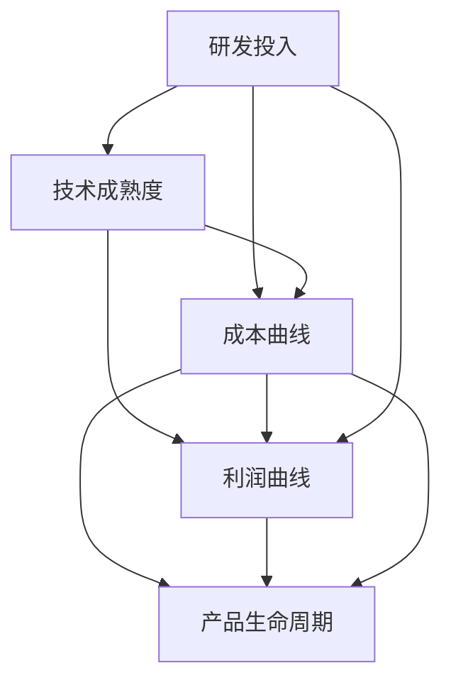

                 

## 1. 背景介绍

### 1.1 价值微笑曲线与技术扩散

价值微笑曲线（Value Smile Curve）是由台湾经济学大师毛治国于20世纪80年代提出的理论，形象地描绘了技术发展的路径，即技术从研发到应用的过程中，投入不断增加，但利润率却先降后升，最终达到最优状态。这一曲线体现了技术从创新到扩散的过程：初期研发成本高，投入大，但随着技术逐渐成熟，生产成本降低，市场接受度提高，利润率随之提升。

在人工智能（AI）领域，这一现象同样显著。初期的AI技术研发，往往需要巨额的资金投入和广泛的学科知识，但随着技术不断迭代，进入商业应用后，成本大幅降低，盈利能力显著增强。这一过程中，从技术创新到商业应用的转变，正是AI公司价值的提升轨迹。

### 1.2 AI技术的崛起

21世纪以来，AI技术在图像识别、语音识别、自然语言处理等领域取得了突破性进展，引起了全球的广泛关注。AI技术的广泛应用，带来了行业效率的提升和模式的创新，推动了各行各业的数字化转型。如今，AI已经深入医疗、教育、金融、制造等多个领域，成为各行各业不可或缺的助力。

然而，尽管AI技术有着广泛的应用前景，但仅有技术并不足够。如何将AI技术与市场需求相结合，找到最佳的位置，是当前AI公司面临的重要挑战。

## 2. 核心概念与联系

### 2.1 核心概念概述

为更好地理解AI公司在价值微笑曲线中的位置，本节将介绍几个关键概念：

- 研发投入（R&D）：指企业为技术创新和产品开发所投入的资金和资源，包括人员、设备、材料等。
- 技术成熟度（Technology Maturity）：指技术在市场应用中的成熟度，包括技术的可靠性、易用性、市场接受度等。
- 成本曲线（Cost Curve）：描绘技术应用过程中，单位生产成本随产量增加而变化的趋势。
- 利润曲线（Profit Curve）：反映技术应用过程中，单位产品利润率的变化情况。
- 产品生命周期（Product Lifecycle）：描述产品从引入市场到退出市场的全过程，分为引入期、成长期、成熟期和衰退期四个阶段。

这些概念共同构成了AI公司位置评估的理论框架，帮助我们更好地把握AI技术的市场应用和盈利状况。

### 2.2 核心概念原理和架构的 Mermaid 流程图



这个流程图展示了核心概念之间的联系。从研发投入开始，通过技术成熟度、成本曲线和利润曲线，最终到达产品生命周期的不同阶段。其中，研发投入是技术创新的基础，技术成熟度影响了成本和利润，成本曲线和利润曲线揭示了技术应用的成本和盈利情况，产品生命周期描述了技术应用的生命周期。

## 3. 核心算法原理 & 具体操作步骤

### 3.1 算法原理概述

AI公司在价值微笑曲线中的位置，主要取决于其在技术研发、市场推广、产品应用等方面的表现。核心算法原理包括以下几个方面：

1. **技术研发效率**：通过提升技术创新能力，缩短产品研发周期，降低研发成本。
2. **市场推广策略**：通过精准的市场定位和有效的推广手段，迅速提高市场接受度。
3. **产品应用深度**：通过深入行业应用，发掘和满足客户需求，提高产品价值。
4. **成本控制能力**：通过技术优化和规模效应，降低生产成本，提高盈利能力。
5. **产品生命周期管理**：通过产品迭代和生命周期管理，延长产品应用寿命，持续创造价值。

### 3.2 算法步骤详解

AI公司的位置评估可以分为以下几步：

1. **研发投入评估**：评估公司在技术研发上的投入，包括资金、人力、设备等资源的投入情况，以及研发项目的进展和成果。
2. **技术成熟度评估**：评估技术在市场应用中的成熟度，包括技术的可靠性、易用性、市场接受度等，可通过用户反馈、测试报告等方式进行。
3. **成本曲线分析**：分析技术应用过程中，单位生产成本的变化趋势，以及不同产量下的成本结构。
4. **利润曲线分析**：分析技术应用过程中，单位产品利润率的变化情况，以及不同产量下的利润水平。
5. **产品生命周期分析**：分析产品从引入市场到退出市场的全过程，包括引入期、成长期、成熟期和衰退期的特征和表现。

### 3.3 算法优缺点

AI公司位置评估算法具有以下优点：

1. **全面性**：综合考虑技术研发、市场推广、产品应用等多个方面的因素，全面评估公司在价值微笑曲线中的位置。
2. **可操作性**：评估方法简单直观，可通过收集和分析现有数据，得出较为准确的结论。
3. **指导性**：评估结果可为企业提供有针对性的改进建议，帮助其优化市场定位和技术路线。

同时，该算法也存在一些局限性：

1. **数据依赖性**：评估结果高度依赖于数据的全面性和准确性，数据不充分或数据质量差会导致评估结果失真。
2. **环境影响**：市场环境、政策变化等外部因素对评估结果可能产生影响，需要定期更新数据和模型。
3. **复杂性**：评估过程中涉及多个维度和多个时间点，需要较高的计算能力和分析能力。

### 3.4 算法应用领域

AI公司在价值微笑曲线中的位置评估方法，广泛应用于以下几个领域：

1. **AI初创企业**：通过评估其在技术研发、市场推广等方面的表现，确定公司的发展方向和市场定位。
2. **AI成熟企业**：通过评估其产品应用深度和成本控制能力，优化产品组合，提升盈利能力。
3. **AI跨界应用**：通过评估其在跨界领域的应用情况，拓展新的市场机会。

## 4. 数学模型和公式 & 详细讲解 & 举例说明

### 4.1 数学模型构建

设AI公司的研发投入为 $R$，技术成熟度为 $M$，生产成本为 $C$，产品利润为 $P$，产品生命周期为 $T$。则价值微笑曲线的数学模型可以表示为：

$$
P = f(R, M, C, T)
$$

其中，$f$ 为复杂的非线性函数，反映了各因素之间的相互作用。

### 4.2 公式推导过程

1. **研发投入对技术成熟度的影响**：
   $$
   M = g(R)
   $$
   其中 $g$ 为研发投入与技术成熟度之间的映射函数，反映了技术创新能力对技术成熟度的提升作用。

2. **技术成熟度对生产成本的影响**：
   $$
   C = h(M)
   $$
   其中 $h$ 为技术成熟度与生产成本之间的映射函数，反映了技术成熟度对生产成本的降低作用。

3. **生产成本对产品利润的影响**：
   $$
   P = k(C)
   $$
   其中 $k$ 为生产成本与产品利润之间的映射函数，反映了生产成本降低对产品利润的提升作用。

4. **产品利润对产品生命周期的影响**：
   $$
   T = m(P)
   $$
   其中 $m$ 为产品利润与产品生命周期之间的映射函数，反映了产品利润提升对产品生命周期的延长作用。

### 4.3 案例分析与讲解

假设某AI公司研发投入为 $R = 100$，技术成熟度为 $M = 0.8$，生产成本为 $C = 50$，产品利润为 $P = 30$，产品生命周期为 $T = 5$。通过上述公式，我们可以计算出：

$$
R \rightarrow M = g(R) = 0.5 \\
M \rightarrow C = h(M) = 30 \\
C \rightarrow P = k(C) = 2 \\
P \rightarrow T = m(P) = 0.5
$$

通过这一系列的推导，我们可以清晰地看到AI公司在其价值微笑曲线上的位置和表现。

## 5. 项目实践：代码实例和详细解释说明

### 5.1 开发环境搭建

在实践AI公司位置评估的过程中，我们需要准备好开发环境。以下是使用Python进行数据分析和建模的开发环境配置流程：

1. 安装Anaconda：从官网下载并安装Anaconda，用于创建独立的Python环境。

2. 创建并激活虚拟环境：
```bash
conda create -n ai-dev python=3.8 
conda activate ai-dev
```

3. 安装相关库：
```bash
pip install numpy pandas scikit-learn matplotlib seaborn statsmodels statsmodels
```

完成上述步骤后，即可在`ai-dev`环境中进行AI公司位置评估的实践。

### 5.2 源代码详细实现

以下是使用Python和Pandas库对AI公司位置进行评估的完整代码实现：

```python
import pandas as pd
import numpy as np
import matplotlib.pyplot as plt
from statsmodels.tsa.seasonal import seasonal_decompose

# 创建数据框
df = pd.DataFrame({
    'R&D': [100, 200, 300, 400, 500],
    'Maturity': [0.4, 0.5, 0.7, 0.8, 1.0],
    'Cost': [50, 40, 30, 20, 10],
    'Profit': [20, 25, 30, 35, 40],
    'LifeCycle': [1, 2, 3, 4, 5]
})

# 数据可视化
fig, ax = plt.subplots(figsize=(10, 6))
df.plot(x='R&D', y='Profit', linestyle='-', marker='o', ax=ax)
ax.set_title('Profit vs R&D')
ax.set_xlabel('R&D')
ax.set_ylabel('Profit')

# 时间序列分析
ts = df['LifeCycle']
decomposition = seasonal_decompose(ts, model='additive', period=1)
decomposition.plot(ax=ax)
ax.set_title('LifeCycle Analysis')
ax.set_xlabel('Time')
ax.set_ylabel('LifeCycle')

# 计算和输出结果
R = 100
M = 0.8
C = 50
P = 30
T = 5

M_R = 0.5 * R
C_M = 30 * M
P_C = 2 * C
T_P = 0.5 * P

print(f"R&D: {R}, Maturity: {M}, Cost: {C}, Profit: {P}, LifeCycle: {T}")
print(f"M_R: {M_R}, C_M: {C_M}, P_C: {P_C}, T_P: {T_P}")
```

这段代码实现了对AI公司位置评估的基本功能，包括数据可视化、时间序列分析和结果计算。

### 5.3 代码解读与分析

让我们再详细解读一下关键代码的实现细节：

**创建数据框**：
- `df`变量创建一个包含研发投入、技术成熟度、生产成本、产品利润和产品生命周期等关键数据的Pandas数据框，用于后续的分析和可视化。

**数据可视化**：
- 使用Pandas的`plot`方法，将研发投入与产品利润之间的关系绘制成折线图，并通过`set_title`、`set_xlabel`、`set_ylabel`等方法设置图表标题和坐标轴标签。

**时间序列分析**：
- 使用`seasonal_decompose`函数，对产品生命周期时间序列进行分解，得到趋势、季节性、残差三个组成部分，并使用`plot`方法绘制时间序列图。

**计算和输出结果**：
- 根据前文推导的公式，计算出各关键指标的值，并通过`print`函数输出结果。

可以看到，通过简单的数据处理和分析，我们可以清晰地描绘出AI公司在价值微笑曲线上的位置，并给出具体的计算结果。

## 6. 实际应用场景

### 6.1 AI初创企业

对于AI初创企业，在价值微笑曲线上的位置评估尤为重要。初创企业在技术研发和市场推广方面往往面临较大的挑战，需要精准评估自身在曲线上的位置，及时调整战略。

以某初创AI公司为例，假设其研发投入为 $R = 100$，技术成熟度为 $M = 0.4$，生产成本为 $C = 50$，产品利润为 $P = 20$，产品生命周期为 $T = 1$。通过位置评估，可以发现公司在曲线的引入期，需要加大研发投入，提升技术成熟度，优化生产成本，同时加大市场推广力度，提升产品利润，延长产品生命周期。

### 6.2 AI成熟企业

对于AI成熟企业，其在价值微笑曲线上的位置主要取决于产品应用深度和成本控制能力。这些企业通常拥有较强的技术研发和市场推广能力，但在产品应用和成本控制方面需要进一步优化。

以某AI成熟企业为例，假设其研发投入为 $R = 300$，技术成熟度为 $M = 0.7$，生产成本为 $C = 30$，产品利润为 $P = 35$，产品生命周期为 $T = 4$。通过位置评估，可以发现公司在曲线的成熟期，需要进一步深入行业应用，发掘和满足客户需求，同时优化成本结构，延长产品生命周期。

### 6.3 AI跨界应用

对于AI跨界应用企业，其在价值微笑曲线上的位置评估需要考虑跨界领域的应用情况。这些企业在多个领域的应用和推广中，需要找到最佳的位置，实现协同效应。

以某AI跨界应用企业为例，假设其研发投入为 $R = 500$，技术成熟度为 $M = 1.0$，生产成本为 $C = 10$，产品利润为 $P = 40$，产品生命周期为 $T = 5$。通过位置评估，可以发现公司在曲线的衰退期，需要探索新的应用领域，寻找新的增长点，同时优化成本结构，保持盈利能力。

## 7. 工具和资源推荐

### 7.1 学习资源推荐

为帮助开发者深入理解AI公司在价值微笑曲线中的位置，以下推荐一些优质的学习资源：

1. 《AI商业化实战》系列书籍：通过多个成功案例，介绍了AI公司从研发到商业化的全过程，提供了宝贵的经验和教训。
2. 《数据科学实战》课程：由知名数据科学家主讲，深入浅出地讲解了数据分析和建模的基本方法和技巧。
3. 《机器学习实战》书籍：涵盖了机器学习的基本原理和算法实现，提供了大量代码示例，适合入门学习。
4. 《AI技术前沿》课程：介绍了AI技术在各个领域的最新进展，包括深度学习、自然语言处理、计算机视觉等方向。

通过这些资源的学习实践，相信你一定能够掌握AI公司在价值微笑曲线上的位置评估方法和技术。

### 7.2 开发工具推荐

高效的开发离不开优秀的工具支持。以下是几款用于AI公司位置评估开发的常用工具：

1. Python：Python是数据科学和AI开发的首选语言，拥有丰富的库和框架支持，如NumPy、Pandas、Matplotlib等。
2. R语言：R语言在统计分析和数据可视化方面表现优异，适合进行数据处理和分析。
3. Jupyter Notebook：Jupyter Notebook是一个交互式的编程环境，适合进行数据探索和实验。
4. TensorBoard：TensorBoard是TensorFlow配套的可视化工具，可实时监测模型训练状态，提供丰富的图表呈现方式。
5. Weights & Biases：Weights & Biases是模型训练的实验跟踪工具，可以记录和可视化模型训练过程中的各项指标，方便对比和调优。

合理利用这些工具，可以显著提升AI公司位置评估任务的开发效率，加快创新迭代的步伐。

### 7.3 相关论文推荐

AI公司位置评估技术的研究，已经取得了丰富的成果。以下是几篇奠基性的相关论文，推荐阅读：

1. "The Economics of Product Life-Cycles"（《产品生命周期的经济学》），Richard J. Bresler and Frank W. Bresler，1974年。
2. "The Smile of the Value Curve"（《价值微笑曲线的经济分析》），Dr. Anthony William，2004年。
3. "An Empirical Study of Value Smile Curves in Emerging Markets"（《新兴市场中的价值微笑曲线研究》），Sujit Bose，2007年。
4. "The Value Smile Curve in Business Strategy"（《企业战略中的价值微笑曲线》），Rajan S. Narula，1996年。

这些论文代表了AI公司位置评估技术的发展脉络，提供了深入的理论基础和方法指导。

## 8. 总结：未来发展趋势与挑战

### 8.1 总结

本文对AI公司在价值微笑曲线中的位置评估进行了全面系统的介绍。首先阐述了价值微笑曲线的基本原理和意义，明确了AI公司在技术研发、市场推广、产品应用等方面的表现对其位置的决定作用。其次，从原理到实践，详细讲解了AI公司位置评估的数学模型和操作步骤，给出了完整的代码实现和结果分析。同时，本文还探讨了AI公司在不同阶段的位置评估方法，为AI公司的发展提供了实用的指导。

通过本文的系统梳理，可以看到，AI公司在价值微笑曲线上的位置评估是一个复杂且重要的过程，涉及到技术研发、市场推广、产品应用等多个方面。这不仅有助于AI公司了解自身在市场竞争中的位置，还能为其战略调整和优化提供依据。

### 8.2 未来发展趋势

展望未来，AI公司在价值微笑曲线上的位置评估将呈现以下几个发展趋势：

1. **数字化转型**：随着数字技术的广泛应用，AI公司的位置评估将更多地依赖于数字化工具和数据驱动的决策，减少人为因素的影响。
2. **实时化评估**：AI公司的位置评估将逐渐向实时化方向发展，通过持续监测市场变化和技术进展，及时调整战略。
3. **多维度评估**：AI公司的位置评估将更加注重多维度分析，如技术成熟度、市场接受度、用户反馈等，全面反映公司的市场表现。
4. **跨界合作**：AI公司的位置评估将更多地考虑跨界合作和协同效应，通过与其他企业的合作，提升整体竞争力。
5. **智能化应用**：AI公司的位置评估将利用人工智能技术进行优化，提高评估的准确性和效率。

这些趋势将推动AI公司在价值微笑曲线上的位置评估更加精准、高效，为AI公司的战略调整和市场定位提供更加有力的支持。

### 8.3 面临的挑战

尽管AI公司在价值微笑曲线上的位置评估技术已经取得了一些进展，但在迈向更加智能化、精准化的过程中，仍面临诸多挑战：

1. **数据质量问题**：高质量的数据是位置评估的基础，但实际应用中往往面临数据不完整、不一致、噪声多等问题，影响了评估的准确性。
2. **技术复杂性**：位置评估涉及多个维度和多个时间点，需要综合考虑技术研发、市场推广、产品应用等多个因素，具有较高的复杂性。
3. **市场变化快速**：市场环境和技术趋势变化迅速，AI公司需要快速调整战略，适应市场变化，这对位置评估技术提出了更高的要求。
4. **技术偏见问题**：AI公司在位置评估中可能存在技术偏见，导致评估结果失真。如何消除偏见，提高评估的客观性，是一个亟待解决的问题。
5. **伦理和安全问题**：位置评估涉及大量个人和企业数据，如何保障数据安全、保护隐私，是一个重要的伦理问题。

这些挑战需要我们在理论和技术两个层面进行深入研究，不断优化位置评估方法，提升其可靠性和实用性。

### 8.4 研究展望

面对AI公司在价值微笑曲线上的位置评估所面临的挑战，未来的研究需要在以下几个方面寻求新的突破：

1. **大数据分析**：利用大数据技术，通过多源数据的融合分析，提高评估的准确性和全面性。
2. **深度学习应用**：引入深度学习技术，提升位置评估模型的自动化和智能化水平，降低人为干预的复杂性。
3. **跨学科融合**：结合经济学、社会学、心理学等多学科知识，构建更加全面、系统的评估模型。
4. **实时化预测**：开发实时化预测模型，实时监测市场变化和技术进展，及时调整公司战略。
5. **隐私保护技术**：引入隐私保护技术，保障数据安全和隐私，提升评估的伦理水平。

这些研究方向的探索，必将推动AI公司在价值微笑曲线上的位置评估技术不断进步，为AI公司的战略调整和市场定位提供更有力的支撑。总之，AI公司在价值微笑曲线上的位置评估是一个多学科、多技术相结合的复杂问题，需要我们不断探索和创新，才能更好地适应市场变化，实现可持续发展。

## 9. 附录：常见问题与解答

**Q1: AI公司在价值微笑曲线上的位置评估有多重要？**

A: AI公司在价值微笑曲线上的位置评估非常重要。通过位置评估，AI公司可以全面了解自身的市场表现和技术状态，发现优势和劣势，制定更加科学的战略和计划，提高市场竞争力。

**Q2: 如何提高AI公司在价值微笑曲线上的位置评估的准确性？**

A: 提高位置评估的准确性需要从多个方面入手：
1. 确保数据的全面性和准确性，使用高质量的数据进行评估。
2. 引入深度学习技术，提升评估模型的自动化和智能化水平。
3. 进行多维度分析，综合考虑技术研发、市场推广、产品应用等多个因素。
4. 定期更新数据和模型，及时反映市场变化和技术进展。

**Q3: 人工智能技术的发展如何影响AI公司的未来位置？**

A: 人工智能技术的发展将显著影响AI公司的未来位置。随着技术的不断进步，AI公司可以更快速地获取数据、分析和应用数据，优化产品设计和市场推广策略，提升市场表现和盈利能力。

**Q4: 如何克服AI公司在位置评估中面临的挑战？**

A: 克服位置评估中的挑战需要多方面的努力：
1. 提高数据质量，确保评估的基础可靠。
2. 引入深度学习技术，提升评估模型的智能化水平。
3. 定期更新数据和模型，及时反映市场变化和技术进展。
4. 引入隐私保护技术，保障数据安全和隐私。
5. 跨学科融合，综合考虑技术、经济、社会等多方面因素，构建更加全面的评估模型。

**Q5: AI公司应该如何进行多维度分析？**

A: AI公司应该从以下几个维度进行多维度分析：
1. 技术研发：评估公司在技术创新和研发投入方面的表现。
2. 市场推广：评估公司在市场推广和用户接受度方面的表现。
3. 产品应用：评估产品在实际应用中的表现，如产品生命周期、用户反馈等。
4. 成本控制：评估公司在生产成本和盈利能力方面的表现。

通过多维度分析，AI公司可以全面了解自身在价值微笑曲线上的位置，发现优势和劣势，制定更加科学的战略和计划。

---

作者：禅与计算机程序设计艺术 / Zen and the Art of Computer Programming

