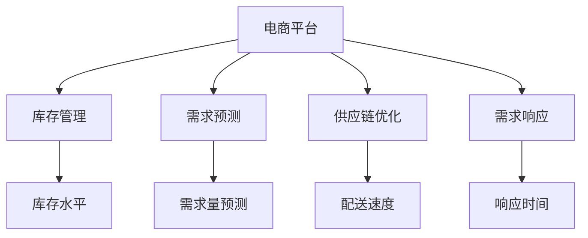

                 

## 1. 背景介绍

### 1.1 问题由来

在数字化转型的大潮中，电商平台成为了连接消费者与商家的重要纽带。然而，电商平台的供给能力，即在既定时间内满足消费者需求的能力，往往受限于其库存水平、配送速度和供应链效率。如何在有限的资源条件下，最大化提升电商平台的供给能力，是一个亟需解决的问题。

### 1.2 问题核心关键点

电商平台的供给能力提升，核心在于优化其供应链管理系统。其关键点包括：

- **库存管理**：合理控制库存水平，避免缺货和过剩库存。
- **需求预测**：准确预测未来的需求量，避免库存积压或供应不足。
- **供应链优化**：提高供应链的效率和弹性，减少交付时间。
- **需求响应**：及时响应消费者需求，提升客户满意度。

这些核心点需要通过数据驱动的方法，结合机器学习算法进行优化。本文将从这些关键点出发，探讨电商平台如何通过供应链管理提升供给能力。

## 2. 核心概念与联系

### 2.1 核心概念概述

为更好地理解电商平台供应链管理优化的方法，本节将介绍几个密切相关的核心概念：

- **电商平台**：以线上方式销售商品和服务的平台，如淘宝、京东、Amazon等。
- **供应链**：涉及产品从原材料获取、生产制造、库存管理、配送交付等环节的完整链条。
- **库存管理**：控制库存水平，避免库存过剩或不足，保证商品及时供应。
- **需求预测**：预测消费者需求，优化供应链资源分配，减少库存积压。
- **供应链优化**：提高供应链效率，减少交付时间，提升配送速度。
- **需求响应**：快速响应市场需求变化，提升客户满意度。

这些核心概念之间的逻辑关系可以通过以下Mermaid流程图来展示：



这个流程图展示了几大核心概念及其之间的关系：

1. 电商平台是供应链管理的载体，涉及库存、需求预测、供应链优化和需求响应等多个环节。
2. 库存管理直接影响商品的可供应量，通过优化库存水平，保证商品及时供应。
3. 需求预测是供应链优化的基础，通过准确预测需求，合理分配资源，减少库存积压。
4. 供应链优化提升配送效率，减少交付时间，提高客户满意度。
5. 需求响应保障及时反馈，提升客户体验，维持市场竞争力。

这些核心概念共同构成了电商平台的供应链管理系统，通过优化各个环节，可以有效提升其供给能力。

## 3. 核心算法原理 & 具体操作步骤

### 3.1 算法原理概述

电商平台的供应链管理优化，通常采用数据驱动的方法，结合机器学习算法进行分析和决策。其核心算法原理包括：

- **库存管理算法**：通过库存优化算法（如ABC分类法、安全库存策略等），控制库存水平，避免缺货和过剩库存。
- **需求预测算法**：使用时间序列分析、回归分析等方法，预测未来的需求量，优化资源分配。
- **供应链优化算法**：采用线性规划、动态规划等方法，优化供应链各环节的资源配置，提高配送效率。
- **需求响应算法**：通过实时数据分析和预测，快速调整供应链策略，满足消费者需求。

这些算法共同构成了一个完整的供应链管理系统，帮助电商平台在有限的资源条件下，最大化提升其供给能力。

### 3.2 算法步骤详解

电商平台供应链管理优化的主要步骤如下：

**Step 1: 数据收集与清洗**

1. **收集数据**：从平台订单、库存、配送等多个维度收集数据，包括订单量、商品库存、配送时间等。
2. **数据清洗**：去除噪声数据，处理缺失值和异常值，确保数据质量。

**Step 2: 需求预测**

1. **时间序列分析**：使用ARIMA、LSTM等模型，对历史订单数据进行时间序列分析，预测未来的需求量。
2. **回归分析**：采用多元线性回归、随机森林等方法，考虑外部因素（如节假日、促销活动等）对需求的影响。
3. **模型训练与评估**：使用历史数据训练预测模型，评估预测结果的准确性和可靠性。

**Step 3: 库存管理**

1. **ABC分类法**：将商品按销售量和库存价值进行分类，重点管理高价值商品和高销量商品。
2. **安全库存策略**：根据需求预测结果，确定各商品的安全库存量，避免库存过剩或不足。
3. **库存动态调整**：实时监测库存水平，根据订单量和预测需求，动态调整库存量。

**Step 4: 供应链优化**

1. **线性规划**：建立供应链优化模型，考虑成本、时间等因素，优化各环节的资源配置。
2. **动态规划**：采用动态规划算法，优化配送路线和配送时间，减少配送成本。
3. **实时调度**：使用实时调度算法，动态调整配送计划，提高配送效率。

**Step 5: 需求响应**

1. **实时数据分析**：通过实时数据分析，识别异常订单和需求变化，快速响应市场需求。
2. **动态调整策略**：根据实时数据分析结果，动态调整供应链策略，保证及时供货。
3. **客户反馈收集**：收集客户反馈，评估供应链响应效果，持续改进优化。

### 3.3 算法优缺点

电商平台的供应链管理优化算法具有以下优点：

1. **精确预测需求**：通过时间序列分析和回归分析，能够准确预测未来的需求量，优化库存和资源分配。
2. **动态调整库存**：基于实时数据分析和动态调整策略，有效控制库存水平，避免缺货和过剩库存。
3. **提高配送效率**：通过线性规划和动态规划，优化配送路线和时间，减少配送成本，提高配送速度。
4. **快速响应需求**：通过实时数据分析和动态调整策略，快速响应市场需求，提升客户满意度。

但这些算法也存在一些局限性：

1. **数据依赖性高**：预测和优化效果高度依赖数据质量，数据缺失或不准确会影响算法效果。
2. **模型复杂度高**：涉及多种算法和模型，模型调参和维护复杂，需要较高的技术门槛。
3. **响应时间延迟**：实时数据分析和调整策略的响应时间可能存在延迟，影响客户体验。
4. **成本高**：算法优化和模型训练需要一定的计算资源，初期投入成本较高。

尽管存在这些局限性，但就目前而言，这些算法是提升电商平台供给能力最有效的方法之一。未来相关研究的重点在于如何进一步降低算法对数据和计算资源的依赖，提高算法的实时性和灵活性，同时兼顾成本和效果。

### 3.4 算法应用领域

电商平台供应链管理优化的算法已在多个行业得到了应用，涵盖了商品物流、库存管理、需求预测等多个领域，例如：

- **商品物流**：优化配送路线和时间，减少配送成本，提高配送效率。
- **库存管理**：控制库存水平，避免库存过剩或不足，保证商品及时供应。
- **需求预测**：准确预测需求量，优化供应链资源分配，减少库存积压。
- **需求响应**：及时响应市场需求变化，提升客户满意度。

除了上述这些经典应用外，电商平台供应链管理优化算法还被创新性地应用于供应商管理、库存控制、物流优化等诸多场景中，为电商平台的供应链管理带来了新的突破。

## 4. 数学模型和公式 & 详细讲解

### 4.1 数学模型构建

为了更好地理解电商平台供应链管理优化的数学模型，本节将介绍几个关键的数学模型：

1. **时间序列模型**：用于预测需求量的数学模型，常见的有ARIMA、LSTM等。
2. **回归模型**：用于考虑外部因素对需求的影响，常见的有多元线性回归、随机森林等。
3. **线性规划模型**：用于优化供应链资源配置的数学模型。
4. **动态规划模型**：用于优化配送路线和配送时间的数学模型。

这些模型是电商平台供应链管理优化的基础，通过组合使用，可以实现需求预测、库存管理、供应链优化和需求响应等各个环节的优化。

### 4.2 公式推导过程

以下以线性规划模型为例，展示其基本公式推导过程。

假设电商平台有 $n$ 种商品，每种商品的库存量为 $x_i$，对应的需求量为 $d_i$，单位配送成本为 $c_i$，单位商品价值为 $v_i$。则线性规划的目标函数为：

$$
\text{Minimize } \sum_{i=1}^{n} c_i x_i
$$

约束条件包括：

1. 库存量非负约束：$x_i \geq 0$
2. 需求满足约束：$\sum_{i=1}^{n} d_i x_i \geq D$，其中 $D$ 为总需求量
3. 单位商品价值约束：$\sum_{i=1}^{n} v_i x_i \geq V$，其中 $V$ 为总商品价值

则线性规划模型的完整公式为：

$$
\begin{aligned}
&\text{Minimize } \sum_{i=1}^{n} c_i x_i \\
&\text{Subject to: } \sum_{i=1}^{n} d_i x_i \geq D \\
&\quad \sum_{i=1}^{n} v_i x_i \geq V \\
&\quad x_i \geq 0, \quad i=1,2,\dots,n
\end{aligned}
$$

通过求解上述线性规划模型，可以得到最优的库存分配方案，从而最大化库存利用率，降低配送成本，提升供应链效率。

### 4.3 案例分析与讲解

以电商平台对某商品进行库存管理为例，展示如何使用线性规划模型进行库存优化。

假设某商品每天的需求量为 $d=1000$，单位商品的成本为 $c=10$，单位商品的价值为 $v=50$，总需求量为 $D=50000$，总商品价值为 $V=250000$。则线性规划模型的求解过程如下：

1. 确定决策变量 $x$，即每种商品的库存量。
2. 建立目标函数和约束条件，如上述公式所示。
3. 使用线性规划求解器（如Gurobi、CPLEX等）求解上述线性规划模型。
4. 得到最优的库存分配方案 $x^*$，其中 $x^*$ 为各商品的最优库存量。

假设求解结果为 $x^* = (1000, 2000, 3000)$，则该商品的库存分配方案为：每天对 $1000$ 件商品进行订购，对 $2000$ 件商品进行订购，对 $3000$ 件商品进行订购。

## 5. 项目实践：代码实例和详细解释说明

### 5.1 开发环境搭建

在进行电商平台供应链管理优化实践前，我们需要准备好开发环境。以下是使用Python进行Pandas、Scikit-learn、Scipy等库进行开发的环境配置流程：

1. 安装Anaconda：从官网下载并安装Anaconda，用于创建独立的Python环境。

2. 创建并激活虚拟环境：
```bash
conda create -n supply-chain-env python=3.8 
conda activate supply-chain-env
```

3. 安装必要的库：
```bash
conda install pandas scikit-learn scipy statsmodels
```

4. 安装TensorFlow等深度学习库（如有需要）：
```bash
conda install tensorflow
```

完成上述步骤后，即可在`supply-chain-env`环境中开始供应链管理优化实践。

### 5.2 源代码详细实现

下面我们以电商平台需求预测为例，给出使用Pandas和Scikit-learn进行需求预测的Python代码实现。

首先，定义需求预测函数：

```python
import pandas as pd
from sklearn.linear_model import LinearRegression
from sklearn.metrics import mean_squared_error

def predict_demand(train_data, test_data, model):
    train_df = pd.DataFrame(train_data)
    test_df = pd.DataFrame(test_data)
    
    # 时间序列拆分
    train_df['year'], train_df['month'], train_df['day'] = train_df['date'].str.split('-').str
    test_df['year'], test_df['month'], test_df['day'] = test_df['date'].str.split('-').str
    
    # 时间序列特征提取
    train_df['year'] = train_df['year'].astype(int)
    train_df['month'] = train_df['month'].astype(int)
    train_df['day'] = train_df['day'].astype(int)
    
    # 数据预处理
    train_df = train_df.dropna()
    test_df = test_df.dropna()
    
    # 模型训练
    X_train = train_df[['year', 'month', 'day']]
    y_train = train_df['demand']
    X_test = test_df[['year', 'month', 'day']]
    y_test = test_df['demand']
    
    model.fit(X_train, y_train)
    y_pred = model.predict(X_test)
    
    # 评估模型性能
    mse = mean_squared_error(y_test, y_pred)
    print(f"Mean Squared Error: {mse:.3f}")
    
    return y_pred
```

然后，使用历史数据训练模型：

```python
# 加载历史数据
train_data = pd.read_csv('train.csv')
test_data = pd.read_csv('test.csv')

# 模型训练和预测
model = LinearRegression()
predict_demand(train_data, test_data, model)
```

在上述代码中，我们首先通过Pandas库加载历史数据，并进行时间序列拆分和特征提取。然后，使用Scikit-learn库的线性回归模型进行训练和预测，最后计算模型的均方误差并返回预测结果。

### 5.3 代码解读与分析

让我们再详细解读一下关键代码的实现细节：

**需求预测函数**：
- 使用Pandas库进行数据处理和特征提取。
- 使用Scikit-learn库的线性回归模型进行训练和预测。
- 计算均方误差，评估模型性能。

**模型训练和预测**：
- 加载历史数据，并进行时间序列拆分和特征提取。
- 使用线性回归模型进行训练和预测，并计算均方误差。

通过上述代码，我们可以看到，使用Python和Scikit-learn库进行需求预测的实现非常简单。而Pandas库则提供了强大的数据处理和特征工程能力，使数据预处理和模型训练变得更加便捷。

## 6. 实际应用场景

### 6.1 智能库存管理

电商平台通过智能库存管理系统，可以实时监控库存水平，自动生成补货计划，避免库存过剩或不足，保证商品及时供应。

在技术实现上，可以收集库存数据、销售数据和历史订单数据，通过需求预测模型预测未来的需求量，结合库存优化算法，自动调整库存量。当库存量低于预设阈值时，系统将自动发出补货订单，确保商品及时供应。

### 6.2 优化配送路线

电商平台的配送路线优化，可以通过实时监控配送状态，动态调整配送计划，提高配送效率，减少配送成本。

在技术实现上，可以收集配送数据、历史订单数据和地理位置信息，使用动态规划算法，优化配送路线和时间，生成最优的配送计划。配送员根据系统分配的路线和计划，进行配送任务，确保商品及时到达客户手中。

### 6.3 多渠道库存同步

电商平台的供应链管理，还涉及到多个渠道（如自有平台、第三方平台、线下门店等）的库存同步。通过实时同步各个渠道的库存数据，可以实现跨渠道库存共享，避免库存重复或缺货现象。

在技术实现上，可以建立跨渠道的库存管理系统，通过API接口实时同步各个渠道的库存数据。当某个渠道的商品库存量低于预设阈值时，系统将自动提示用户进行补货，并调整其他渠道的库存量，确保库存充足。

### 6.4 未来应用展望

随着技术的不断发展，电商平台供应链管理将面临更多的挑战和机遇。未来，供应链管理可能通过以下几个方面进一步提升：

1. **大数据应用**：通过大数据技术，实时采集和分析供应链数据，优化库存管理和需求预测，提升供应链效率。
2. **人工智能技术**：结合人工智能技术，如深度学习、自然语言处理等，提升需求预测的准确性和库存管理的灵活性。
3. **物联网技术**：通过物联网技术，实时监测供应链各个环节的状态，提高供应链的透明度和响应速度。
4. **区块链技术**：利用区块链技术，实现供应链数据的不可篡改性和透明性，提升供应链的信任度。
5. **智能合约**：结合智能合约技术，自动执行供应链合同，降低合同执行的成本和风险。

以上技术的发展，将进一步提升电商平台的供应链管理水平，实现更高效、更灵活、更透明的供应链系统。

## 7. 工具和资源推荐

### 7.1 学习资源推荐

为了帮助开发者系统掌握电商平台供应链管理优化的理论和实践方法，这里推荐一些优质的学习资源：

1. 《Python数据科学手册》系列博文：由数据科学家撰写，深入浅出地介绍了Python在数据分析和机器学习中的应用，适合初学者入门。
2. 《机器学习实战》书籍：机器学习领域经典书籍，涵盖多种机器学习算法和实现方法，适合进阶学习。
3. Kaggle平台：数据科学和机器学习的竞赛平台，提供大量的数据集和模型实现，适合实践锻炼。
4. Coursera平台：在线课程平台，提供多个与供应链管理相关的课程，涵盖从基础到高级的内容。

通过对这些资源的学习实践，相信你一定能够快速掌握电商平台供应链管理优化的精髓，并用于解决实际的供应链问题。

### 7.2 开发工具推荐

高效的开发离不开优秀的工具支持。以下是几款用于电商平台供应链管理优化开发的常用工具：

1. Jupyter Notebook：交互式编程环境，适合进行数据分析和机器学习实验。
2. Scikit-learn：Python机器学习库，提供多种机器学习算法的实现。
3. Pandas：Python数据处理库，适合进行数据清洗和特征工程。
4. TensorFlow：开源深度学习框架，适合进行深度学习模型训练。
5. PyTorch：开源深度学习框架，支持动态图计算，适合进行复杂模型训练。

合理利用这些工具，可以显著提升电商平台供应链管理优化的开发效率，加快创新迭代的步伐。

### 7.3 相关论文推荐

电商平台的供应链管理优化研究涉及多个领域，以下是几篇奠基性的相关论文，推荐阅读：

1. "Dynamic Pricing and Inventory Control: A Survey"：综述动态定价和库存控制的研究，为供应链管理提供理论基础。
2. "Supply Chain Management with Real-time Data"：探讨实时数据在供应链管理中的应用，提升供应链的响应速度和效率。
3. "IoT in Supply Chain Management: A Survey"：综述物联网技术在供应链中的应用，提升供应链的透明度和响应速度。
4. "Blockchain for Supply Chain Management: A Survey"：探讨区块链技术在供应链中的应用，提升供应链的信任度和透明度。

这些论文代表了大规模供应链管理的研究进展，通过学习这些前沿成果，可以帮助研究者把握学科前进方向，激发更多的创新灵感。

## 8. 总结：未来发展趋势与挑战

### 8.1 总结

本文对电商平台供应链管理优化的核心算法和操作步骤进行了详细讲解，并结合实际应用场景，展示了如何通过数据驱动的方法，提升电商平台的供给能力。通过本文的系统梳理，可以看到，电商平台供应链管理优化涉及到多个环节和算法，通过数据驱动的方法，可以高效地进行优化，提升电商平台的运营效率。

### 8.2 未来发展趋势

展望未来，电商平台供应链管理优化将呈现以下几个发展趋势：

1. **大数据应用**：通过大数据技术，实时采集和分析供应链数据，提升供应链的响应速度和效率。
2. **人工智能技术**：结合人工智能技术，如深度学习、自然语言处理等，提升需求预测的准确性和库存管理的灵活性。
3. **物联网技术**：通过物联网技术，实时监测供应链各个环节的状态，提高供应链的透明度和响应速度。
4. **区块链技术**：利用区块链技术，实现供应链数据的不可篡改性和透明性，提升供应链的信任度。
5. **智能合约**：结合智能合约技术，自动执行供应链合同，降低合同执行的成本和风险。

这些技术的发展，将进一步提升电商平台的供应链管理水平，实现更高效、更灵活、更透明的供应链系统。

### 8.3 面临的挑战

尽管电商平台供应链管理优化取得了一定的进展，但在迈向更加智能化、普适化应用的过程中，仍面临诸多挑战：

1. **数据质量问题**：供应链数据的质量直接影响算法的准确性和效果，数据缺失或不准确会导致模型失效。
2. **计算资源瓶颈**：大规模数据的处理和复杂算法的实现需要大量的计算资源，初期投入成本较高。
3. **系统复杂度高**：供应链管理涉及多个环节和算法，系统复杂度高，开发和维护难度大。
4. **实时性要求高**：供应链管理需要实时响应市场需求，系统需要具备高并发和低延迟的特点。

尽管存在这些挑战，但通过不断优化算法和优化系统架构，相信电商平台供应链管理优化将取得更大的突破，为电商平台的运营效率带来显著提升。

### 8.4 研究展望

未来的研究可以从以下几个方面进行：

1. **数据增强技术**：通过数据增强技术，扩充数据集，提高算法的泛化能力。
2. **模型集成方法**：采用模型集成方法，结合多种算法，提升算法的稳定性和效果。
3. **实时数据处理**：采用流式处理技术，实时处理供应链数据，提升系统响应速度。
4. **边缘计算技术**：结合边缘计算技术，将数据处理和分析从云端移到边缘，降低延迟，提高系统实时性。

通过这些研究方向的研究和探索，相信电商平台供应链管理优化将实现更高效的供应链系统，推动电商平台的智能化转型。

## 9. 附录：常见问题与解答

**Q1：电商平台供应链管理优化的主要步骤有哪些？**

A: 电商平台供应链管理优化的主要步骤包括：
1. 数据收集与清洗：收集历史订单、库存、配送等多个维度的数据，并进行数据预处理和清洗。
2. 需求预测：使用时间序列分析和回归分析等方法，预测未来的需求量。
3. 库存管理：通过ABC分类法和安全库存策略等方法，控制库存水平，避免缺货和过剩库存。
4. 供应链优化：使用线性规划和动态规划等方法，优化供应链各环节的资源配置，提高配送效率。
5. 需求响应：通过实时数据分析和动态调整策略，快速响应市场需求，提升客户满意度。

**Q2：电商平台库存管理的优化方法有哪些？**

A: 电商平台库存管理的优化方法包括：
1. ABC分类法：将商品按销售量和库存价值进行分类，重点管理高价值商品和高销量商品。
2. 安全库存策略：根据需求预测结果，确定各商品的安全库存量，避免库存过剩或不足。
3. 动态调整策略：实时监测库存水平，根据订单量和预测需求，动态调整库存量。
4. 库存预警系统：设置库存预警阈值，当库存量低于阈值时，自动发出补货提醒。

**Q3：电商平台如何通过需求预测提升供应链效率？**

A: 电商平台通过需求预测提升供应链效率的主要方法包括：
1. 时间序列分析：使用ARIMA、LSTM等模型，对历史订单数据进行时间序列分析，预测未来的需求量。
2. 回归分析：采用多元线性回归、随机森林等方法，考虑外部因素（如节假日、促销活动等）对需求的影响。
3. 实时数据分析：通过实时数据分析，识别异常订单和需求变化，快速响应市场需求。
4. 动态调整策略：根据实时数据分析结果，动态调整供应链策略，保证及时供货。

**Q4：电商平台如何通过需求预测优化库存管理？**

A: 电商平台通过需求预测优化库存管理的主要方法包括：
1. 时间序列拆分：将订单数据按时间维度拆分成年、月、日等时间特征。
2. 特征提取：提取年、月、日等时间特征，作为模型输入。
3. 模型训练：使用历史订单数据训练需求预测模型，预测未来的需求量。
4. 库存动态调整：根据需求预测结果，动态调整库存量，避免库存过剩或不足。

**Q5：电商平台如何通过需求预测提升客户满意度？**

A: 电商平台通过需求预测提升客户满意度的方法包括：
1. 准确预测需求：通过时间序列分析和回归分析，准确预测未来的需求量。
2. 动态调整库存：根据需求预测结果，动态调整库存量，确保商品及时供应。
3. 优化配送路线：使用动态规划算法，优化配送路线和时间，提高配送效率。
4. 实时数据分析：通过实时数据分析，识别异常订单和需求变化，快速响应市场需求。

通过这些方法，电商平台可以实现更高效的供应链管理，提升客户满意度和运营效率。

---

作者：禅与计算机程序设计艺术 / Zen and the Art of Computer Programming

