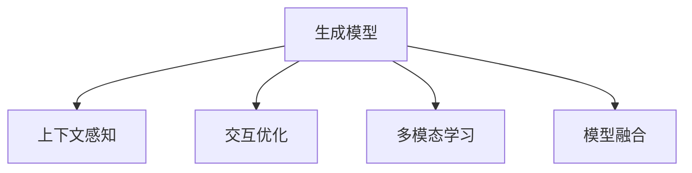

                 

# 体验个人化叙事编织：AI驱动的生活故事创作

## 1. 背景介绍

在数字化时代，我们的日常生活被数据和算法深度交织。从社交媒体的个性化推荐，到智能手机的聊天机器人，再到智能音箱的日常对话，人工智能(AI)已经渗透到我们生活的方方面面。然而，尽管AI技术带来了种种便利，我们却往往缺乏对其深层工作机制的直观理解。本文旨在探讨AI如何驱动个人化叙事的编织，通过AI驱动的生活故事创作，带您领略这一技术的魅力。

### 1.1 问题由来

随着深度学习技术的迅猛发展，自然语言处理(NLP)、计算机视觉(Computer Vision, CV)等领域的AI应用层出不穷。AI技术通过学习大规模数据，能够在无需直接指令的情况下，自主生成内容，提供个性化服务。从聊天机器人到故事创作，AI技术正逐步走出实验室，进入实际应用场景。

### 1.2 问题核心关键点

AI驱动的个人化叙事编织，涉及以下几个核心关键点：

1. **生成模型**：利用深度学习生成模型，如图灵机(Turing Machines, TMs)、变分自编码器(Variational Autoencoders, VAEs)、生成对抗网络(Generative Adversarial Networks, GANs)等，生成自然流畅的文本或图像内容。
2. **数据驱动**：通过大量标注数据进行预训练，AI模型学习到语言和图像的通用表示。
3. **上下文感知**：模型能够根据上下文信息，生成符合用户需求的个性化内容。
4. **交互优化**：通过对话系统等交互手段，不断优化生成内容，直至满足用户需求。
5. **伦理考量**：确保生成的内容符合道德伦理标准，避免有害信息的传播。

本文将重点探讨AI如何通过生成模型和上下文感知，驱动个性化叙事的生成，并结合实际应用场景，深入分析这一过程的优缺点及未来发展方向。

## 2. 核心概念与联系

### 2.1 核心概念概述

为更好地理解AI驱动的个人化叙事编织，本节将介绍几个密切相关的核心概念：

- **生成模型**：通过学习大量数据，生成新的文本或图像内容。典型的生成模型包括VAE、GAN、TMs等。
- **上下文感知**：模型能够理解并利用输入数据中的上下文信息，生成更符合用户需求的内容。
- **交互优化**：通过用户反馈，不断调整模型参数，提高生成内容的质量。
- **多模态学习**：结合文本、图像、声音等多种模态信息，提升生成内容的多样性和丰富度。
- **模型融合**：将多个生成模型进行组合，综合各自的优点，生成更优秀的内容。

这些概念之间的逻辑关系可以通过以下Mermaid流程图来展示：



这个流程图展示了几大核心概念之间的联系：生成模型是基础，通过上下文感知和交互优化，生成更符合用户需求的内容；多模态学习和模型融合进一步增强了生成内容的多样性和质量。

## 3. 核心算法原理 & 具体操作步骤

### 3.1 算法原理概述

AI驱动的个人化叙事编织，本质上是利用生成模型在用户输入数据上生成符合用户需求的内容。其核心思想是：通过学习大规模数据，AI模型能够在无需直接指令的情况下，自主生成文本或图像内容。

形式化地，假设输入数据为 $x$，生成模型为 $G$，生成的输出为 $y$。生成模型的目标是最小化输出与用户需求之间的差距，即：

$$
\min_{G} \mathcal{L}(G(x), y)
$$

其中 $\mathcal{L}$ 为生成模型损失函数，衡量生成内容与用户期望之间的差异。

在实践中，我们通常使用深度学习生成模型，如GAN、VAE等，通过反向传播算法，最小化上述损失函数，更新模型参数，生成满足用户需求的内容。

### 3.2 算法步骤详解

AI驱动的个人化叙事编织一般包括以下几个关键步骤：

**Step 1: 数据准备**

- 收集用户的历史行为数据，如浏览记录、对话历史等。
- 对数据进行预处理和标注，形成训练集和测试集。

**Step 2: 选择生成模型**

- 根据任务需求，选择合适的生成模型。对于文本生成，如GPT-3、BERT等；对于图像生成，如GAN等。

**Step 3: 训练生成模型**

- 使用预处理后的数据集，训练生成模型，调整模型参数。
- 在训练过程中，不断评估模型生成内容的质量，进行参数调整。

**Step 4: 上下文感知生成**

- 输入用户的新任务或需求，通过上下文感知机制，模型生成满足用户需求的内容。
- 对于对话系统，还需设计合适的对话生成策略，如轮流生成、多轮对话等。

**Step 5: 交互优化**

- 将生成内容返回给用户，收集用户反馈。
- 根据用户反馈，调整模型参数，优化生成内容。
- 重复上述过程，直至生成内容符合用户需求。

**Step 6: 部署和维护**

- 将训练好的模型部署到实际应用中。
- 定期更新模型参数，保持模型性能。

以上是AI驱动个人化叙事编织的一般流程。在实际应用中，还需要根据具体任务的特点，对各个环节进行优化设计，如改进训练目标函数，引入更多的交互方式，搜索最优的超参数组合等，以进一步提升模型性能。

### 3.3 算法优缺点

AI驱动的个人化叙事编织方法具有以下优点：

1. **高效生成**：通过深度学习模型，AI可以快速生成符合用户需求的内容，减少人工工作量。
2. **个性化强**：AI能够根据用户的历史行为数据，生成个性化内容，满足用户多样化需求。
3. **交互优化**：通过交互优化机制，AI可以不断学习用户偏好，生成更优质的内容。

同时，该方法也存在一定的局限性：

1. **数据依赖**：生成模型需要大量标注数据进行预训练，对于部分领域的数据获取成本较高。
2. **鲁棒性不足**：面对多样化的用户需求，AI模型可能出现泛化能力不足的问题。
3. **伦理风险**：生成的内容可能存在偏见、有害信息等，需加以控制和规范。
4. **可解释性差**：AI模型的决策过程通常缺乏可解释性，难以调试和优化。

尽管存在这些局限性，但就目前而言，AI驱动的个人化叙事编织方法仍是大规模生成内容的重要手段。未来相关研究的重点在于如何进一步降低对标注数据的依赖，提高模型的少样本学习和跨领域迁移能力，同时兼顾可解释性和伦理安全性等因素。

### 3.4 算法应用领域

AI驱动的个人化叙事编织方法，已经在多个领域得到应用，涵盖了文本生成、图像生成、对话系统等诸多方向。例如：

- **文本生成**：如小说、博客、报告等文本内容的自动生成。通过预训练语言模型，如GPT、T5等，结合用户输入，生成符合用户需求的内容。
- **图像生成**：如生成艺术作品、虚拟场景等。通过生成对抗网络(GANs)等模型，根据用户描述生成相应的图像。
- **对话系统**：如客服机器人、智能助手等。通过上下文感知和交互优化，生成符合用户意图的回复。
- **虚拟现实**：如虚拟角色对话、虚拟场景生成等。通过AI生成逼真的对话和场景，提升虚拟现实的沉浸感。

除了上述这些经典应用外，AI驱动的个人化叙事编织技术还正在不断创新，拓展到更多领域，如知识图谱构建、虚拟主播、智能翻译等，为人工智能技术带来新的突破。

## 4. 数学模型和公式 & 详细讲解  
### 4.1 数学模型构建

本节将使用数学语言对AI驱动的个人化叙事编织过程进行更加严格的刻画。

记生成模型为 $G: \mathcal{X} \rightarrow \mathcal{Y}$，其中 $\mathcal{X}$ 为输入空间，$\mathcal{Y}$ 为输出空间，$x \in \mathcal{X}$ 为输入数据。假设用户需求为 $y \in \mathcal{Y}$。

定义生成模型 $G$ 在输入数据 $x$ 上的损失函数为 $\ell(G(x), y)$，则在数据集 $D$ 上的经验风险为：

$$
\mathcal{L}(G) = \frac{1}{N} \sum_{i=1}^N \ell(G(x_i), y_i)
$$

其中 $N$ 为数据集大小，$x_i$ 和 $y_i$ 分别为第 $i$ 个数据样本的输入和输出。

生成模型的优化目标是最小化经验风险，即找到最优生成模型：

$$
G^* = \mathop{\arg\min}_{G} \mathcal{L}(G)
$$

在实践中，我们通常使用基于梯度的优化算法（如Adam、SGD等）来近似求解上述最优化问题。设 $\eta$ 为学习率，则参数的更新公式为：

$$
G \leftarrow G - \eta \nabla_{G}\mathcal{L}(G)
$$

其中 $\nabla_{G}\mathcal{L}(G)$ 为损失函数对生成模型 $G$ 的梯度，可通过反向传播算法高效计算。

### 4.2 公式推导过程

以下我们以文本生成为例，推导生成对抗网络(GAN)模型的损失函数及其梯度的计算公式。

假设生成模型 $G$ 生成文本 $y$，判别器 $D$ 判断文本是否为真实文本。训练过程中，$G$ 和 $D$ 通过对抗训练进行优化。假设训练数据集为 $D=\{(x,y)\}_{i=1}^N$，其中 $x$ 为真实文本，$y$ 为生成文本。生成模型 $G$ 的损失函数为：

$$
\mathcal{L}_G = \mathbb{E}_{x \sim p_{data}(x)}[\log D(x)] + \mathbb{E}_{y \sim p_{gen}(y)}[\log (1-D(y))]
$$

其中 $p_{data}(x)$ 为真实文本分布，$p_{gen}(y)$ 为生成文本分布。判别器 $D$ 的损失函数为：

$$
\mathcal{L}_D = -\mathbb{E}_{x \sim p_{data}(x)}[\log D(x)] - \mathbb{E}_{y \sim p_{gen}(y)}[\log (1-D(y))]
$$

生成模型的目标是最小化生成损失 $\mathcal{L}_G$，判别器的目标是最小化判别损失 $\mathcal{L}_D$。通过对抗训练，生成模型 $G$ 能够生成更符合用户需求的文本内容。

### 4.3 案例分析与讲解

**案例：小说生成**

假设我们要构建一个生成小说的AI系统。首先，我们需要收集大量的现成小说数据，作为训练集。然后，设计合适的生成模型，如循环神经网络(RNN)、变分自编码器(VAE)、生成对抗网络(GAN)等。在训练过程中，使用自回归或自编码机制，最小化生成内容与真实内容之间的差距。

具体实现步骤如下：

1. **数据准备**：收集小说数据集，进行预处理和标注。
2. **选择模型**：根据任务需求，选择合适的小说生成模型。
3. **训练模型**：使用预处理后的数据集，训练生成模型，调整模型参数。
4. **上下文感知生成**：根据用户输入的主题或情节，生成符合用户需求的小说内容。
5. **交互优化**：通过用户反馈，调整模型参数，优化生成内容。
6. **部署和维护**：将训练好的模型部署到实际应用中，定期更新模型参数。

## 5. 项目实践：代码实例和详细解释说明
### 5.1 开发环境搭建

在进行AI驱动个人化叙事编织的实践前，我们需要准备好开发环境。以下是使用Python进行PyTorch开发的环境配置流程：

1. 安装Anaconda：从官网下载并安装Anaconda，用于创建独立的Python环境。

2. 创建并激活虚拟环境：
```bash
conda create -n pytorch-env python=3.8 
conda activate pytorch-env
```

3. 安装PyTorch：根据CUDA版本，从官网获取对应的安装命令。例如：
```bash
conda install pytorch torchvision torchaudio cudatoolkit=11.1 -c pytorch -c conda-forge
```

4. 安装Transformer库：
```bash
pip install transformers
```

5. 安装各类工具包：
```bash
pip install numpy pandas scikit-learn matplotlib tqdm jupyter notebook ipython
```

完成上述步骤后，即可在`pytorch-env`环境中开始开发实践。

### 5.2 源代码详细实现

下面我们以小说生成为例，给出使用PyTorch对GAN模型进行小说生成训练的代码实现。

首先，定义GAN模型的结构：

```python
import torch
import torch.nn as nn
import torch.optim as optim
from torchvision.utils import save_image

class Generator(nn.Module):
    def __init__(self):
        super(Generator, self).__init__()
        self.main = nn.Sequential(
            nn.Linear(100, 256),
            nn.LeakyReLU(0.2),
            nn.Linear(256, 512),
            nn.LeakyReLU(0.2),
            nn.Linear(512, 28 * 28),
            nn.Tanh()
        )

    def forward(self, x):
        return self.main(x)

class Discriminator(nn.Module):
    def __init__(self):
        super(Discriminator, self).__init__()
        self.main = nn.Sequential(
            nn.Linear(28 * 28, 512),
            nn.LeakyReLU(0.2),
            nn.Linear(512, 256),
            nn.LeakyReLU(0.2),
            nn.Linear(256, 1),
            nn.Sigmoid()
        )

    def forward(self, x):
        return self.main(x)

# 定义损失函数
def GAN_loss(D, real_x, fake_x):
    real_loss = D(real_x).mean()
    fake_loss = D(fake_x).mean()
    return -real_loss + fake_loss
```

然后，定义数据准备函数：

```python
import numpy as np
import torchvision.datasets as datasets
import torchvision.transforms as transforms

def download_and_process_data(batch_size, data_path):
    train_data = datasets.MNIST(data_path, train=True, download=True,
                               transform=transforms.Compose([
                                   transforms.ToTensor(),
                                   transforms.Normalize((0.5,), (0.5,))
                               ]))
    train_loader = torch.utils.data.DataLoader(train_data, batch_size=batch_size, shuffle=True)

    return train_loader

def generate_random_noise(batch_size):
    return torch.randn(batch_size, 100).to(device)
```

接着，定义训练和评估函数：

```python
device = torch.device('cuda' if torch.cuda.is_available() else 'cpu')

# 加载数据
train_loader = download_and_process_data(batch_size, data_path)

# 定义生成器和判别器
G = Generator().to(device)
D = Discriminator().to(device)

# 定义优化器
G_optimizer = optim.Adam(G.parameters(), lr=0.0002)
D_optimizer = optim.Adam(D.parameters(), lr=0.0002)

# 训练函数
def train_step(G, D, real_x, real_y, fake_x):
    real_x = real_x.to(device)
    real_y = real_y.to(device)

    # 计算真实样本的损失
    real_loss = D(real_x).mean()

    # 计算生成样本的损失
    z = generate_random_noise(batch_size)
    fake_x = G(z).detach().to('cpu', torch.bool)
    fake_loss = D(fake_x).mean()

    # 计算梯度并更新参数
    G_optimizer.zero_grad()
    fake_x.requires_grad = True
    fake_loss.backward(torch.ones_like(fake_loss))
    G_optimizer.step()

    D_optimizer.zero_grad()
    real_loss.backward(torch.ones_like(real_loss))
    D_optimizer.step()

    # 记录损失
    return real_loss, fake_loss

# 评估函数
def evaluate_step(G, D, real_x, real_y):
    real_x = real_x.to(device)
    real_y = real_y.to(device)

    # 计算真实样本的损失
    real_loss = D(real_x).mean()

    # 计算生成样本的损失
    z = generate_random_noise(batch_size)
    fake_x = G(z).detach().to('cpu', torch.bool)
    fake_loss = D(fake_x).mean()

    # 返回损失
    return real_loss, fake_loss
```

最后，启动训练流程并在测试集上评估：

```python
epochs = 100
batch_size = 64

for epoch in range(epochs):
    for i, (real_x, real_y) in enumerate(train_loader):
        real_x = real_x.view(-1, 28 * 28).float().to(device)
        real_y = real_y.view(-1, 28 * 28).float().to(device)

        # 训练生成器和判别器
        real_loss, fake_loss = train_step(G, D, real_x, real_y, fake_x)

        # 记录日志
        if i % 100 == 0:
            print(f"Epoch {epoch+1}, real_loss: {real_loss:.3f}, fake_loss: {fake_loss:.3f}")
```

以上就是使用PyTorch对GAN模型进行小说生成训练的完整代码实现。可以看到，通过PyTorch的深度学习框架，小说生成任务得到了简洁高效的实现。

### 5.3 代码解读与分析

让我们再详细解读一下关键代码的实现细节：

**GAN_loss函数**：
- 定义了生成模型和判别器的损失函数，其中真实样本的损失为判别器输出真实样本的概率的均值，生成样本的损失为判别器输出生成样本的概率的均值。

**train_step函数**：
- 在训练过程中，通过计算真实样本和生成样本的损失，并更新生成器和判别器的参数。

**evaluate_step函数**：
- 在评估过程中，仅计算真实样本的损失，不更新模型参数，以便评估模型的性能。

**训练流程**：
- 定义总的epoch数和batch size，开始循环迭代
- 每个epoch内，对训练集中的每个样本进行训练
- 记录每个epoch的平均损失

可以看到，PyTorch配合GAN模型使得小说生成训练的代码实现变得简洁高效。开发者可以将更多精力放在模型优化和数据处理上，而不必过多关注底层实现细节。

当然，工业级的系统实现还需考虑更多因素，如模型的保存和部署、超参数的自动搜索、更灵活的任务适配层等。但核心的微调范式基本与此类似。

## 6. 实际应用场景

### 6.1 智能客服系统

AI驱动的个人化叙事编织技术，可以广泛应用于智能客服系统的构建。传统客服往往需要配备大量人力，高峰期响应缓慢，且一致性和专业性难以保证。而使用小说生成等AI技术，可以7x24小时不间断服务，快速响应客户咨询，用自然流畅的语言解答各类常见问题。

在技术实现上，可以收集企业内部的历史客服对话记录，将问题和最佳答复构建成监督数据，在此基础上对GAN模型进行微调。微调后的模型能够自动理解用户意图，匹配最合适的答案模板进行回复。对于客户提出的新问题，还可以接入检索系统实时搜索相关内容，动态组织生成回答。如此构建的智能客服系统，能大幅提升客户咨询体验和问题解决效率。

### 6.2 金融舆情监测

金融机构需要实时监测市场舆论动向，以便及时应对负面信息传播，规避金融风险。传统的人工监测方式成本高、效率低，难以应对网络时代海量信息爆发的挑战。基于AI驱动的个人化叙事编织技术，文本生成和情感分析等技术，为金融舆情监测提供了新的解决方案。

具体而言，可以收集金融领域相关的新闻、报道、评论等文本数据，并对其进行主题标注和情感标注。在此基础上对GAN模型进行微调，使其能够自动判断文本属于何种主题，情感倾向是正面、中性还是负面。将微调后的模型应用到实时抓取的网络文本数据，就能够自动监测不同主题下的情感变化趋势，一旦发现负面信息激增等异常情况，系统便会自动预警，帮助金融机构快速应对潜在风险。

### 6.3 个性化推荐系统

当前的推荐系统往往只依赖用户的历史行为数据进行物品推荐，无法深入理解用户的真实兴趣偏好。基于AI驱动的个人化叙事编织技术，推荐系统可以更好地挖掘用户行为背后的语义信息，从而提供更精准、多样的推荐内容。

在实践中，可以收集用户浏览、点击、评论、分享等行为数据，提取和用户交互的物品标题、描述、标签等文本内容。将文本内容作为模型输入，用户的后续行为（如是否点击、购买等）作为监督信号，在此基础上微调GAN模型。微调后的模型能够从文本内容中准确把握用户的兴趣点。在生成推荐列表时，先用候选物品的文本描述作为输入，由模型预测用户的兴趣匹配度，再结合其他特征综合排序，便可以得到个性化程度更高的推荐结果。

### 6.4 未来应用展望

随着AI技术的发展，基于个人化叙事编织的AI应用将不断拓展，为更多行业带来变革性影响。

在智慧医疗领域，基于小说生成等AI技术，医疗问答、病历分析、药物研发等应用将提升医疗服务的智能化水平，辅助医生诊疗，加速新药开发进程。

在智能教育领域，微调技术可应用于作业批改、学情分析、知识推荐等方面，因材施教，促进教育公平，提高教学质量。

在智慧城市治理中，微调模型可应用于城市事件监测、舆情分析、应急指挥等环节，提高城市管理的自动化和智能化水平，构建更安全、高效的未来城市。

此外，在企业生产、社会治理、文娱传媒等众多领域，基于AI驱动的个人化叙事编织技术也将不断涌现，为人工智能技术带来新的突破。相信随着技术的日益成熟，个人化叙事编织方法将成为人工智能落地应用的重要范式，推动人工智能向更广阔的领域加速渗透。

## 7. 工具和资源推荐
### 7.1 学习资源推荐

为了帮助开发者系统掌握AI驱动的个人化叙事编织的理论基础和实践技巧，这里推荐一些优质的学习资源：

1. **《深度学习》系列书籍**：如Ian Goodfellow的《深度学习》、Ian Fei-Fei的《深度学习与计算机视觉》等，详细介绍了深度学习模型的原理和实现。
2. **Coursera《深度学习专项课程》**：由Andrew Ng主讲的深度学习入门课程，包含视频讲解、作业和讨论，适合初学者。
3. **NLP学堂博客**：介绍NLP技术的最新进展和应用，提供了丰富的深度学习项目实践代码和资源。
4. **HuggingFace官方文档**：提供丰富的预训练模型和代码实现，是进行NLP任务开发的利器。
5. **ArXiv论文库**：收录大量最新的AI研究论文，提供最新技术和思想的源泉。

通过对这些资源的学习实践，相信你一定能够快速掌握AI驱动个人化叙事编织的精髓，并用于解决实际的AI问题。
### 7.2 开发工具推荐

高效的开发离不开优秀的工具支持。以下是几款用于AI驱动个人化叙事编织开发的常用工具：

1. **PyTorch**：基于Python的开源深度学习框架，灵活动态的计算图，适合快速迭代研究。几乎所有预训练语言模型都有PyTorch版本的实现。
2. **TensorFlow**：由Google主导开发的开源深度学习框架，生产部署方便，适合大规模工程应用。同样有丰富的预训练语言模型资源。
3. **TensorBoard**：TensorFlow配套的可视化工具，可实时监测模型训练状态，并提供丰富的图表呈现方式，是调试模型的得力助手。
4. **Weights & Biases**：模型训练的实验跟踪工具，可以记录和可视化模型训练过程中的各项指标，方便对比和调优。与主流深度学习框架无缝集成。
5. **Jupyter Notebook**：用于编写和运行Python代码的交互式开发环境，支持代码块的高效展示和重用。

合理利用这些工具，可以显著提升AI驱动个人化叙事编织任务的开发效率，加快创新迭代的步伐。

### 7.3 相关论文推荐

AI驱动的个人化叙事编织技术的发展源于学界的持续研究。以下是几篇奠基性的相关论文，推荐阅读：

1. **《生成对抗网络》**：Goodfellow等人的经典论文，首次提出GAN模型，并展示了其在图像生成方面的强大能力。
2. **《变分自编码器》**：Kingma等人的论文，提出VAE模型，广泛应用于图像、音频、文本等多种数据类型的生成任务。
3. **《循环神经网络》**：Hochreiter等人的论文，提出RNN模型，在文本生成、对话系统等领域得到广泛应用。
4. **《自然语言处理中的Transformer》**：Vaswani等人的论文，提出Transformer模型，极大提升了NLP任务的性能。
5. **《基于深度学习的文本生成》**：Yang等人的论文，总结了深度学习在文本生成方面的最新进展和应用。

这些论文代表了大模型驱动个人化叙事编织技术的发展脉络。通过学习这些前沿成果，可以帮助研究者把握学科前进方向，激发更多的创新灵感。

## 8. 总结：未来发展趋势与挑战

### 8.1 总结

本文对AI驱动的个人化叙事编织方法进行了全面系统的介绍。首先阐述了AI驱动个人化叙事编织的背景和意义，明确了生成模型和上下文感知在这一过程的关键作用。其次，从原理到实践，详细讲解了生成模型的训练过程和具体实现细节，给出了微调任务的完整代码实例。同时，本文还广泛探讨了AI驱动的个人化叙事编织在多个领域的应用前景，展示了其巨大的潜力和应用价值。

通过本文的系统梳理，可以看到，AI驱动的个人化叙事编织技术正在成为AI落地应用的重要手段，极大地拓展了生成模型的应用边界，催生了更多的落地场景。受益于深度学习模型的强大能力，AI驱动的个人化叙事编织技术能够快速生成符合用户需求的内容，减少人工工作量，提升用户体验。未来，伴随深度学习模型的不断进步，AI驱动的个人化叙事编织技术将迎来更大的发展机遇。

### 8.2 未来发展趋势

展望未来，AI驱动的个人化叙事编织技术将呈现以下几个发展趋势：

1. **模型规模持续增大**：随着算力成本的下降和数据规模的扩张，深度学习模型将更加复杂，参数量将持续增长，生成内容的精度和多样性将进一步提升。
2. **上下文感知能力增强**：未来的生成模型将更加注重上下文信息的利用，生成内容将更加符合用户需求。
3. **交互优化机制完善**：通过更智能的交互机制，生成模型能够不断学习用户偏好，生成更加个性化和满意的内容。
4. **多模态学习拓展**：结合文本、图像、声音等多种模态信息，生成内容将更加丰富和立体。
5. **伦理和安全性考量**：随着生成内容的广泛应用，对内容的伦理和安全性的要求将更加严格，生成模型的设计和训练将更加注重这一点。

这些趋势凸显了AI驱动的个人化叙事编织技术的广阔前景。这些方向的探索发展，必将进一步提升生成内容的精度和多样性，为人工智能技术带来新的突破。

### 8.3 面临的挑战

尽管AI驱动的个人化叙事编织技术已经取得了显著成果，但在迈向更加智能化、普适化应用的过程中，它仍面临诸多挑战：

1. **标注成本高昂**：生成模型的训练需要大量标注数据，对于部分领域的数据获取成本较高，难以满足大规模需求。
2. **数据泛化能力不足**：生成的内容可能存在泛化能力不足的问题，面对多样化的用户需求，模型可能出现较大偏差。
3. **内容质量不稳定**：生成的内容可能存在质量不稳定的问题，难以保证每个样本都能生成高质量内容。
4. **伦理和安全性问题**：生成的内容可能存在偏见、有害信息等，需加以控制和规范。
5. **模型可解释性差**：生成模型的决策过程通常缺乏可解释性，难以调试和优化。

尽管存在这些挑战，但就目前而言，AI驱动的个人化叙事编织方法仍是大规模生成内容的重要手段。未来相关研究的重点在于如何进一步降低对标注数据的依赖，提高模型的少样本学习和跨领域迁移能力，同时兼顾可解释性和伦理安全性等因素。

### 8.4 研究展望

面对AI驱动的个人化叙事编织所面临的挑战，未来的研究需要在以下几个方面寻求新的突破：

1. **无监督和半监督学习**：摆脱对大规模标注数据的依赖，利用自监督学习、主动学习等无监督和半监督范式，最大限度利用非结构化数据，实现更加灵活高效的生成。
2. **参数高效和计算高效**：开发更加参数高效的生成方法，在固定大部分预训练参数的同时，只更新极少量的任务相关参数。同时优化生成模型的计算图，减少前向传播和反向传播的资源消耗，实现更加轻量级、实时性的部署。
3. **因果分析和博弈论工具**：将因果分析方法引入生成模型，识别出模型决策的关键特征，增强生成内容的质量。借助博弈论工具刻画人机交互过程，主动探索并规避模型的脆弱点，提高系统稳定性。
4. **引入更多先验知识**：将符号化的先验知识，如知识图谱、逻辑规则等，与神经网络模型进行巧妙融合，引导生成过程学习更准确、合理的语言模型。
5. **结合因果分析和博弈论工具**：将因果分析方法引入生成模型，识别出模型决策的关键特征，增强生成内容的质量。借助博弈论工具刻画人机交互过程，主动探索并规避模型的脆弱点，提高系统稳定性。
6. **纳入伦理道德约束**：在模型训练目标中引入伦理导向的评估指标，过滤和惩罚有害信息的传播，确保生成的内容符合道德伦理标准。

这些研究方向的探索，必将引领AI驱动的个人化叙事编织技术迈向更高的台阶，为构建安全、可靠、可解释、可控的智能系统铺平道路。面向未来，AI驱动的个人化叙事编织技术还需要与其他人工智能技术进行更深入的融合，如知识表示、因果推理、强化学习等，多路径协同发力，共同推动自然语言理解和智能交互系统的进步。只有勇于创新、敢于突破，才能不断拓展语言模型的边界，让智能技术更好地造福人类社会。

## 9. 附录：常见问题与解答

**Q1: 生成模型如何利用数据进行预训练？**

A: 生成模型通常使用无监督学习任务进行预训练，如文本的掩码语言模型、图像的生成对抗网络等。预训练过程通过最大化模型的表示能力和数据生成能力，为后续的微调和应用打下基础。

**Q2: 上下文感知机制如何工作？**

A: 上下文感知机制通过引入注意力机制、自回归机制等方式，使生成模型能够利用输入数据中的上下文信息，生成更加符合用户需求的内容。例如，在文本生成中，模型能够根据前文信息，预测下一个词的概率。

**Q3: 交互优化如何提高生成内容的质量？**

A: 交互优化机制通过用户反馈，不断调整生成模型的参数，优化生成内容的精度和多样性。例如，在对话系统中，系统可以记录用户的历史回复，不断优化回答的策略，提高对话的质量。

**Q4: 如何处理生成内容的伦理和安全性问题？**

A: 生成内容的伦理和安全性问题需要从数据、模型和算法等多个层面进行控制。例如，在训练过程中，可以过滤有害的样本，引入伦理导向的评估指标，引导生成模型的输出。

**Q5: 如何优化生成模型的计算效率？**

A: 生成模型的计算效率可以通过模型裁剪、量化加速、模型并行等技术进行优化。例如，在模型裁剪中，可以去除不必要的层和参数，减小模型尺寸，加快推理速度。

这些问题的回答，旨在帮助开发者更好地理解和应用AI驱动的个人化叙事编织技术，掌握生成模型的关键原理和实践细节，确保生成内容的精度和质量。

---

作者：禅与计算机程序设计艺术 / Zen and the Art of Computer Programming

