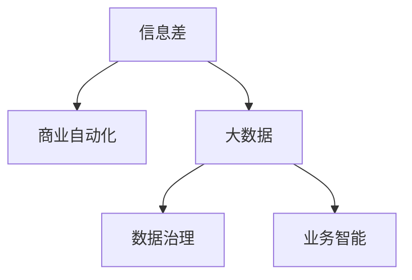

                 

# 信息差的商业自动化：大数据如何实现商业自动化

## 1. 背景介绍

### 1.1 问题由来
在当今快速变化的商业环境中，信息差（Information Gap）的实时管理和利用成为了企业竞争的核心。信息差指的是企业内部和外部信息之间的差异，它反映了企业在市场、产品、顾客需求、竞争环境等各个方面的认知水平。随着数据的爆炸性增长，如何通过大数据技术实现信息差的商业自动化，成为了企业的核心挑战。

### 1.2 问题核心关键点
企业决策者通常面临着信息获取不充分、数据孤岛、信息处理成本高昂等难题，导致无法及时、全面地利用数据指导商业决策。为了解决这些问题，企业需要一种高效、系统的方法来自动采集、处理和分析大数据，以生成有价值的洞察，并实时调整战略。

### 1.3 问题研究意义
实现信息差的商业自动化，不仅可以显著提升企业的决策效率和精准度，还可以帮助企业快速响应市场变化，降低运营成本，提升客户满意度，从而在竞争激烈的市场中占据优势。此外，自动化信息差管理也有助于实现更广泛的业务场景的智能化，推动企业向数字化转型。

## 2. 核心概念与联系

### 2.1 核心概念概述

为更好地理解大数据在信息差商业自动化中的应用，本节将介绍几个密切相关的核心概念：

- **信息差（Information Gap）**：指企业内部和外部信息之间的差异，反映了企业对市场、产品、顾客需求、竞争环境等各个方面的认知水平。
- **商业自动化（Business Automation）**：通过技术手段自动化的企业业务流程，包括数据采集、处理、分析、应用等各个环节，旨在提升效率、降低成本、增强决策支持。
- **大数据（Big Data）**：指无法通过传统数据库软件在合理时间内捕捉、处理和分析的数据集，通常包括结构化数据、非结构化数据和半结构化数据。
- **数据治理（Data Governance）**：确保数据的质量、完整性、一致性和安全性，为商业自动化提供数据基础。
- **业务智能（Business Intelligence, BI）**：利用大数据和先进分析技术，将数据转化为洞察和行动，支持商业决策。

这些核心概念之间的逻辑关系可以通过以下Mermaid流程图来展示：



这个流程图展示了大数据在信息差商业自动化中的应用，从信息差的识别到自动化的实现，各个环节相互关联，共同构成了一个完整的商业自动化生态。

## 3. 核心算法原理 & 具体操作步骤
### 3.1 算法原理概述

信息差的商业自动化通过大数据技术，实现对企业内外信息的自动采集、处理和分析，生成有价值的洞察，并实时调整商业决策。核心算法原理主要包括以下几个步骤：

1. **数据采集**：通过API接口、ETL工具、爬虫等方式自动收集企业内外部的数据，如市场数据、用户行为数据、竞争对手数据等。
2. **数据清洗和预处理**：对采集到的数据进行清洗、去重、归一化等预处理操作，确保数据的质量和一致性。
3. **数据分析**：利用统计分析、机器学习等技术，对处理后的数据进行多维度分析，生成有价值的洞察。
4. **决策支持**：基于分析结果，生成实时商业决策建议，辅助企业决策者进行快速反应。

### 3.2 算法步骤详解

#### 3.2.1 数据采集

数据采集是大数据处理的基础。企业可以利用以下几种方式进行数据采集：

1. **API接口**：通过API接口自动获取企业内部和外部系统中的数据，如CRM系统、ERP系统、社交媒体等。
2. **ETL工具**：使用ETL（Extract, Transform, Load）工具将异构数据源中的数据抽取、转换和加载到数据仓库中。
3. **爬虫技术**：使用Web爬虫从公开数据源中自动采集数据，如金融市场数据、天气数据、用户评论数据等。

#### 3.2.2 数据清洗和预处理

数据清洗和预处理是大数据处理的关键步骤，旨在确保数据的质量和一致性。主要包括以下几个步骤：

1. **数据去重**：通过唯一标识符和数据过滤规则，去除重复数据。
2. **数据归一化**：将不同来源的数据转换为统一的格式，如日期、单位等。
3. **数据补全**：通过插值、平均数、中位数等方法，补充缺失数据。
4. **数据标准化**：将数据标准化为模型所需的输入格式，如归一化、标准化等。

#### 3.2.3 数据分析

数据分析是大数据处理的核心，通过多维度分析生成有价值的洞察。主要包括以下几种方法：

1. **描述性分析**：使用统计学方法描述数据的基本特征，如均值、方差、频率等。
2. **预测性分析**：使用机器学习算法预测未来趋势，如回归分析、时间序列分析等。
3. **诊断性分析**：使用因果分析、关联分析等方法，诊断问题的根本原因。
4. **规范性分析**：使用优化算法推荐决策方案，如线性规划、多目标优化等。

#### 3.2.4 决策支持

决策支持是大数据处理的应用目标，通过分析结果生成实时决策建议，辅助企业决策者进行快速反应。主要包括以下几个步骤：

1. **实时分析**：利用实时计算引擎，对数据进行流式处理，实时生成分析结果。
2. **智能推荐**：使用推荐系统生成业务决策建议，如销售预测、库存管理等。
3. **决策支持系统**：通过仪表板、报告等方式，将分析结果可视化，辅助企业决策者进行快速反应。

### 3.3 算法优缺点

信息差的商业自动化算法具有以下优点：

1. **高效性**：通过自动化数据采集和处理，大大提升了数据处理的效率，减少了人工干预。
2. **全面性**：自动化的数据采集和处理，确保了数据的全面性和完整性，减少了数据孤岛问题。
3. **灵活性**：自动化的数据分析方法，可以灵活应对不同类型的商业问题，提高决策的精准度。
4. **实时性**：通过实时计算引擎，可以实时生成分析结果，快速响应市场变化。

同时，该算法也存在以下局限性：

1. **数据质量**：自动化的数据采集和处理，无法完全保证数据的质量和一致性，需要人工干预和审核。
2. **算法复杂性**：高级数据分析方法，如机器学习、深度学习等，需要较高的技术门槛，增加了算法实施的复杂性。
3. **安全性**：自动化的数据处理，增加了数据泄露和隐私侵犯的风险，需要严格的数据治理和隐私保护措施。
4. **成本高昂**：高级数据分析方法的实施，需要大量的计算资源和人力资源，增加了企业的成本投入。

尽管存在这些局限性，但就目前而言，信息差的商业自动化算法仍是大数据处理的主流范式。未来相关研究的重点在于如何进一步降低算法的复杂性和成本，提高数据质量和安全性，同时兼顾高效性和灵活性。

### 3.4 算法应用领域

信息差的商业自动化算法在多个领域得到了广泛的应用，包括但不限于：

- **金融领域**：自动采集和分析市场数据、用户行为数据、交易数据等，生成实时投资建议，优化投资组合。
- **零售领域**：自动收集和分析顾客行为数据、销售数据、库存数据等，生成库存管理、促销策略、顾客忠诚度提升方案。
- **制造领域**：自动收集和分析生产数据、供应链数据、质量数据等，生成生产调度、库存管理、质量控制方案。
- **医疗领域**：自动收集和分析患者数据、医疗记录、药品数据等，生成患者管理、疾病预防、诊疗建议。
- **物流领域**：自动收集和分析运输数据、库存数据、订单数据等，生成物流规划、库存管理、客户服务方案。

## 4. 数学模型和公式 & 详细讲解  
### 4.1 数学模型构建

信息差的商业自动化主要涉及以下数学模型：

- **数据采集模型**：用于描述自动数据采集的过程，如API接口调用、爬虫爬取等。
- **数据清洗模型**：用于描述数据清洗和预处理的过程，如去重、归一化等。
- **数据分析模型**：用于描述数据分析的过程，如回归分析、时间序列分析等。
- **决策支持模型**：用于描述决策支持的过程，如推荐系统、优化算法等。

以回归分析为例，其数学模型可以表示为：

$$ y = \beta_0 + \beta_1 x_1 + \beta_2 x_2 + \cdots + \beta_n x_n + \epsilon $$

其中 $y$ 表示预测值，$\beta_0, \beta_1, \beta_2, \cdots, \beta_n$ 表示回归系数，$x_1, x_2, \cdots, x_n$ 表示自变量，$\epsilon$ 表示随机误差。

### 4.2 公式推导过程

回归分析的公式推导过程如下：

1. **数据准备**：收集和整理数据，确保数据质量和一致性。
2. **模型建立**：根据自变量和因变量之间的关系，建立回归模型，选择合适的回归方法，如线性回归、逻辑回归等。
3. **模型训练**：使用训练集数据，通过最小二乘法等方法，估计回归系数 $\beta_0, \beta_1, \beta_2, \cdots, \beta_n$。
4. **模型验证**：使用验证集数据，验证模型的泛化能力，调整模型参数，提高模型精度。
5. **模型应用**：使用测试集数据，评估模型的性能，生成预测结果，辅助决策。

### 4.3 案例分析与讲解

以金融领域的投资组合优化为例，其数学模型可以表示为：

$$ \max \sum_{i=1}^n \alpha_i r_i $$

$$ \text{subject to} $$
$$ \sum_{i=1}^n \alpha_i = 1 $$
$$ 0 \leq \alpha_i \leq 1, i = 1, 2, \cdots, n $$

其中 $\alpha_i$ 表示投资组合中第 $i$ 个资产的权重，$r_i$ 表示第 $i$ 个资产的回报率，目标是在满足资产权重约束的前提下，最大化组合的回报率。

通过对该模型进行求解，可以生成最优的投资组合建议，辅助企业决策者进行快速反应。

## 5. 项目实践：代码实例和详细解释说明
### 5.1 开发环境搭建

在进行信息差商业自动化项目实践前，我们需要准备好开发环境。以下是使用Python进行Pandas、NumPy、Scikit-learn等库开发的环境配置流程：

1. 安装Anaconda：从官网下载并安装Anaconda，用于创建独立的Python环境。

2. 创建并激活虚拟环境：
```bash
conda create -n bigdata-env python=3.8 
conda activate bigdata-env
```

3. 安装相关库：
```bash
conda install pandas numpy scikit-learn matplotlib tqdm jupyter notebook ipython
```

完成上述步骤后，即可在`bigdata-env`环境中开始项目实践。

### 5.2 源代码详细实现

这里我们以金融领域的投资组合优化为例，给出使用Pandas和Scikit-learn进行大数据分析和决策支持的PyTorch代码实现。

首先，定义投资组合优化问题：

```python
from sklearn.linear_model import LinearRegression
from sklearn.model_selection import train_test_split
import pandas as pd
import numpy as np

# 加载历史数据
data = pd.read_csv('historical_data.csv')

# 数据预处理
data = data.dropna()
X = data[['资产1', '资产2', '资产3']]  # 自变量
y = data['回报率']  # 因变量

# 分割数据集
X_train, X_test, y_train, y_test = train_test_split(X, y, test_size=0.2, random_state=42)

# 定义回归模型
model = LinearRegression()

# 模型训练
model.fit(X_train, y_train)

# 模型评估
train_score = model.score(X_train, y_train)
test_score = model.score(X_test, y_test)

print(f"训练集R^2分数：{train_score:.2f}")
print(f"测试集R^2分数：{test_score:.2f}")
```

然后，定义投资组合优化问题的数学模型：

```python
from scipy.optimize import minimize

# 定义目标函数
def objective_function(x):
    return -x @ data['资产'].values

# 定义约束条件
constraints = ({'type': 'eq', 'fun': lambda x: x @ data['资产'].values - 1},)
# 定义不等式约束条件
inequalities = ({'type': 'ineq', 'fun': lambda x: -x @ data['资产'].values})

# 定义优化问题
problem = {
    'fun': objective_function,
    'jac': None,
    'constraints': constraints,
    'inequalities': inequalities
}

# 求解优化问题
result = minimize(problem)

print(f"最优资产权重：{result.x}")
print(f"最优回报率：{objective_function(result.x):.2f}")
```

最后，使用决策支持系统生成投资建议：

```python
from sklearn.metrics import mean_squared_error
import matplotlib.pyplot as plt

# 生成投资组合建议
x_values = np.linspace(0, 1, 100)
y_values = np.array([objective_function(x) for x in x_values])

# 绘制回报率曲线
plt.plot(x_values, y_values)
plt.xlabel('资产权重')
plt.ylabel('回报率')
plt.title('投资组合回报率曲线')
plt.show()

# 生成投资建议
weight = result.x
return_rate = objective_function(weight)
investment_strategies = pd.DataFrame({'资产': data['资产'].values, '权重': weight, '回报率': return_rate})

# 输出投资建议
print(investment_strategies)
```

以上就是使用Python对金融领域的投资组合优化问题进行大数据分析和决策支持的完整代码实现。可以看到，利用Pandas和Scikit-learn，我们可以轻松地进行数据预处理、模型训练和优化，并生成有价值的投资建议。

### 5.3 代码解读与分析

让我们再详细解读一下关键代码的实现细节：

**投资组合优化问题定义**：
- 使用Scikit-learn的LinearRegression模型进行回归分析，训练模型并评估性能。
- 使用Pandas进行数据加载和处理，确保数据的质量和一致性。

**数学模型建立**：
- 定义目标函数和约束条件，使用Scipy的minimize函数求解优化问题。
- 目标函数定义了资产组合的回报率，约束条件定义了资产权重之和必须为1。

**投资建议生成**：
- 使用Pandas生成资产组合的回报率曲线，可视化回报率与资产权重的关系。
- 根据优化结果生成投资建议，输出投资组合的资产权重和回报率。

**代码运行结果**：
- 通过运行上述代码，可以生成投资组合的资产权重和回报率，辅助企业决策者进行快速反应。

可以看到，通过Python结合Pandas、Scikit-learn等库，我们可以轻松地进行大数据分析和决策支持，生成有价值的商业洞察。

## 6. 实际应用场景

### 6.1 金融领域

在金融领域，信息差的商业自动化主要应用于投资组合管理、风险控制和客户服务等方面。

**投资组合管理**：自动收集和分析市场数据、用户行为数据、交易数据等，生成实时投资建议，优化投资组合。例如，通过回归分析生成资产回报率预测，指导投资决策。

**风险控制**：自动收集和分析市场数据、用户行为数据、交易数据等，生成风险评估报告，辅助企业进行风险控制。例如，通过时间序列分析生成风险预测，指导企业调整投资策略。

**客户服务**：自动收集和分析客户数据、交易数据、投诉数据等，生成客户服务报告，提高客户满意度。例如，通过聚类分析生成客户群体分类，指导企业进行个性化服务。

### 6.2 零售领域

在零售领域，信息差的商业自动化主要应用于库存管理、促销策略和顾客服务等方面。

**库存管理**：自动收集和分析销售数据、库存数据、供应链数据等，生成库存管理建议，优化库存水平。例如，通过时间序列分析生成库存需求预测，指导企业调整库存策略。

**促销策略**：自动收集和分析顾客行为数据、销售数据、市场数据等，生成促销策略建议，提高销售效率。例如，通过聚类分析生成顾客群体分类，指导企业进行定向促销。

**顾客服务**：自动收集和分析顾客反馈数据、评论数据、投诉数据等，生成顾客服务建议，提高顾客满意度。例如，通过情感分析生成顾客情绪分析报告，指导企业进行服务改进。

### 6.3 制造领域

在制造领域，信息差的商业自动化主要应用于生产调度、质量控制和供应链管理等方面。

**生产调度**：自动收集和分析生产数据、订单数据、设备数据等，生成生产调度建议，优化生产效率。例如，通过时间序列分析生成生产需求预测，指导企业调整生产计划。

**质量控制**：自动收集和分析质量数据、生产数据、设备数据等，生成质量控制建议，提高产品质量。例如，通过聚类分析生成设备故障分类，指导企业进行设备维护。

**供应链管理**：自动收集和分析供应链数据、订单数据、物流数据等，生成供应链管理建议，优化供应链效率。例如，通过网络分析生成供应链路径优化建议，指导企业进行物流调度。

## 7. 工具和资源推荐
### 7.1 学习资源推荐

为了帮助开发者系统掌握信息差的商业自动化技术，这里推荐一些优质的学习资源：

1. **《Python数据科学手册》**：全面介绍Python在数据科学中的应用，涵盖数据采集、处理、分析和可视化等各个环节。
2. **《机器学习实战》**：通过多个实际案例，介绍机器学习的基本算法和应用场景，适合初学者学习。
3. **《数据挖掘导论》**：系统介绍数据挖掘的理论基础和实践方法，涵盖分类、聚类、关联分析等常用算法。
4. **Coursera《机器学习》课程**：斯坦福大学开设的机器学习课程，有视频讲解和配套作业，适合系统学习。
5. **Kaggle数据科学竞赛**：通过参与实际数据科学竞赛，积累经验和提高技能。

通过对这些资源的学习实践，相信你一定能够快速掌握信息差的商业自动化技术，并用于解决实际的商业问题。

### 7.2 开发工具推荐

高效的开发离不开优秀的工具支持。以下是几款用于信息差商业自动化开发的常用工具：

1. **Python**：Python是一种强大的数据科学编程语言，拥有丰富的数据处理和分析库。
2. **Pandas**：Pandas是Python中常用的数据处理库，支持数据清洗、预处理和分析等操作。
3. **NumPy**：NumPy是Python中常用的数值计算库，支持高效数组操作和大规模矩阵计算。
4. **Scikit-learn**：Scikit-learn是Python中常用的机器学习库，支持多种机器学习算法的实现和应用。
5. **TensorBoard**：TensorBoard是TensorFlow配套的可视化工具，可实时监测模型训练状态，提供丰富的图表呈现方式。

合理利用这些工具，可以显著提升信息差商业自动化的开发效率，加快创新迭代的步伐。

### 7.3 相关论文推荐

信息差商业自动化的发展得益于学界的持续研究。以下是几篇奠基性的相关论文，推荐阅读：

1. **《数据挖掘导论》**：讲述了数据挖掘的理论基础和实践方法，涵盖分类、聚类、关联分析等常用算法。
2. **《机器学习实战》**：通过多个实际案例，介绍机器学习的基本算法和应用场景，适合初学者学习。
3. **《Python数据科学手册》**：全面介绍Python在数据科学中的应用，涵盖数据采集、处理、分析和可视化等各个环节。
4. **Coursera《机器学习》课程**：斯坦福大学开设的机器学习课程，有视频讲解和配套作业，适合系统学习。

这些论文代表了大数据处理技术的发展脉络。通过学习这些前沿成果，可以帮助研究者把握学科前进方向，激发更多的创新灵感。

## 8. 总结：未来发展趋势与挑战

### 8.1 总结

本文对信息差商业自动化技术进行了全面系统的介绍。首先阐述了信息差和大数据在商业自动化中的核心价值，明确了自动化的目标和挑战。其次，从原理到实践，详细讲解了信息差商业自动化的数学模型和操作步骤，给出了大数据分析和决策支持的完整代码实现。同时，本文还广泛探讨了信息差商业自动化在金融、零售、制造等多个行业领域的应用前景，展示了大数据技术的广泛应用。

通过本文的系统梳理，可以看到，信息差的商业自动化技术正在成为商业自动化领域的核心驱动力，极大地提升了企业的决策效率和精准度，降低了运营成本，提升了客户满意度。未来，伴随大数据技术和人工智能技术的不断进步，信息差商业自动化将推动企业向数字化、智能化转型，为企业带来更广阔的商业价值。

### 8.2 未来发展趋势

展望未来，信息差商业自动化技术将呈现以下几个发展趋势：

1. **智能化升级**：随着深度学习和大数据技术的进一步发展，信息差商业自动化将逐步向智能化升级，能够更加全面、深入地理解商业问题，生成更精准的决策建议。
2. **自动化水平提升**：自动化采集、处理、分析和应用的大数据流程将更加自动化、智能化，降低人工干预，提高决策效率。
3. **多模态数据融合**：除了结构化数据，信息差商业自动化将进一步融合非结构化数据（如语音、图像等），提高数据的全面性和多样性。
4. **跨领域应用扩展**：信息差商业自动化技术将逐步应用于更多垂直领域，如医疗、教育、政府等，推动这些行业的数字化转型。
5. **实时性增强**：通过流式计算和实时数据处理，信息差商业自动化将实现更加实时、动态的商业决策支持。

以上趋势凸显了信息差商业自动化的广阔前景。这些方向的探索发展，必将进一步提升信息差商业自动化的效率和精度，推动企业向更高层次的智能化转型。

### 8.3 面临的挑战

尽管信息差商业自动化技术已经取得了瞩目成就，但在迈向更加智能化、普适化应用的过程中，它仍面临着诸多挑战：

1. **数据质量**：自动化的数据采集和处理，无法完全保证数据的质量和一致性，需要人工干预和审核。
2. **算法复杂性**：高级数据分析方法，如深度学习、强化学习等，需要较高的技术门槛，增加了算法实施的复杂性。
3. **安全性**：自动化的数据处理，增加了数据泄露和隐私侵犯的风险，需要严格的数据治理和隐私保护措施。
4. **成本高昂**：高级数据分析方法的实施，需要大量的计算资源和人力资源，增加了企业的成本投入。

尽管存在这些挑战，但就目前而言，信息差商业自动化仍是大数据处理的主流范式。未来相关研究的重点在于如何进一步降低算法的复杂性和成本，提高数据质量和安全性，同时兼顾高效性和灵活性。

### 8.4 未来突破

面对信息差商业自动化所面临的种种挑战，未来的研究需要在以下几个方面寻求新的突破：

1. **数据治理**：引入更多数据治理措施，如数据清洗、数据标准化、数据加密等，确保数据的质量和安全性。
2. **算法优化**：开发更加高效、轻量级的算法模型，如压缩算法、分布式算法等，降低算法复杂性和成本。
3. **多模态数据融合**：引入更多多模态数据的融合方法，如跨模态学习、多模态深度学习等，提高数据的全面性和多样性。
4. **跨领域应用**：拓展信息差商业自动化的应用领域，如医疗、教育、政府等，推动更多垂直领域的数字化转型。
5. **实时性增强**：引入更多实时数据处理技术，如流式计算、实时数据存储等，实现更加实时、动态的商业决策支持。

这些研究方向的探索，必将引领信息差商业自动化技术迈向更高的台阶，为构建安全、可靠、可解释、可控的智能系统铺平道路。面向未来，信息差商业自动化技术还需要与其他人工智能技术进行更深入的融合，如知识表示、因果推理、强化学习等，多路径协同发力，共同推动信息差商业自动化的进步。只有勇于创新、敢于突破，才能不断拓展信息差商业自动化的边界，让智能化技术更好地造福人类社会。

## 9. 附录：常见问题与解答

**Q1：信息差商业自动化是否适用于所有商业场景？**

A: 信息差商业自动化在大多数商业场景中都能取得不错的效果，特别是对于数据量较大的场景。但对于一些特定领域的场景，如金融、医疗、政府等，仍然需要针对性地进行数据治理和算法优化。

**Q2：如何选择合适的学习算法？**

A: 选择合适的学习算法需要考虑多个因素，如数据类型、业务目标、计算资源等。一般来说，可以使用以下步骤：
1. 数据探索：了解数据的基本特征，如数据类型、缺失值、异常值等。
2. 算法评估：通过交叉验证、ROC曲线、AUC等指标评估算法的性能。
3. 模型选择：选择最适合当前业务场景的算法，如回归、分类、聚类等。

**Q3：信息差商业自动化在落地部署时需要注意哪些问题？**

A: 将信息差商业自动化技术转化为实际应用，还需要考虑以下问题：
1. 数据治理：引入更多数据治理措施，如数据清洗、数据标准化、数据加密等，确保数据的质量和安全性。
2. 算法优化：开发更加高效、轻量级的算法模型，如压缩算法、分布式算法等，降低算法复杂性和成本。
3. 实时性增强：引入更多实时数据处理技术，如流式计算、实时数据存储等，实现更加实时、动态的商业决策支持。
4. 多模态数据融合：引入更多多模态数据的融合方法，如跨模态学习、多模态深度学习等，提高数据的全面性和多样性。

**Q4：如何确保信息差商业自动化的高效性？**

A: 确保信息差商业自动化的高效性需要从多个环节入手：
1. 数据采集：通过API接口、ETL工具、爬虫技术等方式，自动化数据采集，确保数据的全面性和实时性。
2. 数据处理：使用高效的算法和工具，如Pandas、NumPy等，进行数据清洗、预处理和分析。
3. 算法优化：选择高效的算法模型，如回归、分类、聚类等，优化模型参数，提高算法效率。
4. 实时计算：使用流式计算和实时数据处理技术，实现实时决策支持，提高决策效率。

这些措施将有助于确保信息差商业自动化的高效性和实时性，满足商业自动化的需求。

---

作者：禅与计算机程序设计艺术 / Zen and the Art of Computer Programming

