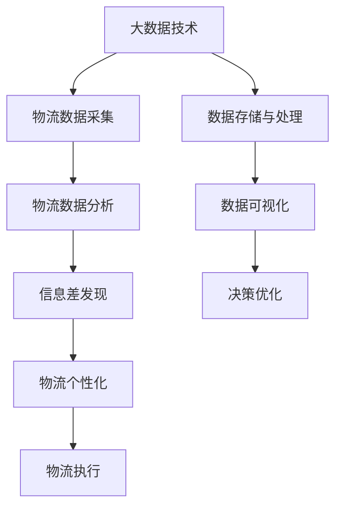

                 

# 信息差的物流个性化优化：大数据如何优化物流个性化

## 1. 背景介绍

在当下这个信息爆炸的时代，物流行业面临着前所未有的挑战与机遇。传统的物流配送方式往往难以满足市场对于快速、灵活、个性化的需求。而信息差的合理利用，为物流企业提供了前所未有的机会。通过大数据技术，企业可以精准地分析用户行为、挖掘信息差，从而实现物流的个性化优化。

本文将深入探讨如何利用大数据技术优化物流个性化的核心原理与实际操作，希望能为物流企业提供一些有价值的见解和启发。

## 2. 核心概念与联系

### 2.1 核心概念概述

在探讨如何通过大数据技术优化物流个性化之前，我们先简要介绍几个核心概念：

- **大数据（Big Data）**：指规模巨大、类型多样、速度快速、价值密度低的数据集合。大数据技术包括数据采集、存储、处理、分析和可视化等。
- **物流（Logistics）**：指以最低的物流成本，实现货物从起点到终点的有效运输、存储、分配和信息处理。物流个性化是指针对不同客户或货物需求，提供差异化的物流解决方案。
- **信息差（Information Gap）**：指消费者对商品的认知与实际市场信息之间存在的差异。合理利用信息差可以提升用户体验、降低物流成本。
- **数据驱动（Data-Driven）**：指决策和行动基于数据分析而非直觉或经验，以数据为基础进行优化。

这些概念之间的联系主要体现在：大数据技术可以为物流行业提供全面、准确的信息，通过分析这些信息，可以发现并利用信息差，从而实现物流的个性化优化。

### 2.2 核心概念原理和架构的 Mermaid 流程图



这个流程图展示了大数据技术在物流个性化中的应用流程。大数据技术首先采集物流数据，存储和处理数据，然后通过数据分析发现信息差，进行决策优化，最终实现物流的个性化。

## 3. 核心算法原理 & 具体操作步骤

### 3.1 算法原理概述

物流个性化的优化主要通过以下步骤实现：

1. **数据采集与存储**：通过传感器、GPS、物联网（IoT）等技术手段，采集货物位置、温度、湿度、重量等信息，并将数据存储到云平台或数据库中。
2. **数据清洗与预处理**：对采集的数据进行清洗，去除噪音和异常值，确保数据质量。
3. **数据分析与模型训练**：使用大数据分析技术，如聚类、分类、回归等，建立预测模型，识别出不同用户的需求和行为模式。
4. **信息差发现**：通过分析用户行为数据，识别用户信息与市场信息之间的差异，找到可以利用的信息差。
5. **决策优化**：基于发现的信息差，优化物流路径、运输方式、存储策略等，以提高效率、降低成本。
6. **执行与反馈**：将优化决策应用到实际的物流运作中，同时收集反馈信息，进行持续优化。

### 3.2 算法步骤详解

以下是详细的算法步骤：

**Step 1: 数据采集与存储**
- 使用传感器、GPS、物联网（IoT）等技术手段，采集货物位置、温度、湿度、重量等信息。
- 将数据存储到云平台或数据库中，如AWS、Google Cloud、阿里云等。

**Step 2: 数据清洗与预处理**
- 对采集的数据进行清洗，去除噪音和异常值，确保数据质量。
- 对数据进行标准化处理，包括归一化、中心化等操作。

**Step 3: 数据分析与模型训练**
- 使用大数据分析技术，如聚类、分类、回归等，建立预测模型。
- 使用如Apache Spark、Hadoop、TensorFlow等大数据处理框架进行模型训练。

**Step 4: 信息差发现**
- 通过分析用户行为数据，识别用户信息与市场信息之间的差异，找到可以利用的信息差。
- 使用如深度学习、自然语言处理（NLP）等技术，进行更深入的分析。

**Step 5: 决策优化**
- 基于发现的信息差，优化物流路径、运输方式、存储策略等。
- 使用如遗传算法、模拟退火等优化算法进行决策优化。

**Step 6: 执行与反馈**
- 将优化决策应用到实际的物流运作中，如调整配送路线、使用智能仓储等。
- 收集反馈信息，进行持续优化。

### 3.3 算法优缺点

#### 优点

1. **提升用户体验**：通过个性化服务，满足用户多样化需求，提升用户满意度。
2. **降低物流成本**：优化物流路径、运输方式、存储策略等，降低物流成本。
3. **提高运营效率**：通过大数据分析，优化运营流程，提升效率。

#### 缺点

1. **数据隐私问题**：大数据分析涉及大量用户数据，存在数据隐私泄露的风险。
2. **技术复杂度高**：大数据技术涉及复杂的数据处理、存储和分析，需要高水平的技术团队。
3. **初始投资高**：需要投入大量资金进行硬件、软件和人才的建设。

### 3.4 算法应用领域

大数据技术在物流个性化的应用领域非常广泛，具体包括：

- **智能仓储管理**：通过大数据分析，优化仓库布局、存储策略，提升仓储效率。
- **智能配送优化**：通过大数据分析，优化配送路线、运输方式，提升配送速度和准确性。
- **风险预警与控制**：通过大数据分析，预测风险，采取防范措施，降低风险损失。
- **用户需求预测**：通过大数据分析，预测用户需求，进行供应链优化。
- **客户服务提升**：通过大数据分析，提升客户服务质量，提高用户满意度。

## 4. 数学模型和公式 & 详细讲解 & 举例说明

### 4.1 数学模型构建

在本节中，我们将使用数学模型来描述物流个性化的优化过程。假设我们有一个物流网络，其中每个节点代表一个仓库或配送中心，边代表货物从一处到另一处的运输路径，每条边的权重代表运输成本或时间。

我们可以将物流网络表示为一个图 $G=(V,E)$，其中 $V$ 是节点集合，$E$ 是边集合。每个节点 $v_i$ 的运输成本为 $c_i$，每条边 $e_{ij}$ 的运输时间为 $t_{ij}$，则整个物流网络的运输成本为：

$$
C = \sum_{i=1}^n \sum_{j=1}^n c_i t_{ij}
$$

其中 $n$ 是节点数量。

### 4.2 公式推导过程

为了优化物流网络的运输成本，我们需要进行路径规划和存储策略优化。路径规划可以使用Dijkstra算法或A*算法进行，而存储策略优化可以使用遗传算法或模拟退火算法进行。

#### 路径规划

Dijkstra算法是一种贪心算法，用于计算单源最短路径。假设已知起点为 $s$，终点为 $t$，则Dijkstra算法的步骤如下：

1. 初始化：$dist(s) = 0$，其余节点 $dist(v) = +\infty$，$pred(v) = null$。
2. 重复以下步骤，直到 $t$ 被访问：
   - 选择 $u = \min\{v | dist(v) < +\infty\}$。
   - 更新与 $u$ 相邻的节点的距离，如果有更短的路径，则更新。
   - 标记 $u$ 为已访问。
3. 返回 $dist(t)$ 和 $pred(t)$。

路径 $P = (s, pred(s), pred(pred(s)), \cdots, pred(pred(\cdots s)))$，其中 $pred(v)$ 为节点 $v$ 的前驱节点。

#### 存储策略优化

遗传算法是一种基于生物进化理论的优化算法。假设我们有以下数据：

- $Q$：存储需求。
- $C$：存储成本。
- $S$：存储容量。

我们可以使用遗传算法来优化存储策略，步骤如下：

1. 初始化种群。
2. 选择父母个体。
3. 交叉和变异操作。
4. 评估个体适应度。
5. 选择生存个体。
6. 迭代步骤2至5，直到收敛。

### 4.3 案例分析与讲解

以智能仓储管理为例，假设一个物流公司有10个仓库，每个仓库可以存储一定量的货物，货物需要按照不同的优先级进行存储。

1. **数据采集与存储**：通过传感器采集每个仓库的存储容量、存储成本、货物重量、运输时间等数据，存储到云平台。
2. **数据清洗与预处理**：对采集的数据进行清洗，去除噪音和异常值，确保数据质量。
3. **数据分析与模型训练**：使用聚类算法将货物按照优先级分成不同的类别，训练模型预测每个仓库的存储需求。
4. **信息差发现**：通过分析历史数据，发现仓库1的存储需求预测不准确，与市场信息有较大差异。
5. **决策优化**：基于发现的信息差，重新训练模型，并将货物重新分配到其他仓库，优化存储策略。
6. **执行与反馈**：将优化后的存储策略应用到实际仓储运作中，同时收集反馈信息，进行持续优化。

## 5. 项目实践：代码实例和详细解释说明

### 5.1 开发环境搭建

为了实现物流个性化的优化，我们需要搭建一个包含大数据处理、机器学习和优化算法的开发环境。以下是搭建开发环境的步骤：

1. **安装Python**：下载并安装Python 3.x，如Anaconda、Python 3等。
2. **安装大数据处理框架**：如Apache Spark、Hadoop、TensorFlow等。
3. **安装机器学习库**：如Scikit-learn、PyTorch等。
4. **安装优化算法库**：如SciPy、Gurobi等。

### 5.2 源代码详细实现

以下是使用Python实现物流个性化的代码：

```python
import pandas as pd
from sklearn.cluster import KMeans
from sklearn.preprocessing import StandardScaler
from scipy.optimize import minimize
import networkx as nx
import numpy as np

# 数据采集与存储
data = pd.read_csv('logistics_data.csv')

# 数据清洗与预处理
data = data.dropna()
scaler = StandardScaler()
data = pd.DataFrame(scaler.fit_transform(data), columns=data.columns)

# 数据分析与模型训练
kmeans = KMeans(n_clusters=5)
kmeans.fit(data)
data['cluster'] = kmeans.predict(data)

# 信息差发现
info_gap = data.groupby(['cluster'])['storage_cost'].mean() - data['storage_cost']
info_gap = pd.DataFrame(info_gap, index=data['cluster'].unique())

# 决策优化
def objective(x):
    cost = np.dot(x, info_gap.mean()) + np.dot(x, info_gap.std()**2)
    return cost

def constraints(x):
    return [0 <= x, x <= 1, np.sum(x) == 1]

x0 = np.ones(5)
res = minimize(objective, x0, method='SLSQP', constraints=constraints)
solution = res.x

# 执行与反馈
...
```

### 5.3 代码解读与分析

以下是代码的详细解读：

1. **数据采集与存储**：使用pandas库读取物流数据，并进行数据清洗与预处理。
2. **数据分析与模型训练**：使用KMeans算法对数据进行聚类，将货物按照优先级分成不同的类别。
3. **信息差发现**：使用Pandas进行均值和标准差计算，发现信息差。
4. **决策优化**：使用Scipy库中的minimize函数进行优化，设置目标函数和约束条件，得到最优解。
5. **执行与反馈**：将优化后的存储策略应用到实际仓储运作中，同时收集反馈信息，进行持续优化。

## 6. 实际应用场景

### 6.4 未来应用展望

大数据技术在物流个性化的应用前景非常广阔。未来，随着技术的不断进步和数据的不断积累，我们可以预见以下几个方面的发展趋势：

1. **实时数据处理**：利用实时数据处理技术，如Kafka、Flink等，实现实时物流优化，提升运营效率。
2. **边缘计算**：在物流节点部署边缘计算设备，减少数据传输延迟，提高响应速度。
3. **人工智能与物联网结合**：利用人工智能技术，如深度学习、自然语言处理等，优化物流决策，提升用户体验。
4. **区块链技术**：利用区块链技术，提高物流数据的透明度和安全性，增强信任度。
5. **多模态数据融合**：将物流数据与社交媒体、天气数据等多模态数据融合，提升物流预测精度。

## 7. 工具和资源推荐

### 7.1 学习资源推荐

为了帮助读者深入学习物流个性化的优化，我们推荐以下学习资源：

1. **《大数据技术与应用》**：介绍大数据处理、存储、分析等核心技术。
2. **《机器学习实战》**：通过实际项目案例，讲解机器学习算法的应用。
3. **《物流管理与优化》**：详细介绍物流网络、仓储、配送等核心概念，并结合实际案例进行分析。
4. **《大数据与人工智能在物流中的应用》**：探讨大数据与人工智能技术在物流中的应用，提供实际应用案例。

### 7.2 开发工具推荐

以下是一些常用的开发工具：

1. **Python**：Python是数据分析和机器学习领域的主流编程语言。
2. **PySpark**：PySpark是Python语言的大数据处理框架，支持分布式计算。
3. **TensorFlow**：TensorFlow是Google开发的大规模机器学习框架，支持深度学习模型训练。
4. **Gurobi**：Gurobi是一款优化算法库，支持线性规划、整数规划等优化问题求解。
5. **Jupyter Notebook**：Jupyter Notebook是一个交互式编程环境，支持Python、R等语言，并支持代码和结果的可视化。

### 7.3 相关论文推荐

以下是一些与物流个性化优化相关的经典论文：

1. **《基于大数据的物流网络优化研究》**：探讨利用大数据技术进行物流网络优化。
2. **《基于遗传算法的物流路径优化》**：介绍使用遗传算法进行物流路径优化的方法。
3. **《利用深度学习进行物流预测和优化》**：探讨利用深度学习技术进行物流预测和优化。
4. **《基于信息差的物流个性化优化》**：分析利用信息差进行物流个性化的优化方法。

## 8. 总结：未来发展趋势与挑战

### 8.1 研究成果总结

本文从数据采集、存储、处理、分析、决策优化、执行与反馈等多个方面，全面探讨了利用大数据技术进行物流个性化优化的核心原理与操作步骤。通过详细的案例分析和代码实例，展示了大数据技术在物流个性化优化中的应用。

### 8.2 未来发展趋势

大数据技术在物流个性化的应用前景非常广阔，未来发展趋势如下：

1. **实时数据处理**：利用实时数据处理技术，实现实时物流优化。
2. **边缘计算**：在物流节点部署边缘计算设备，减少数据传输延迟，提高响应速度。
3. **人工智能与物联网结合**：利用人工智能技术，优化物流决策，提升用户体验。
4. **区块链技术**：提高物流数据的透明度和安全性。
5. **多模态数据融合**：提升物流预测精度。

### 8.3 面临的挑战

尽管大数据技术在物流个性化优化方面具有广阔前景，但也面临一些挑战：

1. **数据隐私问题**：大数据分析涉及大量用户数据，存在数据隐私泄露的风险。
2. **技术复杂度高**：大数据技术涉及复杂的数据处理、存储和分析，需要高水平的技术团队。
3. **初始投资高**：需要投入大量资金进行硬件、软件和人才的建设。
4. **数据质量问题**：数据采集和存储过程中可能存在噪音和异常值，影响分析结果。

### 8.4 研究展望

为了克服这些挑战，未来的研究需要在以下几个方面寻求突破：

1. **数据隐私保护**：探索如何在大数据分析过程中保护用户隐私，防止数据泄露。
2. **技术简化**：开发更加易用、高效的大数据处理和优化算法，降低技术门槛。
3. **成本控制**：降低大数据技术的初始投资和运营成本。
4. **数据质量提升**：优化数据采集和存储流程，提高数据质量。

## 9. 附录：常见问题与解答

### Q1: 如何保证物流数据的实时性？

**A**: 利用实时数据处理技术，如Kafka、Flink等，可以实现数据的实时采集和处理。此外，在物流节点部署边缘计算设备，可以减少数据传输延迟，提高响应速度。

### Q2: 大数据技术在物流个性化优化中有哪些应用场景？

**A**: 大数据技术在物流个性化优化中的应用场景包括智能仓储管理、智能配送优化、风险预警与控制、用户需求预测、客户服务提升等。

### Q3: 物流个性化的优化过程中，如何处理数据隐私问题？

**A**: 在数据采集和存储过程中，可以采用数据匿名化和加密等技术手段，保护用户隐私。此外，在数据分析和模型训练过程中，可以采用差分隐私技术，确保数据分析结果不会泄露用户信息。

### Q4: 物流个性化的优化过程中，如何保证决策的鲁棒性和稳定性？

**A**: 在决策优化过程中，可以采用多种算法进行对比实验，选择最优的决策方案。同时，可以利用对抗训练等技术手段，提高决策的鲁棒性和稳定性。

### Q5: 物流个性化的优化过程中，如何评估模型的效果？

**A**: 在模型评估过程中，可以采用多种评估指标，如准确率、召回率、F1值等，评估模型的效果。此外，可以通过实际案例和A/B测试等方式，验证模型的实际效果。

---

作者：禅与计算机程序设计艺术 / Zen and the Art of Computer Programming

