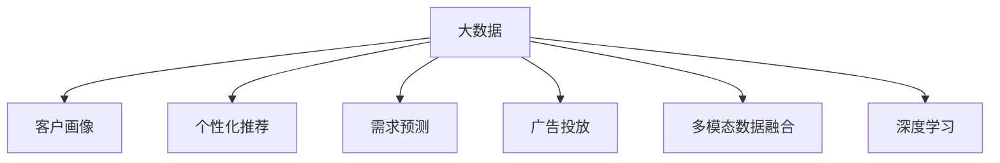

                 

## 1. 背景介绍

### 1.1 问题由来
在数字化时代，消费者通过网络获取信息更加便捷、快速，但也面临着信息过载的困扰。与此同时，商家与消费者之间的信息差逐渐拉大，这不仅影响了消费者决策，也限制了商家的营销效果。传统营销策略往往以大规模传播和内容堆砌为核心，成本高、效果差，无法精准触达目标用户。

### 1.2 问题核心关键点
如何利用大数据分析技术，精准捕捉和理解消费者需求，优化营销策略，缩小信息差，提升用户满意度，增加销售额，是当前营销研究的热点问题。基于此，本文将详细阐述大数据在营销中的应用，介绍如何通过数据驱动的方式，实现个性化推荐、需求预测、广告投放等任务，为商家提供高效、精准的营销解决方案。

## 2. 核心概念与联系

### 2.1 核心概念概述

为更好地理解大数据在营销中的应用，本节将介绍几个密切相关的核心概念：

- **大数据（Big Data）**：指规模大、种类多、速度快的数据集合。大数据涵盖从结构化数据到非结构化数据的各个方面，为企业提供了深入洞察客户行为、市场趋势的机会。

- **客户画像（Customer Persona）**：基于消费者数据构建的虚拟客户形象，包括基本信息、兴趣爱好、行为偏好等，是精准营销的重要基础。

- **个性化推荐（Personalized Recommendation）**：根据用户历史行为、偏好等数据，推荐符合其需求的产品或内容，提高用户体验和转化率。

- **需求预测（Demand Forecasting）**：通过分析历史销售数据、市场趋势等，预测未来市场需求，帮助商家进行库存管理和市场布局。

- **广告投放（Advertising Placement）**：基于用户画像和行为数据，精准投放广告，提高广告投放效果和ROI。

- **多模态数据融合（Multi-modal Data Fusion）**：将不同类型的数据（如文本、图像、语音等）进行融合，提取更全面的用户信息，提高营销决策的准确性。

- **深度学习（Deep Learning）**：通过神经网络等深度学习模型，从大规模数据中提取复杂特征，应用于营销中的各种任务。

这些核心概念之间的逻辑关系可以通过以下Mermaid流程图来展示：



这个流程图展示了大数据在营销中的应用场景及其与其他关键概念之间的关联。

## 3. 核心算法原理 & 具体操作步骤

### 3.1 算法原理概述

基于大数据的营销策略，其核心思想是利用数据挖掘和机器学习技术，从海量数据中提取有用信息，优化营销决策。具体来说，包括以下几个关键步骤：

1. **数据采集**：从多渠道收集消费者行为数据、市场数据、外部环境数据等，构建大数据池。
2. **数据清洗与预处理**：清洗异常数据、缺失值等，进行归一化、降维等预处理，提升数据质量。
3. **数据分析与建模**：运用统计学、机器学习等技术，分析数据，构建模型，预测市场需求、个性化推荐等。
4. **策略优化**：根据分析结果，优化营销策略，提高广告投放的精准度和转化率。

### 3.2 算法步骤详解

以下是基于大数据的营销策略的具体操作步骤：

**Step 1: 数据采集**

- 整合各种数据源，包括线上行为数据（如点击率、浏览记录）、社交媒体数据（如评论、分享）、线下交易数据（如购买记录、物流信息）等。
- 利用API接口、爬虫等技术，实时采集数据，保证数据的完整性和时效性。

**Step 2: 数据清洗与预处理**

- 对采集到的数据进行初步清洗，去除重复、噪声、异常值等。
- 对数据进行归一化、标准化处理，确保不同来源的数据具有可比性。
- 对文本、图像等非结构化数据进行预处理，如分词、特征提取等。

**Step 3: 数据分析与建模**

- 使用统计学方法，如回归分析、聚类分析等，进行基础数据分析。
- 应用机器学习算法，如决策树、随机森林、神经网络等，建立预测模型。
- 利用深度学习模型，如卷积神经网络、循环神经网络等，进行特征提取和模式识别。

**Step 4: 策略优化**

- 根据模型预测结果，进行个性化推荐、需求预测、广告投放等营销策略的优化。
- 通过A/B测试等方法，评估优化策略的效果，不断迭代和调整。

### 3.3 算法优缺点

基于大数据的营销策略具有以下优点：

1. **精准度提高**：通过数据分析，可以更精准地了解消费者需求和市场趋势，实现个性化推荐和需求预测，提高广告投放的精准度。
2. **成本降低**：减少了传统营销中的无效传播和内容堆砌，优化资源配置，降低营销成本。
3. **效果显著**：通过数据驱动，可以快速迭代和优化营销策略，实现更好的业务效果。

同时，该方法也存在一定的局限性：

1. **数据隐私**：消费者数据的采集和使用涉及隐私问题，需要严格遵守数据保护法规。
2. **数据质量**：数据采集和清洗的准确性直接影响分析结果和营销策略的有效性。
3. **模型复杂性**：深度学习模型等复杂模型需要大量计算资源和时间，存在一定的训练难度。
4. **多模态数据融合**：不同类型的数据特征差异大，融合难度大，需要更多的技术手段。

尽管存在这些局限性，但就目前而言，基于大数据的营销策略仍是营销研究的主流范式。未来相关研究的重点在于如何进一步提高数据质量、优化模型性能、增强数据隐私保护等方面。

### 3.4 算法应用领域

基于大数据的营销策略已经在多个领域得到了应用，包括但不限于：

- **零售行业**：通过个性化推荐和需求预测，提高用户满意度，增加销售额。
- **广告行业**：利用广告投放优化技术，实现更精准的广告定向和投放，提高广告效果。
- **金融行业**：利用消费者行为数据和市场趋势，优化产品设计，提高客户粘性和收益。
- **医疗行业**：通过数据分析和建模，优化医疗资源配置，提高诊疗效率和患者满意度。
- **旅游行业**：利用需求预测和个性化推荐，提升旅游产品推荐效果，增加游客留存率。

这些领域的应用证明了大数据在营销中的巨大潜力，也为其他行业提供了宝贵的经验和技术借鉴。

## 4. 数学模型和公式 & 详细讲解  
### 4.1 数学模型构建

假设我们有数据集 $D=\{(x_i,y_i)\}_{i=1}^N$，其中 $x_i$ 为输入特征，$y_i$ 为输出标签。大数据在营销中的应用可以表示为以下几个步骤：

1. **数据采集**：从不同渠道采集数据，构建数据集 $D$。
2. **数据清洗与预处理**：对数据进行清洗、归一化等预处理，得到预处理后的数据集 $\tilde{D}$。
3. **模型训练**：使用机器学习或深度学习模型，如决策树、随机森林、卷积神经网络等，对数据进行建模，得到模型 $M$。
4. **策略优化**：根据模型预测结果，进行个性化推荐、需求预测、广告投放等策略优化。

### 4.2 公式推导过程

以个性化推荐为例，假设我们有一个用户 $u$，其历史行为数据为 $\mathcal{H}(u)$。我们使用协同过滤算法进行推荐，其中 $\mathcal{F}$ 为物品的特征表示，$P(u,\mathcal{F})$ 为用户对物品的评分预测。推荐算法可以表示为：

$$
\hat{P}(u,\mathcal{F}) = \alpha u^\top V + \beta \sum_{v\in \mathcal{V}} (\mathcal{F}(v))^\top W
$$

其中 $u$ 为用户向量，$V$ 为物品特征向量的权重矩阵，$W$ 为物品特征向量的权重向量，$\alpha$ 和 $\beta$ 为调整系数。

### 4.3 案例分析与讲解

假设我们有一个电商平台的推荐系统，目标是为用户推荐其可能感兴趣的商品。根据用户历史浏览记录和购买记录，我们可以构建用户画像 $\mathcal{P}(u)$ 和物品特征表示 $\mathcal{F}(v)$。使用协同过滤算法，预测用户对物品的评分 $P(u,v)$，然后进行排序推荐。

具体步骤如下：

1. 收集用户历史行为数据，构建用户画像 $\mathcal{P}(u)$。
2. 收集物品特征数据，构建物品特征向量 $\mathcal{F}(v)$。
3. 计算用户对物品的评分预测 $P(u,v)$。
4. 根据评分预测，对物品进行排序推荐。

通过这种方式，可以大幅提高推荐系统的精准度和用户满意度。

## 5. 项目实践：代码实例和详细解释说明

### 5.1 开发环境搭建

在进行营销策略开发前，我们需要准备好开发环境。以下是使用Python进行Scikit-learn开发的开发环境配置流程：

1. 安装Anaconda：从官网下载并安装Anaconda，用于创建独立的Python环境。

2. 创建并激活虚拟环境：
```bash
conda create -n ml-env python=3.8 
conda activate ml-env
```

3. 安装Scikit-learn：
```bash
conda install scikit-learn
```

4. 安装各类工具包：
```bash
pip install numpy pandas matplotlib scikit-learn
```

完成上述步骤后，即可在`ml-env`环境中开始营销策略开发。

### 5.2 源代码详细实现

这里我们以电商推荐系统为例，给出使用Scikit-learn进行协同过滤算法推荐模型的Python代码实现。

首先，定义数据处理函数：

```python
from sklearn.feature_extraction.text import TfidfVectorizer
from sklearn.metrics.pairwise import cosine_similarity
from sklearn.decomposition import TruncatedSVD

def preprocess_data(data):
    # 文本特征提取
    vectorizer = TfidfVectorizer()
    X = vectorizer.fit_transform(data['description'])
    
    # 计算用户-物品相似度
    similarity = cosine_similarity(X)
    
    # 降维与排序推荐
    svd = TruncatedSVD(n_components=100)
    svd.fit(X)
    U = svd.transform(X)
    sorted_indices = np.argsort(similarity, axis=1)[:, ::-1]
    return U, sorted_indices
```

然后，定义推荐函数：

```python
def recommend(user, U, sorted_indices):
    # 计算用户画像
    user = np.array(U[user])
    
    # 根据相似度排序推荐
    similar_items = [item for item in sorted_indices[user]]
    return similar_items
```

最后，启动推荐流程：

```python
# 加载数据
data = pd.read_csv('items.csv')

# 预处理数据
U, sorted_indices = preprocess_data(data)

# 推荐商品
user = 123  # 假设用户ID为123
similar_items = recommend(user, U, sorted_indices)
print(similar_items)
```

以上就是使用Scikit-learn进行协同过滤算法推荐模型的完整代码实现。可以看到，通过Scikit-learn，我们可以轻松构建高效的推荐系统。

### 5.3 代码解读与分析

让我们再详细解读一下关键代码的实现细节：

**preprocess_data函数**：
- 定义了一个文本特征提取器，将物品描述转换为向量表示。
- 计算用户-物品的相似度，使用余弦相似度衡量。
- 使用TruncatedSVD对向量进行降维和排序推荐。

**recommend函数**：
- 根据用户画像和相似度矩阵，推荐用户可能感兴趣的商品。
- 输出推荐结果。

**主推荐流程**：
- 加载数据集。
- 预处理数据，计算用户-物品相似度矩阵。
- 根据相似度矩阵，推荐商品。

可以看到，Scikit-learn提供了丰富的机器学习工具和算法，可以轻松实现各种复杂的推荐算法，提高营销策略的智能化水平。

当然，工业级的系统实现还需考虑更多因素，如用户行为数据的实时采集、推荐系统的在线部署、推荐策略的动态调整等。但核心的算法和流程基本与此类似。

## 6. 实际应用场景

### 6.1 电子商务

基于大数据的推荐系统在电子商务领域的应用非常广泛。通过分析用户浏览、点击、购买等行为数据，电商平台可以推荐用户可能感兴趣的商品，提高用户满意度和购买率。推荐算法可以根据用户画像、物品特征等多维度数据，进行精准推荐，提升营销效果。

### 6.2 广告投放

广告投放是大数据在营销中的另一个重要应用。通过分析用户行为数据和市场趋势，广告主可以更精准地定向广告投放，提高广告的点击率和转化率。利用大数据分析，广告主可以识别出高价值用户群体，优化广告投放策略，提升广告投放效果。

### 6.3 金融服务

金融服务行业也越来越多地应用大数据分析技术，进行精准营销和风险管理。通过分析用户的金融行为数据和市场趋势，银行和金融机构可以推荐个性化的金融产品，提高客户粘性和收益。同时，大数据分析还可以帮助金融机构进行风险预测和管理，防范金融风险。

### 6.4 医疗健康

医疗健康领域也逐步引入大数据分析技术，进行精准营销和医疗资源优化。通过分析患者的历史诊疗记录和健康数据，医疗机构可以推荐个性化的医疗方案，提高诊疗效率和患者满意度。同时，大数据分析还可以帮助医疗机构进行医疗资源配置和预测，提高医疗服务的可及性和效率。

### 6.5 旅游旅游

旅游行业也利用大数据分析技术，进行精准营销和需求预测。通过分析用户的旅游行为数据和市场趋势，旅游机构可以推荐个性化的旅游产品，提高用户满意度和留存率。大数据分析还可以帮助旅游机构进行需求预测和市场布局，提升旅游业务的收入和市场占有率。

## 7. 工具和资源推荐

### 7.1 学习资源推荐

为了帮助开发者系统掌握大数据在营销中的应用，这里推荐一些优质的学习资源：

1. **《Python数据科学手册》**：这本书详细介绍了Python在数据科学和机器学习中的应用，是学习大数据营销的必备教材。

2. **Coursera的机器学习课程**：由斯坦福大学教授Andrew Ng开设，涵盖机器学习的基础理论和实践技巧，适合初学者入门。

3. **Kaggle竞赛平台**：Kaggle提供大量真实世界的数据集和挑战，可以帮助开发者锻炼数据分析和建模能力，积累实战经验。

4. **Scikit-learn官方文档**：Scikit-learn的官方文档，提供了丰富的机器学习算法和工具，是进行大数据营销开发的必备参考资料。

5. **《数据科学实战》**：这本书涵盖了从数据采集到模型部署的完整过程，适合有经验的数据科学家和工程师阅读。

通过对这些资源的学习实践，相信你一定能够快速掌握大数据在营销中的应用，并用于解决实际的业务问题。

### 7.2 开发工具推荐

高效的开发离不开优秀的工具支持。以下是几款用于大数据营销开发的常用工具：

1. Python：Python是数据科学和机器学习的主流语言，拥有丰富的第三方库和工具。

2. Scikit-learn：Scikit-learn提供了丰富的机器学习算法和工具，简单易用，适合快速迭代研究。

3. Pandas：Pandas是Python中常用的数据处理库，支持多种数据格式，适合进行大规模数据分析和预处理。

4. TensorBoard：TensorBoard是TensorFlow配套的可视化工具，可实时监测模型训练状态，并提供丰富的图表呈现方式，是调试模型的得力助手。

5. Google Colab：Google Colab是谷歌推出的在线Jupyter Notebook环境，免费提供GPU/TPU算力，方便开发者快速上手实验最新模型，分享学习笔记。

合理利用这些工具，可以显著提升大数据营销任务的开发效率，加快创新迭代的步伐。

### 7.3 相关论文推荐

大数据在营销中的应用是当前研究的热点领域，以下是几篇奠基性的相关论文，推荐阅读：

1. **“The Paper That Sparked the Big Data Revolution”**：David E. McClean的文章介绍了大数据的概念和应用，为大数据营销的发展奠定了基础。

2. **“Deep Learning for Recommendation Systems”**：Jian bin Huang等人综述了深度学习在推荐系统中的应用，介绍了各种深度学习算法和模型。

3. **“Big Data Mining and Statistical Learning”**：Cheng Ying和Chen Zhang介绍了大数据挖掘和统计学习的方法和技术，涵盖了各种机器学习算法和应用。

4. **“Adaptive Personalization for Search and Recommendation”**：Richard Zhao等人介绍了个性化推荐算法的研究现状和未来方向，适合了解最新研究进展。

5. **“Big Data Analytics for Marketing”**：Fanglin Wang等人介绍了大数据在营销中的应用，涵盖个性化推荐、需求预测、广告投放等多个方面。

这些论文代表了大数据在营销中的研究方向和前沿技术，通过学习这些成果，可以帮助研究者把握学科前进方向，激发更多的创新灵感。

## 8. 总结：未来发展趋势与挑战

### 8.1 总结

本文对基于大数据的营销策略进行了全面系统的介绍。首先阐述了大数据在营销中的研究背景和应用场景，明确了大数据在优化营销决策、提高用户满意度、增加销售额等方面的独特价值。其次，从原理到实践，详细讲解了大数据营销的数学模型和关键步骤，给出了营销策略开发的完整代码实例。同时，本文还广泛探讨了大数据在多个行业领域的应用前景，展示了大数据在营销中的巨大潜力。

通过本文的系统梳理，可以看到，基于大数据的营销策略正在成为营销研究的重要范式，极大地拓展了营销决策的智能化水平，提升了业务效果。未来，伴随大数据技术的不断进步，大数据营销必将在更广泛的领域大放异彩，深刻影响各行各业的数字化转型。

### 8.2 未来发展趋势

展望未来，大数据在营销中的应用将呈现以下几个发展趋势：

1. **数据规模扩大**：随着物联网、5G等技术的普及，数据采集和存储成本降低，大数据规模将进一步扩大。未来的大数据营销将更加依赖大规模、高速度的数据。

2. **算法复杂性提高**：大数据分析技术将进一步深入发展，深度学习等复杂算法将被广泛应用于营销决策中。大数据营销将更加精准、智能化。

3. **跨领域融合**：大数据营销将与其他技术进行更多融合，如自然语言处理、计算机视觉、增强现实等，提升营销的互动性和沉浸感。

4. **实时分析增强**：大数据分析技术将实现实时数据处理，营销策略可以实时调整和优化，提升决策效率和响应速度。

5. **隐私保护加强**：大数据营销中的数据隐私问题将越来越受到重视，数据匿名化、差分隐私等技术将被广泛应用。

6. **伦理规范完善**：大数据营销中的数据使用和隐私保护问题将受到更多关注，相关伦理规范和法律法规将逐步完善。

以上趋势凸显了大数据在营销中的广阔前景，这些方向的探索发展，必将进一步提升大数据营销的效果和应用范围，为构建人机协同的智能营销系统铺平道路。

### 8.3 面临的挑战

尽管大数据在营销中取得了显著成效，但在迈向更加智能化、普适化应用的过程中，它仍面临着诸多挑战：

1. **数据隐私**：消费者数据的采集和使用涉及隐私问题，需要严格遵守数据保护法规。如何平衡数据利用和隐私保护是一个重要课题。

2. **数据质量**：数据采集和清洗的准确性直接影响分析结果和营销策略的有效性。如何提高数据质量，减少噪音和异常值，需要更多的技术和手段。

3. **算法复杂性**：深度学习等复杂算法需要大量计算资源和时间，存在一定的训练难度。如何降低算法复杂性，提高模型训练效率，是一个需要攻克的难题。

4. **多模态数据融合**：不同类型的数据特征差异大，融合难度大，需要更多的技术手段。如何高效融合多模态数据，提取全面的用户信息，是一个重要的研究方向。

5. **实时分析要求高**：实时数据处理和实时决策要求高，需要更强大的计算能力和更灵活的技术支持。

6. **数据安全**：大数据分析过程中，数据泄露和数据篡改的风险增加，需要更严格的数据安全措施。

这些挑战凸显了大数据营销的复杂性，需要跨学科、多领域的协同合作，共同探索解决之道。

### 8.4 研究展望

面对大数据营销面临的挑战，未来的研究需要在以下几个方面寻求新的突破：

1. **数据隐私保护**：探索数据匿名化、差分隐私等技术，平衡数据利用和隐私保护。

2. **数据质量提升**：研发高效的数据清洗和预处理算法，提高数据质量。

3. **算法优化**：开发高效、易用的深度学习模型和算法，降低算法复杂性，提高模型训练效率。

4. **多模态数据融合**：探索高效的多模态数据融合方法，提取全面的用户信息。

5. **实时分析技术**：研发高效、灵活的实时数据分析工具，支持实时数据处理和决策。

6. **数据安全措施**：制定严格的数据安全措施，保障数据安全和隐私保护。

这些研究方向将进一步提升大数据在营销中的应用效果和智能化水平，为构建更加智能、安全的营销系统提供新的技术支撑。

## 9. 附录：常见问题与解答

**Q1：如何在大数据营销中保护用户隐私？**

A: 在大数据营销中，保护用户隐私是至关重要的。以下是一些常用的隐私保护技术：

1. **数据匿名化**：对用户数据进行去标识化处理，使数据无法直接关联到具体个体，保护用户隐私。

2. **差分隐私**：在数据分析过程中，通过加入噪声，使得攻击者无法确定单个数据点的具体信息，保护用户隐私。

3. **加密技术**：对数据进行加密存储和传输，确保数据在处理过程中不被窃取或篡改。

4. **访问控制**：严格控制数据的访问权限，仅允许授权人员进行数据处理和分析，防止数据泄露。

5. **用户授权**：在数据使用前，获取用户授权，告知用户数据使用方式，保护用户知情权。

通过以上措施，可以有效保护用户隐私，确保大数据营销的安全性和合法性。

**Q2：如何提高大数据营销中的数据质量？**

A: 提高大数据营销中的数据质量，需要从数据采集、清洗和预处理等多个环节进行优化：

1. **数据采集**：选择合适的数据源，避免采集异常数据和噪声数据。

2. **数据清洗**：去除重复数据、缺失值、异常值等，保证数据的完整性和准确性。

3. **数据归一化**：对不同来源的数据进行归一化处理，确保数据具有可比性。

4. **数据去重**：使用去重算法，去除重复数据，提高数据质量。

5. **数据验证**：定期进行数据验证，检测数据是否存在问题，及时进行修正。

通过以上措施，可以有效提高大数据营销中的数据质量，减少数据噪音和误差，提升营销决策的准确性。

**Q3：如何在大数据营销中实现实时分析？**

A: 实现大数据营销中的实时分析，需要采用高效的实时数据处理技术：

1. **流式处理框架**：使用Apache Kafka、Apache Flink等流式处理框架，实现数据的实时处理和存储。

2. **实时数据库**：使用Apache Hive、Apache Cassandra等实时数据库，支持数据的实时查询和分析。

3. **实时计算框架**：使用Spark Streaming、Storm等实时计算框架，进行实时数据分析和处理。

4. **消息队列**：使用RabbitMQ、Kafka等消息队列，实现数据的高效传输和处理。

5. **实时监控工具**：使用TensorBoard、Grafana等实时监控工具，实时监测数据处理和分析过程，确保系统稳定运行。

通过以上技术手段，可以实现实时数据处理和实时决策，提高大数据营销的响应速度和决策效率。

**Q4：如何在大数据营销中避免算法复杂性？**

A: 避免算法复杂性，需要采用高效、易用的算法和模型：

1. **简化算法**：使用简单的算法，如线性回归、逻辑回归等，避免复杂深度学习模型。

2. **算法优化**：通过算法优化，提高模型训练效率，降低算法复杂性。

3. **模型压缩**：使用模型压缩技术，减少模型大小和计算资源消耗，提高模型效率。

4. **模型融合**：使用集成学习等技术，将多个简单模型组合成复杂模型，提高模型效果。

5. **模型解释**：使用模型解释技术，提高模型可解释性，减少模型复杂性。

通过以上措施，可以降低算法复杂性，提高模型训练效率和模型效果。

**Q5：如何在大数据营销中实现多模态数据融合？**

A: 实现多模态数据融合，需要采用高效的数据融合技术和算法：

1. **特征提取**：对不同类型的数据进行特征提取，将其转换为可比较的向量形式。

2. **数据融合算法**：使用数据融合算法，如加权融合、决策融合等，将不同类型的数据进行融合。

3. **数据标注**：对数据进行标注，提高数据的可比较性和可理解性。

4. **模型融合**：使用集成学习等技术，将多模态数据融合到模型中，提高模型的泛化性和效果。

5. **数据可视化**：使用数据可视化工具，如Matplotlib、Seaborn等，展示多模态数据的融合效果，帮助理解数据特征。

通过以上技术手段，可以实现多模态数据的融合，提取全面的用户信息，提升大数据营销的效果。

总之，大数据在营销中的应用前景广阔，但也面临着诸多挑战和难题。通过系统学习相关技术，合理利用工具和资源，不断探索优化方案，相信大数据营销必将迎来更加智能化、普适化的发展，为各行各业带来新的机遇和挑战。

