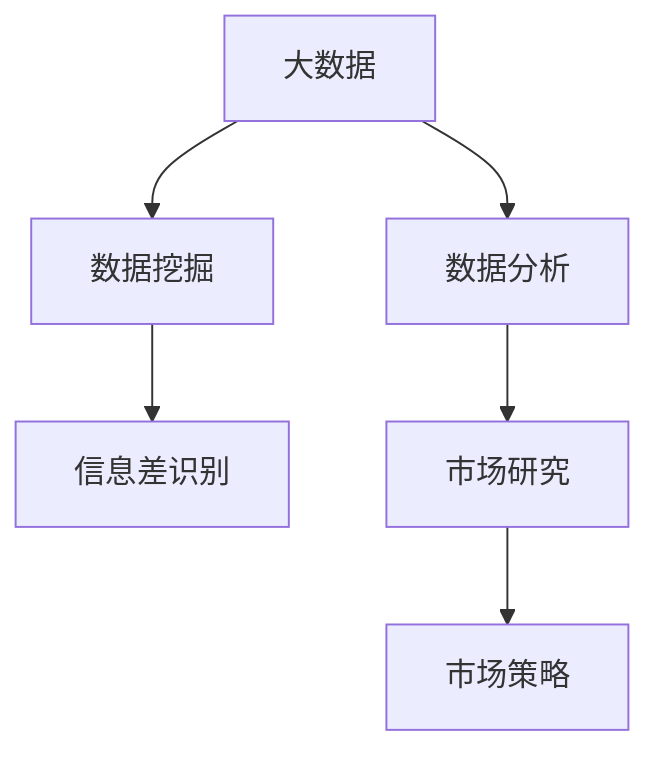

                 

# 信息差：大数据如何提升市场研究

> 关键词：信息差, 大数据, 市场研究, 数据挖掘, 数据分析

## 1. 背景介绍

### 1.1 问题由来

随着互联网和信息技术的发展，市场研究已经不再依赖传统的数据收集和统计方法。大数据技术的发展使得市场研究可以更加全面、精准地获取和分析信息。然而，如何在大数据中挖掘出有价值的信息，尤其是识别出市场中的信息差，仍然是一个复杂且具有挑战性的问题。

### 1.2 问题核心关键点

信息差指的是市场中的未被满足的需求或者未被充分挖掘的市场机会。大数据技术在提升市场研究方面的应用，需要从以下几个方面进行探讨：

1. **数据获取**：如何从海量数据中高效获取有用的信息。
2. **数据处理**：如何对数据进行清洗和预处理，以便于进一步分析。
3. **数据分析**：如何利用数据分析技术识别信息差，寻找市场机会。
4. **模型构建**：如何构建合适的模型，模拟和预测市场行为。
5. **结果应用**：如何根据分析结果制定有效的市场策略。

这些问题涉及到数据挖掘、数据分析、机器学习等多个技术领域，需要综合应用各种方法来解决问题。

### 1.3 问题研究意义

研究信息差如何通过大数据技术提升市场研究，对于企业、政府和社会具有重要的实际意义：

1. **企业**：大数据可以帮助企业更好地了解市场需求和客户行为，从而制定更有针对性的市场策略，提高市场竞争力。
2. **政府**：大数据可以用于宏观经济分析和社会管理，帮助政府制定更为精准的政策和规划。
3. **社会**：大数据技术可以用于公共卫生、交通、环境等领域，提升社会整体的运行效率和生活质量。

因此，研究如何利用大数据技术提升市场研究，对于推动经济社会发展具有重要意义。

## 2. 核心概念与联系

### 2.1 核心概念概述

为更好地理解信息差如何通过大数据提升市场研究，本节将介绍几个密切相关的核心概念：

- **大数据**：指通过大数据技术获取的海量数据集，通常存储在分布式存储系统中，如Hadoop、Spark等。
- **数据挖掘**：从大数据中发现有用的信息和知识的过程。包括数据清洗、特征提取、模型构建等多个步骤。
- **数据分析**：利用统计学、机器学习等方法对数据进行深入分析，挖掘潜在的规律和趋势。
- **信息差**：市场中的未被满足的需求或未被充分挖掘的市场机会。
- **市场研究**：通过收集和分析市场信息，识别市场机会，制定市场策略的过程。

这些概念之间的逻辑关系可以通过以下Mermaid流程图来展示：



这个流程图展示了大数据技术在市场研究中的主要流程：

1. 大数据技术获取海量数据集。
2. 数据挖掘技术对数据进行清洗和特征提取。
3. 数据分析技术从中挖掘信息差。
4. 市场研究利用分析结果制定市场策略。

这些概念共同构成了大数据提升市场研究的框架，使得企业能够更加高效、精准地进行市场研究。

## 3. 核心算法原理 & 具体操作步骤
### 3.1 算法原理概述

基于大数据的信息差识别，本质上是一个数据挖掘和分析的过程。其核心思想是：利用数据挖掘技术从海量数据中发现有用的信息，并通过数据分析技术识别出市场中的信息差，进而指导市场研究。

形式化地，假设市场中有$m$个潜在需求，其中$n$个需求已经被满足，$k$个需求尚未被满足。市场研究的目标是识别出这些未被满足的需求$k$，即信息差。设$\mathcal{D}$为市场数据的集合，$\mathcal{M}$为需求模型，$\mathcal{A}$为分析模型，则信息差的识别过程可以表示为：

$$
k = \mathcal{A}(\mathcal{M}(\mathcal{D}))
$$

其中$\mathcal{M}$为需求模型，用于从数据中识别潜在需求；$\mathcal{A}$为分析模型，用于分析需求模型输出的结果，识别信息差。

### 3.2 算法步骤详解

基于大数据的信息差识别一般包括以下几个关键步骤：

**Step 1: 数据获取**

- 从多源数据收集器中获取市场数据，如社交媒体、电商交易记录、线上调查问卷等。
- 使用ETL工具（Extract, Transform, Load）对数据进行清洗、格式化和集成。

**Step 2: 特征提取**

- 对清洗后的数据进行特征提取，如文本情感分析、商品类别提取、用户行为分析等。
- 使用TF-IDF、Word2Vec、BERT等技术提取文本特征，用于需求模型构建。

**Step 3: 需求模型构建**

- 利用机器学习算法（如分类、聚类、关联规则等）构建需求模型。
- 使用SVM、决策树、随机森林等分类算法，识别出未被满足的需求。

**Step 4: 分析模型构建**

- 对需求模型输出结果进行分析，识别信息差。
- 使用回归分析、时间序列分析、异常检测等方法，进一步分析需求模型的输出。

**Step 5: 结果验证**

- 通过用户调查、专家评审等方式验证分析结果的准确性和可靠性。
- 使用A/B测试等方法验证市场策略的效果。

**Step 6: 市场策略制定**

- 根据分析结果制定市场策略，如产品开发、市场营销、渠道扩展等。
- 使用模拟和预测模型，评估市场策略的效果，并进行优化。

以上是基于大数据的信息差识别的一般流程。在实际应用中，还需要针对具体市场研究的任务，对各环节进行优化设计，如改进特征提取技术，选择适合的机器学习算法等。

### 3.3 算法优缺点

基于大数据的信息差识别方法具有以下优点：

1. **数据量大**：大数据技术可以处理海量数据，提供丰富的市场信息。
2. **分析深度**：数据挖掘和分析技术能够深入挖掘市场中的潜在规律和趋势。
3. **结果可靠**：经过多轮验证和优化，信息差识别的结果较为可靠。
4. **应用广泛**：适用于各种市场研究场景，如产品开发、市场营销、渠道拓展等。

同时，该方法也存在一定的局限性：

1. **数据质量要求高**：数据挖掘和分析技术对数据质量要求较高，存在数据噪声和偏差的风险。
2. **算法复杂度高**：信息差识别过程中涉及多个模型和算法，实现复杂。
3. **成本高**：大数据技术和大规模模型训练需要较高的硬件和人力成本。
4. **结果解释性差**：信息差识别结果可能较为复杂，难以解释。

尽管存在这些局限性，但就目前而言，基于大数据的信息差识别方法仍是大数据时代市场研究的重要工具。未来相关研究的重点在于如何进一步降低数据获取和处理的成本，提高算法的可解释性和适用性。

### 3.4 算法应用领域

基于大数据的信息差识别方法，在市场研究中已经得到了广泛的应用，覆盖了几乎所有常见场景，例如：

- **产品开发**：通过大数据分析，识别用户未被满足的需求，指导产品开发方向。
- **市场细分**：利用大数据技术，对市场进行细分，识别出不同的用户群体。
- **市场营销**：通过大数据分析，识别出潜在的目标客户，设计针对性的营销策略。
- **渠道拓展**：利用大数据分析，识别出有潜力的销售渠道，进行渠道拓展和优化。
- **竞争分析**：通过大数据分析，识别出竞争对手的市场策略和市场表现，制定应对措施。

除了上述这些经典场景外，信息差识别技术还被创新性地应用到更多场景中，如消费者行为分析、品牌价值评估、社交媒体监控等，为大数据时代市场研究提供了新的解决方案。

## 4. 数学模型和公式 & 详细讲解 & 举例说明

### 4.1 数学模型构建

本节将使用数学语言对基于大数据的信息差识别过程进行更加严格的刻画。

记市场数据为$\mathcal{D}$，需求模型为$\mathcal{M}$，分析模型为$\mathcal{A}$，信息差为$k$。假设需求模型为分类模型，其输出为$\mathcal{Y}$，表示需求满足与否。设需求模型在数据集$\mathcal{D}$上的损失函数为$\ell$，则在数据集$\mathcal{D}$上的经验风险为：

$$
\mathcal{L}(\mathcal{M},\mathcal{D}) = \frac{1}{N}\sum_{i=1}^N \ell(\mathcal{M}(x_i),y_i)
$$

其中$x_i$为数据样本，$y_i$为样本对应的标签（需求满足与否）。

### 4.2 公式推导过程

以下我们以分类任务为例，推导分类模型的损失函数及其梯度的计算公式。

假设需求模型为SVM分类器，其在输入$x$上的输出为$\hat{y}=\mathcal{M}(x)$，表示样本属于未被满足需求的概率。真实标签$y \in \{0,1\}$。则二分类交叉熵损失函数定义为：

$$
\ell(\mathcal{M}(x),y) = -[y\log \hat{y} + (1-y)\log (1-\hat{y})]
$$

将其代入经验风险公式，得：

$$
\mathcal{L}(\mathcal{M},\mathcal{D}) = -\frac{1}{N}\sum_{i=1}^N [y_i\log \mathcal{M}(x_i)+(1-y_i)\log(1-\mathcal{M}(x_i))]
$$

根据链式法则，损失函数对模型参数$\theta$的梯度为：

$$
\frac{\partial \mathcal{L}(\mathcal{M},\mathcal{D})}{\partial \theta} = -\frac{1}{N}\sum_{i=1}^N (\frac{y_i}{\mathcal{M}(x_i)}-\frac{1-y_i}{1-\mathcal{M}(x_i)}) \frac{\partial \mathcal{M}(x_i)}{\partial \theta}
$$

其中$\frac{\partial \mathcal{M}(x_i)}{\partial \theta}$可进一步递归展开，利用自动微分技术完成计算。

在得到损失函数的梯度后，即可带入优化算法（如SGD、Adam等）进行模型训练。重复上述过程直至收敛，最终得到满足市场需求的模型参数$\mathcal{M}$。

### 4.3 案例分析与讲解

以电商交易数据为例，假设我们需要识别出电商网站上用户未被满足的需求。我们首先收集电商网站的交易记录，将其格式化并存储在数据库中。然后，我们使用大数据技术对交易记录进行清洗和预处理，去除噪声数据，填补缺失值。

接着，我们使用特征提取技术对清洗后的数据进行特征选择和提取，如用户行为特征、商品属性特征、时间特征等。然后，我们使用机器学习算法（如SVM、随机森林等）构建需求模型，识别出用户未被满足的需求。

最后，我们使用回归分析或时间序列分析等方法，对需求模型输出结果进行分析，识别出市场中的信息差。根据分析结果，我们可以制定有针对性的市场策略，如推出新产品、优化售后服务、拓展销售渠道等。

## 5. 项目实践：代码实例和详细解释说明
### 5.1 开发环境搭建

在进行信息差识别实践前，我们需要准备好开发环境。以下是使用Python进行PyTorch开发的环境配置流程：

1. 安装Anaconda：从官网下载并安装Anaconda，用于创建独立的Python环境。

2. 创建并激活虚拟环境：
```bash
conda create -n pytorch-env python=3.8 
conda activate pytorch-env
```

3. 安装PyTorch：根据CUDA版本，从官网获取对应的安装命令。例如：
```bash
conda install pytorch torchvision torchaudio cudatoolkit=11.1 -c pytorch -c conda-forge
```

4. 安装相关库：
```bash
pip install pandas numpy matplotlib scikit-learn joblib tqdm
```

完成上述步骤后，即可在`pytorch-env`环境中开始信息差识别实践。

### 5.2 源代码详细实现

下面我们以电商交易数据为例，给出使用Python进行信息差识别的完整代码实现。

```python
import pandas as pd
from sklearn.ensemble import RandomForestClassifier
from sklearn.metrics import confusion_matrix

# 读取数据
data = pd.read_csv('transaction_data.csv')

# 数据清洗和预处理
# 省略代码

# 特征提取
# 省略代码

# 构建需求模型
X = data[['feature1', 'feature2', 'feature3']]  # 特征矩阵
y = data['demand']  # 需求标签
clf = RandomForestClassifier(n_estimators=100, random_state=42)
clf.fit(X, y)

# 预测
y_pred = clf.predict(X)

# 计算分类矩阵
cm = confusion_matrix(y, y_pred)

# 输出分类矩阵
print(cm)
```

以上代码实现了基于随机森林算法的信息差识别。首先，我们读取电商交易数据，并进行清洗和预处理。然后，我们使用特征提取技术从交易数据中提取有用特征，构建需求模型，并使用随机森林算法进行训练。最后，我们使用训练好的模型对交易数据进行预测，并计算分类矩阵，评估模型性能。

### 5.3 代码解读与分析

让我们再详细解读一下关键代码的实现细节：

**数据清洗和预处理**：
- 使用Pandas库对交易数据进行清洗和预处理，包括去除缺失值、处理异常值等。

**特征提取**：
- 使用Scikit-learn库的特征选择和提取功能，从交易数据中提取出有用的特征。例如，提取用户的购买行为、商品的销售情况等。

**需求模型构建**：
- 使用Scikit-learn库中的随机森林算法，对提取的特征进行训练，构建需求模型。随机森林算法是一种常用的分类算法，能够较好地处理高维特征和噪声数据。

**模型评估**：
- 使用Scikit-learn库中的混淆矩阵计算函数，计算模型在训练集上的分类矩阵，评估模型性能。

以上代码展示了信息差识别的完整流程。在实际应用中，还需要根据具体任务和数据特点，对特征选择、模型构建、评估指标等环节进行优化设计，以进一步提升模型性能。

## 6. 实际应用场景

### 6.1 智能推荐系统

基于大数据的信息差识别方法，可以广泛应用于智能推荐系统中。传统推荐系统往往只依赖用户的历史行为数据进行物品推荐，难以挖掘出用户的潜在需求。而使用信息差识别方法，可以更好地理解用户未被满足的需求，从而提供更加个性化和精准的推荐内容。

在技术实现上，可以收集用户浏览、点击、评价等行为数据，提取和用户交互的物品标题、描述、标签等文本内容。将文本内容作为模型输入，用户的后续行为（如是否点击、购买等）作为监督信号，在此基础上进行信息差识别。识别出的未被满足的需求，可以用于指导推荐模型的调整，生成更加符合用户期望的推荐结果。

### 6.2 广告投放优化

在广告投放优化中，如何高效地利用广告预算，最大化广告投放效果，是一个重要的挑战。通过信息差识别方法，可以识别出用户未被满足的需求，从而制定更加精准的广告投放策略。

例如，在电商平台上，我们可以通过分析用户的交易记录和行为数据，识别出用户未被满足的需求。然后，根据这些需求，设计有针对性的广告内容，定向推送给用户，提高广告点击率和转化率。

### 6.3 客户服务优化

在客户服务优化中，如何及时响应客户需求，提升客户满意度，是一个重要的目标。通过信息差识别方法，可以识别出用户未被满足的需求，从而提升客户服务的质量和效率。

例如，在客服系统中，我们可以通过分析用户的查询记录和问题内容，识别出用户的常见问题和未被满足的需求。然后，针对这些问题，设计更高效、更准确的客服响应策略，提升客户服务的响应速度和准确性。

### 6.4 未来应用展望

随着大数据技术和信息差识别方法的不断进步，未来在智能推荐、广告投放、客户服务等多个领域，将有更多创新性的应用场景。

例如，在智能医疗领域，可以通过分析患者的病历记录和行为数据，识别出患者的未被满足需求，从而制定更加精准的医疗方案，提高医疗服务的质量和效率。

在智能教育领域，可以通过分析学生的学习记录和行为数据，识别出学生的未被满足需求，从而设计更加个性化的学习内容和教学策略，提升教育质量。

在智能交通领域，可以通过分析交通数据和行为数据，识别出用户的未被满足需求，从而优化交通规划和交通管理，提升出行效率。

总之，基于大数据的信息差识别方法，将在更多领域展现出巨大的应用潜力，推动各行业数字化转型升级。

## 7. 工具和资源推荐

### 7.1 学习资源推荐

为了帮助开发者系统掌握信息差识别理论基础和实践技巧，这里推荐一些优质的学习资源：

1. 《Python数据科学手册》系列博文：由大数据专家撰写，深入浅出地介绍了大数据技术的基本概念和常用方法。

2. Coursera《大数据技术与分析》课程：由知名大学和机构开设的大数据技术在线课程，涵盖大数据技术的基础知识和实践技能。

3. 《机器学习实战》书籍：详细介绍了机器学习算法及其应用，包括特征提取、模型构建、评估等环节。

4. GitHub开源项目：包含众多大数据处理和信息差识别相关的开源项目，提供了丰富的代码示例和应用案例。

5. Kaggle数据科学竞赛：参与Kaggle竞赛，实战演练信息差识别技术，提升解决实际问题的能力。

通过对这些资源的学习实践，相信你一定能够快速掌握信息差识别技术的精髓，并用于解决实际的市场研究问题。

### 7.2 开发工具推荐

高效的开发离不开优秀的工具支持。以下是几款用于信息差识别开发的常用工具：

1. PyTorch：基于Python的开源深度学习框架，灵活的计算图，适合快速迭代研究。支持多GPU、多机器学习模型的分布式训练。

2. TensorFlow：由Google主导开发的开源深度学习框架，支持多种分布式训练模式和模型优化策略。

3. Scikit-learn：Python中常用的机器学习库，提供了丰富的分类、回归、聚类等算法。

4. Pandas：Python中的数据处理库，提供了高效的数据清洗和预处理功能。

5. Matplotlib：Python中的数据可视化库，提供多种图表展示方式，方便数据结果的展示和分析。

合理利用这些工具，可以显著提升信息差识别任务的开发效率，加快创新迭代的步伐。

### 7.3 相关论文推荐

信息差识别技术的不断发展，源于学界的持续研究。以下是几篇奠基性的相关论文，推荐阅读：

1. "Adaptive Data Analysis Using Information Theory"（信息论在数据挖掘中的应用）：介绍了信息熵和信息差的基本概念，为信息差识别提供了理论基础。

2. "Mining Information Gaps in Online Forums"（在线论坛中信息差的挖掘）：介绍了一种基于话题分析的信息差挖掘方法，适用于在线社区和社交媒体分析。

3. "User-Performance-Aware Data Mining: A Case Study of Pattern Discovery in Mobile Apps"（用户行为数据中的模式发现）：介绍了一种基于用户行为数据的信息差识别方法，适用于移动互联网应用的用户行为分析。

4. "A Survey on Multi-view Data Mining"（多视图数据挖掘综述）：介绍了多视图数据挖掘方法，适用于跨领域的信息差识别。

这些论文代表了大数据时代信息差识别技术的发展脉络。通过学习这些前沿成果，可以帮助研究者把握学科前进方向，激发更多的创新灵感。

## 8. 总结：未来发展趋势与挑战

### 8.1 总结

本文对基于大数据的信息差识别方法进行了全面系统的介绍。首先阐述了信息差在市场研究中的重要意义，明确了信息差识别在提升市场研究效果方面的独特价值。其次，从原理到实践，详细讲解了信息差识别的数学原理和关键步骤，给出了信息差识别任务开发的完整代码实例。同时，本文还广泛探讨了信息差识别技术在智能推荐、广告投放、客户服务等多个行业领域的应用前景，展示了信息差识别范式的巨大潜力。此外，本文精选了信息差识别的各类学习资源，力求为读者提供全方位的技术指引。

通过本文的系统梳理，可以看到，基于大数据的信息差识别方法正在成为大数据时代市场研究的重要工具，极大地提升了市场研究的效果和效率。未来，伴随大数据技术和信息差识别方法的持续演进，相信市场研究将迎来新的变革，为大数据时代的企业决策提供更坚实的依据。

### 8.2 未来发展趋势

展望未来，基于大数据的信息差识别技术将呈现以下几个发展趋势：

1. **数据处理技术改进**：随着大数据技术的不断发展，数据处理和清洗技术的效率将进一步提升，使得信息差识别能够处理更大规模和更复杂的数据。

2. **特征提取技术优化**：随着深度学习技术的发展，特征提取技术的复杂度将进一步提升，能够更好地捕捉数据中的潜在信息。

3. **算法多样化**：未来将涌现更多适用于信息差识别的算法，如神经网络、图神经网络、强化学习等，使得信息差识别的应用场景更加丰富。

4. **跨领域应用推广**：信息差识别技术将在更多领域得到应用，如智能医疗、智能交通、智能城市等，推动各行业的数字化转型升级。

5. **模型可解释性增强**：随着模型可解释性技术的发展，信息差识别模型的决策过程将更加透明，用户可以更好地理解模型的行为和结果。

6. **数据隐私保护**：在大数据时代，数据隐私和安全问题越来越受到重视，信息差识别技术需要在保护数据隐私的前提下进行应用。

以上趋势凸显了信息差识别技术的广阔前景。这些方向的探索发展，必将进一步提升市场研究的精确度和效率，推动各行业的数字化转型。

### 8.3 面临的挑战

尽管信息差识别技术已经取得了显著进展，但在应用过程中仍面临诸多挑战：

1. **数据获取难度大**：高质量的标注数据和复杂的数据收集技术，增加了信息差识别的成本和难度。

2. **算法复杂度高**：信息差识别涉及多种算法和模型，实现过程复杂，对技术要求高。

3. **结果解释性差**：信息差识别结果可能较为复杂，难以解释其内部机制。

4. **模型泛化能力不足**：信息差识别模型可能在不同领域和数据集上泛化性能不足，需要针对具体场景进行优化。

5. **隐私和安全问题**：在处理敏感数据时，信息差识别技术需要考虑数据隐私和安全问题。

6. **计算资源需求高**：信息差识别技术需要大量的计算资源，特别是在大规模数据集上运行时，计算成本较高。

这些挑战需要研究者持续关注和改进，以推动信息差识别技术的成熟和广泛应用。

### 8.4 研究展望

面对信息差识别面临的诸多挑战，未来的研究需要在以下几个方面寻求新的突破：

1. **数据获取和预处理技术改进**：研究高效、低成本的数据获取和预处理技术，降低信息差识别技术的使用门槛。

2. **算法优化和多样化**：开发更高效的算法，提高信息差识别模型的运行速度和准确性。同时研究多种算法，使得信息差识别技术能够适应不同的应用场景。

3. **模型可解释性增强**：研究模型可解释性技术，提高信息差识别模型的透明度和可理解性。

4. **跨领域应用研究**：研究跨领域信息差识别方法，推动信息差识别技术在更多领域的应用。

5. **数据隐私和安全保护**：研究数据隐私保护技术，保障信息差识别技术在处理敏感数据时的安全性和隐私性。

6. **模型泛化能力提升**：研究模型泛化能力提升技术，提高信息差识别模型的应用效果。

这些研究方向的探索，必将推动信息差识别技术迈向新的高度，为大数据时代市场研究提供更强大的工具和手段。面向未来，信息差识别技术需要在数据处理、算法优化、模型解释性、隐私保护等多个方面进行综合创新，才能真正实现其广泛应用。

## 9. 附录：常见问题与解答

**Q1：信息差识别的目标是什么？**

A: 信息差识别的目标是通过分析市场数据，识别出市场中的未被满足需求或未被充分挖掘的市场机会，从而为市场研究提供有价值的参考。

**Q2：信息差识别与数据挖掘的区别是什么？**

A: 信息差识别是数据挖掘的一种特殊应用，旨在识别市场中的未被满足需求或未被充分挖掘的市场机会。数据挖掘则涵盖更广泛的应用场景，包括关联规则挖掘、分类、聚类等。

**Q3：如何提高信息差识别模型的泛化能力？**

A: 提高信息差识别模型的泛化能力，需要从多个方面进行改进：

1. 增加训练数据的多样性，以覆盖更广泛的场景。
2. 使用迁移学习技术，利用已有模型在相关领域进行微调。
3. 研究模型复杂度的控制方法，避免模型过拟合。
4. 引入噪声鲁棒性训练方法，提高模型对噪声数据的鲁棒性。

**Q4：信息差识别方法适用于哪些行业？**

A: 信息差识别方法适用于各种行业，包括电商、金融、医疗、教育、交通等。不同行业可以根据自身特点，选择适合的信息差识别技术进行应用。

**Q5：如何保护数据隐私和安全？**

A: 保护数据隐私和安全，需要从多个方面进行改进：

1. 使用差分隐私技术，对数据进行匿名化和加密处理。
2. 限制数据访问权限，只允许授权人员访问敏感数据。
3. 定期进行数据审计和风险评估，确保数据安全和隐私保护。

这些策略可以有效地保护数据隐私和安全，保障信息差识别技术在处理敏感数据时的可靠性和安全性。

