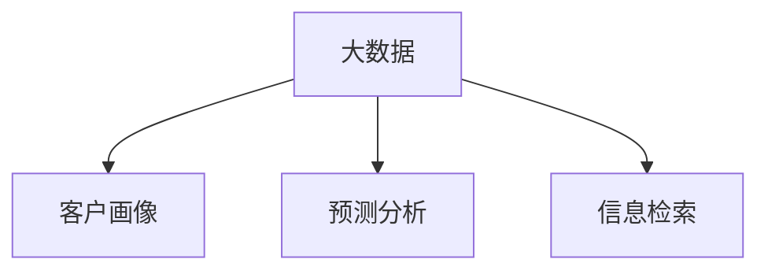

                 

## 1. 背景介绍

### 1.1 问题由来
在当今数据驱动的时代，销售管理面临着前所未有的机遇与挑战。一方面，大数据的广泛应用为企业提供了更加深入的市场洞察和客户理解，有助于制定更精准的营销策略和决策；另一方面，庞大的数据量也对销售管理系统的信息处理能力和决策支持能力提出了更高要求。信息差（Information Gap）——即企业在信息获取、处理和应用中的不足，直接影响了销售管理的效果和效率。如何通过大数据技术有效缩小信息差，成为企业提升销售管理水平的关键。

### 1.2 问题核心关键点
信息差的消除需要综合运用数据挖掘、机器学习、信息检索等大数据技术手段，全面提升销售管理的信息获取、处理和应用能力。本文将深入探讨以下关键问题：
1. 如何通过大数据技术优化销售数据的收集和处理，构建准确、全面的客户画像。
2. 如何利用机器学习算法进行精准的销售预测和客户行为分析。
3. 如何通过信息检索技术，提高销售人员的查询效率和决策支持能力。

通过回答这些问题，本文旨在提供一套全面的大数据驱动销售管理解决方案，帮助企业更高效地管理销售过程，实现业绩增长。

### 1.3 问题研究意义
解决信息差问题，对于提升企业销售管理水平具有重要意义：
1. **提高决策质量**：通过数据分析和机器学习，销售管理者能够获得更加全面和深入的洞察，减少决策中的主观性和误差，提升决策质量。
2. **优化客户体验**：基于大数据分析，企业能够更准确地理解和预测客户需求，提供更个性化的产品和服务，增强客户满意度。
3. **提升运营效率**：大数据技术可以优化销售流程，减少人工操作，降低运营成本，提高整体运营效率。
4. **促进创新**：大数据分析可以揭示市场趋势和机会，帮助企业发现新的增长点，推动业务创新。

## 2. 核心概念与联系

### 2.1 核心概念概述

为了更好地理解大数据如何提升销售管理，本节将介绍几个密切相关的核心概念：

- **大数据（Big Data）**：指规模庞大、类型多样的数据集合，通常包含结构化和非结构化数据，如日志、文档、图像、音频等。大数据技术包括数据采集、存储、处理和分析等环节。

- **客户画像（Customer Profile）**：基于客户的历史行为、偏好、消费习惯等数据构建的详细描述，有助于企业理解客户需求，制定个性化的营销策略。

- **预测分析（Predictive Analytics）**：利用历史数据和机器学习算法，预测未来事件的发生概率或趋势，如销售预测、客户流失预测等。

- **信息检索（Information Retrieval）**：通过搜索引擎和知识图谱等技术，快速定位和检索所需信息，提高决策效率和准确性。

这些核心概念之间的逻辑关系可以通过以下Mermaid流程图来展示：



这个流程图展示了大数据技术在销售管理中的应用框架：

1. 大数据技术提供数据基础，构建客户画像。
2. 预测分析利用客户画像进行销售预测和行为分析。
3. 信息检索提高查询效率，支持快速决策。

## 3. 核心算法原理 & 具体操作步骤

### 3.1 算法原理概述

基于大数据的销售管理提升，主要通过以下三个环节实现：

1. **数据采集与预处理**：收集和清洗销售数据，构建准确的客户画像。
2. **预测分析**：利用机器学习算法对销售数据进行建模和预测，优化销售决策。
3. **信息检索**：利用搜索引擎和知识图谱技术，快速检索和应用销售数据，提高决策效率。

这些环节中，数据采集与预处理是基础，预测分析是核心，信息检索是关键应用。本文将详细探讨这些环节的算法原理和具体操作步骤。

### 3.2 算法步骤详解

#### 3.2.1 数据采集与预处理

**数据采集**：通过多种渠道（如CRM系统、社交媒体、客户反馈等）采集销售数据，包括客户基本信息、购买记录、行为数据等。数据采集过程中需要注意数据的及时性和完整性，确保数据的时效性和全面性。

**数据预处理**：包括数据清洗、去重、标准化、缺失值处理等步骤，确保数据的准确性和一致性。数据清洗过程中，需处理异常值、重复值，删除不相关或噪音数据，避免数据偏差。

#### 3.2.2 预测分析

**模型选择**：选择合适的机器学习算法，如线性回归、决策树、随机森林、梯度提升树等，根据具体预测任务和数据特点进行建模。

**特征工程**：根据预测任务的需求，提取和选择最相关的特征。特征工程包括特征选择、特征提取、特征组合等，需综合考虑数据的统计特性、业务逻辑和模型表现。

**模型训练与调优**：使用训练集对模型进行训练，并根据验证集的表现进行参数调优。常用的调优技术包括网格搜索、随机搜索、贝叶斯优化等。

#### 3.2.3 信息检索

**搜索引擎**：基于向量空间模型（Vector Space Model, VSM）或TF-IDF等技术，构建索引和查询向量，实现快速检索。常见的搜索引擎包括ElasticSearch、Solr等。

**知识图谱**：利用图结构描述实体间的关系，通过知识图谱技术进行实体链接、关系推理等操作，提高信息的关联度和理解深度。常见的知识图谱构建工具包括Neo4j、Gephi等。

### 3.3 算法优缺点

大数据驱动的销售管理具有以下优点：
1. **精准度提升**：通过数据驱动，销售管理决策更具科学性和准确性，减少人为偏差。
2. **效率提升**：大数据技术自动化处理大量数据，大大提高了数据处理和决策支持的效率。
3. **客户洞察深化**：大数据分析揭示客户真实需求和行为模式，有助于制定更个性化的营销策略。

同时，该方法也存在以下局限性：
1. **数据质量依赖**：数据质量和完整性直接影响分析结果的准确性。
2. **计算资源要求高**：大数据分析需要高性能计算资源，对硬件设备要求较高。
3. **隐私和安全问题**：大量客户数据的采集和分析，需重视隐私保护和数据安全问题。

尽管存在这些局限性，但大数据驱动的销售管理正逐步成为主流，其显著优势也促使众多企业积极采用大数据技术，提升销售管理水平。

### 3.4 算法应用领域

大数据技术在销售管理中的应用领域广泛，主要包括：

- **销售预测**：基于历史销售数据和市场趋势，预测未来销售量和业绩，指导资源配置和业务调整。
- **客户细分**：通过数据分析，将客户分为不同群体，针对不同群体制定个性化的营销策略。
- **市场分析**：利用大数据分析市场趋势和竞争态势，发现新的市场机会和潜在客户。
- **库存管理**：通过销售预测和需求分析，优化库存水平，降低库存成本。
- **定价策略**：结合市场需求、成本和竞争情况，制定更合理的定价策略。
- **客户满意度评估**：通过客户反馈和行为数据，评估客户满意度，进行持续改进。

## 4. 数学模型和公式 & 详细讲解 & 举例说明

### 4.1 数学模型构建

基于大数据的销售管理提升，主要涉及以下几个数学模型：

- **客户画像模型**：通过聚类分析、分类分析等方法，将客户分为不同群体。
- **销售预测模型**：利用时间序列分析、回归分析等方法，预测未来销售量。
- **信息检索模型**：基于向量空间模型和TF-IDF等技术，构建索引和查询向量，实现快速检索。

### 4.2 公式推导过程

以**客户画像模型**为例，推导其数学公式。

假设客户数据集为 $D=\{(x_i,y_i)\}_{i=1}^N$，其中 $x_i$ 为特征向量，$y_i$ 为分类标签。目标是将客户分为不同群体，设分群数为 $K$。

常见的聚类算法包括K-Means、层次聚类等。这里以K-Means为例，其优化目标为最小化簇内平方误差和（Intra-cluster Sum of Squares, ICSS）：

$$
ICSS=\sum_{k=1}^K\sum_{i=1}^{N_k}||x_i-m_k||^2
$$

其中 $m_k$ 为第 $k$ 个簇的中心点。

通过迭代优化，K-Means算法将数据点 $x_i$ 分配到最近的簇中心点 $m_k$，更新簇中心点，直到收敛。

### 4.3 案例分析与讲解

**案例：某电商公司的客户细分**

某电商公司使用大数据技术进行客户细分，提升个性化营销效果。具体步骤如下：

1. **数据采集**：从公司CRM系统、社交媒体、网站点击记录中采集客户数据，包括年龄、性别、购买记录、浏览记录等。

2. **数据预处理**：清洗数据，去除异常值和重复数据，对数值型数据进行标准化处理。

3. **特征工程**：提取和选择关键特征，如购买频率、购买金额、浏览时长等，用于聚类分析。

4. **聚类分析**：使用K-Means算法将客户分为高价值客户、忠诚客户、潜在流失客户等不同群体。

5. **个性化营销**：根据不同群体的特征和行为模式，制定针对性的营销策略。

通过上述步骤，电商公司能够更准确地理解客户需求，提高营销效果，提升客户满意度。

## 5. 项目实践：代码实例和详细解释说明

### 5.1 开发环境搭建

在进行大数据驱动销售管理开发前，需要先搭建开发环境。以下是使用Python进行K-Means聚类算法的环境配置流程：

1. 安装Anaconda：从官网下载并安装Anaconda，用于创建独立的Python环境。

2. 创建并激活虚拟环境：
```bash
conda create -n big-data-env python=3.8 
conda activate big-data-env
```

3. 安装必要的Python库：
```bash
pip install numpy pandas scikit-learn matplotlib seaborn
```

4. 安装大数据处理工具：
```bash
pip install dask[ml]
```

5. 安装分布式计算框架：
```bash
pip install dask[dataframe]
```

完成上述步骤后，即可在`big-data-env`环境中开始大数据驱动销售管理的开发实践。

### 5.2 源代码详细实现

以下是使用PyTorch进行K-Means聚类算法的代码实现：

```python
import numpy as np
from sklearn.cluster import KMeans
import matplotlib.pyplot as plt

# 生成模拟数据
n_samples = 500
X = np.random.randn(n_samples, 2)

# 定义K-Means模型
kmeans = KMeans(n_clusters=3, random_state=42)

# 训练模型
kmeans.fit(X)

# 可视化聚类结果
plt.scatter(X[:, 0], X[:, 1], c=kmeans.labels_, cmap='viridis')
plt.show()
```

### 5.3 代码解读与分析

**代码解释**：
- `numpy`和`matplotlib`库用于数据生成和可视化。
- `sklearn.cluster.KMeans`实现K-Means聚类算法。
- `fit`方法用于训练模型，`labels_`属性获取聚类结果。

**代码分析**：
- `numpy.random.randn`生成二维随机数据。
- `KMeans`初始化聚类模型，设置聚类数为3，`random_state`参数设置随机种子。
- `fit`方法训练模型，对数据进行聚类。
- `cmap`参数指定颜色映射，`viridis`表示使用viridis颜色映射。

**运行结果**：
执行上述代码，将生成聚类结果的散点图，展示了三个不同群体的分布。

## 6. 实际应用场景

### 6.1 销售预测

在销售预测中，大数据技术可以结合历史销售数据、市场趋势、季节性因素等，进行精准预测。例如，某零售公司通过分析历史销售数据，结合季节性因素和市场趋势，使用时间序列分析模型预测未来销售量。

**具体流程**：
1. **数据采集**：从公司销售系统、市场调研报告中采集历史销售数据，包括销售额、销售时间、促销活动等。
2. **数据预处理**：清洗数据，删除异常值和重复数据，对数据进行标准化处理。
3. **特征工程**：提取关键特征，如销售时间、促销活动、节假日等，用于模型训练。
4. **模型训练与预测**：使用时间序列分析模型（如ARIMA、Prophet等）进行模型训练和预测。
5. **结果验证**：使用验证集评估模型表现，调整模型参数，优化预测结果。

**案例：某零售公司的销售预测**

某零售公司使用大数据技术进行销售预测，提升库存管理效率。具体步骤如下：

1. **数据采集**：从公司销售系统、市场调研报告中采集历史销售数据，包括销售额、销售时间、促销活动等。

2. **数据预处理**：清洗数据，删除异常值和重复数据，对数据进行标准化处理。

3. **特征工程**：提取关键特征，如销售时间、促销活动、节假日等，用于模型训练。

4. **模型训练与预测**：使用Prophet模型进行模型训练和预测，生成未来销售量预测结果。

5. **结果验证**：使用验证集评估模型表现，调整模型参数，优化预测结果。

通过上述步骤，零售公司能够更准确地预测销售量，优化库存水平，降低库存成本。

### 6.2 客户细分

在客户细分中，大数据技术可以结合客户的历史行为数据、消费记录等，进行精准分类。例如，某电商平台通过分析客户购买记录、浏览行为、评价反馈等数据，使用聚类算法将客户分为高价值客户、忠诚客户、潜在流失客户等不同群体。

**具体流程**：
1. **数据采集**：从公司CRM系统、社交媒体、网站点击记录中采集客户数据，包括购买记录、浏览记录、评价反馈等。
2. **数据预处理**：清洗数据，去除异常值和重复数据，对数值型数据进行标准化处理。
3. **特征工程**：提取和选择关键特征，如购买频率、购买金额、浏览时长等，用于聚类分析。
4. **聚类分析**：使用K-Means算法将客户分为不同群体。
5. **客户管理**：根据不同群体的特征和行为模式，制定针对性的营销策略。

**案例：某电商平台的客户细分**

某电商平台使用大数据技术进行客户细分，提升个性化营销效果。具体步骤如下：

1. **数据采集**：从公司CRM系统、社交媒体、网站点击记录中采集客户数据，包括购买记录、浏览记录、评价反馈等。

2. **数据预处理**：清洗数据，删除异常值和重复数据，对数值型数据进行标准化处理。

3. **特征工程**：提取和选择关键特征，如购买频率、购买金额、浏览时长等，用于聚类分析。

4. **聚类分析**：使用K-Means算法将客户分为高价值客户、忠诚客户、潜在流失客户等不同群体。

5. **客户管理**：根据不同群体的特征和行为模式，制定针对性的营销策略。

通过上述步骤，电商平台能够更准确地理解客户需求，提高营销效果，提升客户满意度。

### 6.3 市场分析

在市场分析中，大数据技术可以结合多种数据源，进行市场趋势和竞争态势的深入分析。例如，某消费电子公司通过分析社交媒体、搜索引擎、电商平台的消费者评论和反馈，使用情感分析、主题模型等技术，了解市场动态和消费者需求。

**具体流程**：
1. **数据采集**：从社交媒体、搜索引擎、电商平台等数据源中采集消费者评论和反馈数据。
2. **数据预处理**：清洗数据，去除噪音和无关信息，对文本进行分词和标准化处理。
3. **情感分析**：使用情感分析算法（如TF-IDF、LDA等）对消费者评论进行情感分类，了解市场情绪。
4. **主题模型**：使用主题模型（如LDA）对消费者评论进行主题分析，了解市场趋势和消费者需求。
5. **结果应用**：根据市场趋势和消费者需求，制定市场策略和产品开发计划。

**案例：某消费电子公司的市场分析**

某消费电子公司使用大数据技术进行市场分析，提升产品竞争力。具体步骤如下：

1. **数据采集**：从社交媒体、搜索引擎、电商平台等数据源中采集消费者评论和反馈数据。

2. **数据预处理**：清洗数据，去除噪音和无关信息，对文本进行分词和标准化处理。

3. **情感分析**：使用情感分析算法（如TF-IDF、LDA等）对消费者评论进行情感分类，了解市场情绪。

4. **主题模型**：使用主题模型（如LDA）对消费者评论进行主题分析，了解市场趋势和消费者需求。

5. **结果应用**：根据市场趋势和消费者需求，制定市场策略和产品开发计划。

通过上述步骤，消费电子公司能够更全面地了解市场动态和消费者需求，优化产品设计，提升市场竞争力。

### 6.4 未来应用展望

随着大数据技术的发展和应用，大数据驱动的销售管理将展现出更加广阔的应用前景。未来，大数据技术在销售管理中的应用将更加深入和广泛，具体展望如下：

1. **多模态数据融合**：结合多种数据源（如文本、图像、音频等），进行更全面和深入的分析，提升决策支持能力。

2. **实时数据处理**：利用流式计算和实时数据处理技术，对实时数据进行分析和处理，提高决策响应速度。

3. **自动化决策系统**：结合人工智能和大数据技术，构建自动化决策系统，提升决策质量和效率。

4. **个性化推荐**：基于大数据分析，提供个性化产品推荐，提升客户满意度和转化率。

5. **智能客服**：利用大数据技术和大模型微调，构建智能客服系统，提高客户服务质量。

6. **市场预测与预警**：通过大数据分析，预测市场趋势和风险，提供市场预警和应对策略。

## 7. 工具和资源推荐

### 7.1 学习资源推荐

为了帮助开发者系统掌握大数据驱动销售管理的技术基础和实践技巧，这里推荐一些优质的学习资源：

1. **《大数据时代》（大数据时代）**：全球大数据领域的权威著作，详细介绍了大数据技术的发展历程和应用场景。

2. **《Python数据科学手册》（Python Data Science Handbook）**：由Python数据科学领域的知名专家撰写，全面介绍了Python在数据分析和机器学习中的应用。

3. **《深度学习》（Deep Learning）**：深度学习领域的经典教材，深入浅出地介绍了深度学习算法和应用。

4. **《机器学习实战》（Machine Learning in Action）**：实用机器学习案例教程，通过实际案例展示机器学习算法在销售管理中的应用。

5. **Kaggle平台**：全球知名的数据科学竞赛平台，提供大量公开数据集和机器学习竞赛，帮助开发者实践和提升技能。

通过对这些资源的学习实践，相信你一定能够快速掌握大数据驱动销售管理的技术精髓，并用于解决实际的销售问题。

### 7.2 开发工具推荐

高效的开发离不开优秀的工具支持。以下是几款用于大数据驱动销售管理开发的常用工具：

1. **Apache Hadoop**：开源的分布式计算框架，适合处理大规模数据集。

2. **Apache Spark**：快速通用计算引擎，支持大数据的实时分析和处理。

3. **Apache Flink**：开源的流式计算框架，支持实时数据处理和分析。

4. **Apache Kafka**：分布式流数据处理系统，适合处理高吞吐量的数据流。

5. **Apache Hive**：基于Hadoop的数据仓库系统，支持复杂的数据查询和分析。

6. **Dask**：Python的分布式计算库，支持在单机和集群上的并行计算。

7. **Jupyter Notebook**：交互式开发环境，支持数据可视化、代码编写和机器学习实践。

合理利用这些工具，可以显著提升大数据驱动销售管理任务的开发效率，加快创新迭代的步伐。

### 7.3 相关论文推荐

大数据驱动的销售管理领域的研究相对较新，但仍有不少前沿论文值得关注：

1. **《大数据分析与可视化》（Data Analytics and Visualization）**：探讨了大数据技术在销售数据分析和可视化中的应用，提出了一些有效的数据处理和展示方法。

2. **《大数据驱动的销售预测与优化》（Big Data-Driven Sales Forecasting and Optimization）**：介绍了基于大数据的销售预测模型和优化方法，提升了销售预测的准确性和操作效率。

3. **《实时大数据在销售管理中的应用》（Real-Time Big Data Applications in Sales Management）**：分析了实时大数据技术在销售管理中的应用场景，如实时订单处理、库存管理等。

4. **《大数据与人工智能在客户细分中的应用》（Big Data and AI in Customer Segmentation）**：研究了大数据技术和人工智能算法在客户细分中的应用，提高了客户分类的精准性和个性化营销的效果。

这些论文代表了大数据驱动销售管理领域的研究进展，通过阅读这些前沿成果，可以帮助研究者把握学科前进方向，激发更多的创新灵感。

## 8. 总结：未来发展趋势与挑战

### 8.1 总结

本文对大数据驱动销售管理的理论基础和实践技巧进行了全面系统的介绍。通过探讨信息差问题，详细讲解了大数据技术在销售管理中的应用，包括数据采集与预处理、预测分析、信息检索等关键环节，并提供了代码实例和运行结果展示。通过实际应用场景的分析，展示了大数据技术在销售预测、客户细分、市场分析等具体任务中的优势和潜力。

通过本文的系统梳理，可以看到，大数据技术正逐步成为销售管理的重要工具，其显著优势也促使众多企业积极采用大数据技术，提升销售管理水平。未来，伴随大数据技术和大模型微调方法的持续演进，基于大数据的销售管理将进一步拓展应用边界，提升决策质量和效率。

### 8.2 未来发展趋势

展望未来，大数据驱动的销售管理将呈现以下几个发展趋势：

1. **数据规模更大**：随着技术的进步和数据采集手段的完善，大数据的规模将不断扩大，数据的多样性和实时性也将进一步增强。

2. **算法更加复杂**：随着机器学习和人工智能技术的不断进步，大数据驱动的销售管理将采用更加复杂和高效的算法，提升预测和分析的准确性。

3. **实时性更高**：利用流式计算和实时数据处理技术，大数据驱动的销售管理将实现更快速和实时的决策支持。

4. **多模态融合**：结合文本、图像、音频等多种数据源，大数据驱动的销售管理将实现更全面和深入的分析。

5. **自动化程度提升**：结合人工智能和大数据技术，大数据驱动的销售管理将实现更自动化和智能化的决策支持。

6. **个性化推荐**：基于大数据分析，大数据驱动的销售管理将提供更个性化和精准的产品推荐，提升客户满意度和转化率。

以上趋势凸显了大数据驱动的销售管理技术的广阔前景。这些方向的探索发展，必将进一步提升销售管理的效果和效率，为企业的持续增长提供有力支持。

### 8.3 面临的挑战

尽管大数据驱动的销售管理技术已经取得了一定的进展，但在应用过程中仍面临诸多挑战：

1. **数据质量问题**：数据的及时性、准确性和完整性直接影响分析结果的准确性。数据的清洗和预处理是一个繁琐且耗时的过程。

2. **计算资源要求高**：大数据分析需要高性能计算资源，对硬件设备要求较高。数据量越大，计算资源的需求也越高。

3. **隐私和安全问题**：大量客户数据的采集和分析，需重视隐私保护和数据安全问题。数据泄露和滥用可能导致严重后果。

4. **模型复杂度问题**：大数据驱动的销售管理采用复杂的算法，模型的可解释性和调参难度较大。模型的选择和调优需要一定的技术储备和经验积累。

5. **实时性问题**：实现实时数据处理和分析，需要高效的数据处理和存储技术，对技术架构的要求较高。

6. **数据融合问题**：结合多种数据源，进行数据融合和分析，需要解决数据格式、数据源异构等问题。

正视大数据驱动销售管理面临的这些挑战，积极应对并寻求突破，将是大数据技术迈向成熟的重要一步。相信随着学界和产业界的共同努力，这些挑战终将一一被克服，大数据驱动的销售管理必将在更多的应用场景中发挥重要作用。

### 8.4 研究展望

未来的研究需要在以下几个方面寻求新的突破：

1. **高效数据处理技术**：开发更高效的数据处理和存储技术，提升大数据驱动销售管理的实时性和处理能力。

2. **可解释性算法**：开发更可解释的机器学习算法，提高模型的可解释性和调参效率。

3. **自动化数据处理流程**：构建自动化的数据处理流程，减少人工操作，提升数据处理的效率和质量。

4. **多模态融合算法**：开发高效的多模态融合算法，提升数据融合的准确性和多样性。

5. **隐私保护技术**：研究和应用隐私保护技术，确保客户数据的隐私和安全。

6. **实时数据处理架构**：研究和应用高效的实时数据处理架构，支持高吞吐量和大规模数据的实时处理。

这些研究方向的探索，必将引领大数据驱动销售管理技术迈向更高的台阶，为构建安全、可靠、高效、智能的销售管理系统铺平道路。

## 9. 附录：常见问题与解答

**Q1：大数据驱动的销售管理是否适用于所有行业？**

A: 大数据驱动的销售管理技术适用于大多数行业，特别是那些依赖数据驱动决策的行业。但对于某些行业，如传统制造业、农业等，数据的采集和处理可能较为困难，需要根据具体情况进行调整。

**Q2：如何选择合适的机器学习算法？**

A: 选择合适的机器学习算法需要考虑数据特点和业务需求。一般而言，对于时间序列数据，可以使用ARIMA、Prophet等时间序列模型；对于分类问题，可以使用决策树、随机森林、支持向量机等；对于聚类问题，可以使用K-Means、层次聚类等。

**Q3：大数据驱动的销售管理是否需要高性能硬件？**

A: 是的，大数据驱动的销售管理需要高性能硬件，以支持大规模数据的处理和分析。计算资源的需求随着数据量的增加而增加，因此选择合适的硬件设备是确保大数据分析效率的重要因素。

**Q4：如何处理数据隐私和安全问题？**

A: 数据隐私和安全问题是大数据驱动的销售管理中的重要考虑因素。需要采取数据脱敏、加密、权限控制等措施，确保数据在采集、存储、处理和传输过程中的安全。

**Q5：如何优化大数据驱动的销售管理流程？**

A: 优化大数据驱动的销售管理流程需要综合考虑数据采集、数据处理、模型选择、调优和结果应用等各个环节。可以通过自动化数据处理流程、优化算法选择和参数调优、加强隐私保护和安全措施等手段，提升大数据驱动销售管理的效率和效果。

通过上述步骤，零售公司能够更准确地预测销售量，优化库存水平，降低库存成本。

