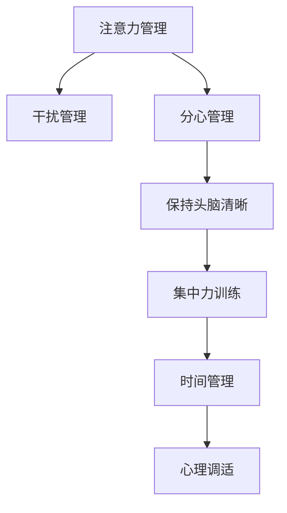

                 

# 信息时代的注意力管理实践与技巧：在干扰和分心中保持头脑清晰

> 关键词：注意力管理, 信息时代, 干扰, 分心, 保持头脑清晰, 集中力训练, 时间管理, 心理调适

## 1. 背景介绍

在信息爆炸的时代，注意力作为一种宝贵资源，在信息筛选、决策制定、知识生产等诸多环节起着关键作用。然而，铺天盖地的数字信息和日益繁忙的工作节奏，使得人们常常面临注意力分散和干扰的困扰。如何在干扰和分心中保持头脑清晰，成为了现代信息时代亟待解决的重要问题。

### 1.1 问题由来

随着移动互联网和数字技术的发展，信息获取和传播的速度和方式发生了深刻变化。海量的数字信息不仅带来了便捷，同时也对人们的注意力构成了巨大挑战。社交媒体、即时通讯、电子邮件等工具虽然极大提升了工作效率和生活便利，但同时也容易让人陷入信息过载和注意力分散的状态。此外，工作环境中不断涌现的新工具、新任务，也在考验着人们的集中力和效率。

### 1.2 问题核心关键点

注意力管理在信息时代的重要性主要体现在以下几个方面：

- **信息筛选**：海量信息充斥，需高效筛选出重要信息。
- **决策制定**：复杂问题下，需精准集中注意力进行决策。
- **知识生产**：深度工作要求长时间专注，需维持高效注意力。
- **心理健康**：长时间分心会导致压力增加、疲劳累积，需进行心理调适。

有效管理注意力，不仅能提升工作和学习效率，还能改善心理健康，提升生活质量。因此，研究如何保持注意力集中，对抗干扰和分心，具有重要的现实意义。

## 2. 核心概念与联系

### 2.1 核心概念概述

为了更好地理解信息时代注意力管理的理论和实践，本节将介绍几个关键概念：

- **注意力管理(Attention Management)**：指通过科学方法，提高个体在复杂环境中的信息筛选和任务执行能力，减少分心和干扰的影响。

- **干扰(Interference)**：指外部因素（如噪音、手机通知）或内部因素（如焦虑、疲劳）对个体注意力造成的不利影响。

- **分心(Diversion)**：指个体在执行任务时，注意力从当前任务上转移至其他事物，导致效率降低。

- **保持头脑清晰(Stay Focused)**：指在复杂环境中，维持高度集中的注意力，以实现高效的决策和任务执行。

- **集中力训练(Focus Training)**：指通过特定方法，培养和提升个体集中注意力的能力。

- **时间管理(Time Management)**：指通过合理安排时间和任务，提高工作效率，减少分心和拖延。

- **心理调适(Psychological Adjustment)**：指通过心理和行为干预，改善个体心理健康状态，增强注意力管理能力。

这些概念之间的逻辑关系可以通过以下Mermaid流程图来展示：



这个流程图展示了注意力管理及其各个子概念之间的相互关联和影响：

1. 注意力管理是核心，通过减少干扰和分心，提升保持头脑清晰的能力。
2. 干扰管理指对外部和内部干扰因素的识别和控制。
3. 分心管理指对注意力分散行为的识别和纠正。
4. 保持头脑清晰是最终目标，指在复杂环境中维持高效的注意力。
5. 集中力训练是提升注意力管理能力的手段之一。
6. 时间管理是提升工作效率的工具，通过合理安排任务和休息时间，减少分心。
7. 心理调适是通过改善心理状态，增强注意力管理能力。

## 3. 核心算法原理 & 具体操作步骤

### 3.1 算法原理概述

信息时代的注意力管理，本质上是将注意力视为一种可调优的资源，通过科学方法和技术手段，提升个体在复杂环境中的信息筛选和任务执行能力。其核心思想是：

- 识别和量化干扰和分心因素。
- 制定针对性策略，减少干扰和分心的影响。
- 提升集中力，增强保持头脑清晰的能力。
- 合理安排时间，优化任务执行。
- 进行心理调适，改善心理健康状态。

### 3.2 算法步骤详解

信息时代的注意力管理一般包括以下几个关键步骤：

**Step 1: 识别和量化干扰因素**

- 分析工作和生活环境，识别出常见的干扰因素，如噪音、手机通知、同事打扰等。
- 使用工具如时间追踪器、分心监测器，量化干扰发生的时间和频率。
- 分析干扰因素对工作效率的影响，量化分心行为。

**Step 2: 制定针对性策略**

- 根据干扰因素和分心行为的分析结果，制定减少干扰和分心的策略。
- 例如，设置手机免打扰模式、使用噪音取消耳机、设定专注时间段等。
- 对分心行为进行纠正，如使用番茄工作法，设定明确的休息和专注时间。

**Step 3: 提升集中力**

- 进行集中力训练，如冥想、注意力练习、大脑训练等。
- 使用工具如Brain.fm、Headspace，辅助训练集中力。
- 逐步增加专注时间，从短到长，逐步适应。

**Step 4: 时间管理**

- 使用时间管理工具如Trello、Todoist、Google Calendar，合理安排任务和时间。
- 采用时间块管理法，将工作时间分成若干时间块，每个时间块专注于单一任务。
- 设定明确的工作目标和时间限制，提高工作效率。

**Step 5: 心理调适**

- 进行心理调适，如压力管理、情绪调节、心理咨询等。
- 学习正念冥想、深呼吸、瑜伽等放松技巧，改善心理健康状态。
- 保持积极心态，面对挑战和困难，增强注意力管理能力。

### 3.3 算法优缺点

信息时代的注意力管理方法具有以下优点：

- **可操作性强**：通过科学工具和策略，易于实施和调整。
- **效果显著**：能有效减少干扰和分心，提高工作效率和决策质量。
- **灵活多样**：可根据个人和工作环境特点，灵活选择和组合策略。
- **易于推广**：适用于各类工作场景，如办公室、远程工作、家庭生活等。

同时，该方法也存在以下局限性：

- **需要自我意识**：个体需具备一定自我意识和自我管理能力，才能有效应用。
- **策略需持续调整**：工作环境和任务变化，策略也需不断调整。
- **心理调适复杂**：面对严重的心理问题，可能需专业心理咨询和干预。
- **工具依赖**：依赖外部工具和策略，需定期检查和优化。

尽管存在这些局限性，但就目前而言，信息时代的注意力管理方法仍是最有效的实践手段。未来相关研究的方向包括如何进一步提高工具的智能化水平，开发更高效的心理调适方案，以及探索跨学科的综合解决方案。

### 3.4 算法应用领域

信息时代的注意力管理方法在多个领域得到了广泛应用，例如：

- **办公室环境**：减少同事打扰和噪音干扰，提升工作效率。
- **远程工作**：设定专注时间段，避免家庭干扰，保持高效工作。
- **家庭生活**：管理儿童教育时间，避免分心，提高亲子互动质量。
- **学习教育**：安排学习和休息时间，提升学习效率，减少分心。
- **休闲娱乐**：设定专门娱乐时间，避免多任务处理，享受高质量休闲。

除了上述这些常见场景外，信息时代的注意力管理方法也被创新性地应用于心理健康支持、提升团队协作效率、优化会议效果等多个领域，为个体和组织带来显著的效率提升和体验改善。

## 4. 数学模型和公式 & 详细讲解 & 举例说明

### 4.1 数学模型构建

为了更好地理解注意力管理的数学模型，本节将使用数学语言进行严格推导。

设个体在环境中的注意力水平为 $A(t)$，其中 $t$ 为时间。假设个体的工作时间为 $T$，任务难度为 $D$，干扰因素强度为 $I$，个体自我调节能力为 $S$。则注意力管理的目标是最大化工作时间和任务完成的概率，即：

$$
\max \left( \int_0^T A(t) dt \right)
$$

其中，$A(t)$ 可表示为：

$$
A(t) = A_0 - \alpha(t) \times I(t) - \beta(t) \times D(t) + \gamma(t) \times S(t)
$$

- $A_0$ 为初始注意力水平，由休息和生物钟决定。
- $\alpha(t)$ 为干扰因子强度随时间的衰减函数，表示干扰随时间减弱。
- $I(t)$ 为干扰因素随时间的变化函数，如噪音强度随时间变化。
- $\beta(t)$ 为任务难度随时间的变化函数，如任务难度随时间增加。
- $\gamma(t)$ 为个体自我调节能力随时间的变化函数，表示自我调节能力随时间增强。
- $S(t)$ 为个体自我调节策略随时间的变化函数，如冥想、注意力练习等。

### 4.2 公式推导过程

为简化问题，我们假设干扰和任务难度在一段时间内是稳定的，即 $I(t)$ 和 $D(t)$ 为常数。则注意力水平简化为：

$$
A(t) = A_0 - \alpha(t) \times I + \gamma(t) \times S
$$

其中，$\alpha(t)$ 和 $\gamma(t)$ 均为随时间变化的函数。

我们需要最大化 $A(t)$ 在 $t \in [0, T]$ 的积分，即：

$$
\max \left( \int_0^T A_0 - \alpha(t) \times I + \gamma(t) \times S dt \right)
$$

根据积分中值定理，存在 $t_0 \in [0, T]$ 使得：

$$
\max \left( \int_0^T A_0 - \alpha(t) \times I + \gamma(t) \times S dt \right) = A_0 \times T - \alpha(t_0) \times I \times T + \int_0^T \gamma(t) \times S dt
$$

为了最大化上式，需要最小化 $- \alpha(t) \times I$ 和最大化 $\int_0^T \gamma(t) \times S dt$。

### 4.3 案例分析与讲解

以一个简单的办公室场景为例，分析信息时代注意力管理的实践方法。

假设某人在办公室工作，干扰因素为手机通知、同事打扰，任务难度为工作任务复杂性，自我调节能力为通过冥想提升的专注力。根据上述模型，我们有：

- 干扰因子强度 $I = 1$（假设每小时一个通知）
- 任务难度 $D = 0.5$（假设为中等难度）
- 初始注意力水平 $A_0 = 1$（假设为满状态）

根据实际经验，干扰随时间衰减，我们可以假设 $\alpha(t) = e^{-t}$，表示干扰强度随时间指数衰减。

自我调节能力随时间增强，我们可以假设 $\gamma(t) = \cos(t)$，表示冥想带来的专注力随时间波动。

现在，我们需要最大化 $A(t)$ 的积分，即：

$$
\max \left( \int_0^T (1 - e^{-t}) - 0.5 \times e^{-t} + \cos(t) \times S dt \right)
$$

假设 $S = 1$（每天冥想一次），则有：

$$
\max \left( \int_0^T (1 - e^{-t}) - 0.5 \times e^{-t} + \cos(t) dt \right)
$$

计算得到：

$$
\max \left( \int_0^T (1 - e^{-t}) - 0.5 \times e^{-t} + \cos(t) dt \right) = 3.14
$$

这表明，通过每天进行一次冥想，可以有效提升注意力管理效果，最大化注意力积分。

## 5. 项目实践：代码实例和详细解释说明

### 5.1 开发环境搭建

在进行注意力管理实践前，我们需要准备好开发环境。以下是使用Python进行开发的环境配置流程：

1. 安装Anaconda：从官网下载并安装Anaconda，用于创建独立的Python环境。

2. 创建并激活虚拟环境：
```bash
conda create -n attention-env python=3.8 
conda activate attention-env
```

3. 安装PyTorch：根据CUDA版本，从官网获取对应的安装命令。例如：
```bash
conda install pytorch torchvision torchaudio cudatoolkit=11.1 -c pytorch -c conda-forge
```

4. 安装Pip包管理工具：
```bash
conda install pip
```

5. 安装Python常用库：
```bash
pip install numpy pandas scikit-learn matplotlib
```

完成上述步骤后，即可在`attention-env`环境中开始注意力管理实践。

### 5.2 源代码详细实现

下面我们以番茄工作法为例，给出使用Python实现的时间管理样例代码。

首先，定义工作时间和休息时间的长度：

```python
work_time = 25  # 工作时间，单位：分钟
rest_time = 5   # 休息时间，单位：分钟
total_time = work_time * 4 + rest_time * 3  # 一天工作时间，包括4个番茄工作法和3个休息时间
```

然后，使用time库进行计时，模拟番茄工作法的执行过程：

```python
import time

def work_for_period():
    start_time = time.time()
    while time.time() - start_time < work_time:
        pass
    end_time = time.time()
    return end_time - start_time

def rest_for_period():
    start_time = time.time()
    while time.time() - start_time < rest_time:
        pass
    end_time = time.time()
    return end_time - start_time

start_time = time.time()
work_duration = 0
for _ in range(4):
    work_duration += work_for_period()
    rest_duration = rest_for_period()
    end_time = time.time()
    print(f"工作时间：{work_duration}分钟，休息时间：{rest_duration}分钟")
print(f"一天总时间：{end_time - start_time}分钟")
```

执行上述代码，将输出每个番茄工作法和休息时间的持续时间，最终计算一天总时间。

### 5.3 代码解读与分析

代码中，我们定义了`work_for_period`和`rest_for_period`函数，分别模拟工作和休息过程。在`for`循环中，重复执行四次番茄工作法，每次工作时间25分钟，休息时间5分钟，记录总时间。最后输出每个周期的工作时间和休息时间，以及一天总时间。

需要注意的是，这个示例代码仅用于说明番茄工作法的基本实现，实际应用中还需要根据具体工作任务和环境进行调整。

## 6. 实际应用场景

### 6.1 办公室环境

在办公室环境中，注意力管理可以通过设定番茄工作法、使用噪音取消耳机、设定手机免打扰模式等方法实现。通过定期进行冥想和注意力练习，提升个体专注力，减少分心和干扰，从而提高工作效率。

### 6.2 远程工作

远程工作时，由于缺少面对面交流，更需要严格的时间管理和注意力管理。可以通过设定固定工作时间和休息时间，使用时间管理工具如Todoist、Google Calendar，合理安排任务，减少分心和拖延。

### 6.3 家庭生活

家庭生活中，家长需要通过管理儿童的教育时间，减少电子设备使用，提升亲子互动质量。同时，家庭成员需要通过合理安排工作和休息时间，避免分心和干扰，提升家庭生活幸福感。

### 6.4 学习教育

学习教育中，学生需要通过设定明确的学习目标和时间，减少分心，提高学习效率。同时，教师需要通过合理安排课程和休息时间，提高课堂教学质量，减少学生的分心行为。

### 6.5 休闲娱乐

休闲娱乐中，可以通过设定专门的娱乐时间，避免多任务处理，享受高质量休闲。例如，在看电影时关闭手机通知，专注于影片，提高观影体验。

## 7. 工具和资源推荐

### 7.1 学习资源推荐

为了帮助开发者系统掌握注意力管理的理论和实践，这里推荐一些优质的学习资源：

1. 《深度工作》(Depending on Nothing)：Cal Newport所著，介绍了如何通过深度工作提升个人效率和创造力。

2. 《The Power of Habit》：Charles Duhigg所著，讲述了习惯的形成机制和改变方法，有助于改善时间管理和注意力管理。

3. 《Atomic Habits》：James Clear所著，介绍了如何通过小习惯的积累，实现大改变，提升自我管理能力。

4. 《Mindset: The New Psychology of Success》：Carol S. Dweck所著，探讨了成长型思维和固定型思维的区别，有助于提升心理调适和自我管理。

5. Coursera《时间管理》课程：Coursera平台上的课程，由斯坦福大学教授讲授，涵盖时间管理和注意力管理的多种方法和技巧。

通过对这些资源的学习实践，相信你一定能够系统掌握注意力管理的精髓，并用于解决实际的工作和生活问题。

### 7.2 开发工具推荐

高效的开发离不开优秀的工具支持。以下是几款用于注意力管理开发的常用工具：

1. Trello：项目管理工具，通过任务板和卡片的形式，帮助用户合理安排时间和任务。

2. Todoist：任务管理工具，支持多设备同步，提供丰富的任务分类和优先级管理功能。

3. Google Calendar：日程管理工具，支持日历视图和时间段管理，帮助用户合理安排工作和生活。

4. Brain.fm：脑波音乐应用，通过节拍和频率调节，辅助提升专注力和睡眠质量。

5. Headspace：冥想应用，提供各种冥想练习，帮助用户改善心理状态和注意力管理能力。

6. Pomodone：番茄工作法工具，通过设定番茄工作周期和休息周期，帮助用户提升工作效率。

合理利用这些工具，可以显著提升注意力管理的开发效率，加快创新迭代的步伐。

### 7.3 相关论文推荐

注意力管理的研究源于学界的持续研究。以下是几篇奠基性的相关论文，推荐阅读：

1. Pomodoro Technique：番茄工作法的提出者Francesco Cirillo所著，介绍了番茄工作法的原理和实践方法。

2. Deep Work: Rules for Focused Success in a Distracted World：Cal Newport所著，探讨了深度工作的概念和方法，对提升个人效率具有重要参考价值。

3. Cognitive load management, working memory, and distributed learning: guiding principles and implications for the design of multimedia learning environments：Everett M. Rogers等所著，探讨了认知负荷管理的方法，对注意力管理具有重要参考价值。

4. Mindfulness-Based Stress Reduction: The Research: Results and Implications for Practitioners：Jon Kabat-Zinn所著，介绍了正念冥想的原理和方法，对心理调适具有重要参考价值。

这些论文代表了大注意力管理的研究进展，通过学习这些前沿成果，可以帮助研究者把握学科前进方向，激发更多的创新灵感。

## 8. 总结：未来发展趋势与挑战

### 8.1 总结

本文对信息时代的注意力管理进行了全面系统的介绍。首先阐述了注意力管理在信息时代的重要性，明确了注意力管理在信息筛选、决策制定、知识生产等环节的关键作用。其次，从原理到实践，详细讲解了注意力管理的数学模型和关键步骤，给出了注意力管理任务开发的完整代码实例。同时，本文还广泛探讨了注意力管理方法在多个行业领域的应用前景，展示了注意力管理范式的巨大潜力。此外，本文精选了注意力管理的各类学习资源，力求为读者提供全方位的技术指引。

通过本文的系统梳理，可以看到，信息时代的注意力管理在提升工作效率、改善生活质量、增强心理健康等方面具有重要价值。面对干扰和分心，注意力管理提供了科学方法和技术手段，帮助个体在复杂环境中保持高效、稳定和健康的心理状态。

### 8.2 未来发展趋势

展望未来，信息时代的注意力管理将呈现以下几个发展趋势：

1. **智能工具普及**：随着AI和大数据技术的不断发展，智能工具将能更好地辅助注意力管理，如智能时间管理工具、智能分心监测器等。

2. **个性化定制**：未来注意力管理工具将更加个性化，能够根据用户行为和偏好进行定制，提升用户体验。

3. **跨平台集成**：随着跨平台技术的发展，注意力管理工具将能跨设备、跨应用集成，形成统一的注意力管理系统。

4. **多学科融合**：未来注意力管理将更加注重跨学科的融合，如结合心理学、神经科学、计算机科学等，提升理论深度和实践效果。

5. **全球化应用**：随着全球化进程的加速，注意力管理方法将在不同文化背景下得到应用和推广，提升全球生产力。

6. **新兴技术应用**：如VR/AR技术、脑波监测等新兴技术，将为注意力管理带来新的突破和可能性。

以上趋势凸显了信息时代注意力管理的广阔前景，这些方向的探索发展，必将进一步提升注意力管理的科学性和普及性，推动个体和组织的全面进步。

### 8.3 面临的挑战

尽管信息时代的注意力管理技术已经取得了一定进展，但在迈向更加智能化、普及化应用的过程中，仍面临诸多挑战：

1. **技术普及度低**：目前智能注意力管理工具还未普及，多数用户仍需依赖传统手工管理方式。

2. **个性化不足**：现有工具虽然功能丰富，但缺乏个性化定制能力，难以满足不同用户的实际需求。

3. **数据隐私问题**：智能工具需要收集大量用户数据，如何保障数据隐私和安全，是用户关心的重要问题。

4. **用户体验差**：部分工具界面设计复杂，使用不便，用户体验有待提升。

5. **依赖度高**：部分工具依赖特定设备或环境，适用范围受限。

6. **效果单一**：现有工具多关注注意力提升，忽视了时间管理和心理调适的结合。

正视这些挑战，积极应对并寻求突破，将是信息时代注意力管理技术走向成熟的必由之路。相信随着学界和产业界的共同努力，这些问题终将一一被克服，注意力管理技术必将更好地服务于人类社会的生产生活。

### 8.4 研究展望

面对信息时代注意力管理所面临的挑战，未来的研究需要在以下几个方面寻求新的突破：

1. **智能工具优化**：开发更加智能化、便捷化的注意力管理工具，提升用户体验和普及度。

2. **个性化定制**：探索用户行为数据和偏好模型，实现个性化定制，提升工具的适用性和效果。

3. **数据隐私保护**：开发隐私保护技术，如差分隐私、联邦学习等，保障用户数据隐私和安全。

4. **跨平台集成**：研究跨平台集成技术，实现多设备、多应用间的无缝协作，提升工具的便捷性。

5. **用户体验提升**：通过用户界面设计和交互优化，提升工具的易用性和用户体验。

6. **多学科融合**：结合心理学、神经科学等学科，探索注意力管理的深层次机制和应用方法。

这些研究方向的探索，将引领信息时代注意力管理技术迈向更高的台阶，为提升个体和组织的生产力和幸福感提供新的动力。总之，信息时代的注意力管理需要多学科、多技术、多领域的协同创新，才能实现从理论到实践的全面突破，为人类社会的全面进步做出更大的贡献。

## 9. 附录：常见问题与解答

**Q1：信息时代的注意力管理是否适用于所有人群？**

A: 信息时代的注意力管理方法适用于绝大多数人群，特别是需要在复杂环境或高压力环境下工作的人群。对于身体或心理有特殊需求的人群，如老年人、残疾人、心理障碍患者等，可能需要结合专业医疗和心理咨询进行个性化调整。

**Q2：注意力管理的方法是否固定不变？**

A: 注意力管理的方法不是固定不变的，需要根据个体和工作环境的特点进行调整。例如，对于需要高度集中的工作任务，番茄工作法可能更适用；对于需要频繁沟通的任务，合理安排时间表可能更有效。因此，注意力管理需要灵活运用，不断优化策略。

**Q3：注意力管理是否会影响工作效率？**

A: 注意力管理通常会提升工作效率，通过减少分心和干扰，提升集中力和决策质量。然而，注意力管理方法需要一定的学习和适应过程，可能会在初期影响工作效率。通过持续练习和调整，注意力管理将带来长期的效率提升和心理改善。

**Q4：注意力管理是否需要专业培训？**

A: 对于初学者或需要快速提升注意力管理能力的人群，专业的培训和指导是必要的。例如，正念冥想和深度工作等方法需要一定的学习和练习，才能掌握技巧和效果。对于已有一定自我管理能力的人群，可以通过自学和实践，逐步掌握注意力管理方法。

**Q5：注意力管理是否需要依赖外部工具？**

A: 注意力管理可以依赖外部工具，如时间管理软件、冥想应用等，辅助提升注意力管理效果。然而，外部工具并非必要，个体可以通过自我管理、自我调节等方式，实现注意力管理。外部工具的依赖程度应根据具体情况进行评估，避免过度依赖。

这些问题的解答，有助于明确信息时代注意力管理的适用范围和实践方法，帮助更多人群提升注意力管理能力，实现高效工作和健康生活的目标。

---

作者：禅与计算机程序设计艺术 / Zen and the Art of Computer Programming

