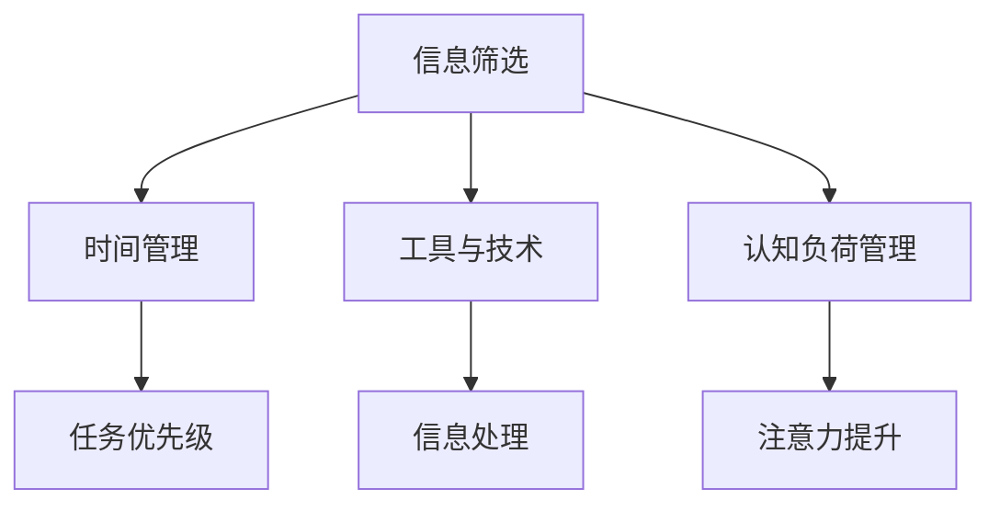

                 

# 信息时代的注意力管理实践：在充满干扰的环境中保持头脑清晰和专注

## 1. 背景介绍

### 1.1 问题由来
在信息爆炸的时代，我们每天都会接触到海量的信息，从电子邮件、社交媒体到新闻推送、广告弹窗。这些信息源源不断地涌现，不断冲击着我们的注意力，使得我们在处理信息时变得愈发分散。如何在如此干扰的环境中保持专注和高效，成为了一个亟待解决的难题。

### 1.2 问题核心关键点
注意力管理的核心在于如何识别并优先处理最重要和最有价值的信息，同时排除干扰。其关键在于：
1. **信息筛选与分类**：确定哪些信息是最重要的，哪些可以被忽略或稍后处理。
2. **时间管理**：合理安排时间，确保最重要的任务优先完成。
3. **工具与技术**：利用各种工具和技术手段辅助注意力管理，提高信息处理效率。

### 1.3 问题研究意义
高效的信息时代注意力管理，对于提升工作效率、保持个人健康、优化工作生活平衡具有重要意义：

1. **提升工作效率**：通过有效的注意力管理，可以帮助我们更加集中精力处理关键任务，减少因干扰导致的低效。
2. **保持个人健康**：注意力过度分散会导致心理压力增大，利用注意力管理技巧可以有效缓解压力，维护心理健康。
3. **优化工作生活平衡**：合理分配时间，使工作与生活能够和谐共存，避免因信息过载导致的失衡。

## 2. 核心概念与联系

### 2.1 核心概念概述

注意力管理在信息时代的应用，涉及多个关键概念：

- **信息筛选**：识别和分类不同信息的重要性和优先级，将其划分为紧急、重要、次要等不同类别。
- **时间管理**：通过合理安排时间，确保最重要的任务优先完成。
- **工具与技术**：借助各种软件工具和技术，辅助进行信息筛选和时间管理。
- **认知负荷管理**：通过减少认知负荷，保持高效的注意力水平。

这些概念之间的逻辑关系可以通过以下Mermaid流程图来展示：



这个流程图展示出注意力管理的核心流程：首先进行信息筛选，然后根据筛选结果进行时间管理，同时借助各种工具和技术手段辅助处理信息，并管理认知负荷，最终确保高效的工作和生活。

## 3. 核心算法原理 & 具体操作步骤
### 3.1 算法原理概述

注意力管理的核心算法原理主要基于认知负荷理论(Cognitive Load Theory, CLT)，通过减少认知负荷，帮助用户更好地集中注意力。该理论认为，认知负荷包括内在认知负荷和外在认知负荷。内在认知负荷是指学习材料本身的复杂性，外在认知负荷是指学习者的认知资源被占用情况。有效管理注意力，就需要尽量减少外在认知负荷，优化认知结构。

### 3.2 算法步骤详解

基于认知负荷理论的注意力管理步骤如下：

**Step 1: 信息筛选**

1. **创建任务列表**：列出所有需要完成的任务，包括工作任务和生活任务。
2. **评估任务优先级**：根据任务的重要性和紧急性，将任务分为高、中、低三个优先级。

**Step 2: 时间管理**

1. **规划时间块**：将一天划分为多个时间块，每个时间块专注于特定任务。
2. **设置时间限制**：为每个任务设置时间限制，避免过度耗时。
3. **时间调整**：根据实际执行情况，灵活调整时间安排，确保最重要的任务优先完成。

**Step 3: 工具与技术**

1. **选择辅助工具**：根据需要选择合适的辅助工具，如时间管理软件、任务管理应用等。
2. **集成工具**：将辅助工具集成到日常工作流程中，形成标准化操作。
3. **定期评估工具效果**：定期评估工具的使用效果，优化工具选择。

**Step 4: 认知负荷管理**

1. **简化任务描述**：将复杂的任务拆分为简单的子任务，减轻认知负荷。
2. **避免多任务处理**：尽量专注于单一任务，避免同时处理多个任务导致的认知负荷过重。
3. **利用定时休息**：采用番茄工作法等定时休息策略，保持高效工作状态。

### 3.3 算法优缺点

基于认知负荷理论的注意力管理方法具有以下优点：

1. **系统性**：通过科学的分步操作，系统地管理信息和时间。
2. **实践性强**：操作性强，容易上手，适合各种职业和工作场景。
3. **灵活性**：可以根据个人需求进行调整和优化，适应性强。

同时，该方法也存在以下局限性：

1. **依赖个人执行**：效果依赖于个人的执行力和自律性，不易量化和标准化。
2. **难以应对突发事件**：突发事件难以提前预测，可能打乱原有安排。
3. **固定时间块**：时间块划分可能不适用于所有任务类型。

### 3.4 算法应用领域

基于认知负荷理论的注意力管理方法在多个领域中都有应用：

- **工作场景**：在办公室、实验室、工厂等需要处理大量任务的工作环境中，用于提升工作效率。
- **学习场景**：在学生、研究人员、自学者等需要长时间学习的场景中，用于优化学习效率。
- **日常生活**：在家庭、休闲等日常场景中，用于平衡工作和生活的关系。
- **在线协作**：在远程办公、团队协作等需要协调多人的场景中，用于优化沟通和任务管理。

## 4. 数学模型和公式 & 详细讲解  
### 4.1 数学模型构建

注意力管理的数学模型主要基于任务优先级和时间管理策略。假设一天有 $N$ 个任务，每个任务有 $P_i$ 的概率被优先处理，处理时间用 $T_i$ 表示。则每天的总工作时间为 $W$，任务处理期望值 $E$ 可以表示为：

$$
E = \sum_{i=1}^N P_i T_i
$$

目标是最小化任务处理期望值 $E$。

### 4.2 公式推导过程

以简单的两任务为例，推导任务优先级对任务处理期望值的影响。假设任务1和任务2的处理概率分别为 $P_1$ 和 $P_2$，处理时间分别为 $T_1$ 和 $T_2$，总工作时间 $W=1$。则任务处理期望值 $E$ 的计算公式为：

$$
E = P_1 T_1 + P_2 T_2
$$

根据最优解的必要条件，对 $E$ 关于 $P_1$ 求导，并令导数等于0：

$$
\frac{\partial E}{\partial P_1} = T_1 - P_1 T_2 = 0
$$

解得：

$$
P_1 = \frac{T_1}{T_1+T_2}
$$

同理，对于任务2，有：

$$
P_2 = \frac{T_2}{T_1+T_2}
$$

这表明，任务1的处理概率与其处理时间成正比，任务2的处理概率与其处理时间成反比。

### 4.3 案例分析与讲解

考虑实际工作场景，假设任务1为编写代码，任务2为回复邮件。编写代码需要较高集中注意力，处理时间较长，假设为 $T_1=2$。回复邮件处理时间较短，假设为 $T_2=0.5$。则：

$$
P_1 = \frac{2}{2+0.5} = 0.8
$$

$$
P_2 = \frac{0.5}{2+0.5} = 0.2
$$

这意味着，编写代码应优先处理，而回复邮件应稍后处理。通过这种优先级分配，可以更好地管理注意力，提高工作效率。

## 5. 项目实践：代码实例和详细解释说明
### 5.1 开发环境搭建

在进行注意力管理实践前，我们需要准备好开发环境。以下是使用Python进行PyTorch开发的环境配置流程：

1. 安装Anaconda：从官网下载并安装Anaconda，用于创建独立的Python环境。

2. 创建并激活虚拟环境：
```bash
conda create -n attention-env python=3.8 
conda activate attention-env
```

3. 安装PyTorch：根据CUDA版本，从官网获取对应的安装命令。例如：
```bash
conda install pytorch torchvision torchaudio cudatoolkit=11.1 -c pytorch -c conda-forge
```

4. 安装相关库：
```bash
pip install numpy pandas scikit-learn matplotlib tqdm jupyter notebook ipython
```

完成上述步骤后，即可在`attention-env`环境中开始注意力管理实践。

### 5.2 源代码详细实现

这里以一个简单的番茄工作法（Pomodoro Technique）为例，展示如何使用Python实现任务管理。

```python
from datetime import datetime, timedelta

class Pomodoro:
    def __init__(self, task_list):
        self.task_list = task_list
        self.completed_tasks = []
        self.in_progress = []
    
    def start_task(self, task):
        if task not in self.in_progress:
            self.in_progress.append(task)
            print(f"Starting task: {task}")
    
    def end_task(self, task):
        self.in_progress.remove(task)
        self.completed_tasks.append(task)
        print(f"Task {task} completed")
    
    def start_pomodoro(self, duration=25):
        start_time = datetime.now()
        while True:
            if len(self.in_progress) == 0:
                break
            for task in self.in_progress:
                # 执行任务
                self.start_task(task)
                time.sleep(duration)
                self.end_task(task)
            print(f"Pomodoro session ended at: {datetime.now()}")
    
    def run(self):
        while True:
            self.start_pomodoro()
            self.task_list.shuffle()
            self.task_list.extend(self.completed_tasks)
            print(f"Starting next task list: {self.task_list}")
```

### 5.3 代码解读与分析

让我们再详细解读一下关键代码的实现细节：

**Pomodoro类**：
- `__init__`方法：初始化任务列表、已完成任务列表和进行中任务列表。
- `start_task`方法：将任务加入进行中任务列表，并打印开始信息。
- `end_task`方法：将任务从进行中任务列表移除，添加到已完成任务列表，并打印完成信息。
- `start_pomodoro`方法：开启一个番茄钟计时，每25分钟执行一次任务，直到所有任务完成。
- `run`方法：不断重复番茄钟计时和任务列表轮换，直到所有任务完成。

**使用示例**：
```python
tasks = ["编写代码", "回复邮件", "整理文档", "学习Python"]
pomodoro = Pomodoro(tasks)
pomodoro.run()
```

可以看到，通过Python代码，我们可以方便地实现基于时间块的任务管理，模拟番茄工作法。这种简单有效的方法，可以帮助我们更好地管理时间和注意力，提高工作效率。

## 6. 实际应用场景
### 6.1 软件开发

软件开发是一项需要高度集中注意力的工作，任务繁多且紧急性高。利用注意力管理方法，可以有效提升开发效率，减少因干扰导致的低效。

具体应用如下：

1. **任务划分**：将软件开发任务划分为需求分析、设计、编码、测试等多个子任务，每个子任务分配不同的优先级。
2. **时间管理**：采用番茄工作法，每个时间块专注于一个子任务，提高任务处理效率。
3. **工具集成**：使用Git、JIRA等工具，将任务管理与版本控制和项目管理集成，形成标准化操作。

### 6.2 在线学习

在线学习需要长时间集中注意力，容易受到外部干扰。注意力管理方法可以帮助学生更好地管理学习时间和任务，提高学习效率。

具体应用如下：

1. **任务规划**：制定每日学习计划，将学习任务分为基础课、专业课、复习等不同类别，分配不同优先级。
2. **时间管理**：采用番茄工作法，每25分钟集中注意力学习，提高学习效果。
3. **工具集成**：使用在线学习平台、时间管理应用等工具，辅助学习任务管理。

### 6.3 家庭生活

家庭生活中，如何平衡工作与生活，也是一个重要的课题。注意力管理方法可以帮助家庭成员更好地管理时间和注意力，提高生活质量。

具体应用如下：

1. **任务规划**：将家庭任务分为家务、陪伴孩子、运动等不同类别，分配不同优先级。
2. **时间管理**：利用番茄工作法，每25分钟专注于单一任务，避免同时处理多个任务导致的分散注意力。
3. **工具集成**：使用家庭管理软件、日程安排应用等工具，辅助家庭任务管理。

### 6.4 未来应用展望

随着信息时代的不断发展，注意力管理方法将面临新的挑战和机遇：

1. **自动化和智能化**：利用AI技术，自动生成任务优先级和时间管理策略，提升管理效率。
2. **跨平台协同**：实现跨平台的任务和信息同步，提高工作效率和生活质量。
3. **情绪感知**：通过情绪分析技术，实时调整任务优先级和时间管理策略，优化工作和生活平衡。

## 7. 工具和资源推荐
### 7.1 学习资源推荐

为了帮助开发者系统掌握注意力管理的理论基础和实践技巧，这里推荐一些优质的学习资源：

1. **《深度工作》(Dependence Work)书籍**：作者Cal Newport详细阐述了如何通过深度工作实现高效产出，值得深入阅读。
2. **Coursera《注意力系统》(Attention Systems)课程**：斯坦福大学开设的NLP明星课程，涵盖注意力机制的理论和应用，是理解注意力管理的基石。
3. **《认知负荷管理》(Cognitive Load Management)书籍**：探讨认知负荷管理的基本原理和应用方法，提供大量实例分析。
4. **认知负荷管理工具网站**：如Cognitive Load Theory (CLT)工具，提供认知负荷分析、优化建议等功能。
5. **番茄工作法应用指南**：详细介绍番茄工作法的原理、操作技巧，提供多种时间管理工具和应用案例。

通过对这些资源的学习实践，相信你一定能够更好地掌握注意力管理的精髓，并应用于实际工作中。

### 7.2 开发工具推荐

高效的开发离不开优秀的工具支持。以下是几款用于注意力管理开发的常用工具：

1. **Pomodoro应用**：如Pomodone、Focus Booster等，帮助用户实现番茄工作法，管理时间块。
2. **任务管理工具**：如Todoist、Trello、Asana等，辅助任务列表的创建、管理和执行。
3. **情绪分析工具**：如Microsoft Emotion API、IBM Watson Tone Analyzer等，实时分析用户情绪状态，调整注意力管理策略。
4. **时间跟踪工具**：如RescueTime、Toggl等，帮助用户监控和优化时间使用情况。
5. **项目管理平台**：如JIRA、GitHub等，集成任务管理和版本控制，形成完整的项目管理链。

合理利用这些工具，可以显著提升注意力管理的实践效果，加速工作和生活的高效化。

### 7.3 相关论文推荐

注意力管理的研究方向涉及认知心理学、人机交互、NLP等多个领域。以下是几篇奠基性的相关论文，推荐阅读：

1. **《认知负荷理论与应用研究综述》**：系统回顾了认知负荷理论的基本原理和应用案例，为注意力管理提供了理论支持。
2. **《基于机器学习的时间管理》**：探讨了机器学习技术在时间管理中的应用，如预测任务优先级、自动化任务调度等。
3. **《深度工作：重塑未来的工作生活平衡》**：作者Cal Newport详细阐述了深度工作的方法论，提供了大量实践建议。
4. **《基于AI的认知负荷管理》**：介绍利用AI技术优化认知负荷管理策略的方法和效果。
5. **《基于认知负荷理论的注意力管理模型》**：提出了一种基于认知负荷理论的注意力管理模型，详细探讨了模型的构建和优化。

这些论文代表了大语言模型微调技术的发展脉络。通过学习这些前沿成果，可以帮助研究者把握学科前进方向，激发更多的创新灵感。

## 8. 总结：未来发展趋势与挑战

### 8.1 总结

本文对基于认知负荷理论的注意力管理方法进行了全面系统的介绍。首先阐述了注意力管理在信息时代的应用背景和意义，明确了信息筛选、时间管理、工具与技术在注意力管理中的重要作用。其次，从原理到实践，详细讲解了注意力管理的数学模型和操作步骤，给出了注意力任务管理的代码实现。同时，本文还探讨了注意力管理在软件开发、在线学习、家庭生活等实际应用场景中的应用，展示了注意力管理方法的多样性和广泛性。最后，本文精选了注意力管理的各类学习资源、开发工具和相关论文，力求为读者提供全方位的技术指引。

通过本文的系统梳理，可以看到，注意力管理方法在信息时代具有重要的应用价值，特别是在提升工作效率、优化工作生活平衡等方面。有效的注意力管理，不仅能够提升个人生产力，还能促进身心健康，实现工作与生活的和谐共存。

### 8.2 未来发展趋势

展望未来，注意力管理技术将呈现以下几个发展趋势：

1. **自动化和智能化**：利用AI技术，自动生成任务优先级和时间管理策略，提升管理效率。
2. **跨平台协同**：实现跨平台的任务和信息同步，提高工作效率和生活质量。
3. **情绪感知**：通过情绪分析技术，实时调整任务优先级和时间管理策略，优化工作和生活平衡。
4. **个性化优化**：利用大数据和机器学习技术，根据用户行为和偏好，提供个性化的注意力管理方案。
5. **多维度优化**：结合时间管理、情绪管理、认知负荷管理等多种维度，全面提升注意力管理的效能。

以上趋势凸显了注意力管理技术的广阔前景。这些方向的探索发展，必将进一步提升工作效率和生活质量，为信息时代带来新的变革。

### 8.3 面临的挑战

尽管注意力管理技术已经取得了一定的进展，但在迈向更加智能化、普适化应用的过程中，仍面临诸多挑战：

1. **依赖个人自律性**：注意力管理的效果依赖于个人的自律性和执行力，难以量化和标准化。
2. **多任务处理复杂**：对于需要同时处理多个任务的场景，注意力管理策略的制定和执行较为复杂。
3. **数据隐私问题**：情绪分析等技术需要收集个人情绪数据，如何保护用户隐私是一个重要问题。
4. **技术普及性**：注意力管理技术需要用户具备一定的技术素养，如何在不同用户群体中普及应用，是一大挑战。

### 8.4 研究展望

面对注意力管理所面临的挑战，未来的研究需要在以下几个方面寻求新的突破：

1. **自适应模型**：开发能够根据用户行为动态调整任务优先级和时间管理策略的模型，提升适应性。
2. **跨模态融合**：结合文本、语音、图像等多种模态数据，进行更加全面的注意力管理。
3. **多场景应用**：将注意力管理技术应用于更多场景，如医疗、教育、娱乐等，拓展应用范围。
4. **伦理道德约束**：在技术应用中引入伦理道德约束，确保技术使用的安全性、公平性和透明性。

这些研究方向的探索，必将引领注意力管理技术迈向更高的台阶，为构建智能化的工作和生活环境铺平道路。面向未来，注意力管理技术还需要与其他人工智能技术进行更深入的融合，如知识表示、因果推理、强化学习等，多路径协同发力，共同推动人类智能水平的提升。只有勇于创新、敢于突破，才能不断拓展注意力管理的边界，让智能技术更好地造福人类社会。

## 9. 附录：常见问题与解答

**Q1：注意力管理是否适用于所有工作场景？**

A: 注意力管理在大多数工作场景中都有适用性，特别是在处理复杂任务和需要长时间集中注意力的场景中效果显著。但对于一些重复性、低复杂度的工作，过度使用注意力管理可能会显得冗余。

**Q2：如何选择合适的番茄工作法时间长度？**

A: 番茄工作法的时间长度可以根据任务难度和工作性质进行调整。一般来说，简单的任务可以使用较短的时间长度，复杂的任务可以使用较长的时间长度。经验上，建议初期尝试25分钟和50分钟两种时间长度，找到最适合自己的工作节奏。

**Q3：注意力管理是否需要固定的时间块？**

A: 注意力管理不一定需要固定的时间块，可以根据任务性质和个人喜好进行调整。例如，某些任务可能需要长时间连续处理，可以灵活调整时间长度和间隔。

**Q4：注意力管理是否需要配合特定的工具？**

A: 注意力管理的有效性依赖于工具的辅助，但并非必须使用特定的工具。只要能够实现任务列表和时间管理，任何工具都可以辅助注意力管理。

**Q5：如何处理突发事件对注意力管理的影响？**

A: 突发事件不可避免，可以在任务列表中预留一定的时间块处理突发事件。同时，可以通过动态调整任务优先级和时间管理策略，灵活应对突发事件的影响。

通过本文的系统梳理，可以看到，注意力管理方法在信息时代具有重要的应用价值，特别是在提升工作效率、优化工作生活平衡等方面。有效的注意力管理，不仅能够提升个人生产力，还能促进身心健康，实现工作与生活的和谐共存。面向未来，注意力管理技术还需要与其他人工智能技术进行更深入的融合，如知识表示、因果推理、强化学习等，多路径协同发力，共同推动人类智能水平的提升。只有勇于创新、敢于突破，才能不断拓展注意力管理的边界，让智能技术更好地造福人类社会。

---

作者：禅与计算机程序设计艺术 / Zen and the Art of Computer Programming

