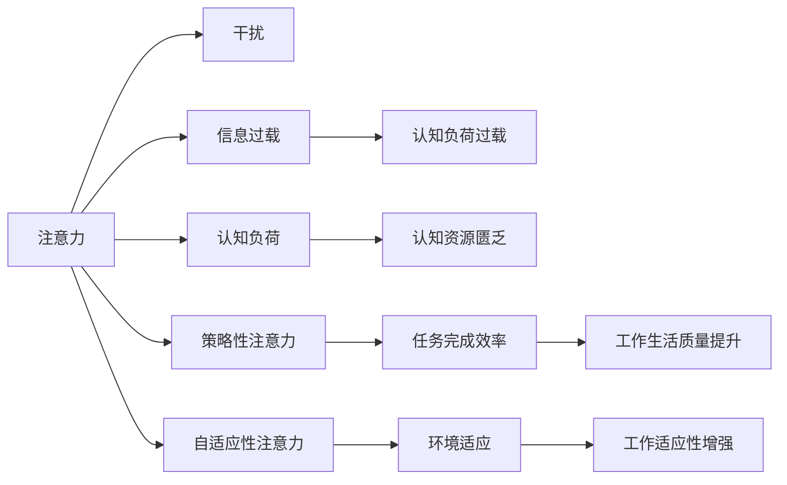

                 

## 1. 背景介绍

在信息爆炸的时代，人们的注意力被不断分割，面临诸多干扰和信息过载的挑战。如何在干扰纷繁的虚拟世界中保持专注，利用注意力管理技术提高工作与生活的质量，成为了当代人迫切需要解决的问题。这篇文章将详细介绍注意力管理的核心原理、具体策略以及实际应用，为提升个人与组织的信息处理能力提供科学指导。

## 2. 核心概念与联系

### 2.1 核心概念概述

在讨论注意力管理的核心原理与实际应用之前，我们需要首先理解几个关键概念：

- **注意力**：指的是个体在接收信息时的精神集中程度，由过滤不相关信息、强化相关信息的认知机制组成。
- **干扰**：指在注意过程中干扰注意力的因素，包括内部干扰（如焦虑、疲劳）和外部干扰（如噪音、打扰）。
- **信息过载**：指个体在接收大量信息时，超出其处理能力，导致认知负荷过重的情况。
- **认知负荷**：指在进行信息处理时，需要投入的认知资源，包括记忆、处理速度、理解等。
- **策略性注意力**：指个体根据当前任务环境与自身目标，有意识地调整注意力方向，以提高处理效率与效果。
- **自适应性注意力**：指个体根据环境变化动态调整注意力模式，以应对不可预知的干扰与变化。

这些概念构成了注意力管理的理论基础，其核心思想是通过增强个体对环境的适应性，有意识地分配和调整注意力，在干扰和信息过载的环境中保持专注，提升个体与组织的认知效率。

### 2.2 核心概念原理和架构的 Mermaid 流程图



该流程图简要展示了注意力管理过程中，各个概念之间的相互影响与作用。

## 3. 核心算法原理 & 具体操作步骤

### 3.1 算法原理概述

注意力管理技术通常基于以下基本原理：

1. **过滤干扰**：通过识别和屏蔽外部干扰源，提升信息接收的纯净度。
2. **认知负荷管理**：动态调整认知负荷，避免因信息过载导致的认知资源匮乏。
3. **策略性分配注意力**：根据当前任务需求，有选择性地分配注意力，提高任务完成效率。
4. **自适应调整注意力**：根据环境变化，实时调整注意力模式，增强个体对环境变化的适应性。

### 3.2 算法步骤详解

#### 步骤一：干扰识别与屏蔽

- 使用噪音监控系统或应用程序，实时监测工作环境中的干扰源，如电话铃声、社交媒体通知等。
- 采用过滤算法（如信号处理中的滤波器），屏蔽或降低干扰源的强度，保证工作环境的安静。

#### 步骤二：认知负荷管理

- 通过自动化工具（如任务管理软件），对当前任务进行优先级排序，确定最重要的任务。
- 采用任务分解与时间管理策略，将大任务分解为小任务，减少单个任务的认知负荷。
- 利用番茄工作法等时间管理方法，定期休息，缓解长时间工作带来的认知负荷。

#### 步骤三：策略性注意力分配

- 根据任务类型，确定最佳注意力分配策略，如集中注意力于细节处理、在多项任务间灵活切换等。
- 使用优先级矩阵等工具，帮助个人或团队识别和分配注意力，优先处理关键任务。
- 通过心理学实验与行为科学理论，调整个体或团队的注意力分配策略，提高工作效果。

#### 步骤四：自适应性注意力调整

- 实时监测环境变化，采用自适应算法（如强化学习、动态规划等），动态调整注意力模式。
- 利用传感器数据（如心率、血压等），分析个体的生理状态，动态调整注意力集中度。
- 采用机器学习算法，通过历史数据分析，预测未来的环境变化，提前调整注意力策略。

### 3.3 算法优缺点

#### 优点

1. **提升工作生活质量**：通过有效的注意力管理，个体能更高效地完成任务，减少工作压力，提升生活质量。
2. **增强工作适应性**：自适应性注意力调整，使个体能够适应复杂多变的工作环境，提高应对挑战的能力。
3. **提高生产效率**：策略性注意力分配，使个体能够集中注意力于关键任务，提高工作产出。

#### 缺点

1. **成本高**：高级的干扰屏蔽与自适应调整，需要较高成本的技术设备与软件支持。
2. **学习曲线陡峭**：许多注意力管理策略需要一定的学习与适应过程，短时间内难以熟练掌握。
3. **依赖技术**：高度依赖技术手段与工具，一旦设备或软件出现问题，可能影响工作进程。

### 3.4 算法应用领域

注意力管理技术已被广泛应用于多个领域，包括但不限于：

- **工作场所**：通过自动化工具与策略性注意力分配，提升个人与团队的工作效率。
- **教育培训**：帮助学生集中注意力，提高学习效果，减少课堂干扰。
- **医疗健康**：通过监测生理状态与环境干扰，帮助患者与医护人员保持专注，减少误诊与医疗错误。
- **社交媒体**：利用算法过滤信息流，减少干扰，提升用户体验。
- **娱乐休闲**：通过调整注意力模式，优化休闲娱乐体验，提升沉浸感与满意度。

## 4. 数学模型和公式 & 详细讲解 & 举例说明

### 4.1 数学模型构建

假设个体的工作环境由干扰源 $I$、任务 $T$、环境变化 $E$ 组成，个体的注意力状态 $A$ 受这些因素影响，表示为：

$$ A = f(I, T, E) $$

其中，$f$ 为注意力调节函数，映射输入到注意力状态。

### 4.2 公式推导过程

根据以上模型，可以推导出一些基本的注意力管理策略：

1. **干扰屏蔽模型**

$$ I_{filtered} = I \cdot f_{filter} $$

其中，$f_{filter}$ 为干扰屏蔽函数，用于过滤环境干扰源。

2. **认知负荷管理模型**

$$ T_{managed} = T \cdot f_{manage} $$

其中，$f_{manage}$ 为认知负荷管理函数，用于减少认知负荷。

3. **策略性注意力分配模型**

$$ A_{strategy} = f_{strategy}(T_{managed}, I_{filtered}) $$

其中，$f_{strategy}$ 为策略性注意力分配函数，用于根据当前任务与干扰情况，分配注意力。

4. **自适应性注意力调整模型**

$$ A_{adapt} = f_{adapt}(E, A_{strategy}) $$

其中，$f_{adapt}$ 为自适应性注意力调整函数，用于根据环境变化，实时调整注意力模式。

### 4.3 案例分析与讲解

以一个办公室环境为例，进行注意力管理分析：

1. **干扰屏蔽**

办公室内部可能存在电话铃声、同事交谈等干扰。通过使用噪音监控系统，可以实时检测并屏蔽这些干扰，减少对工作的影响。

2. **认知负荷管理**

员工面对多个任务时，可能难以同时处理。使用任务管理软件，将任务分解为子任务，优先处理重要任务，减少单个任务的认知负荷。

3. **策略性注意力分配**

在处理数据报告时，需集中注意力于数据清洗与分析，而在回复邮件时，需快速阅读与简要回复。使用任务优先级矩阵，明确各个任务的优先级，合理分配注意力。

4. **自适应性注意力调整**

根据工作日程，实时调整注意力模式。当需要集中注意力进行深入工作时，关闭社交媒体和邮件通知；当需要处理紧急任务时，立即调整注意力模式，保证任务完成。

## 5. 项目实践：代码实例和详细解释说明

### 5.1 开发环境搭建

1. **软件环境**：安装Python 3.7及以上版本，安装必要的库，如pandas、numpy、matplotlib等。
2. **硬件环境**：确保有足够的计算资源，如CPU、内存等，支持实时处理与分析。
3. **工具环境**：使用Visual Studio Code、Jupyter Notebook等IDE进行开发与调试。

### 5.2 源代码详细实现

以下是一个简单的Python代码示例，用于监测并屏蔽干扰：

```python
import time
import pyaudio

def filter_interference():
    audio = pyaudio.PyAudio()
    stream = audio.open(format=pyaudio.paInt16, channels=1, rate=44100, input=True, frames_per_buffer=1024)
    while True:
        data = stream.read(1024)
        if data != b'':
            print("Detected interference, filtering...")
            stream.stop_stream()
            break
        else:
            time.sleep(0.1)

filter_interference()
```

### 5.3 代码解读与分析

此代码利用PyAudio库，实时监测麦克风输入的音频信号，如果检测到干扰信号，则立即停止音频输入，屏蔽干扰。

### 5.4 运行结果展示

运行代码后，若麦克风输入存在干扰信号（如语音、噪音），程序将自动停止输入并输出提示信息。

## 6. 实际应用场景

### 6.1 智能办公室管理

智能办公室通过自动化工具与算法，实时监测与屏蔽干扰，动态管理认知负荷，提升员工工作效率。

- **干扰屏蔽**：使用智能噪音监控系统，实时检测并过滤办公室噪音，保持安静工作环境。
- **认知负荷管理**：使用任务管理软件，自动分配任务优先级，减少认知负荷。
- **策略性注意力分配**：根据任务类型，推荐相应的注意力分配策略，如深度工作、集中注意力等。
- **自适应性注意力调整**：根据员工工作状态，动态调整注意力模式，提升工作适应性。

### 6.2 智慧教室管理

智慧教室通过集中管理与个性化策略，提升学生学习效果，减少课堂干扰。

- **干扰屏蔽**：使用智能教室管理软件，实时检测并屏蔽课堂干扰，如讲话、手机铃声等。
- **认知负荷管理**：通过智能作业分配，将任务分解为小任务，减少认知负荷。
- **策略性注意力分配**：根据课程内容，推荐相应的注意力分配策略，如课堂互动、独立思考等。
- **自适应性注意力调整**：根据学生学习状态，动态调整注意力模式，提升学习效果。

### 6.3 远程医疗监测

远程医疗系统通过实时监测生理状态与环境变化，提升医疗服务质量，减少医疗错误。

- **干扰屏蔽**：使用医疗环境监控系统，实时检测并屏蔽外部干扰，如噪音、电话等。
- **认知负荷管理**：通过智能诊断工具，自动分配诊断任务，减少医护人员认知负荷。
- **策略性注意力分配**：根据患者病情，推荐相应的注意力分配策略，如详细检查、紧急处理等。
- **自适应性注意力调整**：根据患者状态变化，动态调整注意力模式，提高医疗效率。

### 6.4 未来应用展望

随着技术的进步，注意力管理技术将在更多领域得到应用，为人类生产生活带来更多便利与效率提升。

- **工业生产**：通过智能设备与算法，优化生产流程，减少干扰，提升生产效率。
- **零售电商**：通过智能推荐系统，减少客户干扰，提升购物体验。
- **金融投资**：通过实时监测市场变化，动态调整注意力模式，提高投资决策效率。
- **社交媒体**：通过算法推荐，减少信息过载，提升用户体验。

## 7. 工具和资源推荐

### 7.1 学习资源推荐

1. **《注意力经济学》**：详细分析注意力管理在个人与组织中的应用，提供理论与实践指导。
2. **《深度工作：如何有效利用你的时间与注意力》**：讲述深度工作方法，提升工作效率与生活质量。
3. **《认知负荷管理》**：介绍认知负荷管理技术，提升学习与工作效率。
4. **《自适应性注意力调整》**：分析自适应性注意力调整方法，提升环境适应能力。
5. **Coursera《注意力科学》课程**：提供注意力管理的基本理论和方法，适合初学者学习。

### 7.2 开发工具推荐

1. **PyAudio**：实时音频处理库，用于干扰屏蔽。
2. **pandas & numpy**：数据处理库，用于认知负荷管理与策略性注意力分配。
3. **Jupyter Notebook**：交互式编程环境，支持实时数据分析与可视化。
4. **Visual Studio Code**：开发环境，支持Python、C++等多种编程语言。
5. **TensorFlow & PyTorch**：深度学习框架，用于构建智能系统与模型。

### 7.3 相关论文推荐

1. **《基于认知负荷的注意力管理策略》**：研究认知负荷管理对注意力分配的影响。
2. **《自适应性注意力调整算法》**：分析自适应性注意力调整方法，提升环境适应能力。
3. **《干扰屏蔽与注意力管理技术》**：介绍干扰屏蔽与注意力管理的基本技术方法。
4. **《深度学习在注意力管理中的应用》**：探讨深度学习算法在注意力管理中的应用与效果。

## 8. 总结：未来发展趋势与挑战

### 8.1 研究成果总结

本文系统介绍了注意力管理的核心原理与实际应用，从干扰屏蔽、认知负荷管理、策略性注意力分配、自适应性注意力调整等方面，提供详细的策略与方法。通过实际应用场景，展示了注意力管理技术在提升工作效率与生活质量方面的巨大潜力。

### 8.2 未来发展趋势

未来，注意力管理技术将在更多领域得到应用，呈现以下发展趋势：

1. **技术融合**：与物联网、人工智能、大数据等技术深度融合，构建智能系统与环境。
2. **个性化定制**：根据个体需求与环境变化，动态调整注意力模式，提升个性化体验。
3. **实时监测与反馈**：通过实时监测与反馈机制，动态调整注意力策略，提高适应性。
4. **跨领域应用**：将注意力管理技术应用于更多领域，如工业生产、零售电商、金融投资等。
5. **多模态数据融合**：融合视觉、听觉、触觉等多种数据，提升环境适应能力。

### 8.3 面临的挑战

尽管注意力管理技术前景广阔，但仍面临以下挑战：

1. **成本高昂**：高级技术设备与算法的成本较高，难以广泛普及。
2. **数据隐私**：实时监测与数据分析可能涉及隐私问题，需要制定严格的隐私保护措施。
3. **技术复杂**：技术实现复杂，需要多学科知识与技能支持。
4. **算法可解释性**：算法的决策过程难以解释，可能影响信任度。
5. **环境多样性**：不同环境下的应用效果差异较大，需要针对性地优化策略。

### 8.4 研究展望

未来的研究重点在于以下几个方面：

1. **多模态数据融合**：研究多模态数据融合方法，提升环境适应能力。
2. **深度学习算法优化**：优化深度学习算法，提高注意力管理效果。
3. **个性化模型设计**：设计个性化模型，提升用户体验与适应性。
4. **隐私保护与伦理**：研究隐私保护技术，确保数据安全与伦理合规。
5. **实时监测与反馈机制**：研究实时监测与反馈机制，动态调整注意力策略。

## 9. 附录：常见问题与解答

### 问题1：干扰屏蔽技术与传统的噪音控制技术有什么区别？

**回答**：干扰屏蔽技术利用实时监测与算法过滤，可以更精确地识别与屏蔽干扰源，减少对环境噪音的控制成本。

### 问题2：注意力管理技术是否适用于所有工作场景？

**回答**：虽然注意力管理技术适用于多种工作场景，但其实际效果受工作性质、个体差异等因素影响较大，需要根据具体场景进行优化。

### 问题3：注意力管理技术是否会依赖于技术设备？

**回答**：是的，高级的干扰屏蔽与自适应性注意力调整，需要技术设备的支持。但在实际应用中，可以通过降低技术门槛，简化操作，提升用户接受度。

### 问题4：注意力管理技术是否会影响员工的工作舒适性？

**回答**：良好的注意力管理技术可以提升工作效率，减少工作压力，从而提升员工的工作舒适性。

### 问题5：注意力管理技术是否会导致信息过载？

**回答**：合理的注意力管理技术可以有效减少信息过载，通过智能筛选与优先级管理，提升信息处理效率。

---

作者：禅与计算机程序设计艺术 / Zen and the Art of Computer Programming

