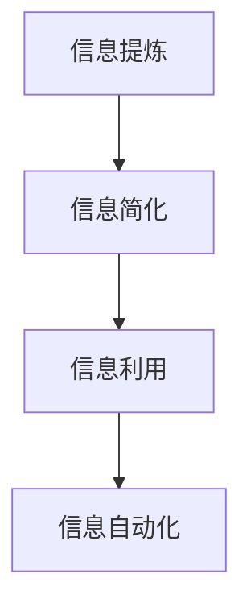

                 

## 1. 背景介绍

在信息爆炸的时代，大量的数据、文献、技术文档充斥着我们的生活和工作，但如何从中提取出有价值的信息，并应用于实际问题，却成了一个难题。信息的简化和提炼，不仅能够提高工作效率，还能帮助我们更好地理解复杂的系统，并快速找到问题的解决方案。本文将深入探讨如何在混乱中找到重点，通过信息简化的力量，提升决策和解决问题的效率。

### 1.1 问题由来

信息过载和复杂性是现代社会的普遍现象。信息量的激增让人们常常感到目不暇接，难以有效地处理和吸收这些信息。尤其在技术领域，源源不断的技术更新和变化让开发者和工程师面临前所未有的挑战。如何从海量的信息中提取出关键的、能够帮助解决实际问题的内容，成为了他们迫切需要解决的问题。

### 1.2 问题核心关键点

1. **信息提炼的重要性**：提炼出关键信息可以极大地提高工作效率，避免在不重要的事情上浪费时间和精力。
2. **信息简化的方法**：包括但不限于数据分析、特征选择、主题建模、文本摘要等技术手段。
3. **信息利用的技巧**：如何将提炼出的信息应用于实际问题，进行有效的决策和问题解决。
4. **自动化工具的应用**：利用自动化的工具和方法，加速信息的提取和处理。

### 1.3 问题研究意义

研究如何在混乱中找到重点，对于提升技术开发、管理决策和问题解决的能力，具有重要意义：

1. **提升工作效率**：通过有效的信息提炼和简化，减少无效劳动，提高工作效率。
2. **增强问题解决能力**：提炼出关键信息后，更容易发现问题的本质，找到更有效的解决方案。
3. **支持决策科学**：在复杂的环境下，通过信息的简化，使决策更加科学、准确。
4. **促进创新**：提炼关键信息有助于洞察技术发展趋势和创新机会。

## 2. 核心概念与联系

### 2.1 核心概念概述

为了更好地理解如何在混乱中找到重点，需要掌握一些核心概念：

- **信息提炼**：从海量数据中提取关键信息的过程。
- **信息简化**：将复杂的信息进行压缩和精简，使其更易于理解和处理。
- **信息利用**：将提炼和简化的信息应用于决策和问题解决的过程。
- **信息自动化**：利用自动化工具和方法，提高信息处理的效率。

这些概念之间的联系可以通过以下Mermaid流程图来展示：



这个流程图展示了信息提炼、信息简化、信息利用和信息自动化的相互关系：

1. **信息提炼**：从原始数据中提取关键信息。
2. **信息简化**：将提炼出的信息进行精简和压缩。
3. **信息利用**：将简化的信息应用于实际问题解决。
4. **信息自动化**：通过自动化工具加速信息的处理和应用。

## 3. 核心算法原理 & 具体操作步骤

### 3.1 算法原理概述

信息简化的过程可以通过多种算法和技术手段实现。本文将重点介绍基于统计学的信息提炼和简化的算法原理，并给出具体的操作步骤。

### 3.2 算法步骤详解

**Step 1: 数据预处理**

1. **数据清洗**：去除噪声和异常值，确保数据质量。
2. **数据标准化**：对数据进行标准化处理，使其具有可比性。
3. **数据分割**：将数据分为训练集、验证集和测试集。

**Step 2: 信息提炼**

1. **特征选择**：选择对问题有显著影响的特征。
2. **数据降维**：使用主成分分析(PCA)、线性判别分析(LDA)等算法降低数据维度。
3. **主题建模**：使用LDA、NMF等算法识别数据中的主题。

**Step 3: 信息简化**

1. **摘要生成**：使用文本摘要算法生成文本的简短摘要。
2. **信息可视化**：通过图表、图形等形式展示信息，使其更易于理解。
3. **知识图谱构建**：将信息构建为知识图谱，帮助进行推理和决策。

**Step 4: 信息利用**

1. **决策支持**：基于提炼和简化的信息进行决策。
2. **问题解决**：利用信息解决问题，进行技术开发、产品设计等。
3. **持续优化**：根据反馈不断优化信息提炼和简化的过程。

### 3.3 算法优缺点

基于统计学的信息提炼和简化方法具有以下优点：

1. **广泛适用性**：适用于各种类型的数据和问题。
2. **高效性**：通过自动化工具，可以快速处理大规模数据。
3. **可解释性**：每一步的处理过程和结果都易于理解和解释。

同时，这些方法也存在一些缺点：

1. **数据质量依赖**：如果数据质量差，提炼和简化的结果也会受到影响。
2. **模型复杂性**：一些算法如LDA、PCA等需要较高的计算复杂度。
3. **结果解释性**：复杂的数据处理过程可能导致结果难以解释。

### 3.4 算法应用领域

信息简化的技术在多个领域都有广泛应用，例如：

- **技术开发**：用于提炼关键需求和设计技术方案。
- **项目管理**：通过简化信息，更好地进行项目管理和决策。
- **市场分析**：提炼市场数据中的关键趋势和洞察。
- **情报分析**：从大量信息中提炼有价值的情报。
- **健康医疗**：提炼患者数据中的关键信息，进行疾病预测和诊断。

## 4. 数学模型和公式 & 详细讲解 & 举例说明

### 4.1 数学模型构建

在信息简化的过程中，数学模型是不可或缺的工具。本节将介绍几种常用的数学模型，包括PCA、LDA、摘要生成等。

**主成分分析(PCA)**：

PCA是一种常用的数据降维算法，用于将高维数据映射到低维空间。其数学模型为：

$$
X = U \Sigma V^T
$$

其中 $X$ 是原始数据，$U$ 是特征矩阵，$\Sigma$ 是特征值矩阵，$V^T$ 是特征向量矩阵。

**线性判别分析(LDA)**：

LDA是一种分类算法，用于识别数据中的主题。其数学模型为：

$$
p(w) = \frac{1}{\sum_{w} p(w)} \sum_{w} p(w) \prod_{d} p(d|w)
$$

其中 $p(w)$ 是类别 $w$ 的概率，$p(d|w)$ 是数据点 $d$ 在类别 $w$ 下的概率。

### 4.2 公式推导过程

以PCA为例，推导其公式的推导过程：

1. 假设原始数据矩阵 $X \in \mathbb{R}^{n \times d}$，其中 $n$ 是样本数，$d$ 是特征数。
2. 计算数据的协方差矩阵 $C = \frac{1}{n} X^T X$。
3. 对协方差矩阵进行特征分解，得到特征值 $\lambda_i$ 和对应的特征向量 $v_i$。
4. 选择前 $k$ 个特征向量（$k \ll d$）组成新的矩阵 $U \in \mathbb{R}^{d \times k}$。
5. 数据映射到低维空间：$X' = U \Sigma V^T$。

### 4.3 案例分析与讲解

假设我们有一份包含1000个样本的客户满意度调查数据，每个样本有10个特征，我们希望将其降到2维。使用PCA算法进行降维的步骤如下：

1. 计算协方差矩阵 $C = \frac{1}{1000} X^T X$。
2. 对协方差矩阵进行特征分解，得到前2个特征值和对应的特征向量。
3. 选择前2个特征向量作为新的特征矩阵 $U$。
4. 映射数据到低维空间：$X' = U \Sigma V^T$。

## 5. 项目实践：代码实例和详细解释说明

### 5.1 开发环境搭建

在进行信息简化的实践前，我们需要准备好开发环境。以下是使用Python进行Scikit-learn开发的环境配置流程：

1. 安装Anaconda：从官网下载并安装Anaconda，用于创建独立的Python环境。

2. 创建并激活虚拟环境：
```bash
conda create -n sklearn-env python=3.8
conda activate sklearn-env
```

3. 安装Scikit-learn：
```bash
pip install scikit-learn
```

4. 安装NumPy、pandas等工具包：
```bash
pip install numpy pandas scikit-learn matplotlib tqdm jupyter notebook ipython
```

完成上述步骤后，即可在`sklearn-env`环境中开始信息简化的实践。

### 5.2 源代码详细实现

下面我们以文本摘要为例，给出使用Scikit-learn库进行信息简化的PyTorch代码实现。

```python
from sklearn.feature_extraction.text import TfidfVectorizer
from sklearn.decomposition import PCA
from sklearn.manifold import TSNE
from sklearn.metrics.pairwise import cosine_similarity

# 假设我们有一份包含10个样本的客户满意度调查数据
X = ['样本1', '样本2', '样本3', ...]
Y = ['满意度1', '满意度2', '满意度3', ...]

# 特征提取
vectorizer = TfidfVectorizer(max_features=1000)
X_tfidf = vectorizer.fit_transform(X)

# 降维
pca = PCA(n_components=2)
X_pca = pca.fit_transform(X_tfidf)

# 可视化
tsne = TSNE(n_components=2)
X_tsne = tsne.fit_transform(X_tfidf)

# 相似性分析
similarity = cosine_similarity(X_tfidf, X_tfidf)

# 输出结果
print(X_pca)
print(X_tsne)
print(similarity)
```

### 5.3 代码解读与分析

让我们再详细解读一下关键代码的实现细节：

**TfidfVectorizer类**：
- `__init__`方法：初始化特征提取器，参数包括最大特征数`max_features`等。
- `fit_transform`方法：拟合特征提取器，并应用到数据集上，返回TF-IDF表示的文本向量。

**PCA类**：
- `fit_transform`方法：拟合降维器，并应用到数据集上，返回降维后的向量。

**TSNE类**：
- `fit_transform`方法：拟合降维器，并应用到数据集上，返回降维后的向量。

**cosine_similarity函数**：
- 计算文本向量之间的余弦相似度，返回相似度矩阵。

通过上述代码，我们可以看到，使用Scikit-learn库进行信息简化的过程相对简单，只需要选择适当的算法和参数，即可快速处理大规模数据。

## 6. 实际应用场景

### 6.1 数据驱动的决策

在企业的决策过程中，大量的数据需要处理和分析，才能发现其中的规律和趋势。通过信息简化的技术，可以快速提炼出关键信息，帮助管理层做出更为科学和精准的决策。

例如，某电商平台希望通过分析客户的购买行为，预测未来的销售趋势。通过对用户行为数据进行信息简化，提取出关键的购买特征和购买模式，利用PCA、LDA等算法进行降维和主题建模，找出影响销售的关键因素，从而制定更为有效的销售策略。

### 6.2 技术开发

在技术开发过程中，信息简化技术可以用于提炼关键需求和设计技术方案。例如，某个项目组需要开发一款智能聊天机器人，通过分析用户的对话数据，提炼出常见的用户需求和问题，设计出更符合用户需求的功能模块和算法。

### 6.3 情报分析

在情报分析领域，信息简化的技术可以帮助从大量的数据中提炼出有价值的情报。例如，通过分析社交媒体数据，提取关键字和情感倾向，预测政治事件的发展趋势。

## 7. 工具和资源推荐

### 7.1 学习资源推荐

为了帮助开发者系统掌握信息简化的理论基础和实践技巧，这里推荐一些优质的学习资源：

1. 《Python数据科学手册》系列博文：由数据科学领域的专家撰写，涵盖数据清洗、特征选择、降维等核心内容。

2. CS229《机器学习》课程：斯坦福大学开设的机器学习明星课程，有Lecture视频和配套作业，深入浅出地介绍了机器学习的基本概念和经典算法。

3. 《信息简化的艺术》书籍：介绍了信息简化的技术和方法，帮助读者构建更为有效的信息处理系统。

4. 《Python数据处理实战》书籍：介绍使用Python进行数据处理和分析的实战技巧，包括数据清洗、特征工程、降维等。

通过对这些资源的学习实践，相信你一定能够快速掌握信息简化的精髓，并用于解决实际的决策、技术开发和情报分析问题。

### 7.2 开发工具推荐

高效的开发离不开优秀的工具支持。以下是几款用于信息简化的开发工具：

1. Jupyter Notebook：用于编写和运行Python代码，支持代码块和可视化的混合展示。
2. pandas：用于数据清洗和处理，提供强大的数据结构和数据操作功能。
3. Scikit-learn：用于数据建模和分析，提供多种算法和工具。
4. matplotlib：用于数据可视化，提供丰富的图表展示功能。
5. NumPy：用于数值计算和科学计算，提供高效的数组和矩阵操作功能。

合理利用这些工具，可以显著提升信息简化的开发效率，加快创新迭代的步伐。

### 7.3 相关论文推荐

信息简化的技术发展源于学界的持续研究。以下是几篇奠基性的相关论文，推荐阅读：

1. The Elements of Statistical Learning（Tibshirani等，2009）：介绍了统计学习方法的基本原理和应用。
2. TextRank：Brin等（2003）：提出了一种基于PageRank算法的文本摘要方法。
3. Latent Dirichlet Allocation（Blei等，2003）：提出了一种基于概率模型的文本主题建模算法。
4. Dimensionality Reduction（Zhang等，2007）：介绍了各种数据降维方法，包括PCA、LDA等。

这些论文代表了大语言模型微调技术的发展脉络。通过学习这些前沿成果，可以帮助研究者把握学科前进方向，激发更多的创新灵感。

## 8. 总结：未来发展趋势与挑战

### 8.1 总结

本文对信息简化的核心概念和实现方法进行了全面系统的介绍。首先阐述了信息简化的重要性，明确了信息提炼、信息简化、信息利用和信息自动化的相互关系。其次，从原理到实践，详细讲解了信息简化的数学原理和关键步骤，给出了信息简化的完整代码实例。同时，本文还广泛探讨了信息简化的多个实际应用场景，展示了信息简化的广泛应用潜力。

通过对这些资源的学习实践，相信你一定能够快速掌握信息简化的精髓，并用于解决实际的决策、技术开发和情报分析问题。

### 8.2 未来发展趋势

展望未来，信息简化的技术将呈现以下几个发展趋势：

1. **自动化和智能化**：随着机器学习和深度学习技术的发展，信息简化的过程将变得更加自动化和智能化。
2. **多模态信息融合**：信息简化的技术将不局限于文本数据，还将扩展到图像、视频等多模态数据。
3. **实时处理**：信息简化的技术将能够实时处理大规模数据流，支持动态分析和决策。
4. **跨领域应用**：信息简化的技术将进一步扩展到更多领域，如金融、医疗、教育等，提升各领域的信息处理能力。
5. **数据隐私保护**：信息简化的过程中将更加注重数据隐私保护，确保数据安全和合规性。

以上趋势凸显了信息简化的广阔前景。这些方向的探索发展，必将进一步提升信息处理的效率和效果，为各行各业带来更为智能、高效的信息处理系统。

### 8.3 面临的挑战

尽管信息简化的技术已经取得了瞩目成就，但在迈向更加智能化、普适化应用的过程中，它仍面临着诸多挑战：

1. **数据质量和多样性**：信息简化的效果高度依赖于数据的质量和多样性，如何处理和清洗大规模、多样化的数据，是一大难题。
2. **算法复杂性**：一些高级的信息简化算法如LDA、PCA等，计算复杂度高，需要高效的计算资源。
3. **结果解释性**：信息简化的过程较为复杂，结果可能难以解释，如何提高结果的可解释性，是一个亟待解决的问题。
4. **跨领域应用**：信息简化的技术在不同领域的应用中，可能需要重新调整参数和模型。
5. **实时性和动态性**：信息简化的过程需要处理实时数据流，如何保持实时性和动态性，是另一大挑战。

这些挑战需要学界和产业界的共同努力，通过不断优化算法和工具，才能逐步克服。只有解决这些挑战，才能让信息简化的技术更加普适化和实用化。

### 8.4 研究展望

面向未来，信息简化的研究需要在以下几个方面寻求新的突破：

1. **自动化和智能化**：探索使用自动机器学习（AutoML）和深度学习模型进行信息简化的自动化处理。
2. **跨模态融合**：研究如何将文本、图像、视频等多模态数据进行融合，提升信息简化的效果。
3. **实时处理**：研究如何利用流式计算和增量学习技术，实现信息简化的实时处理。
4. **解释性增强**：研究如何提高信息简化的结果可解释性，增强模型的透明度和可信度。
5. **隐私保护**：研究如何在信息简化的过程中，保护数据隐私和安全。

这些研究方向的探索，必将引领信息简化的技术迈向更高的台阶，为各行各业带来更为智能、高效的信息处理系统。

## 9. 附录：常见问题与解答

**Q1：信息简化的效果是否只依赖于数据质量？**

A: 信息简化的效果不仅依赖于数据质量，还依赖于算法的质量和参数的选择。数据质量是基础，但通过选择合适的算法和参数，即使数据质量一般，也能获得不错的结果。

**Q2：信息简化的过程中，如何处理噪声和异常值？**

A: 在信息简化的过程中，可以使用数据清洗技术，去除噪声和异常值，确保数据质量。常用的方法包括：
1. 数据预处理：包括去重、归一化、标准化等。
2. 数据清洗：包括去除空值、处理缺失值、去除异常值等。

**Q3：信息简化的结果是否易于解释？**

A: 信息简化的结果可能较为复杂，难以解释。为了提高结果的可解释性，可以采取以下方法：
1. 可视化：使用图表、图形等形式展示结果，帮助理解。
2. 文字描述：对结果进行文字描述，说明其背后的逻辑和推理过程。
3. 模型分析：对简化的模型进行分析，理解其结构和参数。

通过这些方法，可以提升信息简化的结果可解释性，增强模型的透明度和可信度。

---

作者：禅与计算机程序设计艺术 / Zen and the Art of Computer Programming

