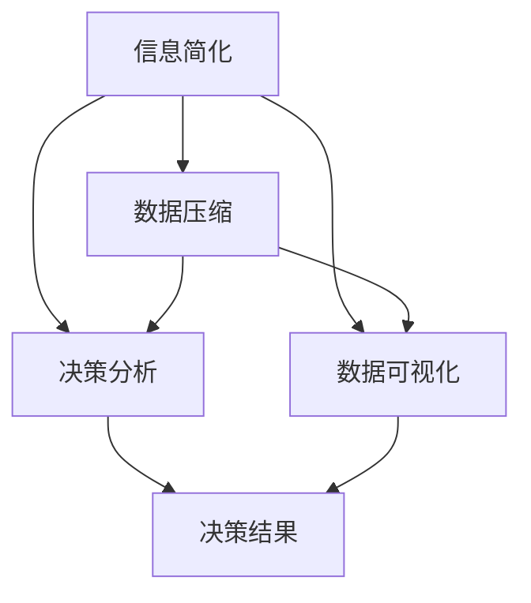

                 

# 信息简化的好处与实践：如何在复杂世界中简化和改善决策

> 关键词：信息简化, 决策分析, 数据压缩, 复杂系统, 数据可视化

## 1. 背景介绍

### 1.1 问题由来

在现代社会，信息量的爆炸式增长使得人们面临的决策问题日益复杂。无论是商业决策、政策制定还是个人决策，数据量和信息维度都在不断增加。在数据科学和人工智能迅速发展的今天，如何从海量的信息中提取出关键要素，简化决策过程，已经成为各个领域研究的重要课题。信息简化，不仅能够有效降低决策难度，提高决策效率，还能提升决策的精确度，避免信息过载带来的决策失误。本文将从理论到实践，全面探讨信息简化的好处与实践方法。

### 1.2 问题核心关键点

信息简化的核心在于如何有效地从原始数据中提取出最关键的特征，并将其应用于决策过程中。在处理大规模数据集时，信息的复杂性和冗余性成为决策的主要障碍。因此，关键问题包括：
- 如何识别数据中的关键特征？
- 如何高效地进行数据压缩和提取？
- 如何将简化后的信息应用于实际的决策场景？
- 如何在信息简化过程中避免信息丢失和扭曲？

这些问题的解答将直接影响决策的准确性和及时性，从而影响到最终的决策结果。

## 2. 核心概念与联系

### 2.1 核心概念概述

为了深入理解信息简化的好处与实践方法，本节将介绍几个紧密相关的核心概念：

- **信息简化（Information Simplification）**：指从原始数据中提取出最关键、最有价值的信息，并用于辅助决策。信息简化能够有效降低决策难度，提高决策效率。

- **数据压缩（Data Compression）**：指在保证数据质量的前提下，尽可能减少数据量，以提高数据的处理和传输效率。数据压缩是信息简化的重要手段之一。

- **决策分析（Decision Analysis）**：指通过模型和算法，从数据中提取关键信息，辅助决策制定。决策分析依赖于信息简化的结果，进行进一步的分析和判断。

- **数据可视化（Data Visualization）**：指将复杂数据通过图形化方式呈现，使数据更直观、易于理解。数据可视化是信息简化的一种表现形式，有助于识别关键信息。

- **复杂系统（Complex Systems）**：指由众多相互作用的元素构成的动态系统，信息复杂性高，决策难度大。

这些核心概念之间的逻辑关系可以通过以下Mermaid流程图来展示：



这个流程图展示了几大核心概念及其之间的关系：

1. 信息简化通过数据压缩和可视化，提取关键信息。
2. 关键信息用于决策分析，辅助决策制定。
3. 决策分析的结果通过可视化展示，直观反映决策过程和结果。

## 3. 核心算法原理 & 具体操作步骤

### 3.1 算法原理概述

信息简化的核心算法通常基于以下原则：
1. **重要性优先**：识别数据中最重要的特征，并优先处理。
2. **冗余性减少**：去除数据中的冗余部分，提升数据质量。
3. **可理解性增强**：将简化后的信息以更易于理解的形式呈现，方便决策分析。

信息简化的主要算法包括特征选择、主成分分析（PCA）、聚类分析等。这些算法通过不同的方法和模型，从原始数据中提取关键信息，辅助决策过程。

### 3.2 算法步骤详解

信息简化的步骤通常包括以下几个关键环节：

1. **数据预处理**：清洗数据、去除噪声、处理缺失值等。
2. **特征选择**：识别数据中最有价值的特征，进行重要性排序。
3. **数据压缩**：采用压缩算法减少数据量，提升处理效率。
4. **信息提取**：通过聚类分析、PCA等方法，提取关键信息。
5. **可视化展示**：将简化后的信息以图表、图形等方式展示，增强决策可理解性。
6. **模型训练**：在简化后的数据上训练决策模型，辅助决策制定。

### 3.3 算法优缺点

信息简化的主要算法具有以下优缺点：

**优点**：
1. 提高数据处理效率，降低计算资源消耗。
2. 增强决策过程的可视化和可理解性，减少决策误解。
3. 提升决策准确性，避免信息过载导致的错误决策。

**缺点**：
1. 可能需要较长时间进行特征选择和模型训练。
2. 存在信息丢失的风险，无法完全还原原始数据。
3. 对于复杂系统的动态变化，可能难以及时适应。

### 3.4 算法应用领域

信息简化的算法在多个领域都有广泛应用：

- **商业决策**：在市场营销、客户关系管理等领域，通过信息简化，快速生成有价值的决策数据。
- **政策制定**：在公共政策制定中，通过信息简化，从大量数据中提取关键因素，辅助政策评估。
- **医疗诊断**：在医疗诊断中，通过信息简化，快速识别患者的主要健康问题，辅助医生决策。
- **金融分析**：在金融市场分析中，通过信息简化，从海量数据中提取关键特征，辅助投资决策。
- **自然语言处理**：在文本分析中，通过信息简化，从自然语言文本中提取关键信息，辅助情感分析、主题提取等任务。

这些领域的应用表明，信息简化方法在提升决策效率和准确性方面具有重要价值。

## 4. 数学模型和公式 & 详细讲解

### 4.1 数学模型构建

信息简化的数学模型通常基于以下假设：
- 数据集包含大量冗余信息。
- 关键信息在数据集中分布不均，存在重要性差异。
- 简化后的信息能够反映原始数据的关键特征。

根据这些假设，我们可以构建如下数学模型：

设原始数据集为 $D=\{(x_i, y_i)\}_{i=1}^N$，其中 $x_i$ 为输入特征，$y_i$ 为输出标签。假设 $x_i$ 包含 $m$ 个特征，信息简化后的特征数量为 $n$。则信息简化的目标可以表示为：

$$
\min_{x'} \sum_{i=1}^N \|x'_i - x_i\|^2
$$

其中 $x'$ 为简化后的特征向量，$\|\cdot\|$ 为向量范数。

### 4.2 公式推导过程

为了求解上述优化问题，我们通常使用主成分分析（PCA）方法。PCA通过线性变换将高维数据映射到低维空间，保留最大方差的方向，从而实现数据压缩和信息提取。

PCA的主要步骤如下：

1. **数据标准化**：将数据标准化，使得每个特征的均值为0，方差为1。
2. **协方差矩阵计算**：计算数据集的协方差矩阵 $\Sigma$。
3. **特征值分解**：对协方差矩阵进行特征值分解，得到特征向量和特征值。
4. **选择主成分**：选择前 $n$ 个特征值对应的特征向量，构成主成分矩阵 $U$。
5. **数据映射**：将原始数据 $x$ 映射到低维空间 $x' = Ux$。

PCA的数学公式推导如下：

1. 数据标准化：
$$
x'_i = \frac{x_i - \mu}{\sigma}
$$

2. 协方差矩阵计算：
$$
\Sigma = \frac{1}{N} \sum_{i=1}^N x'_i x'_i^T
$$

3. 特征值分解：
$$
\Sigma = U\Lambda U^T
$$

4. 选择主成分：
$$
U = [u_1, u_2, \ldots, u_n]
$$

其中 $u_i$ 为第 $i$ 个主成分向量，$\Lambda$ 为对角矩阵，对角线上的元素为对应特征值。

5. 数据映射：
$$
x'_i = Ux_i
$$

### 4.3 案例分析与讲解

以某公司的销售数据为例，原始数据包含多个特征，如销售额、客户满意度、广告费用等。通过PCA方法，可以从中提取关键特征，用于销售趋势预测。

1. **数据预处理**：清洗数据、处理缺失值、标准化数据。
2. **协方差矩阵计算**：计算销售数据的协方差矩阵。
3. **特征值分解**：对协方差矩阵进行特征值分解，得到主成分。
4. **选择主成分**：选择前3个主成分，构成主成分矩阵。
5. **数据映射**：将原始销售数据映射到低维空间。
6. **可视化展示**：将映射后的数据绘制成图表，展示销售趋势。
7. **模型训练**：在简化后的数据上训练销售预测模型，辅助决策。

通过PCA方法，可以有效提取关键信息，简化数据处理过程，提高决策准确性。

## 5. 项目实践：代码实例和详细解释说明

### 5.1 开发环境搭建

在进行信息简化和决策分析实践前，我们需要准备好开发环境。以下是使用Python进行Pandas和Scikit-Learn开发的环境配置流程：

1. 安装Anaconda：从官网下载并安装Anaconda，用于创建独立的Python环境。

2. 创建并激活虚拟环境：
```bash
conda create -n info-simplify python=3.8 
conda activate info-simplify
```

3. 安装Pandas和Scikit-Learn：
```bash
conda install pandas scikit-learn
```

4. 安装必要的开发工具：
```bash
pip install numpy matplotlib seaborn joblib
```

完成上述步骤后，即可在`info-simplify`环境中开始信息简化和决策分析实践。

### 5.2 源代码详细实现

这里我们以某公司的销售数据为例，展示使用Pandas和Scikit-Learn进行信息简化的代码实现。

首先，导入必要的库：

```python
import pandas as pd
import numpy as np
from sklearn.decomposition import PCA
import matplotlib.pyplot as plt
```

然后，定义数据集和简化模型：

```python
data = pd.read_csv('sales_data.csv')

# 标准化数据
mean = data.mean()
std = data.std()
data = (data - mean) / std

# 计算协方差矩阵
cov = np.cov(data.T)

# 特征值分解
eigenvectors, eigenvalues = np.linalg.eig(cov)

# 选择主成分
n = 3  # 选择3个主成分
eigenvalues_sorted = np.sort(eigenvalues)[::-1]
eigenvectors_sorted = eigenvectors[:, eigenvalues_sorted[0:n]]
U = eigenvectors_sorted / np.sqrt(eigenvalues_sorted[0:n])

# 数据映射
data_simplified = data.dot(U)
```

最后，可视化展示简化后的数据：

```python
plt.scatter(data_simplified[:, 0], data_simplified[:, 1], c=data['profit'], cmap='viridis')
plt.colorbar()
plt.xlabel('第一主成分')
plt.ylabel('第二主成分')
plt.show()
```

以上就是使用Pandas和Scikit-Learn对销售数据进行信息简化的完整代码实现。可以看到，使用这些库可以方便地进行数据处理、特征提取和可视化展示。

### 5.3 代码解读与分析

让我们再详细解读一下关键代码的实现细节：

**数据预处理**：
- 首先，导入Pandas库，并使用`pd.read_csv`方法读取销售数据。
- 接着，使用`mean`和`std`计算数据的均值和标准差，对数据进行标准化处理。

**协方差矩阵计算**：
- 使用`np.cov`计算数据的协方差矩阵。

**特征值分解**：
- 使用`np.linalg.eig`对协方差矩阵进行特征值分解，得到特征向量和特征值。

**选择主成分**：
- 将特征值进行排序，选择前 $n$ 个特征值对应的特征向量，构成主成分矩阵 $U$。

**数据映射**：
- 将原始数据 $x$ 映射到低维空间 $x' = Ux$。

**可视化展示**：
- 使用Matplotlib库绘制简化后的数据图表，通过颜色标记利润，直观展示销售趋势。

通过上述代码实现，我们可以快速获取数据的关键信息，并辅助决策分析。

## 6. 实际应用场景

### 6.1 金融风险管理

在金融领域，信息简化方法可以应用于风险管理中。金融市场数据量大、复杂度高，通过信息简化，可以快速识别风险因素，进行风险评估和控制。

具体而言，可以收集市场交易数据、经济指标、公司财务数据等，进行信息简化处理，提取关键风险特征。然后，利用简化后的数据进行风险模型训练，预测金融市场的波动和风险概率，辅助金融决策。

### 6.2 医疗健康管理

在医疗领域，信息简化方法可以应用于健康数据分析和疾病预测中。医疗数据通常包含多种类型的信息，如生理指标、遗传信息、生活习惯等。通过信息简化，可以提取出关键的健康特征，用于疾病预测和健康管理。

例如，使用信息简化方法从患者的历史数据中提取出关键的健康指标，用于糖尿病、心脏病等疾病的早期预测和干预。同时，也可以用于制定个性化的健康管理计划，提升患者生活质量。

### 6.3 城市交通管理

在城市交通管理中，信息简化方法可以应用于交通流量预测和交通规划中。交通数据通常包含多种类型的信息，如车辆类型、行驶路线、交通信号等。通过信息简化，可以提取出关键交通特征，用于交通流量预测和优化。

例如，使用信息简化方法从历史交通数据中提取出关键特征，用于交通流量预测，辅助城市交通规划和调度。同时，也可以用于交通流量的实时监控和分析，提升城市交通管理水平。

### 6.4 未来应用展望

随着信息简化技术的不断发展，未来将在更多领域得到应用，为各个行业带来变革性影响。

在智慧城市治理中，信息简化方法可以应用于智能交通、智慧能源、智能建筑等领域，提升城市管理的自动化和智能化水平，构建更安全、高效的未来城市。

在工业制造中，信息简化方法可以应用于生产调度、设备维护、质量控制等领域，提高生产效率和质量，降低成本。

在农业领域，信息简化方法可以应用于气象预测、农作物监测、农业机械控制等领域，提高农业生产的智能化水平，增加产量和收益。

## 7. 工具和资源推荐

### 7.1 学习资源推荐

为了帮助开发者系统掌握信息简化的理论基础和实践技巧，这里推荐一些优质的学习资源：

1. 《数据压缩与信息理论》书籍：介绍数据压缩的基本原理和实际应用，深入浅出地讲解信息简化方法。
2. 《机器学习实战》书籍：由机器学习专家撰写，涵盖特征选择、PCA等核心算法，并包含大量代码示例。
3. 《统计学习方法》书籍：介绍各种机器学习算法的原理和实现，包含信息简化的重要算法。
4. Kaggle平台：提供丰富的数据集和机器学习竞赛，通过实际项目提升信息简化的应用能力。
5. Coursera和edX平台：开设大量与信息简化相关的在线课程，由世界顶尖大学的教授授课，涵盖理论基础和实际应用。

通过对这些资源的学习实践，相信你一定能够快速掌握信息简化的精髓，并用于解决实际的决策问题。

### 7.2 开发工具推荐

高效的信息简化开发离不开优秀的工具支持。以下是几款用于信息简化开发的常用工具：

1. Pandas：用于数据清洗、处理和分析，支持高效的数据处理和数据可视化。
2. Scikit-Learn：提供了多种信息简化算法，包括PCA、特征选择等，易于使用。
3. Weights & Biases：用于模型训练和实验跟踪，记录和可视化模型训练过程中的各项指标，方便调试和优化。
4. TensorBoard：TensorFlow配套的可视化工具，可以实时监测模型训练状态，并提供丰富的图表呈现方式。
5. Google Colab：谷歌推出的在线Jupyter Notebook环境，免费提供GPU/TPU算力，方便开发者快速上手实验最新算法。

合理利用这些工具，可以显著提升信息简化的开发效率，加快创新迭代的步伐。

### 7.3 相关论文推荐

信息简化技术的发展源于学界的持续研究。以下是几篇奠基性的相关论文，推荐阅读：

1. "The Elements of Statistical Learning" 书籍：由机器学习专家撰写，介绍了各种统计学习方法，包括信息简化的算法和应用。
2. "Principal Component Analysis" 论文：介绍PCA方法的基本原理和应用，是信息简化的经典算法之一。
3. "Feature Selection: A Survey" 论文：总结了特征选择的多种方法，包括过滤、包装、嵌入等，是信息简化的重要参考。
4. "Efficient Feature Selection in Machine Learning" 论文：介绍了多种高效的特征选择算法，提升信息简化的效率和效果。
5. "Deep Learning for NLP" 书籍：由深度学习专家撰写，介绍了深度学习在NLP中的应用，包括信息简化的算法和应用。

这些论文代表了大规模数据处理和信息简化的发展脉络。通过学习这些前沿成果，可以帮助研究者把握学科前进方向，激发更多的创新灵感。

## 8. 总结：未来发展趋势与挑战

### 8.1 总结

本文对信息简化的理论和实践进行了全面系统的介绍。首先阐述了信息简化的核心概念和其应用价值，明确了信息简化在降低决策难度、提高决策效率方面的重要作用。其次，从原理到实践，详细讲解了信息简化的数学模型和操作步骤，给出了信息简化任务开发的完整代码实例。同时，本文还广泛探讨了信息简化的实际应用场景，展示了信息简化技术的广泛应用前景。

通过本文的系统梳理，可以看到，信息简化方法在提升决策效率和准确性方面具有重要价值。信息简化不仅能够有效降低决策难度，还能提升决策过程的可理解性和透明性，为各个行业带来变革性影响。

### 8.2 未来发展趋势

展望未来，信息简化技术将呈现以下几个发展趋势：

1. **自动化和智能化**：随着自动化和智能化技术的发展，信息简化的过程将更加智能和高效，能够自动识别数据中的关键信息，自动进行信息提取和压缩。
2. **跨领域融合**：信息简化技术将与其他人工智能技术进行更深入的融合，如深度学习、自然语言处理、知识图谱等，形成更加全面、多样化的信息处理能力。
3. **实时化和动态化**：信息简化将更加关注实时数据处理和动态信息更新，支持快速响应的决策系统。
4. **可解释性和透明性**：信息简化的结果将更加透明和可解释，帮助决策者理解信息简化的过程和决策依据。

这些趋势将使信息简化技术更加高效、智能和透明，推动各个领域的信息处理和决策优化。

### 8.3 面临的挑战

尽管信息简化技术已经取得了一定成果，但在迈向更加智能化、普适化应用的过程中，仍面临以下挑战：

1. **数据质量和多样性**：信息简化的效果很大程度上依赖于数据的质量和多样性，低质量的数据将影响信息简化的效果。
2. **信息丢失和扭曲**：信息简化过程中存在信息丢失的风险，如何避免信息扭曲和丢失，是信息简化的关键问题。
3. **算法复杂性和计算资源消耗**：信息简化的算法复杂度较高，需要较高的计算资源，如何优化算法效率，降低计算成本，是信息简化的重要挑战。
4. **跨领域适应性**：信息简化技术在不同领域的应用效果存在差异，如何提高信息简化的跨领域适应性，是信息简化的重要研究方向。
5. **信息可视化**：信息简化的结果需要以易于理解的形式展示，如何设计高效、美观的可视化工具，提升信息可视化的效果，是信息简化的重要研究方向。

这些挑战需要通过技术创新和跨学科合作，不断攻克，才能使信息简化技术更好地服务于各个行业。

### 8.4 研究展望

未来，信息简化的研究需要在以下几个方面寻求新的突破：

1. **自动化算法**：开发更加智能、自动化的信息简化算法，能够自动识别数据中的关键信息，并进行高效处理。
2. **跨领域适应性**：研究信息简化的跨领域适应性，提升信息简化技术在不同领域的应用效果。
3. **多模态信息处理**：研究信息简化的多模态信息处理能力，将视觉、语音、文本等不同类型的数据进行综合处理，提升信息简化的效果。
4. **实时动态处理**：研究实时信息简化的算法，支持动态数据处理和实时决策。
5. **可解释性和透明性**：研究信息简化的可解释性和透明性，提升信息简化的可理解性和可信度。

这些研究方向的探索，将使信息简化技术更加全面、高效，为各个领域的决策支持提供强大的技术支持。总之，信息简化技术需要不断创新和突破，才能在复杂多变的现实世界中发挥更大的作用。

## 9. 附录：常见问题与解答

**Q1：信息简化的效果如何评价？**

A: 信息简化的效果可以从以下几个方面进行评价：
1. 数据处理效率：信息简化后的数据处理速度是否提升。
2. 决策准确性：信息简化后的数据是否能够有效辅助决策。
3. 可理解性：简化后的数据是否易于理解，便于决策分析。
4. 信息损失：信息简化过程中是否存在信息丢失和扭曲。

通过这些评价指标，可以全面衡量信息简化的效果，并进行优化。

**Q2：信息简化的步骤是否固定？**

A: 信息简化的步骤可以根据具体需求进行调整。常用的步骤包括数据预处理、特征选择、数据压缩、信息提取和可视化展示。但具体的步骤和方法可以根据任务特点和数据情况进行调整，以获得最佳效果。

**Q3：信息简化对数据量的影响如何？**

A: 信息简化的效果通常与数据量密切相关。数据量较大时，信息简化的效果更为显著；数据量较小时，信息简化的效果可能不明显。因此，在实际应用中需要根据数据量选择合适的简化方法。

**Q4：信息简化的结果是否可以重构？**

A: 信息简化的结果可以重构为原始数据，但重构的过程会引入一定的误差。因此，在信息简化的过程中，需要平衡简化效果和重构误差，选择合适的参数和算法。

**Q5：信息简化的应用场景有哪些？**

A: 信息简化的应用场景非常广泛，包括商业决策、金融分析、医疗健康管理、城市交通管理、智慧城市治理等。通过信息简化，可以从大规模复杂数据中提取出关键信息，辅助决策制定。

通过本文的系统梳理，可以看到，信息简化方法在提升决策效率和准确性方面具有重要价值。信息简化不仅能够有效降低决策难度，还能提升决策过程的可理解性和透明性，为各个行业带来变革性影响。未来，随着技术不断进步，信息简化将更加智能、高效和透明，推动各个领域的信息处理和决策优化。

