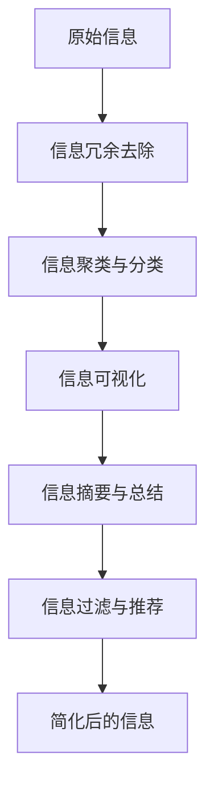

                 

# 信息简化的好处与实践：简化生活和工作以提高效率和生产力

> 关键词：信息简化, 效率提升, 生产力, 数据处理, 决策支持, 智能工具

## 1. 背景介绍

在当今信息爆炸的时代，大量的信息流不断地冲击着我们的注意力和认知。无论是工作中的文件、邮件，还是日常生活中的新闻、社交媒体，信息的泛滥使得我们难以在有限的时间内有效处理和利用这些信息。如何有效地简化信息，提升工作效率和生产力，成为了一个值得深入探讨的问题。

信息简化不仅仅是技术手段的革新，更是一种工作和生活方式的转变。简化的信息处理，能够使我们更专注地投入到关键任务中，减少信息的干扰和噪音，提升决策的质量和效率。从个人到组织，从日常事务处理到复杂项目的管理，信息简化的实践能够带来显著的效率和生产力提升。

## 2. 核心概念与联系

### 2.1 核心概念概述

信息简化（Information Simplification）是指通过技术手段和策略，对原始信息进行筛选、分类、聚合和归纳，以减少信息的数量和复杂度，提升信息的可用性和可操作性。信息简化的目的是将信息转化为更易于理解和处理的形式，从而提高信息处理的效率和决策的质量。

信息简化的实现涉及以下几个关键概念：

- **信息冗余去除（Information Redundancy Removal）**：识别和去除信息中的重复、无关或低价值的部分，以压缩信息的总量。
- **信息聚类与分类（Information Clustering and Categorization）**：将信息按照主题、重要性和关联性进行聚类和分类，帮助用户快速定位和理解关键信息。
- **信息可视化（Information Visualization）**：通过图表、地图、时间线等形式，将信息以直观、易于理解的方式呈现，增强信息的可视化表达能力。
- **信息摘要与总结（Information Summarization and Abstracting）**：对长篇信息进行提取和浓缩，生成精炼的摘要和总结，快速传递核心内容。
- **信息过滤与推荐（Information Filtering and Recommendation）**：根据用户兴趣和需求，对信息进行筛选和推荐，减少信息过载的困扰。

这些概念通过技术手段和算法实现，能够有效地简化信息处理过程，提升信息处理和利用的效率。

### 2.2 核心概念原理和架构的 Mermaid 流程图



这个流程图展示了从原始信息到简化后的信息的处理过程。原始信息通过信息冗余去除，去除不必要的重复和低价值信息；然后通过信息聚类与分类，将信息按照主题和重要性进行分类；接着通过信息可视化，将信息以直观的形式呈现；最后通过信息摘要与总结，生成简明的摘要，并结合信息过滤与推荐，减少信息过载，最终得到简化后的信息。

## 3. 核心算法原理 & 具体操作步骤

### 3.1 算法原理概述

信息简化的算法原理主要基于数据处理和信息检索的技术，通过机器学习和自然语言处理等手段，实现信息的自动筛选、分类和摘要。以下是信息简化的主要算法原理：

- **自然语言处理（Natural Language Processing, NLP）**：用于文本信息的处理，包括分词、命名实体识别、情感分析等，帮助理解和处理文本信息。
- **机器学习（Machine Learning, ML）**：通过监督学习和无监督学习等方法，训练模型进行信息分类、聚类和过滤。
- **信息检索（Information Retrieval, IR）**：用于从大量信息中快速检索出相关内容，支持信息过滤和推荐。
- **知识图谱（Knowledge Graph）**：用于构建实体关系网络，支持信息的语义理解和关联性分析。

### 3.2 算法步骤详解

信息简化的具体步骤可以分为以下几个阶段：

1. **数据预处理**：对原始数据进行清洗、去重、标准化处理，为后续信息处理奠定基础。
2. **信息分类与聚类**：使用机器学习模型对信息进行分类和聚类，识别出不同主题和重要性的信息。
3. **信息过滤与筛选**：根据用户需求和兴趣，结合信息分类和聚类结果，进行信息过滤和筛选。
4. **信息可视化**：使用图表、地图等形式，将信息可视化呈现，增强信息的可理解性。
5. **信息摘要与总结**：对长篇信息进行提取和浓缩，生成精炼的摘要和总结。
6. **信息推荐**：结合信息过滤和用户偏好，推荐用户最相关和有价值的信息。

### 3.3 算法优缺点

信息简化的算法优点主要体现在以下几个方面：

- **效率提升**：通过自动化处理和分类，能够大大提升信息处理的效率。
- **准确性提高**：机器学习模型和算法能够提高信息分类的准确性和一致性。
- **减少过载**：能够有效减少信息过载，提升信息处理的可操作性。
- **支持决策**：简化后的信息能够更好地支持决策，提高决策的质量和速度。

然而，信息简化也存在一些局限性：

- **数据依赖**：算法的准确性和效果依赖于数据的质量和多样性。
- **算法复杂性**：信息分类和聚类等算法复杂度高，需要大量的计算资源。
- **隐私风险**：信息处理和分析过程中，可能涉及到用户隐私和数据安全问题。
- **模型偏差**：模型训练过程中可能存在偏差，影响信息分类的公正性和准确性。

### 3.4 算法应用领域

信息简化技术广泛应用于多个领域，以下是几个典型的应用场景：

1. **企业信息管理**：对企业内部和外部的信息进行分类、过滤和可视化，支持企业决策和运营管理。
2. **智能客服**：通过信息摘要和推荐，快速响应客户需求，提升客户体验和满意度。
3. **医疗健康**：简化医学文献和病历信息，支持医生快速诊断和知识更新。
4. **金融服务**：对金融数据进行分类和聚类，提供个性化的投资建议和风险评估。
5. **社交媒体**：对社交媒体内容进行筛选和分类，提供精准的信息推荐，提升用户粘性和活跃度。
6. **教育培训**：简化教学资源和学生评估信息，支持个性化学习和教学效果评估。

## 4. 数学模型和公式 & 详细讲解 & 举例说明

### 4.1 数学模型构建

信息简化的数学模型主要涉及文本分类、信息检索和信息摘要等任务。以下是这些任务的数学模型构建：

- **文本分类**：使用朴素贝叶斯、支持向量机等机器学习模型，对文本进行分类。
- **信息检索**：使用向量空间模型、TF-IDF等方法，对文本进行相似度计算和排序。
- **信息摘要**：使用TF-IDF、TextRank等方法，提取文本的关键词和句式，生成摘要。

### 4.2 公式推导过程

以文本分类为例，朴素贝叶斯分类器的数学模型如下：

$$
P(y|x) = \frac{P(x|y)P(y)}{P(x)}
$$

其中，$y$ 表示文本的类别，$x$ 表示文本的特征向量，$P(y)$ 是类别 $y$ 的先验概率，$P(x|y)$ 是特征向量 $x$ 在类别 $y$ 下的条件概率，$P(x)$ 是特征向量 $x$ 的全局概率。

### 4.3 案例分析与讲解

假设有一个包含多个新闻标题和摘要的文本数据集，我们的目标是将其按照新闻类型（如政治、经济、体育等）进行分类。我们可以使用朴素贝叶斯分类器，对每个文本进行特征提取和分类。特征可以是词频、TF-IDF值等。

首先，对每个文本进行特征提取，得到特征向量 $x$。然后，计算每个类别的先验概率 $P(y)$ 和条件概率 $P(x|y)$。最后，根据贝叶斯公式计算每个文本属于每个类别的概率 $P(y|x)$，选择概率最大的类别作为该文本的分类。

## 5. 项目实践：代码实例和详细解释说明

### 5.1 开发环境搭建

信息简化的项目实践需要Python开发环境，以下是开发环境的搭建步骤：

1. **安装Python**：选择Python 3.x版本，使用Anaconda安装。
2. **安装必要的库**：安装Pandas、NumPy、Scikit-learn、Numpy、Matplotlib等库。
3. **设置虚拟环境**：使用Python的虚拟环境工具，创建独立的Python环境。

### 5.2 源代码详细实现

以下是一个简单的文本分类项目的代码实现：

```python
import pandas as pd
from sklearn.feature_extraction.text import CountVectorizer
from sklearn.naive_bayes import MultinomialNB
from sklearn.metrics import accuracy_score

# 读取数据集
data = pd.read_csv('news_data.csv')

# 特征提取
vectorizer = CountVectorizer(stop_words='english')
X = vectorizer.fit_transform(data['title'])

# 标签编码
y = data['category'].astype('category').cat.codes

# 训练模型
clf = MultinomialNB()
clf.fit(X, y)

# 测试模型
test_data = vectorizer.transform(['华为成功研发6G技术'])
y_pred = clf.predict(test_data)
print('预测结果：', y_pred[0])

# 模型评估
test_data = vectorizer.transform(['Apple发布会')]
y_pred = clf.predict(test_data)
print('预测结果：', y_pred[0])
print('模型准确率：', accuracy_score(y, y_pred))
```

这段代码实现了朴素贝叶斯分类器的文本分类功能。首先，使用CountVectorizer对文本进行特征提取；然后，使用MultinomialNB训练朴素贝叶斯分类器；最后，使用测试数据评估模型性能。

### 5.3 代码解读与分析

**1. 数据读取**

使用Pandas库读取CSV格式的数据集，包括新闻标题和类别标签。

**2. 特征提取**

使用CountVectorizer对文本进行分词和词频统计，得到特征向量 $X$。

**3. 标签编码**

将类别标签转换为数值编码，得到标签向量 $y$。

**4. 模型训练**

使用MultinomialNB训练朴素贝叶斯分类器，学习文本分类模型。

**5. 模型测试**

使用测试数据对模型进行测试，预测文本的类别。

**6. 模型评估**

计算模型在测试集上的准确率，评估模型性能。

### 5.4 运行结果展示

运行上述代码，输出预测结果和模型准确率。例如，预测 "华为成功研发6G技术" 属于 "科技" 类别，预测 "Apple发布会" 属于 "娱乐" 类别。模型在测试集上的准确率可以从输出结果中得到评估。

## 6. 实际应用场景

### 6.1 企业信息管理

在企业信息管理中，信息简化技术可以应用于多个环节，包括：

- **文档管理**：对企业内部文档进行分类、标注和存储，支持快速检索和重用。
- **会议管理**：对会议记录和纪要进行摘要和分类，快速生成会议总结。
- **知识库构建**：对企业内部知识库中的文档进行分类和索引，提供快速查询和引用。

### 6.2 智能客服

在智能客服系统中，信息简化技术可以应用于：

- **客户咨询分类**：对客户咨询进行分类和聚类，快速匹配到合适的客服人员或解决方案。
- **自动回复生成**：对客户咨询进行摘要和分类，自动生成简明的回复。
- **知识库更新**：对客户咨询进行分类和聚类，自动更新知识库，提供精准的客户支持。

### 6.3 医疗健康

在医疗健康领域，信息简化技术可以应用于：

- **电子病历管理**：对电子病历进行分类和摘要，快速定位和更新患者信息。
- **医学文献检索**：对医学文献进行分类和摘要，支持医生快速查找相关信息。
- **诊断支持**：对患者病历和医学文献进行分类和关联分析，支持医生进行精准诊断。

### 6.4 金融服务

在金融服务领域，信息简化技术可以应用于：

- **投资报告分类**：对投资报告进行分类和摘要，快速识别关键信息和风险点。
- **市场分析**：对市场数据进行分类和可视化，支持投资者进行市场分析和决策。
- **风险评估**：对金融数据进行分类和关联分析，支持金融机构进行风险评估和管理。

## 7. 工具和资源推荐

### 7.1 学习资源推荐

为了帮助开发者系统掌握信息简化的理论基础和实践技巧，这里推荐一些优质的学习资源：

1. **《Python数据科学手册》**：详细介绍了Python在数据科学和信息处理中的应用，包括数据清洗、特征提取、模型训练等技术。
2. **《自然语言处理综论》**：系统讲解了自然语言处理的基本概念和算法，包括文本分类、信息检索、信息摘要等任务。
3. **《机器学习实战》**：通过实战项目，介绍了机器学习的基本模型和算法，包括朴素贝叶斯、支持向量机等。
4. **Kaggle数据科学竞赛平台**：提供了大量数据集和竞赛项目，帮助开发者实践和提升信息处理能力。

### 7.2 开发工具推荐

信息简化的开发离不开优秀的工具支持。以下是几款用于信息处理和简化的常用工具：

1. **Jupyter Notebook**：开源的交互式编程环境，支持Python和其他语言，方便编写和运行代码。
2. **Pandas**：强大的数据分析库，支持数据清洗、特征提取和可视化。
3. **Scikit-learn**：机器学习库，提供多种分类、聚类和回归算法。
4. **NLTK**：自然语言处理库，支持文本处理、分类和分析。
5. **TF-IDF工具包**：用于计算TF-IDF值，支持信息检索和摘要生成。

### 7.3 相关论文推荐

信息简化的研究源于学界的持续探索。以下是几篇奠基性的相关论文，推荐阅读：

1. **《信息检索：基础与实践》**：由Salton和McGill合著，全面介绍了信息检索的基本概念和算法。
2. **《信息可视化》**：由Ware合著，讲解了信息可视化的基本理论和实现方法。
3. **《知识图谱：构建与查询》**：由Heise等人合著，讲解了知识图谱的构建和查询方法。
4. **《信息简化：基于自然语言处理的方法》**：由Xie等人合著，详细介绍了基于自然语言处理的信息简化方法。

这些论文代表了大数据和信息处理领域的最新进展，通过学习这些前沿成果，可以帮助研究者把握学科前进方向，激发更多的创新灵感。

## 8. 总结：未来发展趋势与挑战

### 8.1 总结

本文对信息简化的理论和实践进行了全面系统的介绍。首先阐述了信息简化的背景和意义，明确了其在提升工作效率和生产力方面的独特价值。其次，从原理到实践，详细讲解了信息简化的数学模型和关键步骤，给出了信息处理任务的代码实现。同时，本文还广泛探讨了信息简化在多个领域的应用前景，展示了其在实际应用中的巨大潜力。最后，本文精选了信息简化的学习资源和开发工具，力求为读者提供全方位的技术指引。

通过本文的系统梳理，可以看到，信息简化技术正在成为信息处理的重要范式，极大地拓展了数据处理的边界，催生了更多的应用场景。受益于技术的不断发展，信息简化的应用前景将更加广阔，为各行各业的信息管理带来深远影响。

### 8.2 未来发展趋势

展望未来，信息简化技术将呈现以下几个发展趋势：

1. **深度学习的应用**：深度学习模型在文本分类、信息检索和信息摘要中的应用将更加广泛，提升信息处理的精度和效率。
2. **多模态信息的融合**：信息简化的应用将扩展到多模态数据，如文本、图像、视频等，支持更全面的信息处理和分析。
3. **智能辅助决策**：信息简化的目标将从信息处理转向智能辅助决策，支持用户进行更精准、高效、个性化的信息获取和利用。
4. **实时化和自动化**：信息简化系统将更加实时化和自动化，支持用户进行快速响应和决策。
5. **个性化和定制化**：信息简化的应用将更加个性化和定制化，根据用户需求和偏好，提供个性化的信息服务和支持。

### 8.3 面临的挑战

尽管信息简化技术已经取得了显著的进展，但在向更高效、更智能的方向发展过程中，它仍面临一些挑战：

1. **数据质量和多样性**：信息简化的效果依赖于数据的质量和多样性，获取高质量的数据仍然是一个难题。
2. **模型复杂性和资源消耗**：信息简化的算法复杂性高，需要大量的计算资源和时间。
3. **隐私和伦理问题**：信息简化的过程中涉及用户隐私和数据安全，需要保障用户隐私和数据安全。
4. **算法公平性和公正性**：信息简化算法可能存在偏见和歧视，需要确保算法的公平性和公正性。
5. **可解释性和透明性**：信息简化的模型往往是"黑盒"系统，需要增强算法的可解释性和透明性。

### 8.4 研究展望

面对信息简化所面临的挑战，未来的研究需要在以下几个方面寻求新的突破：

1. **数据治理和质量提升**：提高数据的质量和多样性，确保信息简化的效果。
2. **高效算法和模型优化**：开发更加高效的算法和模型，减少计算资源消耗。
3. **隐私保护和伦理约束**：设计隐私保护和伦理约束机制，确保用户隐私和数据安全。
4. **算法公平性和公正性**：开发公平和公正的算法，减少算法偏见和歧视。
5. **可解释性和透明性**：增强算法的可解释性和透明性，提高算法的可信任度。

这些研究方向的探索，必将引领信息简化技术迈向更高的台阶，为构建智能、高效、公平和透明的信息处理系统铺平道路。

## 9. 附录：常见问题与解答

**Q1：信息简化是否适用于所有信息处理任务？**

A: 信息简化技术适用于各种信息处理任务，但不同任务对信息简化的需求和效果有所不同。对于结构化数据和复杂数据，信息简化的效果可能不如对文本和图片等非结构化数据的简化效果显著。

**Q2：如何选择合适的信息简化算法？**

A: 选择合适的信息简化算法需要考虑数据类型、应用场景和需求等因素。例如，文本分类可以使用朴素贝叶斯、支持向量机等算法，信息检索可以使用TF-IDF、向量空间模型等算法，信息摘要可以使用TextRank、LDA等算法。

**Q3：信息简化的效果如何评估？**

A: 信息简化的效果可以通过多种指标进行评估，如准确率、召回率、F1分数、信息检索的平均精度等。评估指标的选择应根据具体任务和应用场景进行设计。

**Q4：信息简化的应用需要注意哪些问题？**

A: 信息简化的应用需要注意数据隐私、模型公平性和透明性等问题。应确保信息处理过程中用户隐私和数据安全，避免算法偏见和歧视，增强算法的可解释性和透明性。

---

作者：禅与计算机程序设计艺术 / Zen and the Art of Computer Programming

