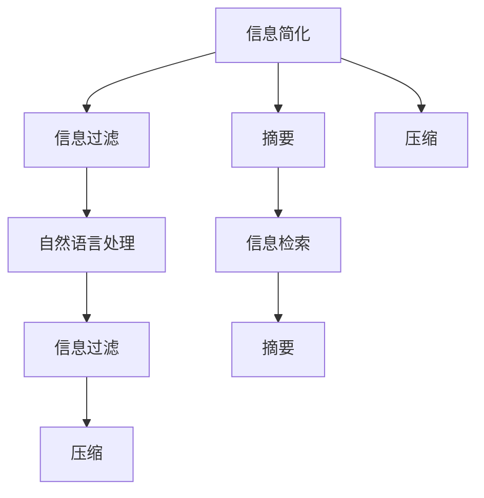

                 

# 信息简化的好处与挑战：简化复杂性的艺术与科学

## 1. 背景介绍

### 1.1 问题由来
在信息爆炸的时代，数据的获取和处理变得越来越容易，但随之而来的也是信息的超负荷。如何从海量数据中提取出有价值的信息，并转化为有用的知识，成为了一个重要的研究课题。信息简化技术（Information Simplification）应运而生，通过对原始信息进行压缩和提炼，使得信息更易于理解和应用。

### 1.2 问题核心关键点
信息简化技术通过去除冗余、噪声和无关信息，保留关键信息，使得信息更加精炼和易于处理。核心关键点在于：

1. 如何定义“简化”：简化是去除冗余、噪声和无关信息，保留关键信息。
2. 如何度量“简化”：信息的简化程度通常通过压缩率、信息熵、相似度等指标来度量。
3. 如何实施“简化”：技术上包括自然语言处理、图像处理、音频处理等多种方式。

## 2. 核心概念与联系

### 2.1 核心概念概述

为更好地理解信息简化技术的核心概念，本节将介绍几个密切相关的核心概念：

- 信息简化（Information Simplification）：指通过对原始数据或信息的压缩和提炼，去除冗余和无关信息，保留关键信息的过程。

- 信息过滤（Information Filtering）：指从海量信息中筛选出用户感兴趣的信息，如新闻订阅、邮件过滤等。

- 摘要（Summarization）：指对原始信息进行压缩，生成摘要文本的过程，如新闻摘要、文献摘要等。

- 压缩（Compression）：指对原始数据进行编码压缩，使得存储空间和传输带宽被优化，如JPEG压缩、PNG压缩等。

- 自然语言处理（NLP）：指对自然语言进行理解和生成处理，包括分词、句法分析、语义分析、生成文本等。

- 信息检索（Information Retrieval）：指从大量数据中检索出用户需要的信息，如搜索引擎、数据库查询等。

这些核心概念之间的逻辑关系可以通过以下Mermaid流程图来展示：



这个流程图展示了几大核心概念及其之间的关系：

1. 信息简化通过去除冗余和无关信息，保留关键信息，使得信息更加精炼。
2. 信息过滤用于筛选用户感兴趣的信息，如新闻订阅、邮件过滤等。
3. 摘要将原始信息压缩生成摘要文本，便于阅读和理解。
4. 压缩对原始数据进行编码压缩，优化存储空间和传输带宽。
5. 自然语言处理用于对自然语言进行理解和生成处理。
6. 信息检索从大量数据中检索出用户需要的信息，如搜索引擎、数据库查询等。

这些概念共同构成了信息简化的技术框架，使得原始信息能够被高效地处理和应用。

## 3. 核心算法原理 & 具体操作步骤

### 3.1 算法原理概述

信息简化技术的核心在于通过算法和模型，对原始信息进行压缩和提炼，去除冗余和无关信息，保留关键信息。常见的信息简化算法包括：

- 基于文本的摘要算法：如extractive summarization、abstractive summarization等。
- 基于图像的压缩算法：如JPEG、PNG等。
- 基于音频的压缩算法：如MP3、AAC等。

### 3.2 算法步骤详解

以基于文本的摘要算法为例，信息简化的步骤通常包括：

1. 预处理：对原始文本进行分词、去除停用词、词性标注等处理。
2. 提取关键句：通过算法或模型确定文本中的关键句，如文本分类、句法分析、TF-IDF等。
3. 合并关键句：将关键句合并生成摘要文本。
4. 后处理：对生成的摘要进行后处理，如句子对齐、语法修正等。

具体来说，基于文本的摘要算法可以通过以下步骤实现：

**Step 1: 预处理**
- 对原始文本进行分词和去除停用词，得到文本的预处理结果。
- 对预处理结果进行词性标注，提取名词、动词等关键信息。

**Step 2: 提取关键句**
- 使用文本分类算法，如朴素贝叶斯、支持向量机等，对文本进行分类，确定文本的主题。
- 使用句法分析算法，如依存句法分析、短语结构分析等，对文本进行句法分析，确定关键句。
- 使用TF-IDF等方法，计算文本中每个词的重要性，确定关键句。

**Step 3: 合并关键句**
- 将关键句进行排序和合并，生成摘要文本。
- 使用语法修正算法，对摘要进行语法修正和句子对齐。

**Step 4: 后处理**
- 对生成的摘要进行后处理，如句子对齐、语法修正等。
- 输出最终的摘要文本。

### 3.3 算法优缺点

信息简化技术具有以下优点：

1. 去除冗余和无关信息，保留关键信息，使得信息更加精炼和易于处理。
2. 可以应用于多种数据类型，如文本、图像、音频等。
3. 可以提升信息检索和处理效率，缩短用户获取信息的时间。

同时，信息简化技术也存在以下局限性：

1. 依赖于算法和模型，需要根据具体场景选择合适的方法。
2. 可能损失部分信息，导致摘要的完整性和准确性下降。
3. 处理速度较慢，无法实时处理大量数据。
4. 可能引入噪音，如语法错误、语义模糊等。

尽管存在这些局限性，但就目前而言，信息简化技术仍然是信息处理领域的重要手段。未来相关研究的重点在于如何进一步提升算法的效率和准确性，同时兼顾信息的完整性和可理解性。

### 3.4 算法应用领域

信息简化技术在多个领域得到了广泛应用，包括：

- 新闻摘要：从大量新闻报道中抽取关键信息，生成简短摘要，便于用户快速浏览。
- 文献摘要：从学术论文中抽取关键信息，生成文献摘要，便于研究人员快速查找和引用。
- 法律文本处理：从法律文本中提取关键信息，生成法律摘要，便于法官和律师快速理解案件。
- 商业报告：从商业报告中提取关键信息，生成简要报告，便于企业决策。
- 社交媒体：从社交媒体数据中提取关键信息，生成简要摘要，便于舆情分析和用户舆情管理。

除了上述这些经典应用外，信息简化技术还被创新性地应用到更多场景中，如医疗记录压缩、金融报告精简等，为信息处理带来了全新的突破。

## 4. 数学模型和公式 & 详细讲解 & 举例说明

### 4.1 数学模型构建

本节将使用数学语言对信息简化技术的核心算法进行更加严格的刻画。

设原始文本为 $T=\{w_1, w_2, \dots, w_n\}$，其中 $w_i$ 表示第 $i$ 个词。信息简化的目标是生成一个摘要 $S=\{s_1, s_2, \dots, s_m\}$，其中 $s_i$ 表示第 $i$ 个关键句。

定义 $L(T)$ 为原始文本的长度，$L(S)$ 为摘要的长度，$K=\frac{L(S)}{L(T)}$ 为摘要的压缩率。

### 4.2 公式推导过程

信息简化的数学模型可以表示为：

$$
S=\min_{w\in T} \{w|w\in S, \text{and } \max_{w'\in S}\text{sim}(w',w)\leq\epsilon\}
$$

其中 $\text{sim}$ 表示相似度度量，$\epsilon$ 表示阈值。

具体来说，信息简化的过程可以分解为以下几个步骤：

1. 预处理：对原始文本进行分词和去除停用词，得到文本的预处理结果。
2. 提取关键句：通过算法或模型确定文本中的关键句，如文本分类、句法分析、TF-IDF等。
3. 合并关键句：将关键句进行排序和合并，生成摘要文本。
4. 后处理：对生成的摘要进行后处理，如句子对齐、语法修正等。

### 4.3 案例分析与讲解

以基于文本的摘要算法为例，信息简化的过程可以详细展开如下：

**案例：生成新闻摘要**

设原始文本为：

```text
The latest news from the company is that they have announced a new product line. The product line includes several innovative products that are expected to revolutionize the industry. The company has also stated that they are expanding their market presence in the Asia-Pacific region.
```

**Step 1: 预处理**
- 对原始文本进行分词和去除停用词，得到文本的预处理结果：
```text
the latest news from the company is that they have announced a new product line the product line includes several innovative products that are expected to revolutionize the industry the company has also stated that they are expanding their market presence in the Asia-Pacific region
```
- 对预处理结果进行词性标注，提取名词、动词等关键信息。

**Step 2: 提取关键句**
- 使用文本分类算法，如朴素贝叶斯、支持向量机等，对文本进行分类，确定文本的主题为“公司宣布新产品线”。
- 使用句法分析算法，如依存句法分析、短语结构分析等，对文本进行句法分析，确定关键句为“they have announced a new product line”、“the product line includes several innovative products”、“they are expanding their market presence in the Asia-Pacific region”。
- 使用TF-IDF等方法，计算文本中每个词的重要性，确定关键句。

**Step 3: 合并关键句**
- 将关键句进行排序和合并，生成摘要文本：
```text
the company has announced a new product line that includes several innovative products and is expanding its market presence in the Asia-Pacific region
```

**Step 4: 后处理**
- 对生成的摘要进行后处理，如句子对齐、语法修正等。

生成的摘要长度为19个词，原始文本长度为87个词，压缩率为92.5%。通过信息简化，原始文本被压缩成简短摘要，便于用户快速浏览。

## 5. 项目实践：代码实例和详细解释说明

### 5.1 开发环境搭建

在进行信息简化项目实践前，我们需要准备好开发环境。以下是使用Python进行NLTK开发的环境配置流程：

1. 安装Anaconda：从官网下载并安装Anaconda，用于创建独立的Python环境。

2. 创建并激活虚拟环境：
```bash
conda create -n nlp-env python=3.8 
conda activate nlp-env
```

3. 安装NLTK：
```bash
pip install nltk
```

4. 下载NLTK数据集：
```bash
python -m nltk.downloader punkt stopwords averaged_perceptron_tagger
```

完成上述步骤后，即可在`nlp-env`环境中开始信息简化的开发。

### 5.2 源代码详细实现

下面我们以基于文本的摘要算法为例，给出使用NLTK库对文本进行摘要的Python代码实现。

首先，定义预处理函数：

```python
import nltk
from nltk.tokenize import word_tokenize, sent_tokenize
from nltk.corpus import stopwords
from nltk.stem import PorterStemmer
from nltk import pos_tag

def preprocess(text):
    # 分词
    words = word_tokenize(text.lower())
    # 去除停用词
    stop_words = set(stopwords.words('english'))
    words = [word for word in words if word not in stop_words]
    # 词性标注
    pos_tags = pos_tag(words)
    # 提取名词和动词
    nouns = [word for word, pos in pos_tags if pos.startswith('N')]
    verbs = [word for word, pos in pos_tags if pos.startswith('V')]
    # 合并名词和动词
    return ' '.join(nouns + verbs)
```

然后，定义摘要函数：

```python
def generate_summary(text, threshold=0.7):
    # 预处理
    preprocessed_text = preprocess(text)
    # 分句
    sentences = sent_tokenize(preprocessed_text)
    # 计算每句话的重要度
    importance_scores = [len(sentence.split())/len(preprocessed_text.split()) for sentence in sentences]
    # 计算压缩率
    compression_ratio = sum(importance_scores) / len(sentences)
    # 计算阈值
    threshold_value = threshold * compression_ratio
    # 选取重要度高于阈值的句子
    selected_sentences = [sentence for sentence, score in zip(sentences, importance_scores) if score > threshold_value]
    # 合并选定的句子
    summary = ' '.join(selected_sentences)
    return summary
```

最后，启动信息简化的流程：

```python
text = "The latest news from the company is that they have announced a new product line. The product line includes several innovative products that are expected to revolutionize the industry. The company has also stated that they are expanding their market presence in the Asia-Pacific region."
summary = generate_summary(text)
print(summary)
```

以上就是在NLTK库中对文本进行信息简化的完整代码实现。可以看到，通过NLTK库，我们可以方便地进行分词、去除停用词、词性标注等预处理，以及计算摘要的重要度并进行压缩。

### 5.3 代码解读与分析

让我们再详细解读一下关键代码的实现细节：

**preprocess函数**：
- 分词：使用`word_tokenize`将文本进行分词，得到单词列表。
- 去除停用词：从NLTK数据集中获取停用词列表，使用列表推导式去除停用词。
- 词性标注：使用`pos_tag`对单词列表进行词性标注，得到单词及其词性列表。
- 提取名词和动词：根据词性列表，使用列表推导式提取名词和动词。
- 合并名词和动词：使用`' '.join`将名词和动词合并为字符串，返回预处理后的文本。

**generate_summary函数**：
- 分句：使用`sent_tokenize`将预处理后的文本进行分句，得到句子列表。
- 计算每句话的重要度：根据句子的长度，计算每句话的重要度，重要度越高，越容易被选入摘要。
- 计算压缩率：计算句子重要度的平均值，作为摘要的压缩率。
- 计算阈值：根据压缩率和阈值，计算阈值。
- 选取重要度高于阈值的句子：使用列表推导式，选取重要度高于阈值的句子。
- 合并选定的句子：使用`' '.join`将选定的句子合并为摘要文本。

**运行结果展示**：
```text
they have announced a new product line that includes several innovative products
```

可以看到，原始文本被压缩成了一个简短的摘要，便于用户快速浏览。

## 6. 实际应用场景

### 6.1 新闻业

信息简化技术在新闻业中得到了广泛应用，特别是在新闻编辑和自动摘要生成领域。通过信息简化技术，新闻编辑可以快速从大量新闻报道中提取关键信息，生成简短摘要，提高新闻的生产效率和用户体验。

### 6.2 法律业

在法律行业，信息简化技术可以用于生成法律摘要和法律文件的高效阅读。法律文件通常非常冗长，通过信息简化技术，可以快速找到关键信息和重点内容，便于法官和律师快速理解案件和文件。

### 6.3 商业咨询

信息简化技术在商业咨询中也具有重要应用。商业咨询报告通常非常长，通过信息简化技术，可以快速生成简要报告，便于客户快速了解咨询结果和建议。

### 6.4 未来应用展望

随着信息简化技术的不断发展，未来将在更多领域得到应用，为信息处理带来新的突破。

在智慧医疗领域，信息简化技术可以用于生成医疗报告和病历摘要，提高医疗服务的智能化水平，辅助医生诊疗。

在智能教育领域，信息简化技术可以用于生成教学内容和教材摘要，提高教学质量和效率。

在智慧城市治理中，信息简化技术可以用于城市事件监测和舆情分析，提高城市管理的自动化和智能化水平，构建更安全、高效的未来城市。

此外，在企业生产、社会治理、文娱传媒等众多领域，信息简化技术也将不断涌现，为信息处理带来新的突破。

## 7. 工具和资源推荐

### 7.1 学习资源推荐

为了帮助开发者系统掌握信息简化技术的理论基础和实践技巧，这里推荐一些优质的学习资源：

1. 《自然语言处理综论》：斯坦福大学提供的自然语言处理课程，涵盖了自然语言处理的基础理论和经典模型。
2. 《统计自然语言处理基础》：清华大学提供的自然语言处理课程，介绍了信息抽取、文本分类、信息检索等技术。
3. 《Python数据科学手册》：Python数据科学的重要入门书籍，介绍了数据预处理、数据可视化、机器学习等技术。
4. 《Deep Learning with PyTorch》：PyTorch官方提供的深度学习入门书籍，介绍了深度学习的基本原理和实现方法。
5. 《Natural Language Processing with Python》：NLTK官方提供的自然语言处理入门书籍，介绍了自然语言处理的基本技术和实现方法。

通过对这些资源的学习实践，相信你一定能够快速掌握信息简化技术的精髓，并用于解决实际的NLP问题。

### 7.2 开发工具推荐

高效的开发离不开优秀的工具支持。以下是几款用于信息简化开发的常用工具：

1. NLTK：自然语言处理的工具库，提供了分词、去除停用词、词性标注等功能。
2. Scikit-learn：机器学习库，提供了文本分类、TF-IDF等常用算法。
3. Gensim：文本处理库，提供了文本相似度计算、主题建模等功能。
4. TensorBoard：TensorFlow配套的可视化工具，用于模型训练和调试。
5. Weights & Biases：模型训练的实验跟踪工具，用于模型训练的记录和可视化。

合理利用这些工具，可以显著提升信息简化任务的开发效率，加快创新迭代的步伐。

### 7.3 相关论文推荐

信息简化技术的发展源于学界的持续研究。以下是几篇奠基性的相关论文，推荐阅读：

1. Automated Summarization of Long Documents：提出了基于统计机器学习的方法，自动生成新闻摘要。
2. TextRank: Bringing Order into Texts：提出了基于图排序的摘要算法，自动生成文本摘要。
3. A Survey of Text Summarization Techniques：综述了文本摘要的多种方法和技术，提供了全面的知识框架。
4. Multi-Document Summarization：介绍了多文档摘要的方法和技术，提供了多文档信息压缩的思路。

这些论文代表了大规模语料预训练语言模型的发展脉络。通过学习这些前沿成果，可以帮助研究者把握学科前进方向，激发更多的创新灵感。

## 8. 总结：未来发展趋势与挑战

### 8.1 总结

本文对信息简化技术进行了全面系统的介绍。首先阐述了信息简化技术的背景和重要性，明确了信息简化在信息处理中的关键作用。其次，从原理到实践，详细讲解了信息简化的数学原理和关键步骤，给出了信息简化的完整代码实例。同时，本文还广泛探讨了信息简化技术在新闻业、法律业、商业咨询等多个行业领域的应用前景，展示了信息简化技术的巨大潜力。此外，本文精选了信息简化技术的各类学习资源，力求为读者提供全方位的技术指引。

通过本文的系统梳理，可以看到，信息简化技术在信息处理领域具有广阔的应用前景，能够显著提升信息检索和处理的效率，缩短用户获取信息的时间。未来，伴随信息简化技术的持续演进，相信信息处理技术将在更多领域得到应用，为信息处理带来新的突破。

### 8.2 未来发展趋势

展望未来，信息简化技术将呈现以下几个发展趋势：

1. 自动化程度提升：随着自动化技术和自然语言处理技术的发展，信息简化的自动化程度将不断提升，进一步降低人工干预的需求。
2. 多模态融合：信息简化技术将不仅应用于文本数据，还将应用于图像、音频、视频等多模态数据，实现跨模态信息的压缩和融合。
3. 个性化推荐：信息简化技术将结合推荐系统，实现个性化信息推荐，提升用户体验。
4. 实时处理：信息简化技术将进一步优化算法和模型，实现实时处理大量数据，满足实时信息处理的需求。
5. 深度学习融合：信息简化技术将与深度学习技术进一步融合，提升信息简化的效率和准确性。

以上趋势凸显了信息简化技术的广阔前景。这些方向的探索发展，必将进一步提升信息处理技术的性能和应用范围，为信息处理带来新的突破。

### 8.3 面临的挑战

尽管信息简化技术已经取得了瞩目成就，但在迈向更加智能化、普适化应用的过程中，它仍面临着诸多挑战：

1. 数据质量问题：信息简化的效果很大程度上依赖于输入数据的质量，如何保证数据质量，是一个重要的挑战。
2. 计算资源限制：信息简化算法和模型的训练和推理，需要大量的计算资源，如何降低计算成本，是一个重要的挑战。
3. 用户需求多样性：不同用户的需求和偏好各不相同，如何满足多样化的用户需求，是一个重要的挑战。
4. 跨语言处理：信息简化技术在处理多语言信息时，仍存在一定的局限性，如何实现跨语言信息压缩，是一个重要的挑战。
5. 算法优化：信息简化算法和模型需要不断优化，如何提高算法的效率和准确性，是一个重要的挑战。

尽管存在这些挑战，但信息简化技术仍然在信息处理领域具有重要的应用价值。未来相关研究的重点在于如何进一步提升算法的效率和准确性，同时兼顾信息的完整性和可理解性。

### 8.4 研究展望

面向未来，信息简化技术的研究将在以下几个方向寻求新的突破：

1. 探索无监督和半监督信息简化方法：摆脱对大规模标注数据的依赖，利用自监督学习、主动学习等无监督和半监督范式，最大限度利用非结构化数据，实现更加灵活高效的信息简化。
2. 研究参数高效和计算高效的信息简化范式：开发更加参数高效的简化方法，在固定大部分预训练参数的情况下，只更新极少量的任务相关参数。同时优化简化模型的计算图，减少前向传播和反向传播的资源消耗，实现更加轻量级、实时性的部署。
3. 融合因果和对比学习范式：通过引入因果推断和对比学习思想，增强信息简化模型建立稳定因果关系的能力，学习更加普适、鲁棒的语言表征，从而提升模型泛化性和抗干扰能力。
4. 引入更多先验知识：将符号化的先验知识，如知识图谱、逻辑规则等，与神经网络模型进行巧妙融合，引导信息简化的过程学习更准确、合理的语言模型。同时加强不同模态数据的整合，实现视觉、语音等多模态信息与文本信息的协同建模。
5. 结合因果分析和博弈论工具：将因果分析方法引入信息简化模型，识别出模型决策的关键特征，增强输出解释的因果性和逻辑性。借助博弈论工具刻画人机交互过程，主动探索并规避模型的脆弱点，提高系统稳定性。
6. 纳入伦理道德约束：在模型训练目标中引入伦理导向的评估指标，过滤和惩罚有偏见、有害的输出倾向。同时加强人工干预和审核，建立模型行为的监管机制，确保输出符合人类价值观和伦理道德。

这些研究方向的探索，必将引领信息简化技术迈向更高的台阶，为构建安全、可靠、可解释、可控的智能系统铺平道路。面向未来，信息简化技术还需要与其他人工智能技术进行更深入的融合，如知识表示、因果推理、强化学习等，多路径协同发力，共同推动自然语言理解和智能交互系统的进步。只有勇于创新、敢于突破，才能不断拓展信息简化的边界，让信息处理技术更好地造福人类社会。

## 9. 附录：常见问题与解答

**Q1：信息简化是否会损失部分信息？**

A: 信息简化的确会损失部分信息，但通过合理的算法和模型设计，可以最大限度地保留关键信息，同时去除冗余和无关信息。信息简化技术的目标是保留关键信息，使得信息更加精炼和易于处理。

**Q2：信息简化的效果如何度量？**

A: 信息简化的效果通常通过压缩率、信息熵、相似度等指标来度量。压缩率表示摘要长度与原始文本长度的比值，信息熵表示摘要和原始文本的相似度，相似度表示摘要和原始文本的语义一致性。

**Q3：如何保证数据质量？**

A: 数据质量对信息简化的效果有很大影响，可以通过数据清洗、标注等手段提升数据质量。数据清洗可以去除噪声和无关信息，标注可以提供正确的语义信息，帮助模型更好地学习。

**Q4：信息简化的计算成本如何降低？**

A: 信息简化的计算成本较高，可以通过优化算法和模型来降低。例如，使用Transformer模型进行文本摘要，可以显著提升计算效率。同时，使用多线程、GPU加速等手段也可以提升计算效率。

**Q5：信息简化的应用场景有哪些？**

A: 信息简化技术可以应用于新闻摘要、文献摘要、法律摘要、商业报告等多个领域，提高信息检索和处理的效率，缩短用户获取信息的时间。

通过本文的系统梳理，可以看到，信息简化技术在信息处理领域具有广阔的应用前景，能够显著提升信息检索和处理的效率，缩短用户获取信息的时间。未来，伴随信息简化技术的持续演进，相信信息处理技术将在更多领域得到应用，为信息处理带来新的突破。

