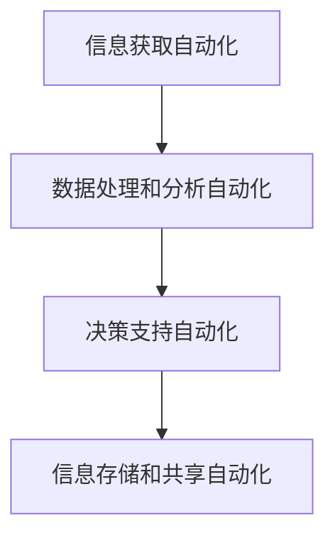

                 

# 信息简化的工具和自动化技术：利用技术简化你的生活和工作

## 1. 背景介绍

### 1.1 问题由来
在现代社会的快节奏生活中，信息爆炸和信息过载已经成为了许多人面临的共同问题。无论是工作还是学习，人们都面临着海量信息的筛选和处理任务，这不仅耗费了大量的时间和精力，也使得决策和判断变得更加复杂。如何高效地获取和利用信息，简化工作流程，提高工作效率，成为了人们普遍关心的问题。

### 1.2 问题核心关键点
信息简化和自动化技术的应用，能够显著提高信息处理和决策的效率，减少人工干预，从而提升整体工作和生活质量。

**核心关键点包括：**
- 信息获取自动化
- 数据处理和分析自动化
- 决策支持自动化
- 信息存储和共享自动化

## 2. 核心概念与联系

### 2.1 核心概念概述

为更好地理解信息简化和自动化技术的应用，本节将介绍几个密切相关的核心概念：

- **信息获取自动化**：通过互联网技术、物联网技术等手段，自动获取和收集各类信息，减少人工干预。
- **数据处理和分析自动化**：利用大数据技术和人工智能算法，对收集的信息进行高效处理和分析，提取有价值的数据。
- **决策支持自动化**：使用智能决策系统和知识管理系统，基于数据和经验进行决策和判断，辅助决策过程。
- **信息存储和共享自动化**：通过云存储和云计算技术，实现信息的便捷存储和高效共享。

这些核心概念之间具有紧密的联系，共同构成了一个高效、智能的信息处理系统。

### 2.2 核心概念原理和架构的 Mermaid 流程图(Mermaid 流程节点中不要有括号、逗号等特殊字符)



这个流程图展示了信息简化和自动化技术的主要流程：从信息获取到数据处理、分析，再到决策支持和信息存储、共享，形成了一个闭环的信息处理系统。

## 3. 核心算法原理 & 具体操作步骤
### 3.1 算法原理概述

信息简化和自动化技术的应用，依赖于一系列高效的算法和模型。这些算法和模型通过自动化地处理和分析信息，帮助用户快速获取所需信息，进行高效决策。

**核心算法包括：**
- 信息抽取和检索算法
- 文本分类和情感分析算法
- 机器学习和深度学习模型

### 3.2 算法步骤详解

#### 3.2.1 信息获取自动化

**步骤 1: 确定信息需求**
- 明确用户需要获取什么类型的信息，例如新闻、市场数据、客户反馈等。

**步骤 2: 信息采集**
- 使用网络爬虫、API接口等方式，自动获取相关信息。

**步骤 3: 数据清洗**
- 对采集到的数据进行预处理，去除噪声和无用信息，保证数据的准确性和完整性。

#### 3.2.2 数据处理和分析自动化

**步骤 1: 数据存储**
- 将清洗后的数据存储到数据库或数据仓库中，方便后续处理和分析。

**步骤 2: 数据预处理**
- 对存储的数据进行标准化、归一化、分词等预处理操作，提高数据质量。

**步骤 3: 数据挖掘**
- 使用机器学习和深度学习模型，对数据进行特征提取、模式识别等处理，提取有价值的信息。

**步骤 4: 数据可视化**
- 使用数据可视化工具，将处理后的数据以图表、报表等形式呈现，便于用户理解和决策。

#### 3.2.3 决策支持自动化

**步骤 1: 模型训练**
- 基于历史数据和先验知识，训练智能决策模型，如决策树、神经网络等。

**步骤 2: 模型应用**
- 在实际决策过程中，使用训练好的模型进行预测和决策，提供智能化的辅助。

#### 3.2.4 信息存储和共享自动化

**步骤 1: 数据备份**
- 定期备份数据，确保数据的安全性和完整性。

**步骤 2: 数据共享**
- 通过云存储和API接口等方式，实现数据的高效共享和访问。

### 3.3 算法优缺点

信息简化和自动化技术具有以下优点：
- 高效：自动化处理和分析数据，大大提高了信息处理的速度和效率。
- 准确：利用机器学习和深度学习算法，保证了数据处理的准确性。
- 便捷：通过智能决策系统和知识管理系统，用户可以方便地获取和利用信息。

同时，这些技术也存在一些局限性：
- 依赖数据质量：数据质量直接影响算法的准确性和效果。
- 技术门槛高：对于一些复杂的处理任务，需要专业的技术知识和经验。
- 数据隐私问题：在数据采集和存储过程中，可能存在隐私泄露和数据安全问题。

### 3.4 算法应用领域

信息简化和自动化技术在多个领域得到了广泛应用，包括但不限于：

- **金融领域**：自动获取和分析市场数据，辅助投资决策。
- **零售行业**：通过客户行为分析，提供个性化推荐和营销策略。
- **医疗健康**：自动获取和处理病历数据，辅助临床诊断和医疗决策。
- **制造业**：通过设备监控和数据分析，优化生产流程和质量控制。
- **教育领域**：自动收集和分析学生数据，提供个性化的学习建议和评估。

## 4. 数学模型和公式 & 详细讲解 & 举例说明

### 4.1 数学模型构建

**数学模型**：
假设收集到的原始数据为 $D=\{(x_i,y_i)\}_{i=1}^N$，其中 $x_i$ 为输入特征，$y_i$ 为输出标签。

**目标**：
使用机器学习算法 $M$，通过训练数据 $D$ 学习模型参数 $\theta$，使得模型在测试数据 $D_{test}$ 上的预测准确率最大化。

### 4.2 公式推导过程

**目标函数**：
$$
\min_{\theta} \frac{1}{N}\sum_{i=1}^N \ell(f_\theta(x_i),y_i)
$$

**优化算法**：
$$
\theta_{k+1} = \theta_k - \alpha_k \nabla_{\theta} \mathcal{L}(\theta_k)
$$

其中 $\ell$ 为损失函数，$\alpha_k$ 为学习率。

### 4.3 案例分析与讲解

**案例**：金融领域的数据处理和分析

**数据来源**：
- 金融市场数据：包括股票、期货、外汇等市场数据。
- 客户交易数据：包括客户开户信息、交易记录等。

**处理流程**：
1. 收集数据
2. 数据清洗和预处理
3. 特征提取
4. 模型训练
5. 模型应用

## 5. 项目实践：代码实例和详细解释说明

### 5.1 开发环境搭建

在开发信息简化和自动化技术项目之前，需要搭建好开发环境。以下是使用Python进行开发的环境配置流程：

1. 安装Python：从官网下载并安装Python，确保版本稳定。
2. 安装虚拟环境：使用 `virtualenv` 或 `conda` 创建虚拟环境，隔离开发和生产环境。
3. 安装必要包：安装常用的数据处理和分析包，如 `pandas`、`numpy`、`scikit-learn` 等。
4. 安装机器学习包：安装 `scikit-learn`、`tensorflow`、`keras` 等机器学习库。
5. 安装可视化工具：安装 `matplotlib`、`seaborn` 等数据可视化工具。

### 5.2 源代码详细实现

**示例代码**：使用 `pandas` 和 `scikit-learn` 进行数据处理和分析

```python
import pandas as pd
from sklearn.model_selection import train_test_split
from sklearn.preprocessing import StandardScaler
from sklearn.linear_model import LogisticRegression
from sklearn.metrics import accuracy_score

# 读取数据
data = pd.read_csv('data.csv')

# 数据预处理
X = data[['feature1', 'feature2', 'feature3']]  # 特征列
y = data['label']  # 标签列

# 数据分割
X_train, X_test, y_train, y_test = train_test_split(X, y, test_size=0.2, random_state=42)

# 特征标准化
scaler = StandardScaler()
X_train = scaler.fit_transform(X_train)
X_test = scaler.transform(X_test)

# 模型训练
model = LogisticRegression()
model.fit(X_train, y_train)

# 模型预测
y_pred = model.predict(X_test)

# 模型评估
acc = accuracy_score(y_test, y_pred)
print('Accuracy:', acc)
```

### 5.3 代码解读与分析

**代码详细解读**：
1. 使用 `pandas` 库读取数据文件，将数据加载为 `DataFrame` 格式。
2. 从数据中提取特征和标签，并进行数据分割。
3. 使用 `StandardScaler` 对特征进行标准化处理。
4. 使用 `LogisticRegression` 训练模型，并在测试集上进行预测。
5. 计算模型预测的准确率。

## 6. 实际应用场景

### 6.1 金融领域

**实际应用**：自动获取和分析金融市场数据，辅助投资决策

**技术实现**：
1. 使用网络爬虫自动获取金融市场数据。
2. 对数据进行清洗和预处理，提取有用的特征。
3. 使用机器学习模型进行预测和分析。
4. 将分析结果反馈给投资者，辅助决策。

### 6.2 零售行业

**实际应用**：通过客户行为分析，提供个性化推荐和营销策略

**技术实现**：
1. 收集客户交易数据和行为数据。
2. 使用数据挖掘算法提取客户特征和行为模式。
3. 使用机器学习模型进行个性化推荐。
4. 将推荐结果推送给客户，提升购买转化率。

### 6.3 医疗健康

**实际应用**：自动获取和处理病历数据，辅助临床诊断和医疗决策

**技术实现**：
1. 从医院系统自动收集病历数据。
2. 对数据进行清洗和预处理，提取有用的医学特征。
3. 使用机器学习模型进行疾病预测和诊断。
4. 将诊断结果反馈给医生，辅助医疗决策。

### 6.4 未来应用展望

未来，信息简化和自动化技术将进一步向深度学习、自然语言处理、计算机视觉等领域扩展，推动更多行业的智能化转型。

**应用前景**：
1. 物联网（IoT）：通过智能设备和传感器，实现实时数据采集和分析。
2. 自动驾驶：利用感知和决策技术，实现自动驾驶汽车。
3. 智能家居：通过智能家居设备，实现家庭自动化和个性化管理。
4. 工业互联网：通过工业大数据和智能决策，优化生产流程和质量控制。

## 7. 工具和资源推荐

### 7.1 学习资源推荐

为了帮助开发者系统掌握信息简化和自动化技术，推荐以下学习资源：

1. 《Python数据科学手册》：介绍Python在数据科学中的应用，包括数据处理、可视化等。
2. 《机器学习实战》：介绍常见的机器学习算法和实现方法，适合入门学习。
3. 《TensorFlow实战》：介绍TensorFlow的高级应用，包括深度学习模型和可视化工具。
4. Coursera《数据科学专项课程》：由知名大学提供，涵盖数据科学和机器学习的基础知识和实践技能。
5. Kaggle：数据科学和机器学习竞赛平台，提供大量真实数据集和案例分析。

### 7.2 开发工具推荐

开发信息简化和自动化技术需要依赖多种工具，以下是推荐的一些常用工具：

1. Python：数据科学和机器学习领域的主流编程语言。
2. Jupyter Notebook：交互式开发环境，适合数据处理和分析。
3. TensorFlow：谷歌推出的深度学习框架，支持大规模模型训练和部署。
4. PyTorch：Facebook推出的深度学习框架，灵活性强，适合研究和原型开发。
5. Scikit-learn：开源机器学习库，提供了丰富的算法和工具。
6. SQL：关系型数据库管理语言，适合数据存储和查询。

### 7.3 相关论文推荐

信息简化和自动化技术的发展离不开学界的持续研究，以下是几篇相关论文，推荐阅读：

1. "Big Data Mining" by Joydeep Gupta et al.（大数据挖掘）
2. "The Case for Explainable AI" by David Watson et al.（解释性AI）
3. "Machine Learning in Health Care" by Andrew Ng et al.（医疗领域的机器学习）
4. "A Survey on Big Data Analytics Techniques" by Fawaz Anssari et al.（大数据分析技术综述）
5. "Artificial Intelligence for Industrial Control" by Alexander A. Argyriou et al.（工业控制领域的AI）

## 8. 总结：未来发展趋势与挑战

### 8.1 研究成果总结

本文对信息简化和自动化技术的应用进行了全面系统的介绍，主要包括以下几个方面：

1. 信息获取自动化
2. 数据处理和分析自动化
3. 决策支持自动化
4. 信息存储和共享自动化

这些技术能够显著提高信息处理的效率和准确性，帮助用户快速获取和利用信息，辅助决策过程。

### 8.2 未来发展趋势

未来，信息简化和自动化技术将呈现以下几个发展趋势：

1. **技术融合**：信息简化和自动化技术与物联网、区块链、人工智能等技术的融合，将进一步拓展应用场景和功能。
2. **个性化服务**：利用大数据和机器学习技术，提供更加个性化和智能化的服务，提升用户体验。
3. **实时分析**：通过实时数据采集和分析，实现动态决策和调整，提高系统响应速度。
4. **模型解释性**：提升模型的解释性和透明度，增强用户对算法的信任度。

### 8.3 面临的挑战

尽管信息简化和自动化技术在多个领域得到了广泛应用，但在实际应用过程中，仍然面临一些挑战：

1. **数据隐私和安全**：在数据采集和存储过程中，如何保护用户隐私和数据安全，防止数据泄露和滥用。
2. **技术复杂性**：信息简化和自动化技术涉及多个领域和技术的结合，技术门槛较高，需要专业知识和技能。
3. **模型解释性**：许多智能算法和模型，特别是深度学习模型，难以解释其决策过程，缺乏透明性。

### 8.4 研究展望

为了应对这些挑战，未来的研究需要在以下几个方面进行突破：

1. **隐私保护技术**：开发更加安全和隐私保护的技术，确保数据的安全性和用户隐私。
2. **模型可解释性**：研究模型解释性技术，提升模型的透明度和可信度。
3. **跨领域融合**：将信息简化和自动化技术与其他技术进行融合，拓展应用范围和功能。

## 9. 附录：常见问题与解答

**Q1: 信息简化和自动化技术的主要应用场景有哪些？**

A: 信息简化和自动化技术在多个领域得到了广泛应用，包括金融、零售、医疗、制造业等。在金融领域，可以用于自动获取和分析市场数据，辅助投资决策；在零售行业，可以用于个性化推荐和营销策略；在医疗领域，可以用于自动获取和处理病历数据，辅助临床诊断和医疗决策。

**Q2: 信息简化和自动化技术的主要算法和模型有哪些？**

A: 信息简化和自动化技术主要依赖于以下算法和模型：
1. 信息抽取和检索算法
2. 文本分类和情感分析算法
3. 机器学习和深度学习模型

这些算法和模型在信息处理和自动化决策中起到了重要作用。

**Q3: 信息简化和自动化技术在实际应用中需要考虑哪些因素？**

A: 信息简化和自动化技术在实际应用中需要考虑以下因素：
1. 数据质量：数据质量直接影响算法的准确性和效果。
2. 技术门槛：对于一些复杂的处理任务，需要专业的技术知识和经验。
3. 数据隐私：在数据采集和存储过程中，可能存在隐私泄露和数据安全问题。

**Q4: 信息简化和自动化技术的未来发展趋势是什么？**

A: 信息简化和自动化技术的未来发展趋势包括技术融合、个性化服务、实时分析和模型解释性。通过技术融合，可以拓展应用场景和功能；通过个性化服务，可以提升用户体验；通过实时分析，可以动态决策和调整；通过模型解释性，可以增强用户对算法的信任度。

**Q5: 信息简化和自动化技术在实际应用中需要注意哪些问题？**

A: 信息简化和自动化技术在实际应用中需要注意以下问题：
1. 数据隐私：在数据采集和存储过程中，如何保护用户隐私和数据安全。
2. 技术复杂性：信息简化和自动化技术涉及多个领域和技术的结合，技术门槛较高。
3. 模型解释性：许多智能算法和模型，特别是深度学习模型，难以解释其决策过程，缺乏透明性。

总之，信息简化和自动化技术将在未来发挥越来越重要的作用，为各行各业带来更加智能、高效的服务和决策支持。通过不断优化技术、提高数据质量、增强模型解释性，可以更好地应对未来挑战，实现技术的可持续发展。

---

作者：禅与计算机程序设计艺术 / Zen and the Art of Computer Programming

