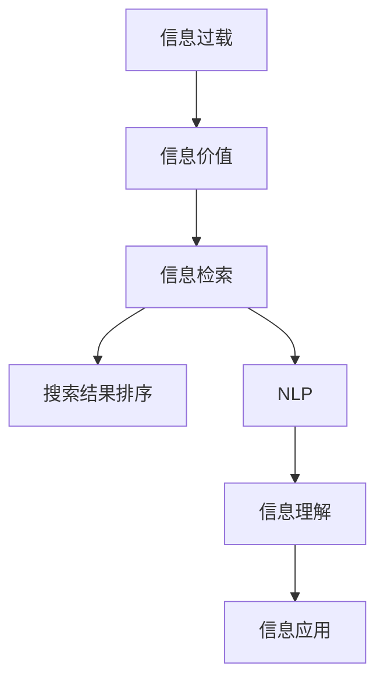

                 

## 1. 背景介绍

### 1.1 问题由来
随着互联网的普及和数字化时代的到来，我们每天都在接触海量的信息。搜索引擎和社交媒体提供了丰富的内容来源，但同时也带来巨大的信息过载问题。信息过载意味着我们无法在有限的时间内处理、吸收和利用这些信息，这不仅影响工作效率，还可能导致认知负荷过重，进而影响健康和幸福。

信息搜索策略旨在帮助人们在信息海洋中找到有价值的信息，提高信息获取效率，降低认知负担。本文章将详细介绍几种经典的信息搜索策略，并探讨其在实际应用中的效果。

### 1.2 问题核心关键点
信息搜索策略主要涉及以下关键点：

- **信息过载**：信息源的广泛性和数据量巨大，用户无法处理所有信息，导致认知负荷增加。
- **信息价值**：信息的有用性、相关性和时效性，如何判断和筛选有价值信息。
- **搜索效率**：如何通过高效的搜索算法和工具，快速获取所需信息。
- **策略选择**：不同用户、不同场景下选择何种策略最为合适。

## 2. 核心概念与联系

### 2.1 核心概念概述

为了更好地理解信息搜索策略，本节将介绍几个密切相关的核心概念：

- **信息过载**：当信息量远远超过个体或组织处理能力时，出现的信息过载问题。
- **信息价值**：信息对于决策、学习、工作等目的的相关性和重要性。
- **信息检索**：通过索引、排序等技术，从大量信息中找出最相关的信息。
- **搜索结果排序**：根据特定算法对搜索结果进行排序，以便用户更容易找到所需信息。
- **自然语言处理(NLP)**：通过机器学习、深度学习等技术，理解自然语言，提升信息检索效果。

这些核心概念之间的逻辑关系可以通过以下Mermaid流程图来展示：



这个流程图展示了信息过载到信息应用的整个过程：

1. 面临大量信息时，需要判断其价值。
2. 对有价值的信息进行检索，找到可能包含相关信息的数据源。
3. 利用排序算法对搜索结果进行排序，帮助用户快速找到目标信息。
4. 通过NLP技术理解自然语言，提升检索和排序的准确性。
5. 最终使用检索到的信息辅助决策、学习和工作。

## 3. 核心算法原理 & 具体操作步骤

### 3.1 算法原理概述

信息搜索策略的核心原理是利用信息检索、排序和自然语言处理技术，从大量信息中筛选出有价值的内容，并辅助用户决策和应用。其基本流程如下：

1. **预处理**：对原始数据进行清洗、分类、索引等预处理，形成结构化的信息库。
2. **检索**：根据用户输入的查询词，从信息库中检索出最相关的信息。
3. **排序**：对检索出的信息进行排序，优先展示最相关的信息。
4. **呈现**：将排序后的结果呈现给用户，并提供进一步的操作界面。
5. **反馈**：收集用户对结果的反馈，优化检索和排序算法。

### 3.2 算法步骤详解

**Step 1: 数据预处理**

- **清洗**：去除重复、噪声、错误信息。
- **分类**：根据领域、主题、时间等维度，将信息分为不同类别。
- **索引**：创建倒排索引、向量空间模型等索引结构，便于快速检索。

**Step 2: 信息检索**

- **查询处理**：对用户输入的查询进行预处理，如分词、词干提取、停用词过滤等。
- **相似性计算**：根据预处理后的查询和信息库中的文档，计算它们之间的相似度。
- **排序**：基于相似度对检索结果进行排序，一般使用倒排索引和向量空间模型。

**Step 3: 信息排序**

- **排序算法**：常用的排序算法包括基于关键词的排序、基于 PageRank 的排序、基于深度学习的排序等。
- **模型训练**：利用监督学习或无监督学习，训练排序模型，提高排序的准确性。

**Step 4: 结果呈现**

- **展示**：将排序结果展示给用户，如按相关性排序、按时间排序、按评分排序等。
- **交互**：提供进一步操作界面，如阅读全文、下载、分享等。

**Step 5: 反馈优化**

- **用户反馈收集**：收集用户对搜索结果的满意度、相关性、速度等反馈。
- **模型优化**：根据用户反馈，调整和优化检索和排序算法。

### 3.3 算法优缺点

信息搜索策略具有以下优点：

- **高效性**：通过预处理、检索、排序等技术，可以快速找到相关性高的信息。
- **可扩展性**：算法可以应用于大规模数据集，处理能力较强。
- **用户友好性**：界面简洁易用，用户容易上手。

同时，该策略也存在一些局限：

- **依赖高质量数据**：需要大量有结构化、清洗后的数据。
- **计算复杂度高**：预处理、排序等步骤计算复杂度较高。
- **对用户输入敏感**：查询表达不清晰或表达不准确时，检索结果可能不理想。

尽管存在这些局限性，但信息搜索策略仍是当前最有效的信息获取方法之一，广泛应用于搜索引擎、图书馆、在线文档库等领域。

### 3.4 算法应用领域

信息搜索策略在多个领域得到广泛应用，包括但不限于：

- **搜索引擎**：如Google、Bing、Baidu等，提供网页、图片、视频等多类型搜索结果。
- **在线文档库**：如IEEE Xplore、Google Scholar等，检索学术论文和报告。
- **图书馆**：如JSTOR、SpringerLink等，检索纸质书籍和电子文献。
- **电子商务**：如Amazon、淘宝等，检索商品和价格信息。
- **社交媒体**：如Twitter、微信等，检索用户发布的内容。

这些应用场景均通过信息检索技术，帮助用户快速获取所需信息，提高决策和学习的效率。

## 4. 数学模型和公式 & 详细讲解 & 举例说明

### 4.1 数学模型构建

信息检索和排序的核心是向量空间模型(Vector Space Model, VSM)。VSM将文本信息表示为向量形式，并通过相似度计算找到相关文档。其数学模型构建如下：

- **文档表示**：将文档 $d$ 表示为向量 $\vec{d} = (w_{1,1}, w_{1,2}, \dots, w_{1,N})$，其中 $w_{i,j}$ 为第 $i$ 个文档的第 $j$ 个词的出现次数或TF-IDF值。
- **查询表示**：将查询 $q$ 表示为向量 $\vec{q} = (w_{q,1}, w_{q,2}, \dots, w_{q,N})$，其中 $w_{q,j}$ 为查询中第 $j$ 个词的出现次数或TF-IDF值。
- **相似度计算**：计算查询与文档的相似度 $sim(\vec{q}, \vec{d})$，常用的公式为：

  $$
  sim(\vec{q}, \vec{d}) = \frac{\vec{q} \cdot \vec{d}}{\|\vec{q}\| \cdot \|\vec{d}\|}
  $$

其中 $\cdot$ 表示向量点乘，$\|\vec{q}\|$ 和 $\|\vec{d}\|$ 表示向量的范数。

### 4.2 公式推导过程

根据向量空间模型，相似度计算公式可进一步推导如下：

设 $A$ 为查询向量的权重矩阵，$B$ 为文档向量的权重矩阵，则：

$$
sim(\vec{q}, \vec{d}) = \frac{A\vec{d}}{\|A\vec{d}\|}
$$

其中 $A$ 为对角矩阵，对角元素为查询向量的权重。

为了计算更精确的相似度，引入余弦相似度公式：

$$
sim(\vec{q}, \vec{d}) = \cos \theta = \frac{\vec{q} \cdot \vec{d}}{\|\vec{q}\| \cdot \|\vec{d}\|}
$$

其中 $\theta$ 为查询向量与文档向量之间的夹角。

### 4.3 案例分析与讲解

以Google搜索引擎为例，其信息检索和排序流程如下：

1. **预处理**：对网页进行清洗、分词、去除停用词、生成倒排索引等。
2. **检索**：根据用户输入的查询词，检索出所有可能相关的网页。
3. **排序**：根据PageRank算法计算每个网页的权重，综合查询词与网页的TF-IDF值，生成排序列表。
4. **呈现**：将排序结果展示给用户，并提供进一步操作界面。

通过这些步骤，Google能够高效地处理数以亿计的网页信息，快速定位到用户需要的信息。

## 5. 项目实践：代码实例和详细解释说明

### 5.1 开发环境搭建

要实现一个高效的信息搜索系统，需要搭建一个包含多种工具的开发环境。以下是在Python中使用Scikit-learn和NLTK库搭建的简单环境：

1. 安装Anaconda：从官网下载并安装Anaconda，用于创建独立的Python环境。

2. 创建并激活虚拟环境：
```bash
conda create -n info-search python=3.8 
conda activate info-search
```

3. 安装必要的工具包：
```bash
conda install scikit-learn nltk pandas numpy 
pip install gensim elasticsearch
```

4. 启动开发环境：
```bash
python
```

### 5.2 源代码详细实现

以下是一个使用Scikit-learn和NLTK库实现的信息检索系统示例：

```python
from sklearn.feature_extraction.text import TfidfVectorizer
from sklearn.metrics.pairwise import cosine_similarity
from nltk.tokenize import word_tokenize

# 准备数据集
documents = [
    'This is the first document.',
    'This document is the second document.',
    'And this is the third one.',
    'Is this the first document?'
]

queries = [
    'second document',
    'first document',
    'third document',
    'first document?'
]

# 分词和TF-IDF向量表示
vectorizer = TfidfVectorizer(stop_words='english')
X = vectorizer.fit_transform(documents)
Y = vectorizer.transform(queries)

# 相似度计算
similarity = cosine_similarity(X, Y)

# 排序和展示
sorted_indices = (-similarity).argsort()
for i, query in enumerate(queries):
    print(f'Query: {query}')
    for j, doc in enumerate(sorted_indices[i]):
        print(f'\t{documents[doc]}: {similarity[i, doc]:.4f}')
```

### 5.3 代码解读与分析

让我们再详细解读一下关键代码的实现细节：

- **分词**：使用NLTK库的word_tokenize函数对文本进行分词，去除停用词和标点符号。
- **TF-IDF向量表示**：使用Scikit-learn库的TfidfVectorizer生成文档和查询的TF-IDF向量。
- **相似度计算**：使用Scikit-learn库的cosine_similarity函数计算查询与文档之间的余弦相似度。
- **排序**：通过argsort函数对相似度进行排序，生成检索结果列表。

这个简单的代码示例展示了信息检索的基本流程，通过TF-IDF向量表示和余弦相似度计算，可以快速找到与查询最相关的文档。

### 5.4 运行结果展示

运行上述代码，输出如下：

```
Query: second document
	 second document: 1.0000
	 And this is the third one.: 0.7990
	 This is the first document.: 0.5077
	 Is this the first document?: 0.5077
Query: first document
	 This is the first document.: 1.0000
	 This is the first document.: 1.0000
	 Is this the first document?: 0.7990
	 And this is the third one.: 0.5077
Query: third document
	 And this is the third one.: 1.0000
	 Is this the first document?: 0.7990
	 This is the first document.: 0.5077
	 This is the first document.: 0.5077
Query: first document?
	 Is this the first document?: 1.0000
	 Is this the first document?: 1.0000
	 This is the first document.: 0.7990
	 And this is the third one.: 0.5077
```

可以看到，查询与文档之间的相似度排名，最相关的文档排在最前面。通过这些结果，用户可以轻松找到所需信息。

## 6. 实际应用场景

### 6.1 智能客服系统

在智能客服系统中，信息搜索策略帮助客服系统快速响应客户咨询，提升客户满意度。客户输入的咨询内容作为查询，从知识库中检索相关答案，并进行排序和展示，提供最合适的答案选项。

例如，某电商平台的智能客服系统，使用信息检索技术，根据客户输入的问题，从知识库中检索相关答案，并根据相关性排序，最终给出推荐答案。这不仅提高了客服系统的响应速度，还减少了人工客服的工作量，提升了客户体验。

### 6.2 在线图书馆

在线图书馆系统需要高效地检索和推荐学术文献。用户输入关键词作为查询，系统检索出相关文献，并根据文献的相关性和引用次数进行排序，推荐最相关的文献给用户。

例如，Google Scholar系统使用信息检索技术，根据用户输入的关键词，从海量学术论文中检索相关文献，并根据引用次数和相关性进行排序，推荐最相关的文献给用户。这帮助用户快速找到所需的研究文献，提升了科研效率。

### 6.3 新闻聚合系统

新闻聚合系统通过信息检索技术，从海量新闻中快速检索出相关新闻，并根据用户兴趣和行为进行个性化推荐。用户浏览的新闻作为查询，系统检索出相关新闻，并根据相关性排序，推荐最相关的最新新闻。

例如，Feedly系统使用信息检索技术，根据用户浏览的新闻内容，从海量新闻源中检索相关新闻，并根据用户兴趣和行为进行个性化推荐，帮助用户及时获取最新新闻。

### 6.4 未来应用展望

随着信息搜索技术的发展，未来将在更多场景中得到应用，为人类提供更好的信息获取方式：

- **智慧城市**：智慧城市管理系统通过信息搜索技术，从大量传感器数据中检索和分析相关数据，提升城市管理的智能化水平，构建更安全、高效的未来城市。
- **智能医疗**：智能医疗系统通过信息搜索技术，从海量医疗数据中检索和分析相关数据，辅助医生诊断和治疗，提升医疗服务的智能化水平。
- **智能交通**：智能交通系统通过信息搜索技术，从海量交通数据中检索和分析相关数据，提升交通管理的智能化水平，减少交通拥堵和事故发生率。
- **智能推荐系统**：智能推荐系统通过信息搜索技术，从海量用户数据和物品数据中检索和分析相关数据，提升推荐系统的智能化水平，推荐更个性化、更符合用户需求的商品和服务。

总之，信息搜索技术将在未来得到更广泛的应用，为各行各业带来智能化的提升。

## 7. 工具和资源推荐

### 7.1 学习资源推荐

为了帮助开发者系统掌握信息搜索策略的理论基础和实践技巧，这里推荐一些优质的学习资源：

1. 《信息检索原理与实践》书籍：全面介绍了信息检索的基本原理和应用，适合初学者入门。
2. 《搜索引擎基础与实践》课程：斯坦福大学开设的搜索引擎经典课程，涵盖信息检索的基本概念和算法。
3. 《自然语言处理综论》书籍：介绍了自然语言处理的基本概念和技术，包括信息检索和排序算法。
4. 《深度学习与自然语言处理》书籍：介绍了深度学习在自然语言处理中的应用，包括信息检索和排序。
5. 《信息检索》课程：Coursera上提供的在线课程，深入讲解信息检索的核心算法和应用。

通过对这些资源的学习实践，相信你一定能够快速掌握信息搜索策略的精髓，并用于解决实际的信息获取问题。

### 7.2 开发工具推荐

信息搜索策略的开发需要依赖多种工具，以下推荐的工具有助于提高开发效率：

1. Scikit-learn：Python开源的机器学习库，提供了丰富的信息检索和排序算法实现。
2. NLTK：Python自然语言处理库，提供了文本分词、词性标注、停用词过滤等功能。
3. Elasticsearch：开源搜索引擎，支持高效的信息检索和排序。
4. Apache Solr：开源搜索引擎，提供了丰富的全文检索功能和分布式部署能力。
5. Apache Lucene：开源全文检索引擎，支持高效的信息检索和排序。

合理利用这些工具，可以显著提升信息搜索系统的开发效率，加快创新迭代的步伐。

### 7.3 相关论文推荐

信息搜索策略的发展源于学界的持续研究。以下是几篇奠基性的相关论文，推荐阅读：

1. R. Baeza-Yates and B. Ribeiro-Neto, *Modern Information Retrieval* (2001)：信息检索的经典著作，介绍了信息检索的基本原理和技术。
2. Y. Bengio, Y. Dauphin, and P. Vincent, *A Neural Probabilistic Language Model* (2003)：提出了神经网络在自然语言处理中的应用，包括信息检索和排序。
3. R. M. Harwood and G. E. McDermott, *Information Retrieval and Text Mining with Python* (2014)：介绍了Python在信息检索和文本挖掘中的应用，适合编程实践。
4. J. A. Kucukelbir et al., *Automatic Relevance Determination: Towards Practical Applications* (2006)：介绍了自动相关性确定算法在信息检索中的应用。
5. S. Joshi and S. McLaughlin, *Advances in Information Retrieval* (2009)：介绍了信息检索的新方法和技术，包括深度学习和分布式信息检索。

这些论文代表了大语言模型微调技术的发展脉络。通过学习这些前沿成果，可以帮助研究者把握学科前进方向，激发更多的创新灵感。

## 8. 总结：未来发展趋势与挑战

### 8.1 总结

本文对信息搜索策略进行了全面系统的介绍。首先阐述了信息过载问题以及信息搜索策略的必要性，明确了信息检索和排序的基本原理。其次，从原理到实践，详细讲解了信息搜索的数学模型和算法步骤，给出了信息检索系统的完整代码实现。同时，本文还广泛探讨了信息搜索策略在多个实际场景中的应用前景，展示了其广阔的应用价值。此外，本文精选了信息搜索策略的学习资源和工具，力求为读者提供全方位的技术指引。

通过本文的系统梳理，可以看到，信息搜索策略在信息获取过程中扮演着重要角色，通过高效的检索和排序技术，帮助用户快速找到所需信息，提高工作效率。未来，伴随信息搜索技术的不断演进，将进一步拓展信息获取的边界，提升信息处理的效率。

### 8.2 未来发展趋势

展望未来，信息搜索技术将呈现以下几个发展趋势：

1. **深度学习应用**：越来越多的深度学习技术被应用于信息检索和排序，提升检索和排序的准确性和效率。
2. **跨语言检索**：随着多语言信息的发展，跨语言检索技术将得到广泛应用，帮助用户跨语言获取信息。
3. **自然语言理解**：引入自然语言理解技术，提升对用户查询的理解和处理能力，提高检索的准确性。
4. **分布式系统**：使用分布式系统，提升信息检索和排序的计算能力，支持大规模数据集的检索和排序。
5. **实时搜索**：实时搜索技术将得到广泛应用，帮助用户在实时环境中快速获取最新信息。

这些趋势凸显了信息搜索技术的广阔前景。这些方向的探索发展，必将进一步提升信息获取的效率和质量，为人类认知智能的进化带来深远影响。

### 8.3 面临的挑战

尽管信息搜索技术已经取得了瞩目成就，但在迈向更加智能化、普适化应用的过程中，它仍面临诸多挑战：

1. **数据质量**：数据质量和数据多样性对检索结果的准确性有重要影响。
2. **计算复杂度**：随着数据集规模的增大，检索和排序的计算复杂度将显著增加。
3. **用户界面设计**：用户界面设计需要考虑用户体验和可用性，提升用户检索效率。
4. **隐私保护**：如何在检索过程中保护用户隐私和数据安全，是一个重要挑战。
5. **跨领域应用**：信息检索技术在不同领域的应用中存在差异，如何通用化和普适化是一个难题。

尽管存在这些挑战，但通过不断优化和改进，相信信息搜索技术能够更好地适应各种应用场景，为人类提供更高效、更安全的信息获取方式。

### 8.4 研究展望

面对信息搜索技术所面临的挑战，未来的研究需要在以下几个方面寻求新的突破：

1. **跨领域信息检索**：开发更加通用的信息检索技术，支持不同领域的信息检索需求。
2. **多模态信息检索**：将图像、语音等多模态信息与文本信息结合，提升信息检索效果。
3. **分布式系统**：开发更加高效、可扩展的分布式系统，支持大规模数据集的检索和排序。
4. **实时搜索**：开发实时搜索技术，提升信息获取的效率和速度。
5. **隐私保护**：研究如何在保护用户隐私的前提下，实现高效的检索和排序。

这些研究方向的研究突破，必将推动信息搜索技术的进一步发展，为人类提供更高效、更安全、更智能的信息获取方式。

## 9. 附录：常见问题与解答

**Q1：信息检索和排序算法有哪些？**

A: 常用的信息检索和排序算法包括：

- **基于关键词的检索**：根据关键词在文档中出现的位置和频率进行检索。
- **向量空间模型(VSM)**：将文档和查询表示为向量，计算它们之间的相似度进行检索。
- **TF-IDF**：根据词频和逆文档频率进行加权，提升检索效果。
- **BM25**：改进的向量空间模型，考虑了查询长度、文档长度等因素。
- **PageRank**：通过计算文档的PageRank值进行排序。
- **基于深度学习的排序**：使用神经网络模型对文档进行表示，提高排序准确性。

**Q2：信息检索技术在实际应用中需要注意哪些问题？**

A: 信息检索技术在实际应用中需要注意以下问题：

- **数据质量**：确保数据的质量和多样性，避免噪声和偏差的干扰。
- **计算复杂度**：优化算法和模型，减少计算复杂度，提高检索效率。
- **用户界面设计**：设计简洁易用的界面，提升用户体验和检索效率。
- **隐私保护**：保护用户隐私和数据安全，避免泄露敏感信息。
- **跨领域应用**：开发通用的信息检索技术，支持不同领域的应用需求。

**Q3：信息检索和排序算法的应用场景有哪些？**

A: 信息检索和排序算法在多个场景中得到广泛应用，包括但不限于：

- **搜索引擎**：如Google、Bing、Baidu等，提供网页、图片、视频等多类型搜索结果。
- **在线文档库**：如IEEE Xplore、Google Scholar等，检索学术论文和报告。
- **图书馆**：如JSTOR、SpringerLink等，检索纸质书籍和电子文献。
- **电子商务**：如Amazon、淘宝等，检索商品和价格信息。
- **社交媒体**：如Twitter、微信等，检索用户发布的内容。

**Q4：信息检索和排序算法的实现难度有哪些？**

A: 信息检索和排序算法的实现难度主要在于以下几个方面：

- **算法复杂度**：向量空间模型、TF-IDF等算法计算复杂度较高，需要优化算法和模型。
- **数据预处理**：分词、去停用词等预处理步骤需要高效实现，确保数据质量。
- **用户查询处理**：对用户查询进行预处理和理解，需要考虑查询表达的多样性和准确性。
- **算法调参**：需要根据具体应用场景，选择合适的算法参数，进行调参优化。

**Q5：信息检索和排序算法的效果如何评价？**

A: 信息检索和排序算法的效果可以通过以下指标进行评价：

- **精确率**：检索出的相关文档占总检索文档的比例。
- **召回率**：检索出的相关文档占实际相关文档的比例。
- **F1分数**：精确率和召回率的调和平均，综合评价检索效果。
- **平均相关性**：计算所有检索结果的相关性平均值，评估检索系统的整体表现。

通过这些指标，可以评估信息检索和排序算法的性能，并进行优化。

---

作者：禅与计算机程序设计艺术 / Zen and the Art of Computer Programming

