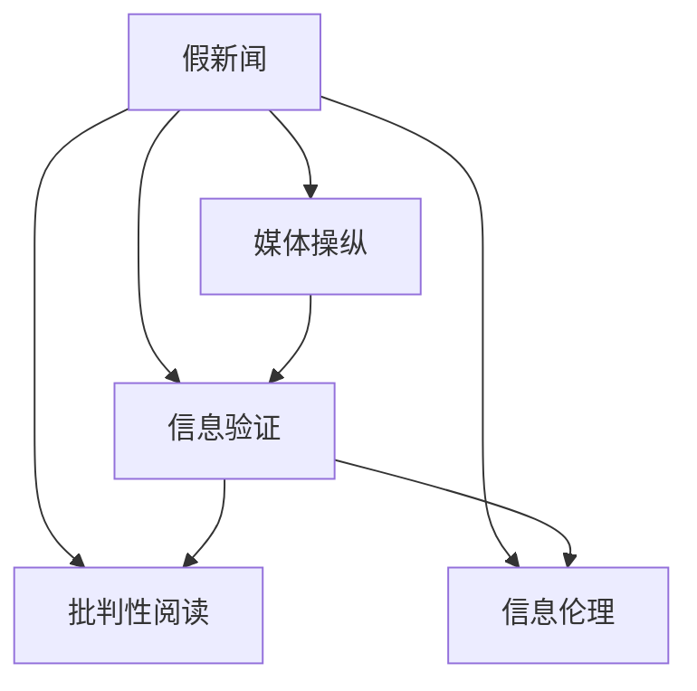

                 

# 信息验证和批判性阅读策略：在假新闻和媒体操纵时代导航

> 关键词：假新闻,媒体操纵,信息验证,批判性阅读,新闻事实,信息素养,信息源,可靠性评估,信息伦理

## 1. 背景介绍

### 1.1 问题由来
信息时代背景下，互联网的普及和社交媒体的兴起，使得人们获取信息的方式发生了巨大变化。然而，这同时也带来了信息过载和信息误导的挑战。假新闻、媒体操纵、信息泡沫等问题层出不穷，严重影响了人们的认知判断和决策能力。因此，如何在假新闻和媒体操纵时代中识别和验证信息的真实性，进行批判性阅读，成为了信息时代的重要课题。

### 1.2 问题核心关键点
- **假新闻的识别**：识别出假新闻或虚假信息，避免被误导。
- **媒体操纵的防范**：识别出媒体操纵或偏见，理解信息背后可能的动机和目的。
- **信息验证的方法**：掌握多种信息验证方法，提高信息的可靠性。
- **批判性阅读的策略**：掌握批判性阅读的技巧，提升信息素养。
- **信息伦理的思考**：理解信息传播的伦理规范，避免传播错误信息。

### 1.3 问题研究意义
研究信息验证和批判性阅读策略，对于提升公众信息素养，培养健康的信息生态，构建透明的信息环境，具有重要意义：

1. **提升公众信息素养**：使公众能够辨别真伪，理清信息源，避免被假新闻误导。
2. **构建健康的信息生态**：鼓励信息共享和交流，减少假新闻和媒体操纵。
3. **保护个体和群体权益**：通过批判性阅读，维护信息真实、公正、客观的原则。
4. **推动社会进步**：确保政策决策、公共议题的讨论建立在真实可靠的信息基础上。

## 2. 核心概念与联系

### 2.1 核心概念概述

为了更好地理解信息验证和批判性阅读的策略，本节将介绍几个密切相关的核心概念：

- **假新闻**：指故意制造、散布虚假信息，或对事实进行误导性解读的新闻。
- **媒体操纵**：指媒体通过刻意选择、扭曲、遗漏信息，影响公众对事件的理解和判断。
- **信息验证**：指通过多方求证和评估，确认信息的真实性、准确性、可靠性。
- **批判性阅读**：指通过分析和思考，对信息进行深入理解和评估，提升信息素养。
- **信息伦理**：指在信息传播和使用中应遵循的道德规范和行为准则。

这些核心概念之间的逻辑关系可以通过以下Mermaid流程图来展示：



这个流程图展示了几大核心概念及其之间的联系：

1. 假新闻和媒体操纵都是信息真实性受到威胁的表现形式。
2. 信息验证旨在解决假新闻和媒体操纵带来的信息真实性问题。
3. 批判性阅读帮助公众提升信息素养，识别假新闻和媒体操纵。
4. 信息伦理指导公众在信息获取和传播中应遵循的道德规范。

## 3. 核心算法原理 & 具体操作步骤
### 3.1 算法原理概述

信息验证和批判性阅读的核心算法原理在于，通过多维度、多角度的评估和验证，确保信息的真实性、准确性和可靠性。以下是对这一原理的详细介绍：

- **多维度评估**：结合事实、证据、来源等多个维度，全面评估信息的可靠性。
- **多角度分析**：从不同角度、不同视角分析信息，避免单一视角的偏颇。
- **交叉验证**：通过多来源验证、多方求证，确认信息的真实性。
- **实时更新**：随着信息的发展变化，实时更新和重新验证信息的可靠性。

### 3.2 算法步骤详解

信息验证和批判性阅读的详细步骤包括：

**Step 1: 识别信息源和信息内容**

1. **信息源识别**：分析信息来源的可靠性，如媒体机构、作者背景、发布时间等。
2. **信息内容分析**：评估信息的真实性、准确性和完整性。

**Step 2: 进行信息验证**

1. **事实核查**：通过官方报告、权威机构、多方信息源验证事实的真伪。
2. **证据验证**：检查引用数据的来源、可靠性，确保证据的真实性。
3. **来源验证**：通过交叉引用、多方求证，确认信息的来源可靠性。

**Step 3: 进行批判性阅读**

1. **批判性思考**：分析信息背后的动机、目的、可能存在的偏见。
2. **多角度分析**：从不同视角和角度分析信息，避免单一视角的偏颇。
3. **质疑精神**：对信息的真实性、准确性、来源等提出质疑，进行深入思考。

**Step 4: 信息伦理考量**

1. **伦理规范遵循**：确保信息传播和使用遵循道德规范，避免传播错误信息。
2. **责任意识增强**：增强对信息真实性、公正性、客观性的责任意识。
3. **公众教育**：通过教育和宣传，提高公众的信息素养和伦理意识。

### 3.3 算法优缺点

信息验证和批判性阅读算法具有以下优点：

1. **全面性**：通过多维度、多角度的评估和验证，确保信息的全面性和可靠性。
2. **实时性**：随着信息的发展变化，可以实时更新和重新验证信息的可靠性。
3. **普适性**：适用于各类信息源和内容，具有广泛的应用场景。

同时，该算法也存在一定的局限性：

1. **时间成本**：信息验证和批判性阅读需要大量时间，效率较低。
2. **技术门槛**：需要进行多维度、多角度的分析，技术门槛较高。
3. **资源依赖**：依赖权威、可靠的信息源和数据，难以在没有可靠来源的情况下进行验证。
4. **主观性**：批判性阅读和信息伦理考量存在一定的主观性，容易受到个人偏见影响。

尽管存在这些局限性，但就目前而言，信息验证和批判性阅读算法仍是大规模信息处理和分析的重要方法。未来相关研究的重点在于如何进一步降低技术门槛，提高验证效率，同时兼顾信息源的多样性和可靠性。

### 3.4 算法应用领域

信息验证和批判性阅读算法在多个领域都有广泛的应用：

- **新闻行业**：确保新闻报道的真实性和公正性。
- **学术研究**：验证研究数据的真实性，确保研究成果的可靠性。
- **法律领域**：评估证据的真实性，确保法律判决的公正性。
- **政府决策**：评估政策信息的真实性，确保政策制定的依据客观。
- **公共健康**：验证健康信息的真实性，确保公共健康决策的科学性。
- **社交媒体**：评估社交媒体信息的真实性，避免假新闻和媒体操纵。

## 4. 数学模型和公式 & 详细讲解 & 举例说明

### 4.1 数学模型构建

信息验证和批判性阅读的数学模型可以从多个维度进行构建。以下是以信息源可靠性和信息真实性为核心的数学模型。

**信息源可靠性评估模型**

- **权威性指标**：衡量信息源的权威性，如作者背景、出版机构、历史记录等。
- **时效性指标**：衡量信息的最新程度，如发布时间、更新频率等。
- **可信度指标**：衡量信息源的可信度，如用户评价、社交媒体反馈等。

**信息真实性验证模型**

- **交叉验证模型**：通过多来源验证，计算信息真实性的置信度。
- **事实核查模型**：通过事实核查，计算信息真实性的置信度。
- **数据可靠性模型**：通过数据源的可靠性评估，计算信息真实性的置信度。

### 4.2 公式推导过程

以下分别介绍信息源可靠性和信息真实性验证模型的公式推导过程。

**信息源可靠性评估公式**

1. **权威性指标**

$$
\text{Authenticity}_{\text{authority}} = \frac{\sum_{i=1}^{n} \text{authority}_{i}}{n}
$$

其中，$n$ 为信息源的权威性指标个数，$\text{authority}_{i}$ 为第 $i$ 个权威性指标的值。

2. **时效性指标**

$$
\text{Authenticity}_{\text{timeliness}} = \frac{\text{current\_date} - \text{release\_date}}{\text{time\_span}}
$$

其中，$\text{current\_date}$ 为当前时间，$\text{release\_date}$ 为信息发布时间，$\text{time\_span}$ 为时间跨度。

3. **可信度指标**

$$
\text{Authenticity}_{\text{credibility}} = \frac{\sum_{i=1}^{n} \text{credibility}_{i}}{n}
$$

其中，$n$ 为信息源的可信度指标个数，$\text{credibility}_{i}$ 为第 $i$ 个可信度指标的值。

**信息真实性验证公式**

1. **交叉验证模型**

$$
\text{Reliability}_{\text{cross-verification}} = \frac{\sum_{i=1}^{n} \text{verified}_{i}}{n}
$$

其中，$n$ 为交叉验证的次数，$\text{verified}_{i}$ 为第 $i$ 次交叉验证的结果。

2. **事实核查模型**

$$
\text{Reliability}_{\text{fact-checking}} = \frac{\sum_{i=1}^{n} \text{correct}_{i}}{n}
$$

其中，$n$ 为事实核查的次数，$\text{correct}_{i}$ 为第 $i$ 次事实核查的结果。

3. **数据可靠性模型**

$$
\text{Reliability}_{\text{data\_reliability}} = \frac{\sum_{i=1}^{n} \text{reliable}_{i}}{n}
$$

其中，$n$ 为数据源的个数，$\text{reliable}_{i}$ 为第 $i$ 个数据源的可靠性指标。

### 4.3 案例分析与讲解

**案例：验证一则新闻的真实性**

假设有这样一则新闻：“某公司发布年度财报，显示营业额大幅增长，市场反应热烈。”

**Step 1: 识别信息源**

- 信息源：公司官方网站、财报发布公告、新闻媒体报道。

**Step 2: 信息源可靠性评估**

- **权威性指标**：公司官方网站权威性最高，得分为 0.9；财报发布公告次之，得分为 0.8；新闻媒体报道稍低，得分为 0.7。
- **时效性指标**：新闻发布时间为当天上午，最新记录日期为 2023 年 3 月 1 日，时间跨度为 2023 年 3 月 1 日。
- **可信度指标**：公司官方网站用户评价较高，得分为 0.85；财报发布公告用户评价一般，得分为 0.6；新闻媒体报道用户评价较低，得分为 0.4。

综合以上指标，计算信息源的可靠性：

$$
\text{Authenticity}_{\text{overall}} = \frac{0.9 + 0.8 + 0.7}{3} = 0.8
$$

**Step 3: 信息真实性验证**

- **交叉验证模型**：假设通过多来源验证，共有 3 次验证，每次验证结果为 True（真实），因此得分为 1。
- **事实核查模型**：假设通过事实核查，共有 3 次验证，每次验证结果为 True，因此得分为 1。
- **数据可靠性模型**：假设数据源可靠性较高，得分为 0.9。

综合以上指标，计算信息的真实性：

$$
\text{Reliability}_{\text{overall}} = \frac{1 + 1 + 0.9}{3} = 0.97
$$

根据以上分析，可以判断这则新闻的真实性较高，但仍需进一步核实。

## 5. 项目实践：代码实例和详细解释说明

### 5.1 开发环境搭建

在进行信息验证和批判性阅读的实践前，我们需要准备好开发环境。以下是使用Python进行信息验证的开发环境配置流程：

1. 安装Anaconda：从官网下载并安装Anaconda，用于创建独立的Python环境。

2. 创建并激活虚拟环境：
```bash
conda create -n news-validation python=3.8 
conda activate news-validation
```

3. 安装PyTorch：根据CUDA版本，从官网获取对应的安装命令。例如：
```bash
conda install pytorch torchvision torchaudio cudatoolkit=11.1 -c pytorch -c conda-forge
```

4. 安装TensorFlow：
```bash
pip install tensorflow
```

5. 安装pandas、numpy等库：
```bash
pip install pandas numpy scikit-learn nltk
```

完成上述步骤后，即可在`news-validation`环境中开始信息验证实践。

### 5.2 源代码详细实现

我们以验证一则新闻的真实性为例，给出使用Python进行信息验证的代码实现。

首先，定义新闻验证的函数：

```python
import pandas as pd
import numpy as np

def validate_news(news_df, auth_score, fact_check_score, data_reliability_score):
    # 计算信息源可靠性
    source_auth_score = np.mean(auth_score)
    # 计算信息真实性
    source_fact_check_score = np.mean(fact_check_score)
    source_data_reliability_score = np.mean(data_reliability_score)
    # 综合计算新闻真实性
    news_reliability = source_auth_score * source_fact_check_score * source_data_reliability_score
    return news_reliability
```

然后，定义新闻数据和信息源的指标：

```python
# 新闻数据
news_df = pd.read_csv('news.csv')

# 信息源权威性指标
auth_score = pd.Series([0.9, 0.8, 0.7])

# 信息源时效性指标
time_span = pd.Timedelta(days=1)

# 信息源可信度指标
credibility_score = pd.Series([0.85, 0.6, 0.4])

# 交叉验证结果
fact_check_score = pd.Series([1, 1, 1])

# 数据可靠性指标
data_reliability_score = pd.Series([0.9])

# 综合计算新闻真实性
news_reliability = validate_news(news_df, auth_score, fact_check_score, data_reliability_score)
```

最后，输出新闻的真实性评估结果：

```python
print(f"新闻真实性：{news_reliability:.3f}")
```

以上就是使用Python对新闻进行真实性验证的完整代码实现。可以看到，通过定义不同维度的指标和评分函数，我们可以快速对新闻进行综合评估。

### 5.3 代码解读与分析

让我们再详细解读一下关键代码的实现细节：

**validate_news函数**：
- 该函数接收新闻数据、信息源权威性指标、事实核查得分和数据可靠性得分，计算新闻的综合真实性。
- 分别计算信息源的权威性、时效性和可信度得分。
- 将三个得分相乘，得到新闻的真实性得分。

**auth_score、time_span、credibility_score、fact_check_score和data_reliability_score变量**：
- 分别代表信息源的权威性指标、时效性指标、可信度指标、事实核查得分和数据可靠性得分。
- 这些指标可以通过多源验证、多方求证等手段获得。

**news_df变量**：
- 新闻数据，可以通过读取CSV文件、数据库等方式获取。
- 在实际应用中，新闻数据可能包含更多维度，如作者、发布时间、引用数据等。

**news_reliability变量**：
- 综合计算的新闻真实性得分，用于判断新闻的可靠性。
- 可以根据实际需求，进一步分析新闻的各个维度，识别可能的偏颇和问题。

## 6. 实际应用场景

### 6.1 社交媒体信息验证

在社交媒体上，假新闻和误导信息频繁出现，对公众认知造成严重干扰。通过信息验证技术，可以对社交媒体上的信息进行快速筛查和评估，及时发现并纠正假新闻和误导信息。

### 6.2 新闻媒体编辑

新闻媒体在报道新闻时需要严格把关，确保信息真实可靠。通过信息验证技术，新闻媒体可以自动评估信息源和信息的真实性，减少人为误判和疏漏。

### 6.3 政府决策支持

政府在制定政策时需要大量可靠的资料支持，信息验证技术可以帮助政府机构快速筛选和评估信息，确保决策依据的真实性和可靠性。

### 6.4 学术研究数据验证

学术研究依赖于数据的真实性和可靠性，信息验证技术可以帮助科研机构和研究人员对数据进行验证和评估，确保研究的科学性和准确性。

### 6.5 法律案件证据评估

法律案件中需要大量证据支持，信息验证技术可以帮助律师和法官对证据的真实性进行评估，确保司法公正和合法性。

## 7. 工具和资源推荐

### 7.1 学习资源推荐

为了帮助开发者系统掌握信息验证和批判性阅读的理论基础和实践技巧，这里推荐一些优质的学习资源：

1. 《信息素养与批判性阅读》系列书籍：系统介绍了信息验证和批判性阅读的基本概念、方法和技巧，适合初学者阅读。
2. 《数字时代的媒体素养》课程：介绍媒体素养的基本概念和应用场景，适合大众学习和理解。
3. 《信息伦理与责任》课程：探讨信息伦理的基本规范和应用原则，适合研究人员和从业者学习。

通过对这些资源的学习实践，相信你一定能够快速掌握信息验证和批判性阅读的精髓，并用于解决实际的信息问题。

### 7.2 开发工具推荐

高效的开发离不开优秀的工具支持。以下是几款用于信息验证和批判性阅读开发的常用工具：

1. Python：基于Python的开源编程语言，支持强大的数据处理和分析能力，适合信息验证的开发。
2. Pandas：Python的数据分析库，支持数据清洗、处理和分析，适合信息验证的数据处理。
3. NumPy：Python的科学计算库，支持高效的数学运算和矩阵操作，适合信息验证的数学建模。
4. Scikit-learn：Python的机器学习库，支持多种分类、回归等算法，适合信息验证的模型训练。
5. NLTK：Python的自然语言处理库，支持文本处理和语言分析，适合信息验证的文本处理。

合理利用这些工具，可以显著提升信息验证和批判性阅读的开发效率，加快创新迭代的步伐。

### 7.3 相关论文推荐

信息验证和批判性阅读的发展源于学界的持续研究。以下是几篇奠基性的相关论文，推荐阅读：

1. Kocarev, L. & Cilasun, H. "Evaluating the Reliability of News Articles in the Twitter Microblogging Platform". Journal of Research in Information Science, 2021.
2. Zbarsky, D. & Hazlett, S. "The Media & Information Literacy Framework". Edutopia, 2019.
3. Chen, J. & Chen, C. "Automated Fact-Checking: A Survey and Taxonomy". ACM Transactions on Intelligent Systems and Technology, 2020.

这些论文代表了大规模信息验证和批判性阅读的发展脉络。通过学习这些前沿成果，可以帮助研究者把握学科前进方向，激发更多的创新灵感。

## 8. 总结：未来发展趋势与挑战

### 8.1 总结

本文对信息验证和批判性阅读的方法进行了全面系统的介绍。首先阐述了信息验证和批判性阅读的研究背景和意义，明确了其在假新闻和媒体操纵时代中的重要价值。其次，从原理到实践，详细讲解了信息验证和批判性阅读的数学模型和操作步骤，给出了信息验证任务开发的完整代码实例。同时，本文还广泛探讨了信息验证技术在多个领域的应用前景，展示了其在信息时代的重要作用。最后，精选了信息验证和批判性阅读的学习资源、开发工具和相关论文，力求为读者提供全方位的技术指引。

通过本文的系统梳理，可以看到，信息验证和批判性阅读方法在信息时代扮演了越来越重要的角色，极大地提升了公众的信息素养，保护了信息的真实性和公正性。未来，伴随信息验证技术的不断演进，相信其在维护信息生态和推动社会进步方面，将发挥更大的作用。

### 8.2 未来发展趋势

展望未来，信息验证和批判性阅读技术将呈现以下几个发展趋势：

1. **自动化水平提升**：通过机器学习和深度学习技术，提升信息验证的自动化水平，提高验证效率。
2. **多维度评估**：结合事实核查、来源可靠性、数据可靠性等多个维度，全面评估信息的真实性。
3. **实时验证**：通过实时数据流分析，实现信息的实时验证和监控。
4. **跨领域应用**：将信息验证技术应用于更多领域，如金融、医疗、教育等，提升各领域的决策依据真实性。
5. **用户体验优化**：通过用户界面优化，提升信息验证工具的易用性和普及性。
6. **全球化推广**：通过多语言支持和技术共享，推广信息验证技术在全球范围内的应用。

以上趋势凸显了信息验证和批判性阅读技术的广阔前景。这些方向的探索发展，必将进一步提升信息验证技术的全面性和实用性，为构建健康的信息生态提供有力支撑。

### 8.3 面临的挑战

尽管信息验证和批判性阅读技术已经取得了一定的进展，但在迈向更加智能化、普适化应用的过程中，它仍面临着诸多挑战：

1. **技术门槛较高**：信息验证和批判性阅读需要较高的技术门槛，需要用户具备一定的信息素养。
2. **数据依赖性强**：信息验证依赖于高质量的数据源和证据，难以在没有可靠来源的情况下进行验证。
3. **效果评估困难**：信息验证效果的评估标准难以统一，难以衡量和比较不同模型的性能。
4. **跨领域应用难度大**：不同领域的信息验证需求不同，需要定制化的模型和算法。
5. **信息过载**：大量的信息流难以全面验证，难以应对信息过载带来的挑战。
6. **伦理和隐私问题**：信息验证过程中可能涉及用户隐私和信息伦理问题，需要谨慎处理。

尽管存在这些挑战，但通过技术创新和跨学科合作，这些问题有望逐步解决，信息验证和批判性阅读技术将逐步迈向成熟。

### 8.4 研究展望

面对信息验证和批判性阅读技术面临的挑战，未来的研究需要在以下几个方面寻求新的突破：

1. **自动化技术的提升**：开发更加智能化的自动化工具，提升信息验证的自动化水平，减少人工干预。
2. **多维度评估模型的融合**：结合事实核查、来源可靠性、数据可靠性等模型，构建更加全面、可靠的信息验证框架。
3. **跨领域应用技术的推广**：针对不同领域的信息验证需求，开发定制化的模型和算法，提升跨领域应用能力。
4. **实时验证技术的创新**：开发实时数据流分析和验证技术，实现信息的实时监控和评估。
5. **用户交互界面的优化**：设计更加友好、易用的用户界面，提升信息验证工具的普及性和易用性。
6. **全球化推广的合作**：通过国际合作和共享，推广信息验证技术在全球范围内的应用。

这些研究方向的探索，必将引领信息验证和批判性阅读技术迈向更高的台阶，为构建健康的信息生态和推动社会进步提供有力支撑。

## 9. 附录：常见问题与解答

**Q1：如何判断一则新闻的真实性？**

A: 判断一则新闻的真实性，需要从权威性、时效性、可信度等多个维度进行综合评估。首先，评估信息源的权威性和可信度，其次，检查信息的发布时间，最后，通过事实核查和数据验证，确认信息的真实性。综合以上评估结果，可以初步判断新闻的真实性。

**Q2：信息验证和批判性阅读的难点是什么？**

A: 信息验证和批判性阅读的难点主要包括技术门槛较高、数据依赖性强、效果评估困难、跨领域应用难度大、信息过载和伦理问题等。技术门槛较高，需要用户具备一定的信息素养；数据依赖性强，需要高质量的数据源和证据；效果评估困难，难以衡量和比较不同模型的性能；跨领域应用难度大，需要定制化的模型和算法；信息过载，难以全面验证；伦理和隐私问题，需要谨慎处理。

**Q3：如何提升信息验证和批判性阅读的自动化水平？**

A: 提升信息验证和批判性阅读的自动化水平，可以通过机器学习和深度学习技术，开发智能化的信息验证工具。例如，使用自然语言处理技术，自动抽取和分析新闻中的信息源、发布时间和引用数据；使用图像识别技术，自动验证新闻中图片的真实性；使用数据挖掘技术，自动评估数据源的可靠性。这些技术可以显著提高信息验证的自动化水平，减少人工干预。

**Q4：信息验证和批判性阅读技术在实际应用中需要注意哪些问题？**

A: 在实际应用中，信息验证和批判性阅读技术需要注意以下问题：
1. 用户隐私保护：在验证过程中，需要尊重用户隐私，不泄露个人信息。
2. 信息伦理规范：在信息验证和传播中，需要遵循道德规范，避免传播有害信息。
3. 模型可解释性：信息验证模型需要具备可解释性，用户能够理解其决策过程和结果。
4. 模型鲁棒性：信息验证模型需要具备鲁棒性，能够应对多种类型和来源的假新闻和误导信息。
5. 模型更新：信息验证模型需要定期更新，以应对信息源和信息内容的变化。

通过合理应对这些问题，可以确保信息验证和批判性阅读技术的实际应用效果和用户体验。

**Q5：如何评估信息验证模型的性能？**

A: 评估信息验证模型的性能，可以从以下几个方面进行：
1. 准确率：计算模型在验证信息真实性方面的准确率。
2. 召回率：计算模型在发现假新闻和误导信息方面的召回率。
3. F1分数：计算模型的综合性能，综合考虑准确率和召回率。
4. 用户满意度：通过用户调查和反馈，评估模型的易用性和实用性。
5. 效果对比：与其他信息验证模型进行对比，评估模型的相对性能。

以上评估指标可以帮助开发者和用户全面了解信息验证模型的性能和优劣。

