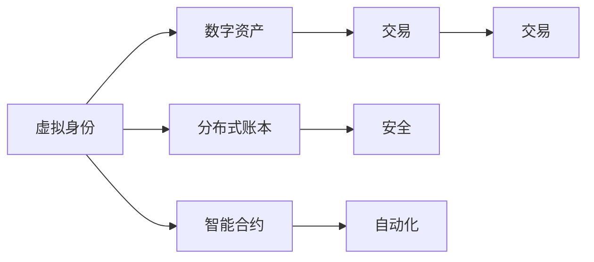

                 

# 元宇宙社交：重塑人际交往的数字平台

## 1. 背景介绍

### 1.1 问题由来
随着数字技术和网络通信技术的不断进步，人类的社交方式正在经历一次深刻的变革。在过去几十年中，互联网和移动互联网的出现，已经极大地改变了人们获取信息和社交的方式。然而，即使是在数字化世界中，我们仍然感受到了人与人之间的距离感，传统的面对面交流、共同活动的社交方式依旧难以完全被数字化所替代。

元宇宙（Metaverse）概念的提出，为我们提供了新的思路。元宇宙是一个虚拟的、数字化的、持续在线的空间，它通过沉浸式的体验和虚拟现实技术，让人们能够在数字世界中实现更加丰富和多样的社交活动。元宇宙社交，作为元宇宙概念的一个重要应用方向，有望彻底改变传统的社交方式，提供全新的互动体验。

### 1.2 问题核心关键点
元宇宙社交的核心在于通过虚拟现实技术、数字资产、智能合约等手段，构建一个完全数字化、高度沉浸的社交空间，实现人与人之间更加真实、自然的互动。这其中涉及的关键问题包括：

- 如何通过数字身份和虚拟空间构建，实现用户之间的深度互动和个性化体验？
- 如何利用分布式账本技术（如区块链），确保元宇宙社交的安全性和信任度？
- 如何通过智能合约和自动化机制，实现元宇宙中的公平、透明和自动化交易？
- 如何平衡虚拟与现实的关系，避免元宇宙社交带来的心理和社会问题？

这些关键问题构成了元宇宙社交技术研究和应用的核心，需要通过多学科的交叉合作和技术创新来解决。

## 2. 核心概念与联系

### 2.1 核心概念概述

元宇宙社交技术涉及多个关键概念，包括虚拟身份、虚拟空间、数字资产、分布式账本、智能合约等。这些概念之间的联系如下图所示：



- **虚拟身份**：用户在元宇宙中的唯一标识，通过虚拟现实技术呈现出来。
- **数字资产**：元宇宙中的虚拟物品，包括虚拟土地、虚拟货币、虚拟商品等，可以通过智能合约进行管理和交易。
- **分布式账本**：基于区块链技术的账本，确保元宇宙中的数据透明、安全、不可篡改。
- **智能合约**：自动执行的合同，确保元宇宙中的交易公平、透明、可信。
- **交易**：用户在元宇宙中进行的交互，包括物品交换、活动参与等。

### 2.2 核心概念原理和架构的 Mermaid 流程图


## 3. 核心算法原理 & 具体操作步骤

### 3.1 算法原理概述

元宇宙社交技术的基础是虚拟现实技术、分布式账本技术和智能合约技术。这些技术的核心原理和操作步骤如下：

- **虚拟现实技术**：通过传感器和显示器等硬件设备，构建一个高度沉浸的虚拟环境，使用户能够在其中进行自由探索和互动。
- **分布式账本技术**：基于区块链技术的分布式账本，确保元宇宙中的数据透明、安全、不可篡改。
- **智能合约技术**：自动执行的合同，通过代码逻辑实现元宇宙中的交易和互动。

### 3.2 算法步骤详解

**Step 1: 虚拟身份创建**
用户通过虚拟身份创建工具，创建自己的虚拟身份，包括头像、服饰、位置等。这些信息会存储在分布式账本上，确保数据的透明和可信。

**Step 2: 虚拟空间探索**
用户在元宇宙中自由探索，可以通过VR头盔、手柄等设备，实现虚拟空间的沉浸式体验。用户可以加入不同的虚拟空间，参与各种活动。

**Step 3: 数字资产交易**
用户可以在元宇宙中进行数字资产的交易，如虚拟货币、虚拟商品等。这些交易通过智能合约进行，确保交易的公平、透明和可信。

**Step 4: 社交互动**
用户在元宇宙中进行社交互动，包括语音聊天、文字聊天、虚拟礼物交换等。这些互动也可以通过智能合约进行管理和记录。

**Step 5: 安全保障**
元宇宙社交平台需要提供强大的安全保障措施，防止黑客攻击、数据泄露等安全问题。分布式账本技术和智能合约技术，可以有效地保障元宇宙社交的安全性。

### 3.3 算法优缺点

元宇宙社交技术具有以下优点：
- **沉浸式体验**：通过虚拟现实技术，为用户提供高度沉浸的社交体验，增强互动的丰富性和多样性。
- **安全性高**：分布式账本技术和智能合约技术，确保元宇宙社交平台的安全性和可信度。
- **透明度高**：所有交易和互动记录都公开透明，防止数据篡改和欺诈行为。

同时，元宇宙社交技术也存在以下缺点：
- **技术门槛高**：需要高端硬件设备和复杂的技术支持，对普通用户来说门槛较高。
- **隐私问题**：用户的虚拟身份和数据隐私可能面临被泄露的风险。
- **社交隔离**：元宇宙中虚拟身份的隔离性可能带来心理和社会问题，用户容易沉迷于虚拟世界。

### 3.4 算法应用领域

元宇宙社交技术已经在游戏、娱乐、教育等多个领域得到了应用，如：

- **游戏社交**：通过虚拟身份和虚拟空间，在游戏中实现高度沉浸的社交互动。
- **虚拟社区**：构建虚拟社区，提供交流、交友、协作等功能。
- **虚拟教育**：在虚拟环境中进行在线教育，提供沉浸式学习体验。
- **虚拟商务**：利用虚拟空间和数字资产，实现虚拟商务和交易。
- **虚拟演出**：在虚拟环境中进行音乐会、话剧等演出活动，提供沉浸式观演体验。

这些应用展示了元宇宙社交技术的强大潜力和广阔前景。

## 4. 数学模型和公式 & 详细讲解

### 4.1 数学模型构建

元宇宙社交技术的数学模型主要涉及虚拟现实技术、分布式账本技术和智能合约技术。以下是一些核心模型的介绍：

**虚拟现实模型**：
- **动作捕捉模型**：通过传感器捕捉用户的动作，并将其映射到虚拟环境中。
- **空间感知模型**：通过摄像头等设备感知用户的位置和方向，进行虚拟环境的构建和渲染。

**分布式账本模型**：
- **区块链模型**：基于哈希链和共识算法，构建分布式账本，确保数据的透明和不可篡改。
- **共识算法模型**：如PoW、PoS、DPoS等，确保分布式账本中的数据一致性和安全性。

**智能合约模型**：
- **自动执行模型**：通过代码逻辑实现合同的自动执行，确保交易的公平、透明和可信。
- **状态存储模型**：通过分布式账本存储智能合约的状态，确保状态的可信和透明。

### 4.2 公式推导过程

以下是一些核心公式的推导过程：

**动作捕捉公式**：
$$
\text{动作捕捉} = f(\text{传感器数据}, \text{动作映射规则})
$$

**空间感知公式**：
$$
\text{空间感知} = g(\text{摄像头数据}, \text{位置映射规则})
$$

**区块链共识算法公式**：
$$
\text{共识算法} = h(\text{网络数据}, \text{共识规则}, \text{激励机制})
$$

**智能合约自动执行公式**：
$$
\text{自动执行} = i(\text{合约代码}, \text{状态数据})
$$

### 4.3 案例分析与讲解

以虚拟身份创建和数字资产交易为例，分析元宇宙社交技术的核心操作。

**虚拟身份创建**：
1. 用户通过VR头盔等设备，输入自己的头像、服饰、位置等信息。
2. 系统将用户信息加密并存储在分布式账本上。
3. 用户可以自由探索虚拟空间，进行互动。

**数字资产交易**：
1. 用户在元宇宙中购买虚拟货币或商品。
2. 系统通过智能合约验证交易，确保交易的公平、透明和可信。
3. 交易记录存储在分布式账本上，确保数据的安全和不可篡改。

## 5. 项目实践：代码实例和详细解释说明

### 5.1 开发环境搭建

要实现元宇宙社交技术，需要搭建一个完整的开发环境，包括硬件设备、软件平台和技术框架。以下是一些推荐的步骤：

1. 选择适合的VR设备和手柄。
2. 安装虚拟现实软件平台，如Unity、Unreal Engine等。
3. 搭建分布式账本平台，如Ethereum、Hyperledger等。
4. 安装智能合约开发工具，如Solidity、Truffle等。
5. 部署服务器和网络环境，确保系统稳定运行。

### 5.2 源代码详细实现

以下是一些关键的源代码实现，以虚拟身份创建和数字资产交易为例：

**虚拟身份创建**：
```python
from virtual_identity import create_identity

def create_virtual_identity():
    name = input("Enter your name: ")
    avatar = input("Enter your avatar: ")
    location = input("Enter your location: ")
    identity = create_identity(name, avatar, location)
    return identity
```

**数字资产交易**：
```python
from ethereum import Ethereum
from smart_contract import SmartContract

def create_smart_contract():
    contract_address = input("Enter contract address: ")
    contract = SmartContract(contract_address)
    return contract

def transfer_asset():
    contract = create_smart_contract()
    from_address = input("Enter from address: ")
    to_address = input("Enter to address: ")
    amount = input("Enter amount: ")
    contract.transfer_asset(from_address, to_address, amount)
```

### 5.3 代码解读与分析

虚拟身份创建的代码实现中，通过调用虚拟身份创建工具，输入用户的姓名、头像和位置，生成一个虚拟身份。系统将虚拟身份信息加密并存储在分布式账本上，确保数据的安全和可信。

数字资产交易的代码实现中，通过调用智能合约，进行资产的转移。系统首先创建一个智能合约，输入交易的从地址、目标地址和资产数量，智能合约自动执行资产转移操作，确保交易的公平、透明和可信。

### 5.4 运行结果展示

运行虚拟身份创建和数字资产交易的代码，可以得到以下结果：

- 虚拟身份创建：生成虚拟身份，并记录在分布式账本上。
- 数字资产交易：成功转移资产，交易记录存储在分布式账本上。

## 6. 实际应用场景

### 6.1 游戏社交

元宇宙社交技术在游戏领域得到了广泛应用，通过虚拟身份和虚拟空间，实现高度沉浸的社交互动。例如：

- 《我的世界》(Minecraft)：游戏玩家可以在虚拟世界中自由探索和互动，进行合作和竞争。
- 《Roblox》：提供丰富的虚拟场景和社交功能，玩家可以在游戏中结识朋友，进行协作和创作。

### 6.2 虚拟社区

元宇宙社交技术在虚拟社区中也有广泛应用，构建虚拟社区，提供交流、交友、协作等功能。例如：

- Second Life：一个虚拟世界平台，用户可以创建和探索虚拟空间，进行社交互动和创作。
- Sansar：一个虚拟现实平台，用户可以自由探索和互动，构建自己的虚拟社区。

### 6.3 虚拟教育

元宇宙社交技术在虚拟教育中也得到了应用，提供沉浸式学习体验。例如：

- Google Expeditions：通过虚拟现实技术，带领学生进行虚拟旅行和探索。
- Quest VR：提供虚拟实验室和互动学习环境，提升学生的学习兴趣和参与度。

### 6.4 未来应用展望

未来，元宇宙社交技术将进一步拓展应用范围，带来更多的创新和变革。

- **虚拟商务**：通过元宇宙社交平台，用户可以在虚拟环境中进行商务活动，如虚拟展会、虚拟会议等。
- **虚拟演出**：在虚拟环境中进行音乐会、话剧等演出活动，提供沉浸式观演体验。
- **虚拟医疗**：通过元宇宙社交平台，提供虚拟医疗咨询和远程诊疗服务。
- **虚拟旅游**：在虚拟环境中进行虚拟旅游和探险，提供更加丰富和安全的旅游体验。

## 7. 工具和资源推荐

### 7.1 学习资源推荐

要学习和掌握元宇宙社交技术，需要一些优质的学习资源，以下是一些推荐：

1. **虚拟现实技术学习资源**：如Unity官方文档、Unreal Engine教程等。
2. **分布式账本技术学习资源**：如Ethereum官方文档、Hyperledger教程等。
3. **智能合约技术学习资源**：如Solidity官方文档、Truffle教程等。
4. **元宇宙社交技术学习资源**：如元宇宙社交平台开发指南、虚拟现实技术应用案例等。

### 7.2 开发工具推荐

要实现元宇宙社交技术，需要一些高效的开发工具，以下是一些推荐：

1. **虚拟现实开发工具**：如Unity、Unreal Engine等。
2. **分布式账本开发工具**：如Ethereum、Hyperledger等。
3. **智能合约开发工具**：如Solidity、Truffle等。
4. **虚拟现实测试工具**：如Oculus Rift、HTC Vive等。
5. **分布式账本测试工具**：如MetaMask、MyEtherWallet等。
6. **智能合约测试工具**：如Remix、Truffle等。

### 7.3 相关论文推荐

要深入了解元宇宙社交技术的原理和应用，需要阅读一些相关的学术论文，以下是一些推荐：

1. **虚拟现实技术论文**：如《Virtual Reality in Healthcare: A Review and Future Directions》等。
2. **分布式账本技术论文**：如《Blockchain Technology and Its Impact on Digital Transformation》等。
3. **智能合约技术论文**：如《Ethereum Smart Contract Security and Design Patterns》等。
4. **元宇宙社交技术论文**：如《Towards a Metaverse-Based Social Network》等。

## 8. 总结：未来发展趋势与挑战

### 8.1 研究成果总结

元宇宙社交技术已经取得了一定的进展，但仍有许多挑战需要克服。主要的研究成果和挑战如下：

**研究成果**：
1. **虚拟现实技术**：通过传感器和显示器等硬件设备，构建高度沉浸的虚拟环境。
2. **分布式账本技术**：基于区块链技术的分布式账本，确保数据的透明和不可篡改。
3. **智能合约技术**：自动执行的合同，确保元宇宙社交平台的安全性和可信度。

**挑战**：
1. **技术门槛高**：需要高端硬件设备和复杂的技术支持。
2. **隐私问题**：用户的虚拟身份和数据隐私可能面临泄露风险。
3. **社交隔离**：元宇宙中虚拟身份的隔离性可能带来心理和社会问题。

### 8.2 未来发展趋势

元宇宙社交技术未来将呈现以下几个发展趋势：

1. **技术成熟**：元宇宙社交平台将逐步实现商业化，技术也将不断成熟和完善。
2. **应用拓展**：元宇宙社交技术将拓展到更多领域，如虚拟商务、虚拟演出等。
3. **用户普及**：随着技术的普及和成本的降低，元宇宙社交平台的用户将不断增加。
4. **交互丰富**：元宇宙社交平台将提供更加丰富和多样的互动体验。
5. **标准化**：元宇宙社交平台的标准化和规范将逐步建立，确保平台之间的互操作性。

### 8.3 面临的挑战

元宇宙社交技术在发展过程中，仍面临一些挑战：

1. **技术门槛高**：需要高端硬件设备和复杂的技术支持，对普通用户来说门槛较高。
2. **隐私问题**：用户的虚拟身份和数据隐私可能面临泄露风险，需要有效的隐私保护措施。
3. **社交隔离**：元宇宙中虚拟身份的隔离性可能带来心理和社会问题，需要提供心理支持和社交引导。
4. **交互复杂**：元宇宙社交平台需要提供复杂的交互机制，需要用户具备一定的技术素养。
5. **内容审核**：元宇宙社交平台需要建立有效的内容审核机制，防止不良内容的传播。

### 8.4 研究展望

未来，元宇宙社交技术需要从以下几个方面进行研究：

1. **用户隐私保护**：开发更加安全、可靠的用户隐私保护机制，确保用户数据的安全和隐私。
2. **社交隔离问题**：提供心理支持和社交引导，帮助用户应对虚拟身份带来的隔离感。
3. **交互体验优化**：提供更加丰富和多样的交互体验，提升用户的沉浸感和参与度。
4. **技术标准化**：制定元宇宙社交平台的标准化和规范，确保平台之间的互操作性。
5. **内容审核机制**：建立有效的内容审核机制，防止不良内容的传播。

## 9. 附录：常见问题与解答

**Q1: 元宇宙社交技术的核心是什么？**

A: 元宇宙社交技术的核心是虚拟现实技术、分布式账本技术和智能合约技术。这些技术共同构建了一个高度沉浸、安全可信的社交平台。

**Q2: 元宇宙社交技术有哪些应用场景？**

A: 元宇宙社交技术可以在游戏社交、虚拟社区、虚拟教育、虚拟商务、虚拟演出等多个领域得到应用。

**Q3: 元宇宙社交技术的优缺点是什么？**

A: 元宇宙社交技术的优点包括沉浸式体验、安全性高、透明度高等。缺点包括技术门槛高、隐私问题、社交隔离等。

**Q4: 如何平衡虚拟与现实的关系？**

A: 需要提供心理支持和社交引导，帮助用户应对虚拟身份带来的隔离感，同时提供现实的社交活动，保持用户的现实生活。

**Q5: 元宇宙社交技术的未来发展趋势是什么？**

A: 元宇宙社交技术的未来发展趋势包括技术成熟、应用拓展、用户普及、交互丰富、标准化等。

---

作者：禅与计算机程序设计艺术 / Zen and the Art of Computer Programming

