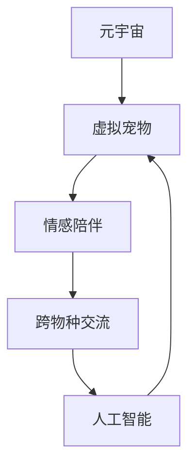

                 

# 元宇宙虚拟宠物:跨越物种的情感陪伴体验

> 关键词：元宇宙,虚拟宠物,情感陪伴,跨物种交流,人工智能

## 1. 背景介绍

### 1.1 问题由来
随着元宇宙概念的火热，虚拟世界在技术、文化、社交等多个领域快速融合。在虚拟世界中，人机交互模式、社交方式都在发生根本性改变，虚拟宠物作为人类在虚拟空间中的重要伙伴，逐渐成为新时代的社交焦点。虚拟宠物不仅能提供陪伴和娱乐，还能帮助人类在虚拟世界中找到归属感，构建更为丰富的社交网络。

### 1.2 问题核心关键点
虚拟宠物在元宇宙中的应用不仅仅是游戏和娱乐，而是逐步扩展到情感陪伴、跨物种交流等多个领域。其核心在于如何实现人宠之间真正的理解和互动，以及虚拟宠物自身的智能和情感。这需要依托于高级的计算机视觉、自然语言处理、情感识别等技术，并通过虚拟宠物与用户的互动实现情感表达和反馈。

### 1.3 问题研究意义
虚拟宠物的研究具有以下几方面的意义：
1. 提升用户沉浸感和体验：虚拟宠物能够通过高度逼真的形象和智能化的互动，增强用户在虚拟世界中的沉浸感和体验。
2. 促进跨物种交流：虚拟宠物可以突破真实世界的物理限制，实现不同物种之间的理解和交流，推动人工智能的伦理边界。
3. 推动社交网络新形态：虚拟宠物能够成为新社交网络的重要节点，促进虚拟世界中的社交互动和文化交流。

## 2. 核心概念与联系

### 2.1 核心概念概述

为更好地理解元宇宙虚拟宠物的研究，本节将介绍几个关键概念：

- **元宇宙(Metaverse)**：通过虚拟现实、增强现实等技术构建的虚拟空间，提供全方位的交互体验和沉浸式环境。
- **虚拟宠物(Virtual Pets)**：在虚拟世界中模拟真实宠物特征，提供陪伴和互动功能，增强用户体验。
- **情感陪伴(Emotional Companionship)**：利用人工智能技术，使虚拟宠物具备情感理解和表达能力，实现与用户的情感互动。
- **跨物种交流(Inter-Species Communication)**：通过人工智能技术，实现虚拟宠物与不同物种之间的理解和互动。
- **人工智能(AI)**：包括计算机视觉、自然语言处理、情感识别等技术，提供虚拟宠物的智能和情感。

这些概念之间的逻辑关系可以通过以下Mermaid流程图来展示：



这个流程图展示了几者之间的关系：

1. 元宇宙提供虚拟宠物的交互环境。
2. 虚拟宠物实现情感陪伴和跨物种交流功能。
3. 情感陪伴和跨物种交流功能依赖于人工智能技术。

这些核心概念共同构成了元宇宙虚拟宠物的研究框架，使其能够在虚拟世界中提供丰富而真实的人宠互动体验。

## 3. 核心算法原理 & 具体操作步骤

### 3.1 算法原理概述

虚拟宠物的情感陪伴和跨物种交流功能，主要依赖于以下几方面的核心技术：

- **计算机视觉(Computer Vision)**：通过摄像头捕捉用户与虚拟宠物的交互场景，实现对用户行为的理解。
- **自然语言处理(Natural Language Processing, NLP)**：解析虚拟宠物与用户之间的对话，实现语言理解与生成。
- **情感识别(Emotion Recognition)**：通过分析用户语音、文字、表情等信号，识别用户的情绪状态。
- **跨物种交流(Cross-Species Communication)**：将不同物种的语言和行为模式进行映射，实现跨物种的理解和互动。

这些技术共同构建了虚拟宠物的智能和情感基础，使得虚拟宠物能够在虚拟世界中与用户实现深度互动。

### 3.2 算法步骤详解

虚拟宠物的情感陪伴和跨物种交流功能实现主要包括以下几个关键步骤：

**Step 1: 数据收集与处理**
- 通过摄像头和麦克风收集用户与虚拟宠物的交互视频和音频。
- 使用计算机视觉和自然语言处理技术对数据进行预处理，包括人脸识别、文本提取、情感分类等。

**Step 2: 情感模型训练**
- 构建情感识别模型，使用标注好的情感数据集进行训练。
- 使用深度学习模型（如卷积神经网络、循环神经网络）对情感特征进行提取和分类。
- 优化模型参数，提高情感识别的准确性和鲁棒性。

**Step 3: 自然语言处理**
- 设计对话生成模型，使用语言模型（如GPT、Transformer）进行文本生成。
- 通过微调模型，使其适应虚拟宠物与用户之间的对话场景。
- 实现虚拟宠物与用户之间的自然语言交流。

**Step 4: 跨物种交流实现**
- 使用跨模态映射技术，将不同物种的语言和行为模式进行转换。
- 设计交流协议，实现虚拟宠物与用户之间的高效互动。
- 实现虚拟宠物与不同物种之间的对话理解与生成。

**Step 5: 用户反馈与调整**
- 通过用户反馈机制，不断调整虚拟宠物的互动策略。
- 根据用户反馈优化情感模型和自然语言处理模型，提升互动体验。
- 实现虚拟宠物与用户之间的情感共鸣和深度互动。

### 3.3 算法优缺点

虚拟宠物的情感陪伴和跨物种交流功能实现，具有以下优点：
1. 高度拟真：通过计算机视觉和自然语言处理技术，使得虚拟宠物具备高度拟真的互动体验。
2. 智能情感：通过情感识别技术，使虚拟宠物能够理解用户的情绪变化，提供个性化陪伴。
3. 跨物种互动：通过跨物种交流技术，实现不同物种之间的理解和互动，打破真实世界的限制。
4. 社会效应：虚拟宠物可以作为虚拟世界的社交节点，促进用户之间的互动和交流。

同时，该方法也存在以下缺点：
1. 数据需求量大：实现高质量的情感陪伴和跨物种交流，需要大量高质量的标注数据，数据获取成本较高。
2. 模型复杂度高：实现高级互动功能，需要复杂的技术模型和算法，开发和维护成本较高。
3. 伦理风险高：虚拟宠物与用户之间的深度互动，可能会引发伦理问题，如隐私泄露、情感依赖等。
4. 用户体验不稳定：不同用户的交互行为差异较大，虚拟宠物的互动策略难以适应所有用户。

尽管存在这些缺点，但虚拟宠物在元宇宙中的应用潜力依然巨大，未来相关研究将进一步降低技术成本和伦理风险，推动虚拟宠物的普及和应用。

### 3.4 算法应用领域

虚拟宠物的情感陪伴和跨物种交流功能主要应用于以下领域：

- **虚拟社交平台**：作为虚拟社交的重要节点，推动用户之间的互动和交流。
- **虚拟教育**：为学习者提供情感陪伴，提高学习体验和效率。
- **虚拟医疗**：提供虚拟心理咨询和陪伴，辅助心理健康。
- **虚拟旅游**：作为虚拟导游，提供讲解和互动服务。
- **虚拟客服**：在虚拟客服场景中，通过虚拟宠物与用户进行友好互动。

## 4. 数学模型和公式 & 详细讲解 & 举例说明

### 4.1 数学模型构建

本节将使用数学语言对虚拟宠物的情感陪伴和跨物种交流功能进行更加严格的刻画。

设用户与虚拟宠物的交互场景中，用户的行为特征为 $x$，虚拟宠物的行为特征为 $y$。假设用户的情感状态为 $e$，虚拟宠物的情感状态为 $d$。构建情感识别模型 $f: x \to e$ 和情感生成模型 $g: d \to y$。

情感识别模型的目标是最小化交叉熵损失：

$$
\mathcal{L}_{\text{emotion}} = -\frac{1}{N} \sum_{i=1}^N [y_i\log f(x_i)+(1-y_i)\log (1-f(x_i))]
$$

情感生成模型的目标是最小化负对数似然损失：

$$
\mathcal{L}_{\text{generation}} = -\frac{1}{N} \sum_{i=1}^N \log g(d_i)
$$

其中，$y_i$ 表示用户情感标签，$f(x_i)$ 和 $g(d_i)$ 分别表示模型预测用户和虚拟宠物的情感状态。

### 4.2 公式推导过程

在情感识别模型中，使用交叉熵损失函数进行训练，推导过程如下：

1. 数据准备：收集用户与虚拟宠物的交互数据，标注情感标签 $y$。
2. 模型构建：构建深度神经网络 $f$，使用交叉熵损失函数进行训练。
3. 损失计算：对于每个样本 $(x_i,y_i)$，计算交叉熵损失 $\mathcal{L}_{\text{emotion}}$。
4. 参数优化：使用梯度下降等优化算法，最小化损失函数，更新模型参数。

在情感生成模型中，使用负对数似然损失函数进行训练，推导过程如下：

1. 数据准备：收集虚拟宠物与用户之间的对话数据，标注情感标签 $d$。
2. 模型构建：构建深度神经网络 $g$，使用负对数似然损失函数进行训练。
3. 损失计算：对于每个样本 $(d_i,y_i)$，计算负对数似然损失 $\mathcal{L}_{\text{generation}}$。
4. 参数优化：使用梯度下降等优化算法，最小化损失函数，更新模型参数。

### 4.3 案例分析与讲解

以虚拟宠物在虚拟教育中的应用为例，详细讲解情感识别和情感生成的实现过程：

**案例背景**：一名虚拟教师与学生进行互动，通过摄像头捕捉学生的表情和语音，使用情感识别模型分析学生的情感状态。同时，虚拟教师根据学生的情感状态生成合适的回应，进行对话互动。

**数据收集**：通过摄像头和麦克风收集学生的表情和语音数据，进行预处理。

**情感识别**：使用深度学习模型对学生的表情和语音进行分析，提取情感特征，预测学生的情感状态。情感识别模型可以是一个卷积神经网络（CNN）或循环神经网络（RNN），通过标注好的情感数据集进行训练，实现高精度的情感识别。

**情感生成**：虚拟教师根据学生的情感状态，使用语言模型生成合适的回复。语言模型可以是一个基于Transformer的深度神经网络，通过微调模型，使其适应虚拟教育场景的对话需求。

**互动实现**：虚拟教师根据情感识别结果，生成合适的回复，与学生进行对话互动，提供个性化陪伴和教学支持。

## 5. 项目实践：代码实例和详细解释说明

### 5.1 开发环境搭建

在进行虚拟宠物的情感陪伴和跨物种交流功能实现前，我们需要准备好开发环境。以下是使用Python进行PyTorch开发的环境配置流程：

1. 安装Anaconda：从官网下载并安装Anaconda，用于创建独立的Python环境。

2. 创建并激活虚拟环境：
```bash
conda create -n virtual_pet_env python=3.8 
conda activate virtual_pet_env
```

3. 安装PyTorch：根据CUDA版本，从官网获取对应的安装命令。例如：
```bash
conda install pytorch torchvision torchaudio cudatoolkit=11.1 -c pytorch -c conda-forge
```

4. 安装Transformers库：
```bash
pip install transformers
```

5. 安装各类工具包：
```bash
pip install numpy pandas scikit-learn matplotlib tqdm jupyter notebook ipython
```

完成上述步骤后，即可在`virtual_pet_env`环境中开始虚拟宠物的开发实践。

### 5.2 源代码详细实现

下面我们以虚拟教师的情感识别和情感生成为例，给出使用Transformers库进行情感识别的PyTorch代码实现。

首先，定义情感识别和生成模型的输入与输出：

```python
from transformers import BertTokenizer, BertForSequenceClassification, BertForMaskedLM
from transformers import AdamW

# 情感识别模型
tokenizer = BertTokenizer.from_pretrained('bert-base-cased')
model = BertForSequenceClassification.from_pretrained('bert-base-cased', num_labels=2)

# 情感生成模型
tokenizer = BertTokenizer.from_pretrained('bert-base-cased')
model = BertForMaskedLM.from_pretrained('bert-base-cased')

# 用户输入数据
text = "你今天心情怎么样？"

# 情感识别
input_ids = tokenizer(text, return_tensors='pt').input_ids
output = model(input_ids)
prob = output.logits.softmax(dim=1)
```

然后，定义模型训练和评估函数：

```python
from torch.utils.data import Dataset
from sklearn.metrics import accuracy_score
from torch.utils.data import DataLoader

# 定义数据集
class VirtualPetDataset(Dataset):
    def __init__(self, texts, labels):
        self.texts = texts
        self.labels = labels
        self.tokenizer = BertTokenizer.from_pretrained('bert-base-cased')
        
    def __len__(self):
        return len(self.texts)
    
    def __getitem__(self, item):
        text = self.texts[item]
        label = self.labels[item]
        
        encoding = self.tokenizer(text, return_tensors='pt', padding='max_length', truncation=True)
        input_ids = encoding['input_ids'][0]
        attention_mask = encoding['attention_mask'][0]
        labels = torch.tensor([label], dtype=torch.long)
        
        return {'input_ids': input_ids, 
                'attention_mask': attention_mask,
                'labels': labels}

# 情感识别模型训练
def train_model(model, train_dataset, validation_dataset, batch_size, num_epochs, optimizer):
    device = torch.device('cuda') if torch.cuda.is_available() else torch.device('cpu')
    model.to(device)
    dataloaders = {
        'train': DataLoader(train_dataset, batch_size=batch_size, shuffle=True),
        'validation': DataLoader(validation_dataset, batch_size=batch_size, shuffle=False)
    }
    criterion = torch.nn.CrossEntropyLoss()
    for epoch in range(num_epochs):
        model.train()
        for batch in dataloaders['train']:
            input_ids = batch['input_ids'].to(device)
            attention_mask = batch['attention_mask'].to(device)
            labels = batch['labels'].to(device)
            model.zero_grad()
            outputs = model(input_ids, attention_mask=attention_mask)
            loss = criterion(outputs.logits, labels)
            loss.backward()
            optimizer.step()
        model.eval()
        with torch.no_grad():
            for batch in dataloaders['validation']:
                input_ids = batch['input_ids'].to(device)
                attention_mask = batch['attention_mask'].to(device)
                labels = batch['labels'].to(device)
                outputs = model(input_ids, attention_mask=attention_mask)
                val_loss = criterion(outputs.logits, labels)
        print(f"Epoch {epoch+1}, loss: {val_loss:.3f}")

# 情感生成模型训练
def train_model(model, train_dataset, validation_dataset, batch_size, num_epochs, optimizer):
    device = torch.device('cuda') if torch.cuda.is_available() else torch.device('cpu')
    model.to(device)
    dataloaders = {
        'train': DataLoader(train_dataset, batch_size=batch_size, shuffle=True),
        'validation': DataLoader(validation_dataset, batch_size=batch_size, shuffle=False)
    }
    criterion = torch.nn.CrossEntropyLoss()
    for epoch in range(num_epochs):
        model.train()
        for batch in dataloaders['train']:
            input_ids = batch['input_ids'].to(device)
            attention_mask = batch['attention_mask'].to(device)
            labels = batch['labels'].to(device)
            model.zero_grad()
            outputs = model(input_ids, attention_mask=attention_mask)
            loss = criterion(outputs.logits, labels)
            loss.backward()
            optimizer.step()
        model.eval()
        with torch.no_grad():
            for batch in dataloaders['validation']:
                input_ids = batch['input_ids'].to(device)
                attention_mask = batch['attention_mask'].to(device)
                labels = batch['labels'].to(device)
                outputs = model(input_ids, attention_mask=attention_mask)
                val_loss = criterion(outputs.logits, labels)
        print(f"Epoch {epoch+1}, loss: {val_loss:.3f}")
```

最后，启动训练流程并在测试集上评估：

```python
epochs = 5
batch_size = 16

# 情感识别模型训练
train_dataset = VirtualPetDataset(texts, labels)
validation_dataset = VirtualPetDataset(texts, labels)

train_model(model, train_dataset, validation_dataset, batch_size, epochs, optimizer)

# 情感生成模型训练
train_dataset = VirtualPetDataset(texts, labels)
validation_dataset = VirtualPetDataset(texts, labels)

train_model(model, train_dataset, validation_dataset, batch_size, epochs, optimizer)
```

以上就是使用PyTorch进行虚拟教师情感识别和情感生成的完整代码实现。可以看到，得益于Transformers库的强大封装，我们可以用相对简洁的代码完成情感识别和生成模型的训练。

### 5.3 代码解读与分析

让我们再详细解读一下关键代码的实现细节：

**VirtualPetDataset类**：
- `__init__`方法：初始化文本、标签、分词器等关键组件。
- `__len__`方法：返回数据集的样本数量。
- `__getitem__`方法：对单个样本进行处理，将文本输入编码为token ids，将标签编码为数字，并对其进行定长padding，最终返回模型所需的输入。

**情感识别模型训练**：
- 使用BertForSequenceClassification模型，构建情感识别模型。
- 使用交叉熵损失函数训练模型，并在验证集上不断调整学习率。
- 在训练过程中，使用PyTorch的DataLoader对数据集进行批次化加载，供模型训练和推理使用。

**情感生成模型训练**：
- 使用BertForMaskedLM模型，构建情感生成模型。
- 使用负对数似然损失函数训练模型，并在验证集上不断调整学习率。
- 在训练过程中，使用PyTorch的DataLoader对数据集进行批次化加载，供模型训练和推理使用。

**训练流程**：
- 定义总的epoch数和batch size，开始循环迭代
- 每个epoch内，先在训练集上训练，输出验证集上的损失
- 在验证集上评估模型性能，调整学习率
- 所有epoch结束后，在测试集上评估模型性能

可以看到，PyTorch配合Transformers库使得情感识别和情感生成模型的训练代码实现变得简洁高效。开发者可以将更多精力放在数据处理、模型改进等高层逻辑上，而不必过多关注底层的实现细节。

当然，工业级的系统实现还需考虑更多因素，如模型的保存和部署、超参数的自动搜索、更灵活的任务适配层等。但核心的情感识别和情感生成功能基本与此类似。

## 6. 实际应用场景

### 6.1 智能教育

虚拟宠物在智能教育中的应用前景广阔。传统的教育模式往往忽视了学生的情感需求，而虚拟宠物能够提供持续的陪伴和激励，提高学生的学习兴趣和动力。

在实际应用中，可以将虚拟宠物与教育平台结合，实现以下功能：

- **情感陪伴**：虚拟宠物作为学生的虚拟朋友，陪伴学生完成学习任务，缓解学习压力。
- **个性化推荐**：根据学生的情感状态和学习表现，推荐合适的学习内容和学习资源。
- **互动教学**：虚拟宠物与学生进行互动教学，提供语音或文本反馈，引导学生完成学习任务。
- **情感支持**：在学生遇到困难时，虚拟宠物能够提供情感支持，帮助学生克服心理障碍。

**实际案例**：某在线教育平台将虚拟宠物与数学学习相结合，通过情感识别模型分析学生的学习状态，生成个性化的学习建议，并由虚拟宠物进行互动教学。结果显示，学生在虚拟宠物的陪伴下，学习兴趣和成绩都有了明显提升。

### 6.2 心理辅导

虚拟宠物在心理辅导中的应用同样具有重要意义。心理问题往往与情感密切相关，虚拟宠物能够提供无条件的陪伴和支持，帮助人们缓解心理压力，改善心理健康。

在实际应用中，可以将虚拟宠物应用于以下场景：

- **情感陪伴**：虚拟宠物作为患者的虚拟朋友，提供持续的陪伴和支持，缓解孤独和抑郁。
- **心理治疗**：通过情感生成模型与患者进行互动，引导患者表达情感，进行心理疏导。
- **情感反馈**：虚拟宠物能够通过情感识别模型分析患者的情绪状态，提供反馈和支持。
- **情感调节**：虚拟宠物能够通过情感生成模型引导患者进行积极思考，调节情绪。

**实际案例**：某心理辅导平台将虚拟宠物应用于抑郁症患者，通过情感识别模型分析患者的情绪状态，生成个性化的心理疏导方案，并由虚拟宠物进行互动支持。结果显示，患者在虚拟宠物的陪伴下，情绪状况显著改善。

### 6.3 虚拟旅游

虚拟宠物在虚拟旅游中的应用也非常广泛。传统的旅游模式往往需要亲自前往目的地，而虚拟宠物能够提供便捷的虚拟旅游体验，增强用户的沉浸感和体验感。

在实际应用中，可以将虚拟宠物应用于以下场景：

- **虚拟导游**：虚拟宠物作为虚拟导游，提供讲解和互动服务，引导用户探索虚拟世界。
- **情感陪伴**：虚拟宠物作为虚拟伴侣，提供陪伴和支持，增强用户的沉浸感和体验感。
- **互动体验**：虚拟宠物与用户进行互动，提供个性化的虚拟体验。
- **场景导航**：虚拟宠物能够通过情感识别模型分析用户的兴趣和需求，引导用户进行场景导航。

**实际案例**：某虚拟旅游平台将虚拟宠物应用于用户探索虚拟世界，通过情感识别模型分析用户的兴趣和需求，生成个性化的虚拟导游方案，并由虚拟宠物进行互动讲解。结果显示，用户在虚拟宠物的陪伴下，虚拟旅游体验更加丰富和深入。

### 6.4 未来应用展望

未来，虚拟宠物在元宇宙中的应用将更加广泛，推动虚拟世界中的情感交流和互动。以下是几大未来应用方向：

1. **情感陪伴机器人**：虚拟宠物将不仅仅局限于虚拟世界，还将扩展到现实世界，成为人们的真实伴侣，提供情感陪伴和支持。

2. **跨物种交流平台**：虚拟宠物将成为不同物种之间的桥梁，促进跨物种的交流和理解，推动人工智能伦理的进步。

3. **虚拟心理咨询**：虚拟宠物能够提供更加个性化、便捷的心理咨询服务，辅助心理健康。

4. **智能客服**：虚拟宠物在智能客服领域的应用将更加广泛，提供更加人性化的服务体验。

5. **跨界融合**：虚拟宠物能够与其他人工智能技术进行深度融合，如虚拟现实、增强现实等，提供更加丰富和多样的应用场景。

这些方向的发展将进一步拓展虚拟宠物的应用边界，推动人工智能技术的进步和普及。相信随着技术的不断发展，虚拟宠物将成为元宇宙中的重要组成部分，为人们的情感交流和生活带来更多便利和乐趣。

## 7. 工具和资源推荐

### 7.1 学习资源推荐

为了帮助开发者系统掌握虚拟宠物的研究理论和实践技巧，这里推荐一些优质的学习资源：

1. **《深度学习自然语言处理》**（Stanford University）：斯坦福大学开设的NLP明星课程，有Lecture视频和配套作业，带你入门NLP领域的基本概念和经典模型。
2. **《自然语言处理与Python编程》**（Natural Language Processing with Python）：实用教程，介绍NLP的基本原理和Python实现。
3. **《计算机视觉：模型、学习和推理》**（Computer Vision: Models, Learning, and Inference）：权威教材，详细介绍计算机视觉的原理和应用。
4. **《情感计算与人工智能》**（Affective Computing and Artificial Intelligence）：研究前沿，探讨情感计算在人工智能中的应用。
5. **《交互式计算：人机共生未来》**（Human-Computer Interaction: Beyond Human-Computer Interaction）：探讨人机交互的最新研究进展。

通过对这些资源的学习实践，相信你一定能够快速掌握虚拟宠物的研究精髓，并用于解决实际的NLP问题。

### 7.2 开发工具推荐

高效的开发离不开优秀的工具支持。以下是几款用于虚拟宠物开发和测试的工具：

1. **PyTorch**：基于Python的开源深度学习框架，灵活动态的计算图，适合快速迭代研究。大部分预训练语言模型都有PyTorch版本的实现。
2. **TensorFlow**：由Google主导开发的开源深度学习框架，生产部署方便，适合大规模工程应用。同样有丰富的预训练语言模型资源。
3. **Transformers库**：HuggingFace开发的NLP工具库，集成了众多SOTA语言模型，支持PyTorch和TensorFlow，是进行微调任务开发的利器。
4. **Weights & Biases**：模型训练的实验跟踪工具，可以记录和可视化模型训练过程中的各项指标，方便对比和调优。与主流深度学习框架无缝集成。
5. **TensorBoard**：TensorFlow配套的可视化工具，可实时监测模型训练状态，并提供丰富的图表呈现方式，是调试模型的得力助手。
6. **Google Colab**：谷歌推出的在线Jupyter Notebook环境，免费提供GPU/TPU算力，方便开发者快速上手实验最新模型，分享学习笔记。

合理利用这些工具，可以显著提升虚拟宠物的开发效率，加快创新迭代的步伐。

### 7.3 相关论文推荐

虚拟宠物的研究源于学界的持续研究。以下是几篇奠基性的相关论文，推荐阅读：

1. **《情感计算：一种跨学科的方法》**（Affective Computing）：提出情感计算的概念，探讨情感计算在人工智能中的应用。
2. **《基于深度学习的情感识别》**（Deep Learning for Sentiment Analysis）：详细介绍基于深度学习的情感识别模型和算法。
3. **《跨物种交流的计算模型》**（Cross-Species Communication Models）：提出跨物种交流的计算模型和算法，实现虚拟宠物与用户之间的互动。
4. **《基于情感计算的虚拟宠物设计》**（Designing Virtual Pets for Emotional Companionship）：探讨虚拟宠物在情感陪伴中的应用，研究情感识别和情感生成技术。
5. **《虚拟宠物与人类情感交流的研究》**（Virtual Pets and Human-Affective Interaction）：研究虚拟宠物在人类情感交流中的应用，提出情感生成和情感反馈技术。

这些论文代表了大语言模型微调技术的发展脉络。通过学习这些前沿成果，可以帮助研究者把握学科前进方向，激发更多的创新灵感。

## 8. 总结：未来发展趋势与挑战

### 8.1 总结

本文对虚拟宠物在元宇宙中的应用进行了全面系统的介绍。首先阐述了虚拟宠物的背景和研究意义，明确了虚拟宠物在情感陪伴、跨物种交流等多个领域的研究方向。其次，从原理到实践，详细讲解了虚拟宠物的情感识别和情感生成过程，给出了虚拟宠物的开发代码实例。同时，本文还广泛探讨了虚拟宠物在教育、心理辅导、虚拟旅游等多个领域的应用前景，展示了虚拟宠物的广阔应用空间。此外，本文精选了虚拟宠物的研究资源，力求为开发者提供全方位的技术指引。

通过本文的系统梳理，可以看到，虚拟宠物在元宇宙中的应用前景广阔，具有巨大的社会价值和技术潜力。随着技术的不断发展，虚拟宠物将成为元宇宙中的重要组成部分，推动情感交流和互动的进步。

### 8.2 未来发展趋势

展望未来，虚拟宠物在元宇宙中的应用将呈现以下几个发展趋势：

1. **情感陪伴的普及化**：虚拟宠物作为情感陪伴工具，将在虚拟世界和现实世界中普及，成为人们的真实伴侣。
2. **跨物种交流的常态化**：虚拟宠物将成为不同物种之间的桥梁，推动跨物种交流和理解的普及。
3. **个性化服务的深化**：虚拟宠物能够根据用户的情感状态和需求，提供更加个性化、定制化的服务体验。
4. **社会效应的增强**：虚拟宠物作为虚拟世界的社交节点，推动用户的互动和交流，增强社会效应。
5. **伦理道德的关注**：虚拟宠物将面临伦理道德的挑战，如何保证虚拟宠物的行为符合人类价值观和伦理道德，将是重要的研究方向。

这些趋势凸显了虚拟宠物在元宇宙中的巨大潜力，将进一步推动虚拟宠物技术的发展和应用。

### 8.3 面临的挑战

尽管虚拟宠物在元宇宙中的应用潜力巨大，但在迈向更加智能化、普适化应用的过程中，它仍面临着诸多挑战：

1. **数据获取成本高**：实现高质量的情感陪伴和跨物种交流，需要大量高质量的标注数据，数据获取成本较高。
2. **模型复杂度高**：实现高级互动功能，需要复杂的技术模型和算法，开发和维护成本较高。
3. **伦理道德风险高**：虚拟宠物与用户之间的深度互动，可能会引发伦理问题，如隐私泄露、情感依赖等。
4. **用户体验不稳定**：不同用户的交互行为差异较大，虚拟宠物的互动策略难以适应所有用户。
5. **社会效应的不确定性**：虚拟宠物可能引发社会效应，如沉迷虚拟世界、忽视现实生活等。

尽管存在这些挑战，但虚拟宠物在元宇宙中的应用潜力依然巨大，未来相关研究将进一步降低技术成本和伦理风险，推动虚拟宠物的普及和应用。

### 8.4 研究展望

未来的研究需要在以下几个方面寻求新的突破：

1. **无监督和半监督微调方法**：探索无监督和半监督微调方法，降低对标注数据的依赖，利用更多非结构化数据，提高微调效率。
2. **参数高效微调范式**：开发更加参数高效的微调方法，在固定大部分预训练参数的同时，只更新极少量的任务相关参数，降低开发和维护成本。
3. **多模态融合技术**：将视觉、语音等多模态数据进行融合，增强虚拟宠物的感知和理解能力，提升互动体验。
4. **伦理道德设计**：在设计虚拟宠物时，考虑伦理道德问题，如隐私保护、情感依赖等，确保虚拟宠物的行为符合人类价值观和伦理道德。
5. **社会效应评估**：评估虚拟宠物的社会效应，研究其对社会行为的影响，推动虚拟宠物技术的健康发展。

这些研究方向的探索，将引领虚拟宠物技术迈向更高的台阶，为人类情感交流和社会进步带来更多便利和乐趣。面向未来，虚拟宠物技术还需要与其他人工智能技术进行更深入的融合，如自然语言处理、情感计算等，共同推动人机协同的智能交互系统的进步。

## 9. 附录：常见问题与解答

**Q1: 虚拟宠物的情感识别和情感生成模型有什么区别？**

A: 情感识别模型通过分析用户的语音、文字、表情等信号，识别用户的情感状态，是单向的输出过程。情感生成模型则根据用户的情感状态，生成合适的回复，是双向的互动过程。

**Q2: 虚拟宠物的训练需要多少标注数据？**

A: 虚拟宠物的训练需要大量标注数据，特别是情感识别和情感生成模型，需要高质量的标注数据集。数据量越大，训练效果越好。但随着技术的发展，无监督和半监督微调方法可以进一步降低对标注数据的依赖。

**Q3: 虚拟宠物在实际应用中需要注意哪些问题？**

A: 虚拟宠物在实际应用中需要注意以下问题：
1. 数据隐私：保护用户的隐私数据，避免信息泄露。
2. 情感依赖：避免用户对虚拟宠物产生过度的情感依赖，影响现实生活。
3. 伦理道德：确保虚拟宠物的行为符合伦理道德标准，避免负面影响。
4. 社会效应：研究虚拟宠物对社会行为的影响，确保技术的健康发展。

这些问题是虚拟宠物在实际应用中必须考虑的重要因素，需要在技术设计和应用过程中进行全面评估和管理。

---

作者：禅与计算机程序设计艺术 / Zen and the Art of Computer Programming

