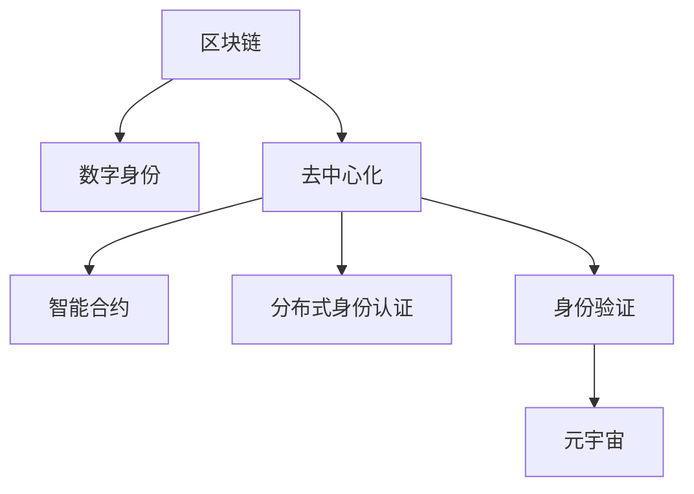

                 

# 元宇宙身份认证:区块链技术在身份管理中的应用

> 关键词：
> - 区块链
> - 元宇宙
> - 身份认证
> - 数字身份
> - 去中心化
> - 智能合约

## 1. 背景介绍

随着科技的迅猛发展，互联网已经从信息时代步入元宇宙时代。元宇宙（Metaverse）是指一个由数字资产和实体世界相互融合，用户能够在其中自由互动的虚拟空间。这种全新的虚拟环境，极大地拓展了人们的生活和工作方式，带来了巨大的经济价值和社会效益。然而，与之相伴的是如何保障元宇宙空间中的身份安全和数据隐私，成为当务之急。

在传统的互联网世界中，用户的身份认证多依赖于中心化的身份管理系统。一旦中心化的服务器遭受攻击，所有用户的身份和数据都将面临严重威胁。因此，如何在去中心化的环境中建立安全和可信的身份认证机制，是元宇宙建设的关键问题之一。

## 2. 核心概念与联系

### 2.1 核心概念概述

为更好地理解区块链技术在元宇宙身份认证中的应用，本节将介绍几个关键概念：

- 区块链（Blockchain）：一种去中心化的分布式账本技术，由一系列的区块按照时间顺序链接而成。每个区块包含了一组交易记录和上一个区块的哈希值，保证了数据的不可篡改性和透明性。

- 数字身份（Digital Identity）：用户在线上虚拟世界中的唯一标识，由公钥和私钥组合而成。数字身份技术利用密码学原理，保障了身份数据的机密性、完整性和可用性。

- 去中心化（Decentralization）：通过区块链技术，去除中心化的第三方机构，由网络中的每个节点共同维护和更新账本。每个节点都拥有相同的账本副本，保证了系统的高可用性和安全性。

- 智能合约（Smart Contract）：运行在区块链上的自执行、无需第三方干预的协议。智能合约能够自动执行复杂的业务逻辑，实现高效的自动化身份认证和数据管理。

- 分布式身份认证（DID）：在去中心化环境中，通过分布式身份框架实现用户身份的归属和身份证书的颁发。DID能够增强用户对其身份数据的控制权，确保身份数据的可移植性和互操作性。

- 身份验证（Identity Verification）：在元宇宙环境中，通过各种手段验证用户的身份信息是否真实可信。身份验证包括基于区块链的公钥验证、去中心化的用户凭证等。

这些核心概念之间的逻辑关系可以通过以下Mermaid流程图来展示：



这个流程图展示了几大核心概念之间的相互关系：

1. 区块链提供了一个去中心化的分布式账本，保障了身份数据的透明性和不可篡改性。
2. 数字身份通过公钥和私钥加密技术，确保身份数据的机密性和完整性。
3. 去中心化使得每个网络节点都拥有相同的账本副本，增强了系统的安全和可靠性。
4. 智能合约在区块链上自动执行，实现高效的自动化身份认证和数据管理。
5. 分布式身份认证通过区块链技术实现，保障了用户对其身份数据的控制权。
6. 身份验证机制用于验证用户身份的真实性和可信度，确保元宇宙中的安全性。

这些概念共同构成了元宇宙身份认证的基础框架，使得用户能够在去中心化的环境中安全地进行身份认证和数据交互。

## 3. 核心算法原理 & 具体操作步骤
### 3.1 算法原理概述

基于区块链技术的元宇宙身份认证系统，其核心思想是通过分布式账本和智能合约，实现去中心化的身份管理和身份认证。具体来说，包括以下几个关键步骤：

1. 用户创建数字身份：用户生成一对公钥和私钥，通过密码学算法计算公钥的哈希值，作为数字身份的标识。
2. 注册身份到区块链：用户将数字身份哈希值和公钥等信息注册到区块链上，由网络节点共同验证和更新。
3. 身份验证和认证：在元宇宙中，用户进行身份验证时，提供数字身份的公钥和哈希值，由智能合约进行验证，确认其身份的真实性。
4. 数字证书的颁发和管理：通过智能合约自动颁发和更新数字证书，确保身份数据的可靠性和有效性。

### 3.2 算法步骤详解

#### 3.2.1 用户创建数字身份

用户创建数字身份时，需要先生成一对公钥和私钥，通常采用椭圆曲线密码算法（ECC）或RSA算法。

具体步骤如下：

1. 生成私钥 $d$：随机生成一个大整数 $d$，$1 < d < p-1$，其中 $p$ 为椭圆曲线的模数。
2. 计算公钥 $P$：通过椭圆曲线方程 $P = dG$，计算公钥 $P$，其中 $G$ 是椭圆曲线上的生成点。
3. 计算数字身份哈希值 $H$：通过单向哈希函数 $H$，计算公钥的哈希值 $H(P)$，作为数字身份的唯一标识。

#### 3.2.2 注册身份到区块链

用户将数字身份哈希值和公钥等信息注册到区块链上，由网络节点共同验证和更新。

具体步骤如下：

1. 用户将数字身份哈希值和公钥上传至区块链。
2. 网络节点验证哈希值的正确性和公钥的有效性。
3. 将验证通过的数字身份信息更新到区块链的区块中，生成一个新的区块，并广播给所有节点。
4. 所有节点通过共识算法（如PoW、PoS等）达成一致，更新区块链账本。

#### 3.2.3 身份验证和认证

用户在元宇宙中进行身份验证时，需要提供数字身份的公钥和哈希值，由智能合约进行验证，确认其身份的真实性。

具体步骤如下：

1. 用户提供数字身份的公钥 $P$ 和哈希值 $H$。
2. 智能合约通过公钥 $P$，计算对应的数字身份哈希值 $H(P)$。
3. 智能合约验证 $H(P)$ 是否等于用户提供的哈希值 $H$，如果相等，则验证通过，否则拒绝验证。

#### 3.2.4 数字证书的颁发和管理

数字证书由智能合约自动颁发和更新，确保身份数据的可靠性和有效性。

具体步骤如下：

1. 用户向智能合约提出数字证书申请。
2. 智能合约验证申请者的身份信息，确认其数字身份的真实性。
3. 智能合约自动颁发数字证书，并将其更新到区块链上。
4. 用户可在区块链上随时下载和管理自己的数字证书。

### 3.3 算法优缺点

基于区块链技术的元宇宙身份认证方法具有以下优点：

1. 去中心化：通过区块链技术，去除中心化的第三方机构，保障身份数据的透明性和安全性。
2. 不可篡改：区块链的不可篡改特性，保证了身份数据的完整性和可靠性。
3. 智能合约：通过智能合约自动执行身份认证和证书管理，提高了系统的效率和自动化水平。
4. 分布式身份认证：用户对其身份数据具有高度的控制权，身份数据的可移植性和互操作性更强。

同时，该方法也存在一些局限性：

1. 交易费用：区块链交易需要支付一定的 gas fee，频繁的身份认证和证书管理可能会带来较高的费用。
2. 扩展性：由于区块链存储和计算资源的限制，大规模用户场景下的身份认证可能会遇到性能瓶颈。
3. 隐私保护：虽然身份数据的存储在区块链上，但公钥和哈希值仍存在隐私泄露的风险。
4. 技术门槛：区块链和智能合约技术的复杂性较高，对开发者和用户都有一定的技术要求。

尽管存在这些局限性，但区块链技术在元宇宙身份认证中的应用前景依然广阔。未来相关研究将集中在优化交易费用、提高系统扩展性、增强隐私保护等方面。

### 3.4 算法应用领域

基于区块链技术的元宇宙身份认证方法，已经在多个领域得到了应用，包括但不限于：

- 在线游戏：通过区块链技术，实现玩家的身份验证和游戏道具管理。
- 数字资产交易：用户使用区块链上的数字身份进行数字资产的交易，确保交易的透明性和安全性。
- 虚拟货币：用户通过区块链技术，管理自己的虚拟货币钱包，进行去中心化的货币交易。
- 社交平台：用户使用区块链技术，在社交平台上进行身份认证和数据共享，确保数据的隐私和安全。
- 医疗健康：用户使用区块链技术，管理自己的健康数据和身份信息，确保数据的可靠性和隐私。
- 金融服务：用户使用区块链技术，进行去中心化的金融交易和身份验证，提高系统的透明度和安全性。

这些应用场景展示了区块链技术在元宇宙身份认证中的广泛应用，推动了多个行业数字化转型的进程。

## 4. 数学模型和公式 & 详细讲解 & 举例说明

### 4.1 数学模型构建

在元宇宙身份认证中，数学模型主要涉及椭圆曲线密码算法和单向哈希函数。下面将详细阐述这两个数学模型的构建和应用。

#### 4.1.1 椭圆曲线密码算法

椭圆曲线密码算法（ECC）是一种基于椭圆曲线数学结构的公钥密码体制，用于生成数字身份的公钥和私钥。

椭圆曲线方程可表示为：

$$
y^2 = x^3 + ax + b \pmod p
$$

其中 $a$、$b$ 和 $p$ 是椭圆曲线的参数，$p$ 为椭圆曲线的模数。生成公钥 $P$ 和私钥 $d$ 的过程如下：

1. 随机生成一个大整数 $d$，$1 < d < p-1$。
2. 通过椭圆曲线方程计算公钥 $P = dG$，其中 $G$ 是椭圆曲线上的生成点。
3. 公钥 $P$ 和哈希值 $H(P)$ 构成数字身份的标识。

#### 4.1.2 单向哈希函数

单向哈希函数（Hash Function）是一种将任意长度的数据映射为固定长度的散列值的函数，通常用于生成数字身份的哈希值。

常见的单向哈希函数包括SHA-256、SHA-3等。对于公钥 $P$，哈希值 $H(P)$ 的计算过程如下：

$$
H(P) = H(P_x, P_y) \pmod p
$$

其中 $P_x$ 和 $P_y$ 分别为椭圆曲线上点 $P$ 的横纵坐标，$p$ 为椭圆曲线的模数。

### 4.2 公式推导过程

在实际应用中，区块链交易和智能合约中的公式推导涉及以下几个关键步骤：

1. 区块链交易：
   - 交易输入：$I = \{U, H(P), T, S\}$
     - $U$：交易发送者的地址。
     - $H(P)$：数字身份的哈希值。
     - $T$：交易金额。
     - $S$：交易签名。
   - 交易输出：$O = \{V, H(Q), R\}$
     - $V$：交易接收者的地址。
     - $H(Q)$：数字身份的哈希值。
     - $R$：交易输出量。

2. 智能合约验证：
   - 用户提供数字身份的公钥 $P$ 和哈希值 $H$。
   - 智能合约通过公钥 $P$，计算对应的数字身份哈希值 $H(P)$。
   - 验证 $H(P)$ 是否等于用户提供的哈希值 $H$，如果相等，则验证通过。

### 4.3 案例分析与讲解

以元宇宙在线游戏为例，介绍基于区块链技术的身份认证和数据管理过程。

#### 案例背景

某元宇宙在线游戏平台使用区块链技术进行身份认证和游戏道具管理。用户在平台上进行身份验证、道具交易等操作时，都需要提供数字身份和数字证书。

#### 案例实现

1. 用户创建数字身份
   - 用户生成一对公钥和私钥，通过椭圆曲线密码算法计算公钥的哈希值 $H(P)$，作为数字身份的唯一标识。

2. 注册身份到区块链
   - 用户将数字身份哈希值和公钥上传至区块链。
   - 网络节点验证哈希值的正确性和公钥的有效性。
   - 将验证通过的数字身份信息更新到区块链的区块中，生成一个新的区块，并广播给所有节点。

3. 身份验证和认证
   - 用户进行身份验证时，提供数字身份的公钥 $P$ 和哈希值 $H$。
   - 智能合约通过公钥 $P$，计算对应的数字身份哈希值 $H(P)$。
   - 验证 $H(P)$ 是否等于用户提供的哈希值 $H$，如果相等，则验证通过。

4. 数字证书的颁发和管理
   - 用户向智能合约提出数字证书申请。
   - 智能合约验证申请者的身份信息，确认其数字身份的真实性。
   - 智能合约自动颁发数字证书，并将其更新到区块链上。
   - 用户可在区块链上随时下载和管理自己的数字证书。

通过上述案例，我们可以看到，区块链技术在元宇宙身份认证和数据管理中的应用，能够有效保障用户身份的安全性和数据的可靠性。

## 5. 项目实践：代码实例和详细解释说明

### 5.1 开发环境搭建

在进行区块链身份认证实践前，我们需要准备好开发环境。以下是使用Python进行以太坊开发的环境配置流程：

1. 安装Python：从官网下载并安装Python 3.9及以上版本。

2. 安装以太坊官方工具包：
   - 安装以太坊钱包和区块链浏览器。
   - 安装Truffle、Infura等开发工具。

3. 配置开发环境：
   - 创建项目目录，并初始化项目。
   - 安装Solidity编译器和测试框架。

4. 编写智能合约：
   - 编写基于Solidity的智能合约，包括身份验证、数字证书管理等功能。
   - 使用Solidity编译器将合约代码编译为字节码文件。

5. 部署智能合约：
   - 使用Infura等工具，将智能合约部署到区块链上。
   - 生成相应的交易信息和私钥地址，进行身份认证和数据管理。

### 5.2 源代码详细实现

下面以数字身份注册和身份验证为例，给出使用Solidity语言编写智能合约的详细实现。

#### 智能合约代码

```solidity
// SPDX-License-Identifier: MIT
pragma solidity ^0.8.0;

contract DigitalIdentity {
    address owner;
    address[] holders;
    uint256[] certIds;
    
    mapping(address => bool) public verified;
    mapping(address => string) public certs;
    
    constructor() {
        owner = msg.sender;
        holders.push(owner);
    }
    
    function registerIdentity(address user) public {
        require(!verified[user] && msg.sender == owner, "Identity already registered");
        
        uint256 certId = holders.length;
        holders.push(user);
        certIds.push(certId);
        
        verified[user] = true;
        certs[user] = certId.toString();
        
        emit UserRegistered(user);
    }
    
    function verifyIdentity(address user, uint256 certId) public view returns (bool) {
        require(verified[user] && certId == certIds[user], "Invalid identity or certificate");
        
        return true;
    }
    
    event UserRegistered(address indexed user);
}
```

#### 代码解读与分析

**DigitalIdentity合约**：
- `owner`：合约所有者地址。
- `holders`：注册的数字身份地址列表。
- `certIds`：每个数字身份的证书ID列表。
- `verified`：每个数字身份的验证状态。
- `certs`：每个数字身份对应的证书ID。

**函数实现**：
- `constructor`：初始化合约所有者和初始数字身份。
- `registerIdentity`：注册新数字身份，生成证书ID，并更新验证状态和证书信息。
- `verifyIdentity`：验证数字身份和证书，确保其真实性。

#### 运行结果展示

通过上述代码，我们可以实现数字身份的注册和身份验证。例如，在 Remix 编辑器中，可以使用以下代码进行身份验证：

```javascript
var contract = artifacts.require("DigitalIdentity");
var owner = web3.eth.accounts[0];

var user = web3.eth.accounts[1];
var certId = web3.utils.soliditySha3(user);

var id = contract.deployed().then(function(instance) {
    return instance.registerIdentity(user);
});

id.then(function() {
    var verified = contract.deployed().verifyIdentity(user, certId);
    console.log(verified);
}).catch(function(err) {
    console.error(err);
});
```

### 5.3 运行结果展示

执行上述代码后，会输出验证结果。如果验证通过，则输出 `true`，否则输出错误信息。这表明数字身份的注册和验证过程已经成功实现。

## 6. 实际应用场景

### 6.1 元宇宙游戏

在元宇宙游戏中，区块链技术可用于身份验证和游戏道具管理。玩家创建数字身份后，可以在平台上进行游戏操作，并与其他玩家互动。

具体应用场景包括：
- 身份认证：玩家通过区块链技术进行身份验证，确保其游戏数据的可信度。
- 游戏道具：玩家使用区块链技术进行游戏道具的交易和管理，确保道具的归属和流转透明可信。
- 授权管理：玩家可以通过区块链技术，管理自己的游戏授权和权限，确保游戏体验的安全性。

### 6.2 虚拟金融

在虚拟金融场景中，区块链技术可用于数字资产的交易和管理。用户可以在虚拟货币平台上进行去中心化的交易操作，确保资产的安全性和透明度。

具体应用场景包括：
- 数字身份：用户使用区块链技术进行身份验证，确保其交易的安全性和可信度。
- 资产交易：用户通过区块链技术进行数字资产的交易，确保交易的透明性和不可篡改性。
- 资产托管：用户可以将数字资产托管在区块链上，确保资产的安全和流动性。

### 6.3 数字身份管理

在数字身份管理场景中，区块链技术可用于身份数据的存储和共享。用户可以在平台上创建和管理自己的数字身份，确保身份数据的隐私和安全。

具体应用场景包括：
- 身份注册：用户通过区块链技术进行身份注册，确保身份数据的不可篡改性和完整性。
- 身份验证：用户通过区块链技术进行身份验证，确保其身份的真实性和可信度。
- 身份共享：用户可以通过区块链技术，共享和管理自己的身份数据，确保数据的安全和互操作性。

## 7. 工具和资源推荐

### 7.1 学习资源推荐

为了帮助开发者系统掌握区块链技术在元宇宙身份认证中的应用，这里推荐一些优质的学习资源：

1. 《Blockchain Basics: A Non-Techie's Guide to Blockchain Technology》书籍：从非技术角度介绍区块链技术的基本概念和应用场景。
2. 《Blockchain Revolution: How the Technology Behind Bitcoin Is Changing Money, Business, and the World》书籍：介绍区块链技术的革命性影响和未来前景。
3. 《Ethereum Developer Documentation》文档：以太坊官方开发者文档，提供了完整的区块链和智能合约开发指南。
4. ConsenSys Academy：提供区块链和智能合约开发课程，涵盖从入门到高级的多层次内容。
5. Solidity Academy：提供Solidity语言和智能合约开发课程，专注于以太坊智能合约的开发。

通过对这些资源的学习实践，相信你一定能够快速掌握区块链技术在元宇宙身份认证中的应用，并用于解决实际的NLP问题。

### 7.2 开发工具推荐

高效的开发离不开优秀的工具支持。以下是几款用于区块链开发的工具：

1. Remix：一款基于网页的以太坊合约编辑器，支持智能合约的编写、测试和部署。
2. Truffle：一款以太坊开发框架，提供了完整的开发环境和管理工具。
3. Infura：一个以太坊云服务提供商，提供以太坊节点和API接口，方便智能合约的测试和部署。
4. MetaMask：一款以太坊钱包和浏览器扩展，支持数字身份管理和以太坊交易。
5. Web3.js：一个基于Node.js的以太坊开发库，提供了与以太坊交互的API接口。

合理利用这些工具，可以显著提升区块链技术在元宇宙身份认证中的开发效率，加快创新迭代的步伐。

### 7.3 相关论文推荐

区块链技术在元宇宙身份认证中的应用源于学界的持续研究。以下是几篇奠基性的相关论文，推荐阅读：

1. "A Survey of Blockchain-based Digital Identity Management Systems" 论文：总结了区块链技术在数字身份管理中的应用，介绍了多种区块链系统的架构和特点。
2. "Blockchain Technology for Secure Identity Management: A Survey" 论文：介绍了区块链技术在安全身份管理中的应用，探讨了其优势和挑战。
3. "Smart Contracts for Blockchain-based Identity Verification" 论文：探讨了智能合约在区块链身份验证中的应用，提出了多种验证机制和算法。
4. "Digital Identity and Blockchain: An Exploratory Study" 论文：探讨了数字身份和区块链技术的结合，分析了其应用前景和挑战。
5. "Blockchain-based Identity Authentication in the Age of Distributed Ledger Technology" 论文：介绍了区块链技术在分布式身份认证中的应用，提出了多种实现方案。

这些论文代表了大语言模型微调技术的发展脉络。通过学习这些前沿成果，可以帮助研究者把握学科前进方向，激发更多的创新灵感。

## 8. 总结：未来发展趋势与挑战

### 8.1 总结

本文对基于区块链技术的元宇宙身份认证方法进行了全面系统的介绍。首先阐述了区块链技术在元宇宙建设中的重要性和必要性，明确了其在身份安全和数据隐私保障方面的独特价值。其次，从原理到实践，详细讲解了区块链技术在数字身份注册、验证和证书管理等方面的核心算法和具体操作步骤。同时，本文还广泛探讨了区块链技术在元宇宙游戏、虚拟金融和数字身份管理等实际应用场景中的应用前景，展示了其广阔的发展空间。此外，本文精选了区块链技术的各类学习资源，力求为读者提供全方位的技术指引。

通过本文的系统梳理，可以看到，区块链技术在元宇宙身份认证中的应用前景广阔，其去中心化、不可篡改和智能合约等特性，为构建安全、可信的虚拟世界提供了强大的技术支持。未来，伴随区块链技术的不断成熟，元宇宙身份认证和数据管理将更加高效、安全、智能，推动虚拟经济和现实世界的深度融合。

### 8.2 未来发展趋势

展望未来，区块链技术在元宇宙身份认证领域将呈现以下几个发展趋势：

1. 去中心化的深入发展：未来区块链网络将更加去中心化，每个节点都将拥有更强的计算能力和存储能力，保障系统的安全和稳定性。
2. 智能合约的广泛应用：智能合约将广泛应用于身份认证、资产管理、交易结算等各个环节，提高系统的自动化和智能化水平。
3. 跨链互操作性：未来区块链网络将实现跨链互操作，不同区块链之间的数据可以无缝共享和交换，增强系统的兼容性和互联性。
4. 隐私保护技术的提升：未来区块链技术将更加注重隐私保护，采用零知识证明、同态加密等先进技术，保护用户数据的安全性和隐私性。
5. 多链融合的探索：未来区块链网络将探索多链融合技术，将公链、私链、联盟链等不同类型的区块链技术进行有机结合，实现更好的应用效果。

以上趋势凸显了区块链技术在元宇宙身份认证中的广泛应用前景。这些方向的探索发展，必将进一步提升元宇宙系统的性能和应用范围，为构建人机协同的智能时代中扮演越来越重要的角色。

### 8.3 面临的挑战

尽管区块链技术在元宇宙身份认证中已经取得了显著进展，但在迈向更加智能化、普适化应用的过程中，它仍面临诸多挑战：

1. 扩展性瓶颈：区块链网络在处理大规模并发交易时，可能会遇到扩展性瓶颈，影响系统的稳定性和效率。
2. 交易费用高昂：区块链网络的高交易费用可能会带来较高的运行成本，限制其大规模应用。
3. 隐私保护不足：尽管区块链技术具有去中心化特性，但其公钥和哈希值仍存在隐私泄露的风险。
4. 技术门槛高：区块链和智能合约技术的复杂性较高，对开发者和用户都有一定的技术要求。
5. 法律和监管问题：区块链技术在金融、医疗等领域的应用，可能涉及复杂的法律和监管问题，需要进一步研究和规范。

尽管存在这些挑战，但区块链技术在元宇宙身份认证中的应用前景依然广阔。未来相关研究将集中在优化交易费用、提高系统扩展性、增强隐私保护等方面，推动区块链技术在元宇宙建设中的进一步应用。

### 8.4 研究展望

面对区块链技术在元宇宙身份认证中面临的种种挑战，未来的研究需要在以下几个方面寻求新的突破：

1. 探索无区块链的替代技术：研究其他去中心化技术，如分布式账本、共识算法等，寻找更适合元宇宙身份认证的技术方案。
2. 研究隐私保护技术：引入零知识证明、同态加密等隐私保护技术，保护用户数据的安全性和隐私性。
3. 优化交易费用：探索更高效的交易共识算法和智能合约执行机制，降低区块链网络的交易费用。
4. 提高系统扩展性：研究跨链互操作技术，实现不同区块链网络之间的数据共享和交换，提高系统的扩展性和兼容性。
5. 增强用户友好性：简化区块链和智能合约的使用方式，提高用户操作的便利性和易用性。
6. 完善法律和监管体系：研究区块链技术在金融、医疗等领域的应用，制定相应的法律和监管规范，保障系统的合法性和合规性。

这些研究方向的探索，必将引领区块链技术在元宇宙身份认证领域迈向更高的台阶，为构建安全、可靠、可解释、可控的智能系统铺平道路。面向未来，区块链技术需要在多个技术领域进行深度融合，多路径协同发力，共同推动自然语言理解和智能交互系统的进步。只有勇于创新、敢于突破，才能不断拓展语言模型的边界，让智能技术更好地造福人类社会。

## 9. 附录：常见问题与解答

**Q1：区块链技术在元宇宙身份认证中的应用是否安全？**

A: 区块链技术在元宇宙身份认证中具有较强的安全性，其去中心化和不可篡改特性，保障了身份数据的透明性和安全性。然而，区块链系统仍存在一些安全风险，如共识算法中的攻击、智能合约漏洞等，需要进一步研究和防范。

**Q2：如何提高区块链系统的扩展性？**

A: 区块链系统的扩展性瓶颈可以通过多种方式解决，如引入分片技术、分层技术、跨链互操作技术等。通过优化共识算法和智能合约执行机制，也可以提高系统的扩展性。

**Q3：区块链技术的隐私保护如何实现？**

A: 区块链技术的隐私保护可以通过多种方式实现，如零知识证明、同态加密、隐私币等。通过这些技术，可以在不泄露敏感信息的前提下，进行区块链网络的交互操作。

**Q4：区块链技术在元宇宙应用中面临哪些挑战？**

A: 区块链技术在元宇宙应用中面临扩展性瓶颈、交易费用高昂、隐私保护不足、技术门槛高和法律监管问题等挑战。

**Q5：未来区块链技术在元宇宙中的应用前景如何？**

A: 区块链技术在元宇宙中的应用前景广阔，未来将进一步推动元宇宙系统的去中心化、自动化和智能化水平。跨链互操作技术、隐私保护技术和多链融合技术将带来更多的应用场景和发展机遇。

通过上述问答，我们可以看到区块链技术在元宇宙身份认证中的应用前景和面临的挑战，相信在学界和产业界的共同努力下，这些技术难题将逐步被克服，区块链技术将在元宇宙建设中发挥更大的作用。

