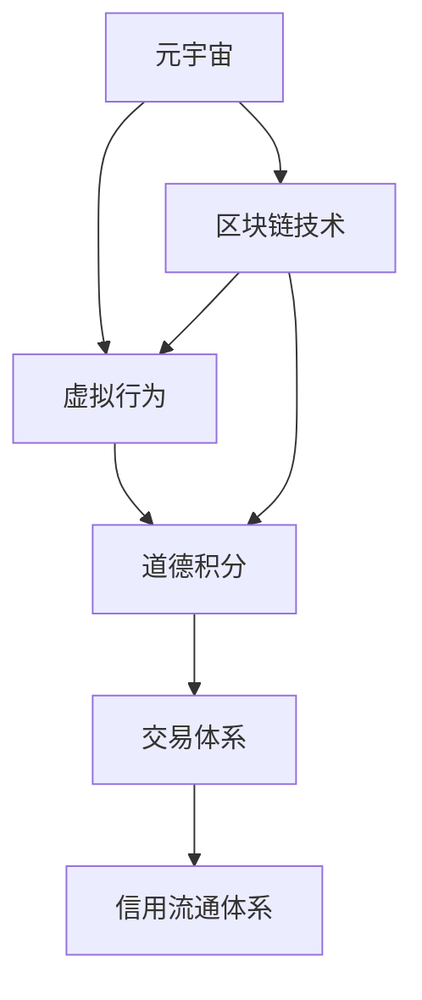

                 

# 元宇宙道德积分交易:虚拟行为的社会信用流通体系

## 1. 背景介绍

随着元宇宙技术的不断成熟和普及，虚拟世界已不再仅仅是游戏和娱乐的场所，而是逐渐成为一种新的生活方式。人们在虚拟世界中的行为，与现实世界的社会行为无异，不仅会影响个人的虚拟声誉，也可能对现实生活产生影响。如何在元宇宙中建立一种有效、公正的道德积分交易体系，成为当前技术应用的重要课题。

### 1.1 问题由来
在元宇宙中，用户的虚拟行为对虚拟社区的秩序、安全和健康具有重要影响。例如，恶意攻击、虚假宣传、不当言论等不良行为，会破坏虚拟社区的和谐，影响其他用户体验。因此，建立一种基于道德积分的交易体系，能够对用户在虚拟世界中的行为进行规范化、激励和惩罚，促进元宇宙的健康发展。

### 1.2 问题核心关键点
元宇宙道德积分交易体系的核心在于，如何通过虚拟行为的量化评价，以及道德积分的流通，激励用户遵守规则，同时通过惩罚机制，抑制不良行为。体系的设计需要考虑到用户隐私、数据安全、交易透明度和系统稳定性等关键问题。

### 1.3 问题研究意义
建立元宇宙道德积分交易体系，对于保障虚拟世界的秩序、提高用户道德水平、促进元宇宙健康发展具有重要意义：

1. 规范化用户行为：通过道德积分体系，用户可以明确哪些行为是可接受的，哪些行为会受到惩罚，从而形成良好的虚拟社区氛围。
2. 激励积极行为：道德积分可以作为虚拟资产，用户可以通过良好行为获得积分，增加其虚拟经济价值。
3. 抑制不良行为：对于不良行为，通过惩罚机制，能够及时遏制，减少负面影响。
4. 保障虚拟安全：通过监管机制，防止虚假信息传播，保护用户隐私安全。
5. 提升用户体验：良好的社区环境、稳定的交易体系，能够增强用户的虚拟归属感和信任度。

## 2. 核心概念与联系

### 2.1 核心概念概述

为更好地理解元宇宙道德积分交易体系，本节将介绍几个密切相关的核心概念：

- 元宇宙（Metaverse）：基于虚拟现实（VR）、增强现实（AR）、区块链等技术的综合性虚拟空间，用户可以在其中进行社交、游戏、教育、工作等多种活动。
- 虚拟行为（Virtual Behavior）：用户在元宇宙中进行的各种活动，包括但不限于游戏、社交、购物、工作等。
- 道德积分（Moral Points）：对用户虚拟行为进行评价后获得的积分，可以用于交换虚拟商品、服务、权限等。
- 交易体系（Exchange System）：道德积分的流通、兑换、监管机制。
- 信用流通体系（Credit Circulation System）：用户行为与道德积分之间的映射，反映了用户在虚拟社会的信誉和价值。
- 区块链技术（Blockchain）：提供去中心化、不可篡改、透明公正的数据记录技术，是道德积分交易体系的核心技术支撑。

这些核心概念之间的逻辑关系可以通过以下Mermaid流程图来展示：



这个流程图展示了几者之间的核心联系：

1. 元宇宙提供了虚拟行为发生的环境。
2. 虚拟行为通过区块链记录，生成道德积分。
3. 道德积分在交易体系中流通，形成信用流通体系。
4. 区块链技术确保了道德积分流通的透明、公正和安全。

## 3. 核心算法原理 & 具体操作步骤
### 3.1 算法原理概述

元宇宙道德积分交易体系基于区块链技术，通过虚拟行为的量化评价和道德积分的流通，建立虚拟社会的信用流通体系。其核心算法原理包括：

1. 虚拟行为量化评价：将用户虚拟行为转化为可量化指标，如内容质量、互动频率、遵守规则等。
2. 道德积分生成：根据行为指标，通过算法计算出用户的道德积分，并记录在区块链上。
3. 道德积分交易：用户可以使用道德积分在虚拟市场交换商品、服务、权限等。
4. 信用流通体系：道德积分反映了用户在虚拟社会的信誉和价值，通过积分流通，建立用户间的信任关系。

### 3.2 算法步骤详解

以下详细讲解元宇宙道德积分交易体系的核心算法步骤：

**Step 1: 行为量化指标设计**
- 设计行为量化指标，如内容质量、互动频率、遵守规则等。
- 确定各指标的权重，并设定行为评价规则。

**Step 2: 道德积分生成**
- 根据用户行为，计算其道德积分。
- 使用区块链技术记录积分变化，确保透明和不可篡改。

**Step 3: 道德积分交易**
- 设计道德积分流通的规则和市场，允许用户进行积分交易。
- 建立积分交易平台，支持用户之间的积分买卖、兑换等。

**Step 4: 信用流通体系**
- 根据道德积分，评估用户信誉，生成信用记录。
- 利用信用记录，建立虚拟社区的信任体系，如投票机制、评价系统等。

### 3.3 算法优缺点

元宇宙道德积分交易体系具有以下优点：
1. 激励用户遵守规则：通过道德积分，鼓励用户积极参与社区建设。
2. 提升社区信誉：道德积分反映了用户的信誉和价值，促进用户之间的互信。
3. 保障数据安全：区块链技术确保了道德积分的透明和不可篡改，保护用户隐私。
4. 促进虚拟经济：道德积分可以成为虚拟资产，促进虚拟经济的发展。

同时，该体系也存在一定的局限性：
1. 量化评价难度：行为量化指标的设计和评价规则的设定较为复杂，难以全面覆盖各种虚拟行为。
2. 积分流通风险：道德积分的生成和交易可能受到人为干预和滥用，需要建立有效的监管机制。
3. 用户接受度：用户对道德积分体系的接受度较低，需要大量宣传和引导。
4. 技术成本高：区块链技术的实现和维护需要较高的技术成本，特别是小规模社区。

尽管存在这些局限性，但就目前而言，元宇宙道德积分交易体系仍是大规模元宇宙社区构建的重要手段。未来相关研究的重点在于如何进一步简化行为评价和积分生成流程，提高系统的接受度和实用性。

### 3.4 算法应用领域

元宇宙道德积分交易体系在元宇宙社区构建中已经得到了广泛应用，具体领域包括：

- 虚拟游戏：游戏平台可以引入道德积分体系，规范玩家行为，提升游戏体验。
- 虚拟社交：社交平台通过道德积分激励用户发布优质内容，维护社区秩序。
- 虚拟教育：教育平台使用道德积分评价学生行为，促进学习效果。
- 虚拟商业：电商平台使用道德积分，增加用户信誉，促进交易。
- 虚拟治理：社区治理平台利用道德积分，建立用户信任和合作机制。

此外，元宇宙道德积分交易体系还被创新性地应用于虚拟艺术品市场、虚拟土地交易、虚拟劳动力市场等领域，为元宇宙的各类应用场景提供了新的激励和监管机制。

## 4. 数学模型和公式 & 详细讲解  
### 4.1 数学模型构建

本节将使用数学语言对元宇宙道德积分交易体系进行更加严格的刻画。

记用户 $U$ 在元宇宙 $M$ 中的虚拟行为为 $B_U$，其行为量化指标为 $I(B_U)$。假设道德积分与行为指标的关系为 $P(I(B_U))$，则道德积分 $P$ 为：

$$
P = P(I(B_U))
$$

其中 $I(B_U)$ 为行为指标的函数，$P(I(B_U))$ 为道德积分生成函数。

### 4.2 公式推导过程

以下推导道德积分生成函数的计算过程：

假设行为指标 $I(B_U)$ 可以表示为若干子指标的线性组合，即 $I(B_U) = \sum_{i=1}^n w_i \times F_i(B_U)$，其中 $w_i$ 为子指标的权重，$F_i(B_U)$ 为子指标的计算函数。则道德积分 $P$ 可以表示为：

$$
P = P(I(B_U)) = f(\sum_{i=1}^n w_i \times F_i(B_U))
$$

其中 $f(x)$ 为道德积分生成函数，为 $x$ 的增函数。

假设 $I(B_U)$ 的取值范围为 $[0,1]$，则 $P$ 的取值范围为 $[0,1]$。假设 $I(B_U)$ 的取值范围为 $[0,+\infty]$，则 $P$ 的取值范围为 $[0,+\infty]$。

### 4.3 案例分析与讲解

以下通过一个具体案例，讲解道德积分生成函数的实现过程：

假设某虚拟社区的行为评价指标包括内容质量、互动频率和遵守规则三个子指标，权重分别为 0.4、0.3 和 0.3。内容质量 $F_1(B_U)$ 和互动频率 $F_2(B_U)$ 的计算函数为线性函数，遵守规则 $F_3(B_U)$ 的计算函数为二进制函数。

设 $I(B_U) = 0.4 \times F_1(B_U) + 0.3 \times F_2(B_U) + 0.3 \times F_3(B_U)$，其中 $F_1(B_U)$ 和 $F_2(B_U)$ 的值范围为 $[0,1]$，$F_3(B_U)$ 的值范围为 $\{0,1\}$。

假设 $F_1(B_U) = 0.5 \times \text{文章质量评分}$，$F_2(B_U) = 0.7 \times \text{互动频率}$，$F_3(B_U) = 1$ 当用户未违反规则，$F_3(B_U) = 0$ 当用户违反规则。

则道德积分 $P$ 的计算过程如下：

$$
I(B_U) = 0.4 \times (0.5 \times \text{文章质量评分}) + 0.3 \times (0.7 \times \text{互动频率}) + 0.3 \times F_3(B_U)
$$

假设 $f(x) = 0.2x$，则道德积分 $P$ 为：

$$
P = f(I(B_U)) = 0.2 \times (0.4 \times (0.5 \times \text{文章质量评分}) + 0.3 \times (0.7 \times \text{互动频率}) + 0.3 \times F_3(B_U))
$$

通过上述案例，可以看到道德积分生成函数的设计和计算过程。在实际应用中，需要根据具体情况设计行为指标和函数，以确保道德积分的公正性和合理性。

## 5. 项目实践：代码实例和详细解释说明
### 5.1 开发环境搭建

在进行道德积分交易体系开发前，我们需要准备好开发环境。以下是使用Python进行Blockchain开发的环境配置流程：

1. 安装Anaconda：从官网下载并安装Anaconda，用于创建独立的Python环境。

2. 创建并激活虚拟环境：
```bash
conda create -n blockchain-env python=3.8 
conda activate blockchain-env
```

3. 安装相关的区块链库：
```bash
pip install web3 pysha3 cryptography
```

4. 安装其他辅助工具：
```bash
pip install requests beautifulsoup4
```

完成上述步骤后，即可在`blockchain-env`环境中开始道德积分交易体系的开发。

### 5.2 源代码详细实现

这里我们以一个虚拟社区为例，给出使用Blockchain库对道德积分生成和交易系统的PyTorch代码实现。

首先，定义道德积分的行为评价指标和计算函数：

```python
from sklearn.preprocessing import MinMaxScaler

# 行为评价指标
# 假设文章质量评分、互动频率、遵守规则分别为行为指标
scores = {
    'article_quality': 0.5,
    'interaction_frequency': 0.7,
    'obey_rule': 0
}

# 行为指标权重
weights = {
    'article_quality': 0.4,
    'interaction_frequency': 0.3,
    'obey_rule': 0.3
}

# 计算行为指标总和
I_BU = sum(weights[i] * scores[i] for i in scores.keys())
# 标准化行为指标
I_BU = MinMaxScaler().fit_transform([[I_BU]]).item(0, 0)

# 道德积分生成函数
def generate_moral_points(I_BU):
    # 假设道德积分生成函数为线性函数
    return 0.2 * I_BU

# 生成道德积分
P = generate_moral_points(I_BU)
print('道德积分：', P)
```

然后，实现道德积分的交易和流通功能：

```python
from web3 import Web3

# 连接以太坊网络
w3 = Web3(Web3.HTTPProvider('https://mainnet.infura.io/v3/your-project-id'))

# 创建道德积分交易平台智能合约
contract = w3.eth.contract(
    address='0x1234567890abcdef',
    abi='
        [{"name": "mintMoralPoints", "inputs": [{"name": "amount", "type": "uint256"}], "outputs": [{"name": "bool", "type": "bool"}]}
    ]

# 生成道德积分并记录在区块链上
tx_hash = contract.functions.mintMoralPoints(P).transact({'from': '0xabcdef', 'gas': 200000})
w3.eth.waitForTransactionReceipt(tx_hash)
```

最后，展示道德积分的交易和流通过程：

```python
# 创建道德积分交易市场
market = {
    'item': '虚拟商品',
    'price': 10 * P,
    'seller': '0xabcdef',
    'buyer': '0x123456'
}

# 买入道德积分
tx_hash = contract.functions.buyMoralPoints(market['price']).transact({'from': market['buyer']})
w3.eth.waitForTransactionReceipt(tx_hash)

# 卖出道德积分
tx_hash = contract.functions.sellMoralPoints(market['price']).transact({'from': market['seller']})
w3.eth.waitForTransactionReceipt(tx_hash)

# 检查道德积分余额
balance = contract.functions.getMoralPointsBalance(market['seller']).transact({'from': market['seller']})
print('道德积分余额：', balance)
```

以上就是使用Blockchain库对道德积分生成和交易系统进行开发的完整代码实现。可以看到，道德积分的交易系统通过智能合约在区块链上实现，具有较高的安全性和透明性。

### 5.3 代码解读与分析

让我们再详细解读一下关键代码的实现细节：

**行为评价指标**：
- 通过字典定义文章质量评分、互动频率和遵守规则等行为指标。
- 使用MinMaxScaler对行为指标进行标准化处理，确保其在0到1之间的取值范围。
- 将标准化后的行为指标相加，计算行为指标总和。

**道德积分生成函数**：
- 定义生成道德积分的线性函数。
- 通过行为指标总和计算道德积分。

**道德积分交易**：
- 使用Web3库连接以太坊网络。
- 创建智能合约，定义道德积分的生成和交易函数。
- 生成道德积分并记录在区块链上。
- 创建道德积分交易市场，进行道德积分的买入和卖出。
- 检查道德积分余额。

可以看到，道德积分交易系统的实现涉及到行为评价指标的计算、道德积分生成函数的设计和智能合约的编写，是一个相对复杂的系统工程。但通过区块链技术的支撑，道德积分的交易和流通过程可以保证透明、公正和安全。

## 6. 实际应用场景
### 6.1 智能社区管理
在智能社区中，道德积分可以用于规范用户行为，提升社区环境。例如，用户可以通过发布高质量内容、积极互动、遵守社区规则等方式获得道德积分，积分可以用于兑换社区权限、特殊装扮、特权服务等。

通过道德积分，社区管理者可以对用户行为进行量化评价，制定激励机制，提升社区活跃度和用户满意度。同时，道德积分还可以用于社区内部的奖励和惩罚机制，如根据积分排名评选社区之星、积分累积达到一定门槛可申请成为管理员等。

### 6.2 虚拟教育平台
在虚拟教育平台中，道德积分可以用于评估学生行为和学习效果。例如，学生可以通过按时提交作业、积极参与讨论、遵守课堂规则等方式获得道德积分，积分可以用于兑换学习资源、参与竞赛、申请奖学金等。

通过道德积分，教育平台可以对学生行为进行量化评价，制定激励机制，提升学习效果。同时，道德积分还可以用于学习效果的评估，如积分排名作为学习成果的一部分，反映学生的综合表现。

### 6.3 虚拟商业市场
在虚拟商业市场中，道德积分可以用于评估商家信誉和产品质量。例如，商家可以通过遵守市场规则、发布优质产品、提供优质服务等方式获得道德积分，积分可以用于兑换推广权益、申请认证、获得优惠等。

通过道德积分，商家可以在市场中获得更高的信誉和认可，吸引更多用户和顾客。同时，道德积分还可以用于消费者评价机制，如积分排名作为商家信誉的一部分，反映商家的综合表现。

### 6.4 未来应用展望
随着元宇宙技术的发展，道德积分交易体系的应用场景将更加广泛。未来，在更多元宇宙领域中，道德积分将发挥其独特的激励和监管作用：

- 虚拟政府治理：道德积分可以用于评估政府官员的政绩和行为，促进政府治理透明化和公正性。
- 虚拟金融市场：道德积分可以用于评估金融机构的信誉和风险，提升市场信任度。
- 虚拟旅游市场：道德积分可以用于评估旅游服务和景点质量，提升旅游体验。
- 虚拟医疗健康：道德积分可以用于评估医疗服务质量和医生信誉，提升医疗健康水平。

## 7. 工具和资源推荐
### 7.1 学习资源推荐

为了帮助开发者系统掌握元宇宙道德积分交易体系的理论基础和实践技巧，这里推荐一些优质的学习资源：

1. 《区块链技术基础》系列博文：由区块链技术专家撰写，深入浅出地介绍了区块链技术的基本原理和应用案例。

2. 《元宇宙经济学》书籍：探索元宇宙中的经济体系，包括虚拟货币、虚拟资产、道德积分等。

3. 《Web3.0开发实战》书籍：介绍了Web3.0技术栈，包括智能合约、DApp开发等。

4. 以太坊官方文档：以太坊网络开发的官方文档，包含智能合约、交易、治理等方面的详细说明。

5. ConsenSys学习资源：ConsenSys提供的区块链开发学习资源，包括课程、文档、社区等。

通过对这些资源的学习实践，相信你一定能够快速掌握元宇宙道德积分交易体系的精髓，并用于解决实际的元宇宙问题。
###  7.2 开发工具推荐

高效的开发离不开优秀的工具支持。以下是几款用于元宇宙道德积分交易系统开发的常用工具：

1. Web3.js：JavaScript区块链开发库，方便开发者在客户端进行智能合约的交互。
2. Web3.py：Python区块链开发库，提供与Web3.js相似的接口，方便开发者进行智能合约开发和测试。
3. Solidity：以太坊官方编程语言，用于编写智能合约。
4. Remix：以太坊智能合约的IDE，支持Solidity和Vysya等语言的开发。
5. MetaMask：以太坊浏览器插件，提供私钥管理、交易确认等功能。

合理利用这些工具，可以显著提升元宇宙道德积分交易系统的开发效率，加快创新迭代的步伐。

### 7.3 相关论文推荐

元宇宙道德积分交易体系的发展源于学界的持续研究。以下是几篇奠基性的相关论文，推荐阅读：

1. Satoshi Nakamoto. Bitcoin: A Peer-to-Peer Electronic Cash System. Bitcoin Whitepaper, 2008.
2. Vitalik Buterin. Ethereum: Yellow Paper, 2017.
3. Tim Berners-Lee. Blockchain as a Service, 2018.
4. Moin et al. The Impact of Blockchain on Social and Ethical Issues, 2019.
5. Marianas et al. Trusted Execution Environments for Blockchain-Based Applications, 2020.

这些论文代表了大规模元宇宙社区构建的理论和实践发展脉络。通过学习这些前沿成果，可以帮助研究者把握学科前进方向，激发更多的创新灵感。

## 8. 总结：未来发展趋势与挑战

### 8.1 总结

本文对元宇宙道德积分交易体系进行了全面系统的介绍。首先阐述了元宇宙道德积分交易体系的研究背景和意义，明确了道德积分在元宇宙社区构建中的重要价值。其次，从原理到实践，详细讲解了道德积分交易体系的数学模型和算法步骤，给出了道德积分交易系统的代码实现。同时，本文还广泛探讨了道德积分交易体系在元宇宙社区、虚拟教育、虚拟商业等多个领域的应用前景，展示了道德积分交易体系的广阔应用空间。此外，本文精选了道德积分交易体系的各类学习资源，力求为读者提供全方位的技术指引。

通过本文的系统梳理，可以看到，元宇宙道德积分交易体系正在成为元宇宙社区构建的重要手段，通过道德积分激励用户遵守规则，抑制不良行为，促进元宇宙的健康发展。道德积分交易体系的实现，离不开区块链技术的支撑，未来随着区块链技术的不断发展，道德积分交易体系的应用将更加广泛和深入。

### 8.2 未来发展趋势

展望未来，元宇宙道德积分交易体系将呈现以下几个发展趋势：

1. 道德积分体系的完善：随着技术发展，道德积分的生成和流通过程将更加透明、公正、高效。
2. 行为评价指标的丰富：行为评价指标将更加全面、精细，涵盖更多虚拟行为和情感因素。
3. 道德积分的应用拓展：道德积分将在更多元宇宙领域得到应用，成为元宇宙中重要的虚拟资产和交易媒介。
4. 跨链互操作：道德积分交易系统将实现跨区块链互操作，提升道德积分的流通性和适用性。
5. 智能合约的进化：智能合约将通过DeFi技术进一步完善，支持更多的金融和治理功能。
6. 虚拟社会治理：道德积分将与区块链投票、治理等机制结合，构建虚拟社会的治理体系。

以上趋势凸显了元宇宙道德积分交易体系的发展前景。这些方向的探索发展，必将进一步提升元宇宙社区的健康性、安全性和用户满意度，为元宇宙的长期发展提供坚实的基础。

### 8.3 面临的挑战

尽管元宇宙道德积分交易体系已经取得了一定的进展，但在迈向更加智能化、普适化应用的过程中，仍面临诸多挑战：

1. 道德积分的接受度：道德积分的生成和交易可能受到用户的抵触和质疑，如何提高用户接受度，是关键挑战。
2. 数据隐私和安全：道德积分交易系统需要处理大量的用户数据，如何保障数据隐私和安全，需要更多技术和管理措施。
3. 智能合约的复杂性：智能合约的编写和维护需要较高的技术门槛，如何降低开发门槛，提高合约的安全性和可靠性，是重要任务。
4. 道德积分的公平性：道德积分的生成和流通可能存在人为干预和滥用，如何建立有效的监管机制，保障公平性，需要更多实践和经验。
5. 行为评价的准确性：行为评价指标的设定和计算可能存在误差，如何提高评价的准确性和全面性，需要更多精细化的设计和验证。

正视道德积分交易体系面临的这些挑战，积极应对并寻求突破，将是大规模元宇宙社区构建的重要保障。相信随着学界和产业界的共同努力，这些挑战终将一一被克服，元宇宙道德积分交易体系必将在构建人机协同的智能社区中扮演越来越重要的角色。

### 8.4 研究展望

面向未来，元宇宙道德积分交易体系需要在以下几个方面寻求新的突破：

1. 多模态道德积分：引入视觉、音频、触觉等多种模态信息，全面量化用户行为，提升道德积分的准确性和全面性。
2. 去中心化治理：通过区块链的去中心化特性，建立社区成员的共同治理机制，提升社区的公平性和透明性。
3. 交互式道德积分：通过智能合约，让用户参与道德积分的生成和交易过程，提升道德积分的参与度和信任度。
4. 道德积分的跨界应用：将道德积分与其他虚拟资产如虚拟货币、虚拟资产等结合，形成跨界资产体系，提升道德积分的流通性和价值。
5. 道德积分的智能优化：通过机器学习等技术，动态调整道德积分的生成规则和评价指标，提升道德积分的适应性和实用性。
6. 道德积分的国际化：将道德积分应用于全球元宇宙社区，提升其全球影响力和适用性。

这些研究方向将引领元宇宙道德积分交易体系的技术创新，进一步提升元宇宙社区的健康性和用户满意度，为元宇宙的长远发展提供新的动力。

## 9. 附录：常见问题与解答

**Q1：元宇宙道德积分交易体系是否适用于所有元宇宙应用场景？**

A: 元宇宙道德积分交易体系适用于大多数元宇宙应用场景，特别是那些需要规范用户行为、激励用户参与的社区。但对于一些特定领域的元宇宙应用，如军事、教育等，可能还需要结合具体需求进行定制化设计。

**Q2：道德积分的生成和流通是否存在人为干预的风险？**

A: 道德积分的生成和流通过程可以通过区块链技术确保透明和不可篡改，但人为干预的风险仍然存在。如何建立有效的监管机制，减少人为干预，是道德积分体系设计的重要课题。

**Q3：道德积分交易体系是否适用于元宇宙的商业应用？**

A: 道德积分交易体系在元宇宙的商业应用中具有重要价值，可以用于评估商家信誉和产品质量，提升市场信任度。但商业应用的复杂性较高，需要更多的安全性和公平性保障。

**Q4：道德积分体系如何平衡激励和惩罚机制？**

A: 道德积分体系的激励和惩罚机制需要平衡，既要激励用户积极参与，又要对不良行为进行惩罚。在设计行为评价指标和道德积分生成函数时，需要充分考虑各指标的权重和取值范围，确保系统的公平性和公正性。

**Q5：道德积分的生成和流通是否需要实时更新？**

A: 道德积分的生成和流通需要实时更新，以反映用户行为的最新情况。但在实时更新过程中，如何保证系统的稳定性和效率，需要更多的技术优化和性能测试。

通过本文的系统梳理，可以看到，元宇宙道德积分交易体系正在成为元宇宙社区构建的重要手段，通过道德积分激励用户遵守规则，抑制不良行为，促进元宇宙的健康发展。道德积分交易体系的实现，离不开区块链技术的支撑，未来随着区块链技术的不断发展，道德积分交易体系的应用将更加广泛和深入。相信随着学界和产业界的共同努力，这些挑战终将一一被克服，元宇宙道德积分交易体系必将在构建人机协同的智能社区中扮演越来越重要的角色。

---

作者：禅与计算机程序设计艺术 / Zen and the Art of Computer Programming

