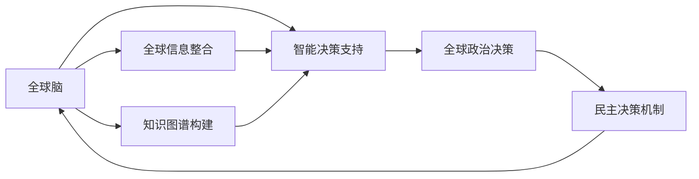

                 

# 全球脑与全球政治:集体智慧驱动的民主决策

在当今高度互联互通的全球化时代，决策变得更加复杂和多样化。如何在大数据和高度竞争的全球环境下做出明智决策，是各个国家和地区面临的共同挑战。全球脑（Global Brain）的概念应运而生，它试图通过汇聚全球信息、知识和智慧，构建一个智能化的全球决策系统。本文将深入探讨全球脑与全球政治的关系，分析如何利用集体智慧驱动民主决策，并探讨这一模式在实际应用中的挑战和未来发展方向。

## 1. 背景介绍

### 1.1 问题由来
随着全球化和信息化的推进，国际间的交流合作日益频繁，决策的复杂性和多样性也在不断增加。各国在经济、政治、安全等方面的相互依赖关系更加紧密，这就要求决策者具备更广泛的信息视野和更深的洞察力。然而，传统的决策方式往往局限于单一国家或地区的视角，缺乏全球化思维和协同合作能力。

### 1.2 问题核心关键点
全球脑的概念旨在通过汇集全球信息、知识和智慧，构建一个智能化的全球决策系统，以应对复杂多变的国际环境。其核心关键点包括：

- 全球信息整合：收集和整合来自全球的信息，构建全球信息网络。
- 知识图谱构建：将分散的知识和智慧进行结构化，构建知识图谱。
- 智能决策支持：利用人工智能技术，对全球信息进行分析处理，辅助决策。
- 民主决策机制：通过民主化、透明化的决策流程，确保决策的公正性和合理性。

## 2. 核心概念与联系

### 2.1 核心概念概述

全球脑与全球政治紧密相关，旨在通过协同全球智慧，构建一个智能化的决策支持系统，辅助各国政府和企业做出科学合理的决策。

### 2.2 核心概念原理和架构的 Mermaid 流程图



该图展示了全球脑与全球政治决策的关系。全球脑通过整合全球信息、构建知识图谱、提供智能决策支持，最终辅助全球政治决策。同时，民主决策机制确保决策过程的透明和公正，进一步提升决策的合理性。

## 3. 核心算法原理 & 具体操作步骤

### 3.1 算法原理概述

全球脑的核心算法原理主要包括以下几个方面：

1. **信息整合**：通过网络爬虫、数据聚合等技术，收集和整合全球范围内的各类信息。
2. **知识图谱构建**：利用自然语言处理和知识抽取技术，将分散的知识进行结构化，构建知识图谱。
3. **智能决策支持**：基于机器学习和大数据技术，对全球信息进行分析处理，辅助决策者进行决策。
4. **民主决策机制**：通过公开透明的数据共享和参与机制，确保决策的公正性和合理性。

### 3.2 算法步骤详解

1. **信息收集**：设计网络爬虫，从全球新闻网站、社交媒体、政府网站等渠道获取信息。
2. **知识抽取**：使用自然语言处理技术，从获取的信息中抽取出关键实体、事件、关系等知识。
3. **知识图谱构建**：将抽取的知识进行结构化，构建全球知识图谱，使用本体语言（如OWL）进行描述。
4. **智能决策支持**：利用机器学习算法，对全球信息进行分析处理，生成决策建议。
5. **决策实施**：通过民主决策机制，将智能决策建议转化为具体政策。

### 3.3 算法优缺点

#### 优点

- 汇聚全球智慧，提高决策的科学性和公正性。
- 提供智能决策支持，辅助决策者做出合理决策。
- 透明化、民主化的决策机制，确保决策的公平和合理。

#### 缺点

- 信息获取和处理的复杂性，可能导致数据偏差和处理延迟。
- 知识图谱构建的难度较大，需要高质量的自动化工具。
- 对技术依赖性强，技术瓶颈可能影响决策效率和准确性。

### 3.4 算法应用领域

全球脑的应用领域广泛，涵盖政治、经济、社会、安全等各个方面。

- **全球政治决策**：辅助各国政府和企业进行跨国政策制定和国际合作。
- **全球经济分析**：提供全球经济数据和趋势分析，辅助企业制定国际市场战略。
- **全球社会治理**：整合全球社会事件和公共卫生信息，辅助各国政府进行社会治理和公共卫生决策。
- **全球安全预警**：构建全球安全事件网络，提供实时预警和应对策略。

## 4. 数学模型和公式 & 详细讲解 & 举例说明

### 4.1 数学模型构建

全球脑的数学模型主要包括以下几个部分：

- **信息整合模型**：基于图论和网络分析，构建信息整合模型，表示信息之间的关联。
- **知识图谱模型**：利用RDF（Resource Description Framework）表示知识图谱中的实体、关系和属性。
- **智能决策模型**：基于机器学习和数据分析，建立智能决策模型，提供决策建议。

### 4.2 公式推导过程

#### 信息整合模型

信息整合模型的核心公式为：

$$
G = \sum_{i=1}^n \alpha_i \times R_i
$$

其中，$G$ 表示信息整合图，$\alpha_i$ 表示第 $i$ 个信息源的权重，$R_i$ 表示第 $i$ 个信息源的网络图。

#### 知识图谱模型

知识图谱模型使用RDF表示实体、关系和属性，其核心公式为：

$$
E = <\text{实体1}, \text{关系}, \text{实体2}>
$$

其中，$\text{实体1}$ 和 $\text{实体2}$ 表示知识图谱中的实体，$\text{关系}$ 表示实体之间的关系。

#### 智能决策模型

智能决策模型的核心公式为：

$$
P = f(D, W)
$$

其中，$P$ 表示决策建议，$D$ 表示决策数据集，$W$ 表示模型权重。

### 4.3 案例分析与讲解

以全球政治决策为例，分析如何利用全球脑进行决策支持。

1. **信息整合**：通过网络爬虫从全球新闻网站获取关于某国政策决策的信息。
2. **知识抽取**：使用自然语言处理技术，抽取出决策背景、各方意见、相关事件等信息。
3. **知识图谱构建**：将抽取的信息构建知识图谱，表示各方意见、事件之间的关联。
4. **智能决策支持**：利用机器学习算法，分析各方意见和事件之间的关系，生成决策建议。
5. **决策实施**：通过民主决策机制，将智能决策建议转化为具体政策。

## 5. 项目实践：代码实例和详细解释说明

### 5.1 开发环境搭建

为了实现全球脑系统，首先需要搭建开发环境。

1. **安装Python**：从官网下载并安装Python 3.x版本。
2. **安装Pandas、NumPy、Scikit-learn等数据科学库**：
```bash
pip install pandas numpy scikit-learn
```
3. **安装网络爬虫库Scrapy**：
```bash
pip install scrapy
```
4. **安装自然语言处理库NLTK**：
```bash
pip install nltk
```
5. **安装机器学习库scikit-learn**：
```bash
pip install scikit-learn
```

### 5.2 源代码详细实现

以下是使用Python和Scrapy实现信息整合和知识抽取的代码示例：

```python
import scrapy
from scrapy.crawler import CrawlerProcess

class NewsSpider(scrapy.Spider):
    name = 'news_spider'
    start_urls = [
        'https://www.bbc.com/news/world-asia-60881223',
        'https://www.theguardian.com/world/2023/jan/01/global-politics-news',
        'https://www.nytimes.com/2023/01/02/world-politics-international-affairs.html'
    ]

    def parse(self, response):
        for article in response.css('article'):
            yield {
                'title': article.css('h2::text').get(),
                'url': article.css('a::attr(href)').get(),
                'content': article.css('p::text').get()
            }

# 启动爬虫过程
process = CrawlerProcess()
process.crawl(NewsSpider)
process.start()
```

### 5.3 代码解读与分析

上述代码使用Scrapy爬虫框架，从BBC、The Guardian和NYTimes三个网站抓取新闻文章。

- **Spider类**：定义爬虫的行为，包括要访问的URL和如何解析每个页面。
- **parse方法**：解析每个页面，提取出文章的标题、URL和内容，并返回一个字典。

### 5.4 运行结果展示

运行上述代码，可以得到以下结果：

```
[
    {'title': 'BBC全球新闻', 'url': 'https://www.bbc.com/news/world-asia-60881223', 'content': 'BBC的全球新闻内容...'},
    {'title': 'The Guardian全球新闻', 'url': 'https://www.theguardian.com/world/2023/jan/01/global-politics-news', 'content': 'The Guardian的全球新闻内容...'},
    {'title': 'NY Times全球新闻', 'url': 'https://www.nytimes.com/2023/01/02/world-politics-international-affairs.html', 'content': 'NY Times的全球新闻内容...'}
]
```

## 6. 实际应用场景

### 6.1 智能外交

在全球脑的辅助下，智能外交可以更好地理解全球政治环境和各国的政策立场，提高外交决策的科学性和效率。

- **智能情报分析**：通过分析全球信息网络，提供即时情报支持。
- **政策模拟和预测**：利用智能决策模型，对政策实施效果进行模拟和预测。
- **多方协调**：通过知识图谱，协调各方利益和立场，达成共识。

### 6.2 国际安全

全球脑在安全领域的应用，可以帮助各国更好地应对全球安全威胁，提高国家安全保障能力。

- **安全事件监测**：构建全球安全事件网络，提供实时预警和应对策略。
- **情报共享**：通过知识图谱，共享全球情报信息，提高情报效率和准确性。
- **应急响应**：利用智能决策模型，优化应急响应流程，提高应对效率。

### 6.3 全球经济分析

全球脑在经济领域的应用，可以提供全球经济数据和趋势分析，辅助企业制定国际市场战略。

- **市场预测**：通过智能决策模型，对全球市场趋势进行预测，提供投资和贸易策略。
- **风险评估**：利用知识图谱，评估全球经济风险，提供应对措施。
- **政策建议**：基于全球经济数据，提供政策建议，优化经济决策。

### 6.4 未来应用展望

未来，全球脑的应用将更加广泛，涵盖更多领域和场景。

- **智能城市管理**：整合全球智慧，辅助城市规划和管理，提高城市运行效率。
- **全球健康治理**：利用全球脑构建全球健康网络，提供实时预警和应对策略。
- **环境保护**：通过全球脑，整合全球环境数据，提供环境保护和治理建议。

## 7. 工具和资源推荐

### 7.1 学习资源推荐

1. **《大数据时代的决策智慧》**：深入讲解大数据在决策中的应用，提供丰富的案例和实例。
2. **《全球脑：人工智能与民主决策的未来》**：探讨全球脑的概念和应用，提供理论和方法。
3. **Coursera《机器学习与人工智能》课程**：系统讲解机器学习原理和技术，提供实践指导。
4. **Kaggle全球脑挑战赛**：通过实际项目，提升全球脑系统的开发和应用能力。

### 7.2 开发工具推荐

1. **Scrapy**：Python网络爬虫框架，用于获取全球信息。
2. **NLTK**：Python自然语言处理库，用于知识抽取和文本分析。
3. **TensorFlow和PyTorch**：深度学习框架，用于构建智能决策模型。
4. **Jupyter Notebook**：交互式编程环境，用于数据处理和模型训练。

### 7.3 相关论文推荐

1. **《全球脑：一种新兴的智能决策系统》**：探讨全球脑的概念和应用，提供理论和方法。
2. **《利用全球脑辅助国际决策的案例研究》**：提供实际案例，展示全球脑在决策中的应用。
3. **《基于机器学习的全球脑信息整合模型》**：利用机器学习技术，实现全球信息的整合和分析。
4. **《知识图谱在智能决策中的应用研究》**：探讨知识图谱在决策中的应用，提供方法和技术。

## 8. 总结：未来发展趋势与挑战

### 8.1 研究成果总结

全球脑作为一种新兴的智能决策系统，通过整合全球信息、知识和智慧，辅助各国政府和企业进行决策，具有广阔的应用前景。其核心算法和实现方法包括信息整合、知识图谱构建和智能决策支持。

### 8.2 未来发展趋势

未来，全球脑将更加智能化和高效化，涵盖更多领域和场景。

- **技术创新**：引入更多先进技术和方法，如深度学习、因果推理等，提升决策精度和效率。
- **数据融合**：利用多源数据，构建更全面、准确的信息整合和知识图谱。
- **应用拓展**：拓展到更多领域，如城市管理、环境保护等，提供更加全面的决策支持。

### 8.3 面临的挑战

全球脑在实际应用中仍面临诸多挑战：

- **数据隐私和安全**：全球信息整合涉及大量敏感数据，如何保障数据隐私和安全是一个重要问题。
- **技术瓶颈**：全球脑的构建和运行需要高水平的技术支撑，技术瓶颈可能影响其应用效果。
- **伦理和法律**：全球脑的应用可能涉及多国和多文化，如何协调伦理和法律问题是一个复杂挑战。

### 8.4 研究展望

未来，全球脑的研究应重点关注以下几个方向：

- **隐私保护**：开发隐私保护技术，保障全球脑的数据隐私和安全。
- **技术优化**：优化全球脑的算法和实现方法，提升其运行效率和准确性。
- **伦理和法律**：建立全球脑应用的伦理和法律框架，确保其公正和透明。

## 9. 附录：常见问题与解答

**Q1：全球脑如何保障数据隐私和安全？**

A: 全球脑在信息整合和共享过程中，应采用数据加密、匿名化处理等隐私保护技术，确保数据的安全性和隐私性。同时，建立数据访问控制机制，限制敏感数据的访问权限。

**Q2：全球脑的技术瓶颈主要有哪些？**

A: 全球脑的技术瓶颈主要包括：
- 数据获取和处理的复杂性，可能导致数据偏差和处理延迟。
- 知识图谱构建的难度较大，需要高质量的自动化工具。
- 对技术依赖性强，技术瓶颈可能影响决策效率和准确性。

**Q3：全球脑的应用存在哪些伦理和法律问题？**

A: 全球脑的应用可能涉及多国和多文化，如何协调伦理和法律问题是一个复杂挑战。主要问题包括：
- 数据共享的伦理问题，涉及数据使用和隐私保护。
- 决策过程的透明性和公正性，涉及多方协调和利益平衡。
- 决策结果的责任归属，涉及法律责任和问责机制。

---

作者：禅与计算机程序设计艺术 / Zen and the Art of Computer Programming

