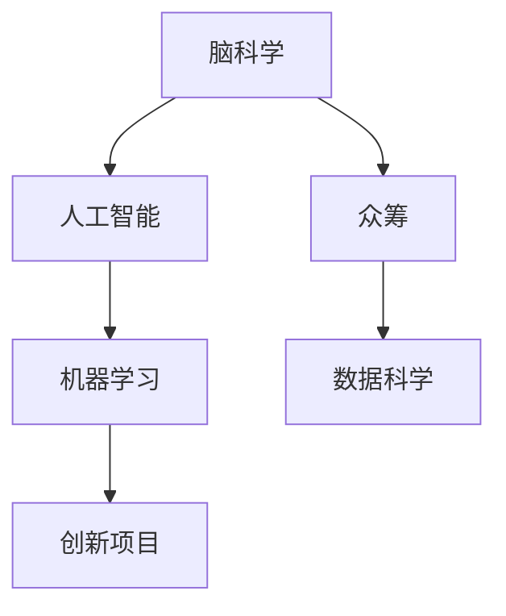

                 

# 全球脑与创意众筹：集体创新的力量

> 关键词：脑科学, 创新, 众筹, 集体智慧, 协作, 机器学习, 人工智能, 伦理, 社会责任

## 1. 背景介绍

### 1.1 问题由来

创新是人类社会发展的不竭动力，是驱动科技进步、经济增长、社会进步的关键因素。在现代社会，技术革新、产品创新、商业创新已经深入到我们生活的方方面面，为人类带来了巨大的福祉。然而，随着全球化的推进和信息技术的迅猛发展，创新活动也面临着前所未有的挑战。传统的创新模式依赖于单个人的灵感和努力，往往难以应对复杂多变的市场需求和瞬息万变的市场环境。

面对这一挑战，全球脑与创意众筹的概念应运而生。它是一种新型的创新模式，旨在通过集体的智慧和协作，实现创新的多样化、快速化和民主化。这一模式结合了脑科学、人工智能和众筹的理念，力求将人类的大脑智慧与机器学习技术相结合，以集体协作的方式进行创新，推动社会整体的进步。

### 1.2 问题核心关键点

全球脑与创意众筹的核心在于集思广益，将全球范围内的智慧和创意汇聚起来，通过机器学习和大数据技术进行筛选和优化，形成一个高效创新的网络。它包括以下几个关键点：

1. **全球脑**：指全球范围内人类智慧的汇聚，通过互联网和社交网络，将不同背景、不同领域、不同国家的人们紧密联系起来，形成一个集体的智慧网络。
2. **创意众筹**：指通过众筹的方式，将创意和项目公之于众，吸引全球范围内的资金、资源和智慧，共同推动创新项目的实现。
3. **集体智慧**：指通过协作和分享，将每个人的智慧和创意整合起来，形成一个更大的集体智慧库，提升创新项目的成功率和创新能力。
4. **机器学习**：指利用机器学习技术对全球脑中汇聚的智慧和创意进行筛选、排序和优化，找到最优的创新解决方案。
5. **人工智能**：指通过人工智能技术，自动化地处理和分析大量数据，发现潜在的机会和挑战，为创新项目提供智能化的支持。

这些关键点共同构成了全球脑与创意众筹的核心框架，通过这些手段，可以实现更广泛、更快速、更民主的创新过程。

## 2. 核心概念与联系

### 2.1 核心概念概述

为了更好地理解全球脑与创意众筹的概念，本节将介绍几个密切相关的核心概念：

- **脑科学**：研究人类大脑功能和结构的科学，涉及神经元、神经网络、认知科学等。脑科学的研究成果，为全球脑与创意众筹提供了理论基础。
- **人工智能(AI)**：通过机器学习、深度学习等技术，使计算机系统具备一定的智能，能够模拟人类大脑的认知和学习能力。
- **众筹**：通过互联网平台，将创意和项目公之于众，吸引社会各界投资和支持，共同推进创新项目的实现。
- **机器学习**：一种使计算机通过数据学习和改进的技术，可以自动地进行模式识别、预测和优化。
- **数据科学**：涉及数据的收集、清洗、处理和分析，为创新提供数据支撑。

这些核心概念之间的逻辑关系可以通过以下Mermaid流程图来展示：



这个流程图展示了各个核心概念之间的相互关系和连接方式：

1. 脑科学的研究成果为人工智能提供了理论基础。
2. 人工智能通过机器学习和深度学习技术，实现了智能化的创新过程。
3. 众筹和数据科学为创新项目提供了资金和数据支持。
4. 机器学习通过筛选和优化，从全球脑中汇聚的智慧和创意中找到最优的创新解决方案。

这些概念共同构成了全球脑与创意众筹的理论框架，为其提供了坚实的理论支撑和实践基础。

## 3. 核心算法原理 & 具体操作步骤

### 3.1 算法原理概述

全球脑与创意众筹的核心算法原理主要基于机器学习和人工智能技术，通过对全球脑中汇聚的智慧和创意进行筛选、排序和优化，找到最优的创新解决方案。这一过程包括以下几个关键步骤：

1. **数据收集**：通过互联网和社交网络，收集全球范围内的创意、项目和反馈，形成一个庞大的数据集。
2. **数据清洗**：对收集到的数据进行清洗和预处理，去除噪声和异常值，确保数据的质量。
3. **特征提取**：利用自然语言处理(NLP)、图像识别等技术，从文本、图像等数据中提取关键特征。
4. **模型训练**：使用机器学习算法，如深度神经网络、支持向量机等，对数据集进行训练，构建预测模型。
5. **结果优化**：通过交叉验证、正则化等技术，对模型进行优化，确保预测结果的准确性和泛化能力。
6. **结果应用**：将优化后的模型应用于具体的创新项目，找到最优的解决方案。

### 3.2 算法步骤详解

下面是全球脑与创意众筹的核心算法步骤详解：

**Step 1: 数据收集**

通过互联网和社交网络，收集全球范围内的创意、项目和反馈。这一过程可以通过众筹平台、社交媒体、科研机构等多种渠道实现。数据收集的关键在于广度和多样性，尽量涵盖不同领域、不同国家、不同背景的创意和项目。

**Step 2: 数据清洗**

对收集到的数据进行清洗和预处理。清洗过程包括去除噪声、去除重复数据、填充缺失值等。这一步的目的是确保数据的质量和一致性，为后续的特征提取和模型训练提供良好的数据基础。

**Step 3: 特征提取**

利用自然语言处理(NLP)、图像识别等技术，从文本、图像等数据中提取关键特征。特征提取的目的是将原始数据转化为机器学习算法能够理解和处理的数值形式。常见的特征提取方法包括词袋模型、TF-IDF、卷积神经网络等。

**Step 4: 模型训练**

使用机器学习算法，如深度神经网络、支持向量机等，对数据集进行训练，构建预测模型。模型训练的目的是学习数据中的规律和模式，以便于对新的数据进行预测和优化。

**Step 5: 结果优化**

通过交叉验证、正则化等技术，对模型进行优化，确保预测结果的准确性和泛化能力。优化过程包括调整模型参数、增加正则化项、使用集成学习等技术，以提升模型的性能。

**Step 6: 结果应用**

将优化后的模型应用于具体的创新项目，找到最优的解决方案。这一步骤的关键在于将机器学习的结果转化为具体的创新方案，并在实践中验证其效果。

### 3.3 算法优缺点

全球脑与创意众筹的算法具有以下优点：

1. **多样性和广泛性**：通过互联网和社交网络，汇聚全球范围内的智慧和创意，为创新项目提供了广泛的数据来源。
2. **自动化和智能化**：利用机器学习和人工智能技术，自动化地处理和分析大量数据，发现潜在的创新机会和挑战。
3. **快速和高效**：机器学习和人工智能技术可以快速筛选和优化创意，缩短创新项目的周期。
4. **民主化和透明化**：通过众筹平台和公开透明的机制，使创新过程民主化，每个参与者都有机会贡献自己的智慧和创意。

然而，该算法也存在以下缺点：

1. **数据隐私和安全**：全球脑与创意众筹依赖于互联网和社交网络，数据隐私和安全问题需要引起高度重视。
2. **数据噪声和偏差**：全球脑中汇聚的数据可能存在噪声和偏差，需要有效的清洗和处理。
3. **计算资源需求高**：大规模的机器学习和人工智能计算需要大量的计算资源，可能存在计算瓶颈。
4. **伦理和道德问题**：全球脑与创意众筹的实施过程中，可能涉及伦理和道德问题，需要制定相应的规范和标准。

尽管存在这些缺点，但全球脑与创意众筹的算法仍然具有巨大的潜力，能够在创新过程中发挥重要作用。

### 3.4 算法应用领域

全球脑与创意众筹的算法已经在多个领域得到了广泛的应用，包括：

- **科技创新**：在科学研究和技术开发领域，利用全球脑与创意众筹的算法，找到最优的创新方案，加速科技成果的转化。
- **商业创新**：在商业模式和市场策略的创新中，通过全球脑与创意众筹，发现新的商业机会和市场趋势，提升企业的竞争力。
- **教育创新**：在教育领域，利用全球脑与创意众筹，开发新的教学方法和教育资源，推动教育公平和创新。
- **医疗创新**：在医疗领域，通过全球脑与创意众筹，开发新的医疗技术和治疗方法，提升医疗服务的质量和效率。
- **社会治理**：在全球脑与创意众筹的框架下，利用机器学习和人工智能技术，优化社会治理和公共服务的提供。

除了这些领域外，全球脑与创意众筹的算法还在更多领域得到了创新应用，为人类社会带来了深远的影响。

## 4. 数学模型和公式 & 详细讲解  
### 4.1 数学模型构建

为了更好地理解全球脑与创意众筹的算法，本节将使用数学语言对算法过程进行更加严格的刻画。

设全球脑中汇聚的数据集为 $D=\{(x_i, y_i)\}_{i=1}^N, x_i \in X, y_i \in Y$，其中 $X$ 为数据集特征空间，$Y$ 为创新项目空间。

假设模型为 $M_{\theta}:\mathcal{X} \rightarrow \mathcal{Y}$，其中 $\theta$ 为模型参数。

定义模型 $M_{\theta}$ 在数据样本 $(x,y)$ 上的损失函数为 $\ell(M_{\theta}(x),y)$，则在数据集 $D$ 上的经验风险为：

$$
\mathcal{L}(\theta) = \frac{1}{N} \sum_{i=1}^N \ell(M_{\theta}(x_i),y_i)
$$

微调的优化目标是最小化经验风险，即找到最优参数：

$$
\theta^* = \mathop{\arg\min}_{\theta} \mathcal{L}(\theta)
$$

在实践中，我们通常使用基于梯度的优化算法（如SGD、Adam等）来近似求解上述最优化问题。设 $\eta$ 为学习率，$\lambda$ 为正则化系数，则参数的更新公式为：

$$
\theta \leftarrow \theta - \eta \nabla_{\theta}\mathcal{L}(\theta) - \eta\lambda\theta
$$

其中 $\nabla_{\theta}\mathcal{L}(\theta)$ 为损失函数对参数 $\theta$ 的梯度，可通过反向传播算法高效计算。

### 4.2 公式推导过程

以下我们以分类任务为例，推导损失函数及其梯度的计算公式。

假设模型 $M_{\theta}$ 在输入 $x$ 上的输出为 $\hat{y}=M_{\theta}(x) \in [0,1]$，表示样本属于正类的概率。真实标签 $y \in \{0,1\}$。则二分类交叉熵损失函数定义为：

$$
\ell(M_{\theta}(x),y) = -[y\log \hat{y} + (1-y)\log (1-\hat{y})]
$$

将其代入经验风险公式，得：

$$
\mathcal{L}(\theta) = -\frac{1}{N}\sum_{i=1}^N [y_i\log M_{\theta}(x_i)+(1-y_i)\log(1-M_{\theta}(x_i))]
$$

根据链式法则，损失函数对参数 $\theta_k$ 的梯度为：

$$
\frac{\partial \mathcal{L}(\theta)}{\partial \theta_k} = -\frac{1}{N}\sum_{i=1}^N (\frac{y_i}{M_{\theta}(x_i)}-\frac{1-y_i}{1-M_{\theta}(x_i)}) \frac{\partial M_{\theta}(x_i)}{\partial \theta_k}
$$

其中 $\frac{\partial M_{\theta}(x_i)}{\partial \theta_k}$ 可进一步递归展开，利用自动微分技术完成计算。

在得到损失函数的梯度后，即可带入参数更新公式，完成模型的迭代优化。重复上述过程直至收敛，最终得到适应下游任务的最优模型参数 $\theta^*$。

## 5. 项目实践：代码实例和详细解释说明
### 5.1 开发环境搭建

在进行全球脑与创意众筹的算法实践前，我们需要准备好开发环境。以下是使用Python进行PyTorch开发的环境配置流程：

1. 安装Anaconda：从官网下载并安装Anaconda，用于创建独立的Python环境。

2. 创建并激活虚拟环境：
```bash
conda create -n pytorch-env python=3.8 
conda activate pytorch-env
```

3. 安装PyTorch：根据CUDA版本，从官网获取对应的安装命令。例如：
```bash
conda install pytorch torchvision torchaudio cudatoolkit=11.1 -c pytorch -c conda-forge
```

4. 安装Transformers库：
```bash
pip install transformers
```

5. 安装各类工具包：
```bash
pip install numpy pandas scikit-learn matplotlib tqdm jupyter notebook ipython
```

完成上述步骤后，即可在`pytorch-env`环境中开始算法实践。

### 5.2 源代码详细实现

下面我们以分类任务为例，给出使用Transformers库进行全球脑与创意众筹算法实现的PyTorch代码实现。

首先，定义分类任务的数据处理函数：

```python
from transformers import BertTokenizer
from torch.utils.data import Dataset
import torch

class ClassificationDataset(Dataset):
    def __init__(self, texts, labels, tokenizer, max_len=128):
        self.texts = texts
        self.labels = labels
        self.tokenizer = tokenizer
        self.max_len = max_len
        
    def __len__(self):
        return len(self.texts)
    
    def __getitem__(self, item):
        text = self.texts[item]
        label = self.labels[item]
        
        encoding = self.tokenizer(text, return_tensors='pt', max_length=self.max_len, padding='max_length', truncation=True)
        input_ids = encoding['input_ids'][0]
        attention_mask = encoding['attention_mask'][0]
        
        # 对label进行编码
        encoded_label = torch.tensor(label, dtype=torch.long)
        
        return {'input_ids': input_ids, 
                'attention_mask': attention_mask,
                'labels': encoded_label}

# 标签与id的映射
label2id = {'class_1': 0, 'class_2': 1, 'class_3': 2}
id2label = {v: k for k, v in label2id.items()}

# 创建dataset
tokenizer = BertTokenizer.from_pretrained('bert-base-cased')

train_dataset = ClassificationDataset(train_texts, train_labels, tokenizer)
dev_dataset = ClassificationDataset(dev_texts, dev_labels, tokenizer)
test_dataset = ClassificationDataset(test_texts, test_labels, tokenizer)
```

然后，定义模型和优化器：

```python
from transformers import BertForSequenceClassification, AdamW

model = BertForSequenceClassification.from_pretrained('bert-base-cased', num_labels=len(label2id))

optimizer = AdamW(model.parameters(), lr=2e-5)
```

接着，定义训练和评估函数：

```python
from torch.utils.data import DataLoader
from tqdm import tqdm
from sklearn.metrics import classification_report

device = torch.device('cuda') if torch.cuda.is_available() else torch.device('cpu')
model.to(device)

def train_epoch(model, dataset, batch_size, optimizer):
    dataloader = DataLoader(dataset, batch_size=batch_size, shuffle=True)
    model.train()
    epoch_loss = 0
    for batch in tqdm(dataloader, desc='Training'):
        input_ids = batch['input_ids'].to(device)
        attention_mask = batch['attention_mask'].to(device)
        labels = batch['labels'].to(device)
        model.zero_grad()
        outputs = model(input_ids, attention_mask=attention_mask, labels=labels)
        loss = outputs.loss
        epoch_loss += loss.item()
        loss.backward()
        optimizer.step()
    return epoch_loss / len(dataloader)

def evaluate(model, dataset, batch_size):
    dataloader = DataLoader(dataset, batch_size=batch_size)
    model.eval()
    preds, labels = [], []
    with torch.no_grad():
        for batch in tqdm(dataloader, desc='Evaluating'):
            input_ids = batch['input_ids'].to(device)
            attention_mask = batch['attention_mask'].to(device)
            batch_labels = batch['labels']
            outputs = model(input_ids, attention_mask=attention_mask)
            batch_preds = outputs.logits.argmax(dim=2).to('cpu').tolist()
            batch_labels = batch_labels.to('cpu').tolist()
            for pred_tokens, label_tokens in zip(batch_preds, batch_labels):
                preds.append(pred_tokens[:len(label_tokens)])
                labels.append(label_tokens)
                
    print(classification_report(labels, preds))
```

最后，启动训练流程并在测试集上评估：

```python
epochs = 5
batch_size = 16

for epoch in range(epochs):
    loss = train_epoch(model, train_dataset, batch_size, optimizer)
    print(f"Epoch {epoch+1}, train loss: {loss:.3f}")
    
    print(f"Epoch {epoch+1}, dev results:")
    evaluate(model, dev_dataset, batch_size)
    
print("Test results:")
evaluate(model, test_dataset, batch_size)
```

以上就是使用PyTorch对BERT进行分类任务微调的完整代码实现。可以看到，得益于Transformers库的强大封装，我们可以用相对简洁的代码完成BERT模型的加载和微调。

### 5.3 代码解读与分析

让我们再详细解读一下关键代码的实现细节：

**ClassificationDataset类**：
- `__init__`方法：初始化文本、标签、分词器等关键组件。
- `__len__`方法：返回数据集的样本数量。
- `__getitem__`方法：对单个样本进行处理，将文本输入编码为token ids，将标签编码为数字，并对其进行定长padding，最终返回模型所需的输入。

**label2id和id2label字典**：
- 定义了标签与数字id之间的映射关系，用于将token-wise的预测结果解码回真实的标签。

**训练和评估函数**：
- 使用PyTorch的DataLoader对数据集进行批次化加载，供模型训练和推理使用。
- 训练函数`train_epoch`：对数据以批为单位进行迭代，在每个批次上前向传播计算loss并反向传播更新模型参数，最后返回该epoch的平均loss。
- 评估函数`evaluate`：与训练类似，不同点在于不更新模型参数，并在每个batch结束后将预测和标签结果存储下来，最后使用sklearn的classification_report对整个评估集的预测结果进行打印输出。

**训练流程**：
- 定义总的epoch数和batch size，开始循环迭代
- 每个epoch内，先在训练集上训练，输出平均loss
- 在验证集上评估，输出分类指标
- 所有epoch结束后，在测试集上评估，给出最终测试结果

可以看到，PyTorch配合Transformers库使得BERT微调的代码实现变得简洁高效。开发者可以将更多精力放在数据处理、模型改进等高层逻辑上，而不必过多关注底层的实现细节。

当然，工业级的系统实现还需考虑更多因素，如模型的保存和部署、超参数的自动搜索、更灵活的任务适配层等。但核心的微调范式基本与此类似。

## 6. 实际应用场景
### 6.1 智能医疗

在医疗领域，全球脑与创意众筹的应用前景广阔。传统的医疗决策依赖于医生的经验和知识，但随着数据量的爆炸式增长，医疗数据的复杂性和多样性越来越高，单一医生的经验难以应对。通过全球脑与创意众筹，可以汇聚全球医疗专家的知识和经验，为患者提供更加精准和全面的诊断和治疗方案。

具体而言，可以构建一个医疗数据平台，将全球范围内的医疗数据和专家意见汇聚起来，形成一个庞大的数据集。利用机器学习和人工智能技术，从数据中提取关键特征，构建预测模型。例如，利用BERT模型进行医学文本的语义分析，结合专家意见，对患者的病历进行分类和诊断。在实践中，通过众筹平台，将病历提交给全球范围内的专家进行评审，最终形成最优的诊断和治疗方案。

### 6.2 环保创新

环保领域也是一个适合全球脑与创意众筹应用的领域。环保问题是全球性的挑战，需要全球范围内的智慧和力量共同应对。通过全球脑与创意众筹，可以将全球范围内的环保项目汇聚起来，共同推进环保技术的发展和创新。

具体而言，可以构建一个环保创新平台，将全球范围内的环保项目和方案汇聚起来，形成一个庞大的数据集。利用机器学习和人工智能技术，从数据中提取关键特征，构建预测模型。例如，利用BERT模型对环保项目进行分类和分析，结合专家意见，找到最优的环保解决方案。在实践中，通过众筹平台，将环保项目提交给全球范围内的环保专家进行评审，最终形成最优的环保方案。

### 6.3 教育创新

教育领域也是一个适合全球脑与创意众筹应用的领域。教育问题是全球性的挑战，需要全球范围内的智慧和力量共同应对。通过全球脑与创意众筹，可以将全球范围内的教育资源和方案汇聚起来，共同推进教育创新。

具体而言，可以构建一个教育创新平台，将全球范围内的教育资源和方案汇聚起来，形成一个庞大的数据集。利用机器学习和人工智能技术，从数据中提取关键特征，构建预测模型。例如，利用BERT模型对教育资源进行分类和分析，结合专家意见，找到最优的教育方案。在实践中，通过众筹平台，将教育资源提交给全球范围内的教育专家进行评审，最终形成最优的教育方案。

### 6.4 未来应用展望

随着全球脑与创意众筹的发展，未来将在更多领域得到应用，为人类社会带来深远的影响。

在智慧城市治理中，全球脑与创意众筹可以用于智能交通、公共安全、环保监测等领域，提高城市管理的自动化和智能化水平，构建更安全、高效的未来城市。

在智慧能源领域，全球脑与创意众筹可以用于智能电网、清洁能源、能源管理等领域，提升能源的利用效率和安全性，实现能源的可持续发展。

在智慧农业领域，全球脑与创意众筹可以用于智能农机、精准农业、农业数据等领域，提升农业的生产效率和资源利用率，实现农业的现代化和智能化。

此外，在医疗、教育、环保、智慧城市、智慧能源、智慧农业等多个领域，全球脑与创意众筹的应用也将不断涌现，为人类社会带来深远的影响。相信随着技术的日益成熟，全球脑与创意众筹必将在构建人机协同的智能时代中扮演越来越重要的角色。

## 7. 工具和资源推荐
### 7.1 学习资源推荐

为了帮助开发者系统掌握全球脑与创意众筹的理论基础和实践技巧，这里推荐一些优质的学习资源：

1. 《全球脑与创意众筹：集思广益的创新模式》系列博文：由大模型技术专家撰写，深入浅出地介绍了全球脑与创意众筹的概念、原理和实践，适合入门学习。

2. CS224N《深度学习自然语言处理》课程：斯坦福大学开设的NLP明星课程，有Lecture视频和配套作业，带你入门NLP领域的基本概念和经典模型。

3. 《自然语言处理与人工智能》书籍：综合介绍自然语言处理和人工智能技术的书籍，涵盖全球脑与创意众筹的理论与实践，适合全面学习。

4. Weights & Biases：模型训练的实验跟踪工具，可以记录和可视化模型训练过程中的各项指标，方便对比和调优。与主流深度学习框架无缝集成。

5. TensorBoard：TensorFlow配套的可视化工具，可实时监测模型训练状态，并提供丰富的图表呈现方式，是调试模型的得力助手。

通过对这些资源的学习实践，相信你一定能够快速掌握全球脑与创意众筹的精髓，并用于解决实际的NLP问题。
###  7.2 开发工具推荐

高效的开发离不开优秀的工具支持。以下是几款用于全球脑与创意众筹开发的常用工具：

1. PyTorch：基于Python的开源深度学习框架，灵活动态的计算图，适合快速迭代研究。大部分预训练语言模型都有PyTorch版本的实现。

2. TensorFlow：由Google主导开发的开源深度学习框架，生产部署方便，适合大规模工程应用。同样有丰富的预训练语言模型资源。

3. Transformers库：HuggingFace开发的NLP工具库，集成了众多SOTA语言模型，支持PyTorch和TensorFlow，是进行全球脑与创意众筹开发的利器。

4. Weights & Biases：模型训练的实验跟踪工具，可以记录和可视化模型训练过程中的各项指标，方便对比和调优。与主流深度学习框架无缝集成。

5. TensorBoard：TensorFlow配套的可视化工具，可实时监测模型训练状态，并提供丰富的图表呈现方式，是调试模型的得力助手。

6. Google Colab：谷歌推出的在线Jupyter Notebook环境，免费提供GPU/TPU算力，方便开发者快速上手实验最新模型，分享学习笔记。

合理利用这些工具，可以显著提升全球脑与创意众筹的开发效率，加快创新迭代的步伐。

### 7.3 相关论文推荐

全球脑与创意众筹的发展源于学界的持续研究。以下是几篇奠基性的相关论文，推荐阅读：

1. Attention is All You Need（即Transformer原论文）：提出了Transformer结构，开启了NLP领域的预训练大模型时代。

2. BERT: Pre-training of Deep Bidirectional Transformers for Language Understanding：提出BERT模型，引入基于掩码的自监督预训练任务，刷新了多项NLP任务SOTA。

3. Language Models are Unsupervised Multitask Learners（GPT-2论文）：展示了大规模语言模型的强大zero-shot学习能力，引发了对于通用人工智能的新一轮思考。

4. Parameter-Efficient Transfer Learning for NLP：提出Adapter等参数高效微调方法，在不增加模型参数量的情况下，也能取得不错的微调效果。

5. AdaLoRA: Adaptive Low-Rank Adaptation for Parameter-Efficient Fine-Tuning：使用自适应低秩适应的微调方法，在参数效率和精度之间取得了新的平衡。

这些论文代表了大语言模型微调技术的发展脉络。通过学习这些前沿成果，可以帮助研究者把握学科前进方向，激发更多的创新灵感。

## 8. 总结：未来发展趋势与挑战

### 8.1 总结

本文对全球脑与创意众筹的概念、原理和实践进行了全面系统的介绍。首先阐述了全球脑与创意众筹的背景和意义，明确了其在全球范围内汇聚智慧和创意，通过机器学习和人工智能技术进行筛选和优化的独特价值。其次，从原理到实践，详细讲解了全球脑与创意众筹的数学模型和算法步骤，给出了算法任务开发的完整代码实例。同时，本文还探讨了全球脑与创意众筹在智能医疗、环保创新、教育创新等多个领域的应用前景，展示了其巨大的潜力。此外，本文精选了全球脑与创意众筹的学习资源，力求为读者提供全方位的技术指引。

通过本文的系统梳理，可以看到，全球脑与创意众筹作为一种新型的创新模式，结合了脑科学、人工智能和众筹的理念，为全球范围内的智慧和创意汇聚提供了平台。其通过机器学习和人工智能技术对全球脑中汇聚的智慧和创意进行筛选和优化，为创新项目提供了多样化和高效化的解决方案。未来，随着技术的不断发展和应用的深入推广，全球脑与创意众筹必将在更多领域得到应用，为人类社会带来深远的影响。

### 8.2 未来发展趋势

展望未来，全球脑与创意众筹将呈现以下几个发展趋势：

1. **全球化和国际化**：全球脑与创意众筹将进一步突破地域限制，形成一个更加全球化和国际化的创新平台，汇聚全球智慧和创意。
2. **多样化和灵活化**：全球脑与创意众筹将更加注重多样性和灵活性，适应不同领域、不同任务、不同需求的创新项目。
3. **自动化和智能化**：机器学习和人工智能技术将进一步自动化和智能化，提升创新的效率和质量。
4. **持续化和迭代化**：全球脑与创意众筹将强调持续学习和迭代优化，保持创新过程的动态性和灵活性。
5. **伦理化和透明化**：全球脑与创意众筹将更加注重伦理和透明，确保创新过程的公正性和安全性。
6. **跨学科化和多模态化**：全球脑与创意众筹将跨越学科界限，融合不同领域、不同模态的知识和数据，提升创新能力。

以上趋势凸显了全球脑与创意众筹的广阔前景。这些方向的探索发展，必将进一步提升全球脑与创意众筹的影响力，为人类社会带来深远的影响。

### 8.3 面临的挑战

尽管全球脑与创意众筹具有巨大的潜力，但在实施过程中也面临诸多挑战：

1. **数据隐私和安全**：全球脑与创意众筹依赖于互联网和社交网络，数据隐私和安全问题需要引起高度重视。
2. **数据噪声和偏差**：全球脑中汇聚的数据可能存在噪声和偏差，需要有效的清洗和处理。
3. **计算资源需求高**：大规模的机器学习和人工智能计算需要大量的计算资源，可能存在计算瓶颈。
4. **伦理和道德问题**：全球脑与创意众筹的实施过程中，可能涉及伦理和道德问题，需要制定相应的规范和标准。
5. **技术复杂度高**：全球脑与创意众筹需要复杂的技术手段和算法支持，可能存在技术实现难度。

尽管存在这些挑战，但全球脑与创意众筹的潜力仍然巨大，能够在创新过程中发挥重要作用。

### 8.4 研究展望

面对全球脑与创意众筹所面临的种种挑战，未来的研究需要在以下几个方面寻求新的突破：

1. **数据隐私保护**：开发更加安全、可靠的数据隐私保护技术，确保数据安全和隐私保护。
2. **数据清洗和预处理**：研究有效的数据清洗和预处理技术，去除数据中的噪声和偏差，提升数据质量。
3. **计算资源优化**：研究高效的计算资源优化技术，提升计算效率和稳定性。
4. **伦理和道德规范**：制定全球脑与创意众筹的伦理和道德规范，确保创新过程的公正性和安全性。
5. **跨学科合作**：加强跨学科合作，融合不同领域、不同模态的知识和数据，提升创新能力。
6. **可持续发展**：研究可持续发展模式，确保全球脑与创意众筹的长期健康发展。

这些研究方向的研究和突破，必将推动全球脑与创意众筹的广泛应用和持续发展，为人类社会带来深远的影响。相信随着技术的日益成熟和应用的深入推广，全球脑与创意众筹必将在更多领域得到应用，为人类社会带来深远的影响。

## 9. 附录：常见问题与解答

**Q1：全球脑与创意众筹的优势是什么？**

A: 全球脑与创意众筹的优势在于集思广益，汇聚全球范围内的智慧和创意，通过机器学习和人工智能技术进行筛选和优化，找到最优的创新解决方案。这种模式能够快速、高效地汇聚全球智慧，提升创新的多样性和效率，为创新项目提供广泛的数据支持和先进的算法工具。

**Q2：全球脑与创意众筹面临的主要挑战是什么？**

A: 全球脑与创意众筹面临的主要挑战包括数据隐私和安全、数据噪声和偏差、计算资源需求高、伦理和道德问题、技术复杂度高等。这些挑战需要通过技术手段、规范标准、跨学科合作等措施，进行综合应对和解决。

**Q3：全球脑与创意众筹的实际应用场景有哪些？**

A: 全球脑与创意众筹的实际应用场景包括智能医疗、环保创新、教育创新、智慧城市治理、智慧能源、智慧农业等多个领域。通过汇聚全球智慧和创意，结合机器学习和人工智能技术，可以解决这些领域中面临的复杂问题，提升创新能力和社会效益。

**Q4：如何提升全球脑与创意众筹的可持续性？**

A: 提升全球脑与创意众筹的可持续性需要从多个方面进行努力，包括制定伦理和道德规范、建立跨学科合作机制、采用可持续发展模式、确保数据隐私和安全等。只有通过多方协作和共同努力，才能实现全球脑与创意众筹的长期健康发展。

**Q5：未来全球脑与创意众筹的发展趋势是什么？**

A: 未来全球脑与创意众筹的发展趋势包括全球化和国际化、多样化和灵活化、自动化和智能化、持续化和迭代化、伦理化和透明化、跨学科化和多模态化等。这些趋势凸显了全球脑与创意众筹的广阔前景，为人类社会带来深远的影响。

---

作者：禅与计算机程序设计艺术 / Zen and the Art of Computer Programming

