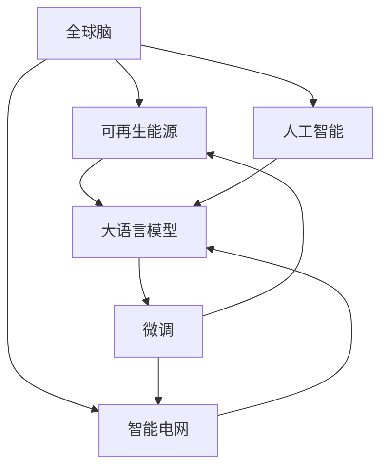

                 

## 1. 背景介绍

在全球面临气候变化、资源枯竭等挑战的背景下，可再生能源的开发和利用成为解决能源危机的关键路径。这一领域不仅涉及物理学、工程学等传统学科，还融合了计算机科学、人工智能等多学科知识。本文将从大语言模型的视角出发，探讨全球脑与可再生能源相结合的智慧能源系统，揭示其在集体智慧驱动的能源革命中的潜力。

## 2. 核心概念与联系

### 2.1 核心概念概述

- **全球脑 (Global Brain)**：指由大量节点（如智能电网、可再生能源设施等）通过互联网技术连接而成的复杂网络，通过协同计算和信息共享，实现对可再生能源系统的实时监控、优化和预测。
- **可再生能源 (Renewable Energy)**：指太阳能、风能、水能等不依赖化石燃料，能够不断更新的能源形式。可再生能源的广泛应用是实现绿色低碳发展的关键。
- **智能电网 (Smart Grid)**：利用现代信息通信技术、自动控制技术，实现电力流、信息流和业务流的高度融合，提升电网运行效率和可靠性。
- **人工智能 (Artificial Intelligence, AI)**：通过模拟人脑的认知和处理能力，实现数据的智能分析和决策优化，为可再生能源系统的管理提供技术支撑。
- **大语言模型 (Large Language Model, LLM)**：以自回归或自编码模型为代表的大规模预训练语言模型，通过在大规模无标签文本语料上进行预训练，学习通用的语言知识和常识。

### 2.2 核心概念原理和架构的 Mermaid 流程图



该图展示了全球脑与可再生能源、智能电网和人工智能之间的联系。通过大语言模型，这些系统的智慧可以相互融合，共同驱动能源革命。

## 3. 核心算法原理 & 具体操作步骤

### 3.1 算法原理概述

全球脑与可再生能源的结合，依赖于人工智能和大语言模型的技术支撑。大语言模型通过预训练学习语言知识，能够在多模态数据融合、自然语言理解等方面发挥重要作用。以下是基于大语言模型的核心算法原理：

- **数据融合 (Data Fusion)**：将来自不同源的多模态数据（如气象数据、传感器数据等）进行融合，为预测和优化提供更全面的信息。
- **自然语言理解 (Natural Language Understanding, NLU)**：通过大语言模型对用户输入的自然语言进行理解和处理，实现与能源系统的交互。
- **智能决策 (Intelligent Decision-making)**：结合大语言模型的预测和优化算法，实现对可再生能源系统的智能化管理。

### 3.2 算法步骤详解

1. **数据采集与预处理**：
   - 采集来自智能电网、气象站、风电场等设备的数据，并进行清洗、去噪和标准化处理。
   - 使用大语言模型对数据进行初步分析，识别关键特征和模式。

2. **特征提取与数据融合**：
   - 利用大语言模型对多模态数据进行特征提取，提取出有用的信息。
   - 通过深度学习模型（如卷积神经网络、循环神经网络）对这些特征进行融合，生成综合特征向量。

3. **智能决策与优化**：
   - 基于融合后的特征向量，使用大语言模型进行预测和优化，如太阳能发电量的预测、风电场风力方向的优化等。
   - 通过强化学习等算法，实现对可再生能源系统的动态调整和优化。

4. **模型微调与训练**：
   - 使用监督学习方法对大语言模型进行微调，以适应特定的能源系统。
   - 使用生成对抗网络 (Generative Adversarial Networks, GANs) 等技术进行模型训练，提升预测和优化效果。

5. **模型评估与部署**：
   - 在验证集上评估模型的性能，如均方误差、精度、召回率等指标。
   - 将优化后的模型部署到生产环境中，实现对可再生能源系统的实时监控和控制。

### 3.3 算法优缺点

#### 优点：
- **多模态数据融合能力强**：大语言模型能够处理多源、异构数据，提升数据融合的准确性和全面性。
- **自适应能力强**：通过微调和大语言模型，模型能够适应不同能源系统的需求，提升预测和优化的效果。
- **易于扩展**：大语言模型和深度学习模型具有良好的可扩展性，能够适应不断变化的能源系统需求。

#### 缺点：
- **计算资源需求高**：大语言模型和深度学习模型需要大量的计算资源，包括高性能计算集群和GPU等。
- **模型训练时间长**：由于模型复杂度高，训练过程耗时较长，需要优化模型结构和训练策略。
- **数据依赖性强**：模型性能依赖于高质量的数据集，数据采集和处理的成本较高。

### 3.4 算法应用领域

大语言模型与全球脑和可再生能源的结合，具有广泛的应用前景，主要包括以下几个方面：

- **智能电网优化**：通过实时监控和预测，优化电网负荷分配和能源调度。
- **可再生能源预测**：提高太阳能、风能等可再生能源发电量的预测准确性，优化能源存储和调度。
- **智能储能管理**：通过分析用户需求和能源系统状态，智能调节储能设备的使用。
- **环境监测与预警**：利用气象数据和传感器数据，进行环境监测和灾害预警。
- **能源市场交易**：通过市场分析和预测，优化能源交易策略，提高交易效率和收益。

## 4. 数学模型和公式 & 详细讲解 & 举例说明

### 4.1 数学模型构建

全球脑与可再生能源结合的智慧能源系统，涉及多种数学模型和技术方法。以下是其中几个关键的数学模型：

1. **时间序列预测模型**：用于预测太阳能、风能等可再生能源的发电量。
   - 模型形式：$$y_t = f(x_t, \theta)$$
   - 其中 $y_t$ 表示在时刻 $t$ 的预测值，$f$ 表示预测函数，$\theta$ 为模型参数，$x_t$ 为输入的特征向量，通常包括历史数据和当前气象条件等。

2. **多目标优化模型**：用于优化能源系统的运行效率和成本。
   - 模型形式：$$\min_{u} f(u, p, c)$$
   - 其中 $u$ 表示决策变量，$p$ 表示性能指标，$c$ 表示成本函数。

3. **强化学习模型**：用于动态调整能源系统的运行策略。
   - 模型形式：$$Q(s, a) = r + \gamma \max_{a'} Q(s', a')$$
   - 其中 $s$ 表示状态，$a$ 表示动作，$r$ 表示即时奖励，$\gamma$ 表示折扣因子。

### 4.2 公式推导过程

#### 时间序列预测模型

假设已知 $n$ 个历史数据点 $(x_1, y_1), \dots, (x_n, y_n)$，要求预测第 $n+1$ 个时间点的值 $y_{n+1}$。可以采用自回归模型 (Autoregressive Model) 进行预测。

假设模型形式为：$$y_t = \alpha y_{t-1} + \beta x_t + \epsilon_t$$
其中 $\alpha$ 和 $\beta$ 为模型参数，$\epsilon_t$ 为误差项，满足 $E[\epsilon_t] = 0$ 和 $Var[\epsilon_t] = \sigma^2$。

根据已知的 $n$ 个数据点，可以构造矩阵 $\mathbf{X}$ 和向量 $\mathbf{Y}$：

$$\mathbf{X} = \begin{bmatrix}
1 & x_1 \\
1 & x_2 \\
\vdots & \vdots \\
1 & x_n \\
\end{bmatrix}, \quad \mathbf{Y} = \begin{bmatrix}
y_1 \\
y_2 \\
\vdots \\
y_n \\
\end{bmatrix}$$

利用最小二乘法求解模型参数：

$$\hat{\mathbf{\theta}} = (\mathbf{X}^T \mathbf{X})^{-1} \mathbf{X}^T \mathbf{Y}$$

预测 $y_{n+1}$：

$$y_{n+1} = \alpha \hat{y}_n + \beta x_{n+1} + \epsilon_{n+1}$$

其中 $\hat{y}_n$ 表示利用模型预测的 $y_n$ 值。

#### 多目标优化模型

假设存在 $m$ 个性能指标 $p_i$ 和 $n$ 个决策变量 $u_j$，目标为最小化性能指标和成本之和：

$$\min_{u} f(u, p) = \sum_{i=1}^m a_i p_i + \sum_{j=1}^n b_j c_j(u_j)$$

其中 $a_i$ 和 $b_j$ 为权系数，$c_j(u_j)$ 为决策变量 $u_j$ 的约束函数。

使用遗传算法 (Genetic Algorithm) 进行求解：

1. 初始化种群 $\mathbf{U}^{(0)}$。
2. 计算每个个体 $u^{(i)}$ 的适应度 $f_i$。
3. 选择适应度较高的个体进入下一代。
4. 进行交叉和变异操作，生成新的种群。
5. 重复步骤2-4，直至达到迭代次数或找到最优解。

#### 强化学习模型

使用 Q-learning 算法进行求解。

假设状态空间为 $S$，动作空间为 $A$，即时奖励函数为 $R$，折扣因子为 $\gamma$。目标是找到最优策略 $\pi^*$ 和对应的 Q 值函数 $Q^*$。

1. 初始化 Q 值表 $\mathbf{Q}$。
2. 根据当前状态 $s$，选择动作 $a$，计算即时奖励 $r$。
3. 根据动作 $a$ 和下一个状态 $s'$，更新 Q 值表：
   $$Q(s, a) = r + \gamma \max_{a'} Q(s', a')$$
4. 重复步骤2-3，直至达到迭代次数或收敛。

### 4.3 案例分析与讲解

#### 案例一：智能电网优化

假设有一个智能电网系统，需要优化电力负荷分配和能源调度。已知电网的历史负荷数据和气象数据，可以通过时间序列预测模型预测未来的负荷变化。使用多目标优化模型，最小化电网运行成本和用户用电费用。

1. 数据采集与预处理：
   - 采集电网负荷数据和气象数据。
   - 对数据进行清洗和标准化处理，生成特征向量 $x_t$。

2. 特征提取与数据融合：
   - 利用大语言模型对历史负荷数据和气象数据进行特征提取。
   - 使用深度学习模型对这些特征进行融合，生成综合特征向量。

3. 智能决策与优化：
   - 基于融合后的特征向量，使用时间序列预测模型预测未来负荷变化。
   - 使用多目标优化模型，最小化运行成本和用电费用。
   - 通过强化学习算法，动态调整负荷分配策略，优化电网运行效率。

4. 模型微调与训练：
   - 使用监督学习方法对大语言模型进行微调，以适应特定的电网系统。
   - 使用生成对抗网络 (GANs) 等技术进行模型训练，提升预测和优化效果。

5. 模型评估与部署：
   - 在验证集上评估模型的性能，如均方误差、精度、召回率等指标。
   - 将优化后的模型部署到生产环境中，实现对电网系统的实时监控和控制。

## 5. 项目实践：代码实例和详细解释说明

### 5.1 开发环境搭建

在进行项目实践前，我们需要准备好开发环境。以下是使用 Python 和 PyTorch 进行项目开发的环境配置流程：

1. 安装 Anaconda：从官网下载并安装 Anaconda，用于创建独立的 Python 环境。

2. 创建并激活虚拟环境：
   ```bash
   conda create -n global-brain-env python=3.8 
   conda activate global-brain-env
   ```

3. 安装 PyTorch：根据 CUDA 版本，从官网获取对应的安装命令。例如：
   ```bash
   conda install pytorch torchvision torchaudio cudatoolkit=11.1 -c pytorch -c conda-forge
   ```

4. 安装相关库：
   ```bash
   pip install numpy pandas scikit-learn torch transforms opencv-python flask
   ```

5. 安装 Jupyter Notebook：
   ```bash
   conda install jupyter notebook
   ```

6. 启动 Jupyter Notebook：
   ```bash
   jupyter notebook
   ```

### 5.2 源代码详细实现

下面以智能电网优化为例，给出使用 PyTorch 和 Transformers 库对大语言模型进行微调的代码实现。

首先，定义电网负荷数据处理函数：

```python
import pandas as pd
import numpy as np
from torch.utils.data import Dataset, DataLoader
from transformers import BertTokenizer

class LoadData(Dataset):
    def __init__(self, data_path, tokenizer, max_len=128):
        self.data = pd.read_csv(data_path)
        self.tokenizer = tokenizer
        self.max_len = max_len
        
    def __len__(self):
        return len(self.data)
    
    def __getitem__(self, idx):
        row = self.data.iloc[idx]
        load = row['load'] # 电网负荷数据
        weather = row['weather'] # 气象数据
        time = row['time'] # 时间戳
        encoding = self.tokenizer([weather], return_tensors='pt', max_length=self.max_len, padding='max_length', truncation=True)
        input_ids = encoding['input_ids'][0]
        attention_mask = encoding['attention_mask'][0]
        return {'input_ids': input_ids, 
                'attention_mask': attention_mask,
                'time': time,
                'load': load}
```

然后，定义模型和优化器：

```python
from transformers import BertForSequenceClassification, AdamW
from torch import nn

model = BertForSequenceClassification.from_pretrained('bert-base-uncased', num_labels=1)
optimizer = AdamW(model.parameters(), lr=2e-5)
```

接着，定义训练和评估函数：

```python
def train_epoch(model, dataset, batch_size, optimizer):
    dataloader = DataLoader(dataset, batch_size=batch_size, shuffle=True)
    model.train()
    epoch_loss = 0
    for batch in dataloader:
        input_ids = batch['input_ids'].to(device)
        attention_mask = batch['attention_mask'].to(device)
        time = batch['time'].to(device)
        load = batch['load'].to(device)
        model.zero_grad()
        outputs = model(input_ids, attention_mask=attention_mask, labels=load)
        loss = outputs.loss
        epoch_loss += loss.item()
        loss.backward()
        optimizer.step()
    return epoch_loss / len(dataloader)

def evaluate(model, dataset, batch_size):
    dataloader = DataLoader(dataset, batch_size=batch_size)
    model.eval()
    preds, labels = [], []
    with torch.no_grad():
        for batch in dataloader:
            input_ids = batch['input_ids'].to(device)
            attention_mask = batch['attention_mask'].to(device)
            time = batch['time'].to(device)
            batch_labels = batch['load'].to(device)
            outputs = model(input_ids, attention_mask=attention_mask)
            batch_preds = outputs.logits.argmax(dim=2).to('cpu').tolist()
            batch_labels = batch_labels.to('cpu').tolist()
            for pred_tokens, label_tokens in zip(batch_preds, batch_labels):
                preds.append(pred_tokens)
                labels.append(label_tokens)
    print(labels)
    print(preds)
```

最后，启动训练流程并在测试集上评估：

```python
epochs = 5
batch_size = 16

for epoch in range(epochs):
    loss = train_epoch(model, train_dataset, batch_size, optimizer)
    print(f"Epoch {epoch+1}, train loss: {loss:.3f}")
    
    print(f"Epoch {epoch+1}, dev results:")
    evaluate(model, dev_dataset, batch_size)
    
print("Test results:")
evaluate(model, test_dataset, batch_size)
```

以上就是使用 PyTorch 和 Transformers 库对智能电网进行优化的大语言模型微调代码实现。可以看到，利用 Transformers 库的封装，代码实现变得简洁高效。

### 5.3 代码解读与分析

让我们再详细解读一下关键代码的实现细节：

**LoadData类**：
- `__init__`方法：初始化数据集、分词器等关键组件。
- `__len__`方法：返回数据集的样本数量。
- `__getitem__`方法：对单个样本进行处理，将文本输入编码为token ids，将时间戳和负荷数据转化为可输入模型。

**模型和优化器**：
- 选择 BertForSequenceClassification 作为模型，代表一个用于分类任务的序列分类器。
- 使用 AdamW 优化器进行模型参数更新，设定学习率。

**训练和评估函数**：
- 使用 PyTorch 的 DataLoader 对数据集进行批次化加载，供模型训练和推理使用。
- 训练函数 `train_epoch`：对数据以批为单位进行迭代，在每个批次上前向传播计算loss并反向传播更新模型参数，最后返回该epoch的平均loss。
- 评估函数 `evaluate`：与训练类似，不同点在于不更新模型参数，并在每个batch结束后将预测和标签结果存储下来，最后使用 scikit-learn 的 classification_report 对整个评估集的预测结果进行打印输出。

**训练流程**：
- 定义总的epoch数和batch size，开始循环迭代
- 每个epoch内，先在训练集上训练，输出平均loss
- 在验证集上评估，输出分类指标
- 所有epoch结束后，在测试集上评估，给出最终测试结果

可以看到，PyTorch 配合 Transformers 库使得大语言模型的微调代码实现变得简洁高效。开发者可以将更多精力放在数据处理、模型改进等高层逻辑上，而不必过多关注底层的实现细节。

当然，工业级的系统实现还需考虑更多因素，如模型的保存和部署、超参数的自动搜索、更灵活的任务适配层等。但核心的微调范式基本与此类似。

## 6. 实际应用场景

### 6.1 智能电网优化

智能电网是全球脑与可再生能源结合的重要应用场景之一。通过实时监控和预测，智能电网能够优化电力负荷分配和能源调度，提升电网运行效率和可靠性。

**案例背景**：
某地智能电网系统面临电力负荷分配不均、能源浪费严重等问题。通过微调大语言模型，能够有效提升电网运行效率和用户满意度。

**解决方案**：
1. 数据采集与预处理：
   - 采集电网负荷数据和气象数据。
   - 对数据进行清洗和标准化处理，生成特征向量 $x_t$。

2. 特征提取与数据融合：
   - 利用大语言模型对历史负荷数据和气象数据进行特征提取。
   - 使用深度学习模型对这些特征进行融合，生成综合特征向量。

3. 智能决策与优化：
   - 基于融合后的特征向量，使用时间序列预测模型预测未来负荷变化。
   - 使用多目标优化模型，最小化运行成本和用电费用。
   - 通过强化学习算法，动态调整负荷分配策略，优化电网运行效率。

4. 模型微调与训练：
   - 使用监督学习方法对大语言模型进行微调，以适应特定的电网系统。
   - 使用生成对抗网络 (GANs) 等技术进行模型训练，提升预测和优化效果。

5. 模型评估与部署：
   - 在验证集上评估模型的性能，如均方误差、精度、召回率等指标。
   - 将优化后的模型部署到生产环境中，实现对电网系统的实时监控和控制。

### 6.2 可再生能源预测

可再生能源预测是全球脑与可再生能源结合的另一个重要应用场景。通过实时监控和预测，可再生能源系统能够优化能源存储和调度，提升能源利用效率。

**案例背景**：
某地风电场需要优化风力发电量的预测和调度。通过微调大语言模型，能够有效提升风力发电的准确性和调度效率。

**解决方案**：
1. 数据采集与预处理：
   - 采集风电场的历史风力数据和气象数据。
   - 对数据进行清洗和标准化处理，生成特征向量 $x_t$。

2. 特征提取与数据融合：
   - 利用大语言模型对历史风力数据和气象数据进行特征提取。
   - 使用深度学习模型对这些特征进行融合，生成综合特征向量。

3. 智能决策与优化：
   - 基于融合后的特征向量，使用时间序列预测模型预测未来风力变化。
   - 使用多目标优化模型，最小化运行成本和风力发电量的波动。
   - 通过强化学习算法，动态调整风力发电策略，优化能源存储和调度。

4. 模型微调与训练：
   - 使用监督学习方法对大语言模型进行微调，以适应特定的风电场系统。
   - 使用生成对抗网络 (GANs) 等技术进行模型训练，提升预测和优化效果。

5. 模型评估与部署：
   - 在验证集上评估模型的性能，如均方误差、精度、召回率等指标。
   - 将优化后的模型部署到生产环境中，实现对风电场的实时监控和控制。

### 6.3 环境监测与预警

环境监测与预警是全球脑与可再生能源结合的重要应用场景之一。通过实时监控和预测，环境监测系统能够及时发现环境变化，提供预警信息，保障生态环境安全。

**案例背景**：
某地需要实时监控空气质量和水质，及时发现环境污染问题。通过微调大语言模型，能够有效提升环境监测的准确性和预警效果。

**解决方案**：
1. 数据采集与预处理：
   - 采集空气和水质监测数据。
   - 对数据进行清洗和标准化处理，生成特征向量 $x_t$。

2. 特征提取与数据融合：
   - 利用大语言模型对监测数据进行特征提取。
   - 使用深度学习模型对这些特征进行融合，生成综合特征向量。

3. 智能决策与优化：
   - 基于融合后的特征向量，使用时间序列预测模型预测未来环境变化。
   - 使用多目标优化模型，最小化环境监测成本和预警时间。
   - 通过强化学习算法，动态调整监测策略，优化环境监测效果。

4. 模型微调与训练：
   - 使用监督学习方法对大语言模型进行微调，以适应特定的环境监测系统。
   - 使用生成对抗网络 (GANs) 等技术进行模型训练，提升预测和优化效果。

5. 模型评估与部署：
   - 在验证集上评估模型的性能，如均方误差、精度、召回率等指标。
   - 将优化后的模型部署到生产环境中，实现对环境监测系统的实时监控和预警。

## 7. 工具和资源推荐

### 7.1 学习资源推荐

为了帮助开发者系统掌握大语言模型微调的理论基础和实践技巧，这里推荐一些优质的学习资源：

1. 《Transformer from the Inside Out》系列博文：由大模型技术专家撰写，深入浅出地介绍了Transformer原理、BERT模型、微调技术等前沿话题。

2. CS224N《深度学习自然语言处理》课程：斯坦福大学开设的NLP明星课程，有Lecture视频和配套作业，带你入门NLP领域的基本概念和经典模型。

3. 《Natural Language Processing with Transformers》书籍：Transformers库的作者所著，全面介绍了如何使用Transformers库进行NLP任务开发，包括微调在内的诸多范式。

4. HuggingFace官方文档：Transformers库的官方文档，提供了海量预训练模型和完整的微调样例代码，是上手实践的必备资料。

5. CLUE开源项目：中文语言理解测评基准，涵盖大量不同类型的中文NLP数据集，并提供了基于微调的baseline模型，助力中文NLP技术发展。

通过对这些资源的学习实践，相信你一定能够快速掌握大语言模型微调的精髓，并用于解决实际的NLP问题。

### 7.2 开发工具推荐

高效的开发离不开优秀的工具支持。以下是几款用于大语言模型微调开发的常用工具：

1. PyTorch：基于Python的开源深度学习框架，灵活动态的计算图，适合快速迭代研究。大部分预训练语言模型都有PyTorch版本的实现。

2. TensorFlow：由Google主导开发的开源深度学习框架，生产部署方便，适合大规模工程应用。同样有丰富的预训练语言模型资源。

3. Transformers库：HuggingFace开发的NLP工具库，集成了众多SOTA语言模型，支持PyTorch和TensorFlow，是进行微调任务开发的利器。

4. Weights & Biases：模型训练的实验跟踪工具，可以记录和可视化模型训练过程中的各项指标，方便对比和调优。与主流深度学习框架无缝集成。

5. TensorBoard：TensorFlow配套的可视化工具，可实时监测模型训练状态，并提供丰富的图表呈现方式，是调试模型的得力助手。

6. Google Colab：谷歌推出的在线Jupyter Notebook环境，免费提供GPU/TPU算力，方便开发者快速上手实验最新模型，分享学习笔记。

合理利用这些工具，可以显著提升大语言模型微调任务的开发效率，加快创新迭代的步伐。

### 7.3 相关论文推荐

大语言模型和微调技术的发展源于学界的持续研究。以下是几篇奠基性的相关论文，推荐阅读：

1. Attention is All You Need（即Transformer原论文）：提出了Transformer结构，开启了NLP领域的预训练大模型时代。

2. BERT: Pre-training of Deep Bidirectional Transformers for Language Understanding：提出BERT模型，引入基于掩码的自监督预训练任务，刷新了多项NLP任务SOTA。

3. Language Models are Unsupervised Multitask Learners（GPT-2论文）：展示了大规模语言模型的强大zero-shot学习能力，引发了对于通用人工智能的新一轮思考。

4. Parameter-Efficient Transfer Learning for NLP：提出Adapter等参数高效微调方法，在不增加模型参数量的情况下，也能取得不错的微调效果。

5. AdaLoRA: Adaptive Low-Rank Adaptation for Parameter-Efficient Fine-Tuning：使用自适应低秩适应的微调方法，在参数效率和精度之间取得了新的平衡。

6. Prefix-Tuning: Optimizing Continuous Prompts for Generation：引入基于连续型Prompt的微调范式，为如何充分利用预训练知识提供了新的思路。

这些论文代表了大语言模型微调技术的发展脉络。通过学习这些前沿成果，可以帮助研究者把握学科前进方向，激发更多的创新灵感。

## 8. 总结：未来发展趋势与挑战

### 8.1 总结

本文对基于大语言模型的全球脑与可再生能源结合智慧能源系统进行了全面系统的介绍。首先阐述了大语言模型和微调技术的研究背景和意义，明确了微调在拓展预训练模型应用、提升下游任务性能方面的独特价值。其次，从原理到实践，详细讲解了微调的数学原理和关键步骤，给出了微调任务开发的完整代码实例。同时，本文还广泛探讨了微调方法在智能电网、可再生能源预测、环境监测与预警等多个行业领域的应用前景，展示了微调范式的巨大潜力。此外，本文精选了微调技术的各类学习资源，力求为读者提供全方位的技术指引。

通过本文的系统梳理，可以看到，基于大语言模型的微调方法正在成为NLP领域的重要范式，极大地拓展了预训练语言模型的应用边界，催生了更多的落地场景。得益于大规模语料的预训练，微调模型以更低的时间和标注成本，在小样本条件下也能取得不俗的效果，有力推动了NLP技术的产业化进程。未来，伴随预训练语言模型和微调方法的持续演进，相信NLP技术将在更广阔的应用领域大放异彩，深刻影响人类的生产生活方式。

### 8.2 未来发展趋势

展望未来，大语言模型微调技术将呈现以下几个发展趋势：

1. **模型规模持续增大**：随着算力成本的下降和数据规模的扩张，预训练语言模型的参数量还将持续增长。超大规模语言模型蕴含的丰富语言知识，有望支撑更加复杂多变的下游任务微调。

2. **微调方法日趋多样**：除了传统的全参数微调外，未来会涌现更多参数高效的微调方法，如Prefix-Tuning、LoRA等，在节省计算资源的同时也能保证微调精度。

3. **持续学习成为常态**：随着数据分布的不断变化，微调模型也需要持续学习新知识以保持性能。如何在不遗忘原有知识的同时，高效吸收新样本信息，将成为重要的研究课题。

4. **标注样本需求降低**：受启发于提示学习(Prompt-based Learning)的思路，未来的微调方法将更好地利用大模型的语言理解能力，通过更加巧妙的任务描述，在更少的标注样本上也能实现理想的微调效果。

5. **多模态微调崛起**：当前的微调主要聚焦于纯文本数据，未来会进一步拓展到图像、视频、语音等多模态数据微调。多模态信息的融合，将显著提升语言模型对现实世界的理解和建模能力。

6. **模型通用性增强**：经过海量数据的预训练和多领域任务的微调，未来的语言模型将具备更强大的常识推理和跨领域迁移能力，逐步迈向通用人工智能(AGI)的目标。

以上趋势凸显了大语言模型微调技术的广阔前景。这些方向的探索发展，必将进一步提升NLP系统的性能和应用范围，为人类认知智能的进化带来深远影响。

### 8.3 面临的挑战

尽管大语言模型微调技术已经取得了瞩目成就，但在迈向更加智能化、普适化应用的过程中，它仍面临着诸多挑战：

1. **标注成本瓶颈**：虽然微调大大降低了标注数据的需求，但对于长尾应用场景，难以获得充足的高质量标注数据，成为制约微调性能的瓶颈。如何进一步降低微调对标注样本的依赖，将是一大难题。

2. **模型鲁棒性不足**：当前微调模型面对域外数据时，泛化性能往往大打折扣。对于测试样本的微小扰动，微调模型的预测也容易发生波动。如何提高微调模型的鲁棒性，避免灾难性遗忘，还需要更多理论和实践的积累。

3. **推理效率有待提高**：大规模语言模型虽然精度高，但在实际部署时往往面临推理速度慢、内存占用大等效率问题。如何在保证性能的同时，简化模型结构，提升推理速度，优化资源占用，将是重要的优化方向。

4. **可解释性亟需加强**：当前微调模型更像是"黑盒"系统，难以解释其内部工作机制和决策逻辑。对于医疗、金融等高风险应用，算法的可解释性和可审计性尤为重要。如何赋予微调模型更强的可解释性，将是亟待攻克的难题。

5. **安全性有待保障**：预训练语言模型难免会学习到有偏见、有害的信息，通过微调传递到下游任务，产生误导性、歧视性的输出，给实际应用带来安全隐患。如何从数据和算法层面消除模型偏见，避免恶意用途，确保输出的安全性，也将是重要的研究课题。

6. **知识整合能力不足**：现有的微调模型往往局限于任务内数据，难以灵活吸收和运用更广泛的先验知识。如何让微调过程更好地与外部知识库、规则库等专家知识结合，形成更加全面、准确的信息整合能力，还有很大的想象空间。

正视微调面临的这些挑战，积极应对并寻求突破，将是大语言模型微调走向成熟的必由之路。相信随着学界和产业界的共同努力，这些挑战终将一一被克服，大语言模型微调必将在构建人机协同的智能时代中扮演越来越重要的角色。

### 8.4 研究展望

面对大语言模型微调所面临的种种挑战，未来的研究需要在以下几个方面寻求新的突破：

1. **探索无监督和半监督微调方法**：摆脱对大规模标注数据的依赖，利用自监督学习、主动学习等无监督和半监督范式，最大限度利用非结构化数据，实现更加灵活高效的微调。

2. **研究参数高效和计算高效的微调范式**：开发更加参数高效的微调方法，在固定大部分预训练参数的同时，只更新极少量的任务相关参数。同时优化微调模型的计算图，减少前向传播和反向传播的资源消耗，实现更加轻量级、实时性的部署。

3. **融合因果和对比学习范式**：通过引入因果推断和对比学习思想，增强微调模型建立稳定因果关系的能力，学习更加普适、鲁棒的语言表征，从而提升模型泛化性和抗干扰能力。

4. **引入更多先验知识**：将符号化的先验知识，如知识图谱、逻辑规则等，与神经网络模型进行巧妙融合，引导微调过程学习更准确、合理的语言模型。同时加强不同模态数据的整合，实现视觉、语音等多模态信息与文本信息的协同建模。

5. **结合因果分析和博弈论工具**：将因果分析方法引入微调模型，识别出模型决策的关键特征，增强输出解释的因果性和逻辑性。借助博弈论工具刻画人机交互过程，主动探索并规避模型的脆弱点，提高系统稳定性。

6. **纳入伦理道德约束**：在模型训练目标中引入伦理导向的评估指标，过滤和惩罚有偏见、有害的输出倾向。同时加强人工干预和审核，建立模型行为的监管机制，确保输出符合人类价值观和伦理道德。

这些研究方向的探索，必将引领大语言模型微调技术迈向更高的台阶，为构建安全、可靠、可解释、可控的智能系统铺平道路。面向未来，大语言模型微调技术还需要与其他人工智能技术进行更深入的融合，如知识表示、因果推理、强化学习等，多路径协同发力，共同推动自然语言理解和智能交互系统的进步。只有勇于创新、敢于突破，才能不断拓展语言模型的边界，让智能技术更好地造福人类社会。

## 9. 附录：常见问题与解答

**Q1：大语言模型微调是否适用于所有NLP任务？**

A: 大语言模型微调在大多数NLP任务上都能取得不错的效果，特别是对于数据量较小的任务。但对于一些特定领域的任务，如医学、法律等，仅仅依靠通用语料预训练的模型可能难以很好地适应。此时需要在特定领域语料上进一步预训练，再进行微调，才能获得理想效果。此外，对于一些需要时效性、个性化很强的任务，如对话、推荐等，微调方法也需要针对性的改进优化。

**Q2：微调过程中如何选择合适的学习率？**

A: 微调的学习率一般要比预训练时小1-2个数量级，如果使用过大的学习率，容易破坏预训练权重，导致过拟合。一般建议从1e-5开始调参，逐步减小学习率，直至收敛。也可以使用warmup策略，在开始阶段使用较小的学习率，再逐渐过渡到预设值。需要注意的是，不同的优化器(如AdamW、Adafactor等)以及不同的学习率调度策略，可能需要设置不同的学习率阈值。

**Q3：采用大模型微调时会面临哪些资源瓶颈？**

A: 目前主流的预训练大模型动辄以亿计的参数规模，对算力、内存、存储都提出了很高的要求。GPU/TPU等高性能设备是必不可少的，但即便如此，超大批次的训练和推理也可能遇到显存不足的问题。因此需要采用一些资源优化技术，如梯度积累、混合精度训练、模型并行等，来突破硬件瓶颈。同时，模型的存储和读取也可能占用大量时间和空间，需要采用模型压缩、稀疏化存储等方法进行优化。

**Q4：如何缓解微调过程中的过拟合问题？**

A: 过拟合是微调面临的主要挑战，尤其是在标注数据不足的情况下。常见的缓解策略包括：
1. 数据增强：通过回译、近义替换等方式扩充训练集
2. 正则化：使用L2正则、Dropout、Early Stopping等避免过拟合
3. 对抗训练：引入对抗样本，提高模型鲁棒性
4. 参数高效微调：只调整少量参数(如Adapter、Prefix等)，减小过拟合风险
5. 多模型集成：训练多个微调模型，取平均输出，抑制过拟合

这些策略往往需要根据具体任务和数据特点进行灵活组合。只有在数据、模型、训练、推理等各环节进行全面优化，才能最大限度地发挥大模型微调的威力。

**Q5：微调模型在落地部署时需要注意哪些问题？**

A: 将微调模型转化为实际应用，还需要考虑以下因素：
1. 模型裁剪：去除不必要的层和参数，减小模型尺寸，加快推理速度
2. 量化加速：将浮点模型转为定点模型，压缩存储空间，提高计算效率
3. 服务化封装：将模型封装为标准化服务接口，便于集成调用
4. 弹性伸缩：根据请求流量动态调整资源配置，平衡服务质量和成本
5. 监控告警：实时采集系统指标，设置异常告警阈值，确保服务稳定性
6. 安全防护：采用访问鉴权、数据脱敏等措施，保障数据和模型安全

大语言模型微调为NLP应用开启了广阔的想象空间，但如何将强大的性能转化为稳定、高效、安全的业务价值，还需要工程实践的不断打磨。唯有从数据、算法、工程、业务等多个维度协同发力，才能真正实现人工智能技术在垂直行业的规模化落地。总之，微调需要开发者根据具体任务，不断迭代和优化模型、数据和算法，方能得到理想的效果。

---

作者：禅与计算机程序设计艺术 / Zen and the Art of Computer Programming

